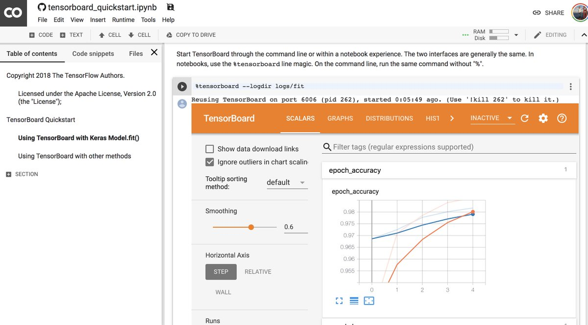

Josh Gordon on Twitter

 [    **Josh Gordon**‏ @**random_forests**](https://twitter.com/random_forests)

Good news! TensorBoard now works in Jupyter Notebooks, via magic commands "%" that match the command line. Example: [https://colab.research.google.com/github/tensorflow/tensorboard/blob/master/docs/r2/tensorboard_quickstart.ipynb …](https://t.co/5rtcpyhXSG)

 

   3:50 PM - 26 Feb 2019

- [**472** Retweets]()

- [**1,433** Likes]()

-                 

     27 replies          472 retweets          1,433 likes