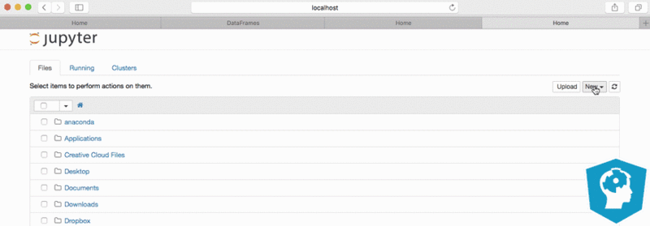
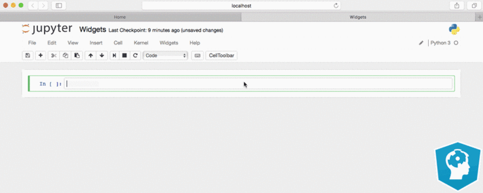

Jupyter Notebook Tutorial: The Definitive Guide

- A [basic overview](https://www.datacamp.com/community/tutorials/tutorial-jupyter-notebook#WhatIs) of the Jupyter Notebook App and its components,
- The [history of Jupyter Project](https://www.datacamp.com/community/tutorials/tutorial-jupyter-notebook##History) to show how it's connected to IPython,
- An overview of the [three most popular ways to run your notebooks](https://www.datacamp.com/community/tutorials/tutorial-jupyter-notebook##InstallJupyter): with the help of a Python distribution, with pip or in a Docker container,
- A [practical introduction](https://www.datacamp.com/community/tutorials/tutorial-jupyter-notebook##UseJupyter) to the components that were covered in the first section, complete with examples of Pandas DataFrames, an explanation on how to make your notebook documents magical, and answers to frequently asked questions, such as "How to toggle between Python 2 and 3?", and
- [The best practices and tips](https://www.datacamp.com/community/tutorials/tutorial-jupyter-notebook##NotebookExamples) that will help you to make your notebook an added value to any data science project!

(To practice pandas dataframes in Python, try [this course on Pandas foundations.](https://www.datacamp.com/courses/pandas-foundations))

## [What Is A Jupyter Notebook?]()

In this case, "notebook" or "notebook documents" denote documents that contain both code and rich text elements, such as figures, links, equations, ... Because of the mix of code and text elements, these documents are the ideal place to bring together an analysis description and its results as well as they can be executed perform the data analysis in real time.

These documents are produced by the Jupyter Notebook App.
We'll talk about this in a bit.

For now, you should just know that "Jupyter" is a loose acronym meaning Julia, Python, and R. These programming languages were the first target languages of the Jupyter application, but nowadays, the notebook technology also supports [many other languages](http://github.com/ipython/ipython/wiki/IPython-kernels-for-other-languages).

And there you have it: the Jupyter Notebook.

As you just saw, the main components of the whole environment are, on the one hand, the notebooks themselves and the application. On the other hand, you also have a notebook kernel and a notebook dashboard.

Let's look at these components in more detail.

### What Is The Jupyter Notebook App?

As a server-client application, the Jupyter Notebook App allows you to edit and run your notebooks via a web browser. The application can be executed on a PC without Internet access or it can be installed on a remote server, where you can access it through the Internet.

Its two main components are the kernels and a dashboard.

A kernel is a program that runs and introspects the user’s code. The Jupyter Notebook App has a kernel for Python code, but there are also kernels available for other programming languages.

The dashboard of the application not only shows you the notebook documents that you have made and can reopen but can also be used to manage the kernels: you can which ones are running and shut them down if necessary.

## [The History of IPython and Jupyter Notebooks]()

To fully understand what the Jupyter Notebook is and what functionality it has to offer you need to know how it originated.

Let's back up briefly to the late 1980s. Guido Van Rossum begins to work on Python at the National Research Institute for Mathematics and Computer Science in the Netherlands.

Wait, maybe that's too far.

Let's go to late 2001, twenty years later. Fernando Pérez starts developing IPython.

In 2005, both Robert Kern and Fernando Pérez attempted building a notebook system. Unfortunately, the prototype had never become fully usable.

Fast forward two years: the IPython team had kept on working, and in 2007, they formulated another attempt at implementing a notebook-type system. By October 2010, there was a prototype of a web notebook and in the summer of 2011, this prototype was incorporated and it was released with 0.12 on December 21, 2011. In subsequent years, the team got awards, such as the Advancement of Free Software for Fernando Pérez on 23 of March 2013 and the Jolt Productivity Award, and funding from the Alfred P. Sloan Foundations, among others.

Lastly, in 2014, Project Jupyter started as a spin-off project from IPython. IPython is now the name of the Python backend, which is also known as the kernel. Recently, the next generation of Jupyter Notebooks has been introduced to the community. It's called JupyterLab. Read more about it [here](http://blog.jupyter.org/2016/07/14/jupyter-lab-alpha/).

After all this, you might wonder where this idea of notebooks originated or how it came about to the creators.

A brief research into the history of these notebooks learns that Fernando Pérez and Robert Kern were working on a notebook just at the same time as the Sage notebook was a work in progress. Since the layout of the Sage notebook was based on the layout of Google notebooks, you can also conclude that also Google used to have a notebook feature around that time.

For what concerns the idea of the notebook, it seems that Fernando Pérez, as well as William Stein, one of the creators of the Sage notebook, have confirmed that they were avid users of the Mathematica notebooks and Maple worksheets. The Mathematica notebooks were created as a front end or GUI in 1988 by Theodore Gray.

The concept of a notebook, which contains ordinary text and calculation and/or graphics, was definitely not new.

Also, the developers had close contact with one another and this, together with other failed attempts at GUIs for IPython and the use of "AJAX" = web applications, which didn't require users to refresh the whole page every time you do something, were two other motivations for the team of William Stein to start developing the Sage notebooks.

If you want to know more details, check out the personal accounts of [Fernando Pérez](http://blog.fperez.org/2012/01/ipython-notebook-historical.html) and [William Stein](https://groups.google.com/forum/#!topic/sage-devel/uc9HIMREh9Y) about the history of their notebooks.

## [How To Install Jupyter Notebook]()

### Running Jupyter Notebooks With The Anaconda Python Distribution

One of the requirements here is Python, either Python 3.3 or greater or Python 2.7. The general recommendation is that you use the Anaconda distribution to install both Python and the notebook application.

The advantage of Anaconda is that you have access to over 720 packages that can easily be installed with Anaconda's conda, a package, dependency, and environment manager. You can download and follow the instructions for the installation of Anaconda [here](https://www.continuum.io/downloads).

Is something not clear? You can always read up on the Jupyter installation instructions [here](https://jupyter.readthedocs.io/en/latest/install.html).

### Running Jupyter Notebook The Pythonic Way: Pip

If you don't want to install Anaconda, you just have to make sure that you have the latest version of pip. If you have installed Python, you will normally already have it.

What you do need to do is upgrading pip:

	*# On Windows*
	python -m pip install -U pip setuptools
	*# On OS X or Linux*
	pip install -U pip setuptools

Once you have pip, you can just run

	*# Python2*
	pip install jupyter
	*# Python 3*
	pip3 install jupyter

If you need more information about installing packages in Python, you can go to [this page](https://packaging.python.org/installing/).

### Running Jupyter Notebooks in Docker Containers

Docker is an excellent platform to run software in containers. These containers are self-contained and isolated processes.

This sounds a bit like a virtual machine, right?

Not really. Go [here](https://blog.docker.com/2016/03/containers-are-not-vms/) to read an explanation on why they are different, complete with a fantastic house metaphor.

You can easily get started with Docker if you install the [Docker Toolbox](https://www.docker.com/products/docker-toolbox): it contains all the tools you need to get your containers up and running. Follow the installation instructions, select the "Docker QuickStart Terminal" and indicate to install the Kitematic Visual Management tool too if you don't have it or any other virtualization platform installed.

The installation through the Docker Quickstart Terminal can take some time but then you're good to go. Use the command `docker run` to run Docker "images". You can consider these images as pre-packaged bundles of software that can be automatically downloaded from the [Docker Hub](https://hub.docker.com/) when you run them.

Tip: browse the [Docker Image Library](https://hub.docker.com/explore/) for thousands of the most popular software tools. You will find also other notebooks that you can run in your Docker container, such as the Data Science Notebook, the R Notebook, and many more.

To run the official Jupyter Notebook image in your Docker container, give in the following command in your Docker Quickstart Terminal:

`docker run --rm -it -p 8888:8888 -v "$(pwd):/notebooks" jupyter/notebook `

Tip: if you want to download other images, such as the Data Science Notebook that has been mentioned above, you just have to replace the "`Jupyter/notebook`" bit by the Repository name you find in the Docker Image Library, such as "`Jupyter/datascience-notebook`".

The newest Jupyter HTML Notebook image will be downloaded and it will be started, or you can open the application. Continue to read to see how you can do that!

## [How To Use Jupyter Notebooks]()

Now that you know what you'll be working with and you have installed it, it's time to get started for real!

### Getting Started With Jupyter Notebooks

Run the following command to open up the application:
`jupyter notebook`

Then you'll see the application opening in the web browser on the following address: http://localhost:8888. This all is demonstrated in the gif below:

The "Files" tab is where all your files are kept, the "Running" tab keeps track of all your processes and the third tab, "Clusters", is provided by IPython parallel, IPython's parallel computing framework. It allows you to control many individual engines, which are an extended version of the IPython kernel.

You probably want to start by making a new notebook.

You can easily do this by clicking on the "New button" in the "Files tab". You see that you have the option to make a regular text file, a folder, and a terminal. Lastly, you will also see the option to make a Python 3 notebook.

Note that this last option will depend on the version of Python that you have installed. Also, if the application shows python [conda root] and python [default] as kernel names instead of Python 3, you can try executing `conda remove _nb_ext_conf` or read up on [the following Github issue](https://github.com/jupyter/notebook/issues/1716) and make the necessary adjustments.

Let's start first with the regular text file. When it open up, you see that this looks like any other text editor. You can toggle the line numbers or/and the header, you can indicate the programming language you're writing and you can do a find and replace. Furthermore, you can save, rename or download the file or make a new file.

You can also make folders to keep all your documents organized together. Just press the "Folder" option that appears when you press the "New" button in your initial menu and a new folder will appear in your overview. You can best rename the folder instantly, as it will appear as a folder with name 'Untitled Folder'.

Thirdly, the terminal is there to support browser-based interactive terminal sessions. It basically works just like your terminal or cmd application! Give in `python` into the terminal, press ENTER, and you're good to go.

Tip: if you would ever need a pure IPython terminal, you can just type 'ipython' in your Terminal or Cmd. This can come in handy when, for example, you want to get more clear error messages than the ones that appear in the terminal when you're running the notebook application.

If you want to start on your notebook, go back to the main menu and click the "Python 3" option in the "Notebook" category.

You will immediately see the notebook name, a menu bar, a toolbar and an empty code cell:

You can immediately start with importing the necessary libraries for your code. This is one of the best practices that we will discuss in more detail later on.

After, you can add, remove or edit the cells according to your needs. And don't forget to insert explanatory text or titles and subtitles to clarify your code! That's what makes a notebook a notebook in the end.

Tip: if you want to insert LaTex in your code cells, you just have to put your LaTeX math inside`$$`, just like this:

`$$c = \sqrt{a^2 + b^2}$$`
You can also choose to display your LaTex output:

	from IPython.display import display, Math, Latex
	display(Math(r'\sqrt{a^2 + b^2}'))

Are you not sure what a whole notebook looks like? Hop over to [the last section](https://www.datacamp.com/community/tutorials/tutorial-jupyter-notebook##NotebookExamples) to discover the best ones out there!

### Toggling Between Python 2 and 3 in Jupyter Notebooks

Up until now, working with notebooks has been quite straightforward.

But what if you don't just want to use Python 3 or 2? What if you want to change between the two?

Luckily, the kernels can solve this problem for you! You can easily create a new conda environment to use different notebook kernels:

	*# Python 2.7*
	conda create -n py27 python=2.7 ipykernel
	*# Python 3.5*
	conda create -n py35 python=3.5 ipykernel

Restart the application and the two kernels should be available to you. Very important: don't forget to (de)activate the kernel you (don't) need with the following commands:

	source activate py27
	source deactivate

If you need more information, go to [this page](http://conda.pydata.org/docs/using/envs.html).

You can also manually register your kernels, for example:

	conda create -n py27 python=2.7
	source activate py27
	conda install notebook ipykernel
	ipython kernel install *--user*

To configure the Python 3.5 environment, you can just use the same commands but replace `py27` by `py35` and the version number by `3.5`.

Alternatively, if you're working with Python 3 and you want to set up a Python 2 kernel, you can also do this:

	python2 -m pip install ipykernel
	python2 -m ipykernel install *--user*

### Running R in Your Jupyter Notebook

As the explanation of the kernels in the [first section](https://www.datacamp.com/community/tutorials/tutorial-jupyter-notebook#WhatIs) already suggested, you can also run other languages besides Python in your notebook!

If you want to use R with Jupyter Notebooks but without running it inside a Docker container, you can run the following command to install the R essentials in your current environment:

`conda install -c r r-essentials`

These "essentials" include the packages [`dplyr`](https://www.rdocumentation.org/packages/dplyr/versions/0.5.0), [`shiny`](https://www.rdocumentation.org/packages/shiny/versions/0.14.2), [`ggplot2`](https://www.rdocumentation.org/packages/ggplot2/versions/2.2.0), [`tidyr`](https://www.rdocumentation.org/packages/tidyr/versions/0.6.0), [`caret`](https://www.rdocumentation.org/packages/caret/versions/6.0-73) and [`nnet`](https://www.rdocumentation.org/packages/nnet/versions/7.3-12). If you don't want to install the essentials in your current environment, you can use the following command to create a new environment just for the R essentials:

`conda create -n my-r-env -c r r-essentials `

Open up the notebook application to start working with R with the usual command.

If you now want to install additional R packages to elaborate your data science project, you can either build a Conda R package by running, for example:

	conda skeleton cran ldavis
	conda build r-ldavis/

Or you can install the package from inside of R via `install.packages` or `devtools``::install_github` (from GitHub). You just have to make sure to add new package to the correct R library used by Jupyter:

`install.packages("ldavis", "/home/user/anaconda3/lib/R/library")`

Note that you can also install the IRKernel, a kernel for R, to work with R in your notebook. You can follow the installation instructions [here](https://irkernel.github.io/installation/).

Note that you also have kernels to run languages such as Julia, SAS, ... in your notebook. Go [here](https://github.com/ipython/ipython/wiki/IPython-kernels-for-other-languages) for a complete list of the kernels that are available. This list also contains links to the respective pages that have installation instructions to get you started.

Tip: if you're still unsure of how you would be working with these different kernels or if you want to experiment with different kernels yourself, go to [this page](https://try.jupyter.org/), where you can try out kernels such as Apache Toree (Scala), Ruby, Julia, ...

### Making Your Jupyter Notebook Magical

If you want to get the most out of your notebooks with the IPython kernel, you should consider learning about the so-called "magic commands". Also, consider adding even more interactivity to your notebook so that it becomes an interactive dashboard to others should be one of your considerations!

**The Notebook's Built-In Commands**

There are some predefined ‘magic functions’ that will make your work a lot more interactive.

To see which magic commands you have available in your interpreter, you can simply run the following:

`%lsmagic`

Tip: the regular Python `help()` function also still works and you can use the magic command `%quickref` to show a quick reference sheet for IPython.

And you'll see a whole bunch of them appearing. You'll probably see some magics commands that you'll grasp, such as `%save`, `%clear` or `%debug`, but others will be less straightforward.

If you're looking for more information on the magics commands or on functions, you can always use the `?`, just like this:

	*# Retrieving documentation on the alias_magic command*
	?%alias_magic

	*# Retrieving information on the range() function*
	?range

Note that if you want to start a single-line expression to run with the magics command, you can do this by using `%` . For multi-line expressions, use `&&` . The following example illustrates the difference between the two:

	%time x = range(100)
	%%timeit x = range(100)
	    max(x)

Stated differently, the magic commands are either line-oriented or cell-oriented. In the first case, the commands are prefixed with the `%` character and they work as follows: they get as an argument the rest of the line. When you want to pass not only the line but also the lines that follow, you need cell-oriented magic: then, the commands need to be prefixed with `%%`.

Besides the `%time` and `%timeit `magics, there are some other magic commands that will surely come in handy:

|     |     |
| --- | --- |
| %pdb | Debug |
| %prun | Do a performance run |
| %writefile | Saves the contents of a cell to an external file |
| %pycat | Shows the syntax highlighted contents of an external file |
| %who | List all variables of a global scope |
| %store | Pass variables between notebooks |
| %load | Insert code from an external script |
| %run | Execute Python code |
| %env | Set environment variables |

Note that this is just a short list of the handy magic commands out there. There are many more that you can discover with `%lsmagic`.

You can also use magics to mix languages in your notebook with the IPython kernel without setting up extra kernels: there is `rmagics` to run R code, SQL for RDBMS or Relational Database Management System access and `cythonmagic` for interactive work with `cython`,... But there is so much more!

To make use of these magics, you first have to install the necessary packages:

	pip install ipython-sql
	pip install cython
	pip install rpy2

Tip: if you want to install packages, you can also execute these commands as shell commands from inside your notebook by placing a `! `in front of the commands, just like this:

	*# Check, manage and install packages*
	!pip list
	!pip install ipython-sql

	*# Check the files in your working directory*
	!ls

Only then, after a successful install, can you load in the magics and start using them:

	%load_ext sql
	%load_ext cython
	%load_ext rpy2.ipython

Let's demonstrate how the magics exactly work with a small example:

	*# Hide warnings if there are any*
	import warnings
	warnings.filterwarnings('ignore')

	*# Load in the r magic*
	%load_ext rpy2.ipython

	*# We need ggplot2*
	%R require(ggplot2)

	*# Load in the pandas library*
	import pandas as pd

	*# Make a pandas DataFrame*
	df = pd.DataFrame({'Alphabet': ['a', 'b', 'c', 'd','e', 'f', 'g', 'h','i'],
	                   'A': [4, 3, 5, 2, 1, 7, 7, 5, 9],
	                   'B': [0, 4, 3, 6, 7, 10, 11, 9, 13],
	                   'C': [1, 2, 3, 1, 2, 3, 1, 2, 3]})

	*# Take the name of input variable df and assign it to an R variable of the same name*
	%%R -i df

	*# Plot the DataFrame df*
	ggplot(data=df) + geom_point(aes(x=A, y=B, color=C))

This is just an initial not nearly everything you can do with R magics, though. You can also push variables from Python to R and pull them again to Python. Read up on the documentation (with easily accessible examples!) [here](https://ipython.org/ipython-doc/2/config/extensions/rmagic.html).

**Interactive Notebooks As Dashboards: Widgets**

The magic commands already do a lot to make your workflow with notebooks agreeable, but you can also take additional steps to make your notebook an interactive place for others by adding widgets to it!

To add widgets to your notebook, you need to import `widgets` from `ipywidgets:`

`from ipywidgets import widgets`

That's enough to get started! You might want to think now of what type of widget you want to add. The basic types of widgets are text input, buttons, and input-based widgets.

See an example of a text input widget below:

This example was taken from a wonderful tutorial on building interactive dashboards in Jupyter, which you can find on [this page](https://blog.dominodatalab.com/interactive-dashboards-in-jupyter/).

### Share Your Jupyter Notebooks

In practice, you might want to share your notebooks with colleagues or friends to show them what you have been up to or as a data science portfolio for future employers. However, the notebook documents are JSON documents that contain text, source code, rich media output, and metadata. Each segment of the document is stored in a cell.

Ideally, you don't want to go around and share JSON files.

That's why you want to find and use other ways to share your notebook documents with others.

When you create a notebook, you will see a button in the menu bar that says "File". When you click this, you see that Jupyter gives you the option to download your notebook as an HTML, PDF, Markdown or reStructuredText, or a Python script or a Notebook file.

You can use the `nbconvert` command to convert your notebook document file to another static format, such as HTML, PDF, LaTex, Markdown, reStructuredText, ... But don't forget to import `nbconvert` first if you don't have it yet!

Then, you can give in something like the following command to convert your notebooks:

`jupyter nbconvert --to html Untitled4.ipynb`

With `nbconvert`, you can make sure that you can calculate an entire notebook non-interactively, saving it in place or to a variety of other formats. The fact that you can do this makes notebooks a powerful tool for ETL and for reporting. For reporting, you just make sure to schedule a run of the notebook every so many days, weeks or months; For an ETL pipeline, you can make use of the magic commands in your notebook in combination with some type of scheduling.

Besides these options, you could also consider the following:

- You can create, list and load GitHub Gists from your notebook documents. You can find more information [here](https://github.com/mozilla/jupyter-notebook-gist). Gists are a way to share your work because you can share single files, parts of files, or full applications.
- With [jupyterhub](https://github.com/jupyterhub/jupyterhub), you can spawn, manage, and proxy multiple instances of the single-user Jupyter notebook server. In other words, it's a platform for hosting notebooks on a server with multiple users. That makes it the ideal resource to provide notebooks to a class of students, a corporate data science group, or a scientific research group.
- Make use of [binder](https://github.com/binder-project/binder) and [tmpnb](https://github.com/jupyter/tmpnb) to get temporary environments to reproduce your notebook execution.
- You can use [nbviewer](https://github.com/jupyter/nbviewer) to render notebooks as static web pages.
- To turn your notebooks into slideshows, you can turn to [nbpresent](https://github.com/Anaconda-Platform/nbpresent) and [RISE](https://github.com/damianavila/RISE).
- [jupyter_dashboards](https://github.com/jupyter-incubator/dashboards) will come in handy if you want to display notebooks as interactive dashboards.
- Create a blog from your notebook with [Pelican](https://github.com/danielfrg/pelican-ipynb) plugin.

## [Jupyter Notebooks in Practice]()

This all is very interesting when you're working alone on a data science project. But most times, you're not alone. You might have some friends look at your code or you'll need your colleagues to contribute to your notebook.

How should you actually use these notebooks in practice when you're working in a team?

The following tips will help you to effectively and efficiently use notebooks on your data science project.

### Tips To Effectively and Efficiently Use Your Jupyter Notebooks

Using these notebooks doesn't mean that you don't need to follow the coding practices that you would usually apply.

You probably already know the drill, but these principles include the following:

- Try to provide comments and documentation to your code. They might be a great help to others!
- Also consider a consistent naming scheme, code grouping, limit your line length, ...
- Don't be afraid to refactor when or if necessary

In addition to these general best practices for programming, you could also consider the following tips to make your notebooks the best source for other users to learn:

- Don't forget to name your notebook documents!
- Try to keep the cells of your notebook simple: don't exceed the width of your cell and make sure that you don't put too many related functions in one cell.
- If possible, import your packages in the first code cell of your notebook, and
- Display the graphics inline. The magic command `%matplotlib ``inline` will definitely come in handy to suppress the output of the function on a final line. Don't forget to add a semicolon to suppress the output and to just give back the plot itself.
- Sometimes, your notebook can become quite code-heavy or maybe you just want to have a cleaner report. In those cases, you could consider hiding some of this code. You can already hide some of the code by using magic commands such as `%run` to execute a whole Python script as if it was in a notebook cell. However, this might not help you to the extent that you expect. In such cases, you can always check out [this tutorial](http://chris-said.io/2016/02/13/how-to-make-polished-jupyter-presentations-with-optional-code-visibility/) on optional code visibility or consider [toggling](http://blog.nextgenetics.net/?e=102) your notebook's code cells.

### Jupyter Notebooks for Data Science Teams: Best Practices

Jonathan Whitmore wrote in his [article](https://www.svds.com/tbt-jupyter-notebook-best-practices-data-science/?utm_source=kdnuggets&utm_medium=referral) some practices for using notebooks for data science and specifically addresses the fact that working with the notebook on data science problems in a team can prove to be quite a  challenge.

That is why Jonathan suggests some best practices:

- Use two types of notebooks for a data science project, namely, a lab notebook and a deliverable notebook. The difference between the two (besides the obvious that you can infer from the names that are given to the notebooks) is the fact that individuals control the lab notebook, while the deliverable notebook is controlled by the whole data science team,
- Use some type of versioning control (Git, Github, ...). Don't forget to commit also the HTML file if your version control system lacks rendering capabilities, and
- Use explicit rules on the naming of your documents.

### Learn From The Best Notebooks

This section is meant to give you a short list with some of the best notebooks that are out there so that you can get started on learning from these examples.

- Notebooks are also used to complement books, such as the Python Data Science Handbook. You can find the notebooks [here](https://github.com/jakevdp/PythonDataScienceHandbook).
- A report on a Kaggle competition is written down in [this blog](http://danielfrg.com/blog/2013/03/07/kaggle-bulldozers-basic-cleaning/), generated from a notebook.
- This [matplotlib](http://nbviewer.jupyter.org/github/jrjohansson/scientific-python-lectures/blob/master/Lecture-4-Matplotlib.ipynb)[tutorial](http://nbviewer.jupyter.org/github/jrjohansson/scientific-python-lectures/blob/master/Lecture-4-Matplotlib.ipynb) is a great example of how well a notebook can serve as a means of teaching other people topics such as scientific Python.
- Lastly, make sure to also check out [The Importance of Preprocessing in Data Science and the Machine Learning Pipeline](https://www.datacamp.com/community/tutorials/the-importance-of-preprocessing-in-data-science-and-the-machine-learning-pipeline-i-centering-scaling-and-k-nearest-neighbours) tutorial series that was generated from a notebook.

Note that this list is definitely not exhaustive. There are many more notebooks out there!

You will find that many people regularly compose and have composed lists with interesting notebooks. Don't miss this [gallery of interesting IPython notebooks](https://github.com/ipython/ipython/wiki/A-gallery-of-interesting-IPython-Notebooks) or [this KD Nuggets](http://www.kdnuggets.com/2016/04/top-10-ipython-nb-tutorials.html) article.