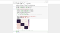
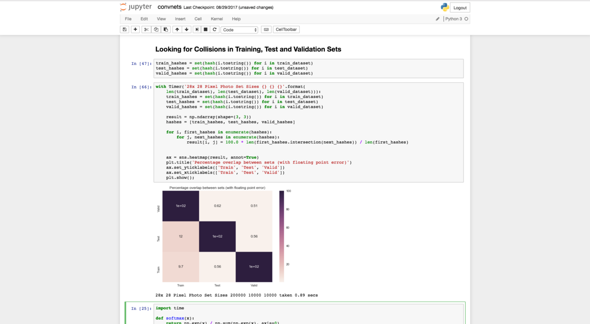
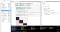
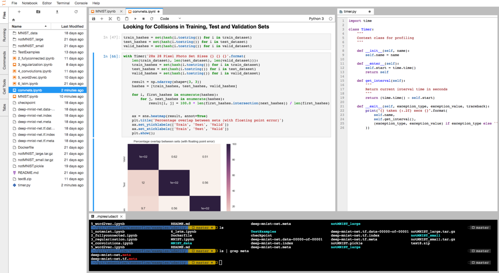

Jupyter Notebooks are Breathtakingly Featureless — Use Jupyter Lab

# Jupyter Notebooks are Breathtakingly Featureless — Use Jupyter Lab

We love Jupyter Notebooks, the notebook format is an effective way to construct your data narrative. But the in-browser IDE is simply feature free, and hardly provides the same incredible editing power of Atom, VS Code, Sublime or even RStudio. Because of this, the gap between data science and data engineering from a workflow perspective remains wide. Let’s shorten that gap.

Jupyter Notebook

Let’s have a look at the typical data scientist workflow. They pull open a notebook, import some data, do some exploratory analysis and build a model. If they find something novel, they may want it to be implemented in production.

*How close is the current notebook representation of the solution to the production implementation?* It’s incredibly far away.

Portions of notebook are reusable, the visualizations we’ll probably leave out, hopefully some functions are defined. But here’s where the limitations of the Jupyter Notebook really start to show.

*Where is my file tree*? It’s difficult to keep a clean, managed repository if my file tree isn’t readily visible. Needless to say, we would also like some basic tabbing functionality, to have more than one document open at a time. *How do I move my code quickly into python scripts?*  *Where is my terminal? *I know I can view raw data by importing and displaying it with pandas, but lets face it, that pales in comparison to RStudio’s file viewer — where is *my *legit csv viewer? *And* w*hat is with all this wasted space on the left and right of my Jupyter Notebook?*

It is due to the strength of Python as a language, and the notebook document as a means of presenting a narrative that Jupyter Notebooks have remained competitive with RStudio — **not due to Jupyter’s actual features**.

Of course all of these things are solvable with additional windows. But we don’t make those types of compromises with our editors and IDE’s. Atom provides you with tabbing functionality, extensive hotkey flexibility, a file tree (that you can close), and almost anything else you can imagine in an editor.

[Jupyter Lab](https://github.com/jupyterlab/jupyterlab) provides these basic expectations for functionality in it’s *Alpha *offering;even though product is still in development, it’s features already eclipse that of the original Jupyter Notebook.

Jupyter Lab

At their [PyData Seattle](https://www.youtube.com/watch?v=dSjvK-Z3o3U) talk on Jupyter Lab, the authors demonstrate opening a 1 trillion row by 1 trillion column csv (and effortlessly scrolling left and right across the columns), as well as realtime collaboration using the Jupyter Lab Google Drive extension, OOTB Vega and GeoJSON compatibility, and plenty of other incredible features.

Two invariants exist with respect to Jupyter Lab and Jupyter Notebooks.
1. The notebook document is identical (your old documents still work).
2. The notebook server is identical (your integrations still work).

I wrote this because I recently demoed Jupyter Lab to several of of my colleagues. Their response? *“Why hadn’t I heard about this yet?”* These features are long overdue, I think it’s time we make the switch and nudge our day to day data science a few steps closer to production code.