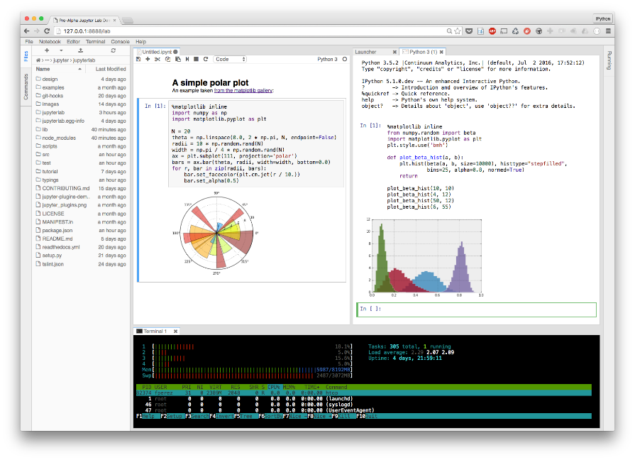
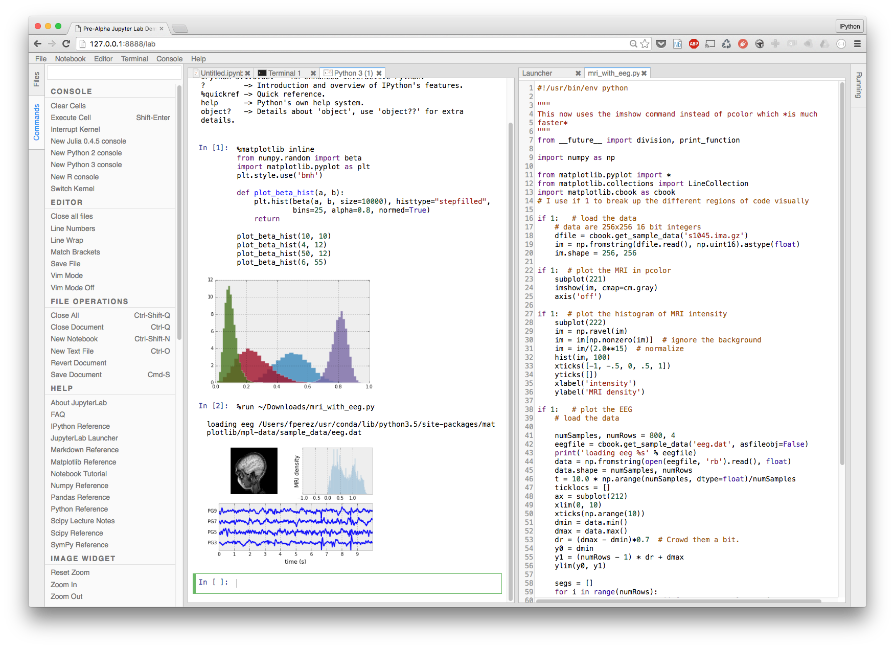

JupyterLab: the next generation of the Jupyter Notebook

## Learning the lessons of the Jupyter Notebook

It's been a long time in the making, but today we want to start engaging our community with an early (pre-alpha) release of the next generation of the Jupyter Notebook application, which we are calling [JupyterLab](https://github.com/jupyter/jupyterlab).

At the [SciPy 2016 conference](http://scipy2016.scipy.org/), Brian Granger and Jason Grout presented ([PDF of talk slides](http://archive.ipython.org/media/SciPy2016JupyterLab.pdf) and [video](https://www.youtube.com/watch?v=Ejh0ftSjk6g&list=PLYx7XA2nY5Gf37zYZMw6OqGFRPjB1jCy6&index=58)) the overall vision of the system and gave a demo of its current capabilities, which are rapidly evolving and improving:

JupyterLab captures a lot of what we have learned from the usage patterns of the Notebook application over the last 5 years and seeks to build a clean and robust foundation that will let us not only offer an improved user interface and experience, but also a flexible and extensible environment for interactive computing.

In reality, even today's "Jupyter Notebook" is a bit of a misnomer: the Notebook application includes not only support for Notebooks but also a file manager, a text editor, a terminal emulator, a monitor for running Jupyter processes, an IPython cluster manager and a pager to display help. And that is just what ships "out of the box", without counting the many third-party extensions for it. This rich toolset evolved organically, driven by the needs of our users and developers, even if we kept the increasingly ill-fitting "Notebook" name for the whole thing.

But the underlying code was showing its age: it wasn't the cleanest to extend and many APIs that were somewhat experimental and incomplete had become "official" by virtue of being used in the wild. Providing a more responsive and flexible UI atop the current codebase was difficult. So, in a collaborative effort between the Jupyter team, [Tech at Bloomberg](http://techatbloomberg.com/) and [Continuum Analytics](https://www.continuum.io/), we set out to build a next-generation architecture to support all of the above tools, but with a flexible and responsive UI, offering user-controlled layout that could tie together our tools under a single roof.

A detailed account of this collaboration between our teams is available [at the Tech at Bloomberg Blog](http://techatbloomberg.com/blog/inside-the-collaboration-that-built-the-open-source-jupyterlab-project).

## A glimpse of JupyterLab

While the system is still in alpha state and many features are missing, we can already see the kinds of user experiences it enables. Here we see how you can arrange a notebook next to a graphical console (a web-based version of our standalone QtConsole) atop a terminal that is monitoring the system, while keeping the file manager on the left:

With a few clicks, you can reorganize the workspace to expose the Command Palette to access all JupyterLab functions, keeping the graphical console side-by-side with a text editor containing a Python script that you then `%run` from the console, producing inline figures:

These examples illustrate how the new system, based on [Continuum's flexible PhosphorJS framework](http://phosphorjs.github.io/), gives us the foundation for a richer, cleaner UI. JupyterLab adapts easily to multiple workflow needs, letting you move from a Notebook/narrative focus to a script/console one. It exposes the Jupyter tools we all use daily and will let both the core team and the entire community develop many new ones that take advantage of the Jupyter architecture. The entire JupyterLab is built as a collection of plugins that talk to kernels for code execution and that can communicate with one another. We hope the community will develop many more plugins for new use cases that go far beyond the basic system.

Even in its current alpha state we are very excited about the possibilities. If you are willing to play with very early code, you can [follow the instructions on the repo](https://github.com/jupyter/jupyterlab) and join us in helping test and refine the system.

This effort is the fruit of an [open collaboration](http://techatbloomberg.com/blog/inside-the-collaboration-that-built-the-open-source-jupyterlab-project) between our industry partners at Bloomberg and Continuum and the Jupyter Team anchored at [UC Berkeley](http://bids.berkeley.edu/)/LBNL and CalPoly, funded by the [Helmsley Trust](http://helmsleytrust.org/), the [Gordon and Betty Moore Foundation](https://www.moore.org/) and the [Alfred P. Sloan Foundation](http://www.sloan.org/). We are extremely grateful for this support, and we hope to see in the future many more examples of similar partnerships between academia, philantrophic funders and industry.

To see it in action, you can watch Brian and Jason's SciPy'16 presentation here:

[JupyterLab: Building Blocks for Interactive Computing | SciPy 2016 | Brian Granger](https://www.youtube.com/watch?list=PLYx7XA2nY5Gf37zYZMw6OqGFRPjB1jCy6&v=Ejh0ftSjk6g)