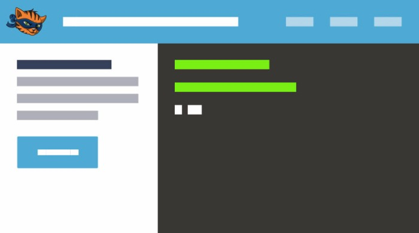
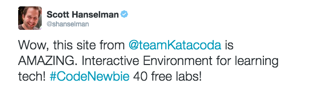
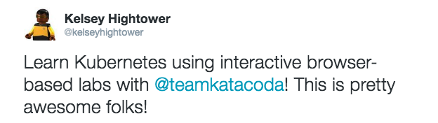
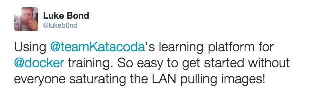
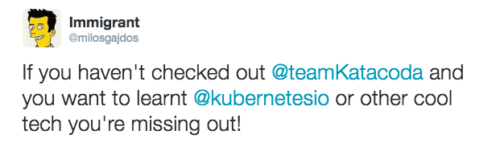
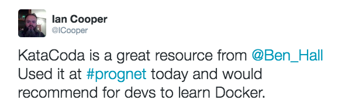
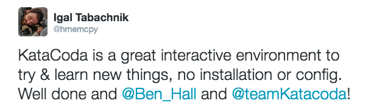
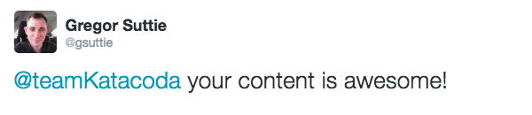

Katacoda - Interactive Learning Platform for Software Engineers

 [   # Katacoda Interactive Technical Learning Platform](https://katacoda.com/)

- [Learn](https://katacoda.com/learn)

- [Teach](https://katacoda.com/teach)

- [Embed](https://katacoda.com/embed)

- [Log In](https://katacoda.com/login)

- [Sign Up](https://katacoda.com/signup)

## Learn new technologies right in your browser

### Interactive Technical Learning Platform for Software Engineers

 

#### Learn these technologies (with more to come)

 **  **  **  **  **  **  **  **  **  **  **  **  **  **

## Free Courses

Over 100 interactive scenarios helping you solve real problems and learn new skills.

 [See All Scenarios](https://katacoda.com/learn)

### Most Popular Courses

 **  20 SCENARIOS

#### Docker & Containers

Learn how to deploy your applications using Docker
 [Start Course](https://katacoda.com/courses/docker)

 **  11 SCENARIOS

#### Kubernetes

Get started using Kubernetes
 [Start Course](https://katacoda.com/courses/kubernetes)

 **  2 SCENARIOS

#### Learn Prometheus

Learn how to use Prometheus metrics system
 [Start Course](https://katacoda.com/courses/prometheus)

 **  8 SCENARIOS

#### Docker in Production

Learn the best practices of deploying Docker into Production
 [Start Course](https://katacoda.com/courses/docker-production)

 **  10 SCENARIOS

#### Docker Swarm Mode

Learn how to manage a Docker cluster using Docker's Orchestration Swarm Mode
 [Start Course](https://katacoda.com/courses/docker-orchestration)

 **  10 SCENARIOS

#### Docker Security

Learn how to secure Docker Containers
 [Start Course](https://katacoda.com/courses/docker-security)

 **  7 SCENARIOS

#### Running .NET in Docker

Learn how to run .NET inside Docker Containers
 [Start Course](https://katacoda.com/courses/dotnet-in-docker)

 **  3 SCENARIOS

#### Running CoreOS

Learn how to use CoreOS
 [Start Course](https://katacoda.com/courses/coreos)

 **  10 SCENARIOS

#### Git Version Control

Learn how to be effective with Git version control
 [Start Course](https://katacoda.com/courses/git)

 **  1 SCENARIOS

#### Running DC/OS

Learn how to manage containers using DC/OS
 [Start Course](https://katacoda.com/courses/dcos)

 **  3 SCENARIOS

#### Weave Works

This set of labs explains how to deploy Weave Network and Weave Scope
 [Start Course](https://katacoda.com/courses/weave)

### Latest Courses

 **  1 SCENARIOS

#### Running Java in Docker

Learn how to deploy Java applications inside Containers
 [Start Course](https://katacoda.com/courses/java-in-docker)

 **  1 SCENARIOS

#### Learn CI/CD with Jenkins

Learn Continuous Integration and Delivery using Jenkins
 [Start Course](https://katacoda.com/courses/jenkins)

 **  1 SCENARIOS

#### Terraform

Use desired state configuration to manage your container infrastructure
 [Start Course](https://katacoda.com/courses/terraform)

## Open Source Projects

Learn about how different Open Source Projects can help solve your problems.
 [Create New Content](https://katacoda.com/teach/community)

### Latest Community Scenarios

 **  [By Portainer.io]()

#### Deploying Portainer

Learn Portainer, a simple management solution for Docker

 [Start Scenario](https://katacoda.com/portainer/scenarios/deploying-to-swarm)

 **  [By CoreDNS]()

#### Create a DNS Responder

Learn how DNS works with CoreDNS
 [Start Scenario](https://katacoda.com/courses/coredns/dns-responder)

 **  [By Traefik]()

#### Load Balance Containers using Traefik

Learn how manage external traffic with Traefik
 [Start Scenario](https://katacoda.com/courses/traefik/deploy-load-balancer)

## Playgrounds

Playgrounds give you a configured environment to start playing and exploring using an unstructured learning approach.

 [See All Playgrounds](https://katacoda.com/learn#playgrounds)

### Most Popular Playgrounds

 **  

#### CoreOS Playground

Experiment with CoreOS in a safe playground
 [Explore Playground](https://katacoda.com/courses/coreos/playground)

 **  

#### DC/OS Playground

Experiment with DC/OS in a safe playground
 [Explore Playground](https://katacoda.com/courses/dcos/playground)

 **  

#### Kubernetes Playground

Experiment with Kubernetes in a safe playground
 [Explore Playground](https://katacoda.com/courses/kubernetes/playground)

## How Katacoda Works

### Learn via real-world scenarios

 

#### Guided Path

Knowing what you need to know is the hardest part. Our guided pathways help build your knowledge around real-world scenarios.

 

#### Learn By Doing

The best way to learn its by doing. All our tutorials are interactive with pre-configured live environments ready for you to use.

 

#### Stay Up-To-Date

It's a competitive industry. Your skills need to keep up with the latest approaches. Katacoda keeps your skills up-to-date.

 

 

## Why Katacoda Exists

####  Katacoda's aim is to remove the barriers to new technologies and skills.

Katacoda provides a platform to build live interactive demo and training environments. Our environments can be customised to match your applications requirements. The step-by-step guided pathways are designed to ensure the user learns in the best way possible.

 [Start Learning](https://katacoda.com/learn)  [Start Teaching](https://katacoda.com/teach)

## What people are saying

- 

-
   

- 

-
   

- 

-
   

- 

© Ocelot Uproar Ltd 2017

 [Documentation](https://katacoda.com/docs) | [Press Kit](https://katacoda.com/press-kit) | [Careers](https://katacoda.com/careers) | [@teamKatacoda](http://twitter.com/teamKatacoda) | [Founders@Katacoda.com](https://katacoda.com/mailto:Founders@Katacoda.com) | [Ocelot Uproar Ltd](http://www.ocelotuproar.com/)