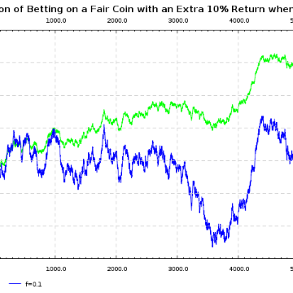

Kelly Criterion

Kelly Criterion

http://r6.ca/blog/20070816T193609Z.html?

Kelly Criterion 2007-08-16T19:36:09Z It’s fairly clear when one should buy a particular stock. One should buy stock when it is undervalued. What I have always wondered about is how much stock one should buy. A few months ago I stumbled upon the answer which is given by the Kelly criterion . It says that one should invest an amount to maximize one’s expected growth rate. Surprisingly, this gives a clear, easy to compute amount to invest. Consider the following scenario. You have $100 of funds available to play a coin flipping game against me. The coin is fair, but I am going to give you an edge. You will win whatever you bet and I will throw in an extra 10% if you win. Assume you can play as many times as you want and that I have so much more money than you do that I will never run out (think of me as a casino under new management). By scale invariance, it is clear that you should bet a constant percentage of your funds each round. The question is, “what percentage should you bet each round?”