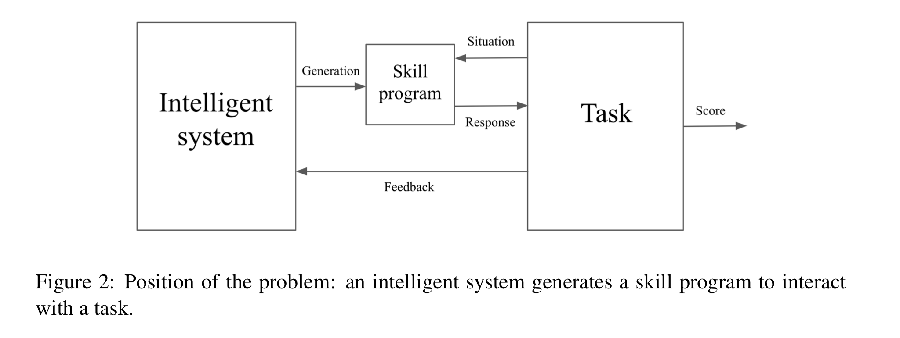
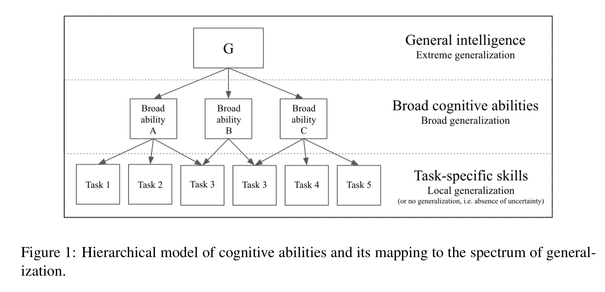
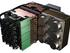

Keras inventor Chollet charts a new direction for AI: a Q&A | ZDNet

    must read:   [Got an Oyster card? TfL just locked your account, wants you to reset your password](https://www.zdnet.com/article/got-an-oyster-card-tfl-just-locked-your-account-to-make-you-reset-your-password/)

# Keras inventor Chollet charts a new direction for AI: a Q&A

Google scientist François Chollet has made a lasting contribution to AI in the wildly popular Keras application programming interface. He now hopes to move the field toward a new approach to intelligence. He talked with ZDNet about what he hopes to accomplish.

- 

- 

- 

- 

- 

-

 

By [Tiernan Ray](https://www.zdnet.com/meet-the-team/us/tiernan1/) | November 26, 2019 -- 19:39 GMT (19:39 GMT) | Topic: [Artificial Intelligence](https://www.zdnet.com/topic/artificial-intelligence/)

"A lot of well-funded, large-scale gradient-descent projects get carried out as a way to generate bombastic press articles that misleadingly suggest that human-level AI is perhaps a few years away," says Google scientist François Chollet. "Many people have staked a lot on this illusion. But it's still an illusion."

François Chollet, a scientist in Google's artificial intelligence unit, is a member of a new generation of pioneers in machine learning. In 2015, he introduced the world to an application programming interface that has become wildly popular for implementing deep learning networks, called [Keras](http://keras.io/). It is most commonly used as an interface to Google's TensorFlow framework. It vastly simplifies the matter of assembling neural networks of various sorts.

In that way, Chollet has helped in very concrete fashion to advance the development and testing of deep learning. It may seem surprising, then, that one of Chollet's foci at the moment is the very big picture of how to advance artificial intelligence beyond merely getting better on benchmarks.

Chollet is not entirely satisfied with where AI is at the moment. "A lot of well-funded, large-scale gradient-descent projects get carried out as a way to generate bombastic press articles that misleadingly suggest that human-level AI is perhaps a few years away," wrote Chollet in a communication with *ZDNet* in email. "Many people have staked a lot on this illusion. But it's still an illusion."

*ZDNet* reached out to Chollet after he published a paper three weeks ago offering a remarkable critique of deep learning's strengths and weaknesses. The paper, titled, *[On the Measure of Intelligence](https://arxiv.org/abs/1911.01547)*, proposes a new definition of intelligence, and materials to help scientists develop systems that may achieve it, called the "Abstraction and Reasoning Corpus," or ARC. ARC is a collection of challenges for intelligent systems, a new benchmark. The idea is to guide AI toward "more intelligent and more human-like artificial systems."

Chollet identifies as one of the chief limits of today's deep learning its obsession with incremental improvements on narrow skills tests.

Instead of drills on tests, ARC would lead to evaluating systems based on how efficient they are in the acquisition of skills. A solution to ARC, he hypothesizes, would be a system that has developed some "core knowledge priors," broad information about the world, such as object permanence, but different from what people casually call "common sense." The goal would be greater "generalization," meaning, an ability for a system to succeed in held-out, hidden tasks that have been designed to be solvable with those priors.

[Code for ARC is posted on GitHub.](https://github.com/fchollet/ARC)

Special Report: How 5G will transform business

What is 5G? The definitive guide to next generation wireless technology

Sponsored by EE

All this is "highly speculative," writes Chollet in the paper, and currently, "to the best of our knowledge, ARC does not appear to be approachable by any existing machine learning technique," he writes.

*ZDNet* asked Chollet several questions about the effort, which he answered in written form. The questions and the answers are printed below in their entirety.

In his written responses, Chollet describes ARC as a product of fifteen years of trying to "'understand the mind.'" He was lately triggered, he writes, by the "narrow-mindedness" of pronouncements he's heard made in the AI field, and an ahistoricity he observes in much recent work in reinforcement learning and such.

**Also: [High energy: Facebook's AI guru LeCun imagines AI's next frontier ](https://www.zdnet.com/article/high-energy-facebooks-ai-guru-lecun-imagines-ais-next-frontier/)**

Such systems have made amazing progress and are valuable, but they are not the "end-all-be-all," he writes. Deep learning looks up past data and performs interpolation, he observes. "But intelligence as I formally define it in the paper needs to feature extrapolation rather than mere interpolation."

Chollet's goal, he writes, is to "nudge researchers into looking at questions they're not currently asking, into trying ideas they would not normally pursue."

Chollet writes that he's made some progress toward solutions to ARC, and expresses hope others will too. It's so far led him into some "interesting and quite unique research directions."

**ZDNet:**  *Please describe briefly how you came to the train of thought that brought you to building ARC and writing the paper. What was your intellectual path to this point, however that question makes sense to you?*

**Francois Chollet: **This paper is my attempt to write down and formalize things I've been saying for many years, in talks, in blog posts or on Twitter, in personal conversations. I mean it to be actionable, useful to others, not merely a set of opinions -- a formal framework for rigorously expressing certain ideas about generalization and intelligence, and a concrete challenge for others to take on.

I've been trying to "understand" the mind (in a broad sense) as my primary area of focus for a long time, for the past 15 years or so. Initially I was coming at it from the perspective of neuropsychology and developmental psychology. I then moved towards AI, in particular "cognitive developmental robotics,'' which is the AI subfield I identified with as a university student -- building computational models of human cognitive developmental, sometimes physically embodied into robots or at least simulations. In 2009, I started working on a fairly ambitious general AI architecture I called ONEIROS (Open-ended Neuro-Electronic Intelligent Robot Operating System), which I worked on it for a few years before gradually moving on to other things. I am now using several of the ideas from that project as a basis for building an ARC solver. General AI research wasn't very popular back then, so at some point I had to pick up marketable skills and get a job. It has been a distraction, but I've never really stopped thinking about it.

Something that has been a trigger for me to write these ideas down has been the renewed interest in general AI and reinforcement learning over the past few years, and what I perceive as a certain narrow-mindedness and ahistoricity in the sweeping pronouncements I've been hearing about it. A lot of this paper is about bringing much-needed context and grounding to the discussion, and framing things in a historical perspective. Before you start coming up with sweeping answers, you need to know what the right questions are, and where these questions are coming from.

One model of how an intelligent system might be structured, according to Chollet.

F. Chollet, On the Measure of Intelligence.

**ZDNet:** *How do you hope the international community of researchers will receive ARC? What are your goals for it, especially given the mention of having AI competitions? Is the "hypothetical ARC solver" an immediate goal?*

**FC:** The goal is to nudge researchers into looking at questions they're not currently asking, into trying ideas they would not normally pursue. I want people to look at ARC and ask, what would it take to solve these tasks? The performance of existing techniques on ARC is basically zero, whereas humans can solve it without any prior training or explanations, so that's a big red neon sign saying that there's something going on here and that we're in need of novel ideas. ARC should serve both as a benchmark of progress and as a source of inspiration.

Personally, ARC has already led me towards interesting and quite unique research directions, and I have made decent progress on starting to solve it, reusing old ideas I've been playing with for a long time. I hope this will soon be true of other people as well. Fully solving ARC is probably not within immediate reach, but ARC as an AI challenge is at a level of conceptual difficulty where meaningful progress can be made right away. That was one of the goals: ARC would be pointless if it were impossible to approach it. The ideal challenge is something for which our performance starts at 0 -- which makes it intriguing and highlights the need for fresh ideas -- but very quickly becomes non-zero -- which is a sign that it is triggering substantial conceptual progress.

**Also: **[**Futurist Tim O'Reilly sees a human-computer symbiosis bigger than AI**](https://www.zdnet.com/article/futurist-tim-oreilly-sees-a-human-computer-symbiosis-bigger-than-ai/)

**ZDNet:**  *When will we know if ARC is having constructive effects? Meaning, is there a measure of its impact on the research community you expect or hope to see in the near- to intermediate-term?*

**FC:** I don't know how much interest it will generate in the first place. But I am reasonably hopeful. I don't care much for academic tokens of impact such as citations, so my personal metric of success will be the rate at which ARC gets solved. If it gets solved within a couple years, it was probably flawed and not sufficiently challenging. If our performance is still near-zero in 10 years, ARC would have been a valid challenge, but one not conducive to much progress. It will have been successful if we see a steady rate of meaningful progress over a span of several years. And of course, if the ideas and techniques that lead to this progress actually generalize, that is to say, if they eventually find useful applications in real-world systems. Pragmatically, the measure of success is your eventual impact on the world, not how much you capture the attention of AI researchers or the general public.

**ZDNet:** *What is the value of existing work on deep learning across the spectrum of efforts from DeepMind's work on AphaZero and AlphaStar to the many adaptations of Transformer (e.g., BERT, GPT2, XLNet, etc.), especially given your point on page 52 that no existing deep learning system appears able to solve ARC, and your comment on page 55 about the potential to "adapt" existing games or new tests? Are these deep learning systems valuable? Are they misguided? Are they squandering resources that should be spent in a different way?*

**FC: **I say this a lot, but deep learning is immensely valuable. What deep learning does is to map an input space X to a target space Y, via a geometric morphing, learned using large amounts of human-annotated data (or sometimes, data with automatically-generated annotations). So deep learning is pattern recognition, input-to-output mapping given a dense sampling of a data manifold. But it's very good at pattern recognition.

Being good at this is a game-changer in just about any industry. You can understand it as a way to encode and operationalize existing human abstractions -- to automate known solutions to known problems when we're in a position to collect a vast number of examples. This opens the door to a whole new world of automation. So to be clear, I'm not trying to downplay the profound significance of being good at this kind of thing. I've spent years of my life working on deep learning. I've seen it lead to solving countless problems that we thought impossible to solve just a few years ago. Always using the exact same basic recipe.

However, it would be a mistake to believe that existing deep learning techniques represent the end-all-be-all of AI. By construction, by training, what deep learning does is looking up past data and performing interpolation. This can implement local generalization -- at best, systems that can robustly do what they're trained to do, that can make sense of what they've seen before, that can handle the kind of uncertainty that their creators have planned for. But intelligence as I formally define it in the paper needs to feature extrapolation rather than mere interpolation -- it needs to implement broad or even extreme generalization, to adapt to unknown unknowns across previously unknown tasks. Intelligence is not curve-fitting.

This is something that deep learning is fundamentally not adapted for, and the practical results of the past few years give this view a resounding empirical confirmation. Deep learning models are brittle, extremely data-hungry, and do not generalize beyond their training data distribution. This is an inescapable consequence of what they are and how we train them. They can at best encode the abstractions we explicitly train them to encode, they cannot autonomously produce new abstraction. They simply don't have the machinery for it -- it's like expecting a car to start flying if only its wheel would turn fast enough. Cars can be very useful, but if you think they can go anywhere and are the only vehicle we're ever going to need, you're mistaken.

In my opinion, it is absolutely true that it is a waste of resources to be building single-use, special-purpose, multi-million dollar AI systems that play popular video games at superhuman level. It's a gimmick. The purpose of scientific research should be to answer open questions, to produce new technology -- in a word, to generate new knowledge that is relevant to the real world, knowledge that generalizes. The purpose of research should not be to generate splashy headlines to impress the public. These are multi-million dollar efforts that, in my opinion, do not teach us anything, and do not produce reusable artifacts that we can use to solve new problems. The state of our knowledge is the same at project completion as it was when the project started.

I know this is a very heretic thing to say in the current climate, where a lot of well-funded large- scale gradient-descent projects get carried out as a way to generate bombastic press articles that misleadingly suggest that human-level AI is perhaps a few years away. Many people have staked a lot on this illusion. But it's still an illusion.

One example of a test of broad cognitive ability, as Chollet conceives of it, a test for "objectness."

F. Chollet, On the Measure of Intelligence.

**ZDNet:**  *How should we reconcile your discussion of "priors" in this paper with past discussion of priors in deep learning, such as, for example, the notion that convolutions are a sort of "broad prior" underlying convolutional neural networks? Is your notion of priors contiguous/compatible with those notions of priors as described in the writings of, for example, Yann LeCun and Yoshua Bengio? (Cf., Lecun, Bengio, 2007, "[Scaling learning algorithms toward AI](http://yann.lecun.com/exdb/publis/pdf/bengio-lecun-07.pdf)", page 5, "The flat prior assumption must be rejected: some wiring must be simpler to specify (or more likely) than others. In what seems like an incredibly fortunate coincidence, a particularly good (if not "correct") wiring pattern happens to be one that preserves topology.")*

**FC:** I'm actually talking about the exact same kind of knowledge priors. Convolution in deep learning represents the double assumption that, if you have a 2D grid of variables encoding visual data, first, spatially close variables are more likely to be correlated than spatially distant variables, and second, spatial correlation patterns are independent from location (translation invariance). These assumptions are actually a subset of the objectness prior from Spelke's Core Knowledge theory.

In general, wiring topology in deep learning encodes assumptions about the structure of correlations in the input-cross-output space -- about the shape of the space of information. A good topology can dramatically reduce the size of the search space and can improve the feasibility of finding good input-output mappings via gradient descent (the big question in deep learning isn't so much whether your search space includes configurations that would solve your problem, but whether these configurations are learnable using gradient descent and the data you have available). This renders tractable problems that would be impossible to solve if you didn't make sufficient assumptions. To learn from data, you need to make assumptions about it. Such assumptions represent "prior knowledge about the external world" that belongs in the same category of priors as Core Knowledge.

**Also: [A computing visionary looks beyond today's AI](https://www.zdnet.com/article/a-computing-visionary-looks-beyond-todays-ai/)**

Traditional theories of intelligence organize cognition into levels, writes Chollet, which may have important implications for AI.

F. Chollet, On the Measure of Intelligence

**ZDNet:**  *What is the significance of stochasticity to intelligence? You have noted a process can be stochastic in several areas of the intelligent system you describe. Is stochasticity essential to the principles you've outlined, is it of marginal importance/disposable? Why or why not?*

**FC:** The real world and real intelligent agents (like animals or humans) have many factors of uncertainty, so a model of their interaction should account for this uncertainty by involving randomness and probability. But that is really a detail. The model of intelligence I proposed in the paper could be reformulated with deterministic tasks and deterministic intelligent systems without substantially changing the nature of the model and its conclusions. Although that would be quite a bit less realistic and quite a bit less general.

**ZDNet:** *Is there any value to a pursuit of intelligence that doesn't follow an "anthropocentric focus" as you put it on page 24? Some non-human intelligence?*

**FC:** Oh, absolutely. I do believe that intelligence that greatly differs from our own could exist and would have intrinsic value. But we probably won't call it "intelligence" if it isn't relatable. It is a fact that we only make sense of other minds, or value their cognitive abilities, relatively to our own. We recently started noticing that animals were intelligent only because of the ways their behavior resemble human behavior, because of the fact they seem to be able to solve problems that we value. If they weren't human-like in at least some ways, we wouldn't even *notice* -- much less value -- the richness or complexity of their information-processing abilities and their adaptation faculties. We don't perceive companies, markets, or science, to be intelligent -- yet they may be modelled as intelligent systems, and they often feature greater-than-human intelligence in a certain sense.

A good definition of intelligence should stay close to what people mean when they talk about intelligence. And humans have a fundamentally anthropocentric view of intelligence. So I believe it is necessary to explicitly acknowledge this fact, instead of using definitions of intelligence that ostensibly aspire to universality but that are implicitly describing human cognition and operating within a human value system.

**Also: **[**AI pioneer Sejnowski says it's all about the gradient**](https://www.zdnet.com/article/ai-pioneer-sejnowski-says-its-all-about-the-gradient/)

**ZDNet:** *Would a system like Keras take a different form if you had built it starting from what you've outlined here, or, asked differently, Is there a technology artifact similar to Keras that would be the output of the principles you've outlined here?*

**FC:** Given what I've learned from my ongoing attempts to solve ARC, I do believe that there will eventually be software frameworks that will package these principles in an easy-to-use way for developers to leverage them in their own intelligent applications. There will be a Keras for neuro-symbolic program synthesis. An operating system for intelligence. However, this is still quite far away.

**ZDNet:** *With the train and evaluation test files in JSON form posted on GitHub, can you be sure that the tests in ARC cannot be "gamed" as you put it? (Is this the private test set of which you write?)*

**FC:** At this time, it is impossible to tell with certainty whether ARC can be "gamed" or not. My first step to answer this question will be to organize a public competition around ARC, with a monetary incentive, and see what happens. If there is a non-intelligent shortcut to solve ARC, chances are such a competition would quickly bring it to light.

The competition will leverage the private test set -- a completely unknown set of ARC tasks. This guarantees that the algorithms used in the competition will have to be able to autonomously handle new tasks, rather than being mere records of past human-generated solutions.

We'll see what happens! We're only just getting started.

### Related Topics:

 [Developer](https://www.zdnet.com/topic/developer/)  [Digital Transformation](https://www.zdnet.com/topic/digital-transformation/)  [CXO](https://www.zdnet.com/topic/cxo/)  [Internet of Things](https://www.zdnet.com/topic/internet-of-things/)  [Innovation](https://www.zdnet.com/topic/innovation/)  [Enterprise Software](https://www.zdnet.com/topic/enterprise-software/)

- 

- 

- 

- 

- 

-

 [(L)](https://www.zdnet.com/meet-the-team/us/tiernan1/)

By [Tiernan Ray](https://www.zdnet.com/meet-the-team/us/tiernan1/) | November 26, 2019 -- 19:39 GMT (19:39 GMT) | Topic: [Artificial Intelligence](https://www.zdnet.com/topic/artificial-intelligence/)

## TechRepublic Premium

- 

### [Special report: Blockchain in business: Where are we now, and predictions for the next decade](https://www.techrepublic.com/resource-library/whitepapers/special-report-blockchain-in-business-where-are-we-now-and-predictions-for-the-next-decade/#ftag=TRE-16-10aaa7h)

- 

### [Microsoft Ignite 2019: Azure Arc, HoloLens 2, Edge, Quantum and Teams](https://www.techrepublic.com/resource-library/downloads/microsoft-ignite-2019-azure-arc-hololens-2/#ftag=TRE-16-10aaa7h)

- 

### [Year-round IT budget template](https://www.techrepublic.com/resource-library/whitepapers/year-round-it-budget-template/#ftag=TRE-16-10aaa7h)

- 

### [Digital Transformation ebook: Guide to becoming a digital transformation champion](https://www.techrepublic.com/resource-library/downloads/digital-transformation-ebook-guide-to-becoming-a-digital-transformation-champion/#ftag=TRE-16-10aaa7h)

- 

### [TechRepublic Premium: Network documentation checklist](https://www.techrepublic.com/resource-library/downloads/techrepublic-premium-network-documentation-checklist/#ftag=TRE-16-10aaa7h)

- 

### [Quick Glossary: Storage area network (SAN)](https://www.techrepublic.com/resource-library/downloads/quick-glossary-storage-area-network-san/#ftag=TRE-16-10aaa7h)

- 

### [Technical documentation policy](https://www.techrepublic.com/resource-library/downloads/technical-documentation-policy/#ftag=TRE-16-10aaa7h)

- 

### [Quick glossary: Network attached storage](https://www.techrepublic.com/resource-library/whitepapers/quick-glossary-network-attached-storage/#ftag=TRE-16-10aaa7h)

![](data:image/svg+xml,%3csvg enable-background='new 0 0 1000 224.051' class='trp-logo-horizontal js-evernote-checked' height='224.051' viewBox='0 0 1000 224.051' width='1000' xmlns='http://www.w3.org/2000/svg' data-evernote-id='401'%3e%3cpath d='m47.818 146.201c13.401 29.818 16.402 60.304 16.402 60.304l-5.464 15.034s-3.18-31.491-16.259-60.311c-14.883-32.801-36.91-45.409-36.91-45.409l3.644-18.233s21.719 11.089 38.587 48.615zm-32.207-82.787-3.942 21.114s23.997 16.098 37.055 45.109c15.7 34.852 18.249 68.811 18.249 68.811l6.218-17.465s-1.734-28.655-15.038-61.221c-17.322-42.371-42.542-56.348-42.542-56.348zm65.162-14.437c25.22.455 35.499 22.166 59.396 20.067 34.321-3.049 57.873-47.402 57.873-47.402l-3.496-16.255s-21.117 38.737-54.823 40.11c-22.339.898-30.086-17.479-53.77-18.992-32.192-2.064-43.758 34.325-43.758 34.325l2.421 18.687s10.498-30.993 36.157-30.54zm90.539 81.264c-22.342.854-29.332-17.71-53.017-19.44-27.044-1.975-41.473 25.979-41.473 25.979l-.905 21.565s13.668-27.34 38.276-27.031c22.483.276 34.09 22.021 58.021 20.198 27.943-2.13 45.115-41.313 45.115-41.313l-3.188-14.576c.001 0-14.741 33.569-42.829 34.618zm817.538 83.164.105.313h-2.854c-.09-.357-.156-.883-.196-1.563-.027-.683-.105-1.158-.195-1.404-.15-.391-.426-.673-.827-.827-.225-.095-.571-.156-1.024-.19l-.652-.04h-.619v4.025h-2.998v-11.438c.704 0 1.766.007 3.188.013 1.402 0 2.185.006 2.353.016.895.067 1.653.263 2.246.589 1.013.563 1.525 1.48 1.525 2.738 0 .96-.274 1.665-.803 2.097-.537.435-1.196.692-1.984.772.72.143 1.252.367 1.621.657.665.542 1.001 1.396 1.001 2.55v1.023c0 .109.004.23.021.334.015.118.042.219.092.335zm-2.884-7.579c0-.625-.31-1.072-.928-1.306-.414-.174-.985-.254-1.733-.254h-.719v3.36h1.156c.692 0 1.245-.14 1.631-.426.392-.276.593-.75.593-1.374zm8.446 2.149c0 2.938-1.028 5.398-3.098 7.397-2.006 1.94-4.41 2.908-7.209 2.908-2.909 0-5.345-.989-7.334-2.973-1.984-1.99-2.975-4.428-2.975-7.333 0-3.009 1.066-5.514 3.221-7.508 2.005-1.862 4.37-2.797 7.088-2.797 2.844 0 5.271 1.008 7.281 3.019 2.013 2.015 3.026 4.443 3.026 7.287zm-1.819-.009c0-2.292-.83-4.274-2.468-5.961-1.674-1.72-3.667-2.574-6.01-2.574-2.364 0-4.377.854-6.041 2.574-1.645 1.677-2.461 3.665-2.461 5.961 0 2.389.826 4.411 2.5 6.082 1.656 1.673 3.653 2.5 6.002 2.5 2.343 0 4.336-.835 5.992-2.506 1.656-1.693 2.486-3.722 2.486-6.076zm-718.68-125.296h24.886c.127-14.478 1.156-42.252 2.554-60.653 8.909 0 23.026.459 23.957.57l.684-17.132h-72.227l-.573 17.132c8.1-.222 16.088-.57 24.085-.57-.23 23.382-1.521 42.129-3.366 60.653zm90.509-.775c-6.739 1.405-13.701 2.244-20.562 2.244-18.773 0-35.202-5.668-35.202-28.947 0-6.259 2.485-32.826 33.907-32.826 19.369 0 30.002 9.084 30.002 25.509 0 2.951-.235 5.898-.833 8.855h-40.629c0 9.209 7.68 12.521 15.485 12.521 6.958 0 14.056-2.009 20.663-3.899zm-32.614-35.91h19.03c0-6.859-2.849-10.401-8.502-10.401-6.383 0-9.932 5.318-10.528 10.401zm80.101-6.731c5.081 0 10.156 1.17 15.001 2.829l-1.069-17.483c-6.022-1.541-12.279-2.234-19.96-2.234-29.76 0-31.297 25.624-31.297 31.882 0 19.495 10.964 29.892 30.233 29.892 5.899 0 11.803-.716 17.584-2.139l2.847-17.594c-4.6 1.65-9.675 2.835-14.648 2.835-8.852 0-13.58-4.604-13.58-13.469 0-9.212 5.792-14.519 14.889-14.519zm64.264 12.633c0 10.276-1.064 20.557-1.781 30.835h23.271c0-14.771 1.651-38.386 1.651-41.588 0-14.408-10.037-18.769-21.621-18.769-11.326 0-17.355 1.991-22.666 9.673l-.245-.242c.362-8.138 1.657-23.501 2.122-27.867h-23.5c0 28.592-2.356 64.022-4.017 78.793h23.5c.477-12.638.964-25.992 2.964-32.258 1.646-5.553 5.658-9.683 11.69-9.683 6.851 0 8.632 5.32 8.632 11.106zm83.384-4.013c11.106-3.9 18.425-10.631 18.425-23.035 0-20.322-22.666-20.91-28.347-20.91h-41.692c-.119 31.543-1.054 54.344-3.777 78.793h24.451c.238-20.798.824-41.588 2.12-62.263h10.161c5.415 0 13.336 0 13.336 7.92 0 8.149-8.139 10.747-15.001 10.747-1.883 0-3.882-.228-5.78-.597 5.435 14.667 10.983 29.181 15.236 44.192h26.216c-4.946-11.7-10.733-23.042-15.348-34.847zm14.057 7.317c0-6.259 2.472-32.826 33.887-32.826 19.385 0 30.02 9.084 30.02 25.509 0 2.951-.24 5.898-.827 8.855h-40.643c0 9.209 7.682 12.521 15.479 12.521 6.97 0 14.044-2.009 20.67-3.899l-2.822 16.544c-6.751 1.405-13.725 2.244-20.552 2.244-18.785 0-35.212-5.668-35.212-28.948zm23.159-9.206h19.006c0-6.859-2.832-10.401-8.514-10.401-6.372 0-9.909 5.318-10.492 10.401zm110.781 7.211c0 15.235-8.372 30.942-25.38 30.942-7.681 0-14.891-2.486-20.913-7.331-.341 10.989-.94 21.975-.94 32.85h-23.404c2.482-28.005 4.164-56.121 4.164-84.234 10.613-1.765 21.134-3.058 34.354-3.058 24.092 0 32.119 14.76 32.119 30.831zm-22.429-.832c0-8.511-4.377-13.945-13.119-13.945-2.957 0-5.781.583-8.613 1.299-.716 4.488-1.179 9.091-1.179 13.697 0 6.855 3.305 14.646 11.339 14.646 8.391.001 11.572-8.725 11.572-15.697zm90.123 30.358c.469-19.61 1.418-39.351 3.314-58.947h-22.928c-.346 11.697-.587 25.275-2.135 31.896-1.154 5.318-4.47 10.034-10.504 10.034-6.493 0-8.381-4.838-8.381-10.513 0-10.394 1.666-20.9 2.114-31.417h-23.146c0 11.697-2.125 38.624-2.125 42.409 0 9.908 4.728 17.955 21.158 17.955 8.488 0 15.819-2.139 20.663-9.224l.22.244v7.562h21.75zm74.763-31.897c0 17.36-9.318 33.313-28.324 33.313-7.81 0-13.844-2.827-18.447-8.86h-.235l-.111 7.443h-21.618c1.882-26.235 3.665-52.444 4.019-78.793h23.502c-.825 5.669-1.303 11.456-1.774 19.846 2.366-.475 4.616-.834 6.969-1.065 2.239-.233 4.604-.344 6.979-.344 18.186 0 29.04 9.915 29.04 28.46zm-22.444 1.539c0-8.511-4.357-13.945-13.102-13.945-2.948 0-5.782.583-8.616 1.299-.724 4.488-1.193 9.091-1.193 13.697 0 6.855 3.313 14.646 11.338 14.646 8.398.001 11.573-8.725 11.573-15.697zm24.228 30.358h23.499c.36-20.675 2.975-65.563 4.275-78.793h-23.515c-.712 26.348-2.022 52.557-4.259 78.793zm56.12-80.21h-22.93l-.235 13.94h22.553zm-.14 21.262h-23.612c-.242 23.506-1.069 41.113-3.075 58.947h24.563c0-19.61.14-39.35 2.124-58.947zm40.187 15.48c5.065 0 10.139 1.17 14.985 2.829l-1.052-17.483c-6.029-1.541-12.303-2.234-19.966-2.234-29.781 0-31.318 25.624-31.318 31.882 0 19.495 10.995 29.892 30.247 29.892 5.906 0 11.809-.716 17.602-2.139l2.841-17.594c-4.623 1.65-9.692 2.835-14.655 2.835-8.855 0-13.573-4.604-13.573-13.469-.002-9.212 5.77-14.519 14.889-14.519zm-636.045 124.639c0 16.037-11.215 25.679-29.829 25.679h-13.568v27.139h-12.447v-78.496h26.016c18.613-.001 29.828 9.642 29.828 25.678zm-12.896 0c0-9.083-6.503-14.017-17.156-14.017h-13.345v28.033h13.345c10.988 0 17.156-5.269 17.156-14.016zm99.915 22.427 18.615 30.39h-14.018l-16.597-28.148c-.784.113-1.569.113-2.467.113h-13.232v28.035h-12.447v-78.496h25.68c18.839 0 30.166 9.979 30.166 25.455 0 10.989-5.72 18.949-15.7 22.651zm2.802-22.651c0-8.074-5.606-13.793-15.811-13.793h-14.69v27.812h14.69c10.654 0 15.811-6.28 15.811-14.019zm77.261 17.606h33.081v-10.992h-33.081v-20.407h41.492v-11.662h-53.939v78.496h54.61v-11.665h-42.163zm139.051-13.009c-6.39 10.768-7.514 13.457-7.625 13.457h-.114c-.109 0-1.231-2.689-7.734-13.457l-17.83-30.052h-11.662v78.496h12.222v-29.942c0-14.242-.56-27.695-.448-27.695h.112c.111 0 4.822 8.296 6.838 11.884l15.253 26.352h6.503l15.25-26.352c2.019-3.588 6.841-11.884 6.955-11.884h.111c.111 0-.562 13.453-.562 27.695v29.942h12.226v-78.496h-11.665zm83.991 48.444h12.446v-78.496h-12.446zm117.295-33.419c0 15.812-7.063 23.438-20.745 23.438-13.567 0-20.521-7.626-20.521-23.438v-45.077h-12.447v45.19c0 22.651 12.335 34.876 32.969 34.876s33.08-12.225 33.08-34.876v-45.19h-12.335v45.077zm108.437-15.025c-6.393 10.768-7.514 13.457-7.625 13.457h-.113c-.112 0-1.234-2.689-7.737-13.457l-17.83-30.052h-11.663v78.496h12.225v-29.942c0-14.242-.562-27.695-.447-27.695h.109c.113 0 4.824 8.296 6.841 11.884l15.252 26.352h6.505l15.249-26.352c2.019-3.588 6.841-11.884 6.954-11.884h.109c.114 0-.559 13.453-.559 27.695v29.942h12.223v-78.496h-11.664z' data-evernote-id='3150' class='js-evernote-checked'%3e%3c/path%3e%3c/svg%3e)

 [Show Comments](https://www.zdnet.com/article/keras-creator-chollets-new-direction-for-ai-a-q-a/container)

## More from Tiernan Ray

- 

Artificial Intelligence

[The minds that built AI and the writer who adored them](https://www.zdnet.com/article/the-minds-that-built-ai-and-the-writer-who-adored-them/)

- 

Artificial Intelligence

[Cerebras did not spend one minute working on MLPerf, says CEO](https://www.zdnet.com/article/cerebras-did-not-spend-one-minute-working-on-mlperf-says-ceo/)

- 

Artificial Intelligence

[Intel’s Koduri continues a GPU computing revolution he helped start years ago](https://www.zdnet.com/article/intels-koduri-continues-a-gpu-computing-revolution-he-helped-start-years-ago/)

- 

Artificial Intelligence

[Going deeper: Moveworks snags $75M in new money to bolster deep learning in enterprise](https://www.zdnet.com/article/startup-moveworks-snags-70m-in-new-financing-to-go-deeper-into-deep-learning/)

## Newsletters

   **ZDNet Announce UK** ZDNet's Announcements newsletter offers a mix of stories, special offers and members-only benefits.

   [ SeeAll](https://www.zdnet.com/newsletters/)

 %3b' data-evernote-id='5' class='js-evernote-checked'%3e%3cdefs data-evernote-id='6' class='js-evernote-checked'%3e%3cclipPath id='__lottie_element_2' data-evernote-id='7' class='js-evernote-checked'%3e%3crect width='600' height='500' x='0' y='0' data-evernote-id='8' class='js-evernote-checked'%3e%3c/rect%3e%3c/clipPath%3e%3cclipPath id='__lottie_element_4' data-evernote-id='9' class='js-evernote-checked'%3e%3cpath d='M0%2c0 L256%2c0 L256%2c70 L0%2c70z' data-evernote-id='10' class='js-evernote-checked'%3e%3c/path%3e%3c/clipPath%3e%3cclipPath id='__lottie_element_26' data-evernote-id='11' class='js-evernote-checked'%3e%3cpath d='M0%2c0 L600%2c0 L600%2c125 L0%2c125z' data-evernote-id='12' class='js-evernote-checked'%3e%3c/path%3e%3c/clipPath%3e%3cclipPath id='__lottie_element_39' data-evernote-id='13' class='js-evernote-checked'%3e%3cpath fill='%23ffffff' clip-rule='nonzero' d=' M86%2c20 C86%2c20 0%2c20 0%2c20 C0%2c20 0%2c86 0%2c86 C0%2c86 86%2c86 86%2c86 C86%2c86 86%2c20 86%2c20' data-evernote-id='14' class='js-evernote-checked'%3e%3c/path%3e%3c/clipPath%3e%3cclipPath id='__lottie_element_42' data-evernote-id='15' class='js-evernote-checked'%3e%3cpath fill='%23ffffff' clip-rule='nonzero' d=' M176.5%2c0 C176.5%2c0 114.5%2c0 114.5%2c0 C114.5%2c0 114.5%2c86 114.5%2c86 C114.5%2c86 176.5%2c86 176.5%2c86 C176.5%2c86 176.5%2c0 176.5%2c0' data-evernote-id='16' class='js-evernote-checked'%3e%3c/path%3e%3c/clipPath%3e%3cclipPath id='__lottie_element_45' data-evernote-id='17' class='js-evernote-checked'%3e%3cpath fill='%23ffffff' clip-rule='nonzero' d=' M288%2c8.5 C288%2c8.5 199%2c8.5 199%2c8.5 C199%2c8.5 199%2c86 199%2c86 C199%2c86 288%2c86 288%2c86 C288%2c86 288%2c8.5 288%2c8.5' data-evernote-id='18' class='js-evernote-checked'%3e%3c/path%3e%3c/clipPath%3e%3cclipPath id='__lottie_element_48' data-evernote-id='19' class='js-evernote-checked'%3e%3cpath fill='%23ffffff' clip-rule='nonzero' d=' M386.5%2c8.5 C386.5%2c8.5 309.5%2c8.5 309.5%2c8.5 C309.5%2c8.5 309.5%2c86 309.5%2c86 C309.5%2c86 386.5%2c86 386.5%2c86 C386.5%2c86 386.5%2c8.5 386.5%2c8.5' data-evernote-id='20' class='js-evernote-checked'%3e%3c/path%3e%3c/clipPath%3e%3cclipPath id='__lottie_element_51' data-evernote-id='21' class='js-evernote-checked'%3e%3cpath fill='%23ffffff' clip-rule='nonzero' d=' M481.5%2c8.5 C481.5%2c8.5 414.5%2c8.5 414.5%2c8.5 C414.5%2c8.5 414.5%2c86 414.5%2c86 C414.5%2c86 481.5%2c86 481.5%2c86 C481.5%2c86 481.5%2c8.5 481.5%2c8.5' data-evernote-id='22' class='js-evernote-checked'%3e%3c/path%3e%3c/clipPath%3e%3c/defs%3e%3cg clip-path='url(%23__lottie_element_2)' data-evernote-id='23' class='js-evernote-checked'%3e%3cg class='png js-evernote-checked' transform='matrix(1%2c0%2c0%2c1%2c5.5%2c93.29998779296875)' opacity='1' style='display: block%3b' data-evernote-id='24'%3e%3cimage width='608px' height='431px' preserveAspectRatio='xMidYMid slice' xlink:href='images/img_1.png' data-evernote-id='25' class='js-evernote-checked'%3e%3c/image%3e%3c/g%3e%3cg fill='rgb(95%2c99%2c104)' font-size='35' font-family='Google Sans' font-style='normal' font-weight='400' arial-label='Make it all add up with' transform='matrix(1%2c0%2c0%2c1%2c384.5%2c391.0719909667969)' opacity='1' style='display: block%3b' data-evernote-id='26' class='js-evernote-checked'%3e%3cpath stroke-linecap='butt' stroke-linejoin='round' stroke-miterlimit='4' d=' M-309.7%2c-44.94 C-309.7%2c-44.94 -306.76%2c-44.94 -306.76%2c-44.94 C-306.76%2c-44.94 -306.76%2c-60.87 -306.76%2c-60.87 C-306.76%2c-60.87 -306.9%2c-65.63 -306.9%2c-65.63 C-306.9%2c-65.63 -306.76%2c-65.63 -306.76%2c-65.63 C-306.76%2c-65.63 -298.57%2c-44.94 -298.57%2c-44.94 C-298.57%2c-44.94 -296.12%2c-44.94 -296.12%2c-44.94 C-296.12%2c-44.94 -287.93%2c-65.63 -287.93%2c-65.63 C-287.93%2c-65.63 -287.79%2c-65.63 -287.79%2c-65.63 C-287.79%2c-65.63 -287.93%2c-60.87 -287.93%2c-60.87 C-287.93%2c-60.87 -287.93%2c-44.94 -287.93%2c-44.94 C-287.93%2c-44.94 -284.99%2c-44.94 -284.99%2c-44.94 C-284.99%2c-44.94 -284.99%2c-70 -284.99%2c-70 C-284.99%2c-70 -289.3%2c-70 -289.3%2c-70 C-289.3%2c-70 -297.28%2c-49.46 -297.28%2c-49.46 C-297.28%2c-49.46 -297.42%2c-49.46 -297.42%2c-49.46 C-297.42%2c-49.46 -305.4%2c-70 -305.4%2c-70 C-305.4%2c-70 -309.7%2c-70 -309.7%2c-70 C-309.7%2c-70 -309.7%2c-44.94 -309.7%2c-44.94z M-274.28%2c-44.38 C-273%2c-44.38 -271.84%2c-44.68 -270.82%2c-45.29 C-269.79%2c-45.9 -269.02%2c-46.63 -268.51%2c-47.5 C-268.51%2c-47.5 -268.37%2c-47.5 -268.37%2c-47.5 C-268.37%2c-47.5 -268.37%2c-44.94 -268.37%2c-44.94 C-268.37%2c-44.94 -265.53%2c-44.94 -265.53%2c-44.94 C-265.53%2c-44.94 -265.53%2c-56.25 -265.53%2c-56.25 C-265.53%2c-58.44 -266.22%2c-60.17 -267.61%2c-61.44 C-269%2c-62.71 -270.91%2c-63.35 -273.34%2c-63.35 C-274.83%2c-63.35 -276.19%2c-63.05 -277.41%2c-62.44 C-278.64%2c-61.83 -279.6%2c-60.99 -280.3%2c-59.92 C-280.3%2c-59.92 -278.06%2c-58.24 -278.06%2c-58.24 C-277.57%2c-59.01 -276.91%2c-59.61 -276.07%2c-60.04 C-275.23%2c-60.47 -274.3%2c-60.69 -273.3%2c-60.69 C-271.88%2c-60.69 -270.7%2c-60.29 -269.77%2c-59.48 C-268.83%2c-58.68 -268.37%2c-57.61 -268.37%2c-56.28 C-268.37%2c-56.28 -268.37%2c-55.2 -268.37%2c-55.2 C-268.86%2c-55.5 -269.56%2c-55.77 -270.48%2c-56 C-271.4%2c-56.23 -272.4%2c-56.35 -273.48%2c-56.35 C-275.65%2c-56.35 -277.44%2c-55.82 -278.87%2c-54.76 C-280.29%2c-53.7 -281%2c-52.22 -281%2c-50.33 C-281%2c-49.19 -280.72%2c-48.17 -280.16%2c-47.27 C-279.6%2c-46.37 -278.81%2c-45.66 -277.78%2c-45.15 C-276.75%2c-44.64 -275.59%2c-44.38 -274.28%2c-44.38z M-274%2c-47.01 C-275.14%2c-47.01 -276.09%2c-47.31 -276.84%2c-47.92 C-277.58%2c-48.52 -277.96%2c-49.32 -277.96%2c-50.3 C-277.96%2c-51.37 -277.54%2c-52.24 -276.71%2c-52.92 C-275.88%2c-53.6 -274.65%2c-53.94 -273.02%2c-53.94 C-272.11%2c-53.94 -271.25%2c-53.82 -270.43%2c-53.59 C-269.61%2c-53.35 -268.93%2c-53.05 -268.37%2c-52.68 C-268.37%2c-51.65 -268.62%2c-50.7 -269.14%2c-49.84 C-269.65%2c-48.98 -270.34%2c-48.29 -271.2%2c-47.78 C-272.06%2c-47.26 -273%2c-47.01 -274%2c-47.01z M-261.57%2c-44.94 C-261.57%2c-44.94 -258.6%2c-44.94 -258.6%2c-44.94 C-258.6%2c-44.94 -258.6%2c-50.44 -258.6%2c-50.44 C-258.6%2c-50.44 -255.52%2c-53.52 -255.52%2c-53.52 C-255.52%2c-53.52 -249.78%2c-44.94 -249.78%2c-44.94 C-249.78%2c-44.94 -246.24%2c-44.94 -246.24%2c-44.94 C-246.24%2c-44.94 -246.24%2c-45.08 -246.24%2c-45.08 C-246.24%2c-45.08 -253.42%2c-55.58 -253.42%2c-55.58 C-253.42%2c-55.58 -246.42%2c-62.65 -246.42%2c-62.65 C-246.42%2c-62.65 -246.42%2c-62.79 -246.42%2c-62.79 C-246.42%2c-62.79 -250.2%2c-62.79 -250.2%2c-62.79 C-250.2%2c-62.79 -258.6%2c-54.25 -258.6%2c-54.25 C-258.6%2c-54.25 -258.6%2c-70 -258.6%2c-70 C-258.6%2c-70 -261.57%2c-70 -261.57%2c-70 C-261.57%2c-70 -261.57%2c-44.94 -261.57%2c-44.94z M-235.95%2c-44.38 C-234.09%2c-44.38 -232.5%2c-44.8 -231.18%2c-45.64 C-229.86%2c-46.48 -228.81%2c-47.62 -228.04%2c-49.07 C-228.04%2c-49.07 -230.56%2c-50.3 -230.56%2c-50.3 C-231.8%2c-48.15 -233.56%2c-47.08 -235.85%2c-47.08 C-236.83%2c-47.08 -237.77%2c-47.31 -238.67%2c-47.78 C-239.57%2c-48.24 -240.31%2c-48.94 -240.89%2c-49.88 C-241.47%2c-50.81 -241.8%2c-51.95 -241.87%2c-53.31 C-241.87%2c-53.31 -227.76%2c-53.31 -227.76%2c-53.31 C-227.69%2c-53.56 -227.66%2c-53.87 -227.66%2c-54.22 C-227.66%2c-55.99 -228%2c-57.56 -228.69%2c-58.94 C-229.38%2c-60.32 -230.37%2c-61.4 -231.65%2c-62.18 C-232.93%2c-62.96 -234.45%2c-63.35 -236.2%2c-63.35 C-237.93%2c-63.35 -239.44%2c-62.92 -240.75%2c-62.06 C-242.06%2c-61.19 -243.07%2c-60.04 -243.78%2c-58.59 C-244.49%2c-57.14 -244.84%2c-55.56 -244.84%2c-53.83 C-244.84%2c-52.03 -244.47%2c-50.42 -243.71%2c-48.98 C-242.95%2c-47.55 -241.89%2c-46.42 -240.54%2c-45.61 C-239.19%2c-44.79 -237.66%2c-44.38 -235.95%2c-44.38z M-241.69%2c-55.76 C-241.39%2c-57.23 -240.76%2c-58.41 -239.79%2c-59.31 C-238.82%2c-60.21 -237.63%2c-60.66 -236.23%2c-60.66 C-235.02%2c-60.66 -234.01%2c-60.4 -233.21%2c-59.89 C-232.4%2c-59.37 -231.81%2c-58.74 -231.44%2c-58 C-231.07%2c-57.25 -230.86%2c-56.5 -230.81%2c-55.76 C-230.81%2c-55.76 -241.69%2c-55.76 -241.69%2c-55.76z M-214.15%2c-66.05 C-213.54%2c-66.05 -213.04%2c-66.26 -212.63%2c-66.68 C-212.22%2c-67.1 -212.01%2c-67.6 -212.01%2c-68.18 C-212.01%2c-68.76 -212.22%2c-69.26 -212.64%2c-69.67 C-213.06%2c-70.08 -213.57%2c-70.28 -214.15%2c-70.28 C-214.73%2c-70.28 -215.23%2c-70.08 -215.65%2c-69.67 C-216.07%2c-69.26 -216.28%2c-68.76 -216.28%2c-68.18 C-216.28%2c-67.6 -216.07%2c-67.1 -215.65%2c-66.68 C-215.23%2c-66.26 -214.73%2c-66.05 -214.15%2c-66.05z M-215.62%2c-44.94 C-215.62%2c-44.94 -212.68%2c-44.94 -212.68%2c-44.94 C-212.68%2c-44.94 -212.68%2c-62.79 -212.68%2c-62.79 C-212.68%2c-62.79 -215.62%2c-62.79 -215.62%2c-62.79 C-215.62%2c-62.79 -215.62%2c-44.94 -215.62%2c-44.94z M-201.13%2c-44.38 C-200.57%2c-44.38 -200.11%2c-44.42 -199.75%2c-44.49 C-199.39%2c-44.56 -199.03%2c-44.67 -198.68%2c-44.84 C-198.68%2c-44.84 -198.68%2c-47.74 -198.68%2c-47.74 C-199.31%2c-47.34 -199.96%2c-47.15 -200.64%2c-47.15 C-201.48%2c-47.15 -202.12%2c-47.41 -202.57%2c-47.93 C-202.94%2c-48.41 -203.13%2c-49.15 -203.13%2c-50.15 C-203.13%2c-50.15 -203.13%2c-60.1 -203.13%2c-60.1 C-203.13%2c-60.1 -198.79%2c-60.1 -198.79%2c-60.1 C-198.79%2c-60.1 -198.79%2c-62.79 -198.79%2c-62.79 C-198.79%2c-62.79 -203.13%2c-62.79 -203.13%2c-62.79 C-203.13%2c-62.79 -203.13%2c-67.83 -203.13%2c-67.83 C-203.13%2c-67.83 -206.1%2c-67.83 -206.1%2c-67.83 C-206.1%2c-67.83 -206.1%2c-62.79 -206.1%2c-62.79 C-206.1%2c-62.79 -209.22%2c-62.79 -209.22%2c-62.79 C-209.22%2c-62.79 -209.22%2c-60.1 -209.22%2c-60.1 C-209.22%2c-60.1 -206.1%2c-60.1 -206.1%2c-60.1 C-206.1%2c-60.1 -206.1%2c-49.44 -206.1%2c-49.44 C-206.1%2c-48.59 -205.98%2c-47.86 -205.75%2c-47.27 C-205.52%2c-46.67 -205.17%2c-46.15 -204.7%2c-45.7 C-204.28%2c-45.29 -203.76%2c-44.97 -203.14%2c-44.74 C-202.52%2c-44.5 -201.85%2c-44.38 -201.13%2c-44.38z M-181.53%2c-44.38 C-180.25%2c-44.38 -179.09%2c-44.68 -178.07%2c-45.29 C-177.04%2c-45.9 -176.27%2c-46.63 -175.76%2c-47.5 C-175.76%2c-47.5 -175.62%2c-47.5 -175.62%2c-47.5 C-175.62%2c-47.5 -175.62%2c-44.94 -175.62%2c-44.94 C-175.62%2c-44.94 -172.78%2c-44.94 -172.78%2c-44.94 C-172.78%2c-44.94 -172.78%2c-56.25 -172.78%2c-56.25 C-172.78%2c-58.44 -173.47%2c-60.17 -174.86%2c-61.44 C-176.25%2c-62.71 -178.16%2c-63.35 -180.59%2c-63.35 C-182.08%2c-63.35 -183.44%2c-63.05 -184.66%2c-62.44 C-185.89%2c-61.83 -186.85%2c-60.99 -187.55%2c-59.92 C-187.55%2c-59.92 -185.31%2c-58.24 -185.31%2c-58.24 C-184.82%2c-59.01 -184.16%2c-59.61 -183.32%2c-60.04 C-182.48%2c-60.47 -181.55%2c-60.69 -180.55%2c-60.69 C-179.13%2c-60.69 -177.95%2c-60.29 -177.02%2c-59.48 C-176.08%2c-58.68 -175.62%2c-57.61 -175.62%2c-56.28 C-175.62%2c-56.28 -175.62%2c-55.2 -175.62%2c-55.2 C-176.11%2c-55.5 -176.81%2c-55.77 -177.73%2c-56 C-178.65%2c-56.23 -179.65%2c-56.35 -180.73%2c-56.35 C-182.9%2c-56.35 -184.69%2c-55.82 -186.12%2c-54.76 C-187.54%2c-53.7 -188.25%2c-52.22 -188.25%2c-50.33 C-188.25%2c-49.19 -187.97%2c-48.17 -187.41%2c-47.27 C-186.85%2c-46.37 -186.06%2c-45.66 -185.03%2c-45.15 C-184%2c-44.64 -182.84%2c-44.38 -181.53%2c-44.38z M-181.25%2c-47.01 C-182.39%2c-47.01 -183.34%2c-47.31 -184.09%2c-47.92 C-184.83%2c-48.52 -185.21%2c-49.32 -185.21%2c-50.3 C-185.21%2c-51.37 -184.79%2c-52.24 -183.96%2c-52.92 C-183.13%2c-53.6 -181.9%2c-53.94 -180.27%2c-53.94 C-179.36%2c-53.94 -178.5%2c-53.82 -177.68%2c-53.59 C-176.86%2c-53.35 -176.18%2c-53.05 -175.62%2c-52.68 C-175.62%2c-51.65 -175.87%2c-50.7 -176.39%2c-49.84 C-176.9%2c-48.98 -177.59%2c-48.29 -178.45%2c-47.78 C-179.31%2c-47.26 -180.25%2c-47.01 -181.25%2c-47.01z M-168.82%2c-44.94 C-168.82%2c-44.94 -165.85%2c-44.94 -165.85%2c-44.94 C-165.85%2c-44.94 -165.85%2c-70 -165.85%2c-70 C-165.85%2c-70 -168.82%2c-70 -168.82%2c-70 C-168.82%2c-70 -168.82%2c-44.94 -168.82%2c-44.94z M-161.44%2c-44.94 C-161.44%2c-44.94 -158.47%2c-44.94 -158.47%2c-44.94 C-158.47%2c-44.94 -158.47%2c-70 -158.47%2c-70 C-158.47%2c-70 -161.44%2c-70 -161.44%2c-70 C-161.44%2c-70 -161.44%2c-44.94 -161.44%2c-44.94z M-140.23%2c-44.38 C-138.95%2c-44.38 -137.79%2c-44.68 -136.76%2c-45.29 C-135.74%2c-45.9 -134.97%2c-46.63 -134.45%2c-47.5 C-134.45%2c-47.5 -134.31%2c-47.5 -134.31%2c-47.5 C-134.31%2c-47.5 -134.31%2c-44.94 -134.31%2c-44.94 C-134.31%2c-44.94 -131.48%2c-44.94 -131.48%2c-44.94 C-131.48%2c-44.94 -131.48%2c-56.25 -131.48%2c-56.25 C-131.48%2c-58.44 -132.17%2c-60.17 -133.56%2c-61.44 C-134.95%2c-62.71 -136.86%2c-63.35 -139.28%2c-63.35 C-140.78%2c-63.35 -142.14%2c-63.05 -143.36%2c-62.44 C-144.59%2c-61.83 -145.55%2c-60.99 -146.25%2c-59.92 C-146.25%2c-59.92 -144.01%2c-58.24 -144.01%2c-58.24 C-143.52%2c-59.01 -142.85%2c-59.61 -142.01%2c-60.04 C-141.17%2c-60.47 -140.25%2c-60.69 -139.25%2c-60.69 C-137.83%2c-60.69 -136.65%2c-60.29 -135.71%2c-59.48 C-134.78%2c-58.68 -134.31%2c-57.61 -134.31%2c-56.28 C-134.31%2c-56.28 -134.31%2c-55.2 -134.31%2c-55.2 C-134.8%2c-55.5 -135.51%2c-55.77 -136.43%2c-56 C-137.35%2c-56.23 -138.35%2c-56.35 -139.42%2c-56.35 C-141.59%2c-56.35 -143.39%2c-55.82 -144.81%2c-54.76 C-146.24%2c-53.7 -146.95%2c-52.22 -146.95%2c-50.33 C-146.95%2c-49.19 -146.67%2c-48.17 -146.11%2c-47.27 C-145.55%2c-46.37 -144.76%2c-45.66 -143.73%2c-45.15 C-142.7%2c-44.64 -141.54%2c-44.38 -140.23%2c-44.38z M-139.95%2c-47.01 C-141.09%2c-47.01 -142.04%2c-47.31 -142.78%2c-47.92 C-143.53%2c-48.52 -143.9%2c-49.32 -143.9%2c-50.3 C-143.9%2c-51.37 -143.49%2c-52.24 -142.66%2c-52.92 C-141.83%2c-53.6 -140.6%2c-53.94 -138.97%2c-53.94 C-138.06%2c-53.94 -137.2%2c-53.82 -136.38%2c-53.59 C-135.56%2c-53.35 -134.87%2c-53.05 -134.31%2c-52.68 C-134.31%2c-51.65 -134.57%2c-50.7 -135.08%2c-49.84 C-135.6%2c-48.98 -136.29%2c-48.29 -137.15%2c-47.78 C-138.01%2c-47.26 -138.95%2c-47.01 -139.95%2c-47.01z M-119.96%2c-44.38 C-118.59%2c-44.38 -117.36%2c-44.69 -116.29%2c-45.31 C-115.22%2c-45.93 -114.4%2c-46.68 -113.84%2c-47.57 C-113.84%2c-47.57 -113.7%2c-47.57 -113.7%2c-47.57 C-113.7%2c-47.57 -113.7%2c-44.94 -113.7%2c-44.94 C-113.7%2c-44.94 -110.86%2c-44.94 -110.86%2c-44.94 C-110.86%2c-44.94 -110.86%2c-70 -110.86%2c-70 C-110.86%2c-70 -113.84%2c-70 -113.84%2c-70 C-113.84%2c-70 -113.84%2c-62.62 -113.84%2c-62.62 C-113.84%2c-62.62 -113.7%2c-60.13 -113.7%2c-60.13 C-113.7%2c-60.13 -113.84%2c-60.13 -113.84%2c-60.13 C-114.4%2c-61.04 -115.22%2c-61.8 -116.29%2c-62.42 C-117.36%2c-63.04 -118.59%2c-63.35 -119.96%2c-63.35 C-121.55%2c-63.35 -122.99%2c-62.94 -124.29%2c-62.13 C-125.58%2c-61.31 -126.6%2c-60.18 -127.35%2c-58.73 C-128.1%2c-57.28 -128.47%2c-55.66 -128.47%2c-53.87 C-128.47%2c-52.05 -128.1%2c-50.42 -127.35%2c-48.98 C-126.6%2c-47.55 -125.58%2c-46.42 -124.29%2c-45.61 C-122.99%2c-44.79 -121.55%2c-44.38 -119.96%2c-44.38z M-119.61%2c-47.08 C-120.64%2c-47.08 -121.61%2c-47.36 -122.52%2c-47.92 C-123.43%2c-48.48 -124.16%2c-49.27 -124.71%2c-50.31 C-125.26%2c-51.35 -125.53%2c-52.54 -125.53%2c-53.87 C-125.53%2c-55.2 -125.26%2c-56.38 -124.71%2c-57.42 C-124.16%2c-58.46 -123.43%2c-59.26 -122.52%2c-59.82 C-121.61%2c-60.38 -120.64%2c-60.66 -119.61%2c-60.66 C-118.56%2c-60.66 -117.59%2c-60.38 -116.69%2c-59.82 C-115.79%2c-59.26 -115.07%2c-58.46 -114.52%2c-57.44 C-113.97%2c-56.41 -113.7%2c-55.22 -113.7%2c-53.87 C-113.7%2c-52.51 -113.97%2c-51.32 -114.52%2c-50.3 C-115.07%2c-49.27 -115.79%2c-48.48 -116.69%2c-47.92 C-117.59%2c-47.36 -118.56%2c-47.08 -119.61%2c-47.08z M-99.07%2c-44.38 C-97.69%2c-44.38 -96.47%2c-44.69 -95.39%2c-45.31 C-94.32%2c-45.93 -93.5%2c-46.68 -92.94%2c-47.57 C-92.94%2c-47.57 -92.8%2c-47.57 -92.8%2c-47.57 C-92.8%2c-47.57 -92.8%2c-44.94 -92.8%2c-44.94 C-92.8%2c-44.94 -89.97%2c-44.94 -89.97%2c-44.94 C-89.97%2c-44.94 -89.97%2c-70 -89.97%2c-70 C-89.97%2c-70 -92.94%2c-70 -92.94%2c-70 C-92.94%2c-70 -92.94%2c-62.62 -92.94%2c-62.62 C-92.94%2c-62.62 -92.8%2c-60.13 -92.8%2c-60.13 C-92.8%2c-60.13 -92.94%2c-60.13 -92.94%2c-60.13 C-93.5%2c-61.04 -94.32%2c-61.8 -95.39%2c-62.42 C-96.47%2c-63.04 -97.69%2c-63.35 -99.07%2c-63.35 C-100.66%2c-63.35 -102.1%2c-62.94 -103.39%2c-62.13 C-104.69%2c-61.31 -105.71%2c-60.18 -106.45%2c-58.73 C-107.2%2c-57.28 -107.57%2c-55.66 -107.57%2c-53.87 C-107.57%2c-52.05 -107.2%2c-50.42 -106.45%2c-48.98 C-105.71%2c-47.55 -104.69%2c-46.42 -103.39%2c-45.61 C-102.1%2c-44.79 -100.66%2c-44.38 -99.07%2c-44.38z M-98.72%2c-47.08 C-99.75%2c-47.08 -100.71%2c-47.36 -101.62%2c-47.92 C-102.53%2c-48.48 -103.26%2c-49.27 -103.81%2c-50.31 C-104.36%2c-51.35 -104.63%2c-52.54 -104.63%2c-53.87 C-104.63%2c-55.2 -104.36%2c-56.38 -103.81%2c-57.42 C-103.26%2c-58.46 -102.53%2c-59.26 -101.62%2c-59.82 C-100.71%2c-60.38 -99.75%2c-60.66 -98.72%2c-60.66 C-97.67%2c-60.66 -96.7%2c-60.38 -95.8%2c-59.82 C-94.9%2c-59.26 -94.18%2c-58.46 -93.63%2c-57.44 C-93.08%2c-56.41 -92.8%2c-55.22 -92.8%2c-53.87 C-92.8%2c-52.51 -93.08%2c-51.32 -93.63%2c-50.3 C-94.18%2c-49.27 -94.9%2c-48.48 -95.8%2c-47.92 C-96.7%2c-47.36 -97.67%2c-47.08 -98.72%2c-47.08z M-71.14%2c-44.38 C-69.93%2c-44.38 -68.78%2c-44.68 -67.71%2c-45.29 C-66.64%2c-45.9 -65.85%2c-46.64 -65.36%2c-47.53 C-65.36%2c-47.53 -65.22%2c-47.53 -65.22%2c-47.53 C-65.22%2c-47.53 -65.22%2c-44.94 -65.22%2c-44.94 C-65.22%2c-44.94 -62.39%2c-44.94 -62.39%2c-44.94 C-62.39%2c-44.94 -62.39%2c-62.79 -62.39%2c-62.79 C-62.39%2c-62.79 -65.36%2c-62.79 -65.36%2c-62.79 C-65.36%2c-62.79 -65.36%2c-52.71 -65.36%2c-52.71 C-65.36%2c-51.75 -65.58%2c-50.84 -66.01%2c-49.98 C-66.44%2c-49.12 -67.05%2c-48.42 -67.83%2c-47.88 C-68.61%2c-47.34 -69.51%2c-47.08 -70.51%2c-47.08 C-71.82%2c-47.08 -72.85%2c-47.47 -73.62%2c-48.27 C-74.39%2c-49.06 -74.78%2c-50.31 -74.78%2c-52.01 C-74.78%2c-52.01 -74.78%2c-62.79 -74.78%2c-62.79 C-74.78%2c-62.79 -77.75%2c-62.79 -77.75%2c-62.79 C-77.75%2c-62.79 -77.75%2c-51.56 -77.75%2c-51.56 C-77.75%2c-49.29 -77.19%2c-47.53 -76.06%2c-46.27 C-74.93%2c-45.01 -73.29%2c-44.38 -71.14%2c-44.38z M-58.12%2c-37.38 C-58.12%2c-37.38 -55.15%2c-37.38 -55.15%2c-37.38 C-55.15%2c-37.38 -55.15%2c-45.12 -55.15%2c-45.12 C-55.15%2c-45.12 -55.29%2c-47.57 -55.29%2c-47.57 C-55.29%2c-47.57 -55.15%2c-47.57 -55.15%2c-47.57 C-54.61%2c-46.68 -53.8%2c-45.93 -52.71%2c-45.31 C-51.63%2c-44.69 -50.41%2c-44.38 -49.06%2c-44.38 C-47.47%2c-44.38 -46.02%2c-44.79 -44.72%2c-45.61 C-43.41%2c-46.42 -42.38%2c-47.55 -41.64%2c-48.98 C-40.89%2c-50.42 -40.52%2c-52.05 -40.52%2c-53.87 C-40.52%2c-55.66 -40.89%2c-57.28 -41.64%2c-58.73 C-42.38%2c-60.18 -43.41%2c-61.31 -44.72%2c-62.13 C-46.02%2c-62.94 -47.47%2c-63.35 -49.06%2c-63.35 C-50.41%2c-63.35 -51.63%2c-63.04 -52.71%2c-62.42 C-53.8%2c-61.8 -54.61%2c-61.04 -55.15%2c-60.13 C-55.15%2c-60.13 -55.29%2c-60.13 -55.29%2c-60.13 C-55.29%2c-60.13 -55.29%2c-62.79 -55.29%2c-62.79 C-55.29%2c-62.79 -58.12%2c-62.79 -58.12%2c-62.79 C-58.12%2c-62.79 -58.12%2c-37.38 -58.12%2c-37.38z M-49.41%2c-47.08 C-50.43%2c-47.08 -51.4%2c-47.36 -52.31%2c-47.92 C-53.22%2c-48.48 -53.94%2c-49.27 -54.48%2c-50.3 C-55.02%2c-51.32 -55.29%2c-52.51 -55.29%2c-53.87 C-55.29%2c-55.22 -55.02%2c-56.41 -54.48%2c-57.44 C-53.94%2c-58.46 -53.22%2c-59.26 -52.31%2c-59.82 C-51.4%2c-60.38 -50.43%2c-60.66 -49.41%2c-60.66 C-48.38%2c-60.66 -47.41%2c-60.38 -46.5%2c-59.82 C-45.59%2c-59.26 -44.86%2c-58.46 -44.31%2c-57.42 C-43.76%2c-56.38 -43.49%2c-55.2 -43.49%2c-53.87 C-43.49%2c-52.54 -43.76%2c-51.35 -44.31%2c-50.31 C-44.86%2c-49.27 -45.59%2c-48.48 -46.5%2c-47.92 C-47.41%2c-47.36 -48.38%2c-47.08 -49.41%2c-47.08z M-25.5%2c-44.94 C-25.5%2c-44.94 -22.53%2c-44.94 -22.53%2c-44.94 C-22.53%2c-44.94 -17.94%2c-59.19 -17.94%2c-59.19 C-17.94%2c-59.19 -13.32%2c-44.94 -13.32%2c-44.94 C-13.32%2c-44.94 -10.31%2c-44.94 -10.31%2c-44.94 C-10.31%2c-44.94 -4.54%2c-62.79 -4.54%2c-62.79 C-4.54%2c-62.79 -7.55%2c-62.79 -7.55%2c-62.79 C-7.55%2c-62.79 -11.78%2c-48.72 -11.78%2c-48.72 C-11.78%2c-48.72 -11.82%2c-48.72 -11.82%2c-48.72 C-11.82%2c-48.72 -16.33%2c-62.79 -16.33%2c-62.79 C-16.33%2c-62.79 -19.41%2c-62.79 -19.41%2c-62.79 C-19.41%2c-62.79 -23.89%2c-48.69 -23.89%2c-48.69 C-23.89%2c-48.69 -23.93%2c-48.69 -23.93%2c-48.69 C-23.93%2c-48.69 -28.2%2c-62.79 -28.2%2c-62.79 C-28.2%2c-62.79 -31.24%2c-62.79 -31.24%2c-62.79 C-31.24%2c-62.79 -25.5%2c-44.94 -25.5%2c-44.94z M-0.34%2c-66.05 C0.27%2c-66.05 0.78%2c-66.26 1.19%2c-66.68 C1.6%2c-67.1 1.8%2c-67.6 1.8%2c-68.18 C1.8%2c-68.76 1.59%2c-69.26 1.17%2c-69.67 C0.75%2c-70.08 0.25%2c-70.28 -0.34%2c-70.28 C-0.92%2c-70.28 -1.42%2c-70.08 -1.84%2c-69.67 C-2.26%2c-69.26 -2.47%2c-68.76 -2.47%2c-68.18 C-2.47%2c-67.6 -2.26%2c-67.1 -1.84%2c-66.68 C-1.42%2c-66.26 -0.92%2c-66.05 -0.34%2c-66.05z M-1.81%2c-44.94 C-1.81%2c-44.94 1.13%2c-44.94 1.13%2c-44.94 C1.13%2c-44.94 1.13%2c-62.79 1.13%2c-62.79 C1.13%2c-62.79 -1.81%2c-62.79 -1.81%2c-62.79 C-1.81%2c-62.79 -1.81%2c-44.94 -1.81%2c-44.94z M12.68%2c-44.38 C13.24%2c-44.38 13.71%2c-44.42 14.07%2c-44.49 C14.43%2c-44.56 14.78%2c-44.67 15.13%2c-44.84 C15.13%2c-44.84 15.13%2c-47.74 15.13%2c-47.74 C14.5%2c-47.34 13.85%2c-47.15 13.17%2c-47.15 C12.33%2c-47.15 11.69%2c-47.41 11.25%2c-47.93 C10.88%2c-48.41 10.69%2c-49.15 10.69%2c-50.15 C10.69%2c-50.15 10.69%2c-60.1 10.69%2c-60.1 C10.69%2c-60.1 15.03%2c-60.1 15.03%2c-60.1 C15.03%2c-60.1 15.03%2c-62.79 15.03%2c-62.79 C15.03%2c-62.79 10.69%2c-62.79 10.69%2c-62.79 C10.69%2c-62.79 10.69%2c-67.83 10.69%2c-67.83 C10.69%2c-67.83 7.71%2c-67.83 7.71%2c-67.83 C7.71%2c-67.83 7.71%2c-62.79 7.71%2c-62.79 C7.71%2c-62.79 4.6%2c-62.79 4.6%2c-62.79 C4.6%2c-62.79 4.6%2c-60.1 4.6%2c-60.1 C4.6%2c-60.1 7.71%2c-60.1 7.71%2c-60.1 C7.71%2c-60.1 7.71%2c-49.44 7.71%2c-49.44 C7.71%2c-48.59 7.83%2c-47.86 8.06%2c-47.27 C8.3%2c-46.67 8.65%2c-46.15 9.11%2c-45.7 C9.53%2c-45.29 10.05%2c-44.97 10.67%2c-44.74 C11.29%2c-44.5 11.96%2c-44.38 12.68%2c-44.38z M18.46%2c-44.94 C18.46%2c-44.94 21.43%2c-44.94 21.43%2c-44.94 C21.43%2c-44.94 21.43%2c-54.88 21.43%2c-54.88 C21.43%2c-55.84 21.66%2c-56.76 22.12%2c-57.65 C22.57%2c-58.53 23.19%2c-59.26 23.97%2c-59.82 C24.75%2c-60.38 25.61%2c-60.66 26.54%2c-60.66 C27.85%2c-60.66 28.91%2c-60.27 29.73%2c-59.5 C30.55%2c-58.73 30.95%2c-57.54 30.95%2c-55.93 C30.95%2c-55.93 30.95%2c-44.94 30.95%2c-44.94 C30.95%2c-44.94 33.93%2c-44.94 33.93%2c-44.94 C33.93%2c-44.94 33.93%2c-56.39 33.93%2c-56.39 C33.93%2c-58.49 33.36%2c-60.17 32.21%2c-61.44 C31.07%2c-62.71 29.41%2c-63.35 27.24%2c-63.35 C25.98%2c-63.35 24.82%2c-63.05 23.76%2c-62.44 C22.7%2c-61.83 21.92%2c-61.08 21.43%2c-60.17 C21.43%2c-60.17 21.29%2c-60.17 21.29%2c-60.17 C21.29%2c-60.17 21.43%2c-62.62 21.43%2c-62.62 C21.43%2c-62.62 21.43%2c-70 21.43%2c-70 C21.43%2c-70 18.46%2c-70 18.46%2c-70 C18.46%2c-70 18.46%2c-44.94 18.46%2c-44.94z' style='display: inherit%3b' data-evernote-id='27' class='js-evernote-checked'%3e%3c/path%3e%3c/g%3e%3cg fill='rgb(52%2c168%2c83)' font-size='35' font-family='Google Sans' font-style='normal' font-weight='500' arial-label='G Suite' transform='matrix(1%2c0%2c0%2c1%2c428.5%2c345.5)' opacity='1' style='display: block%3b' data-evernote-id='28' class='js-evernote-checked'%3e%3cpath stroke-linecap='butt' stroke-linejoin='round' stroke-miterlimit='4' d=' M14.73%2c0.56 C18.56%2c0.56 21.65%2c-0.69 24.01%2c-3.18 C25.08%2c-4.26 25.86%2c-5.52 26.35%2c-6.98 C26.84%2c-8.44 27.09%2c-9.96 27.09%2c-11.55 C27.09%2c-12.25 27.03%2c-12.93 26.91%2c-13.58 C26.91%2c-13.58 14.7%2c-13.58 14.7%2c-13.58 C14.7%2c-13.58 14.7%2c-10.08 14.7%2c-10.08 C14.7%2c-10.08 23.2%2c-10.08 23.2%2c-10.08 C23.09%2c-9.17 22.85%2c-8.33 22.49%2c-7.56 C22.13%2c-6.79 21.69%2c-6.15 21.17%2c-5.63 C20.38%2c-4.89 19.48%2c-4.29 18.48%2c-3.85 C17.48%2c-3.41 16.23%2c-3.18 14.73%2c-3.18 C13.1%2c-3.18 11.58%2c-3.57 10.18%2c-4.34 C8.78%2c-5.11 7.66%2c-6.21 6.82%2c-7.63 C5.98%2c-9.05 5.56%2c-10.69 5.56%2c-12.53 C5.56%2c-14.37 5.98%2c-16.01 6.82%2c-17.43 C7.66%2c-18.85 8.78%2c-19.95 10.18%2c-20.72 C11.58%2c-21.49 13.09%2c-21.87 14.7%2c-21.87 C16.08%2c-21.87 17.33%2c-21.63 18.46%2c-21.14 C19.59%2c-20.65 20.57%2c-19.95 21.38%2c-19.04 C21.38%2c-19.04 24.11%2c-21.77 24.11%2c-21.77 C23.02%2c-22.98 21.65%2c-23.93 20.02%2c-24.6 C18.39%2c-25.28 16.62%2c-25.62 14.73%2c-25.62 C12.35%2c-25.62 10.16%2c-25.05 8.15%2c-23.9 C6.15%2c-22.76 4.56%2c-21.19 3.38%2c-19.2 C2.2%2c-17.2 1.61%2c-14.98 1.61%2c-12.53 C1.61%2c-10.08 2.2%2c-7.86 3.38%2c-5.86 C4.56%2c-3.87 6.15%2c-2.3 8.15%2c-1.15 C10.16%2c-0.01 12.35%2c0.56 14.73%2c0.56z M47.04%2c0.56 C48.42%2c0.56 49.75%2c0.29 51.05%2c-0.24 C52.34%2c-0.78 53.41%2c-1.6 54.25%2c-2.71 C55.09%2c-3.82 55.51%2c-5.19 55.51%2c-6.82 C55.51%2c-8.83 54.92%2c-10.44 53.74%2c-11.64 C52.56%2c-12.84 50.9%2c-13.81 48.75%2c-14.56 C48.75%2c-14.56 47.18%2c-15.08 47.18%2c-15.08 C45.69%2c-15.6 44.59%2c-16.13 43.89%2c-16.69 C43.19%2c-17.25 42.84%2c-17.97 42.84%2c-18.83 C42.84%2c-19.74 43.23%2c-20.49 44.01%2c-21.07 C44.79%2c-21.65 45.76%2c-21.94 46.9%2c-21.94 C48.04%2c-21.94 48.98%2c-21.64 49.7%2c-21.03 C50.42%2c-20.43 50.91%2c-19.73 51.17%2c-18.93 C51.17%2c-18.93 54.7%2c-20.44 54.7%2c-20.44 C54.26%2c-21.77 53.39%2c-22.97 52.08%2c-24.03 C50.77%2c-25.09 49.02%2c-25.62 46.83%2c-25.62 C45.31%2c-25.62 43.95%2c-25.31 42.75%2c-24.69 C41.55%2c-24.07 40.61%2c-23.24 39.93%2c-22.19 C39.26%2c-21.14 38.92%2c-20 38.92%2c-18.76 C38.92%2c-16.96 39.49%2c-15.52 40.63%2c-14.42 C41.78%2c-13.32 43.19%2c-12.48 44.87%2c-11.9 C44.87%2c-11.9 46.44%2c-11.34 46.44%2c-11.34 C48.33%2c-10.66 49.66%2c-9.99 50.42%2c-9.33 C51.18%2c-8.66 51.55%2c-7.82 51.55%2c-6.79 C51.55%2c-5.67 51.12%2c-4.79 50.26%2c-4.15 C49.4%2c-3.51 48.35%2c-3.18 47.11%2c-3.18 C45.78%2c-3.18 44.64%2c-3.62 43.7%2c-4.5 C42.75%2c-5.37 42.09%2c-6.5 41.72%2c-7.87 C41.72%2c-7.87 38.01%2c-6.37 38.01%2c-6.37 C38.64%2c-4.18 39.78%2c-2.47 41.44%2c-1.26 C43.1%2c-0.05 44.96%2c0.56 47.04%2c0.56z M65.87%2c0.56 C67.01%2c0.56 68.1%2c0.29 69.12%2c-0.24 C70.15%2c-0.78 70.91%2c-1.47 71.4%2c-2.31 C71.4%2c-2.31 71.61%2c-2.31 71.61%2c-2.31 C71.61%2c-2.31 71.61%2c0 71.61%2c0 C71.61%2c0 75.25%2c0 75.25%2c0 C75.25%2c0 75.25%2c-17.85 75.25%2c-17.85 C75.25%2c-17.85 71.4%2c-17.85 71.4%2c-17.85 C71.4%2c-17.85 71.4%2c-8.15 71.4%2c-8.15 C71.4%2c-7.24 71.21%2c-6.39 70.84%2c-5.6 C70.47%2c-4.81 69.93%2c-4.17 69.23%2c-3.69 C68.53%2c-3.21 67.72%2c-2.97 66.81%2c-2.97 C65.69%2c-2.97 64.79%2c-3.34 64.1%2c-4.06 C63.41%2c-4.78 63.07%2c-5.87 63.07%2c-7.31 C63.07%2c-7.31 63.07%2c-17.85 63.07%2c-17.85 C63.07%2c-17.85 59.22%2c-17.85 59.22%2c-17.85 C59.22%2c-17.85 59.22%2c-6.79 59.22%2c-6.79 C59.22%2c-4.48 59.79%2c-2.68 60.92%2c-1.38 C62.05%2c-0.09 63.7%2c0.56 65.87%2c0.56z M81.93%2c-20.16 C82.66%2c-20.16 83.27%2c-20.41 83.77%2c-20.91 C84.27%2c-21.41 84.52%2c-22.03 84.52%2c-22.75 C84.52%2c-23.47 84.27%2c-24.09 83.77%2c-24.59 C83.27%2c-25.09 82.66%2c-25.34 81.93%2c-25.34 C81.21%2c-25.34 80.6%2c-25.09 80.1%2c-24.59 C79.6%2c-24.09 79.34%2c-23.47 79.34%2c-22.75 C79.34%2c-22.03 79.6%2c-21.41 80.1%2c-20.91 C80.6%2c-20.41 81.21%2c-20.16 81.93%2c-20.16z M80.01%2c0 C80.01%2c0 83.86%2c0 83.86%2c0 C83.86%2c0 83.86%2c-17.85 83.86%2c-17.85 C83.86%2c-17.85 80.01%2c-17.85 80.01%2c-17.85 C80.01%2c-17.85 80.01%2c0 80.01%2c0z M95.97%2c0.56 C97.07%2c0.56 98%2c0.38 98.77%2c0.03 C98.77%2c0.03 98.77%2c-3.71 98.77%2c-3.71 C98.42%2c-3.48 98.09%2c-3.31 97.79%2c-3.2 C97.49%2c-3.1 97.14%2c-3.04 96.74%2c-3.04 C95.88%2c-3.04 95.27%2c-3.28 94.92%2c-3.76 C94.55%2c-4.17 94.36%2c-4.86 94.36%2c-5.84 C94.36%2c-5.84 94.36%2c-14.45 94.36%2c-14.45 C94.36%2c-14.45 98.7%2c-14.45 98.7%2c-14.45 C98.7%2c-14.45 98.7%2c-17.85 98.7%2c-17.85 C98.7%2c-17.85 94.36%2c-17.85 94.36%2c-17.85 C94.36%2c-17.85 94.36%2c-22.89 94.36%2c-22.89 C94.36%2c-22.89 90.51%2c-22.89 90.51%2c-22.89 C90.51%2c-22.89 90.51%2c-17.85 90.51%2c-17.85 C90.51%2c-17.85 87.4%2c-17.85 87.4%2c-17.85 C87.4%2c-17.85 87.4%2c-14.45 87.4%2c-14.45 C87.4%2c-14.45 90.51%2c-14.45 90.51%2c-14.45 C90.51%2c-14.45 90.51%2c-5.04 90.51%2c-5.04 C90.51%2c-3.28 91.01%2c-1.89 92.02%2c-0.87 C92.46%2c-0.44 93.03%2c-0.09 93.73%2c0.17 C94.43%2c0.43 95.18%2c0.56 95.97%2c0.56z M110.35%2c0.56 C112.24%2c0.56 113.87%2c0.14 115.22%2c-0.7 C116.57%2c-1.54 117.67%2c-2.69 118.51%2c-4.16 C118.51%2c-4.16 115.25%2c-5.7 115.25%2c-5.7 C114.76%2c-4.84 114.12%2c-4.16 113.31%2c-3.66 C112.51%2c-3.16 111.56%2c-2.9 110.46%2c-2.9 C109.08%2c-2.9 107.88%2c-3.35 106.84%2c-4.25 C105.8%2c-5.15 105.21%2c-6.43 105.07%2c-8.08 C105.07%2c-8.08 118.75%2c-8.08 118.75%2c-8.08 C118.82%2c-8.57 118.86%2c-8.98 118.86%2c-9.31 C118.86%2c-11.04 118.52%2c-12.59 117.83%2c-13.96 C117.14%2c-15.34 116.14%2c-16.43 114.82%2c-17.22 C113.5%2c-18.01 111.94%2c-18.41 110.14%2c-18.41 C108.42%2c-18.41 106.88%2c-17.98 105.52%2c-17.11 C104.17%2c-16.25 103.12%2c-15.09 102.36%2c-13.63 C101.6%2c-12.17 101.22%2c-10.59 101.22%2c-8.89 C101.22%2c-7.09 101.61%2c-5.48 102.39%2c-4.04 C103.17%2c-2.61 104.26%2c-1.48 105.65%2c-0.66 C107.04%2c0.15 108.6%2c0.56 110.35%2c0.56z M105.24%2c-11.02 C105.57%2c-12.26 106.16%2c-13.25 107.01%2c-13.98 C107.86%2c-14.72 108.91%2c-15.08 110.14%2c-15.08 C111.17%2c-15.08 112.04%2c-14.87 112.75%2c-14.45 C113.46%2c-14.03 113.99%2c-13.52 114.34%2c-12.9 C114.69%2c-12.28 114.89%2c-11.65 114.94%2c-11.02 C114.94%2c-11.02 105.24%2c-11.02 105.24%2c-11.02z' style='display: inherit%3b' data-evernote-id='29' class='js-evernote-checked'%3e%3c/path%3e%3c/g%3e%3cg clip-path='url(%23__lottie_element_26)' style='display: none%3b' data-evernote-id='30' class='js-evernote-checked'%3e%3cg class='png js-evernote-checked' clip-path='url(%23__lottie_element_51)' style='display: none%3b' data-evernote-id='31'%3e%3cimage width='480px' height='86px' preserveAspectRatio='xMidYMid slice' xlink:href='images/img_0.png' data-evernote-id='32' class='js-evernote-checked'%3e%3c/image%3e%3c/g%3e%3cg class='png js-evernote-checked' clip-path='url(%23__lottie_element_48)' style='display: none%3b' data-evernote-id='33'%3e%3cimage width='480px' height='86px' preserveAspectRatio='xMidYMid slice' xlink:href='images/img_0.png' data-evernote-id='34' class='js-evernote-checked'%3e%3c/image%3e%3c/g%3e%3cg class='png js-evernote-checked' clip-path='url(%23__lottie_element_45)' style='display: none%3b' data-evernote-id='35'%3e%3cimage width='480px' height='86px' preserveAspectRatio='xMidYMid slice' xlink:href='images/img_0.png' data-evernote-id='36' class='js-evernote-checked'%3e%3c/image%3e%3c/g%3e%3cg class='png js-evernote-checked' clip-path='url(%23__lottie_element_42)' style='display: none%3b' data-evernote-id='37'%3e%3cimage width='480px' height='86px' preserveAspectRatio='xMidYMid slice' xlink:href='images/img_0.png' data-evernote-id='38' class='js-evernote-checked'%3e%3c/image%3e%3c/g%3e%3cg class='png js-evernote-checked' clip-path='url(%23__lottie_element_39)' style='display: none%3b' data-evernote-id='39'%3e%3cimage width='480px' height='86px' preserveAspectRatio='xMidYMid slice' xlink:href='images/img_0.png' data-evernote-id='40' class='js-evernote-checked'%3e%3c/image%3e%3c/g%3e%3cg data-evernote-id='41' class='js-evernote-checked' style='display: none%3b'%3e%3c/g%3e%3cg data-evernote-id='42' class='js-evernote-checked' style='display: none%3b'%3e%3cpath data-evernote-id='43' class='js-evernote-checked'%3e%3c/path%3e%3c/g%3e%3cg data-evernote-id='44' class='js-evernote-checked' style='display: none%3b'%3e%3cg data-evernote-id='45' class='js-evernote-checked'%3e%3cpath data-evernote-id='46' class='js-evernote-checked'%3e%3c/path%3e%3c/g%3e%3cg data-evernote-id='47' class='js-evernote-checked'%3e%3cpath data-evernote-id='48' class='js-evernote-checked'%3e%3c/path%3e%3c/g%3e%3cg data-evernote-id='49' class='js-evernote-checked'%3e%3cpath data-evernote-id='50' class='js-evernote-checked'%3e%3c/path%3e%3c/g%3e%3cg data-evernote-id='51' class='js-evernote-checked'%3e%3cpath data-evernote-id='52' class='js-evernote-checked'%3e%3c/path%3e%3c/g%3e%3cg data-evernote-id='53' class='js-evernote-checked'%3e%3cpath data-evernote-id='54' class='js-evernote-checked'%3e%3c/path%3e%3c/g%3e%3c/g%3e%3c/g%3e%3cg transform='matrix(0.0949999988079071%2c0%2c0%2c0.0949999988079071%2c-6.1504974365234375%2c18.560001373291016)' opacity='1' style='display: block%3b' data-evernote-id='55' class='js-evernote-checked'%3e%3cg opacity='1' transform='matrix(1%2c0%2c0%2c1%2c573.823974609375%2c200.18099975585938)' data-evernote-id='56' class='js-evernote-checked'%3e%3cpath fill='rgb(234%2c67%2c53)' fill-opacity='1' d=' M108.44999694824219%2c43.165000915527344 C108.44999694824219%2c43.165000915527344 126.2239990234375%2c43.5 126.2239990234375%2c43.5 C126.2239990234375%2c43.5 174.5229949951172%2c-4.798999786376953 174.5229949951172%2c-4.798999786376953 C174.5229949951172%2c-4.798999786376953 176.86199951171875%2c-25.250999450683594 176.86199951171875%2c-25.250999450683594 C138.48699951171875%2c-59.387001037597656 87.99600219726562%2c-80.18099975585938 32.71699905395508%2c-80.18099975585938 C-67.37699890136719%2c-80.18099975585938 -151.8249969482422%2c-12.095999717712402 -176.86199951171875%2c80.18099975585938 C-171.5760040283203%2c76.5270004272461 -160.3300018310547%2c79.25 -160.3300018310547%2c79.25 C-160.3300018310547%2c79.25 -63.80400085449219%2c63.388999938964844 -63.80400085449219%2c63.388999938964844 C-63.80400085449219%2c63.388999938964844 -58.8129997253418%2c55.183998107910156 -56.34600067138672%2c55.68899917602539 C-34.268001556396484%2c31.52400016784668 -2.5169999599456787%2c16.33799934387207 32.71699905395508%2c16.33799934387207 C61.37799835205078%2c16.33799934387207 87.72599792480469%2c26.40399932861328 108.44999694824219%2c43.165000915527344z' data-evernote-id='57' class='js-evernote-checked'%3e%3c/path%3e%3c/g%3e%3cg opacity='1' transform='matrix(1%2c0%2c0%2c1%2c739.2479858398438%2c370.6449890136719)' data-evernote-id='58' class='js-evernote-checked'%3e%3cpath fill='rgb(66%2c133%2c244)' fill-opacity='1' d=' M76.90399932861328%2c-90.16100311279297 C65.7020034790039%2c-131.54299926757812 42.560001373291016%2c-168.0500030517578 11.395000457763672%2c-195.7530059814453 C11.395000457763672%2c-195.7530059814453 -57.02199935913086%2c-127.33699798583984 -57.02199935913086%2c-127.33699798583984 C-29.625999450683594%2c-105.2020034790039 -12.062000274658203%2c-71.35900115966797 -12.062000274658203%2c-33.47999954223633 C-12.062000274658203%2c-33.47999954223633 -12.062000274658203%2c-21.413000106811523 -12.062000274658203%2c-21.413000106811523 C21.20199966430664%2c-21.413000106811523 48.26499938964844%2c5.644999980926514 48.26499938964844%2c38.90999984741211 C48.26499938964844%2c72.17500305175781 21.20199966430664%2c99.23400115966797 -12.074000358581543%2c99.23400115966797 C-12.074000358581543%2c99.23400115966797 -132.7100067138672%2c99.23400115966797 -132.7100067138672%2c99.23400115966797 C-132.7100067138672%2c99.23400115966797 -144.7830047607422%2c111.36299896240234 -144.7830047607422%2c111.36299896240234 C-144.7830047607422%2c111.36299896240234 -144.7830047607422%2c183.7530059814453 -144.7830047607422%2c183.7530059814453 C-144.7830047607422%2c183.7530059814453 -132.7100067138672%2c195.7530059814453 -132.7100067138672%2c195.7530059814453 C-132.7100067138672%2c195.7530059814453 -12.062000274658203%2c195.7530059814453 -12.062000274658203%2c195.7530059814453 C74.4229965209961%2c195.7530059814453 144.7830047607422%2c125.3949966430664 144.7830047607422%2c38.90999984741211 C144.7830047607422%2c-14.555000305175781 117.87300109863281%2c-61.83300018310547 76.90399932861328%2c-90.16100311279297z' data-evernote-id='59' class='js-evernote-checked'%3e%3c/path%3e%3c/g%3e%3cg opacity='1' transform='matrix(1%2c0%2c0%2c1%2c498.77099609375%2c515.4290161132812)' data-evernote-id='60' class='js-evernote-checked'%3e%3cpath fill='rgb(52%2c168%2c82)' fill-opacity='1' d=' M-12.883999824523926%2c50.96900177001953 C-12.883999824523926%2c50.96900177001953 107.66699981689453%2c50.96900177001953 107.66699981689453%2c50.96900177001953 C107.66699981689453%2c50.96900177001953 107.66699981689453%2c-45.54999923706055 107.66699981689453%2c-45.54999923706055 C107.66699981689453%2c-45.54999923706055 -12.869000434875488%2c-45.54999923706055 -12.869000434875488%2c-45.54999923706055 C-21.733999252319336%2c-45.54999923706055 -30.131999969482422%2c-47.51900100708008 -37.72100067138672%2c-50.96900177001953 C-37.72100067138672%2c-50.96900177001953 -55.11000061035156%2c-45.65399932861328 -55.11000061035156%2c-45.65399932861328 C-55.11000061035156%2c-45.65399932861328 -103.43000030517578%2c2.6670000553131104 -103.43000030517578%2c2.6670000553131104 C-103.43000030517578%2c2.6670000553131104 -107.66699981689453%2c18.972999572753906 -107.66699981689453%2c18.972999572753906 C-81.31600189208984%2c39.02899932861328 -48.4739990234375%2c50.96500015258789 -12.883999824523926%2c50.96900177001953z' data-evernote-id='61' class='js-evernote-checked'%3e%3c/path%3e%3c/g%3e%3cg opacity='1' transform='matrix(1%2c0%2c0%2c1%2c469.9230041503906%2c393.5870056152344)' data-evernote-id='62' class='js-evernote-checked'%3e%3cpath fill='rgb(249%2c186%2c5)' fill-opacity='1' d=' M15.968999862670898%2c-140.87399291992188 C-70.51200103759766%2c-140.87399291992188 -140.87399291992188%2c-70.51200103759766 -140.87399291992188%2c15.968999862670898 C-140.87399291992188%2c66.89399719238281 -116.46499633789062%2c112.20099639892578 -78.7509994506836%2c140.8730010986328 C-78.7509994506836%2c140.8730010986328 -8.793999671936035%2c70.91699981689453 -8.793999671936035%2c70.91699981689453 C-29.729000091552734%2c61.44300079345703 -44.35499954223633%2c40.40599822998047 -44.35499954223633%2c15.968999862670898 C-44.35499954223633%2c-17.29599952697754 -17.29599952697754%2c-44.354000091552734 15.968999862670898%2c-44.354000091552734 C40.402000427246094%2c-44.354000091552734 61.44300079345703%2c-29.729000091552734 70.91699981689453%2c-8.793999671936035 C70.91699981689453%2c-8.793999671936035 140.8730010986328%2c-78.75 140.8730010986328%2c-78.75 C112.2040023803711%2c-116.46600341796875 66.88899993896484%2c-140.87399291992188 15.968999862670898%2c-140.87399291992188z' data-evernote-id='63' class='js-evernote-checked'%3e%3c/path%3e%3c/g%3e%3cg opacity='1' transform='matrix(1%2c0%2c0%2c1%2c1665.4859619140625%2c387.8349914550781)' data-evernote-id='64' class='js-evernote-checked'%3e%3cpath fill='rgb(111%2c118%2c122)' fill-opacity='1' d=' M476.14898681640625%2c7.440000057220459 C476.14898681640625%2c7.440000057220459 566.1909790039062%2c-29.94700050354004 566.1909790039062%2c-29.94700050354004 C563.6500244140625%2c-36.30400085449219 558.9429931640625%2c-41.448001861572266 552.073974609375%2c-45.40299987792969 C545.2080078125%2c-49.3380012512207 537.448974609375%2c-51.314998626708984 528.802001953125%2c-51.314998626708984 C515.8319702148438%2c-51.314998626708984 503.6820068359375%2c-45.9739990234375 492.3659973144531%2c-35.29100036621094 C481.0459899902344%2c-24.607999801635742 475.6369934082031%2c-10.361000061035156 476.14898681640625%2c7.440000057220459z M532.2360229492188%2c111.22000122070312 C503.7460021972656%2c111.22000122070312 479.96600341796875%2c101.55000305175781 460.8919982910156%2c82.21700286865234 C441.81201171875%2c62.900001525878906 432.2760009765625%2c38.979000091552734 432.2760009765625%2c10.491999626159668 C432.2760009765625%2c-19.003999710083008 441.4939880371094%2c-43.17300033569336 459.9360046386719%2c-61.99800109863281 C478.3760070800781%2c-80.81500244140625 500.8190002441406%2c-90.23300170898438 527.2739868164062%2c-90.23300170898438 C539.4840087890625%2c-90.23300170898438 550.801025390625%2c-88.00299835205078 561.2319946289062%2c-83.552001953125 C571.6580200195312%2c-79.09700012207031 580.3079833984375%2c-73.37799835205078 587.177978515625%2c-66.38500213623047 C594.0440063476562%2c-59.382999420166016 599.510986328125%2c-52.58399963378906 603.583984375%2c-45.9739990234375 C607.6489868164062%2c-39.35599899291992 610.9550170898438%2c-32.74599838256836 613.5029907226562%2c-26.132999420166016 C613.5029907226562%2c-26.132999420166016 618.083984375%2c-14.682000160217285 618.083984375%2c-14.682000160217285 C618.083984375%2c-14.682000160217285 483.3999938964844%2c41.01599884033203 483.3999938964844%2c41.01599884033203 C493.8269958496094%2c61.36800003051758 510.10699462890625%2c71.54299926757812 532.2360229492188%2c71.54299926757812 C552.5819702148438%2c71.54299926757812 569.114013671875%2c62.25899887084961 581.8330078125%2c43.6870002746582 C581.8330078125%2c43.6870002746582 616.1749877929688%2c66.5790023803711 616.1749877929688%2c66.5790023803711 C608.5449829101562%2c78.02200317382812 597.7310180664062%2c88.3239974975586 583.7429809570312%2c97.48200225830078 C569.7520141601562%2c106.63999938964844 552.5819702148438%2c111.22000122070312 532.2360229492188%2c111.22000122070312z M410.9110107421875%2c-190.9530029296875 M410.9110107421875%2c105.11599731445312 C410.9110107421875%2c105.11599731445312 366.6520080566406%2c105.11599731445312 366.6520080566406%2c105.11599731445312 C366.6520080566406%2c105.11599731445312 366.6520080566406%2c-190.95199584960938 366.6520080566406%2c-190.95199584960938 C366.6520080566406%2c-190.95199584960938 410.9110107421875%2c-190.95199584960938 410.9110107421875%2c-190.95199584960938 C410.9110107421875%2c-190.95199584960938 410.9110107421875%2c105.11599731445312 410.9110107421875%2c105.11599731445312z M243.41700744628906%2c71.54299926757812 C258.67999267578125%2c71.54299926757812 271.4620056152344%2c65.76100158691406 281.760986328125%2c54.18000030517578 C292.06201171875%2c42.606998443603516 297.2120056152344%2c28.17099952697754 297.2120056152344%2c10.87399959564209 C297.2120056152344%2c-6.673999786376953 292.06201171875%2c-21.29599952697754 281.760986328125%2c-32.999000549316406 C271.4620056152344%2c-44.694000244140625 258.67999267578125%2c-50.547000885009766 243.41700744628906%2c-50.547000885009766 C227.9010009765625%2c-50.547000885009766 214.6739959716797%2c-44.694000244140625 203.73899841308594%2c-32.999000549316406 C192.8000030517578%2c-21.29599952697754 187.33299255371094%2c-6.673999786376953 187.33299255371094%2c10.87399959564209 C187.33299255371094%2c28.17099952697754 192.8000030517578%2c42.606998443603516 203.73899841308594%2c54.18000030517578 C214.6739959716797%2c65.76100158691406 227.9010009765625%2c71.54299926757812 243.41700744628906%2c71.54299926757812z M240.36399841308594%2c201.63699340820312 C217.98199462890625%2c201.63699340820312 199.16000366210938%2c195.65899658203125 183.89700317382812%2c183.70700073242188 C168.63699340820312%2c171.7480010986328 157.69500732421875%2c157.88600158691406 151.0850067138672%2c142.12100219726562 C151.0850067138672%2c142.12100219726562 189.625%2c126.0989990234375 189.625%2c126.0989990234375 C193.68600463867188%2c135.76499938964844 200.04800415039062%2c144.156005859375 208.697998046875%2c151.2779998779297 C217.34100341796875%2c158.39599609375 227.9010009765625%2c161.96200561523438 240.36399841308594%2c161.96200561523438 C257.1520080566406%2c161.96200561523438 270.31500244140625%2c156.86900329589844 279.85101318359375%2c146.69900512695312 C289.3909912109375%2c136.52499389648438 294.1579895019531%2c121.90399932861328 294.1579895019531%2c102.81999969482422 C294.1579895019531%2c102.81999969482422 294.1579895019531%2c88.3239974975586 294.1579895019531%2c88.3239974975586 C294.1579895019531%2c88.3239974975586 292.635009765625%2c88.3239974975586 292.635009765625%2c88.3239974975586 C280.1679992675781%2c103.58699798583984 262.49700927734375%2c111.22000122070312 239.60299682617188%2c111.22000122070312 C213.90899658203125%2c111.22000122070312 191.3979949951172%2c101.43199920654297 172.072998046875%2c81.83599853515625 C152.74000549316406%2c62.25899887084961 143.072998046875%2c38.59700012207031 143.072998046875%2c10.87399959564209 C143.072998046875%2c-17.10099983215332 152.74000549316406%2c-40.946998596191406 172.072998046875%2c-60.6619987487793 C191.3979949951172%2c-80.36599731445312 213.90899658203125%2c-90.23300170898438 239.60299682617188%2c-90.23300170898438 C251.0469970703125%2c-90.23300170898438 261.4100036621094%2c-88.06600189208984 270.697998046875%2c-83.74099731445312 C279.9779968261719%2c-79.41600036621094 287.2929992675781%2c-74.07499694824219 292.635009765625%2c-67.72100067138672 C292.635009765625%2c-67.72100067138672 294.1579895019531%2c-67.72100067138672 294.1579895019531%2c-67.72100067138672 C294.1579895019531%2c-67.72100067138672 294.1579895019531%2c-84.12799835205078 294.1579895019531%2c-84.12799835205078 C294.1579895019531%2c-84.12799835205078 336.1300048828125%2c-84.12799835205078 336.1300048828125%2c-84.12799835205078 C336.1300048828125%2c-84.12799835205078 336.1300048828125%2c96.71800231933594 336.1300048828125%2c96.71800231933594 C336.1300048828125%2c131.81900024414062 327.16400146484375%2c158.0800018310547 309.22900390625%2c175.50599670410156 C291.29998779296875%2c192.9250030517578 268.3429870605469%2c201.63699340820312 240.36399841308594%2c201.63699340820312z M-16.4060001373291%2c54.18000030517578 C-5.215000152587891%2c65.76100158691406 8.13700008392334%2c71.54299926757812 23.652999877929688%2c71.54299926757812 C39.165000915527344%2c71.54299926757812 52.52399826049805%2c65.76100158691406 63.71799850463867%2c54.18000030517578 C74.90899658203125%2c42.606998443603516 80.5009994506836%2c28.041000366210938 80.5009994506836%2c10.491999626159668 C80.5009994506836%2c-7.308000087738037 74.97100067138672%2c-21.93899917602539 63.90599822998047%2c-33.38199996948242 C52.84199905395508%2c-44.827999114990234 39.42100143432617%2c-50.547000885009766 23.652999877929688%2c-50.547000885009766 C7.881999969482422%2c-50.547000885009766 -5.533999919891357%2c-44.827999114990234 -16.599000930786133%2c-33.38199996948242 C-27.659000396728516%2c-21.93899917602539 -33.191001892089844%2c-7.308000087738037 -33.191001892089844%2c10.491999626159668 C-33.191001892089844%2c28.041000366210938 -27.600000381469727%2c42.606998443603516 -16.4060001373291%2c54.18000030517578z M95.38400268554688%2c82.41000366210938 C75.79499816894531%2c101.6240005493164 51.88800048828125%2c111.22000122070312 23.652999877929688%2c111.22000122070312 C-4.578000068664551%2c111.22000122070312 -28.490999221801758%2c101.6240005493164 -48.073001861572266%2c82.41000366210938 C-67.66100311279297%2c63.207000732421875 -77.44999694824219%2c39.23899841308594 -77.44999694824219%2c10.491999626159668 C-77.44999694824219%2c-18.246999740600586 -67.66100311279297%2c-42.215999603271484 -48.073001861572266%2c-61.43000030517578 C-28.490999221801758%2c-80.62899780273438 -4.578000068664551%2c-90.23300170898438 23.652999877929688%2c-90.23300170898438 C51.88800048828125%2c-90.23300170898438 75.79499816894531%2c-80.62899780273438 95.38400268554688%2c-61.43000030517578 C114.96800231933594%2c-42.215999603271484 124.76499938964844%2c-18.246999740600586 124.76499938964844%2c10.491999626159668 C124.76499938964844%2c39.23899841308594 114.96800231933594%2c63.207000732421875 95.38400268554688%2c82.41000366210938z M-236.9290008544922%2c54.18000030517578 C-225.74200439453125%2c65.76100158691406 -212.38900756835938%2c71.54299926757812 -196.86900329589844%2c71.54299926757812 C-181.36099243164062%2c71.54299926757812 -168.0070037841797%2c65.76100158691406 -156.80799865722656%2c54.18000030517578 C-145.62100219726562%2c42.606998443603516 -140.02099609375%2c28.041000366210938 -140.02099609375%2c10.491999626159668 C-140.02099609375%2c-7.308000087738037 -145.55499267578125%2c-21.93899917602539 -156.6199951171875%2c-33.38199996948242 C-167.68099975585938%2c-44.827999114990234 -181.1009979248047%2c-50.547000885009766 -196.86900329589844%2c-50.547000885009766 C-212.64500427246094%2c-50.547000885009766 -226.0570068359375%2c-44.827999114990234 -237.1219940185547%2c-33.38199996948242 C-248.18699645996094%2c-21.93899917602539 -253.71800231933594%2c-7.308000087738037 -253.71800231933594%2c10.491999626159668 C-253.71800231933594%2c28.041000366210938 -248.1280059814453%2c42.606998443603516 -236.9290008544922%2c54.18000030517578z M-125.14399719238281%2c82.41000366210938 C-144.73199462890625%2c101.6240005493164 -168.63800048828125%2c111.22000122070312 -196.86900329589844%2c111.22000122070312 C-225.10400390625%2c111.22000122070312 -249.01400756835938%2c101.6240005493164 -268.5989990234375%2c82.41000366210938 C-288.18798828125%2c63.207000732421875 -297.97601318359375%2c39.23899841308594 -297.97601318359375%2c10.491999626159668 C-297.97601318359375%2c-18.246999740600586 -288.18798828125%2c-42.215999603271484 -268.5989990234375%2c-61.43000030517578 C-249.01400756835938%2c-80.62899780273438 -225.10400390625%2c-90.23300170898438 -196.86900329589844%2c-90.23300170898438 C-168.63800048828125%2c-90.23300170898438 -144.73199462890625%2c-80.62899780273438 -125.14399719238281%2c-61.43000030517578 C-105.55899810791016%2c-42.215999603271484 -95.76100158691406%2c-18.246999740600586 -95.76100158691406%2c10.491999626159668 C-95.76100158691406%2c39.23899841308594 -105.55899810791016%2c63.207000732421875 -125.14399719238281%2c82.41000366210938z M-459.364990234375%2c111.22000122070312 C-502.6080017089844%2c111.22000122070312 -539.864013671875%2c95.89399719238281 -571.156005859375%2c65.24500274658203 C-602.4390258789062%2c34.5989990234375 -618.083984375%2c-2.2230000495910645 -618.083984375%2c-45.209999084472656 C-618.083984375%2c-88.19599914550781 -602.4390258789062%2c-125.00700378417969 -571.156005859375%2c-155.66299438476562 C-539.864013671875%2c-186.30799865722656 -502.6080017089844%2c-201.63699340820312 -459.364990234375%2c-201.63699340820312 C-417.9070129394531%2c-201.63699340820312 -382.16900634765625%2c-187.26499938964844 -352.15399169921875%2c-158.5240020751953 C-352.15399169921875%2c-158.5240020751953 -382.2950134277344%2c-128.3820037841797 -382.2950134277344%2c-128.3820037841797 C-403.9159851074219%2c-148.73199462890625 -429.60198974609375%2c-158.90699768066406 -459.364990234375%2c-158.90699768066406 C-490.64898681640625%2c-158.90699768066406 -517.1669921875%2c-147.8459930419922 -538.9140014648438%2c-125.71199798583984 C-560.6619873046875%2c-103.58599853515625 -571.5339965820312%2c-76.74600219726562 -571.5339965820312%2c-45.209999084472656 C-571.5339965820312%2c-13.666000366210938 -560.6619873046875%2c13.159000396728516 -538.9140014648438%2c35.29600143432617 C-517.1669921875%2c57.422000885009766 -490.64898681640625%2c68.49099731445312 -459.364990234375%2c68.49099731445312 C-427.5690002441406%2c68.49099731445312 -401.2489929199219%2c58.06399917602539 -380.38800048828125%2c37.19900131225586 C-367.9259948730469%2c24.743000030517578 -360.1659851074219%2c6.809000015258789 -357.1130065917969%2c-16.600000381469727 C-357.1130065917969%2c-16.600000381469727 -459.364990234375%2c-16.600000381469727 -459.364990234375%2c-16.600000381469727 C-459.364990234375%2c-16.600000381469727 -459.364990234375%2c-59.323001861572266 -459.364990234375%2c-59.323001861572266 C-459.364990234375%2c-59.323001861572266 -315.52899169921875%2c-59.323001861572266 -315.52899169921875%2c-59.323001861572266 C-314.0039978027344%2c-51.696998596191406 -313.239990234375%2c-42.79100036621094 -313.239990234375%2c-32.61600112915039 C-313.239990234375%2c9.354000091552734 -325.5769958496094%2c42.67399978637695 -350.24700927734375%2c67.34100341796875 C-378.22601318359375%2c96.59500122070312 -414.60198974609375%2c111.22000122070312 -459.364990234375%2c111.22000122070312z' data-evernote-id='65' class='js-evernote-checked'%3e%3c/path%3e%3c/g%3e%3cg opacity='1' transform='matrix(1%2c0%2c0%2c1%2c2499.131103515625%2c356.3599853515625)' data-evernote-id='66' class='js-evernote-checked'%3e%3cpath fill='rgb(111%2c118%2c122)' fill-opacity='1' d=' M16.791000366210938%2c142.69500732421875 C-23.402000427246094%2c142.69500732421875 -57.10300064086914%2c129.09100341796875 -84.32099914550781%2c101.86799621582031 C-111.53500366210938%2c74.65699768066406 -125.14199829101562%2c40.69499969482422 -125.14199829101562%2c-0.003000000026077032 C-125.14199829101562%2c-40.69300079345703 -111.53500366210938%2c-74.6520004272461 -84.32099914550781%2c-101.87000274658203 C-57.10300064086914%2c-129.08399963378906 -23.402000427246094%2c-142.69500732421875 16.791000366210938%2c-142.69500732421875 C57.99300003051758%2c-142.69500732421875 91.43499755859375%2c-127.81500244140625 117.12899780273438%2c-98.05699920654297 C117.12899780273438%2c-98.05699920654297 92.71499633789062%2c-74.40299987792969 92.71499633789062%2c-74.40299987792969 C74.14299774169922%2c-97.54100036621094 48.8390007019043%2c-109.11799621582031 16.791000366210938%2c-109.11799621582031 C-12.968999862670898%2c-109.11799621582031 -38.09199905395508%2c-99.06600189208984 -58.5629997253418%2c-78.9729995727539 C-79.04199981689453%2c-58.880001068115234 -89.2760009765625%2c-32.551998138427734 -89.2760009765625%2c-0.003000000026077032 C-89.2760009765625%2c32.564998626708984 -79.04199981689453%2c58.8849983215332 -58.5629997253418%2c78.97899627685547 C-38.09199905395508%2c99.07099914550781 -12.968999862670898%2c109.1240005493164 16.791000366210938%2c109.1240005493164 C49.604000091552734%2c109.1240005493164 77.5770034790039%2c95.89299774169922 100.72699737548828%2c69.43800354003906 C100.72699737548828%2c69.43800354003906 125.14099884033203%2c93.85900115966797 125.14099884033203%2c93.85900115966797 C112.6780014038086%2c108.87000274658203 97.03600311279297%2c120.75599670410156 78.21499633789062%2c129.53199768066406 C59.387001037597656%2c138.30799865722656 38.91600036621094%2c142.69500732421875 16.791000366210938%2c142.69500732421875z' data-evernote-id='67' class='js-evernote-checked'%3e%3c/path%3e%3c/g%3e%3cg opacity='1' transform='matrix(1%2c0%2c0%2c1%2c2673.10302734375%2c356.3599853515625)' data-evernote-id='68' class='js-evernote-checked'%3e%3cpath fill='rgb(111%2c118%2c122)' fill-opacity='1' d=' M17.551000595092773%2c136.58999633789062 C17.551000595092773%2c136.58999633789062 -17.551000595092773%2c136.58999633789062 -17.551000595092773%2c136.58999633789062 C-17.551000595092773%2c136.58999633789062 -17.551000595092773%2c-136.58999633789062 -17.551000595092773%2c-136.58999633789062 C-17.551000595092773%2c-136.58999633789062 17.551000595092773%2c-136.58999633789062 17.551000595092773%2c-136.58999633789062 C17.551000595092773%2c-136.58999633789062 17.551000595092773%2c136.58999633789062 17.551000595092773%2c136.58999633789062z' data-evernote-id='69' class='js-evernote-checked'%3e%3c/path%3e%3c/g%3e%3cg opacity='1' transform='matrix(1%2c0%2c0%2c1%2c2816.946044921875%2c399.4729919433594)' data-evernote-id='70' class='js-evernote-checked'%3e%3cpath fill='rgb(111%2c118%2c122)' fill-opacity='1' d=' M-42.92399978637695%2c49.02899932861328 C-30.847000122070312%2c61.36199951171875 -16.538999557495117%2c67.5270004272461 0%2c67.5270004272461 C16.527999877929688%2c67.5270004272461 30.834999084472656%2c61.36199951171875 42.91999816894531%2c49.02899932861328 C55.000999450683594%2c36.69200134277344 61.047000885009766%2c20.351999282836914 61.047000885009766%2c0 C61.047000885009766%2c-20.349000930786133 55.000999450683594%2c-36.6879997253418 42.91999816894531%2c-49.02899932861328 C30.834999084472656%2c-61.362998962402344 16.527999877929688%2c-67.52999877929688 0%2c-67.52999877929688 C-16.538999557495117%2c-67.52999877929688 -30.847000122070312%2c-61.362998962402344 -42.92399978637695%2c-49.02899932861328 C-55.007999420166016%2c-36.6879997253418 -61.04600143432617%2c-20.349000930786133 -61.04600143432617%2c0 C-61.04600143432617%2c20.351999282836914 -55.007999420166016%2c36.69200134277344 -42.92399978637695%2c49.02899932861328z M-69.05799865722656%2c-71.15499877929688 C-51.00199890136719%2c-90.10199737548828 -27.98200035095215%2c-99.58200073242188 0.0010000000474974513%2c-99.58200073242188 C27.975000381469727%2c-99.58200073242188 50.99100112915039%2c-90.10199737548828 69.05400085449219%2c-71.15499877929688 C87.11499786376953%2c-52.20399856567383 96.14700317382812%2c-28.483999252319336 96.14700317382812%2c0 C96.14700317382812%2c28.490999221801758 87.11499786376953%2c52.20800018310547 69.05400085449219%2c71.15499877929688 C50.99100112915039%2c90.1050033569336 27.975000381469727%2c99.58200073242188 0.0010000000474974513%2c99.58200073242188 C-27.98200035095215%2c99.58200073242188 -51.00199890136719%2c90.1050033569336 -69.05799865722656%2c71.15499877929688 C-87.11900329589844%2c52.20800018310547 -96.14700317382812%2c28.490999221801758 -96.14700317382812%2c0 C-96.14700317382812%2c-28.483999252319336 -87.11900329589844%2c-52.20399856567383 -69.05799865722656%2c-71.15499877929688z' data-evernote-id='71' class='js-evernote-checked'%3e%3c/path%3e%3c/g%3e%3cg opacity='1' transform='matrix(1%2c0%2c0%2c1%2c3024.5009765625%2c402.5260009765625)' data-evernote-id='72' class='js-evernote-checked'%3e%3cpath fill='rgb(111%2c118%2c122)' fill-opacity='1' d=' M82.79399871826172%2c90.42400360107422 C82.79399871826172%2c90.42400360107422 49.21799850463867%2c90.42400360107422 49.21799850463867%2c90.42400360107422 C49.21799850463867%2c90.42400360107422 49.21799850463867%2c64.4739990234375 49.21799850463867%2c64.4739990234375 C49.21799850463867%2c64.4739990234375 47.689998626708984%2c64.4739990234375 47.689998626708984%2c64.4739990234375 C42.347999572753906%2c73.38400268554688 34.20600128173828%2c80.94599914550781 23.27199935913086%2c87.17900085449219 C12.336000442504883%2c93.41000366210938 0.7630000114440918%2c96.52999877929688 -11.442999839782715%2c96.52999877929688 C-34.8489990234375%2c96.52999877929688 -52.590999603271484%2c89.41100311279297 -64.6719970703125%2c75.16000366210938 C-76.75700378417969%2c60.92100143432617 -82.79499816894531%2c41.840999603271484 -82.79499816894531%2c17.934999465942383 C-82.79499816894531%2c17.934999465942383 -82.79499816894531%2c-96.52999877929688 -82.79499816894531%2c-96.52999877929688 C-82.79499816894531%2c-96.52999877929688 -47.694000244140625%2c-96.52999877929688 -47.694000244140625%2c-96.52999877929688 C-47.694000244140625%2c-96.52999877929688 -47.694000244140625%2c12.211000442504883 -47.694000244140625%2c12.211000442504883 C-47.694000244140625%2c47.058998107910156 -32.30500030517578%2c64.4739990234375 -1.5290000438690186%2c64.4739990234375 C12.970999717712402%2c64.4739990234375 24.799999237060547%2c58.632999420166016 33.957000732421875%2c46.92599868774414 C43.11199951171875%2c35.23099899291992 47.689998626708984%2c21.746999740600586 47.689998626708984%2c6.491000175476074 C47.689998626708984%2c6.491000175476074 47.689998626708984%2c-96.52999877929688 47.689998626708984%2c-96.52999877929688 C47.689998626708984%2c-96.52999877929688 82.79399871826172%2c-96.52999877929688 82.79399871826172%2c-96.52999877929688 C82.79399871826172%2c-96.52999877929688 82.79399871826172%2c90.42400360107422 82.79399871826172%2c90.42400360107422z' data-evernote-id='73' class='js-evernote-checked'%3e%3c/path%3e%3c/g%3e%3cg opacity='1' transform='matrix(1%2c0%2c0%2c1%2c3231.29296875%2c359.4129943847656)' data-evernote-id='74' class='js-evernote-checked'%3e%3cpath fill='rgb(111%2c118%2c122)' fill-opacity='1' d=' M0.7630000114440918%2c107.58699798583984 C17.295000076293945%2c107.58699798583984 31.34600067138672%2c101.48200225830078 42.917999267578125%2c89.2750015258789 C54.49100112915039%2c77.06800079345703 60.28099822998047%2c60.665000915527344 60.28099822998047%2c40.060001373291016 C60.28099822998047%2c19.458999633789062 54.49100112915039%2c3.049999952316284 42.917999267578125%2c-9.16100025177002 C31.34600067138672%2c-21.364999771118164 17.295000076293945%2c-27.469999313354492 0.7630000114440918%2c-27.469999313354492 C-15.517999649047852%2c-27.469999313354492 -29.51300048828125%2c-21.302000045776367 -41.20800018310547%2c-8.968000411987305 C-52.90999984741211%2c3.372999906539917 -58.755001068115234%2c19.711999893188477 -58.755001068115234%2c40.060001373291016 C-58.755001068115234%2c60.41299819946289 -52.90999984741211%2c76.75199890136719 -41.20800018310547%2c89.08899688720703 C-29.51300048828125%2c101.4229965209961 -15.517999649047852%2c107.58699798583984 0.7630000114440918%2c107.58699798583984z M-4.964000225067139%2c139.64199829101562 C-29.1299991607666%2c139.64199829101562 -49.98400115966797%2c130.10699462890625 -67.53500366210938%2c111.0260009765625 C-85.08399963378906%2c91.9489974975586 -93.85700225830078%2c68.29499816894531 -93.85700225830078%2c40.060001373291016 C-93.85700225830078%2c11.821999549865723 -85.08399963378906%2c-11.833000183105469 -67.53500366210938%2c-30.902000427246094 C-49.98400115966797%2c-49.981998443603516 -29.1299991607666%2c-59.52199935913086 -4.964000225067139%2c-59.52199935913086 C9.279000282287598%2c-59.52199935913086 22.06100082397461%2c-56.470001220703125 33.382999420166016%2c-50.3650016784668 C44.69900131225586%2c-44.25899887084961 53.154998779296875%2c-36.62799835205078 58.75299835205078%2c-27.469999313354492 C58.75299835205078%2c-27.469999313354492 60.28099822998047%2c-27.469999313354492 60.28099822998047%2c-27.469999313354492 C60.28099822998047%2c-27.469999313354492 58.75299835205078%2c-53.41699981689453 58.75299835205078%2c-53.41699981689453 C58.75299835205078%2c-53.41699981689453 58.75299835205078%2c-139.64199829101562 58.75299835205078%2c-139.64199829101562 C58.75299835205078%2c-139.64199829101562 93.85700225830078%2c-139.64199829101562 93.85700225830078%2c-139.64199829101562 C93.85700225830078%2c-139.64199829101562 93.85700225830078%2c133.53799438476562 93.85700225830078%2c133.53799438476562 C93.85700225830078%2c133.53799438476562 60.28099822998047%2c133.53799438476562 60.28099822998047%2c133.53799438476562 C60.28099822998047%2c133.53799438476562 60.28099822998047%2c107.58699798583984 60.28099822998047%2c107.58699798583984 C60.28099822998047%2c107.58699798583984 58.75299835205078%2c107.58699798583984 58.75299835205078%2c107.58699798583984 C53.154998779296875%2c116.74500274658203 44.69900131225586%2c124.37899780273438 33.382999420166016%2c130.48500061035156 C22.06100082397461%2c136.58999633789062 9.279000282287598%2c139.64199829101562 -4.964000225067139%2c139.64199829101562z' data-evernote-id='75' class='js-evernote-checked'%3e%3c/path%3e%3c/g%3e%3c/g%3e%3cg fill='rgb(67%2c67%2c67)' font-size='16' font-family='Google Sans' font-style='normal' font-weight='400' arial-label='Income' transform='matrix(1%2c0%2c0%2c1%2c127.5%2c273.5)' opacity='0.75' style='display: block%3b' data-evernote-id='76' class='js-evernote-checked'%3e%3cpath stroke-linecap='butt' stroke-linejoin='round' stroke-miterlimit='4' d=' M1.28%2c0 C1.28%2c0 2.62%2c0 2.62%2c0 C2.62%2c0 2.62%2c-11.46 2.62%2c-11.46 C2.62%2c-11.46 1.28%2c-11.46 1.28%2c-11.46 C1.28%2c-11.46 1.28%2c0 1.28%2c0z' transform='matrix(1%2c0%2c0%2c1%2c-50%2c3.455810546875)' opacity='1' style='display: inherit%3b' data-evernote-id='77' class='js-evernote-checked'%3e%3c/path%3e%3cpath stroke-linecap='butt' stroke-linejoin='round' stroke-miterlimit='4' d=' M1.01%2c0 C1.01%2c0 2.37%2c0 2.37%2c0 C2.37%2c0 2.37%2c-4.59 2.37%2c-4.59 C2.37%2c-5.03 2.46%2c-5.45 2.66%2c-5.85 C2.85%2c-6.25 3.12%2c-6.57 3.46%2c-6.82 C3.81%2c-7.06 4.2%2c-7.18 4.64%2c-7.18 C5.27%2c-7.18 5.77%2c-7.01 6.13%2c-6.67 C6.49%2c-6.33 6.67%2c-5.78 6.67%2c-5.02 C6.67%2c-5.02 6.67%2c0 6.67%2c0 C6.67%2c0 8.03%2c0 8.03%2c0 C8.03%2c0 8.03%2c-5.23 8.03%2c-5.23 C8.03%2c-6.21 7.77%2c-6.99 7.26%2c-7.56 C6.74%2c-8.13 5.99%2c-8.42 5.01%2c-8.42 C4.45%2c-8.42 3.93%2c-8.27 3.44%2c-7.99 C2.95%2c-7.71 2.59%2c-7.37 2.37%2c-6.96 C2.37%2c-6.96 2.3%2c-6.96 2.3%2c-6.96 C2.3%2c-6.96 2.3%2c-8.16 2.3%2c-8.16 C2.3%2c-8.16 1.01%2c-8.16 1.01%2c-8.16 C1.01%2c-8.16 1.01%2c0 1.01%2c0z' transform='matrix(1%2c0%2c0%2c1%2c-46.09600067138672%2c3.455810546875)' opacity='1' style='display: inherit%3b' data-evernote-id='78' class='js-evernote-checked'%3e%3c/path%3e%3cpath stroke-linecap='butt' stroke-linejoin='round' stroke-miterlimit='4' d=' M4.7%2c0.26 C5.58%2c0.26 6.32%2c0.05 6.94%2c-0.37 C7.55%2c-0.78 7.99%2c-1.33 8.27%2c-2 C8.27%2c-2 7.06%2c-2.51 7.06%2c-2.51 C6.85%2c-2.02 6.54%2c-1.64 6.13%2c-1.38 C5.71%2c-1.11 5.22%2c-0.98 4.64%2c-0.98 C4.16%2c-0.98 3.71%2c-1.11 3.3%2c-1.37 C2.88%2c-1.63 2.55%2c-1.99 2.3%2c-2.46 C2.05%2c-2.93 1.92%2c-3.47 1.92%2c-4.08 C1.92%2c-4.69 2.05%2c-5.23 2.3%2c-5.7 C2.55%2c-6.17 2.88%2c-6.53 3.3%2c-6.79 C3.71%2c-7.05 4.16%2c-7.18 4.64%2c-7.18 C5.21%2c-7.18 5.69%2c-7.05 6.09%2c-6.79 C6.49%2c-6.53 6.79%2c-6.15 6.99%2c-5.65 C6.99%2c-5.65 8.22%2c-6.16 8.22%2c-6.16 C7.97%2c-6.84 7.54%2c-7.39 6.94%2c-7.8 C6.33%2c-8.21 5.59%2c-8.42 4.7%2c-8.42 C3.91%2c-8.42 3.21%2c-8.23 2.58%2c-7.86 C1.95%2c-7.48 1.46%2c-6.97 1.1%2c-6.3 C0.75%2c-5.64 0.58%2c-4.9 0.58%2c-4.08 C0.58%2c-3.26 0.75%2c-2.52 1.1%2c-1.86 C1.46%2c-1.21 1.95%2c-0.69 2.58%2c-0.31 C3.21%2c0.07 3.91%2c0.26 4.7%2c0.26z' transform='matrix(1%2c0%2c0%2c1%2c-37.119998931884766%2c3.455810546875)' opacity='1' style='display: inherit%3b' data-evernote-id='79' class='js-evernote-checked'%3e%3c/path%3e%3cpath stroke-linecap='butt' stroke-linejoin='round' stroke-miterlimit='4' d=' M4.77%2c0.26 C5.57%2c0.26 6.29%2c0.06 6.93%2c-0.32 C7.57%2c-0.7 8.07%2c-1.23 8.42%2c-1.89 C8.78%2c-2.55 8.96%2c-3.28 8.96%2c-4.08 C8.96%2c-4.88 8.78%2c-5.61 8.42%2c-6.27 C8.07%2c-6.93 7.57%2c-7.46 6.93%2c-7.84 C6.29%2c-8.22 5.57%2c-8.42 4.77%2c-8.42 C3.97%2c-8.42 3.25%2c-8.22 2.61%2c-7.84 C1.97%2c-7.46 1.47%2c-6.93 1.11%2c-6.27 C0.75%2c-5.61 0.58%2c-4.88 0.58%2c-4.08 C0.58%2c-3.28 0.75%2c-2.55 1.11%2c-1.89 C1.47%2c-1.23 1.97%2c-0.7 2.61%2c-0.32 C3.25%2c0.06 3.97%2c0.26 4.77%2c0.26z M4.77%2c-0.98 C4.27%2c-0.98 3.8%2c-1.1 3.36%2c-1.35 C2.92%2c-1.6 2.57%2c-1.96 2.31%2c-2.43 C2.05%2c-2.9 1.92%2c-3.45 1.92%2c-4.08 C1.92%2c-4.71 2.05%2c-5.26 2.31%2c-5.73 C2.57%2c-6.2 2.92%2c-6.56 3.36%2c-6.81 C3.8%2c-7.06 4.27%2c-7.18 4.77%2c-7.18 C5.27%2c-7.18 5.74%2c-7.06 6.17%2c-6.81 C6.6%2c-6.56 6.95%2c-6.2 7.21%2c-5.73 C7.47%2c-5.26 7.6%2c-4.71 7.6%2c-4.08 C7.6%2c-3.45 7.47%2c-2.9 7.21%2c-2.43 C6.95%2c-1.96 6.6%2c-1.6 6.17%2c-1.35 C5.74%2c-1.1 5.27%2c-0.98 4.77%2c-0.98z' transform='matrix(1%2c0%2c0%2c1%2c-28.46400260925293%2c3.455810546875)' opacity='1' style='display: inherit%3b' data-evernote-id='80' class='js-evernote-checked'%3e%3c/path%3e%3cpath stroke-linecap='butt' stroke-linejoin='round' stroke-miterlimit='4' d=' M1.01%2c0 C1.01%2c0 2.37%2c0 2.37%2c0 C2.37%2c0 2.37%2c-4.58 2.37%2c-4.58 C2.37%2c-5.03 2.46%2c-5.46 2.65%2c-5.86 C2.83%2c-6.26 3.09%2c-6.58 3.42%2c-6.82 C3.75%2c-7.06 4.12%2c-7.18 4.53%2c-7.18 C5.13%2c-7.18 5.58%2c-7.01 5.89%2c-6.67 C6.2%2c-6.33 6.35%2c-5.78 6.35%2c-5.01 C6.35%2c-5.01 6.35%2c0 6.35%2c0 C6.35%2c0 7.71%2c0 7.71%2c0 C7.71%2c0 7.71%2c-4.61 7.71%2c-4.61 C7.71%2c-5.07 7.81%2c-5.49 7.99%2c-5.89 C8.18%2c-6.28 8.44%2c-6.6 8.77%2c-6.83 C9.1%2c-7.07 9.47%2c-7.18 9.87%2c-7.18 C10.48%2c-7.18 10.94%2c-7.01 11.25%2c-6.67 C11.56%2c-6.33 11.71%2c-5.78 11.71%2c-5.02 C11.71%2c-5.02 11.71%2c0 11.71%2c0 C11.71%2c0 13.06%2c0 13.06%2c0 C13.06%2c0 13.06%2c-5.23 13.06%2c-5.23 C13.06%2c-6.21 12.82%2c-6.99 12.34%2c-7.56 C11.87%2c-8.13 11.16%2c-8.42 10.22%2c-8.42 C9.59%2c-8.42 9.04%2c-8.27 8.57%2c-7.98 C8.09%2c-7.7 7.71%2c-7.31 7.42%2c-6.83 C7.23%2c-7.31 6.91%2c-7.7 6.47%2c-7.98 C6.03%2c-8.27 5.51%2c-8.42 4.91%2c-8.42 C4.39%2c-8.42 3.89%2c-8.28 3.42%2c-8 C2.95%2c-7.72 2.6%2c-7.38 2.37%2c-6.96 C2.37%2c-6.96 2.3%2c-6.96 2.3%2c-6.96 C2.3%2c-6.96 2.3%2c-8.16 2.3%2c-8.16 C2.3%2c-8.16 1.01%2c-8.16 1.01%2c-8.16 C1.01%2c-8.16 1.01%2c0 1.01%2c0z' transform='matrix(1%2c0%2c0%2c1%2c-18.92799949645996%2c3.455810546875)' opacity='1' style='display: inherit%3b' data-evernote-id='81' class='js-evernote-checked'%3e%3c/path%3e%3cpath stroke-linecap='butt' stroke-linejoin='round' stroke-miterlimit='4' d=' M4.64%2c0.26 C5.49%2c0.26 6.22%2c0.06 6.82%2c-0.32 C7.43%2c-0.7 7.9%2c-1.23 8.26%2c-1.89 C8.26%2c-1.89 7.1%2c-2.45 7.1%2c-2.45 C6.54%2c-1.47 5.73%2c-0.98 4.69%2c-0.98 C4.24%2c-0.98 3.81%2c-1.08 3.4%2c-1.3 C2.99%2c-1.51 2.65%2c-1.83 2.38%2c-2.26 C2.12%2c-2.68 1.97%2c-3.21 1.94%2c-3.82 C1.94%2c-3.82 8.38%2c-3.82 8.38%2c-3.82 C8.42%2c-3.94 8.43%2c-4.08 8.43%2c-4.24 C8.43%2c-5.05 8.27%2c-5.77 7.96%2c-6.4 C7.65%2c-7.03 7.19%2c-7.52 6.61%2c-7.88 C6.02%2c-8.24 5.33%2c-8.42 4.53%2c-8.42 C3.74%2c-8.42 3.05%2c-8.22 2.45%2c-7.82 C1.85%2c-7.43 1.39%2c-6.9 1.06%2c-6.24 C0.74%2c-5.58 0.58%2c-4.85 0.58%2c-4.06 C0.58%2c-3.24 0.75%2c-2.5 1.1%2c-1.85 C1.44%2c-1.19 1.93%2c-0.68 2.54%2c-0.3 C3.16%2c0.07 3.86%2c0.26 4.64%2c0.26z M2.02%2c-4.94 C2.15%2c-5.62 2.45%2c-6.16 2.89%2c-6.57 C3.33%2c-6.98 3.87%2c-7.18 4.51%2c-7.18 C5.07%2c-7.18 5.53%2c-7.07 5.9%2c-6.83 C6.26%2c-6.6 6.53%2c-6.31 6.7%2c-5.97 C6.87%2c-5.63 6.97%2c-5.29 6.99%2c-4.94 C6.99%2c-4.94 2.02%2c-4.94 2.02%2c-4.94z' transform='matrix(1%2c0%2c0%2c1%2c-4.927999973297119%2c3.455810546875)' opacity='1' style='display: inherit%3b' data-evernote-id='82' class='js-evernote-checked'%3e%3c/path%3e%3c/g%3e%3cg fill='rgb(67%2c67%2c67)' font-size='16' font-family='Google Sans' font-style='normal' font-weight='400' arial-label='Expenses' transform='matrix(1%2c0%2c0%2c1%2c197.60000610351562%2c276.5)' opacity='0.75' style='display: block%3b' data-evernote-id='83' class='js-evernote-checked'%3e%3cpath stroke-linecap='butt' stroke-linejoin='round' stroke-miterlimit='4' d=' M1.28%2c0 C1.28%2c0 7.9%2c0 7.9%2c0 C7.9%2c0 7.9%2c-1.3 7.9%2c-1.3 C7.9%2c-1.3 2.62%2c-1.3 2.62%2c-1.3 C2.62%2c-1.3 2.62%2c-5.09 2.62%2c-5.09 C2.62%2c-5.09 7.39%2c-5.09 7.39%2c-5.09 C7.39%2c-5.09 7.39%2c-6.37 7.39%2c-6.37 C7.39%2c-6.37 2.62%2c-6.37 2.62%2c-6.37 C2.62%2c-6.37 2.62%2c-10.16 2.62%2c-10.16 C2.62%2c-10.16 7.9%2c-10.16 7.9%2c-10.16 C7.9%2c-10.16 7.9%2c-11.46 7.9%2c-11.46 C7.9%2c-11.46 1.28%2c-11.46 1.28%2c-11.46 C1.28%2c-11.46 1.28%2c0 1.28%2c0z' transform='matrix(1%2c0%2c0%2c1%2c0%2c0)' opacity='1' style='display: inherit%3b' data-evernote-id='84' class='js-evernote-checked'%3e%3c/path%3e%3cpath stroke-linecap='butt' stroke-linejoin='round' stroke-miterlimit='4' d=' M0.21%2c0 C0.21%2c0 1.79%2c0 1.79%2c0 C1.79%2c0 3.87%2c-3.14 3.87%2c-3.14 C3.87%2c-3.14 6%2c0 6%2c0 C6%2c0 7.58%2c0 7.58%2c0 C7.58%2c0 4.67%2c-4.14 4.67%2c-4.14 C4.67%2c-4.14 7.52%2c-8.16 7.52%2c-8.16 C7.52%2c-8.16 5.94%2c-8.16 5.94%2c-8.16 C5.94%2c-8.16 3.9%2c-5.14 3.9%2c-5.14 C3.9%2c-5.14 1.79%2c-8.16 1.79%2c-8.16 C1.79%2c-8.16 0.26%2c-8.16 0.26%2c-8.16 C0.26%2c-8.16 3.09%2c-4.14 3.09%2c-4.14 C3.09%2c-4.14 0.21%2c0 0.21%2c0z' transform='matrix(1%2c0%2c0%2c1%2c8.815999984741211%2c0)' opacity='1' style='display: inherit%3b' data-evernote-id='85' class='js-evernote-checked'%3e%3c/path%3e%3cpath stroke-linecap='butt' stroke-linejoin='round' stroke-miterlimit='4' d=' M0.94%2c3.46 C0.94%2c3.46 2.3%2c3.46 2.3%2c3.46 C2.3%2c3.46 2.3%2c-0.08 2.3%2c-0.08 C2.3%2c-0.08 2.24%2c-1.2 2.24%2c-1.2 C2.24%2c-1.2 2.3%2c-1.2 2.3%2c-1.2 C2.55%2c-0.79 2.92%2c-0.45 3.42%2c-0.17 C3.91%2c0.11 4.47%2c0.26 5.09%2c0.26 C5.81%2c0.26 6.47%2c0.07 7.07%2c-0.3 C7.67%2c-0.68 8.14%2c-1.19 8.48%2c-1.85 C8.82%2c-2.5 8.99%2c-3.25 8.99%2c-4.08 C8.99%2c-4.9 8.82%2c-5.64 8.48%2c-6.3 C8.14%2c-6.97 7.67%2c-7.48 7.07%2c-7.86 C6.47%2c-8.23 5.81%2c-8.42 5.09%2c-8.42 C4.47%2c-8.42 3.91%2c-8.27 3.42%2c-7.99 C2.92%2c-7.71 2.55%2c-7.36 2.3%2c-6.94 C2.3%2c-6.94 2.24%2c-6.94 2.24%2c-6.94 C2.24%2c-6.94 2.24%2c-8.16 2.24%2c-8.16 C2.24%2c-8.16 0.94%2c-8.16 0.94%2c-8.16 C0.94%2c-8.16 0.94%2c3.46 0.94%2c3.46z M4.93%2c-0.98 C4.46%2c-0.98 4.02%2c-1.1 3.6%2c-1.36 C3.18%2c-1.62 2.85%2c-1.98 2.61%2c-2.45 C2.36%2c-2.92 2.24%2c-3.46 2.24%2c-4.08 C2.24%2c-4.7 2.36%2c-5.24 2.61%2c-5.71 C2.85%2c-6.18 3.18%2c-6.54 3.6%2c-6.8 C4.02%2c-7.06 4.46%2c-7.18 4.93%2c-7.18 C5.4%2c-7.18 5.84%2c-7.06 6.26%2c-6.8 C6.67%2c-6.54 7.01%2c-6.18 7.26%2c-5.7 C7.51%2c-5.23 7.63%2c-4.69 7.63%2c-4.08 C7.63%2c-3.47 7.51%2c-2.93 7.26%2c-2.46 C7.01%2c-1.98 6.67%2c-1.62 6.26%2c-1.36 C5.84%2c-1.1 5.4%2c-0.98 4.93%2c-0.98z' transform='matrix(1%2c0%2c0%2c1%2c16.607999801635742%2c0)' opacity='1' style='display: inherit%3b' data-evernote-id='86' class='js-evernote-checked'%3e%3c/path%3e%3cpath stroke-linecap='butt' stroke-linejoin='round' stroke-miterlimit='4' d=' M4.64%2c0.26 C5.49%2c0.26 6.22%2c0.06 6.82%2c-0.32 C7.43%2c-0.7 7.9%2c-1.23 8.26%2c-1.89 C8.26%2c-1.89 7.1%2c-2.45 7.1%2c-2.45 C6.54%2c-1.47 5.73%2c-0.98 4.69%2c-0.98 C4.24%2c-0.98 3.81%2c-1.08 3.4%2c-1.3 C2.99%2c-1.51 2.65%2c-1.83 2.38%2c-2.26 C2.12%2c-2.68 1.97%2c-3.21 1.94%2c-3.82 C1.94%2c-3.82 8.38%2c-3.82 8.38%2c-3.82 C8.42%2c-3.94 8.43%2c-4.08 8.43%2c-4.24 C8.43%2c-5.05 8.27%2c-5.77 7.96%2c-6.4 C7.65%2c-7.03 7.19%2c-7.52 6.61%2c-7.88 C6.02%2c-8.24 5.33%2c-8.42 4.53%2c-8.42 C3.74%2c-8.42 3.05%2c-8.22 2.45%2c-7.82 C1.85%2c-7.43 1.39%2c-6.9 1.06%2c-6.24 C0.74%2c-5.58 0.58%2c-4.85 0.58%2c-4.06 C0.58%2c-3.24 0.75%2c-2.5 1.1%2c-1.85 C1.44%2c-1.19 1.93%2c-0.68 2.54%2c-0.3 C3.16%2c0.07 3.86%2c0.26 4.64%2c0.26z M2.02%2c-4.94 C2.15%2c-5.62 2.45%2c-6.16 2.89%2c-6.57 C3.33%2c-6.98 3.87%2c-7.18 4.51%2c-7.18 C5.07%2c-7.18 5.53%2c-7.07 5.9%2c-6.83 C6.26%2c-6.6 6.53%2c-6.31 6.7%2c-5.97 C6.87%2c-5.63 6.97%2c-5.29 6.99%2c-4.94 C6.99%2c-4.94 2.02%2c-4.94 2.02%2c-4.94z' transform='matrix(1%2c0%2c0%2c1%2c26.016000747680664%2c0)' opacity='1' style='display: inherit%3b' data-evernote-id='87' class='js-evernote-checked'%3e%3c/path%3e%3cpath stroke-linecap='butt' stroke-linejoin='round' stroke-miterlimit='4' d=' M1.01%2c0 C1.01%2c0 2.37%2c0 2.37%2c0 C2.37%2c0 2.37%2c-4.59 2.37%2c-4.59 C2.37%2c-5.03 2.46%2c-5.45 2.66%2c-5.85 C2.85%2c-6.25 3.12%2c-6.57 3.46%2c-6.82 C3.81%2c-7.06 4.2%2c-7.18 4.64%2c-7.18 C5.27%2c-7.18 5.77%2c-7.01 6.13%2c-6.67 C6.49%2c-6.33 6.67%2c-5.78 6.67%2c-5.02 C6.67%2c-5.02 6.67%2c0 6.67%2c0 C6.67%2c0 8.03%2c0 8.03%2c0 C8.03%2c0 8.03%2c-5.23 8.03%2c-5.23 C8.03%2c-6.21 7.77%2c-6.99 7.26%2c-7.56 C6.74%2c-8.13 5.99%2c-8.42 5.01%2c-8.42 C4.45%2c-8.42 3.93%2c-8.27 3.44%2c-7.99 C2.95%2c-7.71 2.59%2c-7.37 2.37%2c-6.96 C2.37%2c-6.96 2.3%2c-6.96 2.3%2c-6.96 C2.3%2c-6.96 2.3%2c-8.16 2.3%2c-8.16 C2.3%2c-8.16 1.01%2c-8.16 1.01%2c-8.16 C1.01%2c-8.16 1.01%2c0 1.01%2c0z' transform='matrix(1%2c0%2c0%2c1%2c35.104000091552734%2c0)' opacity='1' style='display: inherit%3b' data-evernote-id='88' class='js-evernote-checked'%3e%3c/path%3e%3cpath stroke-linecap='butt' stroke-linejoin='round' stroke-miterlimit='4' d=' M3.86%2c0.26 C4.45%2c0.26 5%2c0.15 5.49%2c-0.05 C5.98%2c-0.25 6.37%2c-0.54 6.66%2c-0.92 C6.94%2c-1.3 7.09%2c-1.74 7.09%2c-2.24 C7.09%2c-2.82 6.89%2c-3.3 6.48%2c-3.7 C6.07%2c-4.1 5.47%2c-4.41 4.67%2c-4.61 C4.67%2c-4.61 3.49%2c-4.91 3.49%2c-4.91 C3.02%2c-5.03 2.67%2c-5.18 2.43%2c-5.37 C2.2%2c-5.55 2.08%2c-5.8 2.08%2c-6.1 C2.08%2c-6.42 2.25%2c-6.68 2.58%2c-6.89 C2.92%2c-7.1 3.31%2c-7.2 3.76%2c-7.2 C4.69%2c-7.2 5.33%2c-6.84 5.7%2c-6.11 C5.7%2c-6.11 6.88%2c-6.66 6.88%2c-6.66 C6.65%2c-7.21 6.25%2c-7.64 5.69%2c-7.95 C5.13%2c-8.26 4.49%2c-8.42 3.78%2c-8.42 C3.23%2c-8.42 2.73%2c-8.32 2.26%2c-8.13 C1.79%2c-7.94 1.41%2c-7.66 1.13%2c-7.3 C0.85%2c-6.95 0.7%2c-6.53 0.7%2c-6.06 C0.7%2c-5.46 0.91%2c-4.96 1.33%2c-4.58 C1.74%2c-4.19 2.28%2c-3.92 2.93%2c-3.76 C2.93%2c-3.76 3.92%2c-3.5 3.92%2c-3.5 C4.54%2c-3.35 4.99%2c-3.18 5.28%2c-2.97 C5.57%2c-2.76 5.71%2c-2.49 5.71%2c-2.14 C5.71%2c-1.76 5.53%2c-1.46 5.17%2c-1.26 C4.81%2c-1.05 4.37%2c-0.94 3.86%2c-0.94 C3.38%2c-0.94 2.94%2c-1.08 2.54%2c-1.34 C2.14%2c-1.61 1.83%2c-1.99 1.63%2c-2.48 C1.63%2c-2.48 0.42%2c-1.94 0.42%2c-1.94 C0.66%2c-1.3 1.08%2c-0.77 1.66%2c-0.36 C2.25%2c0.05 2.98%2c0.26 3.86%2c0.26z' transform='matrix(1%2c0%2c0%2c1%2c44.08000183105469%2c0)' opacity='1' style='display: inherit%3b' data-evernote-id='89' class='js-evernote-checked'%3e%3c/path%3e%3cpath stroke-linecap='butt' stroke-linejoin='round' stroke-miterlimit='4' d=' M4.64%2c0.26 C5.49%2c0.26 6.22%2c0.06 6.82%2c-0.32 C7.43%2c-0.7 7.9%2c-1.23 8.26%2c-1.89 C8.26%2c-1.89 7.1%2c-2.45 7.1%2c-2.45 C6.54%2c-1.47 5.73%2c-0.98 4.69%2c-0.98 C4.24%2c-0.98 3.81%2c-1.08 3.4%2c-1.3 C2.99%2c-1.51 2.65%2c-1.83 2.38%2c-2.26 C2.12%2c-2.68 1.97%2c-3.21 1.94%2c-3.82 C1.94%2c-3.82 8.38%2c-3.82 8.38%2c-3.82 C8.42%2c-3.94 8.43%2c-4.08 8.43%2c-4.24 C8.43%2c-5.05 8.27%2c-5.77 7.96%2c-6.4 C7.65%2c-7.03 7.19%2c-7.52 6.61%2c-7.88 C6.02%2c-8.24 5.33%2c-8.42 4.53%2c-8.42 C3.74%2c-8.42 3.05%2c-8.22 2.45%2c-7.82 C1.85%2c-7.43 1.39%2c-6.9 1.06%2c-6.24 C0.74%2c-5.58 0.58%2c-4.85 0.58%2c-4.06 C0.58%2c-3.24 0.75%2c-2.5 1.1%2c-1.85 C1.44%2c-1.19 1.93%2c-0.68 2.54%2c-0.3 C3.16%2c0.07 3.86%2c0.26 4.64%2c0.26z M2.02%2c-4.94 C2.15%2c-5.62 2.45%2c-6.16 2.89%2c-6.57 C3.33%2c-6.98 3.87%2c-7.18 4.51%2c-7.18 C5.07%2c-7.18 5.53%2c-7.07 5.9%2c-6.83 C6.26%2c-6.6 6.53%2c-6.31 6.7%2c-5.97 C6.87%2c-5.63 6.97%2c-5.29 6.99%2c-4.94 C6.99%2c-4.94 2.02%2c-4.94 2.02%2c-4.94z' transform='matrix(1%2c0%2c0%2c1%2c51.64799880981445%2c0)' opacity='1' style='display: inherit%3b' data-evernote-id='90' class='js-evernote-checked'%3e%3c/path%3e%3cpath stroke-linecap='butt' stroke-linejoin='round' stroke-miterlimit='4' d=' M3.86%2c0.26 C4.45%2c0.26 5%2c0.15 5.49%2c-0.05 C5.98%2c-0.25 6.37%2c-0.54 6.66%2c-0.92 C6.94%2c-1.3 7.09%2c-1.74 7.09%2c-2.24 C7.09%2c-2.82 6.89%2c-3.3 6.48%2c-3.7 C6.07%2c-4.1 5.47%2c-4.41 4.67%2c-4.61 C4.67%2c-4.61 3.49%2c-4.91 3.49%2c-4.91 C3.02%2c-5.03 2.67%2c-5.18 2.43%2c-5.37 C2.2%2c-5.55 2.08%2c-5.8 2.08%2c-6.1 C2.08%2c-6.42 2.25%2c-6.68 2.58%2c-6.89 C2.92%2c-7.1 3.31%2c-7.2 3.76%2c-7.2 C4.69%2c-7.2 5.33%2c-6.84 5.7%2c-6.11 C5.7%2c-6.11 6.88%2c-6.66 6.88%2c-6.66 C6.65%2c-7.21 6.25%2c-7.64 5.69%2c-7.95 C5.13%2c-8.26 4.49%2c-8.42 3.78%2c-8.42 C3.23%2c-8.42 2.73%2c-8.32 2.26%2c-8.13 C1.79%2c-7.94 1.41%2c-7.66 1.13%2c-7.3 C0.85%2c-6.95 0.7%2c-6.53 0.7%2c-6.06 C0.7%2c-5.46 0.91%2c-4.96 1.33%2c-4.58 C1.74%2c-4.19 2.28%2c-3.92 2.93%2c-3.76 C2.93%2c-3.76 3.92%2c-3.5 3.92%2c-3.5 C4.54%2c-3.35 4.99%2c-3.18 5.28%2c-2.97 C5.57%2c-2.76 5.71%2c-2.49 5.71%2c-2.14 C5.71%2c-1.76 5.53%2c-1.46 5.17%2c-1.26 C4.81%2c-1.05 4.37%2c-0.94 3.86%2c-0.94 C3.38%2c-0.94 2.94%2c-1.08 2.54%2c-1.34 C2.14%2c-1.61 1.83%2c-1.99 1.63%2c-2.48 C1.63%2c-2.48 0.42%2c-1.94 0.42%2c-1.94 C0.66%2c-1.3 1.08%2c-0.77 1.66%2c-0.36 C2.25%2c0.05 2.98%2c0.26 3.86%2c0.26z' transform='matrix(1%2c0%2c0%2c1%2c60.736000061035156%2c0)' opacity='1' style='display: inherit%3b' data-evernote-id='91' class='js-evernote-checked'%3e%3c/path%3e%3c/g%3e%3cg transform='matrix(1%2c0%2c0%2c1%2c273%2c339)' opacity='1' style='display: block%3b' data-evernote-id='92' class='js-evernote-checked'%3e%3cg opacity='1' transform='matrix(1%2c0%2c0%2c1%2c-25.530000686645508%2c-67.75299835205078)' data-evernote-id='93' class='js-evernote-checked'%3e%3cpath stroke-linecap='butt' stroke-linejoin='miter' fill-opacity='0' stroke-miterlimit='4' stroke='rgb(26%2c115%2c232)' stroke-opacity='1' stroke-width='2.5' d=' M60.46950149536133%2c-13.246999740600586 C60.46950149536133%2c-13.246999740600586 60.46950149536133%2c13.246999740600586 60.46950149536133%2c13.246999740600586 C60.46950149536133%2c13.246999740600586 -60.46950149536133%2c13.246999740600586 -60.46950149536133%2c13.246999740600586 C-60.46950149536133%2c13.246999740600586 -60.46950149536133%2c-13.246999740600586 -60.46950149536133%2c-13.246999740600586 C-60.46950149536133%2c-13.246999740600586 60.46950149536133%2c-13.246999740600586 60.46950149536133%2c-13.246999740600586z' data-evernote-id='94' class='js-evernote-checked'%3e%3c/path%3e%3c/g%3e%3c/g%3e%3cg clip-path='url(%23__lottie_element_4)' transform='matrix(1%2c0%2c0%2c1%2c49.162994384765625%2c392)' opacity='1' style='display: block%3b' data-evernote-id='95' class='js-evernote-checked'%3e%3cg transform='matrix(1%2c0%2c0%2c1%2c125.16600036621094%2c-433.94097900390625)' opacity='1' style='display: block%3b' data-evernote-id='96' class='js-evernote-checked'%3e%3cg opacity='1' transform='matrix(1%2c0%2c0%2c1%2c2.8340001106262207%2c469.1579895019531)' data-evernote-id='97' class='js-evernote-checked'%3e%3cpath fill='rgb(66%2c133%2c244)' fill-opacity='1' d=' M127%2c0 C127%2c0 127%2c0 127%2c0 C127%2c19.316499710083008 111.31649780273438%2c35 92%2c35 C92%2c35 -92%2c35 -92%2c35 C-111.31649780273438%2c35 -127%2c19.316499710083008 -127%2c0 C-127%2c0 -127%2c0 -127%2c0 C-127%2c-19.316499710083008 -111.31649780273438%2c-35 -92%2c-35 C-92%2c-35 92%2c-35 92%2c-35 C111.31649780273438%2c-35 127%2c-19.316499710083008 127%2c0z' data-evernote-id='98' class='js-evernote-checked'%3e%3c/path%3e%3c/g%3e%3c/g%3e%3cg fill='rgb(255%2c255%2c255)' font-size='32' font-family='Google Sans' font-style='normal' font-weight='500' arial-label='Learn more' transform='matrix(1%2c0%2c0%2c1%2c127.26399993896484%2c46.20001220703125)' opacity='1' style='display: block%3b' data-evernote-id='99' class='js-evernote-checked'%3e%3cpath stroke-linecap='butt' stroke-linejoin='round' stroke-miterlimit='4' d=' M-83.18%2c0 C-83.18%2c0 -69.78%2c0 -69.78%2c0 C-69.78%2c0 -69.78%2c-3.42 -69.78%2c-3.42 C-69.78%2c-3.42 -79.6%2c-3.42 -79.6%2c-3.42 C-79.6%2c-3.42 -79.6%2c-22.91 -79.6%2c-22.91 C-79.6%2c-22.91 -83.18%2c-22.91 -83.18%2c-22.91 C-83.18%2c-22.91 -83.18%2c0 -83.18%2c0z M-59.28%2c0.51 C-57.55%2c0.51 -56.07%2c0.13 -54.83%2c-0.64 C-53.59%2c-1.41 -52.59%2c-2.46 -51.82%2c-3.81 C-51.82%2c-3.81 -54.8%2c-5.22 -54.8%2c-5.22 C-55.25%2c-4.43 -55.84%2c-3.8 -56.58%2c-3.34 C-57.31%2c-2.89 -58.18%2c-2.66 -59.18%2c-2.66 C-60.44%2c-2.66 -61.55%2c-3.07 -62.5%2c-3.89 C-63.45%2c-4.71 -63.98%2c-5.88 -64.11%2c-7.39 C-64.11%2c-7.39 -51.6%2c-7.39 -51.6%2c-7.39 C-51.54%2c-7.84 -51.5%2c-8.21 -51.5%2c-8.51 C-51.5%2c-10.09 -51.82%2c-11.51 -52.45%2c-12.77 C-53.08%2c-14.03 -53.99%2c-15.02 -55.2%2c-15.74 C-56.41%2c-16.47 -57.83%2c-16.83 -59.47%2c-16.83 C-61.05%2c-16.83 -62.46%2c-16.44 -63.7%2c-15.65 C-64.93%2c-14.86 -65.9%2c-13.8 -66.59%2c-12.46 C-67.29%2c-11.13 -67.63%2c-9.69 -67.63%2c-8.13 C-67.63%2c-6.49 -67.27%2c-5.01 -66.56%2c-3.7 C-65.85%2c-2.38 -64.85%2c-1.35 -63.58%2c-0.61 C-62.31%2c0.14 -60.88%2c0.51 -59.28%2c0.51z M-63.95%2c-10.08 C-63.65%2c-11.21 -63.11%2c-12.11 -62.34%2c-12.78 C-61.56%2c-13.46 -60.6%2c-13.79 -59.47%2c-13.79 C-58.53%2c-13.79 -57.74%2c-13.6 -57.09%2c-13.22 C-56.44%2c-12.83 -55.95%2c-12.36 -55.63%2c-11.79 C-55.31%2c-11.23 -55.13%2c-10.66 -55.09%2c-10.08 C-55.09%2c-10.08 -63.95%2c-10.08 -63.95%2c-10.08z M-43.02%2c0.51 C-41.91%2c0.51 -40.93%2c0.28 -40.08%2c-0.19 C-39.23%2c-0.66 -38.57%2c-1.25 -38.1%2c-1.95 C-38.1%2c-1.95 -37.94%2c-1.95 -37.94%2c-1.95 C-37.94%2c-1.95 -37.94%2c0 -37.94%2c0 C-37.94%2c0 -34.48%2c0 -34.48%2c0 C-34.48%2c0 -34.48%2c-10.18 -34.48%2c-10.18 C-34.48%2c-12.29 -35.12%2c-13.93 -36.4%2c-15.09 C-37.68%2c-16.25 -39.5%2c-16.83 -41.87%2c-16.83 C-43.28%2c-16.83 -44.56%2c-16.55 -45.71%2c-16 C-46.86%2c-15.45 -47.8%2c-14.67 -48.53%2c-13.66 C-48.53%2c-13.66 -46.06%2c-11.78 -46.06%2c-11.78 C-45.62%2c-12.42 -45.02%2c-12.92 -44.29%2c-13.28 C-43.55%2c-13.64 -42.77%2c-13.82 -41.94%2c-13.82 C-40.76%2c-13.82 -39.8%2c-13.51 -39.06%2c-12.88 C-38.31%2c-12.25 -37.94%2c-11.43 -37.94%2c-10.43 C-37.94%2c-10.43 -37.94%2c-9.6 -37.94%2c-9.6 C-38.38%2c-9.81 -38.99%2c-10.01 -39.76%2c-10.19 C-40.53%2c-10.37 -41.39%2c-10.46 -42.35%2c-10.46 C-44.29%2c-10.46 -45.9%2c-9.97 -47.17%2c-8.99 C-48.44%2c-8.01 -49.07%2c-6.68 -49.07%2c-4.99 C-49.07%2c-3.93 -48.82%2c-2.97 -48.3%2c-2.13 C-47.79%2c-1.29 -47.08%2c-0.63 -46.16%2c-0.18 C-45.24%2c0.28 -44.2%2c0.51 -43.02%2c0.51z M-42.42%2c-2.4 C-43.33%2c-2.4 -44.08%2c-2.64 -44.66%2c-3.12 C-45.23%2c-3.6 -45.52%2c-4.21 -45.52%2c-4.96 C-45.52%2c-5.79 -45.21%2c-6.47 -44.59%2c-6.99 C-43.97%2c-7.51 -43%2c-7.78 -41.68%2c-7.78 C-40.98%2c-7.78 -40.3%2c-7.69 -39.65%2c-7.52 C-39%2c-7.35 -38.43%2c-7.13 -37.94%2c-6.85 C-37.94%2c-6.06 -38.13%2c-5.32 -38.51%2c-4.64 C-38.9%2c-3.96 -39.43%2c-3.41 -40.11%2c-3.01 C-40.79%2c-2.6 -41.56%2c-2.4 -42.42%2c-2.4z M-30.8%2c0 C-30.8%2c0 -27.28%2c0 -27.28%2c0 C-27.28%2c0 -27.28%2c-8.66 -27.28%2c-8.66 C-27.28%2c-9.52 -27.1%2c-10.3 -26.74%2c-11.02 C-26.37%2c-11.73 -25.88%2c-12.31 -25.25%2c-12.73 C-24.62%2c-13.16 -23.9%2c-13.38 -23.09%2c-13.38 C-22.34%2c-13.38 -21.5%2c-13.21 -20.56%2c-12.86 C-20.56%2c-12.86 -20.56%2c-16.48 -20.56%2c-16.48 C-21.09%2c-16.71 -21.75%2c-16.83 -22.54%2c-16.83 C-23.55%2c-16.83 -24.5%2c-16.55 -25.39%2c-16 C-26.29%2c-15.45 -26.92%2c-14.75 -27.28%2c-13.92 C-27.28%2c-13.92 -27.44%2c-13.92 -27.44%2c-13.92 C-27.44%2c-13.92 -27.44%2c-16.32 -27.44%2c-16.32 C-27.44%2c-16.32 -30.8%2c-16.32 -30.8%2c-16.32 C-30.8%2c-16.32 -30.8%2c0 -30.8%2c0z M-17.87%2c0 C-17.87%2c0 -14.35%2c0 -14.35%2c0 C-14.35%2c0 -14.35%2c-8.83 -14.35%2c-8.83 C-14.35%2c-9.66 -14.18%2c-10.44 -13.84%2c-11.17 C-13.5%2c-11.89 -13.02%2c-12.47 -12.4%2c-12.91 C-11.78%2c-13.35 -11.08%2c-13.57 -10.29%2c-13.57 C-9.18%2c-13.57 -8.31%2c-13.27 -7.68%2c-12.67 C-7.05%2c-12.07 -6.74%2c-11.14 -6.74%2c-9.86 C-6.74%2c-9.86 -6.74%2c0 -6.74%2c0 C-6.74%2c0 -3.22%2c0 -3.22%2c0 C-3.22%2c0 -3.22%2c-10.34 -3.22%2c-10.34 C-3.22%2c-12.34 -3.73%2c-13.93 -4.77%2c-15.09 C-5.8%2c-16.25 -7.31%2c-16.83 -9.3%2c-16.83 C-10.34%2c-16.83 -11.33%2c-16.58 -12.26%2c-16.08 C-13.18%2c-15.58 -13.88%2c-14.94 -14.35%2c-14.18 C-14.35%2c-14.18 -14.51%2c-14.18 -14.51%2c-14.18 C-14.51%2c-14.18 -14.51%2c-16.32 -14.51%2c-16.32 C-14.51%2c-16.32 -17.87%2c-16.32 -17.87%2c-16.32 C-17.87%2c-16.32 -17.87%2c0 -17.87%2c0z M8.24%2c0 C8.24%2c0 11.76%2c0 11.76%2c0 C11.76%2c0 11.76%2c-8.8 11.76%2c-8.8 C11.76%2c-10.14 12.12%2c-11.27 12.83%2c-12.19 C13.55%2c-13.11 14.46%2c-13.57 15.57%2c-13.57 C17.74%2c-13.57 18.83%2c-12.33 18.83%2c-9.86 C18.83%2c-9.86 18.83%2c0 18.83%2c0 C18.83%2c0 22.35%2c0 22.35%2c0 C22.35%2c0 22.35%2c-8.8 22.35%2c-8.8 C22.35%2c-10.14 22.71%2c-11.27 23.44%2c-12.19 C24.17%2c-13.11 25.09%2c-13.57 26.22%2c-13.57 C28.34%2c-13.57 29.39%2c-12.33 29.39%2c-9.86 C29.39%2c-9.86 29.39%2c0 29.39%2c0 C29.39%2c0 32.91%2c0 32.91%2c0 C32.91%2c0 32.91%2c-10.46 32.91%2c-10.46 C32.91%2c-12.43 32.43%2c-13.98 31.46%2c-15.12 C30.49%2c-16.26 29.06%2c-16.83 27.18%2c-16.83 C25.93%2c-16.83 24.83%2c-16.56 23.9%2c-16.02 C22.98%2c-15.47 22.23%2c-14.75 21.68%2c-13.86 C21.3%2c-14.75 20.67%2c-15.47 19.79%2c-16.02 C18.92%2c-16.56 17.89%2c-16.83 16.72%2c-16.83 C15.7%2c-16.83 14.74%2c-16.59 13.84%2c-16.1 C12.94%2c-15.61 12.25%2c-14.97 11.76%2c-14.18 C11.76%2c-14.18 11.6%2c-14.18 11.6%2c-14.18 C11.6%2c-14.18 11.6%2c-16.32 11.6%2c-16.32 C11.6%2c-16.32 8.24%2c-16.32 8.24%2c-16.32 C8.24%2c-16.32 8.24%2c0 8.24%2c0z M44.56%2c0.51 C46.2%2c0.51 47.67%2c0.13 48.98%2c-0.62 C50.28%2c-1.38 51.29%2c-2.42 52.02%2c-3.74 C52.74%2c-5.07 53.1%2c-6.54 53.1%2c-8.16 C53.1%2c-9.76 52.74%2c-11.22 52.02%2c-12.54 C51.29%2c-13.87 50.28%2c-14.91 48.98%2c-15.68 C47.67%2c-16.45 46.2%2c-16.83 44.56%2c-16.83 C42.92%2c-16.83 41.45%2c-16.45 40.14%2c-15.7 C38.84%2c-14.94 37.83%2c-13.9 37.1%2c-12.58 C36.38%2c-11.25 36.02%2c-9.78 36.02%2c-8.16 C36.02%2c-6.54 36.38%2c-5.07 37.1%2c-3.74 C37.83%2c-2.42 38.84%2c-1.38 40.14%2c-0.62 C41.45%2c0.13 42.92%2c0.51 44.56%2c0.51z M44.56%2c-2.72 C43.66%2c-2.72 42.83%2c-2.94 42.06%2c-3.38 C41.3%2c-3.81 40.68%2c-4.44 40.22%2c-5.26 C39.77%2c-6.09 39.54%2c-7.05 39.54%2c-8.16 C39.54%2c-9.27 39.77%2c-10.23 40.22%2c-11.04 C40.68%2c-11.85 41.3%2c-12.47 42.06%2c-12.91 C42.83%2c-13.35 43.66%2c-13.57 44.56%2c-13.57 C45.46%2c-13.57 46.29%2c-13.35 47.06%2c-12.91 C47.82%2c-12.47 48.44%2c-11.85 48.9%2c-11.04 C49.35%2c-10.23 49.58%2c-9.27 49.58%2c-8.16 C49.58%2c-7.05 49.35%2c-6.09 48.9%2c-5.26 C48.44%2c-4.44 47.82%2c-3.81 47.06%2c-3.38 C46.29%2c-2.94 45.46%2c-2.72 44.56%2c-2.72z M56.34%2c0 C56.34%2c0 59.86%2c0 59.86%2c0 C59.86%2c0 59.86%2c-8.66 59.86%2c-8.66 C59.86%2c-9.52 60.04%2c-10.3 60.4%2c-11.02 C60.76%2c-11.73 61.26%2c-12.31 61.89%2c-12.73 C62.52%2c-13.16 63.24%2c-13.38 64.05%2c-13.38 C64.79%2c-13.38 65.64%2c-13.21 66.58%2c-12.86 C66.58%2c-12.86 66.58%2c-16.48 66.58%2c-16.48 C66.04%2c-16.71 65.38%2c-16.83 64.59%2c-16.83 C63.59%2c-16.83 62.64%2c-16.55 61.74%2c-16 C60.85%2c-15.45 60.22%2c-14.75 59.86%2c-13.92 C59.86%2c-13.92 59.7%2c-13.92 59.7%2c-13.92 C59.7%2c-13.92 59.7%2c-16.32 59.7%2c-16.32 C59.7%2c-16.32 56.34%2c-16.32 56.34%2c-16.32 C56.34%2c-16.32 56.34%2c0 56.34%2c0z M76.72%2c0.51 C78.45%2c0.51 79.93%2c0.13 81.17%2c-0.64 C82.41%2c-1.41 83.41%2c-2.46 84.18%2c-3.81 C84.18%2c-3.81 81.2%2c-5.22 81.2%2c-5.22 C80.75%2c-4.43 80.16%2c-3.8 79.42%2c-3.34 C78.69%2c-2.89 77.82%2c-2.66 76.82%2c-2.66 C75.56%2c-2.66 74.45%2c-3.07 73.5%2c-3.89 C72.55%2c-4.71 72.02%2c-5.88 71.89%2c-7.39 C71.89%2c-7.39 84.4%2c-7.39 84.4%2c-7.39 C84.46%2c-7.84 84.5%2c-8.21 84.5%2c-8.51 C84.5%2c-10.09 84.18%2c-11.51 83.55%2c-12.77 C82.92%2c-14.03 82.01%2c-15.02 80.8%2c-15.74 C79.59%2c-16.47 78.17%2c-16.83 76.53%2c-16.83 C74.95%2c-16.83 73.54%2c-16.44 72.3%2c-15.65 C71.07%2c-14.86 70.1%2c-13.8 69.41%2c-12.46 C68.71%2c-11.13 68.37%2c-9.69 68.37%2c-8.13 C68.37%2c-6.49 68.73%2c-5.01 69.44%2c-3.7 C70.15%2c-2.38 71.15%2c-1.35 72.42%2c-0.61 C73.69%2c0.14 75.12%2c0.51 76.72%2c0.51z M72.05%2c-10.08 C72.35%2c-11.21 72.89%2c-12.11 73.66%2c-12.78 C74.44%2c-13.46 75.4%2c-13.79 76.53%2c-13.79 C77.47%2c-13.79 78.26%2c-13.6 78.91%2c-13.22 C79.56%2c-12.83 80.05%2c-12.36 80.37%2c-11.79 C80.69%2c-11.23 80.87%2c-10.66 80.91%2c-10.08 C80.91%2c-10.08 72.05%2c-10.08 72.05%2c-10.08z' style='display: inherit%3b' data-evernote-id='100' class='js-evernote-checked'%3e%3c/path%3e%3c/g%3e%3c/g%3e%3c/g%3e%3c/svg%3e)

[(L)](#)

## More Resources

- [Product Tour of IBM Watson Machine Learning with Watson Studio](https://cbslnk.cbsileads.com/redir?edition=en&ursuid=&devicetype=desktop&pagetype=article&assettitle=keras+inventor+chollet+charts+a+new+direction+for+ai%3A+a+q%26a&assettype=content_article&topicguid=&viewguid=f86b5c15-308d-42db-ad24-cb84e814332b&docid=33167218&promo=2150&ftag_cd=LGN22ef1e6&spotname=right-rail&destUrl=https%3A%2F%2Fwww.techrepublic.com%2Fresource-library%2Fwhitepapers%2Fproduct-tour-of-ibm-watson-machine-learning-with-watson-studio%2F%3Fpromo%3D2150%26ftag%3DLGN22ef1e6%26cval%3Dright-rail%26source%3Dzdnet&ctag=medc-right-rail&siteId=2&rsid=cnetzdnetglobalsite&sl=en&sc=uk&assetguid=37513009-13b9-44db-87d0-8b283329d7f7&q=&cval=33167218;2150&ttag=&bhid=)

###   Training from   [IBM](https://www.techrepublic.com/resource-library/company/ibm/)

 [Read Now](https://cbslnk.cbsileads.com/redir?edition=en&ursuid=&devicetype=desktop&pagetype=article&assettitle=keras+inventor+chollet+charts+a+new+direction+for+ai%3A+a+q%26a&assettype=content_article&topicguid=&viewguid=f86b5c15-308d-42db-ad24-cb84e814332b&docid=33167218&promo=2150&ftag_cd=LGN22ef1e6&spotname=right-rail&destUrl=https%3A%2F%2Fwww.techrepublic.com%2Fresource-library%2Fwhitepapers%2Fproduct-tour-of-ibm-watson-machine-learning-with-watson-studio%2F%3Fpromo%3D2150%26ftag%3DLGN22ef1e6%26cval%3Dright-rail%26source%3Dzdnet&ctag=medc-right-rail&siteId=2&rsid=cnetzdnetglobalsite&sl=en&sc=uk&assetguid=37513009-13b9-44db-87d0-8b283329d7f7&q=&cval=33167218;2150&ttag=&bhid=)

- [ESG Technical Validation on IBM Watson Studio and Watson Machine Learning](https://cbslnk.cbsileads.com/redir?edition=en&ursuid=&devicetype=desktop&pagetype=article&assettitle=keras+inventor+chollet+charts+a+new+direction+for+ai%3A+a+q%26a&assettype=content_article&topicguid=&viewguid=f86b5c15-308d-42db-ad24-cb84e814332b&docid=33167216&promo=2150&ftag_cd=LGN22ef1e6&spotname=right-rail&destUrl=https%3A%2F%2Fwww.techrepublic.com%2Fresource-library%2Fwhitepapers%2Fesg-technical-validation-on-ibm-watson-studio-and-watson-machine-learning%2F%3Fpromo%3D2150%26ftag%3DLGN22ef1e6%26cval%3Dright-rail%26source%3Dzdnet&ctag=medc-right-rail&siteId=2&rsid=cnetzdnetglobalsite&sl=en&sc=uk&assetguid=37513009-13b9-44db-87d0-8b283329d7f7&q=&cval=33167216;2150&ttag=&bhid=)

###   White Papers from   [IBM](https://www.techrepublic.com/resource-library/company/ibm/)

 [Read Now](https://cbslnk.cbsileads.com/redir?edition=en&ursuid=&devicetype=desktop&pagetype=article&assettitle=keras+inventor+chollet+charts+a+new+direction+for+ai%3A+a+q%26a&assettype=content_article&topicguid=&viewguid=f86b5c15-308d-42db-ad24-cb84e814332b&docid=33167216&promo=2150&ftag_cd=LGN22ef1e6&spotname=right-rail&destUrl=https%3A%2F%2Fwww.techrepublic.com%2Fresource-library%2Fwhitepapers%2Fesg-technical-validation-on-ibm-watson-studio-and-watson-machine-learning%2F%3Fpromo%3D2150%26ftag%3DLGN22ef1e6%26cval%3Dright-rail%26source%3Dzdnet&ctag=medc-right-rail&siteId=2&rsid=cnetzdnetglobalsite&sl=en&sc=uk&assetguid=37513009-13b9-44db-87d0-8b283329d7f7&q=&cval=33167216;2150&ttag=&bhid=)

- [Scaling data science: How best-in-class companies innovate with machine learning](https://cbslnk.cbsileads.com/redir?edition=en&ursuid=&devicetype=desktop&pagetype=article&assettitle=keras+inventor+chollet+charts+a+new+direction+for+ai%3A+a+q%26a&assettype=content_article&topicguid=&viewguid=f86b5c15-308d-42db-ad24-cb84e814332b&docid=33167215&promo=2150&ftag_cd=LGN22ef1e6&spotname=right-rail&destUrl=https%3A%2F%2Fwww.techrepublic.com%2Fresource-library%2Fwhitepapers%2Fscaling-data-science-how-best-in-class-companies-innovate-with-machine-learning%2F%3Fpromo%3D2150%26ftag%3DLGN22ef1e6%26cval%3Dright-rail%26source%3Dzdnet&ctag=medc-right-rail&siteId=2&rsid=cnetzdnetglobalsite&sl=en&sc=uk&assetguid=37513009-13b9-44db-87d0-8b283329d7f7&q=&cval=33167215;2150&ttag=&bhid=)

###   White Papers from   [IBM](https://www.techrepublic.com/resource-library/company/ibm/)

 [Read Now](https://cbslnk.cbsileads.com/redir?edition=en&ursuid=&devicetype=desktop&pagetype=article&assettitle=keras+inventor+chollet+charts+a+new+direction+for+ai%3A+a+q%26a&assettype=content_article&topicguid=&viewguid=f86b5c15-308d-42db-ad24-cb84e814332b&docid=33167215&promo=2150&ftag_cd=LGN22ef1e6&spotname=right-rail&destUrl=https%3A%2F%2Fwww.techrepublic.com%2Fresource-library%2Fwhitepapers%2Fscaling-data-science-how-best-in-class-companies-innovate-with-machine-learning%2F%3Fpromo%3D2150%26ftag%3DLGN22ef1e6%26cval%3Dright-rail%26source%3Dzdnet&ctag=medc-right-rail&siteId=2&rsid=cnetzdnetglobalsite&sl=en&sc=uk&assetguid=37513009-13b9-44db-87d0-8b283329d7f7&q=&cval=33167215;2150&ttag=&bhid=)

## Related Stories

- 

1of3

- 
- 

[Singapore government must realise human error also a security breach](https://www.zdnet.com/article/singapore-government-must-realise-human-error-also-a-security-breach/)

Latest data breach involving a government agency may have been the result of human error, but it should still be deemed a security breach and treated as a risk that needs to be addressed, ...

- 

[Alibaba Cloud publishes machine learning algorithm on GitHub](https://www.zdnet.com/article/alibaba-cloud-publishes-machine-learning-algorithm-on-github/)

Chinese cloud vendor releases "core codes" of its Alink platform on GitHub, uploading a range of algorithm libraries that support processes for machine learning tasks, such as online ...

- 

[AI Meets CRM and BI: 15 Salesforce Einstein and Einstein Analytics Announcements from Dreamforce 2019](https://www.zdnet.com/article/dreamforce-2019-inside-15-einstein-and-einstein-analytics-announcements/)

Salesforce is pushing natural language and machine learning capabilities beyond the boundaries of its sales and service clouds. Here’s a closer look at the latest Einstein releases. ...

- 

[The minds that built AI and the writer who adored them](https://www.zdnet.com/article/the-minds-that-built-ai-and-the-writer-who-adored-them/)

Pamela McCorduck produced a groundbreaking history of artificial intelligence forty-one years ago. Fortunately for the world, she's returned with another volume, one that emphasizes ...

- 

[GE Healthcare launches program to speed up AI adoption among health providers](https://www.zdnet.com/article/ge-healthcare-launches-program-to-speed-up-ai-adoption-among-health-providers/)

The Edison Developer Program will integrate market-ready AI applications into existing GE Healthcare offerings, in the cloud cloud and at the network edge offerings as well as in ...

- 

[State police: We've been testing Spot robot dogs for use in dangerous situations](https://www.zdnet.com/article/state-police-weve-been-testing-spot-robot-dogs-for-use-in-dangerous-situations/)

Massachusetts State Police have been trying out Boston Dynamics' Spot for the past three months.

- 

[Firefox-maker Mozilla details internet security and privacy projects](https://www.zdnet.com/article/firefox-maker-mozilla-details-internet-security-and-privacy-projects/)

Mozilla's annual report shows how it's spending the revenue it gets from browser search engine deals.

- 

[This algorithm can predict your risk of ending up in hospital](https://www.zdnet.com/article/ai-in-healthcare-using-algorithms-to-predict-your-risk-of-ending-up-in-hospital/)

Artificial intelligence in healthcare might be at a nascent stage of development but one NHS trial shows how the application of emerging technology could have a positive impact on ...

- 

[AWS adds 22 new languages to Amazon Translate](https://www.zdnet.com/article/aws-adds-22-new-languages-to-amazon-translate/)

Ahead of the AWS re:Invent conference, Amazon makes a series of announcements related to AI-powered services and IOT.

 %3b' data-evernote-id='5' class='js-evernote-checked'%3e%3cdefs data-evernote-id='6' class='js-evernote-checked'%3e%3cclipPath id='__lottie_element_2' data-evernote-id='7' class='js-evernote-checked'%3e%3crect width='600' height='500' x='0' y='0' data-evernote-id='8' class='js-evernote-checked'%3e%3c/rect%3e%3c/clipPath%3e%3cclipPath id='__lottie_element_4' data-evernote-id='9' class='js-evernote-checked'%3e%3cpath d='M0%2c0 L256%2c0 L256%2c70 L0%2c70z' data-evernote-id='10' class='js-evernote-checked'%3e%3c/path%3e%3c/clipPath%3e%3cclipPath id='__lottie_element_26' data-evernote-id='11' class='js-evernote-checked'%3e%3cpath d='M0%2c0 L600%2c0 L600%2c125 L0%2c125z' data-evernote-id='12' class='js-evernote-checked'%3e%3c/path%3e%3c/clipPath%3e%3cclipPath id='__lottie_element_39' data-evernote-id='13' class='js-evernote-checked'%3e%3cpath fill='%23ffffff' clip-rule='nonzero' d=' M86%2c20 C86%2c20 0%2c20 0%2c20 C0%2c20 0%2c86 0%2c86 C0%2c86 86%2c86 86%2c86 C86%2c86 86%2c20 86%2c20' data-evernote-id='14' class='js-evernote-checked'%3e%3c/path%3e%3c/clipPath%3e%3cclipPath id='__lottie_element_42' data-evernote-id='15' class='js-evernote-checked'%3e%3cpath fill='%23ffffff' clip-rule='nonzero' d=' M176.5%2c0 C176.5%2c0 114.5%2c0 114.5%2c0 C114.5%2c0 114.5%2c86 114.5%2c86 C114.5%2c86 176.5%2c86 176.5%2c86 C176.5%2c86 176.5%2c0 176.5%2c0' data-evernote-id='16' class='js-evernote-checked'%3e%3c/path%3e%3c/clipPath%3e%3cclipPath id='__lottie_element_45' data-evernote-id='17' class='js-evernote-checked'%3e%3cpath fill='%23ffffff' clip-rule='nonzero' d=' M288%2c8.5 C288%2c8.5 199%2c8.5 199%2c8.5 C199%2c8.5 199%2c86 199%2c86 C199%2c86 288%2c86 288%2c86 C288%2c86 288%2c8.5 288%2c8.5' data-evernote-id='18' class='js-evernote-checked'%3e%3c/path%3e%3c/clipPath%3e%3cclipPath id='__lottie_element_48' data-evernote-id='19' class='js-evernote-checked'%3e%3cpath fill='%23ffffff' clip-rule='nonzero' d=' M386.5%2c8.5 C386.5%2c8.5 309.5%2c8.5 309.5%2c8.5 C309.5%2c8.5 309.5%2c86 309.5%2c86 C309.5%2c86 386.5%2c86 386.5%2c86 C386.5%2c86 386.5%2c8.5 386.5%2c8.5' data-evernote-id='20' class='js-evernote-checked'%3e%3c/path%3e%3c/clipPath%3e%3cclipPath id='__lottie_element_51' data-evernote-id='21' class='js-evernote-checked'%3e%3cpath fill='%23ffffff' clip-rule='nonzero' d=' M481.5%2c8.5 C481.5%2c8.5 414.5%2c8.5 414.5%2c8.5 C414.5%2c8.5 414.5%2c86 414.5%2c86 C414.5%2c86 481.5%2c86 481.5%2c86 C481.5%2c86 481.5%2c8.5 481.5%2c8.5' data-evernote-id='22' class='js-evernote-checked'%3e%3c/path%3e%3c/clipPath%3e%3c/defs%3e%3cg clip-path='url(%23__lottie_element_2)' data-evernote-id='23' class='js-evernote-checked'%3e%3cg class='png js-evernote-checked' transform='matrix(1%2c0%2c0%2c1%2c5.5%2c93.29998779296875)' opacity='1' style='display: block%3b' data-evernote-id='24'%3e%3cimage width='608px' height='431px' preserveAspectRatio='xMidYMid slice' xlink:href='images/img_1.png' data-evernote-id='25' class='js-evernote-checked'%3e%3c/image%3e%3c/g%3e%3cg fill='rgb(95%2c99%2c104)' font-size='35' font-family='Google Sans' font-style='normal' font-weight='400' arial-label='Make it all add up with' transform='matrix(1%2c0%2c0%2c1%2c384.5%2c391.0719909667969)' opacity='1' style='display: block%3b' data-evernote-id='26' class='js-evernote-checked'%3e%3cpath stroke-linecap='butt' stroke-linejoin='round' stroke-miterlimit='4' d=' M-309.7%2c-44.94 C-309.7%2c-44.94 -306.76%2c-44.94 -306.76%2c-44.94 C-306.76%2c-44.94 -306.76%2c-60.87 -306.76%2c-60.87 C-306.76%2c-60.87 -306.9%2c-65.63 -306.9%2c-65.63 C-306.9%2c-65.63 -306.76%2c-65.63 -306.76%2c-65.63 C-306.76%2c-65.63 -298.57%2c-44.94 -298.57%2c-44.94 C-298.57%2c-44.94 -296.12%2c-44.94 -296.12%2c-44.94 C-296.12%2c-44.94 -287.93%2c-65.63 -287.93%2c-65.63 C-287.93%2c-65.63 -287.79%2c-65.63 -287.79%2c-65.63 C-287.79%2c-65.63 -287.93%2c-60.87 -287.93%2c-60.87 C-287.93%2c-60.87 -287.93%2c-44.94 -287.93%2c-44.94 C-287.93%2c-44.94 -284.99%2c-44.94 -284.99%2c-44.94 C-284.99%2c-44.94 -284.99%2c-70 -284.99%2c-70 C-284.99%2c-70 -289.3%2c-70 -289.3%2c-70 C-289.3%2c-70 -297.28%2c-49.46 -297.28%2c-49.46 C-297.28%2c-49.46 -297.42%2c-49.46 -297.42%2c-49.46 C-297.42%2c-49.46 -305.4%2c-70 -305.4%2c-70 C-305.4%2c-70 -309.7%2c-70 -309.7%2c-70 C-309.7%2c-70 -309.7%2c-44.94 -309.7%2c-44.94z M-274.28%2c-44.38 C-273%2c-44.38 -271.84%2c-44.68 -270.82%2c-45.29 C-269.79%2c-45.9 -269.02%2c-46.63 -268.51%2c-47.5 C-268.51%2c-47.5 -268.37%2c-47.5 -268.37%2c-47.5 C-268.37%2c-47.5 -268.37%2c-44.94 -268.37%2c-44.94 C-268.37%2c-44.94 -265.53%2c-44.94 -265.53%2c-44.94 C-265.53%2c-44.94 -265.53%2c-56.25 -265.53%2c-56.25 C-265.53%2c-58.44 -266.22%2c-60.17 -267.61%2c-61.44 C-269%2c-62.71 -270.91%2c-63.35 -273.34%2c-63.35 C-274.83%2c-63.35 -276.19%2c-63.05 -277.41%2c-62.44 C-278.64%2c-61.83 -279.6%2c-60.99 -280.3%2c-59.92 C-280.3%2c-59.92 -278.06%2c-58.24 -278.06%2c-58.24 C-277.57%2c-59.01 -276.91%2c-59.61 -276.07%2c-60.04 C-275.23%2c-60.47 -274.3%2c-60.69 -273.3%2c-60.69 C-271.88%2c-60.69 -270.7%2c-60.29 -269.77%2c-59.48 C-268.83%2c-58.68 -268.37%2c-57.61 -268.37%2c-56.28 C-268.37%2c-56.28 -268.37%2c-55.2 -268.37%2c-55.2 C-268.86%2c-55.5 -269.56%2c-55.77 -270.48%2c-56 C-271.4%2c-56.23 -272.4%2c-56.35 -273.48%2c-56.35 C-275.65%2c-56.35 -277.44%2c-55.82 -278.87%2c-54.76 C-280.29%2c-53.7 -281%2c-52.22 -281%2c-50.33 C-281%2c-49.19 -280.72%2c-48.17 -280.16%2c-47.27 C-279.6%2c-46.37 -278.81%2c-45.66 -277.78%2c-45.15 C-276.75%2c-44.64 -275.59%2c-44.38 -274.28%2c-44.38z M-274%2c-47.01 C-275.14%2c-47.01 -276.09%2c-47.31 -276.84%2c-47.92 C-277.58%2c-48.52 -277.96%2c-49.32 -277.96%2c-50.3 C-277.96%2c-51.37 -277.54%2c-52.24 -276.71%2c-52.92 C-275.88%2c-53.6 -274.65%2c-53.94 -273.02%2c-53.94 C-272.11%2c-53.94 -271.25%2c-53.82 -270.43%2c-53.59 C-269.61%2c-53.35 -268.93%2c-53.05 -268.37%2c-52.68 C-268.37%2c-51.65 -268.62%2c-50.7 -269.14%2c-49.84 C-269.65%2c-48.98 -270.34%2c-48.29 -271.2%2c-47.78 C-272.06%2c-47.26 -273%2c-47.01 -274%2c-47.01z M-261.57%2c-44.94 C-261.57%2c-44.94 -258.6%2c-44.94 -258.6%2c-44.94 C-258.6%2c-44.94 -258.6%2c-50.44 -258.6%2c-50.44 C-258.6%2c-50.44 -255.52%2c-53.52 -255.52%2c-53.52 C-255.52%2c-53.52 -249.78%2c-44.94 -249.78%2c-44.94 C-249.78%2c-44.94 -246.24%2c-44.94 -246.24%2c-44.94 C-246.24%2c-44.94 -246.24%2c-45.08 -246.24%2c-45.08 C-246.24%2c-45.08 -253.42%2c-55.58 -253.42%2c-55.58 C-253.42%2c-55.58 -246.42%2c-62.65 -246.42%2c-62.65 C-246.42%2c-62.65 -246.42%2c-62.79 -246.42%2c-62.79 C-246.42%2c-62.79 -250.2%2c-62.79 -250.2%2c-62.79 C-250.2%2c-62.79 -258.6%2c-54.25 -258.6%2c-54.25 C-258.6%2c-54.25 -258.6%2c-70 -258.6%2c-70 C-258.6%2c-70 -261.57%2c-70 -261.57%2c-70 C-261.57%2c-70 -261.57%2c-44.94 -261.57%2c-44.94z M-235.95%2c-44.38 C-234.09%2c-44.38 -232.5%2c-44.8 -231.18%2c-45.64 C-229.86%2c-46.48 -228.81%2c-47.62 -228.04%2c-49.07 C-228.04%2c-49.07 -230.56%2c-50.3 -230.56%2c-50.3 C-231.8%2c-48.15 -233.56%2c-47.08 -235.85%2c-47.08 C-236.83%2c-47.08 -237.77%2c-47.31 -238.67%2c-47.78 C-239.57%2c-48.24 -240.31%2c-48.94 -240.89%2c-49.88 C-241.47%2c-50.81 -241.8%2c-51.95 -241.87%2c-53.31 C-241.87%2c-53.31 -227.76%2c-53.31 -227.76%2c-53.31 C-227.69%2c-53.56 -227.66%2c-53.87 -227.66%2c-54.22 C-227.66%2c-55.99 -228%2c-57.56 -228.69%2c-58.94 C-229.38%2c-60.32 -230.37%2c-61.4 -231.65%2c-62.18 C-232.93%2c-62.96 -234.45%2c-63.35 -236.2%2c-63.35 C-237.93%2c-63.35 -239.44%2c-62.92 -240.75%2c-62.06 C-242.06%2c-61.19 -243.07%2c-60.04 -243.78%2c-58.59 C-244.49%2c-57.14 -244.84%2c-55.56 -244.84%2c-53.83 C-244.84%2c-52.03 -244.47%2c-50.42 -243.71%2c-48.98 C-242.95%2c-47.55 -241.89%2c-46.42 -240.54%2c-45.61 C-239.19%2c-44.79 -237.66%2c-44.38 -235.95%2c-44.38z M-241.69%2c-55.76 C-241.39%2c-57.23 -240.76%2c-58.41 -239.79%2c-59.31 C-238.82%2c-60.21 -237.63%2c-60.66 -236.23%2c-60.66 C-235.02%2c-60.66 -234.01%2c-60.4 -233.21%2c-59.89 C-232.4%2c-59.37 -231.81%2c-58.74 -231.44%2c-58 C-231.07%2c-57.25 -230.86%2c-56.5 -230.81%2c-55.76 C-230.81%2c-55.76 -241.69%2c-55.76 -241.69%2c-55.76z M-214.15%2c-66.05 C-213.54%2c-66.05 -213.04%2c-66.26 -212.63%2c-66.68 C-212.22%2c-67.1 -212.01%2c-67.6 -212.01%2c-68.18 C-212.01%2c-68.76 -212.22%2c-69.26 -212.64%2c-69.67 C-213.06%2c-70.08 -213.57%2c-70.28 -214.15%2c-70.28 C-214.73%2c-70.28 -215.23%2c-70.08 -215.65%2c-69.67 C-216.07%2c-69.26 -216.28%2c-68.76 -216.28%2c-68.18 C-216.28%2c-67.6 -216.07%2c-67.1 -215.65%2c-66.68 C-215.23%2c-66.26 -214.73%2c-66.05 -214.15%2c-66.05z M-215.62%2c-44.94 C-215.62%2c-44.94 -212.68%2c-44.94 -212.68%2c-44.94 C-212.68%2c-44.94 -212.68%2c-62.79 -212.68%2c-62.79 C-212.68%2c-62.79 -215.62%2c-62.79 -215.62%2c-62.79 C-215.62%2c-62.79 -215.62%2c-44.94 -215.62%2c-44.94z M-201.13%2c-44.38 C-200.57%2c-44.38 -200.11%2c-44.42 -199.75%2c-44.49 C-199.39%2c-44.56 -199.03%2c-44.67 -198.68%2c-44.84 C-198.68%2c-44.84 -198.68%2c-47.74 -198.68%2c-47.74 C-199.31%2c-47.34 -199.96%2c-47.15 -200.64%2c-47.15 C-201.48%2c-47.15 -202.12%2c-47.41 -202.57%2c-47.93 C-202.94%2c-48.41 -203.13%2c-49.15 -203.13%2c-50.15 C-203.13%2c-50.15 -203.13%2c-60.1 -203.13%2c-60.1 C-203.13%2c-60.1 -198.79%2c-60.1 -198.79%2c-60.1 C-198.79%2c-60.1 -198.79%2c-62.79 -198.79%2c-62.79 C-198.79%2c-62.79 -203.13%2c-62.79 -203.13%2c-62.79 C-203.13%2c-62.79 -203.13%2c-67.83 -203.13%2c-67.83 C-203.13%2c-67.83 -206.1%2c-67.83 -206.1%2c-67.83 C-206.1%2c-67.83 -206.1%2c-62.79 -206.1%2c-62.79 C-206.1%2c-62.79 -209.22%2c-62.79 -209.22%2c-62.79 C-209.22%2c-62.79 -209.22%2c-60.1 -209.22%2c-60.1 C-209.22%2c-60.1 -206.1%2c-60.1 -206.1%2c-60.1 C-206.1%2c-60.1 -206.1%2c-49.44 -206.1%2c-49.44 C-206.1%2c-48.59 -205.98%2c-47.86 -205.75%2c-47.27 C-205.52%2c-46.67 -205.17%2c-46.15 -204.7%2c-45.7 C-204.28%2c-45.29 -203.76%2c-44.97 -203.14%2c-44.74 C-202.52%2c-44.5 -201.85%2c-44.38 -201.13%2c-44.38z M-181.53%2c-44.38 C-180.25%2c-44.38 -179.09%2c-44.68 -178.07%2c-45.29 C-177.04%2c-45.9 -176.27%2c-46.63 -175.76%2c-47.5 C-175.76%2c-47.5 -175.62%2c-47.5 -175.62%2c-47.5 C-175.62%2c-47.5 -175.62%2c-44.94 -175.62%2c-44.94 C-175.62%2c-44.94 -172.78%2c-44.94 -172.78%2c-44.94 C-172.78%2c-44.94 -172.78%2c-56.25 -172.78%2c-56.25 C-172.78%2c-58.44 -173.47%2c-60.17 -174.86%2c-61.44 C-176.25%2c-62.71 -178.16%2c-63.35 -180.59%2c-63.35 C-182.08%2c-63.35 -183.44%2c-63.05 -184.66%2c-62.44 C-185.89%2c-61.83 -186.85%2c-60.99 -187.55%2c-59.92 C-187.55%2c-59.92 -185.31%2c-58.24 -185.31%2c-58.24 C-184.82%2c-59.01 -184.16%2c-59.61 -183.32%2c-60.04 C-182.48%2c-60.47 -181.55%2c-60.69 -180.55%2c-60.69 C-179.13%2c-60.69 -177.95%2c-60.29 -177.02%2c-59.48 C-176.08%2c-58.68 -175.62%2c-57.61 -175.62%2c-56.28 C-175.62%2c-56.28 -175.62%2c-55.2 -175.62%2c-55.2 C-176.11%2c-55.5 -176.81%2c-55.77 -177.73%2c-56 C-178.65%2c-56.23 -179.65%2c-56.35 -180.73%2c-56.35 C-182.9%2c-56.35 -184.69%2c-55.82 -186.12%2c-54.76 C-187.54%2c-53.7 -188.25%2c-52.22 -188.25%2c-50.33 C-188.25%2c-49.19 -187.97%2c-48.17 -187.41%2c-47.27 C-186.85%2c-46.37 -186.06%2c-45.66 -185.03%2c-45.15 C-184%2c-44.64 -182.84%2c-44.38 -181.53%2c-44.38z M-181.25%2c-47.01 C-182.39%2c-47.01 -183.34%2c-47.31 -184.09%2c-47.92 C-184.83%2c-48.52 -185.21%2c-49.32 -185.21%2c-50.3 C-185.21%2c-51.37 -184.79%2c-52.24 -183.96%2c-52.92 C-183.13%2c-53.6 -181.9%2c-53.94 -180.27%2c-53.94 C-179.36%2c-53.94 -178.5%2c-53.82 -177.68%2c-53.59 C-176.86%2c-53.35 -176.18%2c-53.05 -175.62%2c-52.68 C-175.62%2c-51.65 -175.87%2c-50.7 -176.39%2c-49.84 C-176.9%2c-48.98 -177.59%2c-48.29 -178.45%2c-47.78 C-179.31%2c-47.26 -180.25%2c-47.01 -181.25%2c-47.01z M-168.82%2c-44.94 C-168.82%2c-44.94 -165.85%2c-44.94 -165.85%2c-44.94 C-165.85%2c-44.94 -165.85%2c-70 -165.85%2c-70 C-165.85%2c-70 -168.82%2c-70 -168.82%2c-70 C-168.82%2c-70 -168.82%2c-44.94 -168.82%2c-44.94z M-161.44%2c-44.94 C-161.44%2c-44.94 -158.47%2c-44.94 -158.47%2c-44.94 C-158.47%2c-44.94 -158.47%2c-70 -158.47%2c-70 C-158.47%2c-70 -161.44%2c-70 -161.44%2c-70 C-161.44%2c-70 -161.44%2c-44.94 -161.44%2c-44.94z M-140.23%2c-44.38 C-138.95%2c-44.38 -137.79%2c-44.68 -136.76%2c-45.29 C-135.74%2c-45.9 -134.97%2c-46.63 -134.45%2c-47.5 C-134.45%2c-47.5 -134.31%2c-47.5 -134.31%2c-47.5 C-134.31%2c-47.5 -134.31%2c-44.94 -134.31%2c-44.94 C-134.31%2c-44.94 -131.48%2c-44.94 -131.48%2c-44.94 C-131.48%2c-44.94 -131.48%2c-56.25 -131.48%2c-56.25 C-131.48%2c-58.44 -132.17%2c-60.17 -133.56%2c-61.44 C-134.95%2c-62.71 -136.86%2c-63.35 -139.28%2c-63.35 C-140.78%2c-63.35 -142.14%2c-63.05 -143.36%2c-62.44 C-144.59%2c-61.83 -145.55%2c-60.99 -146.25%2c-59.92 C-146.25%2c-59.92 -144.01%2c-58.24 -144.01%2c-58.24 C-143.52%2c-59.01 -142.85%2c-59.61 -142.01%2c-60.04 C-141.17%2c-60.47 -140.25%2c-60.69 -139.25%2c-60.69 C-137.83%2c-60.69 -136.65%2c-60.29 -135.71%2c-59.48 C-134.78%2c-58.68 -134.31%2c-57.61 -134.31%2c-56.28 C-134.31%2c-56.28 -134.31%2c-55.2 -134.31%2c-55.2 C-134.8%2c-55.5 -135.51%2c-55.77 -136.43%2c-56 C-137.35%2c-56.23 -138.35%2c-56.35 -139.42%2c-56.35 C-141.59%2c-56.35 -143.39%2c-55.82 -144.81%2c-54.76 C-146.24%2c-53.7 -146.95%2c-52.22 -146.95%2c-50.33 C-146.95%2c-49.19 -146.67%2c-48.17 -146.11%2c-47.27 C-145.55%2c-46.37 -144.76%2c-45.66 -143.73%2c-45.15 C-142.7%2c-44.64 -141.54%2c-44.38 -140.23%2c-44.38z M-139.95%2c-47.01 C-141.09%2c-47.01 -142.04%2c-47.31 -142.78%2c-47.92 C-143.53%2c-48.52 -143.9%2c-49.32 -143.9%2c-50.3 C-143.9%2c-51.37 -143.49%2c-52.24 -142.66%2c-52.92 C-141.83%2c-53.6 -140.6%2c-53.94 -138.97%2c-53.94 C-138.06%2c-53.94 -137.2%2c-53.82 -136.38%2c-53.59 C-135.56%2c-53.35 -134.87%2c-53.05 -134.31%2c-52.68 C-134.31%2c-51.65 -134.57%2c-50.7 -135.08%2c-49.84 C-135.6%2c-48.98 -136.29%2c-48.29 -137.15%2c-47.78 C-138.01%2c-47.26 -138.95%2c-47.01 -139.95%2c-47.01z M-119.96%2c-44.38 C-118.59%2c-44.38 -117.36%2c-44.69 -116.29%2c-45.31 C-115.22%2c-45.93 -114.4%2c-46.68 -113.84%2c-47.57 C-113.84%2c-47.57 -113.7%2c-47.57 -113.7%2c-47.57 C-113.7%2c-47.57 -113.7%2c-44.94 -113.7%2c-44.94 C-113.7%2c-44.94 -110.86%2c-44.94 -110.86%2c-44.94 C-110.86%2c-44.94 -110.86%2c-70 -110.86%2c-70 C-110.86%2c-70 -113.84%2c-70 -113.84%2c-70 C-113.84%2c-70 -113.84%2c-62.62 -113.84%2c-62.62 C-113.84%2c-62.62 -113.7%2c-60.13 -113.7%2c-60.13 C-113.7%2c-60.13 -113.84%2c-60.13 -113.84%2c-60.13 C-114.4%2c-61.04 -115.22%2c-61.8 -116.29%2c-62.42 C-117.36%2c-63.04 -118.59%2c-63.35 -119.96%2c-63.35 C-121.55%2c-63.35 -122.99%2c-62.94 -124.29%2c-62.13 C-125.58%2c-61.31 -126.6%2c-60.18 -127.35%2c-58.73 C-128.1%2c-57.28 -128.47%2c-55.66 -128.47%2c-53.87 C-128.47%2c-52.05 -128.1%2c-50.42 -127.35%2c-48.98 C-126.6%2c-47.55 -125.58%2c-46.42 -124.29%2c-45.61 C-122.99%2c-44.79 -121.55%2c-44.38 -119.96%2c-44.38z M-119.61%2c-47.08 C-120.64%2c-47.08 -121.61%2c-47.36 -122.52%2c-47.92 C-123.43%2c-48.48 -124.16%2c-49.27 -124.71%2c-50.31 C-125.26%2c-51.35 -125.53%2c-52.54 -125.53%2c-53.87 C-125.53%2c-55.2 -125.26%2c-56.38 -124.71%2c-57.42 C-124.16%2c-58.46 -123.43%2c-59.26 -122.52%2c-59.82 C-121.61%2c-60.38 -120.64%2c-60.66 -119.61%2c-60.66 C-118.56%2c-60.66 -117.59%2c-60.38 -116.69%2c-59.82 C-115.79%2c-59.26 -115.07%2c-58.46 -114.52%2c-57.44 C-113.97%2c-56.41 -113.7%2c-55.22 -113.7%2c-53.87 C-113.7%2c-52.51 -113.97%2c-51.32 -114.52%2c-50.3 C-115.07%2c-49.27 -115.79%2c-48.48 -116.69%2c-47.92 C-117.59%2c-47.36 -118.56%2c-47.08 -119.61%2c-47.08z M-99.07%2c-44.38 C-97.69%2c-44.38 -96.47%2c-44.69 -95.39%2c-45.31 C-94.32%2c-45.93 -93.5%2c-46.68 -92.94%2c-47.57 C-92.94%2c-47.57 -92.8%2c-47.57 -92.8%2c-47.57 C-92.8%2c-47.57 -92.8%2c-44.94 -92.8%2c-44.94 C-92.8%2c-44.94 -89.97%2c-44.94 -89.97%2c-44.94 C-89.97%2c-44.94 -89.97%2c-70 -89.97%2c-70 C-89.97%2c-70 -92.94%2c-70 -92.94%2c-70 C-92.94%2c-70 -92.94%2c-62.62 -92.94%2c-62.62 C-92.94%2c-62.62 -92.8%2c-60.13 -92.8%2c-60.13 C-92.8%2c-60.13 -92.94%2c-60.13 -92.94%2c-60.13 C-93.5%2c-61.04 -94.32%2c-61.8 -95.39%2c-62.42 C-96.47%2c-63.04 -97.69%2c-63.35 -99.07%2c-63.35 C-100.66%2c-63.35 -102.1%2c-62.94 -103.39%2c-62.13 C-104.69%2c-61.31 -105.71%2c-60.18 -106.45%2c-58.73 C-107.2%2c-57.28 -107.57%2c-55.66 -107.57%2c-53.87 C-107.57%2c-52.05 -107.2%2c-50.42 -106.45%2c-48.98 C-105.71%2c-47.55 -104.69%2c-46.42 -103.39%2c-45.61 C-102.1%2c-44.79 -100.66%2c-44.38 -99.07%2c-44.38z M-98.72%2c-47.08 C-99.75%2c-47.08 -100.71%2c-47.36 -101.62%2c-47.92 C-102.53%2c-48.48 -103.26%2c-49.27 -103.81%2c-50.31 C-104.36%2c-51.35 -104.63%2c-52.54 -104.63%2c-53.87 C-104.63%2c-55.2 -104.36%2c-56.38 -103.81%2c-57.42 C-103.26%2c-58.46 -102.53%2c-59.26 -101.62%2c-59.82 C-100.71%2c-60.38 -99.75%2c-60.66 -98.72%2c-60.66 C-97.67%2c-60.66 -96.7%2c-60.38 -95.8%2c-59.82 C-94.9%2c-59.26 -94.18%2c-58.46 -93.63%2c-57.44 C-93.08%2c-56.41 -92.8%2c-55.22 -92.8%2c-53.87 C-92.8%2c-52.51 -93.08%2c-51.32 -93.63%2c-50.3 C-94.18%2c-49.27 -94.9%2c-48.48 -95.8%2c-47.92 C-96.7%2c-47.36 -97.67%2c-47.08 -98.72%2c-47.08z M-71.14%2c-44.38 C-69.93%2c-44.38 -68.78%2c-44.68 -67.71%2c-45.29 C-66.64%2c-45.9 -65.85%2c-46.64 -65.36%2c-47.53 C-65.36%2c-47.53 -65.22%2c-47.53 -65.22%2c-47.53 C-65.22%2c-47.53 -65.22%2c-44.94 -65.22%2c-44.94 C-65.22%2c-44.94 -62.39%2c-44.94 -62.39%2c-44.94 C-62.39%2c-44.94 -62.39%2c-62.79 -62.39%2c-62.79 C-62.39%2c-62.79 -65.36%2c-62.79 -65.36%2c-62.79 C-65.36%2c-62.79 -65.36%2c-52.71 -65.36%2c-52.71 C-65.36%2c-51.75 -65.58%2c-50.84 -66.01%2c-49.98 C-66.44%2c-49.12 -67.05%2c-48.42 -67.83%2c-47.88 C-68.61%2c-47.34 -69.51%2c-47.08 -70.51%2c-47.08 C-71.82%2c-47.08 -72.85%2c-47.47 -73.62%2c-48.27 C-74.39%2c-49.06 -74.78%2c-50.31 -74.78%2c-52.01 C-74.78%2c-52.01 -74.78%2c-62.79 -74.78%2c-62.79 C-74.78%2c-62.79 -77.75%2c-62.79 -77.75%2c-62.79 C-77.75%2c-62.79 -77.75%2c-51.56 -77.75%2c-51.56 C-77.75%2c-49.29 -77.19%2c-47.53 -76.06%2c-46.27 C-74.93%2c-45.01 -73.29%2c-44.38 -71.14%2c-44.38z M-58.12%2c-37.38 C-58.12%2c-37.38 -55.15%2c-37.38 -55.15%2c-37.38 C-55.15%2c-37.38 -55.15%2c-45.12 -55.15%2c-45.12 C-55.15%2c-45.12 -55.29%2c-47.57 -55.29%2c-47.57 C-55.29%2c-47.57 -55.15%2c-47.57 -55.15%2c-47.57 C-54.61%2c-46.68 -53.8%2c-45.93 -52.71%2c-45.31 C-51.63%2c-44.69 -50.41%2c-44.38 -49.06%2c-44.38 C-47.47%2c-44.38 -46.02%2c-44.79 -44.72%2c-45.61 C-43.41%2c-46.42 -42.38%2c-47.55 -41.64%2c-48.98 C-40.89%2c-50.42 -40.52%2c-52.05 -40.52%2c-53.87 C-40.52%2c-55.66 -40.89%2c-57.28 -41.64%2c-58.73 C-42.38%2c-60.18 -43.41%2c-61.31 -44.72%2c-62.13 C-46.02%2c-62.94 -47.47%2c-63.35 -49.06%2c-63.35 C-50.41%2c-63.35 -51.63%2c-63.04 -52.71%2c-62.42 C-53.8%2c-61.8 -54.61%2c-61.04 -55.15%2c-60.13 C-55.15%2c-60.13 -55.29%2c-60.13 -55.29%2c-60.13 C-55.29%2c-60.13 -55.29%2c-62.79 -55.29%2c-62.79 C-55.29%2c-62.79 -58.12%2c-62.79 -58.12%2c-62.79 C-58.12%2c-62.79 -58.12%2c-37.38 -58.12%2c-37.38z M-49.41%2c-47.08 C-50.43%2c-47.08 -51.4%2c-47.36 -52.31%2c-47.92 C-53.22%2c-48.48 -53.94%2c-49.27 -54.48%2c-50.3 C-55.02%2c-51.32 -55.29%2c-52.51 -55.29%2c-53.87 C-55.29%2c-55.22 -55.02%2c-56.41 -54.48%2c-57.44 C-53.94%2c-58.46 -53.22%2c-59.26 -52.31%2c-59.82 C-51.4%2c-60.38 -50.43%2c-60.66 -49.41%2c-60.66 C-48.38%2c-60.66 -47.41%2c-60.38 -46.5%2c-59.82 C-45.59%2c-59.26 -44.86%2c-58.46 -44.31%2c-57.42 C-43.76%2c-56.38 -43.49%2c-55.2 -43.49%2c-53.87 C-43.49%2c-52.54 -43.76%2c-51.35 -44.31%2c-50.31 C-44.86%2c-49.27 -45.59%2c-48.48 -46.5%2c-47.92 C-47.41%2c-47.36 -48.38%2c-47.08 -49.41%2c-47.08z M-25.5%2c-44.94 C-25.5%2c-44.94 -22.53%2c-44.94 -22.53%2c-44.94 C-22.53%2c-44.94 -17.94%2c-59.19 -17.94%2c-59.19 C-17.94%2c-59.19 -13.32%2c-44.94 -13.32%2c-44.94 C-13.32%2c-44.94 -10.31%2c-44.94 -10.31%2c-44.94 C-10.31%2c-44.94 -4.54%2c-62.79 -4.54%2c-62.79 C-4.54%2c-62.79 -7.55%2c-62.79 -7.55%2c-62.79 C-7.55%2c-62.79 -11.78%2c-48.72 -11.78%2c-48.72 C-11.78%2c-48.72 -11.82%2c-48.72 -11.82%2c-48.72 C-11.82%2c-48.72 -16.33%2c-62.79 -16.33%2c-62.79 C-16.33%2c-62.79 -19.41%2c-62.79 -19.41%2c-62.79 C-19.41%2c-62.79 -23.89%2c-48.69 -23.89%2c-48.69 C-23.89%2c-48.69 -23.93%2c-48.69 -23.93%2c-48.69 C-23.93%2c-48.69 -28.2%2c-62.79 -28.2%2c-62.79 C-28.2%2c-62.79 -31.24%2c-62.79 -31.24%2c-62.79 C-31.24%2c-62.79 -25.5%2c-44.94 -25.5%2c-44.94z M-0.34%2c-66.05 C0.27%2c-66.05 0.78%2c-66.26 1.19%2c-66.68 C1.6%2c-67.1 1.8%2c-67.6 1.8%2c-68.18 C1.8%2c-68.76 1.59%2c-69.26 1.17%2c-69.67 C0.75%2c-70.08 0.25%2c-70.28 -0.34%2c-70.28 C-0.92%2c-70.28 -1.42%2c-70.08 -1.84%2c-69.67 C-2.26%2c-69.26 -2.47%2c-68.76 -2.47%2c-68.18 C-2.47%2c-67.6 -2.26%2c-67.1 -1.84%2c-66.68 C-1.42%2c-66.26 -0.92%2c-66.05 -0.34%2c-66.05z M-1.81%2c-44.94 C-1.81%2c-44.94 1.13%2c-44.94 1.13%2c-44.94 C1.13%2c-44.94 1.13%2c-62.79 1.13%2c-62.79 C1.13%2c-62.79 -1.81%2c-62.79 -1.81%2c-62.79 C-1.81%2c-62.79 -1.81%2c-44.94 -1.81%2c-44.94z M12.68%2c-44.38 C13.24%2c-44.38 13.71%2c-44.42 14.07%2c-44.49 C14.43%2c-44.56 14.78%2c-44.67 15.13%2c-44.84 C15.13%2c-44.84 15.13%2c-47.74 15.13%2c-47.74 C14.5%2c-47.34 13.85%2c-47.15 13.17%2c-47.15 C12.33%2c-47.15 11.69%2c-47.41 11.25%2c-47.93 C10.88%2c-48.41 10.69%2c-49.15 10.69%2c-50.15 C10.69%2c-50.15 10.69%2c-60.1 10.69%2c-60.1 C10.69%2c-60.1 15.03%2c-60.1 15.03%2c-60.1 C15.03%2c-60.1 15.03%2c-62.79 15.03%2c-62.79 C15.03%2c-62.79 10.69%2c-62.79 10.69%2c-62.79 C10.69%2c-62.79 10.69%2c-67.83 10.69%2c-67.83 C10.69%2c-67.83 7.71%2c-67.83 7.71%2c-67.83 C7.71%2c-67.83 7.71%2c-62.79 7.71%2c-62.79 C7.71%2c-62.79 4.6%2c-62.79 4.6%2c-62.79 C4.6%2c-62.79 4.6%2c-60.1 4.6%2c-60.1 C4.6%2c-60.1 7.71%2c-60.1 7.71%2c-60.1 C7.71%2c-60.1 7.71%2c-49.44 7.71%2c-49.44 C7.71%2c-48.59 7.83%2c-47.86 8.06%2c-47.27 C8.3%2c-46.67 8.65%2c-46.15 9.11%2c-45.7 C9.53%2c-45.29 10.05%2c-44.97 10.67%2c-44.74 C11.29%2c-44.5 11.96%2c-44.38 12.68%2c-44.38z M18.46%2c-44.94 C18.46%2c-44.94 21.43%2c-44.94 21.43%2c-44.94 C21.43%2c-44.94 21.43%2c-54.88 21.43%2c-54.88 C21.43%2c-55.84 21.66%2c-56.76 22.12%2c-57.65 C22.57%2c-58.53 23.19%2c-59.26 23.97%2c-59.82 C24.75%2c-60.38 25.61%2c-60.66 26.54%2c-60.66 C27.85%2c-60.66 28.91%2c-60.27 29.73%2c-59.5 C30.55%2c-58.73 30.95%2c-57.54 30.95%2c-55.93 C30.95%2c-55.93 30.95%2c-44.94 30.95%2c-44.94 C30.95%2c-44.94 33.93%2c-44.94 33.93%2c-44.94 C33.93%2c-44.94 33.93%2c-56.39 33.93%2c-56.39 C33.93%2c-58.49 33.36%2c-60.17 32.21%2c-61.44 C31.07%2c-62.71 29.41%2c-63.35 27.24%2c-63.35 C25.98%2c-63.35 24.82%2c-63.05 23.76%2c-62.44 C22.7%2c-61.83 21.92%2c-61.08 21.43%2c-60.17 C21.43%2c-60.17 21.29%2c-60.17 21.29%2c-60.17 C21.29%2c-60.17 21.43%2c-62.62 21.43%2c-62.62 C21.43%2c-62.62 21.43%2c-70 21.43%2c-70 C21.43%2c-70 18.46%2c-70 18.46%2c-70 C18.46%2c-70 18.46%2c-44.94 18.46%2c-44.94z' style='display: inherit%3b' data-evernote-id='27' class='js-evernote-checked'%3e%3c/path%3e%3c/g%3e%3cg fill='rgb(52%2c168%2c83)' font-size='35' font-family='Google Sans' font-style='normal' font-weight='500' arial-label='G Suite' transform='matrix(1%2c0%2c0%2c1%2c428.5%2c345.5)' opacity='1' style='display: block%3b' data-evernote-id='28' class='js-evernote-checked'%3e%3cpath stroke-linecap='butt' stroke-linejoin='round' stroke-miterlimit='4' d=' M14.73%2c0.56 C18.56%2c0.56 21.65%2c-0.69 24.01%2c-3.18 C25.08%2c-4.26 25.86%2c-5.52 26.35%2c-6.98 C26.84%2c-8.44 27.09%2c-9.96 27.09%2c-11.55 C27.09%2c-12.25 27.03%2c-12.93 26.91%2c-13.58 C26.91%2c-13.58 14.7%2c-13.58 14.7%2c-13.58 C14.7%2c-13.58 14.7%2c-10.08 14.7%2c-10.08 C14.7%2c-10.08 23.2%2c-10.08 23.2%2c-10.08 C23.09%2c-9.17 22.85%2c-8.33 22.49%2c-7.56 C22.13%2c-6.79 21.69%2c-6.15 21.17%2c-5.63 C20.38%2c-4.89 19.48%2c-4.29 18.48%2c-3.85 C17.48%2c-3.41 16.23%2c-3.18 14.73%2c-3.18 C13.1%2c-3.18 11.58%2c-3.57 10.18%2c-4.34 C8.78%2c-5.11 7.66%2c-6.21 6.82%2c-7.63 C5.98%2c-9.05 5.56%2c-10.69 5.56%2c-12.53 C5.56%2c-14.37 5.98%2c-16.01 6.82%2c-17.43 C7.66%2c-18.85 8.78%2c-19.95 10.18%2c-20.72 C11.58%2c-21.49 13.09%2c-21.87 14.7%2c-21.87 C16.08%2c-21.87 17.33%2c-21.63 18.46%2c-21.14 C19.59%2c-20.65 20.57%2c-19.95 21.38%2c-19.04 C21.38%2c-19.04 24.11%2c-21.77 24.11%2c-21.77 C23.02%2c-22.98 21.65%2c-23.93 20.02%2c-24.6 C18.39%2c-25.28 16.62%2c-25.62 14.73%2c-25.62 C12.35%2c-25.62 10.16%2c-25.05 8.15%2c-23.9 C6.15%2c-22.76 4.56%2c-21.19 3.38%2c-19.2 C2.2%2c-17.2 1.61%2c-14.98 1.61%2c-12.53 C1.61%2c-10.08 2.2%2c-7.86 3.38%2c-5.86 C4.56%2c-3.87 6.15%2c-2.3 8.15%2c-1.15 C10.16%2c-0.01 12.35%2c0.56 14.73%2c0.56z M47.04%2c0.56 C48.42%2c0.56 49.75%2c0.29 51.05%2c-0.24 C52.34%2c-0.78 53.41%2c-1.6 54.25%2c-2.71 C55.09%2c-3.82 55.51%2c-5.19 55.51%2c-6.82 C55.51%2c-8.83 54.92%2c-10.44 53.74%2c-11.64 C52.56%2c-12.84 50.9%2c-13.81 48.75%2c-14.56 C48.75%2c-14.56 47.18%2c-15.08 47.18%2c-15.08 C45.69%2c-15.6 44.59%2c-16.13 43.89%2c-16.69 C43.19%2c-17.25 42.84%2c-17.97 42.84%2c-18.83 C42.84%2c-19.74 43.23%2c-20.49 44.01%2c-21.07 C44.79%2c-21.65 45.76%2c-21.94 46.9%2c-21.94 C48.04%2c-21.94 48.98%2c-21.64 49.7%2c-21.03 C50.42%2c-20.43 50.91%2c-19.73 51.17%2c-18.93 C51.17%2c-18.93 54.7%2c-20.44 54.7%2c-20.44 C54.26%2c-21.77 53.39%2c-22.97 52.08%2c-24.03 C50.77%2c-25.09 49.02%2c-25.62 46.83%2c-25.62 C45.31%2c-25.62 43.95%2c-25.31 42.75%2c-24.69 C41.55%2c-24.07 40.61%2c-23.24 39.93%2c-22.19 C39.26%2c-21.14 38.92%2c-20 38.92%2c-18.76 C38.92%2c-16.96 39.49%2c-15.52 40.63%2c-14.42 C41.78%2c-13.32 43.19%2c-12.48 44.87%2c-11.9 C44.87%2c-11.9 46.44%2c-11.34 46.44%2c-11.34 C48.33%2c-10.66 49.66%2c-9.99 50.42%2c-9.33 C51.18%2c-8.66 51.55%2c-7.82 51.55%2c-6.79 C51.55%2c-5.67 51.12%2c-4.79 50.26%2c-4.15 C49.4%2c-3.51 48.35%2c-3.18 47.11%2c-3.18 C45.78%2c-3.18 44.64%2c-3.62 43.7%2c-4.5 C42.75%2c-5.37 42.09%2c-6.5 41.72%2c-7.87 C41.72%2c-7.87 38.01%2c-6.37 38.01%2c-6.37 C38.64%2c-4.18 39.78%2c-2.47 41.44%2c-1.26 C43.1%2c-0.05 44.96%2c0.56 47.04%2c0.56z M65.87%2c0.56 C67.01%2c0.56 68.1%2c0.29 69.12%2c-0.24 C70.15%2c-0.78 70.91%2c-1.47 71.4%2c-2.31 C71.4%2c-2.31 71.61%2c-2.31 71.61%2c-2.31 C71.61%2c-2.31 71.61%2c0 71.61%2c0 C71.61%2c0 75.25%2c0 75.25%2c0 C75.25%2c0 75.25%2c-17.85 75.25%2c-17.85 C75.25%2c-17.85 71.4%2c-17.85 71.4%2c-17.85 C71.4%2c-17.85 71.4%2c-8.15 71.4%2c-8.15 C71.4%2c-7.24 71.21%2c-6.39 70.84%2c-5.6 C70.47%2c-4.81 69.93%2c-4.17 69.23%2c-3.69 C68.53%2c-3.21 67.72%2c-2.97 66.81%2c-2.97 C65.69%2c-2.97 64.79%2c-3.34 64.1%2c-4.06 C63.41%2c-4.78 63.07%2c-5.87 63.07%2c-7.31 C63.07%2c-7.31 63.07%2c-17.85 63.07%2c-17.85 C63.07%2c-17.85 59.22%2c-17.85 59.22%2c-17.85 C59.22%2c-17.85 59.22%2c-6.79 59.22%2c-6.79 C59.22%2c-4.48 59.79%2c-2.68 60.92%2c-1.38 C62.05%2c-0.09 63.7%2c0.56 65.87%2c0.56z M81.93%2c-20.16 C82.66%2c-20.16 83.27%2c-20.41 83.77%2c-20.91 C84.27%2c-21.41 84.52%2c-22.03 84.52%2c-22.75 C84.52%2c-23.47 84.27%2c-24.09 83.77%2c-24.59 C83.27%2c-25.09 82.66%2c-25.34 81.93%2c-25.34 C81.21%2c-25.34 80.6%2c-25.09 80.1%2c-24.59 C79.6%2c-24.09 79.34%2c-23.47 79.34%2c-22.75 C79.34%2c-22.03 79.6%2c-21.41 80.1%2c-20.91 C80.6%2c-20.41 81.21%2c-20.16 81.93%2c-20.16z M80.01%2c0 C80.01%2c0 83.86%2c0 83.86%2c0 C83.86%2c0 83.86%2c-17.85 83.86%2c-17.85 C83.86%2c-17.85 80.01%2c-17.85 80.01%2c-17.85 C80.01%2c-17.85 80.01%2c0 80.01%2c0z M95.97%2c0.56 C97.07%2c0.56 98%2c0.38 98.77%2c0.03 C98.77%2c0.03 98.77%2c-3.71 98.77%2c-3.71 C98.42%2c-3.48 98.09%2c-3.31 97.79%2c-3.2 C97.49%2c-3.1 97.14%2c-3.04 96.74%2c-3.04 C95.88%2c-3.04 95.27%2c-3.28 94.92%2c-3.76 C94.55%2c-4.17 94.36%2c-4.86 94.36%2c-5.84 C94.36%2c-5.84 94.36%2c-14.45 94.36%2c-14.45 C94.36%2c-14.45 98.7%2c-14.45 98.7%2c-14.45 C98.7%2c-14.45 98.7%2c-17.85 98.7%2c-17.85 C98.7%2c-17.85 94.36%2c-17.85 94.36%2c-17.85 C94.36%2c-17.85 94.36%2c-22.89 94.36%2c-22.89 C94.36%2c-22.89 90.51%2c-22.89 90.51%2c-22.89 C90.51%2c-22.89 90.51%2c-17.85 90.51%2c-17.85 C90.51%2c-17.85 87.4%2c-17.85 87.4%2c-17.85 C87.4%2c-17.85 87.4%2c-14.45 87.4%2c-14.45 C87.4%2c-14.45 90.51%2c-14.45 90.51%2c-14.45 C90.51%2c-14.45 90.51%2c-5.04 90.51%2c-5.04 C90.51%2c-3.28 91.01%2c-1.89 92.02%2c-0.87 C92.46%2c-0.44 93.03%2c-0.09 93.73%2c0.17 C94.43%2c0.43 95.18%2c0.56 95.97%2c0.56z M110.35%2c0.56 C112.24%2c0.56 113.87%2c0.14 115.22%2c-0.7 C116.57%2c-1.54 117.67%2c-2.69 118.51%2c-4.16 C118.51%2c-4.16 115.25%2c-5.7 115.25%2c-5.7 C114.76%2c-4.84 114.12%2c-4.16 113.31%2c-3.66 C112.51%2c-3.16 111.56%2c-2.9 110.46%2c-2.9 C109.08%2c-2.9 107.88%2c-3.35 106.84%2c-4.25 C105.8%2c-5.15 105.21%2c-6.43 105.07%2c-8.08 C105.07%2c-8.08 118.75%2c-8.08 118.75%2c-8.08 C118.82%2c-8.57 118.86%2c-8.98 118.86%2c-9.31 C118.86%2c-11.04 118.52%2c-12.59 117.83%2c-13.96 C117.14%2c-15.34 116.14%2c-16.43 114.82%2c-17.22 C113.5%2c-18.01 111.94%2c-18.41 110.14%2c-18.41 C108.42%2c-18.41 106.88%2c-17.98 105.52%2c-17.11 C104.17%2c-16.25 103.12%2c-15.09 102.36%2c-13.63 C101.6%2c-12.17 101.22%2c-10.59 101.22%2c-8.89 C101.22%2c-7.09 101.61%2c-5.48 102.39%2c-4.04 C103.17%2c-2.61 104.26%2c-1.48 105.65%2c-0.66 C107.04%2c0.15 108.6%2c0.56 110.35%2c0.56z M105.24%2c-11.02 C105.57%2c-12.26 106.16%2c-13.25 107.01%2c-13.98 C107.86%2c-14.72 108.91%2c-15.08 110.14%2c-15.08 C111.17%2c-15.08 112.04%2c-14.87 112.75%2c-14.45 C113.46%2c-14.03 113.99%2c-13.52 114.34%2c-12.9 C114.69%2c-12.28 114.89%2c-11.65 114.94%2c-11.02 C114.94%2c-11.02 105.24%2c-11.02 105.24%2c-11.02z' style='display: inherit%3b' data-evernote-id='29' class='js-evernote-checked'%3e%3c/path%3e%3c/g%3e%3cg clip-path='url(%23__lottie_element_26)' style='display: none%3b' data-evernote-id='30' class='js-evernote-checked'%3e%3cg class='png js-evernote-checked' clip-path='url(%23__lottie_element_51)' style='display: none%3b' data-evernote-id='31'%3e%3cimage width='480px' height='86px' preserveAspectRatio='xMidYMid slice' xlink:href='images/img_0.png' data-evernote-id='32' class='js-evernote-checked'%3e%3c/image%3e%3c/g%3e%3cg class='png js-evernote-checked' clip-path='url(%23__lottie_element_48)' style='display: none%3b' data-evernote-id='33'%3e%3cimage width='480px' height='86px' preserveAspectRatio='xMidYMid slice' xlink:href='images/img_0.png' data-evernote-id='34' class='js-evernote-checked'%3e%3c/image%3e%3c/g%3e%3cg class='png js-evernote-checked' clip-path='url(%23__lottie_element_45)' style='display: none%3b' data-evernote-id='35'%3e%3cimage width='480px' height='86px' preserveAspectRatio='xMidYMid slice' xlink:href='images/img_0.png' data-evernote-id='36' class='js-evernote-checked'%3e%3c/image%3e%3c/g%3e%3cg class='png js-evernote-checked' clip-path='url(%23__lottie_element_42)' style='display: none%3b' data-evernote-id='37'%3e%3cimage width='480px' height='86px' preserveAspectRatio='xMidYMid slice' xlink:href='images/img_0.png' data-evernote-id='38' class='js-evernote-checked'%3e%3c/image%3e%3c/g%3e%3cg class='png js-evernote-checked' clip-path='url(%23__lottie_element_39)' style='display: none%3b' data-evernote-id='39'%3e%3cimage width='480px' height='86px' preserveAspectRatio='xMidYMid slice' xlink:href='images/img_0.png' data-evernote-id='40' class='js-evernote-checked'%3e%3c/image%3e%3c/g%3e%3cg data-evernote-id='41' class='js-evernote-checked' style='display: none%3b'%3e%3c/g%3e%3cg data-evernote-id='42' class='js-evernote-checked' style='display: none%3b'%3e%3cpath data-evernote-id='43' class='js-evernote-checked'%3e%3c/path%3e%3c/g%3e%3cg data-evernote-id='44' class='js-evernote-checked' style='display: none%3b'%3e%3cg data-evernote-id='45' class='js-evernote-checked'%3e%3cpath data-evernote-id='46' class='js-evernote-checked'%3e%3c/path%3e%3c/g%3e%3cg data-evernote-id='47' class='js-evernote-checked'%3e%3cpath data-evernote-id='48' class='js-evernote-checked'%3e%3c/path%3e%3c/g%3e%3cg data-evernote-id='49' class='js-evernote-checked'%3e%3cpath data-evernote-id='50' class='js-evernote-checked'%3e%3c/path%3e%3c/g%3e%3cg data-evernote-id='51' class='js-evernote-checked'%3e%3cpath data-evernote-id='52' class='js-evernote-checked'%3e%3c/path%3e%3c/g%3e%3cg data-evernote-id='53' class='js-evernote-checked'%3e%3cpath data-evernote-id='54' class='js-evernote-checked'%3e%3c/path%3e%3c/g%3e%3c/g%3e%3c/g%3e%3cg transform='matrix(0.0949999988079071%2c0%2c0%2c0.0949999988079071%2c-6.1504974365234375%2c18.560001373291016)' opacity='1' style='display: block%3b' data-evernote-id='55' class='js-evernote-checked'%3e%3cg opacity='1' transform='matrix(1%2c0%2c0%2c1%2c573.823974609375%2c200.18099975585938)' data-evernote-id='56' class='js-evernote-checked'%3e%3cpath fill='rgb(234%2c67%2c53)' fill-opacity='1' d=' M108.44999694824219%2c43.165000915527344 C108.44999694824219%2c43.165000915527344 126.2239990234375%2c43.5 126.2239990234375%2c43.5 C126.2239990234375%2c43.5 174.5229949951172%2c-4.798999786376953 174.5229949951172%2c-4.798999786376953 C174.5229949951172%2c-4.798999786376953 176.86199951171875%2c-25.250999450683594 176.86199951171875%2c-25.250999450683594 C138.48699951171875%2c-59.387001037597656 87.99600219726562%2c-80.18099975585938 32.71699905395508%2c-80.18099975585938 C-67.37699890136719%2c-80.18099975585938 -151.8249969482422%2c-12.095999717712402 -176.86199951171875%2c80.18099975585938 C-171.5760040283203%2c76.5270004272461 -160.3300018310547%2c79.25 -160.3300018310547%2c79.25 C-160.3300018310547%2c79.25 -63.80400085449219%2c63.388999938964844 -63.80400085449219%2c63.388999938964844 C-63.80400085449219%2c63.388999938964844 -58.8129997253418%2c55.183998107910156 -56.34600067138672%2c55.68899917602539 C-34.268001556396484%2c31.52400016784668 -2.5169999599456787%2c16.33799934387207 32.71699905395508%2c16.33799934387207 C61.37799835205078%2c16.33799934387207 87.72599792480469%2c26.40399932861328 108.44999694824219%2c43.165000915527344z' data-evernote-id='57' class='js-evernote-checked'%3e%3c/path%3e%3c/g%3e%3cg opacity='1' transform='matrix(1%2c0%2c0%2c1%2c739.2479858398438%2c370.6449890136719)' data-evernote-id='58' class='js-evernote-checked'%3e%3cpath fill='rgb(66%2c133%2c244)' fill-opacity='1' d=' M76.90399932861328%2c-90.16100311279297 C65.7020034790039%2c-131.54299926757812 42.560001373291016%2c-168.0500030517578 11.395000457763672%2c-195.7530059814453 C11.395000457763672%2c-195.7530059814453 -57.02199935913086%2c-127.33699798583984 -57.02199935913086%2c-127.33699798583984 C-29.625999450683594%2c-105.2020034790039 -12.062000274658203%2c-71.35900115966797 -12.062000274658203%2c-33.47999954223633 C-12.062000274658203%2c-33.47999954223633 -12.062000274658203%2c-21.413000106811523 -12.062000274658203%2c-21.413000106811523 C21.20199966430664%2c-21.413000106811523 48.26499938964844%2c5.644999980926514 48.26499938964844%2c38.90999984741211 C48.26499938964844%2c72.17500305175781 21.20199966430664%2c99.23400115966797 -12.074000358581543%2c99.23400115966797 C-12.074000358581543%2c99.23400115966797 -132.7100067138672%2c99.23400115966797 -132.7100067138672%2c99.23400115966797 C-132.7100067138672%2c99.23400115966797 -144.7830047607422%2c111.36299896240234 -144.7830047607422%2c111.36299896240234 C-144.7830047607422%2c111.36299896240234 -144.7830047607422%2c183.7530059814453 -144.7830047607422%2c183.7530059814453 C-144.7830047607422%2c183.7530059814453 -132.7100067138672%2c195.7530059814453 -132.7100067138672%2c195.7530059814453 C-132.7100067138672%2c195.7530059814453 -12.062000274658203%2c195.7530059814453 -12.062000274658203%2c195.7530059814453 C74.4229965209961%2c195.7530059814453 144.7830047607422%2c125.3949966430664 144.7830047607422%2c38.90999984741211 C144.7830047607422%2c-14.555000305175781 117.87300109863281%2c-61.83300018310547 76.90399932861328%2c-90.16100311279297z' data-evernote-id='59' class='js-evernote-checked'%3e%3c/path%3e%3c/g%3e%3cg opacity='1' transform='matrix(1%2c0%2c0%2c1%2c498.77099609375%2c515.4290161132812)' data-evernote-id='60' class='js-evernote-checked'%3e%3cpath fill='rgb(52%2c168%2c82)' fill-opacity='1' d=' M-12.883999824523926%2c50.96900177001953 C-12.883999824523926%2c50.96900177001953 107.66699981689453%2c50.96900177001953 107.66699981689453%2c50.96900177001953 C107.66699981689453%2c50.96900177001953 107.66699981689453%2c-45.54999923706055 107.66699981689453%2c-45.54999923706055 C107.66699981689453%2c-45.54999923706055 -12.869000434875488%2c-45.54999923706055 -12.869000434875488%2c-45.54999923706055 C-21.733999252319336%2c-45.54999923706055 -30.131999969482422%2c-47.51900100708008 -37.72100067138672%2c-50.96900177001953 C-37.72100067138672%2c-50.96900177001953 -55.11000061035156%2c-45.65399932861328 -55.11000061035156%2c-45.65399932861328 C-55.11000061035156%2c-45.65399932861328 -103.43000030517578%2c2.6670000553131104 -103.43000030517578%2c2.6670000553131104 C-103.43000030517578%2c2.6670000553131104 -107.66699981689453%2c18.972999572753906 -107.66699981689453%2c18.972999572753906 C-81.31600189208984%2c39.02899932861328 -48.4739990234375%2c50.96500015258789 -12.883999824523926%2c50.96900177001953z' data-evernote-id='61' class='js-evernote-checked'%3e%3c/path%3e%3c/g%3e%3cg opacity='1' transform='matrix(1%2c0%2c0%2c1%2c469.9230041503906%2c393.5870056152344)' data-evernote-id='62' class='js-evernote-checked'%3e%3cpath fill='rgb(249%2c186%2c5)' fill-opacity='1' d=' M15.968999862670898%2c-140.87399291992188 C-70.51200103759766%2c-140.87399291992188 -140.87399291992188%2c-70.51200103759766 -140.87399291992188%2c15.968999862670898 C-140.87399291992188%2c66.89399719238281 -116.46499633789062%2c112.20099639892578 -78.7509994506836%2c140.8730010986328 C-78.7509994506836%2c140.8730010986328 -8.793999671936035%2c70.91699981689453 -8.793999671936035%2c70.91699981689453 C-29.729000091552734%2c61.44300079345703 -44.35499954223633%2c40.40599822998047 -44.35499954223633%2c15.968999862670898 C-44.35499954223633%2c-17.29599952697754 -17.29599952697754%2c-44.354000091552734 15.968999862670898%2c-44.354000091552734 C40.402000427246094%2c-44.354000091552734 61.44300079345703%2c-29.729000091552734 70.91699981689453%2c-8.793999671936035 C70.91699981689453%2c-8.793999671936035 140.8730010986328%2c-78.75 140.8730010986328%2c-78.75 C112.2040023803711%2c-116.46600341796875 66.88899993896484%2c-140.87399291992188 15.968999862670898%2c-140.87399291992188z' data-evernote-id='63' class='js-evernote-checked'%3e%3c/path%3e%3c/g%3e%3cg opacity='1' transform='matrix(1%2c0%2c0%2c1%2c1665.4859619140625%2c387.8349914550781)' data-evernote-id='64' class='js-evernote-checked'%3e%3cpath fill='rgb(111%2c118%2c122)' fill-opacity='1' d=' M476.14898681640625%2c7.440000057220459 C476.14898681640625%2c7.440000057220459 566.1909790039062%2c-29.94700050354004 566.1909790039062%2c-29.94700050354004 C563.6500244140625%2c-36.30400085449219 558.9429931640625%2c-41.448001861572266 552.073974609375%2c-45.40299987792969 C545.2080078125%2c-49.3380012512207 537.448974609375%2c-51.314998626708984 528.802001953125%2c-51.314998626708984 C515.8319702148438%2c-51.314998626708984 503.6820068359375%2c-45.9739990234375 492.3659973144531%2c-35.29100036621094 C481.0459899902344%2c-24.607999801635742 475.6369934082031%2c-10.361000061035156 476.14898681640625%2c7.440000057220459z M532.2360229492188%2c111.22000122070312 C503.7460021972656%2c111.22000122070312 479.96600341796875%2c101.55000305175781 460.8919982910156%2c82.21700286865234 C441.81201171875%2c62.900001525878906 432.2760009765625%2c38.979000091552734 432.2760009765625%2c10.491999626159668 C432.2760009765625%2c-19.003999710083008 441.4939880371094%2c-43.17300033569336 459.9360046386719%2c-61.99800109863281 C478.3760070800781%2c-80.81500244140625 500.8190002441406%2c-90.23300170898438 527.2739868164062%2c-90.23300170898438 C539.4840087890625%2c-90.23300170898438 550.801025390625%2c-88.00299835205078 561.2319946289062%2c-83.552001953125 C571.6580200195312%2c-79.09700012207031 580.3079833984375%2c-73.37799835205078 587.177978515625%2c-66.38500213623047 C594.0440063476562%2c-59.382999420166016 599.510986328125%2c-52.58399963378906 603.583984375%2c-45.9739990234375 C607.6489868164062%2c-39.35599899291992 610.9550170898438%2c-32.74599838256836 613.5029907226562%2c-26.132999420166016 C613.5029907226562%2c-26.132999420166016 618.083984375%2c-14.682000160217285 618.083984375%2c-14.682000160217285 C618.083984375%2c-14.682000160217285 483.3999938964844%2c41.01599884033203 483.3999938964844%2c41.01599884033203 C493.8269958496094%2c61.36800003051758 510.10699462890625%2c71.54299926757812 532.2360229492188%2c71.54299926757812 C552.5819702148438%2c71.54299926757812 569.114013671875%2c62.25899887084961 581.8330078125%2c43.6870002746582 C581.8330078125%2c43.6870002746582 616.1749877929688%2c66.5790023803711 616.1749877929688%2c66.5790023803711 C608.5449829101562%2c78.02200317382812 597.7310180664062%2c88.3239974975586 583.7429809570312%2c97.48200225830078 C569.7520141601562%2c106.63999938964844 552.5819702148438%2c111.22000122070312 532.2360229492188%2c111.22000122070312z M410.9110107421875%2c-190.9530029296875 M410.9110107421875%2c105.11599731445312 C410.9110107421875%2c105.11599731445312 366.6520080566406%2c105.11599731445312 366.6520080566406%2c105.11599731445312 C366.6520080566406%2c105.11599731445312 366.6520080566406%2c-190.95199584960938 366.6520080566406%2c-190.95199584960938 C366.6520080566406%2c-190.95199584960938 410.9110107421875%2c-190.95199584960938 410.9110107421875%2c-190.95199584960938 C410.9110107421875%2c-190.95199584960938 410.9110107421875%2c105.11599731445312 410.9110107421875%2c105.11599731445312z M243.41700744628906%2c71.54299926757812 C258.67999267578125%2c71.54299926757812 271.4620056152344%2c65.76100158691406 281.760986328125%2c54.18000030517578 C292.06201171875%2c42.606998443603516 297.2120056152344%2c28.17099952697754 297.2120056152344%2c10.87399959564209 C297.2120056152344%2c-6.673999786376953 292.06201171875%2c-21.29599952697754 281.760986328125%2c-32.999000549316406 C271.4620056152344%2c-44.694000244140625 258.67999267578125%2c-50.547000885009766 243.41700744628906%2c-50.547000885009766 C227.9010009765625%2c-50.547000885009766 214.6739959716797%2c-44.694000244140625 203.73899841308594%2c-32.999000549316406 C192.8000030517578%2c-21.29599952697754 187.33299255371094%2c-6.673999786376953 187.33299255371094%2c10.87399959564209 C187.33299255371094%2c28.17099952697754 192.8000030517578%2c42.606998443603516 203.73899841308594%2c54.18000030517578 C214.6739959716797%2c65.76100158691406 227.9010009765625%2c71.54299926757812 243.41700744628906%2c71.54299926757812z M240.36399841308594%2c201.63699340820312 C217.98199462890625%2c201.63699340820312 199.16000366210938%2c195.65899658203125 183.89700317382812%2c183.70700073242188 C168.63699340820312%2c171.7480010986328 157.69500732421875%2c157.88600158691406 151.0850067138672%2c142.12100219726562 C151.0850067138672%2c142.12100219726562 189.625%2c126.0989990234375 189.625%2c126.0989990234375 C193.68600463867188%2c135.76499938964844 200.04800415039062%2c144.156005859375 208.697998046875%2c151.2779998779297 C217.34100341796875%2c158.39599609375 227.9010009765625%2c161.96200561523438 240.36399841308594%2c161.96200561523438 C257.1520080566406%2c161.96200561523438 270.31500244140625%2c156.86900329589844 279.85101318359375%2c146.69900512695312 C289.3909912109375%2c136.52499389648438 294.1579895019531%2c121.90399932861328 294.1579895019531%2c102.81999969482422 C294.1579895019531%2c102.81999969482422 294.1579895019531%2c88.3239974975586 294.1579895019531%2c88.3239974975586 C294.1579895019531%2c88.3239974975586 292.635009765625%2c88.3239974975586 292.635009765625%2c88.3239974975586 C280.1679992675781%2c103.58699798583984 262.49700927734375%2c111.22000122070312 239.60299682617188%2c111.22000122070312 C213.90899658203125%2c111.22000122070312 191.3979949951172%2c101.43199920654297 172.072998046875%2c81.83599853515625 C152.74000549316406%2c62.25899887084961 143.072998046875%2c38.59700012207031 143.072998046875%2c10.87399959564209 C143.072998046875%2c-17.10099983215332 152.74000549316406%2c-40.946998596191406 172.072998046875%2c-60.6619987487793 C191.3979949951172%2c-80.36599731445312 213.90899658203125%2c-90.23300170898438 239.60299682617188%2c-90.23300170898438 C251.0469970703125%2c-90.23300170898438 261.4100036621094%2c-88.06600189208984 270.697998046875%2c-83.74099731445312 C279.9779968261719%2c-79.41600036621094 287.2929992675781%2c-74.07499694824219 292.635009765625%2c-67.72100067138672 C292.635009765625%2c-67.72100067138672 294.1579895019531%2c-67.72100067138672 294.1579895019531%2c-67.72100067138672 C294.1579895019531%2c-67.72100067138672 294.1579895019531%2c-84.12799835205078 294.1579895019531%2c-84.12799835205078 C294.1579895019531%2c-84.12799835205078 336.1300048828125%2c-84.12799835205078 336.1300048828125%2c-84.12799835205078 C336.1300048828125%2c-84.12799835205078 336.1300048828125%2c96.71800231933594 336.1300048828125%2c96.71800231933594 C336.1300048828125%2c131.81900024414062 327.16400146484375%2c158.0800018310547 309.22900390625%2c175.50599670410156 C291.29998779296875%2c192.9250030517578 268.3429870605469%2c201.63699340820312 240.36399841308594%2c201.63699340820312z M-16.4060001373291%2c54.18000030517578 C-5.215000152587891%2c65.76100158691406 8.13700008392334%2c71.54299926757812 23.652999877929688%2c71.54299926757812 C39.165000915527344%2c71.54299926757812 52.52399826049805%2c65.76100158691406 63.71799850463867%2c54.18000030517578 C74.90899658203125%2c42.606998443603516 80.5009994506836%2c28.041000366210938 80.5009994506836%2c10.491999626159668 C80.5009994506836%2c-7.308000087738037 74.97100067138672%2c-21.93899917602539 63.90599822998047%2c-33.38199996948242 C52.84199905395508%2c-44.827999114990234 39.42100143432617%2c-50.547000885009766 23.652999877929688%2c-50.547000885009766 C7.881999969482422%2c-50.547000885009766 -5.533999919891357%2c-44.827999114990234 -16.599000930786133%2c-33.38199996948242 C-27.659000396728516%2c-21.93899917602539 -33.191001892089844%2c-7.308000087738037 -33.191001892089844%2c10.491999626159668 C-33.191001892089844%2c28.041000366210938 -27.600000381469727%2c42.606998443603516 -16.4060001373291%2c54.18000030517578z M95.38400268554688%2c82.41000366210938 C75.79499816894531%2c101.6240005493164 51.88800048828125%2c111.22000122070312 23.652999877929688%2c111.22000122070312 C-4.578000068664551%2c111.22000122070312 -28.490999221801758%2c101.6240005493164 -48.073001861572266%2c82.41000366210938 C-67.66100311279297%2c63.207000732421875 -77.44999694824219%2c39.23899841308594 -77.44999694824219%2c10.491999626159668 C-77.44999694824219%2c-18.246999740600586 -67.66100311279297%2c-42.215999603271484 -48.073001861572266%2c-61.43000030517578 C-28.490999221801758%2c-80.62899780273438 -4.578000068664551%2c-90.23300170898438 23.652999877929688%2c-90.23300170898438 C51.88800048828125%2c-90.23300170898438 75.79499816894531%2c-80.62899780273438 95.38400268554688%2c-61.43000030517578 C114.96800231933594%2c-42.215999603271484 124.76499938964844%2c-18.246999740600586 124.76499938964844%2c10.491999626159668 C124.76499938964844%2c39.23899841308594 114.96800231933594%2c63.207000732421875 95.38400268554688%2c82.41000366210938z M-236.9290008544922%2c54.18000030517578 C-225.74200439453125%2c65.76100158691406 -212.38900756835938%2c71.54299926757812 -196.86900329589844%2c71.54299926757812 C-181.36099243164062%2c71.54299926757812 -168.0070037841797%2c65.76100158691406 -156.80799865722656%2c54.18000030517578 C-145.62100219726562%2c42.606998443603516 -140.02099609375%2c28.041000366210938 -140.02099609375%2c10.491999626159668 C-140.02099609375%2c-7.308000087738037 -145.55499267578125%2c-21.93899917602539 -156.6199951171875%2c-33.38199996948242 C-167.68099975585938%2c-44.827999114990234 -181.1009979248047%2c-50.547000885009766 -196.86900329589844%2c-50.547000885009766 C-212.64500427246094%2c-50.547000885009766 -226.0570068359375%2c-44.827999114990234 -237.1219940185547%2c-33.38199996948242 C-248.18699645996094%2c-21.93899917602539 -253.71800231933594%2c-7.308000087738037 -253.71800231933594%2c10.491999626159668 C-253.71800231933594%2c28.041000366210938 -248.1280059814453%2c42.606998443603516 -236.9290008544922%2c54.18000030517578z M-125.14399719238281%2c82.41000366210938 C-144.73199462890625%2c101.6240005493164 -168.63800048828125%2c111.22000122070312 -196.86900329589844%2c111.22000122070312 C-225.10400390625%2c111.22000122070312 -249.01400756835938%2c101.6240005493164 -268.5989990234375%2c82.41000366210938 C-288.18798828125%2c63.207000732421875 -297.97601318359375%2c39.23899841308594 -297.97601318359375%2c10.491999626159668 C-297.97601318359375%2c-18.246999740600586 -288.18798828125%2c-42.215999603271484 -268.5989990234375%2c-61.43000030517578 C-249.01400756835938%2c-80.62899780273438 -225.10400390625%2c-90.23300170898438 -196.86900329589844%2c-90.23300170898438 C-168.63800048828125%2c-90.23300170898438 -144.73199462890625%2c-80.62899780273438 -125.14399719238281%2c-61.43000030517578 C-105.55899810791016%2c-42.215999603271484 -95.76100158691406%2c-18.246999740600586 -95.76100158691406%2c10.491999626159668 C-95.76100158691406%2c39.23899841308594 -105.55899810791016%2c63.207000732421875 -125.14399719238281%2c82.41000366210938z M-459.364990234375%2c111.22000122070312 C-502.6080017089844%2c111.22000122070312 -539.864013671875%2c95.89399719238281 -571.156005859375%2c65.24500274658203 C-602.4390258789062%2c34.5989990234375 -618.083984375%2c-2.2230000495910645 -618.083984375%2c-45.209999084472656 C-618.083984375%2c-88.19599914550781 -602.4390258789062%2c-125.00700378417969 -571.156005859375%2c-155.66299438476562 C-539.864013671875%2c-186.30799865722656 -502.6080017089844%2c-201.63699340820312 -459.364990234375%2c-201.63699340820312 C-417.9070129394531%2c-201.63699340820312 -382.16900634765625%2c-187.26499938964844 -352.15399169921875%2c-158.5240020751953 C-352.15399169921875%2c-158.5240020751953 -382.2950134277344%2c-128.3820037841797 -382.2950134277344%2c-128.3820037841797 C-403.9159851074219%2c-148.73199462890625 -429.60198974609375%2c-158.90699768066406 -459.364990234375%2c-158.90699768066406 C-490.64898681640625%2c-158.90699768066406 -517.1669921875%2c-147.8459930419922 -538.9140014648438%2c-125.71199798583984 C-560.6619873046875%2c-103.58599853515625 -571.5339965820312%2c-76.74600219726562 -571.5339965820312%2c-45.209999084472656 C-571.5339965820312%2c-13.666000366210938 -560.6619873046875%2c13.159000396728516 -538.9140014648438%2c35.29600143432617 C-517.1669921875%2c57.422000885009766 -490.64898681640625%2c68.49099731445312 -459.364990234375%2c68.49099731445312 C-427.5690002441406%2c68.49099731445312 -401.2489929199219%2c58.06399917602539 -380.38800048828125%2c37.19900131225586 C-367.9259948730469%2c24.743000030517578 -360.1659851074219%2c6.809000015258789 -357.1130065917969%2c-16.600000381469727 C-357.1130065917969%2c-16.600000381469727 -459.364990234375%2c-16.600000381469727 -459.364990234375%2c-16.600000381469727 C-459.364990234375%2c-16.600000381469727 -459.364990234375%2c-59.323001861572266 -459.364990234375%2c-59.323001861572266 C-459.364990234375%2c-59.323001861572266 -315.52899169921875%2c-59.323001861572266 -315.52899169921875%2c-59.323001861572266 C-314.0039978027344%2c-51.696998596191406 -313.239990234375%2c-42.79100036621094 -313.239990234375%2c-32.61600112915039 C-313.239990234375%2c9.354000091552734 -325.5769958496094%2c42.67399978637695 -350.24700927734375%2c67.34100341796875 C-378.22601318359375%2c96.59500122070312 -414.60198974609375%2c111.22000122070312 -459.364990234375%2c111.22000122070312z' data-evernote-id='65' class='js-evernote-checked'%3e%3c/path%3e%3c/g%3e%3cg opacity='1' transform='matrix(1%2c0%2c0%2c1%2c2499.131103515625%2c356.3599853515625)' data-evernote-id='66' class='js-evernote-checked'%3e%3cpath fill='rgb(111%2c118%2c122)' fill-opacity='1' d=' M16.791000366210938%2c142.69500732421875 C-23.402000427246094%2c142.69500732421875 -57.10300064086914%2c129.09100341796875 -84.32099914550781%2c101.86799621582031 C-111.53500366210938%2c74.65699768066406 -125.14199829101562%2c40.69499969482422 -125.14199829101562%2c-0.003000000026077032 C-125.14199829101562%2c-40.69300079345703 -111.53500366210938%2c-74.6520004272461 -84.32099914550781%2c-101.87000274658203 C-57.10300064086914%2c-129.08399963378906 -23.402000427246094%2c-142.69500732421875 16.791000366210938%2c-142.69500732421875 C57.99300003051758%2c-142.69500732421875 91.43499755859375%2c-127.81500244140625 117.12899780273438%2c-98.05699920654297 C117.12899780273438%2c-98.05699920654297 92.71499633789062%2c-74.40299987792969 92.71499633789062%2c-74.40299987792969 C74.14299774169922%2c-97.54100036621094 48.8390007019043%2c-109.11799621582031 16.791000366210938%2c-109.11799621582031 C-12.968999862670898%2c-109.11799621582031 -38.09199905395508%2c-99.06600189208984 -58.5629997253418%2c-78.9729995727539 C-79.04199981689453%2c-58.880001068115234 -89.2760009765625%2c-32.551998138427734 -89.2760009765625%2c-0.003000000026077032 C-89.2760009765625%2c32.564998626708984 -79.04199981689453%2c58.8849983215332 -58.5629997253418%2c78.97899627685547 C-38.09199905395508%2c99.07099914550781 -12.968999862670898%2c109.1240005493164 16.791000366210938%2c109.1240005493164 C49.604000091552734%2c109.1240005493164 77.5770034790039%2c95.89299774169922 100.72699737548828%2c69.43800354003906 C100.72699737548828%2c69.43800354003906 125.14099884033203%2c93.85900115966797 125.14099884033203%2c93.85900115966797 C112.6780014038086%2c108.87000274658203 97.03600311279297%2c120.75599670410156 78.21499633789062%2c129.53199768066406 C59.387001037597656%2c138.30799865722656 38.91600036621094%2c142.69500732421875 16.791000366210938%2c142.69500732421875z' data-evernote-id='67' class='js-evernote-checked'%3e%3c/path%3e%3c/g%3e%3cg opacity='1' transform='matrix(1%2c0%2c0%2c1%2c2673.10302734375%2c356.3599853515625)' data-evernote-id='68' class='js-evernote-checked'%3e%3cpath fill='rgb(111%2c118%2c122)' fill-opacity='1' d=' M17.551000595092773%2c136.58999633789062 C17.551000595092773%2c136.58999633789062 -17.551000595092773%2c136.58999633789062 -17.551000595092773%2c136.58999633789062 C-17.551000595092773%2c136.58999633789062 -17.551000595092773%2c-136.58999633789062 -17.551000595092773%2c-136.58999633789062 C-17.551000595092773%2c-136.58999633789062 17.551000595092773%2c-136.58999633789062 17.551000595092773%2c-136.58999633789062 C17.551000595092773%2c-136.58999633789062 17.551000595092773%2c136.58999633789062 17.551000595092773%2c136.58999633789062z' data-evernote-id='69' class='js-evernote-checked'%3e%3c/path%3e%3c/g%3e%3cg opacity='1' transform='matrix(1%2c0%2c0%2c1%2c2816.946044921875%2c399.4729919433594)' data-evernote-id='70' class='js-evernote-checked'%3e%3cpath fill='rgb(111%2c118%2c122)' fill-opacity='1' d=' M-42.92399978637695%2c49.02899932861328 C-30.847000122070312%2c61.36199951171875 -16.538999557495117%2c67.5270004272461 0%2c67.5270004272461 C16.527999877929688%2c67.5270004272461 30.834999084472656%2c61.36199951171875 42.91999816894531%2c49.02899932861328 C55.000999450683594%2c36.69200134277344 61.047000885009766%2c20.351999282836914 61.047000885009766%2c0 C61.047000885009766%2c-20.349000930786133 55.000999450683594%2c-36.6879997253418 42.91999816894531%2c-49.02899932861328 C30.834999084472656%2c-61.362998962402344 16.527999877929688%2c-67.52999877929688 0%2c-67.52999877929688 C-16.538999557495117%2c-67.52999877929688 -30.847000122070312%2c-61.362998962402344 -42.92399978637695%2c-49.02899932861328 C-55.007999420166016%2c-36.6879997253418 -61.04600143432617%2c-20.349000930786133 -61.04600143432617%2c0 C-61.04600143432617%2c20.351999282836914 -55.007999420166016%2c36.69200134277344 -42.92399978637695%2c49.02899932861328z M-69.05799865722656%2c-71.15499877929688 C-51.00199890136719%2c-90.10199737548828 -27.98200035095215%2c-99.58200073242188 0.0010000000474974513%2c-99.58200073242188 C27.975000381469727%2c-99.58200073242188 50.99100112915039%2c-90.10199737548828 69.05400085449219%2c-71.15499877929688 C87.11499786376953%2c-52.20399856567383 96.14700317382812%2c-28.483999252319336 96.14700317382812%2c0 C96.14700317382812%2c28.490999221801758 87.11499786376953%2c52.20800018310547 69.05400085449219%2c71.15499877929688 C50.99100112915039%2c90.1050033569336 27.975000381469727%2c99.58200073242188 0.0010000000474974513%2c99.58200073242188 C-27.98200035095215%2c99.58200073242188 -51.00199890136719%2c90.1050033569336 -69.05799865722656%2c71.15499877929688 C-87.11900329589844%2c52.20800018310547 -96.14700317382812%2c28.490999221801758 -96.14700317382812%2c0 C-96.14700317382812%2c-28.483999252319336 -87.11900329589844%2c-52.20399856567383 -69.05799865722656%2c-71.15499877929688z' data-evernote-id='71' class='js-evernote-checked'%3e%3c/path%3e%3c/g%3e%3cg opacity='1' transform='matrix(1%2c0%2c0%2c1%2c3024.5009765625%2c402.5260009765625)' data-evernote-id='72' class='js-evernote-checked'%3e%3cpath fill='rgb(111%2c118%2c122)' fill-opacity='1' d=' M82.79399871826172%2c90.42400360107422 C82.79399871826172%2c90.42400360107422 49.21799850463867%2c90.42400360107422 49.21799850463867%2c90.42400360107422 C49.21799850463867%2c90.42400360107422 49.21799850463867%2c64.4739990234375 49.21799850463867%2c64.4739990234375 C49.21799850463867%2c64.4739990234375 47.689998626708984%2c64.4739990234375 47.689998626708984%2c64.4739990234375 C42.347999572753906%2c73.38400268554688 34.20600128173828%2c80.94599914550781 23.27199935913086%2c87.17900085449219 C12.336000442504883%2c93.41000366210938 0.7630000114440918%2c96.52999877929688 -11.442999839782715%2c96.52999877929688 C-34.8489990234375%2c96.52999877929688 -52.590999603271484%2c89.41100311279297 -64.6719970703125%2c75.16000366210938 C-76.75700378417969%2c60.92100143432617 -82.79499816894531%2c41.840999603271484 -82.79499816894531%2c17.934999465942383 C-82.79499816894531%2c17.934999465942383 -82.79499816894531%2c-96.52999877929688 -82.79499816894531%2c-96.52999877929688 C-82.79499816894531%2c-96.52999877929688 -47.694000244140625%2c-96.52999877929688 -47.694000244140625%2c-96.52999877929688 C-47.694000244140625%2c-96.52999877929688 -47.694000244140625%2c12.211000442504883 -47.694000244140625%2c12.211000442504883 C-47.694000244140625%2c47.058998107910156 -32.30500030517578%2c64.4739990234375 -1.5290000438690186%2c64.4739990234375 C12.970999717712402%2c64.4739990234375 24.799999237060547%2c58.632999420166016 33.957000732421875%2c46.92599868774414 C43.11199951171875%2c35.23099899291992 47.689998626708984%2c21.746999740600586 47.689998626708984%2c6.491000175476074 C47.689998626708984%2c6.491000175476074 47.689998626708984%2c-96.52999877929688 47.689998626708984%2c-96.52999877929688 C47.689998626708984%2c-96.52999877929688 82.79399871826172%2c-96.52999877929688 82.79399871826172%2c-96.52999877929688 C82.79399871826172%2c-96.52999877929688 82.79399871826172%2c90.42400360107422 82.79399871826172%2c90.42400360107422z' data-evernote-id='73' class='js-evernote-checked'%3e%3c/path%3e%3c/g%3e%3cg opacity='1' transform='matrix(1%2c0%2c0%2c1%2c3231.29296875%2c359.4129943847656)' data-evernote-id='74' class='js-evernote-checked'%3e%3cpath fill='rgb(111%2c118%2c122)' fill-opacity='1' d=' M0.7630000114440918%2c107.58699798583984 C17.295000076293945%2c107.58699798583984 31.34600067138672%2c101.48200225830078 42.917999267578125%2c89.2750015258789 C54.49100112915039%2c77.06800079345703 60.28099822998047%2c60.665000915527344 60.28099822998047%2c40.060001373291016 C60.28099822998047%2c19.458999633789062 54.49100112915039%2c3.049999952316284 42.917999267578125%2c-9.16100025177002 C31.34600067138672%2c-21.364999771118164 17.295000076293945%2c-27.469999313354492 0.7630000114440918%2c-27.469999313354492 C-15.517999649047852%2c-27.469999313354492 -29.51300048828125%2c-21.302000045776367 -41.20800018310547%2c-8.968000411987305 C-52.90999984741211%2c3.372999906539917 -58.755001068115234%2c19.711999893188477 -58.755001068115234%2c40.060001373291016 C-58.755001068115234%2c60.41299819946289 -52.90999984741211%2c76.75199890136719 -41.20800018310547%2c89.08899688720703 C-29.51300048828125%2c101.4229965209961 -15.517999649047852%2c107.58699798583984 0.7630000114440918%2c107.58699798583984z M-4.964000225067139%2c139.64199829101562 C-29.1299991607666%2c139.64199829101562 -49.98400115966797%2c130.10699462890625 -67.53500366210938%2c111.0260009765625 C-85.08399963378906%2c91.9489974975586 -93.85700225830078%2c68.29499816894531 -93.85700225830078%2c40.060001373291016 C-93.85700225830078%2c11.821999549865723 -85.08399963378906%2c-11.833000183105469 -67.53500366210938%2c-30.902000427246094 C-49.98400115966797%2c-49.981998443603516 -29.1299991607666%2c-59.52199935913086 -4.964000225067139%2c-59.52199935913086 C9.279000282287598%2c-59.52199935913086 22.06100082397461%2c-56.470001220703125 33.382999420166016%2c-50.3650016784668 C44.69900131225586%2c-44.25899887084961 53.154998779296875%2c-36.62799835205078 58.75299835205078%2c-27.469999313354492 C58.75299835205078%2c-27.469999313354492 60.28099822998047%2c-27.469999313354492 60.28099822998047%2c-27.469999313354492 C60.28099822998047%2c-27.469999313354492 58.75299835205078%2c-53.41699981689453 58.75299835205078%2c-53.41699981689453 C58.75299835205078%2c-53.41699981689453 58.75299835205078%2c-139.64199829101562 58.75299835205078%2c-139.64199829101562 C58.75299835205078%2c-139.64199829101562 93.85700225830078%2c-139.64199829101562 93.85700225830078%2c-139.64199829101562 C93.85700225830078%2c-139.64199829101562 93.85700225830078%2c133.53799438476562 93.85700225830078%2c133.53799438476562 C93.85700225830078%2c133.53799438476562 60.28099822998047%2c133.53799438476562 60.28099822998047%2c133.53799438476562 C60.28099822998047%2c133.53799438476562 60.28099822998047%2c107.58699798583984 60.28099822998047%2c107.58699798583984 C60.28099822998047%2c107.58699798583984 58.75299835205078%2c107.58699798583984 58.75299835205078%2c107.58699798583984 C53.154998779296875%2c116.74500274658203 44.69900131225586%2c124.37899780273438 33.382999420166016%2c130.48500061035156 C22.06100082397461%2c136.58999633789062 9.279000282287598%2c139.64199829101562 -4.964000225067139%2c139.64199829101562z' data-evernote-id='75' class='js-evernote-checked'%3e%3c/path%3e%3c/g%3e%3c/g%3e%3cg fill='rgb(67%2c67%2c67)' font-size='16' font-family='Google Sans' font-style='normal' font-weight='400' arial-label='Income' transform='matrix(1%2c0%2c0%2c1%2c127.5%2c273.5)' opacity='0.75' style='display: block%3b' data-evernote-id='76' class='js-evernote-checked'%3e%3cpath stroke-linecap='butt' stroke-linejoin='round' stroke-miterlimit='4' d=' M1.28%2c0 C1.28%2c0 2.62%2c0 2.62%2c0 C2.62%2c0 2.62%2c-11.46 2.62%2c-11.46 C2.62%2c-11.46 1.28%2c-11.46 1.28%2c-11.46 C1.28%2c-11.46 1.28%2c0 1.28%2c0z' transform='matrix(1%2c0%2c0%2c1%2c-50%2c3.455810546875)' opacity='1' style='display: inherit%3b' data-evernote-id='77' class='js-evernote-checked'%3e%3c/path%3e%3cpath stroke-linecap='butt' stroke-linejoin='round' stroke-miterlimit='4' d=' M1.01%2c0 C1.01%2c0 2.37%2c0 2.37%2c0 C2.37%2c0 2.37%2c-4.59 2.37%2c-4.59 C2.37%2c-5.03 2.46%2c-5.45 2.66%2c-5.85 C2.85%2c-6.25 3.12%2c-6.57 3.46%2c-6.82 C3.81%2c-7.06 4.2%2c-7.18 4.64%2c-7.18 C5.27%2c-7.18 5.77%2c-7.01 6.13%2c-6.67 C6.49%2c-6.33 6.67%2c-5.78 6.67%2c-5.02 C6.67%2c-5.02 6.67%2c0 6.67%2c0 C6.67%2c0 8.03%2c0 8.03%2c0 C8.03%2c0 8.03%2c-5.23 8.03%2c-5.23 C8.03%2c-6.21 7.77%2c-6.99 7.26%2c-7.56 C6.74%2c-8.13 5.99%2c-8.42 5.01%2c-8.42 C4.45%2c-8.42 3.93%2c-8.27 3.44%2c-7.99 C2.95%2c-7.71 2.59%2c-7.37 2.37%2c-6.96 C2.37%2c-6.96 2.3%2c-6.96 2.3%2c-6.96 C2.3%2c-6.96 2.3%2c-8.16 2.3%2c-8.16 C2.3%2c-8.16 1.01%2c-8.16 1.01%2c-8.16 C1.01%2c-8.16 1.01%2c0 1.01%2c0z' transform='matrix(1%2c0%2c0%2c1%2c-46.09600067138672%2c3.455810546875)' opacity='1' style='display: inherit%3b' data-evernote-id='78' class='js-evernote-checked'%3e%3c/path%3e%3cpath stroke-linecap='butt' stroke-linejoin='round' stroke-miterlimit='4' d=' M4.7%2c0.26 C5.58%2c0.26 6.32%2c0.05 6.94%2c-0.37 C7.55%2c-0.78 7.99%2c-1.33 8.27%2c-2 C8.27%2c-2 7.06%2c-2.51 7.06%2c-2.51 C6.85%2c-2.02 6.54%2c-1.64 6.13%2c-1.38 C5.71%2c-1.11 5.22%2c-0.98 4.64%2c-0.98 C4.16%2c-0.98 3.71%2c-1.11 3.3%2c-1.37 C2.88%2c-1.63 2.55%2c-1.99 2.3%2c-2.46 C2.05%2c-2.93 1.92%2c-3.47 1.92%2c-4.08 C1.92%2c-4.69 2.05%2c-5.23 2.3%2c-5.7 C2.55%2c-6.17 2.88%2c-6.53 3.3%2c-6.79 C3.71%2c-7.05 4.16%2c-7.18 4.64%2c-7.18 C5.21%2c-7.18 5.69%2c-7.05 6.09%2c-6.79 C6.49%2c-6.53 6.79%2c-6.15 6.99%2c-5.65 C6.99%2c-5.65 8.22%2c-6.16 8.22%2c-6.16 C7.97%2c-6.84 7.54%2c-7.39 6.94%2c-7.8 C6.33%2c-8.21 5.59%2c-8.42 4.7%2c-8.42 C3.91%2c-8.42 3.21%2c-8.23 2.58%2c-7.86 C1.95%2c-7.48 1.46%2c-6.97 1.1%2c-6.3 C0.75%2c-5.64 0.58%2c-4.9 0.58%2c-4.08 C0.58%2c-3.26 0.75%2c-2.52 1.1%2c-1.86 C1.46%2c-1.21 1.95%2c-0.69 2.58%2c-0.31 C3.21%2c0.07 3.91%2c0.26 4.7%2c0.26z' transform='matrix(1%2c0%2c0%2c1%2c-37.119998931884766%2c3.455810546875)' opacity='1' style='display: inherit%3b' data-evernote-id='79' class='js-evernote-checked'%3e%3c/path%3e%3cpath stroke-linecap='butt' stroke-linejoin='round' stroke-miterlimit='4' d=' M4.77%2c0.26 C5.57%2c0.26 6.29%2c0.06 6.93%2c-0.32 C7.57%2c-0.7 8.07%2c-1.23 8.42%2c-1.89 C8.78%2c-2.55 8.96%2c-3.28 8.96%2c-4.08 C8.96%2c-4.88 8.78%2c-5.61 8.42%2c-6.27 C8.07%2c-6.93 7.57%2c-7.46 6.93%2c-7.84 C6.29%2c-8.22 5.57%2c-8.42 4.77%2c-8.42 C3.97%2c-8.42 3.25%2c-8.22 2.61%2c-7.84 C1.97%2c-7.46 1.47%2c-6.93 1.11%2c-6.27 C0.75%2c-5.61 0.58%2c-4.88 0.58%2c-4.08 C0.58%2c-3.28 0.75%2c-2.55 1.11%2c-1.89 C1.47%2c-1.23 1.97%2c-0.7 2.61%2c-0.32 C3.25%2c0.06 3.97%2c0.26 4.77%2c0.26z M4.77%2c-0.98 C4.27%2c-0.98 3.8%2c-1.1 3.36%2c-1.35 C2.92%2c-1.6 2.57%2c-1.96 2.31%2c-2.43 C2.05%2c-2.9 1.92%2c-3.45 1.92%2c-4.08 C1.92%2c-4.71 2.05%2c-5.26 2.31%2c-5.73 C2.57%2c-6.2 2.92%2c-6.56 3.36%2c-6.81 C3.8%2c-7.06 4.27%2c-7.18 4.77%2c-7.18 C5.27%2c-7.18 5.74%2c-7.06 6.17%2c-6.81 C6.6%2c-6.56 6.95%2c-6.2 7.21%2c-5.73 C7.47%2c-5.26 7.6%2c-4.71 7.6%2c-4.08 C7.6%2c-3.45 7.47%2c-2.9 7.21%2c-2.43 C6.95%2c-1.96 6.6%2c-1.6 6.17%2c-1.35 C5.74%2c-1.1 5.27%2c-0.98 4.77%2c-0.98z' transform='matrix(1%2c0%2c0%2c1%2c-28.46400260925293%2c3.455810546875)' opacity='1' style='display: inherit%3b' data-evernote-id='80' class='js-evernote-checked'%3e%3c/path%3e%3cpath stroke-linecap='butt' stroke-linejoin='round' stroke-miterlimit='4' d=' M1.01%2c0 C1.01%2c0 2.37%2c0 2.37%2c0 C2.37%2c0 2.37%2c-4.58 2.37%2c-4.58 C2.37%2c-5.03 2.46%2c-5.46 2.65%2c-5.86 C2.83%2c-6.26 3.09%2c-6.58 3.42%2c-6.82 C3.75%2c-7.06 4.12%2c-7.18 4.53%2c-7.18 C5.13%2c-7.18 5.58%2c-7.01 5.89%2c-6.67 C6.2%2c-6.33 6.35%2c-5.78 6.35%2c-5.01 C6.35%2c-5.01 6.35%2c0 6.35%2c0 C6.35%2c0 7.71%2c0 7.71%2c0 C7.71%2c0 7.71%2c-4.61 7.71%2c-4.61 C7.71%2c-5.07 7.81%2c-5.49 7.99%2c-5.89 C8.18%2c-6.28 8.44%2c-6.6 8.77%2c-6.83 C9.1%2c-7.07 9.47%2c-7.18 9.87%2c-7.18 C10.48%2c-7.18 10.94%2c-7.01 11.25%2c-6.67 C11.56%2c-6.33 11.71%2c-5.78 11.71%2c-5.02 C11.71%2c-5.02 11.71%2c0 11.71%2c0 C11.71%2c0 13.06%2c0 13.06%2c0 C13.06%2c0 13.06%2c-5.23 13.06%2c-5.23 C13.06%2c-6.21 12.82%2c-6.99 12.34%2c-7.56 C11.87%2c-8.13 11.16%2c-8.42 10.22%2c-8.42 C9.59%2c-8.42 9.04%2c-8.27 8.57%2c-7.98 C8.09%2c-7.7 7.71%2c-7.31 7.42%2c-6.83 C7.23%2c-7.31 6.91%2c-7.7 6.47%2c-7.98 C6.03%2c-8.27 5.51%2c-8.42 4.91%2c-8.42 C4.39%2c-8.42 3.89%2c-8.28 3.42%2c-8 C2.95%2c-7.72 2.6%2c-7.38 2.37%2c-6.96 C2.37%2c-6.96 2.3%2c-6.96 2.3%2c-6.96 C2.3%2c-6.96 2.3%2c-8.16 2.3%2c-8.16 C2.3%2c-8.16 1.01%2c-8.16 1.01%2c-8.16 C1.01%2c-8.16 1.01%2c0 1.01%2c0z' transform='matrix(1%2c0%2c0%2c1%2c-18.92799949645996%2c3.455810546875)' opacity='1' style='display: inherit%3b' data-evernote-id='81' class='js-evernote-checked'%3e%3c/path%3e%3cpath stroke-linecap='butt' stroke-linejoin='round' stroke-miterlimit='4' d=' M4.64%2c0.26 C5.49%2c0.26 6.22%2c0.06 6.82%2c-0.32 C7.43%2c-0.7 7.9%2c-1.23 8.26%2c-1.89 C8.26%2c-1.89 7.1%2c-2.45 7.1%2c-2.45 C6.54%2c-1.47 5.73%2c-0.98 4.69%2c-0.98 C4.24%2c-0.98 3.81%2c-1.08 3.4%2c-1.3 C2.99%2c-1.51 2.65%2c-1.83 2.38%2c-2.26 C2.12%2c-2.68 1.97%2c-3.21 1.94%2c-3.82 C1.94%2c-3.82 8.38%2c-3.82 8.38%2c-3.82 C8.42%2c-3.94 8.43%2c-4.08 8.43%2c-4.24 C8.43%2c-5.05 8.27%2c-5.77 7.96%2c-6.4 C7.65%2c-7.03 7.19%2c-7.52 6.61%2c-7.88 C6.02%2c-8.24 5.33%2c-8.42 4.53%2c-8.42 C3.74%2c-8.42 3.05%2c-8.22 2.45%2c-7.82 C1.85%2c-7.43 1.39%2c-6.9 1.06%2c-6.24 C0.74%2c-5.58 0.58%2c-4.85 0.58%2c-4.06 C0.58%2c-3.24 0.75%2c-2.5 1.1%2c-1.85 C1.44%2c-1.19 1.93%2c-0.68 2.54%2c-0.3 C3.16%2c0.07 3.86%2c0.26 4.64%2c0.26z M2.02%2c-4.94 C2.15%2c-5.62 2.45%2c-6.16 2.89%2c-6.57 C3.33%2c-6.98 3.87%2c-7.18 4.51%2c-7.18 C5.07%2c-7.18 5.53%2c-7.07 5.9%2c-6.83 C6.26%2c-6.6 6.53%2c-6.31 6.7%2c-5.97 C6.87%2c-5.63 6.97%2c-5.29 6.99%2c-4.94 C6.99%2c-4.94 2.02%2c-4.94 2.02%2c-4.94z' transform='matrix(1%2c0%2c0%2c1%2c-4.927999973297119%2c3.455810546875)' opacity='1' style='display: inherit%3b' data-evernote-id='82' class='js-evernote-checked'%3e%3c/path%3e%3c/g%3e%3cg fill='rgb(67%2c67%2c67)' font-size='16' font-family='Google Sans' font-style='normal' font-weight='400' arial-label='Expenses' transform='matrix(1%2c0%2c0%2c1%2c197.60000610351562%2c276.5)' opacity='0.75' style='display: block%3b' data-evernote-id='83' class='js-evernote-checked'%3e%3cpath stroke-linecap='butt' stroke-linejoin='round' stroke-miterlimit='4' d=' M1.28%2c0 C1.28%2c0 7.9%2c0 7.9%2c0 C7.9%2c0 7.9%2c-1.3 7.9%2c-1.3 C7.9%2c-1.3 2.62%2c-1.3 2.62%2c-1.3 C2.62%2c-1.3 2.62%2c-5.09 2.62%2c-5.09 C2.62%2c-5.09 7.39%2c-5.09 7.39%2c-5.09 C7.39%2c-5.09 7.39%2c-6.37 7.39%2c-6.37 C7.39%2c-6.37 2.62%2c-6.37 2.62%2c-6.37 C2.62%2c-6.37 2.62%2c-10.16 2.62%2c-10.16 C2.62%2c-10.16 7.9%2c-10.16 7.9%2c-10.16 C7.9%2c-10.16 7.9%2c-11.46 7.9%2c-11.46 C7.9%2c-11.46 1.28%2c-11.46 1.28%2c-11.46 C1.28%2c-11.46 1.28%2c0 1.28%2c0z' transform='matrix(1%2c0%2c0%2c1%2c0%2c0)' opacity='1' style='display: inherit%3b' data-evernote-id='84' class='js-evernote-checked'%3e%3c/path%3e%3cpath stroke-linecap='butt' stroke-linejoin='round' stroke-miterlimit='4' d=' M0.21%2c0 C0.21%2c0 1.79%2c0 1.79%2c0 C1.79%2c0 3.87%2c-3.14 3.87%2c-3.14 C3.87%2c-3.14 6%2c0 6%2c0 C6%2c0 7.58%2c0 7.58%2c0 C7.58%2c0 4.67%2c-4.14 4.67%2c-4.14 C4.67%2c-4.14 7.52%2c-8.16 7.52%2c-8.16 C7.52%2c-8.16 5.94%2c-8.16 5.94%2c-8.16 C5.94%2c-8.16 3.9%2c-5.14 3.9%2c-5.14 C3.9%2c-5.14 1.79%2c-8.16 1.79%2c-8.16 C1.79%2c-8.16 0.26%2c-8.16 0.26%2c-8.16 C0.26%2c-8.16 3.09%2c-4.14 3.09%2c-4.14 C3.09%2c-4.14 0.21%2c0 0.21%2c0z' transform='matrix(1%2c0%2c0%2c1%2c8.815999984741211%2c0)' opacity='1' style='display: inherit%3b' data-evernote-id='85' class='js-evernote-checked'%3e%3c/path%3e%3cpath stroke-linecap='butt' stroke-linejoin='round' stroke-miterlimit='4' d=' M0.94%2c3.46 C0.94%2c3.46 2.3%2c3.46 2.3%2c3.46 C2.3%2c3.46 2.3%2c-0.08 2.3%2c-0.08 C2.3%2c-0.08 2.24%2c-1.2 2.24%2c-1.2 C2.24%2c-1.2 2.3%2c-1.2 2.3%2c-1.2 C2.55%2c-0.79 2.92%2c-0.45 3.42%2c-0.17 C3.91%2c0.11 4.47%2c0.26 5.09%2c0.26 C5.81%2c0.26 6.47%2c0.07 7.07%2c-0.3 C7.67%2c-0.68 8.14%2c-1.19 8.48%2c-1.85 C8.82%2c-2.5 8.99%2c-3.25 8.99%2c-4.08 C8.99%2c-4.9 8.82%2c-5.64 8.48%2c-6.3 C8.14%2c-6.97 7.67%2c-7.48 7.07%2c-7.86 C6.47%2c-8.23 5.81%2c-8.42 5.09%2c-8.42 C4.47%2c-8.42 3.91%2c-8.27 3.42%2c-7.99 C2.92%2c-7.71 2.55%2c-7.36 2.3%2c-6.94 C2.3%2c-6.94 2.24%2c-6.94 2.24%2c-6.94 C2.24%2c-6.94 2.24%2c-8.16 2.24%2c-8.16 C2.24%2c-8.16 0.94%2c-8.16 0.94%2c-8.16 C0.94%2c-8.16 0.94%2c3.46 0.94%2c3.46z M4.93%2c-0.98 C4.46%2c-0.98 4.02%2c-1.1 3.6%2c-1.36 C3.18%2c-1.62 2.85%2c-1.98 2.61%2c-2.45 C2.36%2c-2.92 2.24%2c-3.46 2.24%2c-4.08 C2.24%2c-4.7 2.36%2c-5.24 2.61%2c-5.71 C2.85%2c-6.18 3.18%2c-6.54 3.6%2c-6.8 C4.02%2c-7.06 4.46%2c-7.18 4.93%2c-7.18 C5.4%2c-7.18 5.84%2c-7.06 6.26%2c-6.8 C6.67%2c-6.54 7.01%2c-6.18 7.26%2c-5.7 C7.51%2c-5.23 7.63%2c-4.69 7.63%2c-4.08 C7.63%2c-3.47 7.51%2c-2.93 7.26%2c-2.46 C7.01%2c-1.98 6.67%2c-1.62 6.26%2c-1.36 C5.84%2c-1.1 5.4%2c-0.98 4.93%2c-0.98z' transform='matrix(1%2c0%2c0%2c1%2c16.607999801635742%2c0)' opacity='1' style='display: inherit%3b' data-evernote-id='86' class='js-evernote-checked'%3e%3c/path%3e%3cpath stroke-linecap='butt' stroke-linejoin='round' stroke-miterlimit='4' d=' M4.64%2c0.26 C5.49%2c0.26 6.22%2c0.06 6.82%2c-0.32 C7.43%2c-0.7 7.9%2c-1.23 8.26%2c-1.89 C8.26%2c-1.89 7.1%2c-2.45 7.1%2c-2.45 C6.54%2c-1.47 5.73%2c-0.98 4.69%2c-0.98 C4.24%2c-0.98 3.81%2c-1.08 3.4%2c-1.3 C2.99%2c-1.51 2.65%2c-1.83 2.38%2c-2.26 C2.12%2c-2.68 1.97%2c-3.21 1.94%2c-3.82 C1.94%2c-3.82 8.38%2c-3.82 8.38%2c-3.82 C8.42%2c-3.94 8.43%2c-4.08 8.43%2c-4.24 C8.43%2c-5.05 8.27%2c-5.77 7.96%2c-6.4 C7.65%2c-7.03 7.19%2c-7.52 6.61%2c-7.88 C6.02%2c-8.24 5.33%2c-8.42 4.53%2c-8.42 C3.74%2c-8.42 3.05%2c-8.22 2.45%2c-7.82 C1.85%2c-7.43 1.39%2c-6.9 1.06%2c-6.24 C0.74%2c-5.58 0.58%2c-4.85 0.58%2c-4.06 C0.58%2c-3.24 0.75%2c-2.5 1.1%2c-1.85 C1.44%2c-1.19 1.93%2c-0.68 2.54%2c-0.3 C3.16%2c0.07 3.86%2c0.26 4.64%2c0.26z M2.02%2c-4.94 C2.15%2c-5.62 2.45%2c-6.16 2.89%2c-6.57 C3.33%2c-6.98 3.87%2c-7.18 4.51%2c-7.18 C5.07%2c-7.18 5.53%2c-7.07 5.9%2c-6.83 C6.26%2c-6.6 6.53%2c-6.31 6.7%2c-5.97 C6.87%2c-5.63 6.97%2c-5.29 6.99%2c-4.94 C6.99%2c-4.94 2.02%2c-4.94 2.02%2c-4.94z' transform='matrix(1%2c0%2c0%2c1%2c26.016000747680664%2c0)' opacity='1' style='display: inherit%3b' data-evernote-id='87' class='js-evernote-checked'%3e%3c/path%3e%3cpath stroke-linecap='butt' stroke-linejoin='round' stroke-miterlimit='4' d=' M1.01%2c0 C1.01%2c0 2.37%2c0 2.37%2c0 C2.37%2c0 2.37%2c-4.59 2.37%2c-4.59 C2.37%2c-5.03 2.46%2c-5.45 2.66%2c-5.85 C2.85%2c-6.25 3.12%2c-6.57 3.46%2c-6.82 C3.81%2c-7.06 4.2%2c-7.18 4.64%2c-7.18 C5.27%2c-7.18 5.77%2c-7.01 6.13%2c-6.67 C6.49%2c-6.33 6.67%2c-5.78 6.67%2c-5.02 C6.67%2c-5.02 6.67%2c0 6.67%2c0 C6.67%2c0 8.03%2c0 8.03%2c0 C8.03%2c0 8.03%2c-5.23 8.03%2c-5.23 C8.03%2c-6.21 7.77%2c-6.99 7.26%2c-7.56 C6.74%2c-8.13 5.99%2c-8.42 5.01%2c-8.42 C4.45%2c-8.42 3.93%2c-8.27 3.44%2c-7.99 C2.95%2c-7.71 2.59%2c-7.37 2.37%2c-6.96 C2.37%2c-6.96 2.3%2c-6.96 2.3%2c-6.96 C2.3%2c-6.96 2.3%2c-8.16 2.3%2c-8.16 C2.3%2c-8.16 1.01%2c-8.16 1.01%2c-8.16 C1.01%2c-8.16 1.01%2c0 1.01%2c0z' transform='matrix(1%2c0%2c0%2c1%2c35.104000091552734%2c0)' opacity='1' style='display: inherit%3b' data-evernote-id='88' class='js-evernote-checked'%3e%3c/path%3e%3cpath stroke-linecap='butt' stroke-linejoin='round' stroke-miterlimit='4' d=' M3.86%2c0.26 C4.45%2c0.26 5%2c0.15 5.49%2c-0.05 C5.98%2c-0.25 6.37%2c-0.54 6.66%2c-0.92 C6.94%2c-1.3 7.09%2c-1.74 7.09%2c-2.24 C7.09%2c-2.82 6.89%2c-3.3 6.48%2c-3.7 C6.07%2c-4.1 5.47%2c-4.41 4.67%2c-4.61 C4.67%2c-4.61 3.49%2c-4.91 3.49%2c-4.91 C3.02%2c-5.03 2.67%2c-5.18 2.43%2c-5.37 C2.2%2c-5.55 2.08%2c-5.8 2.08%2c-6.1 C2.08%2c-6.42 2.25%2c-6.68 2.58%2c-6.89 C2.92%2c-7.1 3.31%2c-7.2 3.76%2c-7.2 C4.69%2c-7.2 5.33%2c-6.84 5.7%2c-6.11 C5.7%2c-6.11 6.88%2c-6.66 6.88%2c-6.66 C6.65%2c-7.21 6.25%2c-7.64 5.69%2c-7.95 C5.13%2c-8.26 4.49%2c-8.42 3.78%2c-8.42 C3.23%2c-8.42 2.73%2c-8.32 2.26%2c-8.13 C1.79%2c-7.94 1.41%2c-7.66 1.13%2c-7.3 C0.85%2c-6.95 0.7%2c-6.53 0.7%2c-6.06 C0.7%2c-5.46 0.91%2c-4.96 1.33%2c-4.58 C1.74%2c-4.19 2.28%2c-3.92 2.93%2c-3.76 C2.93%2c-3.76 3.92%2c-3.5 3.92%2c-3.5 C4.54%2c-3.35 4.99%2c-3.18 5.28%2c-2.97 C5.57%2c-2.76 5.71%2c-2.49 5.71%2c-2.14 C5.71%2c-1.76 5.53%2c-1.46 5.17%2c-1.26 C4.81%2c-1.05 4.37%2c-0.94 3.86%2c-0.94 C3.38%2c-0.94 2.94%2c-1.08 2.54%2c-1.34 C2.14%2c-1.61 1.83%2c-1.99 1.63%2c-2.48 C1.63%2c-2.48 0.42%2c-1.94 0.42%2c-1.94 C0.66%2c-1.3 1.08%2c-0.77 1.66%2c-0.36 C2.25%2c0.05 2.98%2c0.26 3.86%2c0.26z' transform='matrix(1%2c0%2c0%2c1%2c44.08000183105469%2c0)' opacity='1' style='display: inherit%3b' data-evernote-id='89' class='js-evernote-checked'%3e%3c/path%3e%3cpath stroke-linecap='butt' stroke-linejoin='round' stroke-miterlimit='4' d=' M4.64%2c0.26 C5.49%2c0.26 6.22%2c0.06 6.82%2c-0.32 C7.43%2c-0.7 7.9%2c-1.23 8.26%2c-1.89 C8.26%2c-1.89 7.1%2c-2.45 7.1%2c-2.45 C6.54%2c-1.47 5.73%2c-0.98 4.69%2c-0.98 C4.24%2c-0.98 3.81%2c-1.08 3.4%2c-1.3 C2.99%2c-1.51 2.65%2c-1.83 2.38%2c-2.26 C2.12%2c-2.68 1.97%2c-3.21 1.94%2c-3.82 C1.94%2c-3.82 8.38%2c-3.82 8.38%2c-3.82 C8.42%2c-3.94 8.43%2c-4.08 8.43%2c-4.24 C8.43%2c-5.05 8.27%2c-5.77 7.96%2c-6.4 C7.65%2c-7.03 7.19%2c-7.52 6.61%2c-7.88 C6.02%2c-8.24 5.33%2c-8.42 4.53%2c-8.42 C3.74%2c-8.42 3.05%2c-8.22 2.45%2c-7.82 C1.85%2c-7.43 1.39%2c-6.9 1.06%2c-6.24 C0.74%2c-5.58 0.58%2c-4.85 0.58%2c-4.06 C0.58%2c-3.24 0.75%2c-2.5 1.1%2c-1.85 C1.44%2c-1.19 1.93%2c-0.68 2.54%2c-0.3 C3.16%2c0.07 3.86%2c0.26 4.64%2c0.26z M2.02%2c-4.94 C2.15%2c-5.62 2.45%2c-6.16 2.89%2c-6.57 C3.33%2c-6.98 3.87%2c-7.18 4.51%2c-7.18 C5.07%2c-7.18 5.53%2c-7.07 5.9%2c-6.83 C6.26%2c-6.6 6.53%2c-6.31 6.7%2c-5.97 C6.87%2c-5.63 6.97%2c-5.29 6.99%2c-4.94 C6.99%2c-4.94 2.02%2c-4.94 2.02%2c-4.94z' transform='matrix(1%2c0%2c0%2c1%2c51.64799880981445%2c0)' opacity='1' style='display: inherit%3b' data-evernote-id='90' class='js-evernote-checked'%3e%3c/path%3e%3cpath stroke-linecap='butt' stroke-linejoin='round' stroke-miterlimit='4' d=' M3.86%2c0.26 C4.45%2c0.26 5%2c0.15 5.49%2c-0.05 C5.98%2c-0.25 6.37%2c-0.54 6.66%2c-0.92 C6.94%2c-1.3 7.09%2c-1.74 7.09%2c-2.24 C7.09%2c-2.82 6.89%2c-3.3 6.48%2c-3.7 C6.07%2c-4.1 5.47%2c-4.41 4.67%2c-4.61 C4.67%2c-4.61 3.49%2c-4.91 3.49%2c-4.91 C3.02%2c-5.03 2.67%2c-5.18 2.43%2c-5.37 C2.2%2c-5.55 2.08%2c-5.8 2.08%2c-6.1 C2.08%2c-6.42 2.25%2c-6.68 2.58%2c-6.89 C2.92%2c-7.1 3.31%2c-7.2 3.76%2c-7.2 C4.69%2c-7.2 5.33%2c-6.84 5.7%2c-6.11 C5.7%2c-6.11 6.88%2c-6.66 6.88%2c-6.66 C6.65%2c-7.21 6.25%2c-7.64 5.69%2c-7.95 C5.13%2c-8.26 4.49%2c-8.42 3.78%2c-8.42 C3.23%2c-8.42 2.73%2c-8.32 2.26%2c-8.13 C1.79%2c-7.94 1.41%2c-7.66 1.13%2c-7.3 C0.85%2c-6.95 0.7%2c-6.53 0.7%2c-6.06 C0.7%2c-5.46 0.91%2c-4.96 1.33%2c-4.58 C1.74%2c-4.19 2.28%2c-3.92 2.93%2c-3.76 C2.93%2c-3.76 3.92%2c-3.5 3.92%2c-3.5 C4.54%2c-3.35 4.99%2c-3.18 5.28%2c-2.97 C5.57%2c-2.76 5.71%2c-2.49 5.71%2c-2.14 C5.71%2c-1.76 5.53%2c-1.46 5.17%2c-1.26 C4.81%2c-1.05 4.37%2c-0.94 3.86%2c-0.94 C3.38%2c-0.94 2.94%2c-1.08 2.54%2c-1.34 C2.14%2c-1.61 1.83%2c-1.99 1.63%2c-2.48 C1.63%2c-2.48 0.42%2c-1.94 0.42%2c-1.94 C0.66%2c-1.3 1.08%2c-0.77 1.66%2c-0.36 C2.25%2c0.05 2.98%2c0.26 3.86%2c0.26z' transform='matrix(1%2c0%2c0%2c1%2c60.736000061035156%2c0)' opacity='1' style='display: inherit%3b' data-evernote-id='91' class='js-evernote-checked'%3e%3c/path%3e%3c/g%3e%3cg transform='matrix(1%2c0%2c0%2c1%2c273%2c339)' opacity='1' style='display: block%3b' data-evernote-id='92' class='js-evernote-checked'%3e%3cg opacity='1' transform='matrix(1%2c0%2c0%2c1%2c-25.530000686645508%2c-67.75299835205078)' data-evernote-id='93' class='js-evernote-checked'%3e%3cpath stroke-linecap='butt' stroke-linejoin='miter' fill-opacity='0' stroke-miterlimit='4' stroke='rgb(26%2c115%2c232)' stroke-opacity='1' stroke-width='2.5' d=' M60.46950149536133%2c-13.246999740600586 C60.46950149536133%2c-13.246999740600586 60.46950149536133%2c13.246999740600586 60.46950149536133%2c13.246999740600586 C60.46950149536133%2c13.246999740600586 -60.46950149536133%2c13.246999740600586 -60.46950149536133%2c13.246999740600586 C-60.46950149536133%2c13.246999740600586 -60.46950149536133%2c-13.246999740600586 -60.46950149536133%2c-13.246999740600586 C-60.46950149536133%2c-13.246999740600586 60.46950149536133%2c-13.246999740600586 60.46950149536133%2c-13.246999740600586z' data-evernote-id='94' class='js-evernote-checked'%3e%3c/path%3e%3c/g%3e%3c/g%3e%3cg clip-path='url(%23__lottie_element_4)' transform='matrix(1%2c0%2c0%2c1%2c49.162994384765625%2c392)' opacity='1' style='display: block%3b' data-evernote-id='95' class='js-evernote-checked'%3e%3cg transform='matrix(1%2c0%2c0%2c1%2c125.16600036621094%2c-433.94097900390625)' opacity='1' style='display: block%3b' data-evernote-id='96' class='js-evernote-checked'%3e%3cg opacity='1' transform='matrix(1%2c0%2c0%2c1%2c2.8340001106262207%2c469.1579895019531)' data-evernote-id='97' class='js-evernote-checked'%3e%3cpath fill='rgb(66%2c133%2c244)' fill-opacity='1' d=' M127%2c0 C127%2c0 127%2c0 127%2c0 C127%2c19.316499710083008 111.31649780273438%2c35 92%2c35 C92%2c35 -92%2c35 -92%2c35 C-111.31649780273438%2c35 -127%2c19.316499710083008 -127%2c0 C-127%2c0 -127%2c0 -127%2c0 C-127%2c-19.316499710083008 -111.31649780273438%2c-35 -92%2c-35 C-92%2c-35 92%2c-35 92%2c-35 C111.31649780273438%2c-35 127%2c-19.316499710083008 127%2c0z' data-evernote-id='98' class='js-evernote-checked'%3e%3c/path%3e%3c/g%3e%3c/g%3e%3cg fill='rgb(255%2c255%2c255)' font-size='32' font-family='Google Sans' font-style='normal' font-weight='500' arial-label='Learn more' transform='matrix(1%2c0%2c0%2c1%2c127.26399993896484%2c46.20001220703125)' opacity='1' style='display: block%3b' data-evernote-id='99' class='js-evernote-checked'%3e%3cpath stroke-linecap='butt' stroke-linejoin='round' stroke-miterlimit='4' d=' M-83.18%2c0 C-83.18%2c0 -69.78%2c0 -69.78%2c0 C-69.78%2c0 -69.78%2c-3.42 -69.78%2c-3.42 C-69.78%2c-3.42 -79.6%2c-3.42 -79.6%2c-3.42 C-79.6%2c-3.42 -79.6%2c-22.91 -79.6%2c-22.91 C-79.6%2c-22.91 -83.18%2c-22.91 -83.18%2c-22.91 C-83.18%2c-22.91 -83.18%2c0 -83.18%2c0z M-59.28%2c0.51 C-57.55%2c0.51 -56.07%2c0.13 -54.83%2c-0.64 C-53.59%2c-1.41 -52.59%2c-2.46 -51.82%2c-3.81 C-51.82%2c-3.81 -54.8%2c-5.22 -54.8%2c-5.22 C-55.25%2c-4.43 -55.84%2c-3.8 -56.58%2c-3.34 C-57.31%2c-2.89 -58.18%2c-2.66 -59.18%2c-2.66 C-60.44%2c-2.66 -61.55%2c-3.07 -62.5%2c-3.89 C-63.45%2c-4.71 -63.98%2c-5.88 -64.11%2c-7.39 C-64.11%2c-7.39 -51.6%2c-7.39 -51.6%2c-7.39 C-51.54%2c-7.84 -51.5%2c-8.21 -51.5%2c-8.51 C-51.5%2c-10.09 -51.82%2c-11.51 -52.45%2c-12.77 C-53.08%2c-14.03 -53.99%2c-15.02 -55.2%2c-15.74 C-56.41%2c-16.47 -57.83%2c-16.83 -59.47%2c-16.83 C-61.05%2c-16.83 -62.46%2c-16.44 -63.7%2c-15.65 C-64.93%2c-14.86 -65.9%2c-13.8 -66.59%2c-12.46 C-67.29%2c-11.13 -67.63%2c-9.69 -67.63%2c-8.13 C-67.63%2c-6.49 -67.27%2c-5.01 -66.56%2c-3.7 C-65.85%2c-2.38 -64.85%2c-1.35 -63.58%2c-0.61 C-62.31%2c0.14 -60.88%2c0.51 -59.28%2c0.51z M-63.95%2c-10.08 C-63.65%2c-11.21 -63.11%2c-12.11 -62.34%2c-12.78 C-61.56%2c-13.46 -60.6%2c-13.79 -59.47%2c-13.79 C-58.53%2c-13.79 -57.74%2c-13.6 -57.09%2c-13.22 C-56.44%2c-12.83 -55.95%2c-12.36 -55.63%2c-11.79 C-55.31%2c-11.23 -55.13%2c-10.66 -55.09%2c-10.08 C-55.09%2c-10.08 -63.95%2c-10.08 -63.95%2c-10.08z M-43.02%2c0.51 C-41.91%2c0.51 -40.93%2c0.28 -40.08%2c-0.19 C-39.23%2c-0.66 -38.57%2c-1.25 -38.1%2c-1.95 C-38.1%2c-1.95 -37.94%2c-1.95 -37.94%2c-1.95 C-37.94%2c-1.95 -37.94%2c0 -37.94%2c0 C-37.94%2c0 -34.48%2c0 -34.48%2c0 C-34.48%2c0 -34.48%2c-10.18 -34.48%2c-10.18 C-34.48%2c-12.29 -35.12%2c-13.93 -36.4%2c-15.09 C-37.68%2c-16.25 -39.5%2c-16.83 -41.87%2c-16.83 C-43.28%2c-16.83 -44.56%2c-16.55 -45.71%2c-16 C-46.86%2c-15.45 -47.8%2c-14.67 -48.53%2c-13.66 C-48.53%2c-13.66 -46.06%2c-11.78 -46.06%2c-11.78 C-45.62%2c-12.42 -45.02%2c-12.92 -44.29%2c-13.28 C-43.55%2c-13.64 -42.77%2c-13.82 -41.94%2c-13.82 C-40.76%2c-13.82 -39.8%2c-13.51 -39.06%2c-12.88 C-38.31%2c-12.25 -37.94%2c-11.43 -37.94%2c-10.43 C-37.94%2c-10.43 -37.94%2c-9.6 -37.94%2c-9.6 C-38.38%2c-9.81 -38.99%2c-10.01 -39.76%2c-10.19 C-40.53%2c-10.37 -41.39%2c-10.46 -42.35%2c-10.46 C-44.29%2c-10.46 -45.9%2c-9.97 -47.17%2c-8.99 C-48.44%2c-8.01 -49.07%2c-6.68 -49.07%2c-4.99 C-49.07%2c-3.93 -48.82%2c-2.97 -48.3%2c-2.13 C-47.79%2c-1.29 -47.08%2c-0.63 -46.16%2c-0.18 C-45.24%2c0.28 -44.2%2c0.51 -43.02%2c0.51z M-42.42%2c-2.4 C-43.33%2c-2.4 -44.08%2c-2.64 -44.66%2c-3.12 C-45.23%2c-3.6 -45.52%2c-4.21 -45.52%2c-4.96 C-45.52%2c-5.79 -45.21%2c-6.47 -44.59%2c-6.99 C-43.97%2c-7.51 -43%2c-7.78 -41.68%2c-7.78 C-40.98%2c-7.78 -40.3%2c-7.69 -39.65%2c-7.52 C-39%2c-7.35 -38.43%2c-7.13 -37.94%2c-6.85 C-37.94%2c-6.06 -38.13%2c-5.32 -38.51%2c-4.64 C-38.9%2c-3.96 -39.43%2c-3.41 -40.11%2c-3.01 C-40.79%2c-2.6 -41.56%2c-2.4 -42.42%2c-2.4z M-30.8%2c0 C-30.8%2c0 -27.28%2c0 -27.28%2c0 C-27.28%2c0 -27.28%2c-8.66 -27.28%2c-8.66 C-27.28%2c-9.52 -27.1%2c-10.3 -26.74%2c-11.02 C-26.37%2c-11.73 -25.88%2c-12.31 -25.25%2c-12.73 C-24.62%2c-13.16 -23.9%2c-13.38 -23.09%2c-13.38 C-22.34%2c-13.38 -21.5%2c-13.21 -20.56%2c-12.86 C-20.56%2c-12.86 -20.56%2c-16.48 -20.56%2c-16.48 C-21.09%2c-16.71 -21.75%2c-16.83 -22.54%2c-16.83 C-23.55%2c-16.83 -24.5%2c-16.55 -25.39%2c-16 C-26.29%2c-15.45 -26.92%2c-14.75 -27.28%2c-13.92 C-27.28%2c-13.92 -27.44%2c-13.92 -27.44%2c-13.92 C-27.44%2c-13.92 -27.44%2c-16.32 -27.44%2c-16.32 C-27.44%2c-16.32 -30.8%2c-16.32 -30.8%2c-16.32 C-30.8%2c-16.32 -30.8%2c0 -30.8%2c0z M-17.87%2c0 C-17.87%2c0 -14.35%2c0 -14.35%2c0 C-14.35%2c0 -14.35%2c-8.83 -14.35%2c-8.83 C-14.35%2c-9.66 -14.18%2c-10.44 -13.84%2c-11.17 C-13.5%2c-11.89 -13.02%2c-12.47 -12.4%2c-12.91 C-11.78%2c-13.35 -11.08%2c-13.57 -10.29%2c-13.57 C-9.18%2c-13.57 -8.31%2c-13.27 -7.68%2c-12.67 C-7.05%2c-12.07 -6.74%2c-11.14 -6.74%2c-9.86 C-6.74%2c-9.86 -6.74%2c0 -6.74%2c0 C-6.74%2c0 -3.22%2c0 -3.22%2c0 C-3.22%2c0 -3.22%2c-10.34 -3.22%2c-10.34 C-3.22%2c-12.34 -3.73%2c-13.93 -4.77%2c-15.09 C-5.8%2c-16.25 -7.31%2c-16.83 -9.3%2c-16.83 C-10.34%2c-16.83 -11.33%2c-16.58 -12.26%2c-16.08 C-13.18%2c-15.58 -13.88%2c-14.94 -14.35%2c-14.18 C-14.35%2c-14.18 -14.51%2c-14.18 -14.51%2c-14.18 C-14.51%2c-14.18 -14.51%2c-16.32 -14.51%2c-16.32 C-14.51%2c-16.32 -17.87%2c-16.32 -17.87%2c-16.32 C-17.87%2c-16.32 -17.87%2c0 -17.87%2c0z M8.24%2c0 C8.24%2c0 11.76%2c0 11.76%2c0 C11.76%2c0 11.76%2c-8.8 11.76%2c-8.8 C11.76%2c-10.14 12.12%2c-11.27 12.83%2c-12.19 C13.55%2c-13.11 14.46%2c-13.57 15.57%2c-13.57 C17.74%2c-13.57 18.83%2c-12.33 18.83%2c-9.86 C18.83%2c-9.86 18.83%2c0 18.83%2c0 C18.83%2c0 22.35%2c0 22.35%2c0 C22.35%2c0 22.35%2c-8.8 22.35%2c-8.8 C22.35%2c-10.14 22.71%2c-11.27 23.44%2c-12.19 C24.17%2c-13.11 25.09%2c-13.57 26.22%2c-13.57 C28.34%2c-13.57 29.39%2c-12.33 29.39%2c-9.86 C29.39%2c-9.86 29.39%2c0 29.39%2c0 C29.39%2c0 32.91%2c0 32.91%2c0 C32.91%2c0 32.91%2c-10.46 32.91%2c-10.46 C32.91%2c-12.43 32.43%2c-13.98 31.46%2c-15.12 C30.49%2c-16.26 29.06%2c-16.83 27.18%2c-16.83 C25.93%2c-16.83 24.83%2c-16.56 23.9%2c-16.02 C22.98%2c-15.47 22.23%2c-14.75 21.68%2c-13.86 C21.3%2c-14.75 20.67%2c-15.47 19.79%2c-16.02 C18.92%2c-16.56 17.89%2c-16.83 16.72%2c-16.83 C15.7%2c-16.83 14.74%2c-16.59 13.84%2c-16.1 C12.94%2c-15.61 12.25%2c-14.97 11.76%2c-14.18 C11.76%2c-14.18 11.6%2c-14.18 11.6%2c-14.18 C11.6%2c-14.18 11.6%2c-16.32 11.6%2c-16.32 C11.6%2c-16.32 8.24%2c-16.32 8.24%2c-16.32 C8.24%2c-16.32 8.24%2c0 8.24%2c0z M44.56%2c0.51 C46.2%2c0.51 47.67%2c0.13 48.98%2c-0.62 C50.28%2c-1.38 51.29%2c-2.42 52.02%2c-3.74 C52.74%2c-5.07 53.1%2c-6.54 53.1%2c-8.16 C53.1%2c-9.76 52.74%2c-11.22 52.02%2c-12.54 C51.29%2c-13.87 50.28%2c-14.91 48.98%2c-15.68 C47.67%2c-16.45 46.2%2c-16.83 44.56%2c-16.83 C42.92%2c-16.83 41.45%2c-16.45 40.14%2c-15.7 C38.84%2c-14.94 37.83%2c-13.9 37.1%2c-12.58 C36.38%2c-11.25 36.02%2c-9.78 36.02%2c-8.16 C36.02%2c-6.54 36.38%2c-5.07 37.1%2c-3.74 C37.83%2c-2.42 38.84%2c-1.38 40.14%2c-0.62 C41.45%2c0.13 42.92%2c0.51 44.56%2c0.51z M44.56%2c-2.72 C43.66%2c-2.72 42.83%2c-2.94 42.06%2c-3.38 C41.3%2c-3.81 40.68%2c-4.44 40.22%2c-5.26 C39.77%2c-6.09 39.54%2c-7.05 39.54%2c-8.16 C39.54%2c-9.27 39.77%2c-10.23 40.22%2c-11.04 C40.68%2c-11.85 41.3%2c-12.47 42.06%2c-12.91 C42.83%2c-13.35 43.66%2c-13.57 44.56%2c-13.57 C45.46%2c-13.57 46.29%2c-13.35 47.06%2c-12.91 C47.82%2c-12.47 48.44%2c-11.85 48.9%2c-11.04 C49.35%2c-10.23 49.58%2c-9.27 49.58%2c-8.16 C49.58%2c-7.05 49.35%2c-6.09 48.9%2c-5.26 C48.44%2c-4.44 47.82%2c-3.81 47.06%2c-3.38 C46.29%2c-2.94 45.46%2c-2.72 44.56%2c-2.72z M56.34%2c0 C56.34%2c0 59.86%2c0 59.86%2c0 C59.86%2c0 59.86%2c-8.66 59.86%2c-8.66 C59.86%2c-9.52 60.04%2c-10.3 60.4%2c-11.02 C60.76%2c-11.73 61.26%2c-12.31 61.89%2c-12.73 C62.52%2c-13.16 63.24%2c-13.38 64.05%2c-13.38 C64.79%2c-13.38 65.64%2c-13.21 66.58%2c-12.86 C66.58%2c-12.86 66.58%2c-16.48 66.58%2c-16.48 C66.04%2c-16.71 65.38%2c-16.83 64.59%2c-16.83 C63.59%2c-16.83 62.64%2c-16.55 61.74%2c-16 C60.85%2c-15.45 60.22%2c-14.75 59.86%2c-13.92 C59.86%2c-13.92 59.7%2c-13.92 59.7%2c-13.92 C59.7%2c-13.92 59.7%2c-16.32 59.7%2c-16.32 C59.7%2c-16.32 56.34%2c-16.32 56.34%2c-16.32 C56.34%2c-16.32 56.34%2c0 56.34%2c0z M76.72%2c0.51 C78.45%2c0.51 79.93%2c0.13 81.17%2c-0.64 C82.41%2c-1.41 83.41%2c-2.46 84.18%2c-3.81 C84.18%2c-3.81 81.2%2c-5.22 81.2%2c-5.22 C80.75%2c-4.43 80.16%2c-3.8 79.42%2c-3.34 C78.69%2c-2.89 77.82%2c-2.66 76.82%2c-2.66 C75.56%2c-2.66 74.45%2c-3.07 73.5%2c-3.89 C72.55%2c-4.71 72.02%2c-5.88 71.89%2c-7.39 C71.89%2c-7.39 84.4%2c-7.39 84.4%2c-7.39 C84.46%2c-7.84 84.5%2c-8.21 84.5%2c-8.51 C84.5%2c-10.09 84.18%2c-11.51 83.55%2c-12.77 C82.92%2c-14.03 82.01%2c-15.02 80.8%2c-15.74 C79.59%2c-16.47 78.17%2c-16.83 76.53%2c-16.83 C74.95%2c-16.83 73.54%2c-16.44 72.3%2c-15.65 C71.07%2c-14.86 70.1%2c-13.8 69.41%2c-12.46 C68.71%2c-11.13 68.37%2c-9.69 68.37%2c-8.13 C68.37%2c-6.49 68.73%2c-5.01 69.44%2c-3.7 C70.15%2c-2.38 71.15%2c-1.35 72.42%2c-0.61 C73.69%2c0.14 75.12%2c0.51 76.72%2c0.51z M72.05%2c-10.08 C72.35%2c-11.21 72.89%2c-12.11 73.66%2c-12.78 C74.44%2c-13.46 75.4%2c-13.79 76.53%2c-13.79 C77.47%2c-13.79 78.26%2c-13.6 78.91%2c-13.22 C79.56%2c-12.83 80.05%2c-12.36 80.37%2c-11.79 C80.69%2c-11.23 80.87%2c-10.66 80.91%2c-10.08 C80.91%2c-10.08 72.05%2c-10.08 72.05%2c-10.08z' style='display: inherit%3b' data-evernote-id='100' class='js-evernote-checked'%3e%3c/path%3e%3c/g%3e%3c/g%3e%3c/g%3e%3c/svg%3e)

[(L)](#)

