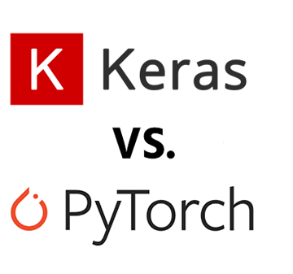

Keras or PyTorch as your first deep learning framework | deepsense.ai

Keras or PyTorch as your first deep learning framework | deepsense.ai

https://deepsense.ai/keras-or-pytorch/

Keras and PyTorch are both excellent choices for your first deep learning framework. Learn how they differ and which one will suit your needs better.