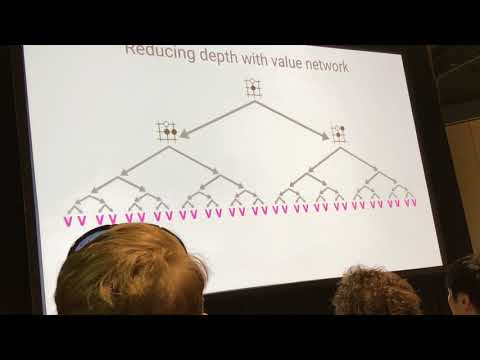

Keynote David Silver NIPS 2017 Deep Reinforcement Learning Symposium AlphaZero - YouTube

Keynote David Silver NIPS 2017 Deep Reinforcement Learning Symposium AlphaZero
https://www.youtube.com/watch?v=A3ekFcZ3KNw&feature=youtu.be&t=1157
[Aske Plaat](https://www.youtube.com/channel/UC-T1wW8Xjua97PIg5E2JdDQ)
5,781 views views
Published on Dec 9, 2017

|     |
| --- |
| [(L)](https://www.youtube.com/watch?v=A3ekFcZ3KNw&feature=youtu.be&t=1157) |

Description

Keynote by David Silver on AlphaGo, AlphaGo Zero and AlphaZero, at the 2017 NIPS Deep Reinforcement Learning Symposium, 6 Dec, Long Beach, CA