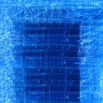
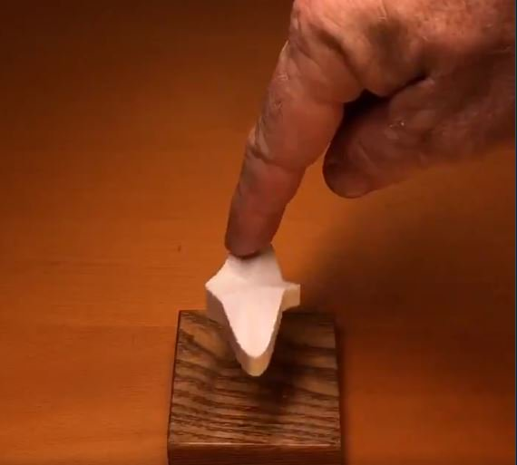

Khai on Twitter: "This arrow by mathematician and sculptor Kokichi Sugihara can't point left. Here's how it works: It's 3D-printed with a bunch of curves our brains don't register. https://t.co/Xa32GrI7ii" / Twitter

# Conversation

[ Khai ![](data:image/svg+xml,%3csvg xmlns='http://www.w3.org/2000/svg' viewBox='0 0 24 24' aria-label='Verified account' class='r-13gxpu9 r-4qtqp9 r-yyyyoo r-1xvli5t r-9cviqr r-dnmrzs r-bnwqim r-1plcrui r-lrvibr js-evernote-checked' data-evernote-id='626'%3e%3cg%3e%3cpath d='M22.5 12.5c0-1.58-.875-2.95-2.148-3.6.154-.435.238-.905.238-1.4 0-2.21-1.71-3.998-3.818-3.998-.47 0-.92.084-1.336.25C14.818 2.415 13.51 1.5 12 1.5s-2.816.917-3.437 2.25c-.415-.165-.866-.25-1.336-.25-2.11 0-3.818 1.79-3.818 4 0 .494.083.964.237 1.4-1.272.65-2.147 2.018-2.147 3.6 0 1.495.782 2.798 1.942 3.486-.02.17-.032.34-.032.514 0 2.21 1.708 4 3.818 4 .47 0 .92-.086 1.335-.25.62 1.334 1.926 2.25 3.437 2.25 1.512 0 2.818-.916 3.437-2.25.415.163.865.248 1.336.248 2.11 0 3.818-1.79 3.818-4 0-.174-.012-.344-.033-.513 1.158-.687 1.943-1.99 1.943-3.484zm-6.616-3.334l-4.334 6.5c-.145.217-.382.334-.625.334-.143 0-.288-.04-.416-.126l-.115-.094-2.415-2.415c-.293-.293-.293-.768 0-1.06s.768-.294 1.06 0l1.77 1.767 3.825-5.74c.23-.345.696-.436 1.04-.207.346.23.44.696.21 1.04z'%3e%3c/path%3e%3c/g%3e%3c/svg%3e)    @ThamKhaiMeng](https://twitter.com/ThamKhaiMeng)

This arrow by mathematician and sculptor Kokichi Sugihara can't point left. Here's how it works: It's 3D-printed with a bunch of curves our brains don't register.

0:38
3.2M views

From

[ WIRED![](data:image/svg+xml,%3csvg xmlns='http://www.w3.org/2000/svg' viewBox='0 0 24 24' aria-label='Verified account' class='r-13gxpu9 r-4qtqp9 r-yyyyoo r-1xvli5t r-9cviqr r-dnmrzs r-bnwqim r-1plcrui r-lrvibr js-evernote-checked' data-evernote-id='628'%3e%3cg%3e%3cpath d='M22.5 12.5c0-1.58-.875-2.95-2.148-3.6.154-.435.238-.905.238-1.4 0-2.21-1.71-3.998-3.818-3.998-.47 0-.92.084-1.336.25C14.818 2.415 13.51 1.5 12 1.5s-2.816.917-3.437 2.25c-.415-.165-.866-.25-1.336-.25-2.11 0-3.818 1.79-3.818 4 0 .494.083.964.237 1.4-1.272.65-2.147 2.018-2.147 3.6 0 1.495.782 2.798 1.942 3.486-.02.17-.032.34-.032.514 0 2.21 1.708 4 3.818 4 .47 0 .92-.086 1.335-.25.62 1.334 1.926 2.25 3.437 2.25 1.512 0 2.818-.916 3.437-2.25.415.163.865.248 1.336.248 2.11 0 3.818-1.79 3.818-4 0-.174-.012-.344-.033-.513 1.158-.687 1.943-1.99 1.943-3.484zm-6.616-3.334l-4.334 6.5c-.145.217-.382.334-.625.334-.143 0-.288-.04-.416-.126l-.115-.094-2.415-2.415c-.293-.293-.293-.768 0-1.06s.768-.294 1.06 0l1.77 1.767 3.825-5.74c.23-.345.696-.436 1.04-.207.346.23.44.696.21 1.04z'%3e%3c/path%3e%3c/g%3e%3c/svg%3e)](https://twitter.com/WIRED)

11:34 AM · Aug 4, 2019·[Twitter for Android](https://help.twitter.com/using-twitter/how-to-tweet#source-labels)

[43.9K  Retweets](https://twitter.com/ThamKhaiMeng/status/1157962976474873861/retweets)

[104.6K  Likes](https://twitter.com/ThamKhaiMeng/status/1157962976474873861/likes)

[ James Mendur   @JamesMendur](https://twitter.com/JamesMendur)
·
[Aug 5](https://twitter.com/JamesMendur/status/1158365341153714176)

Replying to
[@ThamKhaiMeng](https://twitter.com/ThamKhaiMeng)

I turned my computer upside down and the arrow pointed left. This means it's probably the camera-angle causing an optical illusion, like those trompe l'oeil sidewalk art pieces. When you're not in the sweet spot, they don't look right. The video looks cool, though.

8

10

176

[ Not Another Pedro   @p_chaves](https://twitter.com/p_chaves)
·
[Aug 5](https://twitter.com/p_chaves/status/1158363587431325697)

Replying to
[@ThamKhaiMeng](https://twitter.com/ThamKhaiMeng)

This has nothing to do with our brains. It's an optical illusion created by the angle of the camera and shape of the arrows.

You can literally see both arrows at the same time when he turns them. "our brains don't register"... Sometimes I hate this site.

54

62

985

[ Khai ![](data:image/svg+xml,%3csvg xmlns='http://www.w3.org/2000/svg' viewBox='0 0 24 24' aria-label='Verified account' class='r-13gxpu9 r-4qtqp9 r-yyyyoo r-1xvli5t r-9cviqr r-dnmrzs r-bnwqim r-1plcrui r-lrvibr js-evernote-checked' data-evernote-id='643'%3e%3cg%3e%3cpath d='M22.5 12.5c0-1.58-.875-2.95-2.148-3.6.154-.435.238-.905.238-1.4 0-2.21-1.71-3.998-3.818-3.998-.47 0-.92.084-1.336.25C14.818 2.415 13.51 1.5 12 1.5s-2.816.917-3.437 2.25c-.415-.165-.866-.25-1.336-.25-2.11 0-3.818 1.79-3.818 4 0 .494.083.964.237 1.4-1.272.65-2.147 2.018-2.147 3.6 0 1.495.782 2.798 1.942 3.486-.02.17-.032.34-.032.514 0 2.21 1.708 4 3.818 4 .47 0 .92-.086 1.335-.25.62 1.334 1.926 2.25 3.437 2.25 1.512 0 2.818-.916 3.437-2.25.415.163.865.248 1.336.248 2.11 0 3.818-1.79 3.818-4 0-.174-.012-.344-.033-.513 1.158-.687 1.943-1.99 1.943-3.484zm-6.616-3.334l-4.334 6.5c-.145.217-.382.334-.625.334-.143 0-.288-.04-.416-.126l-.115-.094-2.415-2.415c-.293-.293-.293-.768 0-1.06s.768-.294 1.06 0l1.77 1.767 3.825-5.74c.23-.345.696-.436 1.04-.207.346.23.44.696.21 1.04z'%3e%3c/path%3e%3c/g%3e%3c/svg%3e)    @ThamKhaiMeng](https://twitter.com/ThamKhaiMeng)

·
[Aug 5](https://twitter.com/ThamKhaiMeng/status/1158385743955451905)

Dear flummoxed, of course it has everything to do with the lighting, shape and cam angle. Call it what you will, you brain just can't "read" it. Relax.

13

12

570

