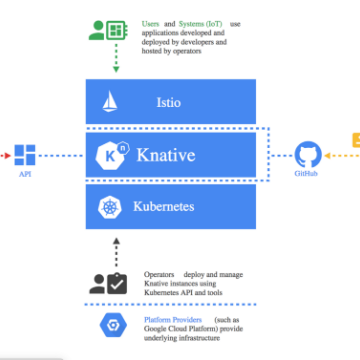

Knative what’s that now? – Grace – Medium

Knative what’s that now? – Grace – Medium

https://medium.com/@grapesfrog/knative-whats-that-now-65041e585d3d

One of my bug bears about Kubernetes (K8s) and even with the managed versions such as GKE is that you still need to twist way too many…