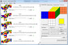
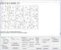
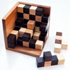
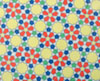

Kociemba's Homepage

   [Deutsche Version](http://kociemba.org/indexger.html)

# Herbert Kociemba's Homepage

## Content

|     |     |
| --- | --- |
|  | ** [Rubik's Cube and Cube Explorer](http://kociemba.org/#rubik)** |
|  | **  [15-Puzzle Optimal Solver (updated 06/2018)](http://kociemba.org/#fifteen)** |
|  | ** [General NxM-Sudoku solver and generator](http://kociemba.org/#sudoku)** |
|  | ** [The 125 cube: Packing a 5x5x5 cube with Y-pentominoes](http://kociemba.org/#125puz)** |
|  | ** [Penrose Tilings and Islamic Ornamental Design](http://kociemba.org/#penrose)** |
|  | ** [The Spiral of Theodorus](http://kociemba.org/#theodorus)** |

Restoring a Rubik's cube is not the easiest task but if you want to do this in 20 moves or less the bar has been raised even higher.

 [Cube Explorer](http://kociemba.org/cube.htm) implements an algorithm which is capable of doing this and it finds the solution usually within fractions of a second.

The program also gives the possibility to generate cubes with certain patterns or symmetries.

The [15-Puzzle](https://en.wikipedia.org/wiki/15_puzzle) is a sliding puzzle that triggered a similar hype in 1880 as Rubik's cube did exactly 100 years later.

The [Fifteen Puzzle Optimal Solver](http://kociemba.org/themen/fifteen/fifteensolver.html) solves any given position in the minimal number of moves. Though the complexity of this puzzle is lower than that of Rubik's Cube, the task of finding an optimal solution for this puzzle is not always easy. If you find a solver or you have written a solver which runs considerably faster than the one provided here please let me know.

The NxM-Sudoku is a generalization of the standard [3x3 Sudoku](https://en.wikipedia.org/wiki/Sudoku) with 9 squares of size 3x3 and a total of 81 cells. In the general case we have N*M rectangles of size NxM and a total of (N*M)2cells.

 Though there are standard Sudokus which are almost impossible to solve only with logical reasoning by humans, from a computational point of view solving a standard Sudoku is almost trivial. Since the general problem is [NP-complete](https://en.wikipedia.org/wiki/NP-completeness) finding a solution gets more demanding for larger grids.

We choose an approach where we simplify the given NxM-Sudoku as far as possible using "human" methods like hidden and naked singles and tuples, block-line interaction etc. and transform the remaining problem into a [boolean satisfiability problem](https://en.wikipedia.org/wiki/Boolean_satisfiability_problem). We then use [Sat4J](http://www.sat4j.org/) for solving.

[Besides solving the program also includes features like generating Sudokus, testing for unique solutions etc.](http://kociemba.org/themen/sudoku/program.html)

The 125puzzle is a quite difficult puzzle where you have to place 25 Y-pentacubes in a 5x5x5 box. I never managed to solve the puzzle manually.

[ But I successfully could solve the puzzle using a SAT-solver](http://kociemba.org/themen/125puzzle/index.html) and present 5 solutions with a special property.

As a byproduct I also give solutions for[20 Y-pentacubes in a 5x5x4 box](http://kociemba.org/themen/125puzzle/5x5x4.html), for [16 Y-pentacubes in a 4x4x5 box](http://kociemba.org/themen/125puzzle/4x4x5.html), for [12 Y-pentacubes in a 4x5x3 box](http://kociemba.org/themen/125puzzle/4x5x3.html) and for [12 Y-pentacubes in 5x6x2 box](http://kociemba.org/themen/125puzzle/5x6x2.html).

A [Penrose tiling](https://en.wikipedia.org/wiki/Penrose_tiling) consists of a set of tiles which tesselate the plane with no overlaps and no gaps. The tiling was invented 1973 by Roger Penrose.

 That Penrose tilings and the centuries-old tradition of islamic ornamental designs with five- and tenfold symmetric elements have similarities was noticed by [Peter Lu](http://www.peterlu.org/) from Harvard University in 2007 and provoked major media interest. It is not clear yet, however, to what extent the ancient architects were aware of the underlying mathematical laws of a Penrose tiling. More recent works by [Peter R. Cromwell 2015](https://link.springer.com/article/10.1007%2Fs00283-015-9538-9) and[2016](https://link.springer.com/article/10.1007%2Fs00004-015-0280-6) tend to give a negative answer to this question.

[Reflections on these tilings](http://kociemba.org/themen/penrose/tiling.html) result in a set of tiles in the style of Islamic art which forces a tiling equivalent to a Penrose tiling (or in the exact mathematical terminology: the tilings are mutually locally derivable).

The [Spiral of Theodorus](https://en.wikipedia.org/wiki/Spiral_of_Theodorus), eventually vaguely familiar from school mathematics provides certainly the opportunity for investigations which goes beyond the subject matter at school.

  [On this page](http://kociemba.org/themen/spirale/theodorus.html) wie find with the help of the Euler–Maclaurin formula arbitrary good approximations for the discrete and analytic version of the square root spiral. We compute the so called Schneckenkonstante K to more than 500 decimal places and visualize the used methods in this [Geogebra-Applet](https://www.geogebra.org/m/wZcBDEYh).

© 2018  [**Herbert Kociemba**](http://kociemba.org/mailto:kociemba@t-online.de)