Kruskal Count Card Trick

The Kruskal Count Card Trick

The cards below were ordered by shuffling a deck of cards and then dealing them out. Click on any card in the first row. Whatever number is on this card move this many cards to the right and click the new card, treating Ace as a 1 and face cards as 5, and wrapping around to the left side of the next row. Repeat from the card just clicked. I magically know that you will (usually) end up on the 'trap' card, indicated by a thick border. The [two deck version](http://faculty.uml.edu/rmontenegro/research/kruskal_count/kruskal2.html) is successful over 95% of the time. To reshuffle and play again hit the reload button on your browser.

Here is the [reason this works](http://faculty.uml.edu/rmontenegro/research/kruskal_count/index.html). An algorithm for code-breaking, [Pollard's Kangaroo (Lambda) Method](http://faculty.uml.edu/rmontenegro/research/kruskal_count/kangaroo.html) for Discrete Logarithm, is based on the same principle as this card trick.

|     |     |     |     |     |     |     |     |     |
| --- | --- | --- | --- | --- | --- | --- | --- | --- |
| 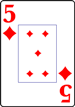 | 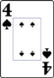 |  |  |  |  | 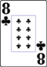 | 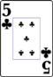 |  |
|  |  | 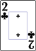 |  |  |  | 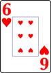 | 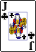 |  |
| 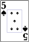 |  | 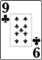 | 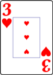 | 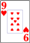 |  |  | 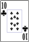 | 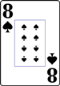 |
| 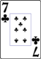 |  | 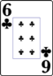 | 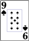 |  | 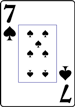 |  |  | 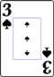 |
|  |  |  | 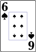 |  |  |  |  |  |
|  |  |  |  |  | 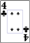 |  |

Created by Alex Frieden and Ravi Montenegro.
[< 1 min to Spreed]()