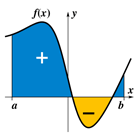

Kruskal Count and Kangaroo Method

Kruskal Count and Kangaroo Method

http://faculty.uml.edu/rmontenegro/research/kruskal_count/index.html

Kruskal Count and Kangaroo Method The Kruskal Count is a probabilistic concept discovered by Martin Kruskal and popularized by Martin Gardner. It has applications ranging from magic tricks to code-breaking. For instance, deal out a deck of cards on a table. Start at the first card, and whatever number is on it "walk" this many cards to the right, treating Ace as a 1 and face cards as 5. Repeat the "walk" from the new card, continuing until you near the end. Place a dollar there, and bet your friend that if they pick one of the first