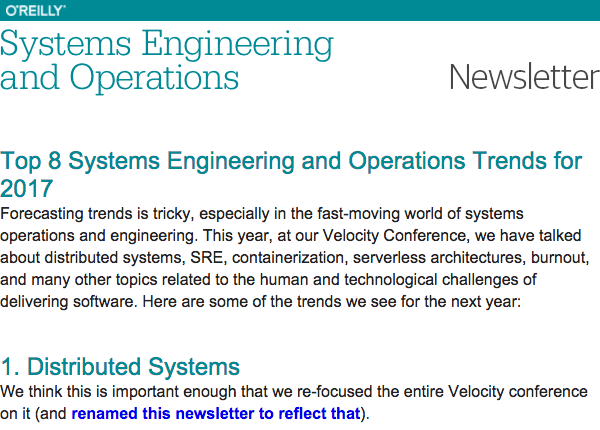

Kubernetes and Prometheus: The beginning of a beautiful friendship

 [Operations](https://www.oreilly.com/topics/operations)
                 Follow this topic

# Kubernetes and Prometheus: The beginning of a beautiful friendship

Learn how to use Kubernetes and Prometheus together to reimagine infrastructure and measure "the right things."

Video by [Björn Rabenstein](https://www.oreilly.com/people/bjorn-rabenstein),
 January 10, 2017

This presentation was recorded in November 2016 at the [O'Reilly Velocity Conference in Amsterdam](http://conferences.oreilly.com/velocity/devops-web-performance-eu). Visit Safari for [full access to sessions, training, and keynotes](https://www.safaribooksonline.com/library/view/velocity-2016-/9781491958537/?utm_source=oreilly&utm_medium=newsite&utm_campaign=kubernetes-and-prometheus-text-cta) from this event.

Get O'Reilly's weekly Systems Engineering and Operations newsletter

 

Article image: Lights on a bridge  (source: [lertnapa via Pixabay](https://pixabay.com/en/bridge-transportation-1532382/)).

* * *

 

 [Operations](https://www.oreilly.com/topics/operations)

##   [Understanding the ELK stack](https://www.oreilly.com/ideas/understanding-the-elk-stack)

By [Brian Anderson](https://www.oreilly.com/people/brian_anderson) and [Rafał Kuć](https://www.oreilly.com/people/d05d7-rafa-ku)

Five questions for Rafał Kuć: Insights on what sets the ELK stack apart from other log management solutions, common user pitfalls, and tips for getting started.

 

 [Operations](https://www.oreilly.com/topics/operations)

##   [Monitoring distributed systems](https://www.oreilly.com/ideas/monitoring-distributed-systems)

By [Rob Ewaschuk](https://www.oreilly.com/people/rob-ewaschuk)

A case study in how Google monitors its complex systems.

 

 [Operations](https://www.oreilly.com/topics/operations)

##   [It’s usability all the way down](https://www.oreilly.com/ideas/its-usability-all-the-way-down)

By [Jeff Sussna](https://www.oreilly.com/people/818a7-jeff-sussna)

Designing, building, and operating services from the perspective of customer goals helps improve quality.

 

 [Operations](https://www.oreilly.com/topics/operations)

##   [Ghosts in the machines](https://www.oreilly.com/ideas/ghosts-in-the-machines)

By [Courtney Nash](https://www.oreilly.com/people/3f5d7-courtneyw-nash)

The secret to successful infrastructure automation is people.