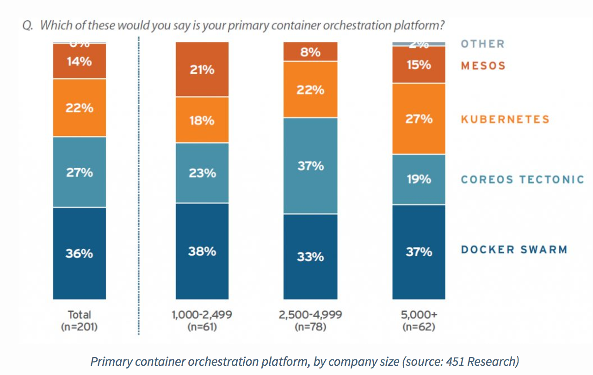
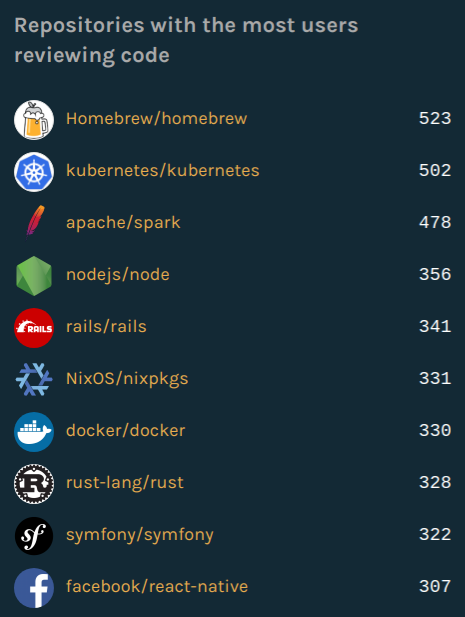
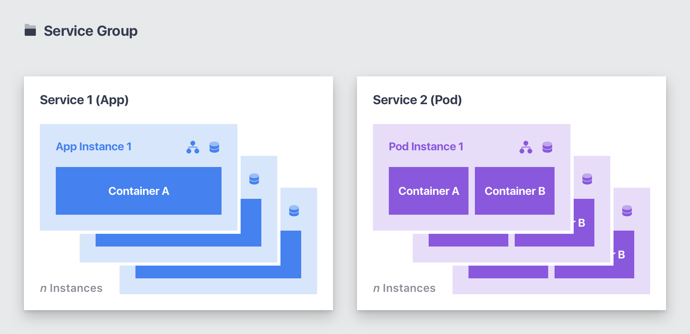
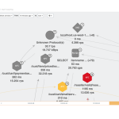
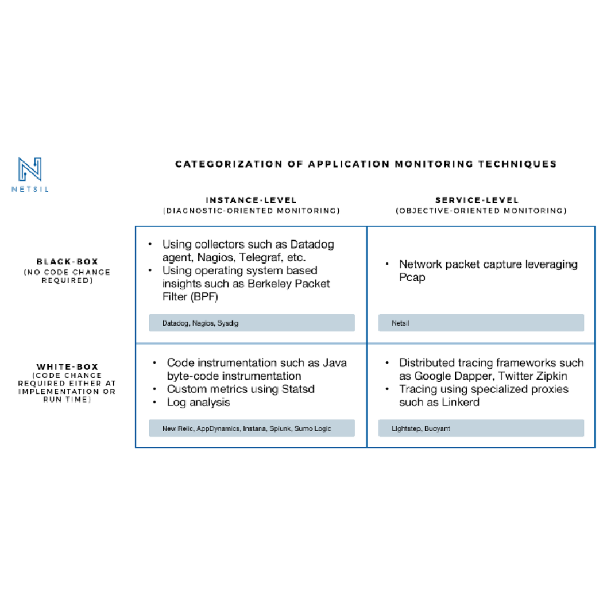

Kubernetes vs Docker vs Mesosphere: Orchestration Comparison

# Kubernetes vs Docker Swarm vs DC/OS: May 2017 Orchestrator Shootout

 by Twain Taylor

- [Blog](https://netsil.com/blog/)
- [Whitepapers](https://netsil.com/resources/)
- [Videos](https://netsil.com/videos/)

.

Container orchestration is rapidly evolving. Every month there are major new updates from the three big orchestration players: Kubernetes, Docker Swarm, and Mesosphere DC/OS. They have carved out niches for themselves, cementing their place in the nascent Docker ecosystem. These orchestrators are evolving so quickly that what you knew about Kubernetes, Swarm and Mesos just a few months ago may no longer be true today. So let’s take a look at the current state of each of these orchestrators.

Container Orchestration Adoption by Company Size (source: 451 Research)

## **Kubernetes—The purist container orchestrator**

[Version 1.6 of Kubernetes](http://blog.kubernetes.io/2017/03/kubernetes-1.6-multi-user-multi-workloads-at-scale.html) was released in the last week of March. The biggest update was the federation feature that lets you scale to clusters with 150,000 pods. RBAC was another welcome addition to v1.6. Much of the other updates were focused on building stability for previously launched features.

Kubernetes seems intent on taking the fight to Docker. It has supported the [rktlet](https://github.com/kubernetes-incubator/rktlet) runtime for a while now, and recently also announced its own Container Runtime Instance ([CRI](https://github.com/kubernetes/community/blob/master/contributors/design-proposals/container-runtime-interface-v1.md)), and its OCI- compliant alternative, [CRI-O](https://github.com/kubernetes-incubator/cri-o). Though these container runtimes are yet to hit the mainstream, the Kubernetes community is clearly not content to stick with just one option for a runtime.

Speaking of the community, Kubernetes has the most vibrant of the three. Kubernetes contributors use special interest groups ([SIGs](https://github.com/kubernetes/community/blob/master/README.md#special-interest-groups-sig)) to communicate. The reason for this rabid fandom is the hands-off approach taken by Google as they’ve completely handed off Kubernetes to the Cloud-native Computing Foundation ([CNCF](https://www.cncf.io/)). In fact v1.6 was the first update that was led by a team other than from Google—CoreOS. The contributions show in GitHub’s numbers. Kubernetes is one of the most actively viewed open source projects out there.

Top GitHub Repositories by Views

But perhaps the biggest impact of Kubernetes is that it’s creating a new niche of managed Kubernetes services provided by every other cloud vendor. The interesting thing is that longtime OpenStack vendors like Mirantis and OpenShift see a ray of hope in Kubernetes, and are quickly pivoting to announce hosted Kubernetes services. The most recent in the long list of Kubernetes announcements was made by the co-founders of Kubernetes themselves. Leading with the provocative pitch “[Kubernetes sucks](http://www.serverwatch.com/server-news/why-kubernetes-sucks-and-how-to-fix-it.html),” their startup, Heptio, announced a new set of tools called [ksonnet](https://blog.heptio.com/ksonnet-intro-43f6183a97a6).

There is great support for Kubernetes from every direction. But perhaps the strongest support it receives is from the CNCF, which is making great progress in building a comprehensive toolset around Kubernetes. This includes the open source time series database Prometheus, and the recently added Container Network Interface (CNI) for container networking.

With all this buzz surrounding Kubernetes, it is clearly leading the orchestration pack. However, there are serious concerns about the complexity of Kubernetes and the almost “new world” that it is inventing (or reinventing) in terms of: StatefulSets, ReplicaSets, Deployments, Apps, Allocations, Taints, Tolerances, Nodes, Jobs, Custom Schedulers, Privileged Pods, Operators, Service Discovery…(These are concerns borrowed from: https://medium.com/@doctor_julz/kubernetes-scala-and-simplicity-34a1abb5863e )

## **Docker Swarm—”Batteries included but swappable”**

Docker Swarm has had a rocky first year—Not so much because it’s bad at what it does, but rather because of the approach it takes. Last year at DockerCon, Swarm was launched as a batteries-included solution for Docker. But this year Docker shifted its tone to “batteries-included-but-swappable.” This is largely due to the momentum that Kubernetes has gained during the past year.

However, Swarm has lived up to expectations and is one of the most easy-to-use orchestrators available today. Unlike Kubernetes which has a steep learning curve, Docker Swarm lets you spin up your first cluster much like you would your first container. It takes just a couple of commands. As an “opinionated” option to orchestration, Swarm is tightly integrated into the Docker stack, and if you plan to upgrade to the Enterprise Edition of Docker, Swarm makes perfect sense. Swarm is “opinionated”—Docker encourages you to use its own technology stack —but you can also use your own tools with Docker if you want. While it’s the easiest to get started, Swarm may not appeal to the other end of the spectrum— power users. For example, it recently announced support for self-healing infrastructure and auto scaling with InfraKit, but this was met with [mixed responses](https://thenewstack.io/dockers-infrakit-gets-mixed-reviews/).

Docker’s new CEO, Steve Singh, admits that they are in the #2 spot with respect to orchestration. Yet for all Swarm’s woes with orchestration, Docker has its sights set higher aiming to be the de facto container-as-a-service platform. It sees orchestration as one component of the larger platform. To this end, Docker released an open source [Moby Project](https://blog.docker.com/2017/04/introducing-the-moby-project/)—a framework for building customer container systems.

## **Mesosphere DC/OS—Big Data made easy**

Unlike Kubernetes, which aims to be the purist container orchestrator, or Swarm that aims to be the most well-integrated one, DC/OS has a completely different focus—Big Data. The biggest strength of Mesosphere DC/OS is its one-click integrations with Big Data tools like Spark, Cassandra and Kafka. Typically these databases and Big Data processing tools take hours to set up but with DC/OS it’s effortless.

DC/OS puts a spin on the terminology saying they enable not just Big Data but fast data. The most recent v1.9 update of DC/OS brought support for GPUs which are ideal for running complex [machine learning processes in real time](https://techcrunch.com/2017/03/14/mesospheres-dcos-adds-more-one-click-integrations-and-better-support-for-machine-learning-workloads/). This is also ideal for apps that need predictive analytics capabilities.

Another way Mesosphere DC/OS is quietly growing its market share is via partnerships. It has partnered with [Dell EMC](https://mesosphere.com/blog/2017/05/10/mesosphere-dell-emc-team-up-to-simplify-hybrid-cloud/), [HPE](https://techcrunch.com/2017/02/07/hpe-becomes-a-mesosphere-reseller/), [Redis](https://redislabs.com/blog/redis-labs-and-mesosphere-dcos-join-forces/), and a host of other vendors that resell its product to their customer base. Apart from these differences, DC/OS is also converging and adopting some of the features of Kubernetes such as [Pods](https://mesosphere.com/blog/2017/03/15/introducing-pods-dcos-1-9/). Pods add a layer of abstraction over the existing service groups in DC/OS. Mesosphere also announced a [Universe Service Catalog](https://github.com/mesosphere/universe)—a market for open source services.

Mesosphere DC/OS Pods (Image Credit: [Mesosphere Blog](https://mesosphere.com/blog/2017/03/15/introducing-pods-dcos-1-9/))

## **Conclusion**

No matter what container orchestrator you choose, you can’t go too wrong. However, do consider the approach each of them takes. They all provide container orchestration. Kubernetes is the most open and extensible but also the most difficult to master. Docker Swarm is the easiest to use, but can be restrictive after a point. And DC/OS has some great features for Big Data workloads.

#### Featured Whitepapers

- [Kubernetes Monitoring with Netsil](http://info.netsil.com/kubernetes-monitoring)
- [The 4 Golden Signals of API Health and Performance](http://info.netsil.com/golden-signals-monitoring)
- [Application Monitoring Landscape](http://info.netsil.com/application-monitoring-landscape)

#### Get Netsil Updates

- [RSS Feed](https://netsil.com/category/blog/feed)
- or
- [Follow on Feedly](https://feedly.com/i/subscription/feed/https://netsil.com/category/blog/feed/)

.
**COMPANY**

- [Blog](https://netsil.com/blog/)
- [Careers](https://netsil.com/careers/)

**PRODUCT**

- [Netsil AOC](https://netsil.com/product/)
- [Get Started](https://lm.netsil.com/register)
- [Docs](https://docs.netsil.com/)
- [Pricing](https://netsil.com/blog/kubernetes-vs-docker-vs-mesosphere/mailto:sales@netsil.com?subject=Pricing%20Information&body=Hi,%0D%0A%0D%0AI%20am%20interested%20in%20learning%20more%20about%20the%20pricing%20of%20the%20Netsil%20Application%20Operations%20Center%20(AOC))

**SUPPORT**

- [Resources](https://netsil.com/resources/)
- [Slack](http://slack.netsil.com/)
- [Contact Us](https://netsil.com/contact/)

**LATEST FROM THE BLOG**

## [Kubernetes vs Openshift vs Tectonic](https://netsil.com/blog/kubernetes-deployment-comparison/)

## [Telegraf vs collectd vs dd-agent](https://netsil.com/blog/telegraf-vs-collectd-vs-dd-agent/)

## [A Comparison of Mapping Approaches for Distributed Cloud Applications](https://netsil.com/blog/comparison-mapping-approaches-cloud-applications/)

**[From Twitter @Netsil_HQ](https://twitter.com/Netsil_HQ)**

Pitching the popular container orchestrators against each other: [#Kubernetes](https://twitter.com/search?q=%23Kubernetes&src=hash) vs [#Docker](https://twitter.com/search?q=%23Docker&src=hash) Swarm vs [#Mesosphere](https://twitter.com/search?q=%23Mesosphere&src=hash) DC/OS https://t.co/300IOqZ1j1

 [- June 13, 2017](https://twitter.com/@netsil_HQ/status/874772123893366784)

 [h](https://twitter.com/intent/tweet?in_reply_to=874772123893366784)  [J](https://twitter.com/intent/retweet?tweet_id=874772123893366784)  [R](https://twitter.com/intent/favorite?tweet_id=874772123893366784)

RT [@thenewstack](http://www.twitter.com/thenewstack): Kubernetes vs Openshift vs Tectonic: Comparing Enterprise Options by [@Netsil_HQ](http://www.twitter.com/Netsil_HQ)  https://t.co/MyiJogSFnE

 [- June 13, 2017](https://twitter.com/@netsil_HQ/status/874721112042520576)

 [h](https://twitter.com/intent/tweet?in_reply_to=874721112042520576)  [J](https://twitter.com/intent/retweet?tweet_id=874721112042520576)  [R](https://twitter.com/intent/favorite?tweet_id=874721112042520576)

**CONNECT WITH US**

- [](https://www.facebook.com/netsil.hq/)
- [](https://twitter.com/Netsil_HQ)
- [](https://www.linkedin.com/company/netsil)
- [](https://www.youtube.com/channel/UCcC-Urn-z3b6zozqChLMPNg)

.

Copyright © 2015 – 2017 Netsil Inc. All Rights Reserved.[| Privacy Policy](http://netsil.com/privacy)

.