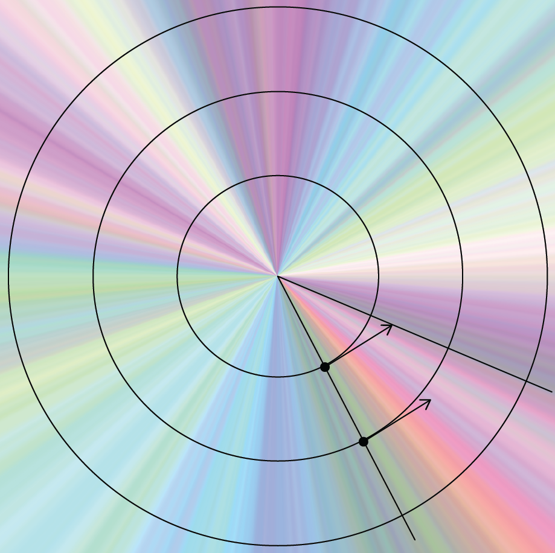
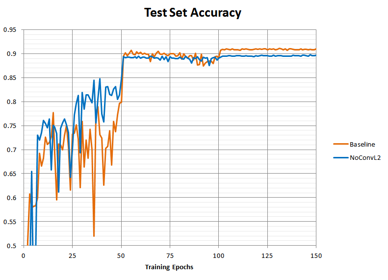
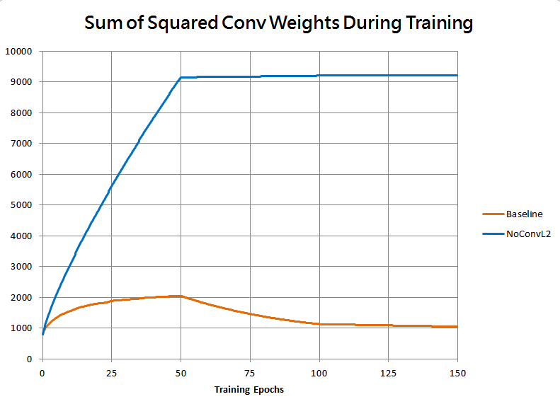
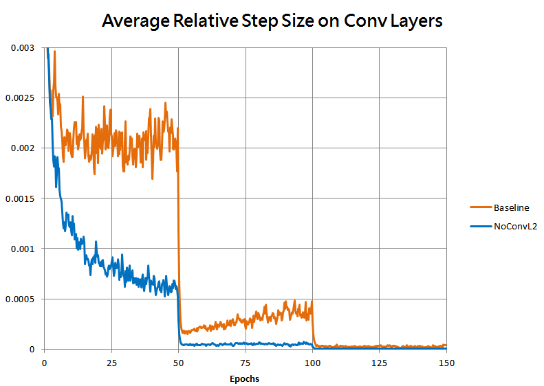
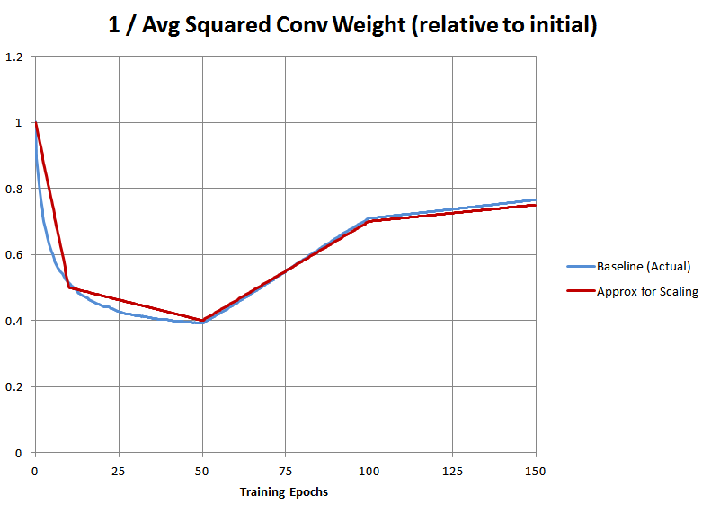
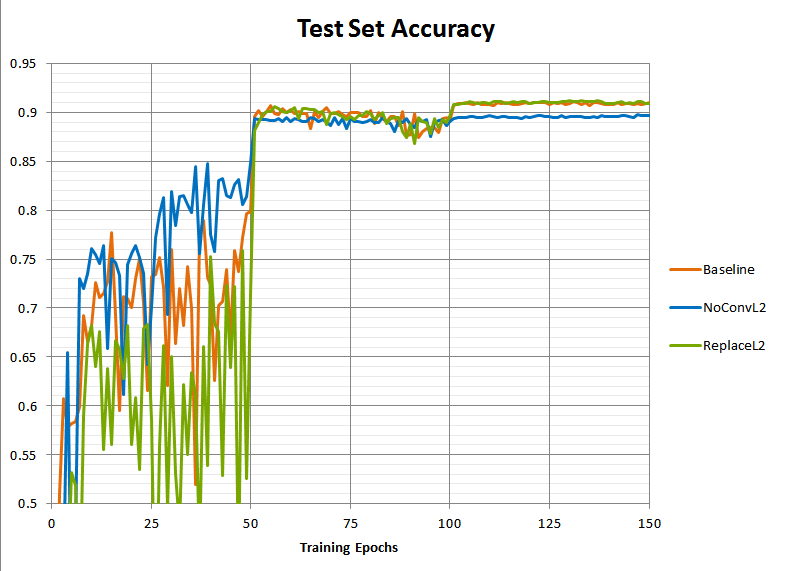
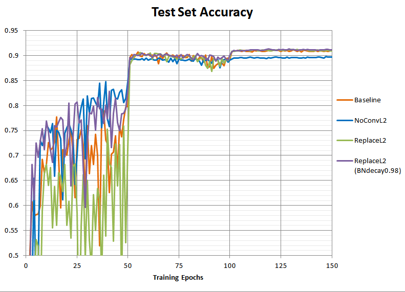
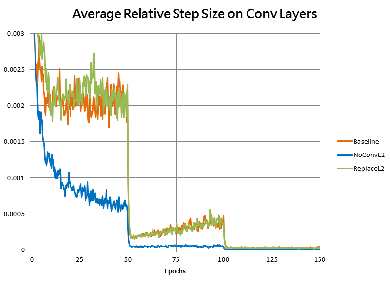
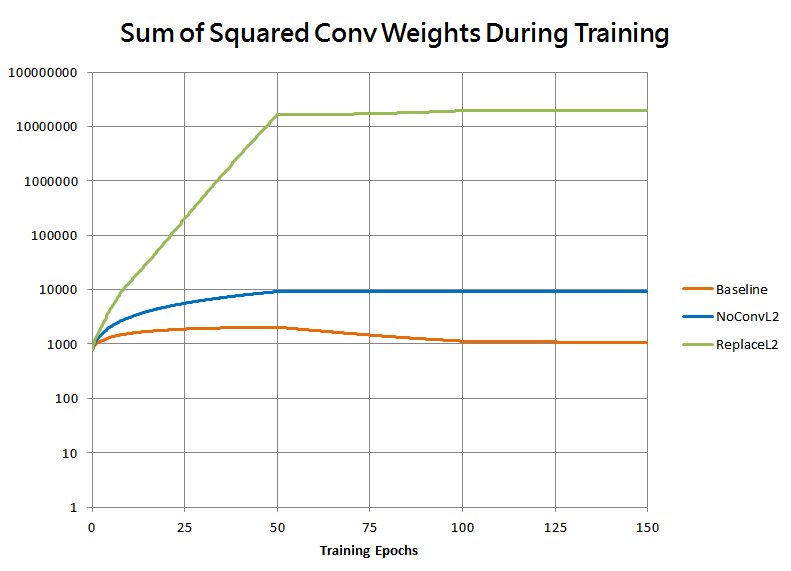

L2 Regularization and Batch Norm

### L2 Regularization and Batch Norm

 Jan 29, 2019 |      19 min read

- [**  Share on Facebook](https://www.facebook.com/sharer.php?u=https://blog.janestreet.com/l2-regularization-and-batch-norm/)

- [**  Share on Twitter](https://twitter.com/intent/tweet?source=https://blog.janestreet.com/l2-regularization-and-batch-norm/&text=Jane%20Street%20Tech%20Blog%20-%20L2%20Regularization%20and%20Batch%20Norm%20https://blog.janestreet.com/l2-regularization-and-batch-norm/)

- [**  Share on LinkedIn](http://www.linkedin.com/shareArticle?mini=true&url=https://blog.janestreet.com/l2-regularization-and-batch-norm/&title=Jane%20Street%20Tech%20Blog%20-%20L2%20Regularization%20and%20Batch%20Norm&summary=This%20blog%20post%20is%20about%20an%20interesting%20detail%20about%20machine%20learning%20that%20I%20came%20across%20as%20a%20researcher%20at%20Jane%20Street%20-%20that%20of%20the%20interaction%20between%20L2%20regularization,%20also%20known%20as%20weight%20decay,%20and%20batch%20normalization.%20In%20particular,%20when%20used%20together%20with%20batch%20normalization%20in%20a%20convolutional%20neural%20net...&source=https://blog.janestreet.com/l2-regularization-and-batch-norm/)

 

By: [David Wu](https://blog.janestreet.com/author/dwu)

This blog post is about an interesting detail about machine learning that I came across as a researcher at Jane Street - that of the interaction between L2 regularization, also known as weight decay, and batch normalization.

**In particular, when used together with batch normalization in a convolutional neural net with typical architectures, an L2 objective penalty no longer has its original regularizing effect. Instead it becomes essentially equivalent to an adaptive adjustment of the learning rate!**

This and similar interactions are already part of the awareness in the wider ML literature, for example in [Laarhoven](https://arxiv.org/abs/1706.05350) or [Hoffer et al.](https://arxiv.org/abs/1803.01814). But from my experience at conferences and talking to other researchers, I’ve found it to be surprisingly easy to forget or overlook, particularly considering how commonly both batch norm and weight decay are used.

For this blog post, we’ll assume that model fitting is done via stochastic gradient descent. With ADAM or other alternative optimizers, the analysis presented here does *not* necessarily apply (particularly as the notions of weight decay versus an L2 objective penalty now become nonequivalent, as explored by [Loshchilov and Hutter](https://openreview.net/forum?id=rk6qdGgCZ)), and the behavior will be potentially different.

## L2 Regularization / Weight Decay

To recap, L2 regularization is a technique where the sum of squared parameters, or weights, of a model (multiplied by some coefficient) is added into the loss function as a penalty term to be minimized.

Let ww be the collection of model weights, and xx be any mini-batch, and αα be the learning rate, and DataLoss(w,x)DataLoss(w,x) be the current error we are minimizing with respect to the data. With L2 regularization our overall loss function will be of the form:

Loss(w,x)=DataLoss(w,x)+12c∥w∥2Loss(w,x)=DataLoss(w,x)+12c∥w∥2
During gradient descent, our update step will look like:

w:=w−αddwLoss(w,x)=w−αddw(DataLoss(w,x)+c×12∥w∥2)=w−αdDataLoss(w,x)dw−αcw=w(1−αc)−αdDataLoss(w,x)dww:=w−αddwLoss(w,x)=w−αddw(DataLoss(w,x)+c×12∥w∥2)=w−αdDataLoss(w,x)dw−αcw=w(1−αc)−αdDataLoss(w,x)dw

So the effect of the L2 penalty term 12c∥w∥212c∥w∥2 is that on each optimization step in addition to stepping based on a gradient to better fit the training data, all model weights also decay proportionally towards zero by a small factor of (1−αc)(1−αc). This is why this technique is also known as “weight decay”.

##### Purpose/Intuition

Usually, the motivation for L2 regularization is to reduce overfitting.

One way to intuit this is that weight decay will continuously squeeze model weights to be too small, increasing error on the training data. However, important weights that capture common regularities in the data will consistently recover back up on future steps, re-reducing that error. Weight values that are merely due to noise in a particular batch or to only small numbers of data samples and that do not affect the error much will not recover so readily. In this way, the final model weights (hopefully) fit the more of the broader regularities in the data and less of the noise. This is how an L2 penalty *regularizes* the model.

Alternatively, a Bayesian view would be that the penalty 12c∥w∥212c∥w∥2 imposes a prior about the “complexity” of the model. In function approximation, models that precisely wiggle to fit every data point in a noisy setting tend to require very large weights to generate the necessary sharp kinks to do so and are less likely to generalize. Models with smaller weights will generally be smoother and more likely to generalize. By directly penalizing large weights, we favor smoother and less “complex” models.

## Batch Normalization

Batch normalization is a technique where layers are inserted into typically a convolutional neural net that normalize the mean and scale of the per-channel activations of the previous layer. Depending on the architecture, this is usually somewhere between each nonlinear activation function and prior convolutional layers ([He et al.](https://arxiv.org/pdf/1603.05027.pdf)).

Let BNBN be the output tensor of a batch norm layer, and LL be the output tensor of the layer that feeds into it. As before, let ww be the model weights of the previous (linear) layer. Then we have:

BN(w)=L(w)−μL(w)√σL(w)2+ϵBN(w)=L(w)−μL(w)σL(w)2+ϵ
where:

μL(w)[c]=1NXY∑n,x,yL(w)[n,x,y,c]μL(w)[c]=1NXY∑n,x,yL(w)[n,x,y,c]σL(w)[c]2=1NXY∑n,x,y(L(w)[n,x,y,c]−μL(w)[c])2σL(w)[c]2=1NXY∑n,x,y(L(w)[n,x,y,c]−μL(w)[c])2

and ϵϵ is a typically negligible constant that ensures no division by zero. For notation we use […][…] here to denote indices into the relevant vectors and tensors, and we also have ww as an argument everywhere to emphasize that we are considering everything as a function of ww, as will be useful below.

So for each channel cc, BNBN will be the same as LL except shifted and rescaled to have mean zero and standard deviation one. Typically [one or two learnable parameters are further added](https://stats.stackexchange.com/questions/310326/why-does-batch-norm-have-learnable-scale-and-shift), but we omit those for simplicity as they do not affect the analysis in this post.

##### Purpose/Intuition

Batch normalization was introduced by [a 2015 paper (Ioffe and Szegedy),](https://arxiv.org/abs/1502.03167) with the idea of stabilizing the distribution of layer activations over the course of training, reducing the instability of deeper neural nets to saturate or diverge. But exactly why it helps appears to still be a topic of research (for example, see [Santurkar et al.](https://arxiv.org/abs/1805.11604) or [Bjorck et al.](https://arxiv.org/abs/1806.02375)).

Empirically for convolutional neural nets on some (but not all) problems, batch normalization stabilizes and accelerates the training while reducing the need to tune a variety of other hyperparameters to achieve reasonable performance.

The key property that is relevant for this post is that batch norm layers make the neural net output approximately *invariant to the scale of the activations of the previous layers*. Any such scaling will simply be normalized away, except for the tiny effect of the ϵϵ in the denominator.

## What Happens When Both Are Used Together

What happens when both batch norm and an L2 objective penalty are used together in a convolutional neural net? To first order, the weight decay from the L2 penalty on a convolutional layer no longer has an influence on the output of the neural net!

With a little thought, this should not be surprising. Since batch norm makes the output invariant to the scale of previous activations, and the scale of previous activations is linearly related to the scale of the model weights, the output will now be invariant to weight decay’s scaling of those weights.

Formally, let ww be the model weights for a convolutional layer, let L(w)L(w) be the output tensor for that layer. Assume that the LL feeds into a batch norm layer, and let BN(w)BN(w) be the output of that batch norm layer, viewed as a function of ww.

Suppose that as a result of an L2 penalty term or direct weight decay, we scale ww by a factor λ<1λ<1.

Since convolution is a linear operation, scaling the weight matrix of a convolution simply scales the output. Also straightforwardly from their earlier definitions, μLμL and σLσL also scale linearly with LL. Therefore:

L(λw)=λL(w)L(λw)=λL(w)μL(λw)=λμL(w)μL(λw)=λμL(w)σL(λw)=λσL(w)σL(λw)=λσL(w)
Then the new output of the batch norm layer is:

BN(λw)=L(λw)−μL(λw)√σL(λw)2+ϵ=λL(w)−λμL(w)√λ2σL(w)2+ϵ≈λL(w)−λμL(w)λ√σL(w)2+ϵ(since epsilon is tiny)=L(w)−μL(w)√σL(w)2+ϵ(the lambdas all cancel)=BN(w)BN(λw)=L(λw)−μL(λw)σL(λw)2+ϵ=λL(w)−λμL(w)λ2σL(w)2+ϵ≈λL(w)−λμL(w)λσL(w)2+ϵ(since epsilon is tiny)=L(w)−μL(w)σL(w)2+ϵ(the lambdas all cancel)=BN(w)

So a scaling by λλ approximately has no effect on the output, as expected. Note also that this property does not depend on the batch size. (except perhaps if the noise in extremely tiny batch sizes makes it slightly more common for a layer to be tiny and ϵϵ to matter).

#### No More L2 Regularization Mechanism

What happens when we try to use an L2 objective penalty term with batch normalization present?

Since the neural net’s output is invariant to the scale of ww, the mechanism by which the weight decay would normally regularize the neural net is broken!

Without batch norm, important weights should experience gradients to restore their magnitudes countering earlier weight decays, whereas weights fitting only noise would on average remain decayed. But with batch norm, all weights will be “equally happy” at the decayed value λwλw as at the original value. Since it is a proportional decay, the batch norm layer will automatically “undo” the decay and there will be no gradient to preferentially increase the magnitude of the important entries within ww relative to the less important ones.

Or more formally, it’s pretty easy to show that if a given function f(w)f(w) is invariant to multiplicative scalings of ww, then the direction of the gradient df/dwdf/dw must also be invariant to multiplicative scalings of ww. In other words, weight decay’s scaling of the weights cannot directly alter the direction of future gradient descent steps to favor any components of ww over any others (although it could alter the size of the overall steps).

The Bayesian perspective is another way to intuit why there should be no regularization effect now. An L2 penalty term normally acts as a prior favoring models with lower “complexity” by favoring models with smaller weights. But when the model is invariant to the scale of the weights, an L2 penalty no longer accomplishes this. With batch norm, models with smaller weights are no more or less “complex” than ones with larger weights, since rescaling the weights of a model produces an essentially equivalent model.

#### New Effect on Gradient Scale and Learning Rate

Does that mean L2 regularization is pointless with batch norm present? No - actually it takes on a major new role in controlling the effective learning rate of the model during training. Here’s how:

Without batch norm, the weights of a well-behaving neural net usually don’t grow arbitrarily, since an arbitrary scaling of all the weights will almost certainly worsen the data loss. In my experience, it’s pretty common for weights to remain near same order of magnitude that they were initialized at.

But with batch norm, they are unconstrained since an increase in the overall magnitude of the weights in any layer will simply result in the subsequent batch norm layer scaling all the activations down again. So the weights can grow significantly over time, and absent any controlling force in practice they very much do. As we will see, this has a major effect *on the magnitude of the gradients*.

##### Effect of Scale on Gradients

Consider as before what happens when we scale the model weights ww of a convolutional layer by a factor λλ, when there is a subsequent batch norm layer. What happens to the gradient of the loss function on the data with respect to ww?

Intuitively, the gradients should vary inversely with λλ. For example, if a given absolute step dwdw changes the loss by some amount dDataLossdDataLoss, then doubling all the weights means that after batch norm cuts in half all the activations, the same absolute-sized step dwdw will only have half as large an effect on the activations, so dDataLossdDataLoss should be halved.

Mathematically, this translates to the following (non-rigorous) derivation. Heuristically using several times the fact that BN(λw)≈BN(w)BN(λw)≈BN(w) for any reasonable-scale ww, and letting wiwi be any particular entry within ww:

dDataLossdwi(λw)=dDataLossdBN(BN(λw))dBNdwi(λw)≈dDataLossdBN(BN(w))dBNdwi(λw)(letting e_i be the vector that is 1 at index i and 0 elsewhere...)=dDataLossdBN(BN(w))limh→01h(BN(λw+hei)−BN(λw))=dDataLossdBN(BN(w))limh→01h(BN(λ(w+λ−1hei))−BN(λw))≈dDataLossdBN(BN(w))limh→01h(BN(w+λ−1hei)−BN(w))=λ−1dDataLossdBN(BN(w))limλ−1h→01λ−1h(BN(w+λ−1hei)−BN(w))=λ−1dDataLossdBN(BN(w))dBNdwi(w)=λ−1dDataLossdwi(w)dDataLossdwi(λw)=dDataLossdBN(BN(λw))dBNdwi(λw)≈dDataLossdBN(BN(w))dBNdwi(λw)(letting e_i be the vector that is 1 at index i and 0 elsewhere...)=dDataLossdBN(BN(w))limh→01h(BN(λw+hei)−BN(λw))=dDataLossdBN(BN(w))limh→01h(BN(λ(w+λ−1hei))−BN(λw))≈dDataLossdBN(BN(w))limh→01h(BN(w+λ−1hei)−BN(w))=λ−1dDataLossdBN(BN(w))limλ−1h→01λ−1h(BN(w+λ−1hei)−BN(w))=λ−1dDataLossdBN(BN(w))dBNdwi(w)=λ−1dDataLossdwi(w)

(it’s possible to be more rigorous about the above and about how much ϵϵ affects the quality of the approximation BN(λw)≈BN(w)BN(λw)≈BN(w), but for simplicity we avoid doing so here).

So as expected, scaling ww by a factor of λλ causes the gradients to scale by a factor of 1/λ1/λ. Additionally, since with batch norm what matters is the scale of gradient steps *relative to* the existing magnitude of ww, and ww itself is still λλ times larger, this effectively scales the learning rate of ww by a factor of 1/λ21/λ2.

##### Consequences for Learning Rate

With batch norm removing any inherent constraint on the scale of ww, absent any other constraint, we would expect ww to naturally to grow in magnitude over time through stochastic gradient descent. This is because a random walk’s distance from the origin grows in magnitude over time with very high probability (this is true even when batch normalization causes every gradient step in parameter space to have no locally inward or outward component, since we are taking finite-sized steps and a finite-sized step tangent to the surface of a sphere will end up slightly further outside of that sphere).

Then by the 1/λ21/λ2 scaling of the gradient, this will in effect cause the learning rate to greatly decay over time. As ww grows, the relative step sizes will shrink quadratically.

**So without an L2 penalty or other constraint on weight scale, introducing batch norm will introduce a large decay in the effective learning rate over time. But an L2 penalty counters this.**

With an L2 penalty term to provide weight decay, the scale of ww will be bounded. If it grows too large, the multiplicative decay will easily overwhelm any outward motion due to random walking. In the limit of training for a very long time at a fixed nominal learning rate, one would expect that the scale of ww would tend toward an *equilibrium level* where the expansion due to random walking average precisely balanced out the weight decay. This prevents the gradient and therefore the effective learning rate from decaying over time.

#### Summary

So to a first-order approximation, once you are using batch normalization in a neural net, an L2 objective penalty term or weight decay no longer contribute in any direct manner to the regularization of layers that precede a batch norm layer. Instead, they take on *a new role as the unique control that prevents the effective learning rate from decaying over time.*

This could of course itself result in better regularization of the final neural net, as maintaining a higher learning rate for longer might result in a broader and better-generalizing optimium. But this would be a result of the dynamics of the higher effective learning rate, rather than the L2 objective penalty directly penalizing worse models.

Of course, this analysis does not hold for any layers in a neural net that occur after all batch normalization layers, for example typically the final fully-connected layers in common architectures. In those layers, obviously the normal regularization mechanism applies. Other variations on architecture might also affect this analysis. And as mentioned near the start of this post, if you are using an optimizer other than stochastic gradient descent (or stochastic gradient decent with momentum - the analysis is very similar), things might also be a little different.

## Experiment

**As a demonstration of the above, in theory we should be able to closely replicate the effect of an L2 objective penalty in a batch-normalizing neural net purely by adjusting the learning rate in the various layers to perform the same learning-rate scaling that the weight decay would have resulted in. And we can do exactly that!**

Using TensorFlow version 1.11 we train the ResNet-20 model (version 1, no preactivation) on [CIFAR-10](https://www.cs.toronto.edu/~kriz/cifar.html) based on code from the [official TensorFlow model examples repo](https://github.com/tensorflow/models/tree/master/official/resnet). Conveniently, the official example model provided already uses both batch normalization and an L2 objective penalty (with a hardcoded coefficient of 0.0002).

As a baseline, we train for 50 epochs with a learning rate of 0.1, then 50 epochs with 0.01, then 50 epochs with 0.001, leaving other hyperparameters untouched from defaults. Additionally, we train a second model where we remove all convolutional layers from the L2 objective penalty (but **not** the final layers of the neural net, since all convolutional layers are followed by a batch normalization layer but the final “head” layers are not).

Here is a plot of the test set prediction accuracy of the resulting models over the course of training:

The model without the L2 penalty (“NoConvL2”) ended up worse than the baseline, stabilizing around 89.5% rather than 91% accuracy. If the theory is correct that L2 in the presence of batch norm functions as a learning-rate scaling rather than a direct regularizer, *then this worsened accuracy should be due to something that resmbles a too-quick learning rate drop* rather than a similar-to-baseline training curve with merely somewhat worse overfitting. Without the L2 penalty to keep the scale of the weights contained, they should grow too large over time, causing the gradient to decay, effectively acting as a too-rapid learning rate decrease.

This is borne out by the following plot of the sum of squared weights in all convolutional layers for the two runs:

As well as by the magnitude of the average optimizer step on convolutional layers, divided by the norms of the weights for those layers:

(sampled every quarter epoch and slightly smoothed with a quarter-epoch halflife)

As expected, without the L2 penalty the weights grew much faster, causing the relative step size to decay, dropping the speed of learning far too fast for the model to reach as good of a fit.

(As an interesting note, it turns out that at least in these runs, the worse fit arguably manifests both as more underfitting *and* more overfitting! Drilling down reveals the NoConvL2 run had about an 0.024 logit or 7% larger final difference between training and test losses, suggesting worse overfitting, but the training loss itself was about 0.025 logits worse as well, suggesting some underfitting too.)

**Now for the fun part: theoretically, we should be able to restore the original training behavior *without* adding back the L2 penalty, by manually adjusting the learning rate for the convolutional layers to increase over time at precisely the right rate to counteract the weight growth and reproduce the learning rate of the baseline.**

And since with batch norm there should be no meaningful direct regularization effect from the L2 penalty that we will need to reproduce, theoretically we will not need to add any additional regularization to achieve the baseline accuracy again.

Let’s try this. Since the effective step size on the convolutional layers would diminish over time inversely with the squared magnitude of the weights, we compute the squared magnitude of the weights and scale the gradients to compensate. A crude snippet of TensorFlow code in Python to do this looks roughly like:

	conv2d_sqsum = tf.add_n([
	  tf.reduce_sum(tf.square(tf.cast(v, tf.float32))) for v in tf.trainable_variables()
	  if ("conv2d" in v.name)
	])
	initial_conv2d_sqsum = 800.0 # empirical initial value of conv2d_sqsum for Resnet-20

	# We will multiply gradients by this:
	conv_lr_factor = conv2d_sqsum / initial_conv2d_sqsum

*Additionally, the average squared magnitude of the convolutional weights in the baseline run itself was not constant*! So to replicate the baseline training, we also need to multiply the gradients by the inverse of that as well. We observe what this actually was in our baseline run, and then crudely approximate it with a piecewise linear function for the purposes of implementing it in TensorFlow, which is plotted below:

Giving us this final hacky bit of code that we insert into the TensorFlow example code:

	conv2d_sqsum = tf.add_n([
	   tf.reduce_sum(tf.square(tf.cast(v, tf.float32))) for v in tf.trainable_variables()
	   if ("conv2d" in v.name)
	])
	initial_conv2d_sqsum = 800.0 # empirical initial value of conv2d_sqsum for Resnet-20
	...
	conv_lr_factor = tf.where(epoch < 10.0, (1.0 - 0.05 * epoch),
	                 tf.where(epoch < 50.0, (0.5 - 0.0025 * (epoch-10.0)),
	                 tf.where(epoch < 100.0,(0.4 + 0.006 * (epoch-50.0)),
	                                        (0.7 + 0.001 * (epoch-100.0)))))
	conv_lr_factor *= conv2d_sqsum / initial_conv2d_sqsum

	grad_vars = optimizer.compute_gradients(loss)
	scaled_grad_vars = []
	for (g,v) in grad_vars:
	    if "conv2d" in v.name:
	        scaled_grad_vars.append((conv_lr_factor*g, v))
	    else:
	      scaled_grad_vars.append((g,v))

	grad_vars = scaled_grad_vars
	...

Here’s the resulting run attempting to replace the L2 objective term with this equivalent scaling:

Not bad! The new run does have the same final accuracy as the baseline. However the accuracy during the first learning rate regime is now a lot worse on average. Why is that?

This turns out to be because although we’ve closely replicated the training, at inference time the batch normalization layers use a *moving average* of statistics from training. During the first learning rate regime, our replicated training has model weights growing exponentially over time instead of maintaining a similar magnitude throughout because rather than using an L2 penalty to bound their scale, we’re simply adjusting the learning rate to be even larger to keep up. So the training modulo the scale of the weights is the same, but at inference time the batch norm moving averages will always be too small, as they can’t keep up with the exponential growth.

If we wanted, we could simply shrink the window for the moving averages a little to help them keep up, (by changing the hardcoded “_BATCH_NORM_DECAY” constant in the TensorFlow example from 0.997 to 0.98). This has absolutely no effect on the training, but should improve the inference-time accuracy within the first learning rate regime:

And indeed it does. In fact, it looks like we’ve overshot slightly - presumably in the baseline run the batch norm moving averages were already having difficulty keeping up due to the high learning rate alone, so with a shorter moving average window our purple test accuracy line is actually a little higher than the baseline orange in the first 50 epochs.

Here’s a plot of the average relative step size for the first three training runs together again, which shows that indeed our manual learning rate scaling has indeed replicated the step-size behavior of the original training:

(sampled every quarter epoch and slightly smoothed with a quarter-epoch halflife)

And here’s a plot of the magnitude of the convolutional weights for those runs, this time on a log scale:

As expected, the weights grow exponentially to some quite extreme values, far larger than baseline! This shows that the cumulative effect of weight decay over time on a batch-normalizing neural net, when viewed instead as a learning rate adjustment, can be massive.

In summary, an L2 penalty or weight decay on any layers preceding batch normalization layers, rather than functioning as a direct regularizer preventing overfitting of the layer weights, instead takes on a role as the sole control on the weight scale of that layer. This prevents the gradients and therefore the “effective” learning rate for that layer from decaying over time, making weight decay essentially equivalent to a form of adaptive learning rate scaling for those layers.

Edit 2019-01-30: this post originally characterized the result of removing L2 and dropping the effective learning rate too quickly as just underfitting, but [a reader pointed out](https://www.reddit.com/r/MachineLearning/comments/aler62/d_l2_regularization_and_batch_norm/efdletl/?context=3) (thanks!) that this also often gives overfitting as well since one can get final models with worse generalization even when the final training loss is similar.

#### 7 Comments

Type Comment Here (at least 3 chars)

![](data:image/svg+xml,%3csvg xmlns='http://www.w3.org/2000/svg' version='1.1' viewBox='0 0 48 48' preserveAspectRatio='xMinYMin meet' shape-rendering='crispEdges' data-hash='e37791902c4c' data-evernote-id='4685' class='js-evernote-checked'%3e%3crect x='0' y='0' width='56' height='56' style='fill: %23f0f0f0' data-evernote-id='4686' class='js-evernote-checked'%3e%3c/rect%3e%3crect x='4' y='36' width='8' height='8' style='fill: %23be5168' data-evernote-id='4687' class='js-evernote-checked'%3e%3c/rect%3e%3crect x='36' y='36' width='8' height='8' style='fill: %23be5168' data-evernote-id='4688' class='js-evernote-checked'%3e%3c/rect%3e%3crect x='12' y='12' width='8' height='8' style='fill: %23be5168' data-evernote-id='4689' class='js-evernote-checked'%3e%3c/rect%3e%3crect x='28' y='12' width='8' height='8' style='fill: %23be5168' data-evernote-id='4690' class='js-evernote-checked'%3e%3c/rect%3e%3crect x='12' y='20' width='8' height='8' style='fill: %23be5168' data-evernote-id='4691' class='js-evernote-checked'%3e%3c/rect%3e%3crect x='28' y='20' width='8' height='8' style='fill: %23be5168' data-evernote-id='4692' class='js-evernote-checked'%3e%3c/rect%3e%3crect x='20' y='12' width='8' height='8' style='fill: %23be5168' data-evernote-id='4693' class='js-evernote-checked'%3e%3c/rect%3e%3crect x='20' y='36' width='8' height='8' style='fill: %23be5168' data-evernote-id='4694' class='js-evernote-checked'%3e%3c/rect%3e%3c/svg%3e)

Johan•[4 months ago](https://blog.janestreet.com/l2-regularization-and-batch-norm/#isso-948)

"Suppose that as a result of an L2 penalty term or direct weight decay, we scale ww by a factor λ<1λ<1." But we don't right? L2-regularization doesn't just scale the weights - L2 penalty decay each dimension of w proportional to it's magnitude thus changing the relative magnitudes of the dimensions. This would be preserved after centering and normalizing, unless I'm missing something. "With a little thought, this should not be surprising. Since batch norm makes the output invariant to the scale of previous activations, and the scale of previous activations is linearly related to the scale of the model weights, the output will now be invariant to weight decay’s scaling of those weights." I guess what I'm saying is that the output is not invariant to the relative magnitude of the dimensions of the weight that L2-regularization influences.

|[Reply](https://blog.janestreet.com/l2-regularization-and-batch-norm/#)

![](data:image/svg+xml,%3csvg xmlns='http://www.w3.org/2000/svg' version='1.1' viewBox='0 0 48 48' preserveAspectRatio='xMinYMin meet' shape-rendering='crispEdges' data-hash='f4391ceb1379' data-evernote-id='4701' class='js-evernote-checked'%3e%3crect x='0' y='0' width='56' height='56' style='fill: %23f0f0f0' data-evernote-id='4702' class='js-evernote-checked'%3e%3c/rect%3e%3crect x='4' y='4' width='8' height='8' style='fill: %235698c4' data-evernote-id='4703' class='js-evernote-checked'%3e%3c/rect%3e%3crect x='36' y='4' width='8' height='8' style='fill: %235698c4' data-evernote-id='4704' class='js-evernote-checked'%3e%3c/rect%3e%3crect x='4' y='12' width='8' height='8' style='fill: %235698c4' data-evernote-id='4705' class='js-evernote-checked'%3e%3c/rect%3e%3crect x='36' y='12' width='8' height='8' style='fill: %235698c4' data-evernote-id='4706' class='js-evernote-checked'%3e%3c/rect%3e%3crect x='12' y='4' width='8' height='8' style='fill: %235698c4' data-evernote-id='4707' class='js-evernote-checked'%3e%3c/rect%3e%3crect x='28' y='4' width='8' height='8' style='fill: %235698c4' data-evernote-id='4708' class='js-evernote-checked'%3e%3c/rect%3e%3crect x='12' y='28' width='8' height='8' style='fill: %235698c4' data-evernote-id='4709' class='js-evernote-checked'%3e%3c/rect%3e%3crect x='28' y='28' width='8' height='8' style='fill: %235698c4' data-evernote-id='4710' class='js-evernote-checked'%3e%3c/rect%3e%3crect x='12' y='36' width='8' height='8' style='fill: %235698c4' data-evernote-id='4711' class='js-evernote-checked'%3e%3c/rect%3e%3crect x='28' y='36' width='8' height='8' style='fill: %235698c4' data-evernote-id='4712' class='js-evernote-checked'%3e%3c/rect%3e%3crect x='20' y='12' width='8' height='8' style='fill: %235698c4' data-evernote-id='4713' class='js-evernote-checked'%3e%3c/rect%3e%3crect x='20' y='20' width='8' height='8' style='fill: %235698c4' data-evernote-id='4714' class='js-evernote-checked'%3e%3c/rect%3e%3crect x='20' y='28' width='8' height='8' style='fill: %235698c4' data-evernote-id='4715' class='js-evernote-checked'%3e%3c/rect%3e%3crect x='20' y='36' width='8' height='8' style='fill: %235698c4' data-evernote-id='4716' class='js-evernote-checked'%3e%3c/rect%3e%3c/svg%3e)

Anonymous•[4 months ago](https://blog.janestreet.com/l2-regularization-and-batch-norm/#isso-949)

I might be misunderstanding what you're saying, but decaying each entry of w proportional to its current magnitude *does* preserve the ratios of the values of different entries.

For example, if w = [0.20, 0.60, 0.80], then the L2 loss on w is (0.5 * sum_i w_i^2), and then taking a derivative, we get that the gradient is simply the entry itself: d(L2loss)/dw = w = [0.20, 0.60, 0.80].

Now let's apply a step of 0.1 times the gradient. This means taking each entry and subtracting 10% of the value of that entry. So now w = [0.18, 0.54, 0.72]. This is exactly the same as 0.9w, and all the relative magnitudes of entries are all preserved (for example, the second entry is still 3 times larger than the first).

|[Reply](https://blog.janestreet.com/l2-regularization-and-batch-norm/#)

![](data:image/svg+xml,%3csvg xmlns='http://www.w3.org/2000/svg' version='1.1' viewBox='0 0 48 48' preserveAspectRatio='xMinYMin meet' shape-rendering='crispEdges' data-hash='f4391ceb1379' data-evernote-id='4723' class='js-evernote-checked'%3e%3crect x='0' y='0' width='56' height='56' style='fill: %23f0f0f0' data-evernote-id='4724' class='js-evernote-checked'%3e%3c/rect%3e%3crect x='4' y='4' width='8' height='8' style='fill: %235698c4' data-evernote-id='4725' class='js-evernote-checked'%3e%3c/rect%3e%3crect x='36' y='4' width='8' height='8' style='fill: %235698c4' data-evernote-id='4726' class='js-evernote-checked'%3e%3c/rect%3e%3crect x='4' y='12' width='8' height='8' style='fill: %235698c4' data-evernote-id='4727' class='js-evernote-checked'%3e%3c/rect%3e%3crect x='36' y='12' width='8' height='8' style='fill: %235698c4' data-evernote-id='4728' class='js-evernote-checked'%3e%3c/rect%3e%3crect x='12' y='4' width='8' height='8' style='fill: %235698c4' data-evernote-id='4729' class='js-evernote-checked'%3e%3c/rect%3e%3crect x='28' y='4' width='8' height='8' style='fill: %235698c4' data-evernote-id='4730' class='js-evernote-checked'%3e%3c/rect%3e%3crect x='12' y='28' width='8' height='8' style='fill: %235698c4' data-evernote-id='4731' class='js-evernote-checked'%3e%3c/rect%3e%3crect x='28' y='28' width='8' height='8' style='fill: %235698c4' data-evernote-id='4732' class='js-evernote-checked'%3e%3c/rect%3e%3crect x='12' y='36' width='8' height='8' style='fill: %235698c4' data-evernote-id='4733' class='js-evernote-checked'%3e%3c/rect%3e%3crect x='28' y='36' width='8' height='8' style='fill: %235698c4' data-evernote-id='4734' class='js-evernote-checked'%3e%3c/rect%3e%3crect x='20' y='12' width='8' height='8' style='fill: %235698c4' data-evernote-id='4735' class='js-evernote-checked'%3e%3c/rect%3e%3crect x='20' y='20' width='8' height='8' style='fill: %235698c4' data-evernote-id='4736' class='js-evernote-checked'%3e%3c/rect%3e%3crect x='20' y='28' width='8' height='8' style='fill: %235698c4' data-evernote-id='4737' class='js-evernote-checked'%3e%3c/rect%3e%3crect x='20' y='36' width='8' height='8' style='fill: %235698c4' data-evernote-id='4738' class='js-evernote-checked'%3e%3c/rect%3e%3c/svg%3e)

David Wu•[4 months ago](https://blog.janestreet.com/l2-regularization-and-batch-norm/#isso-950)

Sorry, ran into issues with the commenting system on this page, the above reply was mine (i.e. the post author) but it got marked as anonymous.

|[Reply](https://blog.janestreet.com/l2-regularization-and-batch-norm/#)

![](data:image/svg+xml,%3csvg xmlns='http://www.w3.org/2000/svg' version='1.1' viewBox='0 0 48 48' preserveAspectRatio='xMinYMin meet' shape-rendering='crispEdges' data-hash='e37791902c4c' data-evernote-id='4745' class='js-evernote-checked'%3e%3crect x='0' y='0' width='56' height='56' style='fill: %23f0f0f0' data-evernote-id='4746' class='js-evernote-checked'%3e%3c/rect%3e%3crect x='4' y='36' width='8' height='8' style='fill: %23be5168' data-evernote-id='4747' class='js-evernote-checked'%3e%3c/rect%3e%3crect x='36' y='36' width='8' height='8' style='fill: %23be5168' data-evernote-id='4748' class='js-evernote-checked'%3e%3c/rect%3e%3crect x='12' y='12' width='8' height='8' style='fill: %23be5168' data-evernote-id='4749' class='js-evernote-checked'%3e%3c/rect%3e%3crect x='28' y='12' width='8' height='8' style='fill: %23be5168' data-evernote-id='4750' class='js-evernote-checked'%3e%3c/rect%3e%3crect x='12' y='20' width='8' height='8' style='fill: %23be5168' data-evernote-id='4751' class='js-evernote-checked'%3e%3c/rect%3e%3crect x='28' y='20' width='8' height='8' style='fill: %23be5168' data-evernote-id='4752' class='js-evernote-checked'%3e%3c/rect%3e%3crect x='20' y='12' width='8' height='8' style='fill: %23be5168' data-evernote-id='4753' class='js-evernote-checked'%3e%3c/rect%3e%3crect x='20' y='36' width='8' height='8' style='fill: %23be5168' data-evernote-id='4754' class='js-evernote-checked'%3e%3c/rect%3e%3c/svg%3e)

Johan•[4 months ago](https://blog.janestreet.com/l2-regularization-and-batch-norm/#isso-951)

I guess to be clear above I mean "proportional to its squared magnitude"

|[Reply](https://blog.janestreet.com/l2-regularization-and-batch-norm/#)

![](data:image/svg+xml,%3csvg xmlns='http://www.w3.org/2000/svg' version='1.1' viewBox='0 0 48 48' preserveAspectRatio='xMinYMin meet' shape-rendering='crispEdges' data-hash='e37791902c4c' data-evernote-id='4761' class='js-evernote-checked'%3e%3crect x='0' y='0' width='56' height='56' style='fill: %23f0f0f0' data-evernote-id='4762' class='js-evernote-checked'%3e%3c/rect%3e%3crect x='4' y='36' width='8' height='8' style='fill: %23be5168' data-evernote-id='4763' class='js-evernote-checked'%3e%3c/rect%3e%3crect x='36' y='36' width='8' height='8' style='fill: %23be5168' data-evernote-id='4764' class='js-evernote-checked'%3e%3c/rect%3e%3crect x='12' y='12' width='8' height='8' style='fill: %23be5168' data-evernote-id='4765' class='js-evernote-checked'%3e%3c/rect%3e%3crect x='28' y='12' width='8' height='8' style='fill: %23be5168' data-evernote-id='4766' class='js-evernote-checked'%3e%3c/rect%3e%3crect x='12' y='20' width='8' height='8' style='fill: %23be5168' data-evernote-id='4767' class='js-evernote-checked'%3e%3c/rect%3e%3crect x='28' y='20' width='8' height='8' style='fill: %23be5168' data-evernote-id='4768' class='js-evernote-checked'%3e%3c/rect%3e%3crect x='20' y='12' width='8' height='8' style='fill: %23be5168' data-evernote-id='4769' class='js-evernote-checked'%3e%3c/rect%3e%3crect x='20' y='36' width='8' height='8' style='fill: %23be5168' data-evernote-id='4770' class='js-evernote-checked'%3e%3c/rect%3e%3c/svg%3e)

Johan•[4 months ago](https://blog.janestreet.com/l2-regularization-and-batch-norm/#isso-952)

I think I followed that but I got confused about thinking about a regularization as simply scaling the weight parameters but that clearly not what you are saying. I was missing this part amongst things "Since it is a proportional decay, the batch norm layer will automatically “undo” the decay and there will be no gradient to preferentially increase the magnitude of the important entries within ww relative to the less important ones." Makes sense now. Thanks for your response and a nice post.

|[Reply](https://blog.janestreet.com/l2-regularization-and-batch-norm/#)

![](data:image/svg+xml,%3csvg xmlns='http://www.w3.org/2000/svg' version='1.1' viewBox='0 0 48 48' preserveAspectRatio='xMinYMin meet' shape-rendering='crispEdges' data-hash='b0798c22a8cf' data-evernote-id='4777' class='js-evernote-checked'%3e%3crect x='0' y='0' width='56' height='56' style='fill: %23f0f0f0' data-evernote-id='4778' class='js-evernote-checked'%3e%3c/rect%3e%3crect x='4' y='4' width='8' height='8' style='fill: %23447c69' data-evernote-id='4779' class='js-evernote-checked'%3e%3c/rect%3e%3crect x='36' y='4' width='8' height='8' style='fill: %23447c69' data-evernote-id='4780' class='js-evernote-checked'%3e%3c/rect%3e%3crect x='4' y='20' width='8' height='8' style='fill: %23447c69' data-evernote-id='4781' class='js-evernote-checked'%3e%3c/rect%3e%3crect x='36' y='20' width='8' height='8' style='fill: %23447c69' data-evernote-id='4782' class='js-evernote-checked'%3e%3c/rect%3e%3crect x='4' y='36' width='8' height='8' style='fill: %23447c69' data-evernote-id='4783' class='js-evernote-checked'%3e%3c/rect%3e%3crect x='36' y='36' width='8' height='8' style='fill: %23447c69' data-evernote-id='4784' class='js-evernote-checked'%3e%3c/rect%3e%3crect x='12' y='12' width='8' height='8' style='fill: %23447c69' data-evernote-id='4785' class='js-evernote-checked'%3e%3c/rect%3e%3crect x='28' y='12' width='8' height='8' style='fill: %23447c69' data-evernote-id='4786' class='js-evernote-checked'%3e%3c/rect%3e%3crect x='20' y='4' width='8' height='8' style='fill: %23447c69' data-evernote-id='4787' class='js-evernote-checked'%3e%3c/rect%3e%3crect x='20' y='12' width='8' height='8' style='fill: %23447c69' data-evernote-id='4788' class='js-evernote-checked'%3e%3c/rect%3e%3crect x='20' y='36' width='8' height='8' style='fill: %23447c69' data-evernote-id='4789' class='js-evernote-checked'%3e%3c/rect%3e%3c/svg%3e)

Zack•[2 months ago](https://blog.janestreet.com/l2-regularization-and-batch-norm/#isso-956)

I think there may be an error in your math. In the third line of math in the derivation of dDataLoss/dw_i(λw), you have the term lim [(1/h)BN(λw+he_i) - BN(λw)]. However, I believe it should be instead lim [(1/h)BN(λ(w+he_i)) - BN(λw)], because the derivative is with respect to w and not λw. This does have some effect on the results of the derivation, I think.

|[Reply](https://blog.janestreet.com/l2-regularization-and-batch-norm/#)

![](data:image/svg+xml,%3csvg xmlns='http://www.w3.org/2000/svg' version='1.1' viewBox='0 0 48 48' preserveAspectRatio='xMinYMin meet' shape-rendering='crispEdges' data-hash='0bc2cf3a0257' data-evernote-id='4796' class='js-evernote-checked'%3e%3crect x='0' y='0' width='56' height='56' style='fill: %23f0f0f0' data-evernote-id='4797' class='js-evernote-checked'%3e%3c/rect%3e%3crect x='4' y='4' width='8' height='8' style='fill: %23447c69' data-evernote-id='4798' class='js-evernote-checked'%3e%3c/rect%3e%3crect x='36' y='4' width='8' height='8' style='fill: %23447c69' data-evernote-id='4799' class='js-evernote-checked'%3e%3c/rect%3e%3crect x='12' y='28' width='8' height='8' style='fill: %23447c69' data-evernote-id='4800' class='js-evernote-checked'%3e%3c/rect%3e%3crect x='28' y='28' width='8' height='8' style='fill: %23447c69' data-evernote-id='4801' class='js-evernote-checked'%3e%3c/rect%3e%3crect x='20' y='12' width='8' height='8' style='fill: %23447c69' data-evernote-id='4802' class='js-evernote-checked'%3e%3c/rect%3e%3crect x='20' y='28' width='8' height='8' style='fill: %23447c69' data-evernote-id='4803' class='js-evernote-checked'%3e%3c/rect%3e%3c/svg%3e)

Anonymous•[last month](https://blog.janestreet.com/l2-regularization-and-batch-norm/#isso-958)

Thanks for this very useful article. By any chance , do you have a pdf version of this article ?. I find it difficult to convert this page to a pdf.

|[Reply](https://blog.janestreet.com/l2-regularization-and-batch-norm/#)