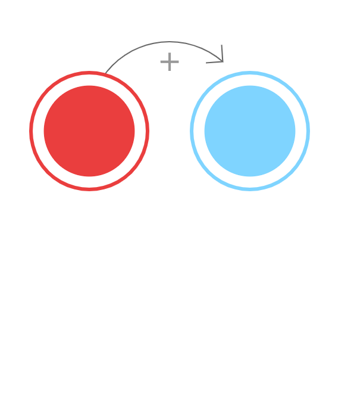
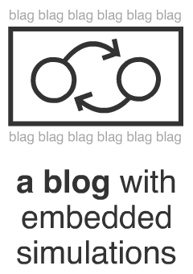
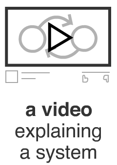

LOOPY: a tool for thinking in systems

In a world filled with ever-more-complex technological, sociological, ecological, political & economic systems... a tool to make interactive simulations may not be that much help. But it can certainly try.

play with simulations

It's the ancient, time-honored way of learning: messing around and seeing what happens. Play with simulations to ask "what if" questions, and get an intuition for how the system works!

programming by drawing

Raw code is too inaccessible. Also drag-and-drop is too mainstream. But with LOOPY, you can model systems by simply drawing circles & arrows, like a wee baby

remix others' simulations

Want to build upon your friends' models? Or challenge your enemies' models? LOOPY lets you have a conversation with simulations! You can go from *thinking* in systems, to *talking* in systems.

NOW PLAY WITH AN EXAMPLE:

[ basic ecology](http://ncase.me/loopy/v1.1/?data=[[[1,227,303,0.66,%22rabbits%22,0],[2,663,304,0.66,%22foxes%22,1]],[[2,1,153,-1,0],[1,2,160,1,0]],[[442,316,%22A%2520basic%2520ecological%250Afeedback%2520loop.%250A%250ATry%2520adding%2520extra%250Acreatures%2520to%2520this%250Aecosystem!%22],[442,109,%22more%2520rabbits%2520means%2520MORE%2520foxes%253A%250Ait%27s%2520a%2520positive%2520(%252B)%2520relationship%22],[451,513,%22more%2520foxes%2520means%2520FEWER%2520rabbits%253A%250Ait%27s%2520a%2520negative%2520(%25E2%2580%2593)%2520relationship%22],[754,455,%22*%2520P.S%253A%2520this%2520is%2520NOT%2520the%2520%250ALotka-Volterra%2520model.%250AIt%27s%2520just%2520an%2520oscillator.%250Aclose%2520enough!%22]],2%5D)[ depression & anxiety](http://ncase.me/loopy/v1.1/?data=[[[1,198,285,0,%22depression%22,0],[2,531,282,0,%22doing%2520things%22,4],[3,367,115,0,%22de-motivation%22,1],[4,702,116,0,%22fear%2520of%2520mistakes%22,1],[5,860,289,0,%22anxiety%22,0],[6,699,468,0,%22accepting%2520mistakes%22,4],[7,364,473,0,%22feeling%2520good%22,4]],[[2,7,59,1,0],[2,6,-61,1,0],[6,5,-59,-1,0],[5,4,-57,1,0],[4,2,-53,-1,0],[3,2,56,-1,0],[1,3,66,1,0],[7,1,63,-1,0]],[[365,296,%22a%2520possible%250Asystems-level%250Aexplanation%2520for%250Awhy%2520depression%2520%2526%250Aanxiety%2520are%2520not%2520just%250Aco-morbid%252C%2520but%250AMUTUALLY%2520SELF-%250AREINFORCING%22],[695,300,%22CHALLENGE%253A%250A%250Adraw%2520%2526%2520simulate%250Ayour%2520OWN%2520mental%250Afeedback%2520loops%22]],7])[ automation & job loss](http://ncase.me/loopy/v1.1/?data=[[[1,181,181,0,%22automation%22,0],[2,486,175,0,%22profits%22,0],[3,369,482,0,%22job%2520loss%22,4],[4,567,513,0,%22frustration%22,4],[5,752,432,0,%22political%2520unrest%22,4],[6,655,283,0,%22tax%2520revenue%22,3]],[[1,3,-88,1,0],[1,2,-150,1,0],[2,1,-137,1,0],[3,4,-27,1,0],[4,5,-32,1,0],[2,6,12,1,0]],[[331,197,%22vicious%2520cycle%250Aof%2520automation%250Aleads%2520to%2520short-%250Aterm%2520job%2520loss%252C%250Athen%2520frustration%252C%250Athen%2520political%250Aunrest%22],[733,143,%22CHALLENGE%253A%250Athink%2520up%2520and%2520model%2520your%250Aown%2520solutions%2520to%2520this%2520problem!%250A(hint%253A%2520what%2520tax-funded%2520programs%250Acould%2520mitigate%2520job%2520loss%2520due%2520to%250Aautomation%253F)%22],[489,383,%22%253F%253F%253F%2520what%2520goes%2520here%2520%253F%253F%253F%22]],6])

* * *

**more LOOPY models, made by other peeps!**

- [Why ads destroy our trust in journalism, and each other](https://t.co/VPG9153B2T)by [@DawnPaladin](https://twitter.com/DawnPaladin)& [@ncasenmare](https://twitter.com/ncasenmare)
- [The incentives of quantity over quality in the sciences](http://bit.ly/2nwUu7E)by [@beausievers](https://twitter.com/beausievers)
- [I just finished a big project, why do I feel so sad?](https://t.co/QxRKsrm4C2)by [@ncasenmare](https://twitter.com/ncasenmare)
- [Mutated proteins in cancer](http://bit.ly/2nUfLNn)by [@clairemcwhite](https://twitter.com/clairemcwhite)
- [A toy e. coli repressilator](http://bit.ly/2nJrxK0)by [@clairemcwhite](https://twitter.com/clairemcwhite)
- [An explanation of positive & negative feedback loops](http://bit.ly/2o0hqQV)by [@ncasenmare](https://twitter.com/ncasenmare)
- [Sex education and its social effects](https://t.co/dOWNTWvHcu)by [@syk0saje](https://twitter.com/syk0saje)
- [Simulation of an operational amplifier](https://t.co/AVO9wczz0F)by [@charlesjuliank](https://twitter.com/charlesjuliank)
- [The feedback loop of librarians](https://t.co/xhYtI3V7LV)by [@jackslack](https://twitter.com/jackslack)
- [The cheese paradox](https://t.co/yBZwZYKWU3)by [@t0zy](https://twitter.com/t0zy)
- [The delayed effects of climate change](https://goo.gl/sJifyC)by [@JonDarkow](https://twitter.com/JonDarkow)
- [How driving crowds out walking & biking](https://t.co/FbiPwb6WHh)by [@elipousson](https://twitter.com/elipousson)
- [The Shining: a simulation](https://t.co/dOGejZhjai)by [@actuallymm](https://twitter.com/actuallymm)
- [A, uh, "solution" to the automation/job-loss problem](http://bit.ly/2nbHqX3)by [vpribish](https://news.ycombinator.com/user?id=vpribish)
- [Economic and security cooperation between the UK and EU](https://t.co/l5JoBsEa5q)by [@RupertMyers](https://twitter.com/RupertMyers)
- [A simulation of MACBETH](http://bit.ly/2o1n29U)by [@PatientRock1](https://twitter.com/PatientRock1)
- [A simple hydrology model](https://t.co/m2eZpcYRPc)by [@ethankale](https://twitter.com/ethankale)

[OR, MAKE A MODEL FROM SCRATCH →](https://ncase.me/loopy/v1.1)
Like duct tape, you can use LOOPY for all sorts of things:

However you choose to use LOOPY, hopefully it can give you not just the software tools, but also the *mental* tools to understand the complex systems of the world around us. It's a hot mess out there.

[TRY OUT LOOPY →](https://ncase.me/loopy/v1.1)
Happy simulating! <3
LOOPY is a part of
[EXPLORABLE EXPLANATIONS](http://explorableexplanations.com/)
a movement to make learning active, not just passive

LOOPY is also open source and public domain, meaning it's free for coders, educators, and just about anybody to re-use and re-mix LOOPY as they see fit.[(Get the source code on Github!)](https://github.com/ncase/loopy)

LOOPY is made by Nicky Case, ([my wobsite](http://ncase.me/) | [my tweeter](https://twitter.com/ncasenmare))

thanks to my generous supporters on Patreon

And if you like what I make, feel free to[toss coins at me on Patreon](https://www.patreon.com/ncase). <3

share:

- 
- 
- 