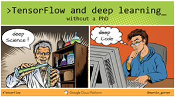
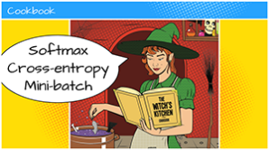
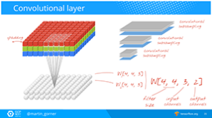
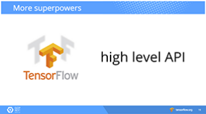
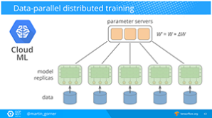

Learn TensorFlow and deep learning, without a Ph.D. | Google Cloud Big Data and Machine Learning Blog  |  Google Cloud Platform

 

## [Learn TensorFlow and deep learning, without a Ph.D.](https://cloud.google.com/blog/big-data/2017/01/learn-tensorflow-and-deep-learning-without-a-phd.html)

Thursday, January 19, 2017

*By Martin Görner, Google Cloud Platform Developer Advocate*

**This 3-hour course (video + slides) offers developers a quick introduction to deep-learning fundamentals, with some TensorFlow thrown into the bargain. **

[Deep learning](https://en.wikipedia.org/wiki/Deep_learning) (aka neural networks) is a popular approach to building machine-learning models that is [capturing developer imagination](https://www.technologyreview.com/s/513696/deep-learning/). If you want to acquire deep-learning skills but lack the time, I feel your pain.

In university, I had a math teacher who would yell at me, “Mr. Görner, integrals are taught in kindergarten!” I get the same feeling today, when I read most free online resources dedicated to deep learning. My kindergarten education was apparently severely lacking in “dropout lullabies,” “cross-entropy riddles,” and [“relu-gru-rnn-lstm](http://colah.github.io/posts/2015-08-Understanding-LSTMs/) monster stories.” Yet, these fundamental concepts are taken for granted by many, if not most, authors of online educational resources about deep learning.

To help more developers embrace deep-learning techniques, without the need to earn a Ph.D., I have attempted to flatten the learning curve by building a short crash-course (3 hours total). The course is focused on a few basic network architectures, including dense, convolutional and recurrent networks, and training techniques such as dropout or batch normalization. (This course was initially presented at the [Devoxx conference](https://devoxx.be/) in Antwerp, Belgium, in November 2016.) By watching the recordings of the course and viewing the annotated slides, you can learn how to solve a couple of typical problems with neural networks and also pick up enough vocabulary and concepts to continue your deep learning self-education — for example, by exploring [TensorFlow](https://www.tensorflow.org/) resources. (TensorFlow is Google’s internally developed framework for deep learning, which has been growing in popularity since it was released as open source in 2015.)

### Dive into the presentations

**If you have 1 hour**: watch [this presentation](https://youtu.be/qyvlt7kiQoI) while following the [slide deck](https://goo.gl/pHeXe7). This installment covers dense and convolutional networks and is also available as a [self-paced codelab](https://codelabs.developers.google.com/codelabs/cloud-tensorflow-mnist)

**If you have 3 hours (recommended; recurrent networks are worth it!)**: watch [this presentation](https://youtu.be/vq2nnJ4g6N0). You'll need both slide decks, [Part 1](https://goo.gl/pHeXe7)[(L)](https://goo.gl/pHeXe7)and [Part 2](https://goo.gl/jrd7AR).

**If you prefer bite-sized portions**: Explore the table of contents below.

- **Chapter 1:** Introduction; handwritten digits recognition (the simplest neural network) ([Video](https://youtu.be/qyvlt7kiQoI) | [Slides](http://goo.gl/pHeXe7))

- **Chapter 2:** Ingredients for a tasty neural network + TensorFlow basics ([Video](https://www.youtube.com/watch?v=qyvlt7kiQoI&t=1m12s) | [Slides](https://goo.gl/pHeXe7#slide=id.g110257a6da_0_13))

- **Chapter 3: **More cooking tools: multiple layers, relu, dropout, learning rate decay ([Video](https://www.youtube.com/watch?v=qyvlt7kiQoI&t=24m32s) | [Slides](https://goo.gl/pHeXe7#slide=id.g110257a6da_0_631))

- **Chapter 4: **Convolutional networks ([Video](https://www.youtube.com/watch?v=qyvlt7kiQoI&t=38m48s) | [Slides](https://goo.gl/pHeXe7#slide=id.g124df921bc_0_114))

- **Chapter 5: **Batch normalization ([Video](https://www.youtube.com/watch?v=vq2nnJ4g6N0&t=76m43s) | [Slides](https://goo.gl/jrd7AR))

- **Chapter 6: **the high level API for TensorFlow ([Video](https://www.youtube.com/watch?v=vq2nnJ4g6N0&t=103m43s) | [Slides](https://goo.gl/jrd7AR#slide=id.g187d73109b_1_8))

- **Chapter 7: **Recurrent neural networks (and fun with Shakespeare) ([Video](https://www.youtube.com/watch?v=vq2nnJ4g6N0&t=107m25s) | [Slides](https://goo.gl/jrd7AR#slide=id.g17d56f1df3_0_106))

- **Chapter 8:** Google Cloud Machine Learning platform ([Video](https://www.youtube.com/watch?v=zqWt8oI4gEw&feature=youtu.be&t=23m6s) | [Slides](https://goo.gl/jrd7AR#slide=id.g963e5b4287fb24d_677))

### Next steps

- See Martin present this tutorial [in person at Google Cloud NEXT '17](https://cloudnext.withgoogle.com/schedule#target=tensorflow-and-deep-learning-without-a-phd-part-1-f63963b7-1588-4669-9216-a397cc503cd3) on March 8 (in San Francisco)
- Code a neural network yourself with the [self-paced codelab](https://codelabs.developers.google.com/codelabs/cloud-tensorflow-mnist)
- [Read TensorFlow “getting started” docs](https://www.tensorflow.org/get_started/)
- [Explore other TensorFlow tutorials](https://www.tensorflow.org/tutorials/)
- [Join the conversation via the tensorflow tag at StackOverflow](https://stackoverflow.com/questions/tagged/tensorflow)
- [Learn about Google Cloud Machine Learning](https://cloud.google.com/products/machine-learning/)

*All cartoon artwork sourced from [Alexander Pokusay© 123RF.com](http://fr.123rf.com/profile_alexpokusay)*