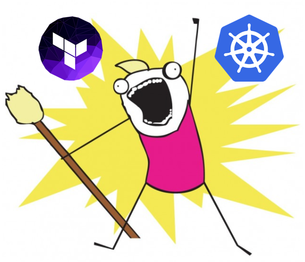

Learn Terraform by deploying a Google Kubernetes Engine cluster

# Learn Terraform by deploying a Google Kubernetes Engine cluster

[Tim Berry](https://medium.com/@timhberry)
Jun 8, 2018·6 min read

How many of the things do we run in Kubernetes?

As promised in my previous post, here’s a guide to getting started with Terraform and actually doing something useful with it: We’re going to deploy a Kubernetes cluster to Google Cloud Platform (GCP). To follow along with this guide you will need to do a few things first:

1. 1.Create an account with GCP and set up a project. There is a free tier, plus $300 in credits for new users that you can [apply for here](https://cloud.google.com/free/).

2. 2.Download the [terraform binary](https://www.terraform.io/downloads.html) for your platform.

3. 3.Open your terminal and create an empty working directory for your code.

Quick note: In this guide my project name is `gke-tf-demo`, please swap this for the name of the project you’ve just created. I’m deploying to the `europe-west1` region, but you can change that to suit your needs as well.

### Service Accounts

Before we write any Terraform code, we need a way for the Terraform runtime to authenticate with the GCP API. We could use the local `gcloud` SDK and our own user account, but a better practice is to create a dedicated service account for Terraform. This gives us greater control over the resources Terraform can interact with, and opens the door to future security measures like key rotation. That’s outside the scope of this guide, but for now go to the [Cloud Console](https://console.cloud.google.com/), navigate to **IAM & Admin** > **Service Accounts**, and click **Create Service Account**.

Name the service account `terraform` and assign it the **Project Editor** role. Tick **Furnish a new private key** and click **Create**. Your browser will download a JSON file containing the details of the service account and a private key that can authenticate as a project editor to your project. *Keep this JSON file safe!* Anyone with access to this file can create billable resources in your project.

In your new empty working directory, create a directory called `creds` and copy this JSON file into it. The filename will contain a random hash, so rename it to `serviceaccount.json` for convenience. Let’s also quickly create the following `.gitignore` file:

creds/*
.terraform/*

We won’t use git in this guide, but at some point in the future you’re probably going to commit this code and you don’t want to risk exposing your service account file.

### APIs

Each major product group in GCP has its own API, so one more quick thing we need to do is enable the Kubernetes API for our project before Terraform can talk to it.

From the [Cloud Console](https://console.cloud.google.com/), navigate to **APIs & Services** > **Dashboard**, then click **Enable APIs and Services**. Type ‘kubernetes’ in the search box, and you should find the Kubernetes Engine API. Then just click **Enable**. APIs can take a few minutes to enable fully, so fetch yourself a hot beverage at this point.

### Providers

Now we’ve got a way for Terraform to access our project, let’s start writing some infrastructure code! The first thing we need to declare is a *provider*. Terraform can interact with the APIs of all the major cloud providers, plus several PaaS offerings and other applications. This is achieved through providers. So to create resources in GCP we need to declare that we’re using the google provider. Create the following `provider.tf` file in your directory, replacing the project name with your own:

Now run `terraform init` to initialize your local environment. If all goes well Terraform will obtain the necessary provider binary and should happily report:

* provider.google: version = “~> 1.14”
Terraform has been successfully initialized!

If you have a problem at this stage you may not have installed the Terraform binary correctly, so please check the [instructions on their website](https://www.terraform.io/intro/getting-started/install.html) for help.

### Resources

Once the provider is in place we can declare resources for Terraform to deploy. Resources are simply the pieces of infrastructure we want to create: compute instances, disks, storage buckets and so on. Declaring resources will form the bulk of most infrastructure code.

Create the following `gkecluster.tf` file in your directory:

As you can see, declaring resources with Terraform is very simple. A resource definition has 2 primary arguments: the resource type (`google_container_cluster`) and a unique name. Note that in this example, “gke-cluster” is the unique name of the resource Terraform will use to manage its state, while “my-first-gke-cluster” will be the actual name of the cluster that gets created in GCP.

Believe it or not this short snippet of code is all we need to create a fully managed Kubernetes cluster in GCP. There are lots of other options we could define for this resource (as covered in Terraform’s [excellent documentation](https://www.terraform.io/docs/providers/google/r/container_cluster.html)) but they are all optional.

### Plan & Apply

Now run `terraform plan -out myplan` and see what happens. This is the often overlooked beauty of Terraform’s declarative lifecycle. You are specifying (ie. declaring) in code the desired state of your infrastructure. It’s Terraform’s job to make sure that real life reflects this, so when it runs it compares the existing state of the infrastructure, any stored state that it knows about (more on that later) and the state you have declared in code. When you run `terraform plan` it does all this, then tells you what steps it needs to take to ensure parity between all those things.

With this command we’ve also told Terraform to save the plan in a local file called “myplan”. This allows us to specify a known plan in the apply stage. If you ask Terraform to apply changes without specifying a plan it will create one, but you won’t get a chance to review it before it’s applied.

Now you can apply the plan with: `terraform apply "myplan"`

After a couple of minutes, Terraform will have deployed our Kubernetes cluster. You can see this from the [Cloud Console](https://console.cloud.google.com/) by navigating to **Kubernetes Engine** from the main menu.

### Changes

As stated earlier, Terraform plans changes by comparing live state, stored state and desired state. You’ll notice your working directory now contains a file called `terraform.tfstate` which is a JSON representation of the last known state of your managed infrastructure (that is, resources you have defined via Terraform — not necessarily all of the resources in your project). Every time this file gets updated, the previous known state is written to `terraform.tfstate.backup`. When you start working on bigger projects or wish to collaborate with other team members on changes, you can utilise a storage bucket for remote state, but that’s outside the scope of this guide.

Let’s test how Terraform handles changes by adding another resource definition. Create the following `nodepool.tf` file:

In this file we’re declaring a second node pool to add to our cluster. Let’s run `terraform plan -out=myplan` again to see the changes Terraform proposes. You can see that Terraform is planning to add the new resources. Run `terraform apply "myplan"` and watch the magic happen. You now have a second node pool in your Kubernetes cluster.

You can observe how Terraform calculates state and changes with a couple of other quick tests:

- •Try making no changes and running a `plan` and `apply`. You’ll see that Terraform is already quite happy with the state of things and won’t make any changes.
- •Remove the `nodepool.tf` file or comment out its contents, then run another `plan` and `apply`. You’ll see that Terraform removes the additional node pool to ensure that the actual state matches the one you are declaring in code.

Finally let’s get rid of any resources we’ve created so you don’t incur any charges. You can do this with one easy command: `terraform destroy`. Terraform will ask you to confirm before it carries out this instruction, because it cannot be undone. You should also delete the service account you created earlier unless you’re going to experiment further with this project.

Hopefully this guide has given you a quick demonstration of the principles behind Terraform and how powerful it can be. In [the next guide](https://medium.com/@timhberry/deploy-jenkins-to-google-kubernetes-engine-with-helm-60e0a4d7de93), we’ll deploy Jenkins to our GKE cluster and set up a pipeline to do all this magic Terraform for us!

Please feel free to [follow me on Twitter](https://twitter.com/timhberry)!