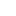
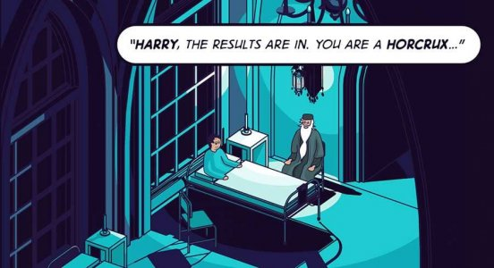
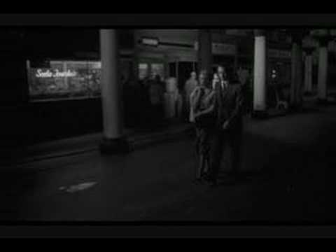
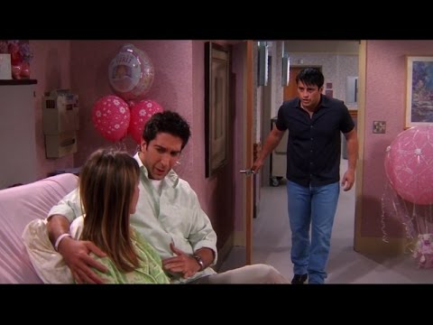
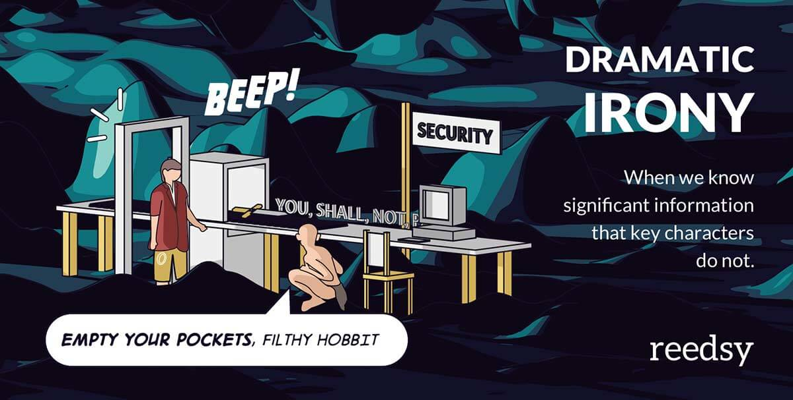
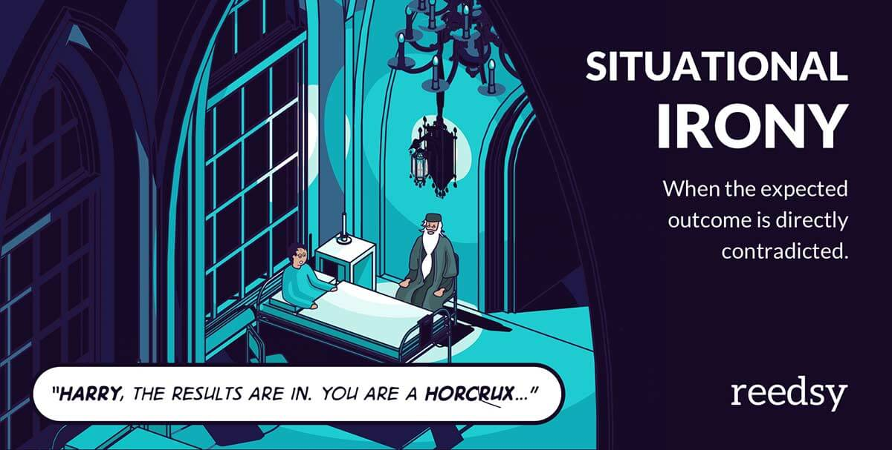
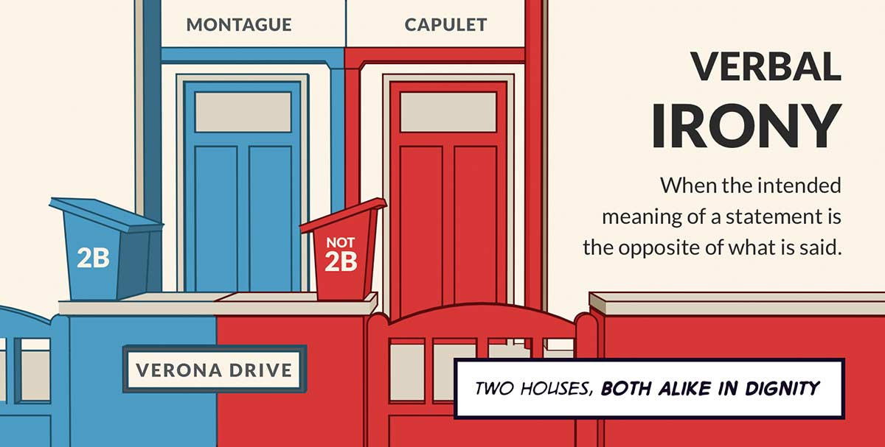

Learn What Irony (Really) Is and How To Use It

 [Back to all posts](https://blog.reedsy.com/)

# Learn What Irony (Really) Is and How To Use It

June 27, 2017 - [Perfecting your Craft](https://blog.reedsy.com/category/perfecting-craft/) - [Leave your thoughts](https://blog.reedsy.com/what-is-irony/#disqus_thread)

 [*  *](https://twitter.com/home?status=Currently+reading%3A+Learn+What+Irony+%28Really%29+Is+and+How+To+Use+It+-+https%3A%2F%2Fblog.reedsy.com%2Fwhat-is-irony%2F+-+%40ReedsyHQ)

 [*  *](https://www.facebook.com/sharer/sharer.php?u=https%3A%2F%2Fblog.reedsy.com%2Fwhat-is-irony%2F)

 [*  *](https://plus.google.com/share?url=https%3A%2F%2Fblog.reedsy.com%2Fwhat-is-irony%2F)

 [*  *](https://www.linkedin.com/shareArticle?mini=true&url=https%3A%2F%2Fblog.reedsy.com%2Fwhat-is-irony%2F&title=Learn+What+Irony+%28Really%29+Is+and+How+To+Use+It&summary=Currently+reading%3A+Learn+What+Irony+%28Really%29+Is+and+How+To+Use+It+-+https%3A%2F%2Fblog.reedsy.com%2Fwhat-is-irony%2F&source=)

 

We know it when we see it, but few of us can articulate what irony really is without relying on half-remembered lyrics from the 1995 Alanis Morissette song, “Ironic.” But it’s critical for writers to understand irony, which can add depth to conflict — or, in certain cases, make conflict feel hackneyed and stale. In this article, we will define and analyze different types of irony, and examine how to use irony successfully in your writing. Finally, we’ll dispel the notion that [rain on your wedding day is ironic](https://www.youtube.com/watch?v=G2y8Sx4B2Sk) — a concept that, ironically enough, isn’t ironic at all.

**CONTENTS:**

 [What is irony?](https://blog.reedsy.com/what-is-irony/#irony)[Dramatic Irony](https://blog.reedsy.com/what-is-irony/#dramaticirony)

 [Situational Irony](https://blog.reedsy.com/what-is-irony/#situationalirony)
 [Verbal Irony](https://blog.reedsy.com/what-is-irony/#verbalirony)

 [Quiz Yourself: How Well Do You Know Irony?](https://blog.reedsy.com/what-is-irony/#ironyquiz)

# What is irony?

Irony is a storytelling tool used to create contrast between how things *seem* and how they really are beneath the surface. The term “ironic” comes from the Latin word *ironia*, which means “feigned ignorance.” The three main types of irony used in literature are dramatic, situational, and verbal.

Irony is not synonymous with [sarcasm](https://blog.reedsy.com/what-is-irony/#sarcasm), [coincidence](https://blog.reedsy.com/what-is-irony/#coincidence), or [bad luck](https://blog.reedsy.com/what-is-irony/#badluck). While these concepts can have ironic characteristics, they’re not interchangeable. More on that later.

.

[Irony creates contrast between how things seem and how they really are beneath the surface.](https://twitter.com/share?text=Irony+creates+contrast+between+how+things+seem+and+how+they+really+are+beneath+the+surface.&via=ReedsyHQ&related=ReedsyHQ&url=https://blog.reedsy.com/what-is-irony/)

[Click To Tweet](https://twitter.com/share?text=Irony+creates+contrast+between+how+things+seem+and+how+they+really+are+beneath+the+surface.&via=ReedsyHQ&related=ReedsyHQ&url=https://blog.reedsy.com/what-is-irony/)

.

# **Dramatic Irony**

When readers are informed of significant information that key characters are unaware of — meaning we know what will happen before they do — that’s called “dramatic irony.” Tension rises between the point of revelation (when the reader first receives the secret insight) and recognition (when the characters are finally brought into the loop).

## **Functions of Dramatic Irony**

**To create feelings of fear or suspense

 **In his tips on mastering tension, Alfred Hitchcock explains how the use of suspense can engage audiences by describing two scenes: In the first, four people are sitting at a table, talking about baseball when a bomb explodes. In the second, we witness an anarchist enter the room, place a bomb under the table, and set it to explode at 1pm. Moments later we watch as four people sit at that table and have a conversation. There is a clock on the wall that reads 12:45pm.

In the first scene, we experience momentary surprise. In the second scene, an innocuous conversation becomes charged with prolonged suspense. For an example, watch Hitchcock’s exact principles on tension come to life in the opening shot from Orson Welles’ *A Touch of Evil*.

**To create sympathy for a character

 **In the movie *Ten Things I Hate About You*, high school senior Kat is seen as cold and reserved. After Patrick agrees to woo Kat as a favor to a fellow classmate (and in exchange for money), we see her warm to him. As they fall for each other, we know the truth about Patrick’s initial interest in Kat will eventually come out, and feel sympathy for her as the reveal comes closer.

.

[Knowing a character's fate before they do can bring about feelings of sympathy from the reader.](https://twitter.com/share?text=Knowing+a+character%27s+fate+before+they+do+can+bring+about+feelings+of+sympathy+from+the+reader.&via=ReedsyHQ&related=ReedsyHQ&url=https://blog.reedsy.com/what-is-irony/)

[Click To Tweet](https://twitter.com/share?text=Knowing+a+character%27s+fate+before+they+do+can+bring+about+feelings+of+sympathy+from+the+reader.&via=ReedsyHQ&related=ReedsyHQ&url=https://blog.reedsy.com/what-is-irony/)

.

**To bring us closer to a character

 **In most superhero stories, the reader knows the protagonist’s true identity, while most characters inside the story are unaware of the hero’s secret identity. This is another kind of dramatic irony that brings readers closer to a character; we sympathize with Peter Parker because we know he’s really Spiderman.

**To create moments of vulnerability

 **In the French play [*The Game of Love and Chance*](https://en.wikipedia.org/wiki/The_Game_of_Love_and_Chance), Silvia and Dorante are betrothed but have never met. Each resolves to disguise themselves as a servant and do some snooping about one another’s true nature. When they meet, each assumes the other is a servant. Silvia and Dorante are especially vulnerable, since they believe in the relative safety of their disguises — but the audience knows the truth.

**To create comical situations

 **In an episode of *Friends*, Joey picks up Ross’s coat and a ring tumbles out — a ring intended for Rachel. When Joey kneels down to pick it up, Rachel assumes he is proposing and accepts. Comedy ensues as misunderstanding and miscommunication take the day. These scenes following Joey’s “proposal” are a great example of dramatic irony:

No matter how dramatic irony is being used, remember that ignorance can only remain bliss for so long. Once something is revealed to the reader, “recognition” in the text must follow soon after. A character who stays oblivious for too long can start to feel unrealistic to readers, and tension is then replaced by frustration.

## **Dramatic Irony Example: The Hobbit**

Dramatic irony need not underline the entire storyline of a novel, it can also be used briefly to add punch to specific scenes. The Hobbit contains a perfect example of this when Bilbo happens upon the ring while lost in a mountain. He puts it in his pocket and soon after encounters Gollum. At this point, readers are aware of the significance of the ring and of its importance to Gollum. However, Gollum does not yet realize he has lost the ring and Bilbo doesn’t know who the ring belongs too. For this reason, the scene where Bilbo and Gollum engage in a game of riddles is wracked with tension.

Instead of letting the suspense continue for several chapters, J. R. R. Tolkien swiftly builds and then breaks it by having Gollum discover the ring is missing minutes later, while still in the company of Bilbo.

.

[Dramatic irony is when readers know significant information that key characters are unaware of.](https://twitter.com/share?text=Dramatic+irony+is+when+readers+know+significant+information+that+key+characters+are+unaware+of.&via=ReedsyHQ&related=ReedsyHQ&url=https://blog.reedsy.com/what-is-irony/)

[Click To Tweet](https://twitter.com/share?text=Dramatic+irony+is+when+readers+know+significant+information+that+key+characters+are+unaware+of.&via=ReedsyHQ&related=ReedsyHQ&url=https://blog.reedsy.com/what-is-irony/)

.

# **Situational Irony**

When an expected outcome is directly contradicted, this is known as “situational irony” or “the irony of events.”

It’s easy to confuse situational irony with "coincidence" and "bad luck." To differentiate, consider this: If you buy a new car and then accidentally drive it into a tree, that is both coincidence and bad luck. If a professional stunt driver crashes into a tree on their way home from receiving a “best driver” award, that is situationally ironic.

## **Functions of Situational Irony**

**To create a good ol’ fashioned twist

 **In Roald Dahl’s *A Lamb to the Slaughter*, a woman kills her husband with a frozen leg of lamb. When the cops arrive, she cooks the lamb and feeds it to them, effectively making them eat the evidence. Bizarre, right? From this example, we see how situational irony can be used to draw strong reactions from readers by presenting them with carefully contrived twists and turns. Because of the inherent element of surprise in situationally ironic storylines, it is often employed in the thriller, crime, and mystery genres.

**To emphasize themes

 **Situational irony steers readers to an unexpected destination within a story, which can emphasize a novel’s theme or moral lesson. For this reason, it is often used in fables or morality-focused stories, such as The Tortoise and the Hare. The unexpected outcome teaches us that “slow and steady wins the race.”

.

[Situational irony can emphasize a novel’s theme by steering readers in an unexpected direction.](https://twitter.com/share?text=Situational+irony+can+emphasize+a+novel%E2%80%99s+theme+by+steering+readers+in+an+unexpected+direction.&via=ReedsyHQ&related=ReedsyHQ&url=https://blog.reedsy.com/what-is-irony/)

[Click To Tweet](https://twitter.com/share?text=Situational+irony+can+emphasize+a+novel%E2%80%99s+theme+by+steering+readers+in+an+unexpected+direction.&via=ReedsyHQ&related=ReedsyHQ&url=https://blog.reedsy.com/what-is-irony/)

.

## **Situational Irony Example: Harry Potter and the Deathly Hallows**

Situational irony is often present in many layers. Throughout the seventh book of the Harry Potter series, readers follow Harry on his quest to find and destroy Voldemort’s six horcruxes. At the end of the novel, we find out that there is a seventh horcrux: Harry. This unexpected twist also comes with the ironic realization that in order for Voldemort to die, Harry must sacrifice himself. So he willingly goes to meet Voldemort — and his own death. When Voldemort uses the killing curse on Harry, it has the opposite of his desired effect. Harry lives but the horcrux dies, bringing Voldemort that much closer to his greatest fear: mortality.

By revealing the truth about the horcruxes to both readers and Harry at the end of the series, we also have a greater understanding of one of the novel’s prevalent themes: immortality does not bring true power; love does.

.

[Situational irony is when an expected outcome is directly contradicted.](https://twitter.com/share?text=Situational+irony+is+when+an+expected+outcome+is+directly+contradicted.&via=ReedsyHQ&related=ReedsyHQ&url=https://blog.reedsy.com/what-is-irony/)

[Click To Tweet](https://twitter.com/share?text=Situational+irony+is+when+an+expected+outcome+is+directly+contradicted.&via=ReedsyHQ&related=ReedsyHQ&url=https://blog.reedsy.com/what-is-irony/)

.

# **Verbal Irony**

Also referred to as rhetorical irony, verbal irony is when the intended meaning of a statement is the opposite of what is said. Sound similar to sarcasm? Well, some will tell you that the two are not the same: sarcasm, they say, is used with the intent to mock or insult someone, whereas verbal irony is not. However, others argue that sarcasm is simply one type of verbal irony, along with “overstatement” and “understatement.” The argument in defense of the latter is that sarcastic remarks are not always ironic, and verbally ironic statements do not always intend to offend. In light of this, the terms are not interchangeable; however, there is considerable overlap.

## **Functions of Verbal Irony**

**To provide insight into a character

 **Unlike dramatic and situational irony, when characters are usually not in control of the situation, verbal irony depends on the character’s awareness; they intentionally state something that contradicts their true meaning. It can be used to reveal a little more about a character’s personality or motives.

Effective verbal irony relies on well-planned timing and context. A character needs to be properly developed, and the tone of a scene needs to be properly conveyed, in order for dialogue to come across as ironic. Otherwise, the irony in the character’s statement may go over the reader’s head or be taken literally. Isn’t that ironic?*

 *It isn’t.

## **Verbal Irony Example: Romeo and Juliet**

One of literature’s most noted instances of verbal irony can be found in the very first line of Romeo and Juliet, spoken by the Chorus:

*Two households, both alike in dignity.*

Upon first reading this line, it is not immediately obvious that this is an ironic statement. But continue reading the next few lines and you find:

*(In fair Verona, where we lay our scene),
 **From ancient grudge break to new mutiny,
 **Where civil blood makes civil hands unclean.*

## 

At this point, we can see that the chorus does not mean both households are alike in dignity in terms of honor or respect. Instead, the chorus is implying that both households are equally undignified. This verbally ironic line does more than elicit a knowing chuckle from those who are familiar with the play; it sets the tone for the entire story and notifies readers from the start that not all that glitters is gold. While both families might be considered of noble status from the outside, it is their inability to act particularly noble towards one another that leads to tragedy at the end of the play.

.

[Verbal irony is when the intended meaning of a statement is the opposite of what is said.](https://twitter.com/share?text=Verbal+irony+is+when+the+intended+meaning+of+a+statement+is+the+opposite+of+what+is+said.&via=ReedsyHQ&related=ReedsyHQ&url=https://blog.reedsy.com/what-is-irony/)

[Click To Tweet](https://twitter.com/share?text=Verbal+irony+is+when+the+intended+meaning+of+a+statement+is+the+opposite+of+what+is+said.&via=ReedsyHQ&related=ReedsyHQ&url=https://blog.reedsy.com/what-is-irony/)

.

### reedsyquiz

### Quiz Yourself: How Well Do You Know Irony?

Define what type of irony each of these examples belongs to!

 [Start the quiz!](https://www.qzzr.com/c/quiz/428227/how-well-do-you-know-irony)

Alright, irony experts (*slight* verbal irony there — after all, you won’t be experts until you actually start incorporating what you’ve learned into your writing), by now you should understand the main point of irony: to create contrast between appearances and underlying truths. When done properly, this can alter a reader’s interaction with, expectations of, and insight into a novel. Remember to use irony with care, as it often forces people to read between the lines. This can add a lot to the reading experience, but shouldn’t throw us so far off-course that we can’t find our way to the truth irony hides.

* * *

**If you have any questions about the different types of irony or how to use them in your writing, leave it in the comments!**

[← 12 Types of Travel Writing Every Writer Should Know](https://blog.reedsy.com/types-of-travel-writing/)

[The Lightbulb Moment: Turning an Idea Into a Novel →](https://blog.reedsy.com/lightbulb-moment/)