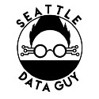
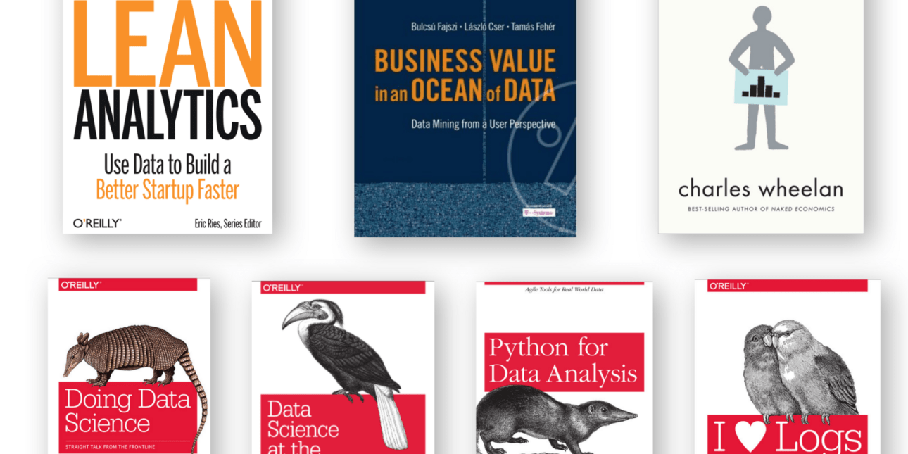
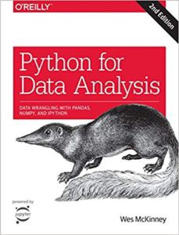
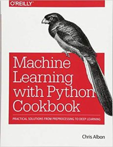
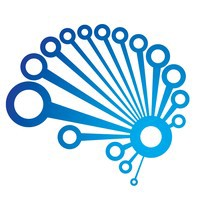

Learning Data Science: Our Favorite Resources To Learn Data Science From Free To Not

# Learning Data Science: Our Favorite Resources To Learn Data Science From Free To Not

[SeattleDataGuy](https://hackernoon.com/@SeattleDataGuy)

Apr 1·16 min read

[By Ben Rogojan](https://www.linkedin.com/in/benjaminrogojan/) Originally Posted [Here](https://www.coriers.com/learning-data-science-our-favorite-resources-from-free-to-not/)

Today we wanted to cover some of our favorite resources for data science. As the title suggests, these resources will be from free to not. Some people like buying books and other people prefer online courses. So we have created this list of data resources that range from books to courses, from free to not.

Data science has many facets. Statistics, data cleansing, programming, system design and really…almost anything else data related depending on how large the company is.

This post will discuss our favorite resources for these topics. Now, most of these courses and books are primers for topics like statistics, Python and data science in general. They really will only provide the base knowledge. At the end of the day, real practical experience is one for the few things that will really train your data science knowledge. You should learn as much as you can from these resources and then apply for as many internships and entry-level positions as possible and study for interviews.

You will learn much more and gain more than just technical knowledge. You will also gain a lot of business experience.

With that, let’s get started!

### Free Statistics Courses

Let’s start with, learning/reviewing basic statistical concepts. Many of you have probably taken a statistics course or two in college. But you might not remember everything clearly so it’s a good idea to review from the beginning.

It can be tempting to try to start taking on complex statistical concepts and models. But most algorithms and models require some sort of accuracy and hypothesis testing. This means you actually need to be able to understand concepts like p-test vs at-value, z-statistics vs t-statistics, ROC vs AUC., random variables, etc.

These all seem like basic concepts and maybe you kind of remember these words. However, we find they often get forgotten as many of us focus more on learning how to implement models in python and R vs basic statistics. Although both of these concepts do not necessarily rely on each other. You can start to assume you understand what the p-value means when you run models in either language without fully grasping the importance of it.

### Statistics Courses

**1. Khan Academy**

This is why we recommend at least going back and walking through the Khan Academy statistics section. They cover concepts like [Hypothesis testing](https://www.khanacademy.org/math/statistics-probability/significance-tests-one-sample/more-significance-testing-videos/v/hypothesis-testing-and-p-values), [T-statistics vs Z-Statistics](https://www.khanacademy.org/math/statistics-probability/significance-tests-one-sample/more-significance-testing-videos/v/z-statistics-vs-t-statistics), [Confidence Intervals](https://www.khanacademy.org/math/statistics-probability/confidence-intervals-one-sample/estimating-population-proportion/v/confidence-interval-example?modal=1), etc.

Khan is always a good place to start because the videos are a great combination of visual and audio examples.

Personally, there aren’t too many books we like when it comes to pure statistics. In the R programming section of this resource list, we will reference our favorite R + Statistics book.

**2. Duke University On Coursera**

For a full course that are free you can try [Duke Universities Statistics Course](https://click.linksynergy.com/deeplink?id=GjbDpcHcs4w&mid=40328&murl=https%3A%2F%2Fwww.coursera.org%2Fspecializations%2Fstatistics). This is actually several courses that cover multiple types of statistics like [classical vs Bayesian](https://egertonconsulting.com/a-comparison-of-classical-and-bayesian-statistics/?doing_wp_cron=1553998376.7644860744476318359375). These are two different methods that are worth looking into.

*Heads Up! — This post contains referral links from Amazon Services LLC Associates Program, an affiliate advertising program designed to provide a means for us to earn fees by linking to Amazon.com and affiliated sites.*

### Python Videos, Books And Courses

Python is an interesting topic. The thing about python is there are so many plausible sub-sections of the programming language. For instance, when we prepare for interviews we always like to clarify which type of python questions we will be dealing with. Will we be asked questions that focus on concepts that are operational, analytical, optimization based, algorithms and data structures or possibly data science algorithms. All of these are different topics that have different styles of interview questions. Getting a question on how to traverse a binary tree is very different from having to implement a decision tree algorithm.

As a data scientist, typically you will benefit from the analytical and operational aspects of python. The operational portion will provide you with the ability to [**automate the boring stuff **](https://www.amazon.com/gp/product/1593275994/ref=as_li_tl?ie=UTF8&tag=buy05cb-20&camp=1789&creative=9325&linkCode=as2&creativeASIN=1593275994&linkId=ea8088753583055a3f273a268a496f73)**(<-3. as the cliche book is titled**).

This book is great for really…any data focused person. Data scientists, business analysts, Business Intelligence Engineers, and Database developers all can benefit from automation. Now, you don’t need to use python, if you’re in a windows environment there is PowerShell Linux has to bash. Learning some form of scripting language helps improve your workflow and design thinking.

Once you are comfortable with python in general, it’s then it becomes much easier to learn Pandas. Pandas is a data manipulation language that allows you to run transformations and basic analytics on data sets. Our one piece of advice is as a user you need to think about where Pandas provides value vs. SQL. Using Pandas over SQL is not always beneficial. This can be for many reasons. If you are running Pandas in a Jupyter notebook that runs on your computer, then whatever data processing you are doing is happening on the limited ram of your computer.

Most larger companies or at least tech companies will use some form of cloud computing for running your Jupyter Notebook. Still, python isn’t always the best for fast data transformations. We have seen someone develop a date_diff function in python that took 5 minutes to run for 1 million rows whereas if they would have run it in SQL it probably would have taken 1 second. This is an important note because imagine if instead of 1 million rows, it was 1 billion. That is 1000x time increase of run time (ok it’s not that simple when it comes to computing but the point is…much longer).

Pandas still have its place and are very useful for preparing and analyzing your data. Here are some great resources for Pandas:

### Free Pandas Python Videos

**4. The Down To Earth Explanation For Pandas**

Sentdex is a great youtube who really makes python in general simple. He creates python tutorials for several topics besides just Pandas. But we really appreciate his down to earth style. He assumes you are starting at ground zero and builds from there.

That’s what makes his videos probably some of the most effective video tutorials on Youtube in our opinion. Plus, his style is easy to follow.

**5. The Professional — Python Data Analysis With Panda**

We wanted to share a free Udemy video created by Frank Kane. You will see us reference this instructor several more times. He is one of the most professional course creators. Now, this video is free. However, Frank Kane does produce a lot of high-quality courses that we have paid for and enjoyed. He has courses from beginner to free in python and many other modern tech concepts. He also has created a book for Python And Machine Learning

[**6. The 1 Hour Introduction To Pandas**](https://youtu.be/ikOEn8jY2Is)

Finally, there aren’t a lot of long-form videos we enjoy. Often times it can be hard to follow these videos for an hour at a time. There is one that we enjoyed and wanted to share. If you are just getting started and you want a crash course on Pandas to check out the video below. Our one comment with the video below is you make sure to change the video Quality. For us, it starts out terrible until you shift it to 720p.

#### Python Books

There aren’t a lot of free books we like online for Pandas. So, in this case, we will be recommending some books you can pick off on Amazon or [O’Reily with their 10 day free trial](https://learning.oreilly.com/register/). This is actually at the very least, a great way to find books you might enjoy buying!

Here, you can’t go wrong with the classic

**7. **[**Python For Data Analysis**](https://www.amazon.com/gp/product/1491957662/ref=as_li_tl?ie=UTF8&tag=buy05cb-20&camp=1789&creative=9325&linkCode=as2&creativeASIN=1491957662&linkId=42a9a64770e07dcad65b36017f058970)**.**

image from amazon

It will cover all the basics, like data aggregations and time series while at the same time take through basic python exercises that will help you learn how to apply Pandas to actual problems. This is one of the traits we look for in books or courses. We tend to need actual problems that we can apply our skills on. It makes it easier to frame and approach the problems.

This book, as it states, really will take you through the “nuts and bolts of manipulating, processing, cleaning, and crunching data in Python”. These skills are crucial as a data scientist because most of your time will be focused on cleaning and processing data.

This is probably one of the few Pandas books we would recommend. There are many other data science and machine learning books we will also add to this list shortly. But there aren’t that many more books that are purely focused on Pandas that we would recommend.

### Machine Learning and Data Science Python

Pandas do a lot of basic analytical functions. It aggregates and runs basic descriptive statistical processes. In order to do apply more advanced models easily. You will need to learn Scikit learn. Now, we say this…sparingly. Simply learning how the library works do not make you a machine learning engineer. It is one of the important libraries to know because it contains most of the model’s data scientists will use in python.

Again, Sentdex has a great set of tutorials that are really down to earth.
**8. Machine Learning By Sentdex**

Sentdex has been around for a while, so for newer content, you can check out Simplilearn. It has some newer videos and they do a great job of going much more in depth. We do wish they would have gotten better audio quality but other than that it is a great set of videos for learning Scikit learn.

**9. Simplilearn — Machine Learning With Python**

### Python Machine Learning Book Recommendations

For books, we would recommend **10.**[**Machine Learning with Python Cookbook: Practical Solutions from Preprocessing to Deep Learning**](https://www.amazon.com/gp/product/1491989386/ref=as_li_tl?ie=UTF8&tag=buy05cb-20&camp=1789&creative=9325&linkCode=as2&creativeASIN=1491989386&linkId=24f11e81078746254c7eae13bdbc405d)**.**

image from amazon

This book will start light with topics like Linear regression and KNN and then go into more deep learning concepts like neural networks. Also, like many other O’Reilly books, it has a lot of great practical examples that are well explained.

### Machine Learning Courses For Python

If you’re looking for a course there are a couple of options.

Again, **11. **[**Frank Kane has another great course**](https://click.linksynergy.com/deeplink?id=GjbDpcHcs4w&mid=39197&murl=https%3A%2F%2Fwww.udemy.com%2Fdata-science-and-machine-learning-with-python-hands-on%2F) on this topic where he will cover more than the book mentioned above. He will also discuss Ensemble Learning and bias trade-offs. Plus, if you are a visual learner, this will probably benefit you more. There’s also an entire section on machine learning with Apache Spark, which lets you scale up these techniques to “big data” analyzed on a computing cluster.

Another great course is **12. **[**Machine Learning A-Z™: Hands-On Python & R In Data Science**](https://click.linksynergy.com/deeplink?id=GjbDpcHcs4w&mid=39197&murl=https%3A%2F%2Fwww.udemy.com%2Fmachinelearning%2F). This course is comprehensive and discusses both Python and R. This isn’t just focused on Scikit learn but machine learning in general. In addition, the creator of this course is the owner of [SuperDataScience.com](https://www.superdatascience.com/)this is a great site with a podcast, lessons and more. So if you don’t want to pay for the course, you can always listen to the podcasts for free!

Python, of course, is not the only language for data science. Another popular language is R (also, these aren’t the only 2 languages, there are other languages people like to use…except Matlab..we don’t talk about Matlab).

### Programming In R videos and books

Now there is always a discussion on which language to learn R or python. There are probably hundreds of blog posts arguing for one or the other. This debate will probably continue for the next few years until the next hot language for data science comes onto the scene. The truth is, as data scientists, it will all depend on the company/team you join. Some might use R, some will use Python, others will probably use some other language. It all depends on application, knowledge base, and the function of the team in the larger organization.

R is either loved or hated by data scientist. It can be much more difficult to implement into production and often plays more of a research role for most data scientist. This isn’t to say it is worse or less practical. Python just tends to be easier for most because they might already be using it for other automation processes. So all an engineer might have to do is learn more about data science and a few libraries vs. learning new syntax.

But, those who have started in R love it. R actually is quite easy to easy and already felt more like Jupyter notebooks before Jupyter notebooks existed.

It can run line by line and allows you to see your output right away. In addition, it is pretty easy to know what parameters to put for each function and if you were smart and already set up your data correctly using SQL it only requires a few lines of code to run your model.

For R books you can read the classic and honestly cliche book **13. **[**An Introduction to Statistical Learning: With Applications in R**](https://www-bcf.usc.edu/~gareth/ISL/ISLR%20Seventh%20Printing.pdf) for free online! If you ask any data scientist what some of their favorite books are, this is almost guaranteed to be one of them (even if they didn’t read it). Now if you really want to buy the book, then go ahead :).

Another classic **14. **[**R Cookbook: Proven Recipes for Data Analysis, Statistics, and Graphics**](https://www.amazon.com/gp/product/0596809158/ref=as_li_tl?ie=UTF8&tag=buy05cb-20&camp=1789&creative=9325&linkCode=as2&creativeASIN=0596809158&linkId=663777a061aa4710abace24f6d0948cf). This is a great intro book because it really only covers linear regression, graphics, and time series analysis in depth. There are several other subjects discussed but they are not as statistical focused or as in-depth as the subjects mentioned above. The value of this book is still very much there! In fact, we would recommend you review your statistics first, then read this book and then read An Introduction To Statistical Learning In R (now we need to create a study guide for our next post).

### Free Video For R Programming

One of our favorite beginner videos for R is made by Global Health with Greg Martin. The video created by Greg is very informational and entertaining..the bummer is it really is the only one focused on R for this channel…But it is a great primer for anyone looking to start out with R.

**15. R Programming For Beginners**

Now if you are looking for a fuller tutorial then you can watch David Langers R Tutorial on Data analysis. It is not as entertaining but just as informative. There are 7 total videos so you will get a pretty good understanding of R and how you can use it to analyze data.

Introduction To R And Data Analysis
**16. Introduction To Data Science With R Part 1**

### R Programming Course

What is great from the standpoint of organized courses in R is there are plenty of them. In fact, **17. **[**John Hopkins offers a data specialization certificate on Coursera for free.**](https://www.coursera.org/specializations/jhu-data-science) We would recommend it if you are looking to learn R and good data analysis practices. It’s another great primer for learning R.

Now, if you would prefer a paid course, then again, SuperDataScience offers another great course. You will cover all the important topics like Data frames and ggplot2 (which is arguably one of the most used libraries in R). You will always need a way to display your data.

**18. **[**R Programming From A To Z By Super Data Science**](https://click.linksynergy.com/deeplink?id=GjbDpcHcs4w&mid=39197&murl=https%3A%2F%2Fwww.udemy.com%2Fr-programming%2F)

Besides R and Python there is one more “language” you will want to learn. We use quotes because SQL doesn’t really provide the same functionality of Python or R. It really is just a layer used to interface with the database engine. Still, SQL does stand for Structured Query Language.

### SQL Books, Videos and Courses

SQL might not be as heavily discussed in some boot camps, but it is still a necessary skill for data scientist to have. It is often much easier to prepare the majority of your dataset in SQL vs Pandas. This can also help data scientists communicate with data engineers to help them develop the analytical tables and data pipelines they need to run their models more efficiently.

SQL remains a very valuable skill, even in the world of HDFS and other distributed data systems. These modern data systems like Hadoop have Presto and Hive layered on top which allows you to use SQL to interact with Hadoop instead of Java or Scala. SQL is the language of data and it allows data scientists and data engineers to easily manipulate, transform and transfer data between systems. Unlike programming, it is almost the same between all databases. There are a few that have decided to make very drastic changes. Overall, SQL is worth learning, even in today’s landscape.

SQL has plenty of online courses, books and cheats sheets you can read. Honestly, as a data scientist, you don’t need to learn too much past the basics.

One of our favorites is Wise Owl. We referenced this in our the skills needed to be a data engineer post. But we figured we would refer them one more time!

**19. SQL Query Basics For Free**

If you are interested in learning some more complex queries that are based on traditional relational databases here is another great series by wise owl.

**20. SQL Procedures And Programming**

**SQL Non-Free Courses**
All right, now for those of you who are interested in courses.

The difficult thing here is to delineate the various SQL layers. There is MySQL, Oracle, SQL Server Postgres, Redshift (sort of), Presto(again…sort of). Actually, what is kind of cool about Presto is that it can sit on top of MySQL and other database engines. For now, the course we have enjoyed is.

[**21. Mysql For Data Analytics And Business Intelligence**](https://click.linksynergy.com/deeplink?id=GjbDpcHcs4w&mid=39197&murl=https%3A%2F%2Fwww.udemy.com%2Fsql-mysql-for-data-analytics-and-business-intelligence%2F)

Yes, the title does not mention data science, but that is ok. The purpose here is to learn how to use SQL to answer business questions. Honestly, SQL is usually not the layer the “data science” part of data science occurs anyways.

Typically, SQL is more for data clean-up, joining tables, and basic aggregations. So this course is perfect for learning that. This course is more for beginners. The first few sections focused mostly on configuration and don’t get too heavy into complex SQL. However, as you go on you will learn several important topics like Self-joins and subqueries.

Bonus — It also has some quick projects in Tableau!
**SQL Books**

As far as SQL books go. We believe the more practical examples provided the better. Especially if they go beyond just trying to calculate the average purchase from a customer. So, in that case, we would recommend

[**22. Practical SQL : A Beginners Guide To Storytelling With Data**](https://www.amazon.com/gp/product/1593278276/ref=as_li_tl?ie=UTF8&tag=buy05cb-20&camp=1789&creative=9325&linkCode=as2&creativeASIN=1593278276&linkId=3802bdaf99fcc1a779e77b908bab31da)

One point about this book is that it is for Postgresql. If you would prefer a more traditional database you could check out **23. **[**Learning SQL: Master SQL Fundamentals**](https://www.amazon.com/gp/product/0596520832/ref=as_li_tl?ie=UTF8&tag=buy05cb-20&camp=1789&creative=9325&linkCode=as2&creativeASIN=0596520832&linkId=9b8c14d046ba76d2e0011f9c83025c8f). What we like about the Practical SQL book is the fact that it does a great job walking through the basics and then helping you apply those basics on some more complex problems. In addition, learning some Postgres along with watching a few videos on SQL Server or MySQL really will give you a great base. You will be able to start to differentiate the pros and cons of the various systems. This is less valuable as a data scientist but would be very important if you become an engineering manager who needs to make decisions like what database system you will base your entire company/team on.

### Career Advice And Case Studies

Besides all the basics like Python, Statistics, and R. It is great to watch examples of high-level projects and just general career advice.

For instance, one of our favorite high-level business case videos on Youtube is about Netflix Predicting Content Demand. They do a great job discussing the problem, talking about issues they needed to work through, how they processed data, etc. This is great for young data scientists because it helps you see the whole process. When young engineers/data scientists start out it can be tempting to jump into a project. However, videos like this walkthrough how the data scientists thought through the problem before going after it.

**24. Data Science In 30 Minutes: Predicting Content Demand At Netflix**

This next video is great for setting expectations. They cover how to be a good data scientist in general, some of the problems data scientists face, salary, etc. Now, you will hear a lot of the cliche responses from any data scientist. Garbage in garbage out, every company thinks of data scientists differently, data science, machine learning and big data can sometimes mesh together if you work for a startup you will do all of it. These might not seem like cliche answers if you are new to the field but if you have been working as data scientists for a few years you will get used to these answers.

[**25. Data Scientist: Reality vs Expectations 2**](https://youtu.be/0X2H-ZD_Chw)

Do you need help improving your career not just your skills? Kirell has a lot of great videos. In particular, this video below discusses how to improve your career as a data scientist and it is not just by learning more algorithms. He has gone through and interviewed a lot of different data scientists and gotten career advice from all of them and created this video with their top tips

[**26. HOW TO IMPROVE YOUR DATA SCIENCE CAREER — KIRILL EREMENKO**](https://youtu.be/s7Eo-QeZEqM)

As we said in the beginning. Using these free and non-free resources is only a small portion of becoming a data scientist. The best way to learn is to get a job as a data scientist. If you still have time, then get an internship. This is the first tip of the video below and our tip as well. Some of us struggled to get our first job because we didn’t get an internship and had to suck it up and get a lower level entry job until we got enough experience to work at a more tech-focused role. So we can endorse the first tip for sure!

[**27. 5 Tips For Getting A Data Science Job**](https://www.youtube.com/watch?v=MfP-P8EHGBo)

We were going to cover some fun, less technical books to read but we think this list is long enough for the time being!

We do hope you enjoyed this list of free to not resources for those looking to specialize in data science or even another database topic. There is a lot to cover and we hope you don’t become overwhelmed. Pick one or two of the courses or books at a time. Read it, learn it, understand it before jumping out the next one. This will help you with your data science journey. It can be tempting to buy every book and start every course, but then you will more than likely never finish any of them (unless you have amazing discipline).

So take your time and enjoy the process. We will probably have to make another list to further list out other valuable topics. Also, if you want to be the first to know about our new content when we create it then please make sure to sign up for our email list or reach out to us through our contact page!

If you would like to read more articles about data science check out the links below!

[How To Develop Robust Algorithms](https://medium.com/@SeattleDataGuy/how-to-develop-a-robust-algorithm-c38e08f32201)

[10 Best Articles On Data Science For 2018](https://www.coriers.com/10-great-programming-and-data-science/)

[Dynamically Bulk Inserting CSV Data Into A SQL Server](https://www.youtube.com/watch?v=2bBsYmQjzSE&t=4s)

[SQL Best Practices — Designing An ETL — Part 1](https://www.youtube.com/watch?v=sLhInuwdwcc&t=169s)

[How Algorithms Can Become Unethical and Biased](http://www.acheronanalytics.com/acheron-blog/how-do-machines-learn-bias-data-science)

[4 Must Have Skills For Data Scientists](https://www.theseattledataguy.com/4-skills-data-scientist-must-have/)

[What is A Decision Tree](http://www.acheronanalytics.com/acheron-blog/brilliant-explanation-of-a-decision-tree-algorithms)

This post contains referral links from Amazon Services LLC Associates Program, an affiliate advertising program designed to provide a means for us to earn fees by linking to Amazon.com and affiliated sites.