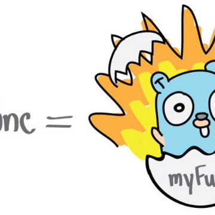

Learning Go’s Concurrency Through Illustrations – Trevor Forrey – Medium

Learning Go’s Concurrency Through Illustrations – Trevor Forrey – Medium

https://medium.com/@trevor4e/learning-gos-concurrency-through-illustrations-8c4aff603b3

You’ve most likely heard of Go in one way or another. It’s been increasing in popularity, and for good reason. Go is fast, simple, and has…