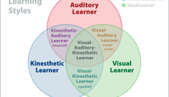

Learning by teaching others is extremely effective – a new study tested a key reason why

*By*  [Christian Jarrett](http://www.psychologywriter.org.uk/)

The learning-by-teaching effect has been demonstrated in [many](http://journals.sagepub.com/doi/abs/10.3102/00028312019002237)  [studies](https://www.sciencedirect.com/science/article/pii/S0361476X13000209). Students who spend time teaching what they’ve learned go on to show better understanding and knowledge retention than students who simply spend the same time re-studying. What remains unresolved, however, is exactly why teaching helps the teacher better understand and retain what they’ve learned.

For a [new study](https://onlinelibrary.wiley.com/doi/abs/10.1002/acp.3410?campaign=wolearlyview) in *Applied Cognitive Psychology* researchers led by Aloysius Wei Lun Koh set out to test their theory that teaching improves the teacher’s learning because it compels the teacher to retrieve what they’ve previously studied. In other words, they believe the learning benefit of teaching is simply another manifestation of the well-known “testing effect” – the way that bringing to mind what we’ve previously studied leads to deeper and longer-lasting acquisition of that information than more time spent passively re-studying.

The researchers recruited 124 students and asked them spend ten minutes studying a text, with accompanying figures, about the [Doppler Effect](https://en.wikipedia.org/wiki/Doppler_effect) and soundwaves – a topic about which none of them had any previous knowledge – with a view to teaching the material themselves afterwards without notes. Participants were told they could take notes while studying but not keep them for the next stage.

After the study phase, the participants were divided into four groups. In one group participants spent five minutes being filmed alone while they stood and delivered a lesson on the study material without notes (they could use a blank flip chart to draw figures if they wanted). The other groups either spent the same time completing multiplication arithmetic; standing up and teaching verbatim from a set script (including making reference to pre-drawn figures on a white board); or writing down all they could remember from the text (i.e. a form of retrieval practice designed to induce the testing effect).

A week later, all the participants returned to the lab for a surprise test of their knowledge and comprehension of the original study text in the form of six free-response questions that required them to explain key concepts from the study materials.

The critical finding is that the teaching-without-notes group outperformed the group that had spent the same time completing arithmetic problems and the group that had taught from a script, but so too did the group who simply spent the same time retrieving what they’d learned. In fact, the final comprehension performance of the teaching-without-notes group and the retrieval-practice group was comparable.

The researchers said their results suggest that “the benefits of the learning-by-teaching strategy are attributable to retrieval practice; that is, the robust learning-by-teaching strategy works but only when the teaching involves *retrieving* the taught materials.”

The new findings don’t undermine the notion of teaching as an effect learning method, but they have practical implications for how the learning-by-teaching approach is applied in education and training. “In order to insure that students and tutors learn and retain the educational material that they have prepared and presented in class, they ought to internalize the to-be-presented material prior to communicating it to an audience, rather than rely on study notes during the presentation process”, the researchers said.

Critical readers may take issue with the lack of realism in the study – there was no audience of learners in either of the teaching conditions and therefore no interaction, which surely also plays a part in the learning benefits of teaching. Also, participants in all groups were originally primed to expect to have to teach the material, which may have had learning benefits in itself – perhaps the retrieval group would not have matched the comprehension of the teaching-without-notes group without being primed in this way.

Lun Koh and colleagues acknowledged some of these issues and they called on further research to “assess the importance of retrieval practice across a variety of teaching scenarios and activities.”

—[The learning benefits of teaching: A retrieval practice hypothesis](https://onlinelibrary.wiley.com/doi/abs/10.1002/acp.3410?campaign=wolearlyview)

Image: Seven-year-old Jacqueline Loman addresses the class at Cheadle High School (Fox Photos/Getty Images)

[**Christian Jarrett**](http://www.psychologywriter.org.uk/)** (**[**@Psych_Writer**](https://twitter.com/psych_Writer)**) is Editor of ****[BPS Research Digest](https://digest.bps.org.uk/)**

### Share this:

- [Twitter](https://digest.bps.org.uk/2018/05/04/learning-by-teaching-others-is-extremely-effective-a-new-study-tested-a-key-reason-why/?share=twitter&nb=1)
- [Facebook](https://digest.bps.org.uk/2018/05/04/learning-by-teaching-others-is-extremely-effective-a-new-study-tested-a-key-reason-why/?share=facebook&nb=1)
- [LinkedIn](https://digest.bps.org.uk/2018/05/04/learning-by-teaching-others-is-extremely-effective-a-new-study-tested-a-key-reason-why/?share=linkedin&nb=1)
- [Reddit](https://digest.bps.org.uk/2018/05/04/learning-by-teaching-others-is-extremely-effective-a-new-study-tested-a-key-reason-why/?share=reddit&nb=1)
- [Pinterest100](https://digest.bps.org.uk/2018/05/04/learning-by-teaching-others-is-extremely-effective-a-new-study-tested-a-key-reason-why/?share=pinterest&nb=1)
- [Pocket](https://digest.bps.org.uk/2018/05/04/learning-by-teaching-others-is-extremely-effective-a-new-study-tested-a-key-reason-why/?share=pocket&nb=1)
- [Email](https://digest.bps.org.uk/2018/05/04/learning-by-teaching-others-is-extremely-effective-a-new-study-tested-a-key-reason-why/?share=email&nb=1)

-
 Loading...

### *Related*

#### ["Another nail in the coffin for learning styles" – students did not benefit from studying according to their supposed learning style](https://digest.bps.org.uk/2018/04/03/another-nail-in-the-coffin-for-learning-styles-students-did-not-benefit-from-studying-according-to-their-supposed-learning-style/)

In "Educational"

#### [Self-explanation is a powerful learning technique, according to meta-analysis of 64 studies involving 6000 participants](https://digest.bps.org.uk/2018/12/07/meta-analysis-of-64-studies-involving-6000-participants-finds-that-self-explanation-is-a-powerful-learning-technique/)

In "Educational"

#### [It feels as though we learn better via our preferred learning style, but we don't](https://digest.bps.org.uk/2016/10/05/it-feels-as-though-we-learn-better-via-our-preferred-learning-style-but-we-dont/)

In "Educational"