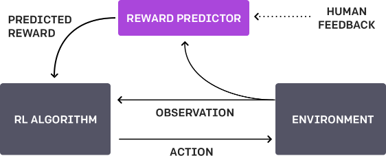
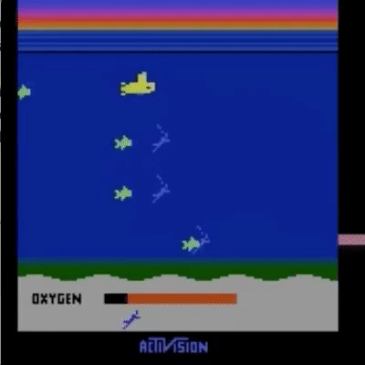
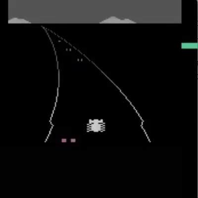
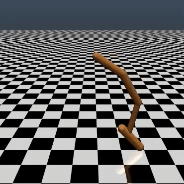

Learning from Human Preferences

# Learning from Human Preferences

  June 13, 2017

One step towards building safe AI systems is to remove the need for humans to write goal functions, since using a simple proxy for a complex goal, or getting the complex goal a bit wrong, can lead to [undesirable and even dangerous behavior](https://arxiv.org/abs/1606.06565). In [collaboration](https://deepmind.com/blog/learning-through-human-feedback/) with DeepMind’s safety team, we’ve developed an algorithm which can infer what humans want by being told which of two proposed behaviors is better.

[Read Paper](https://arxiv.org/abs/1706.03741)

* * *

We present a learning algorithm that uses small amounts of human feedback to solve modern RL environments. Machine learning systems with human feedback [have](https://papers.nips.cc/paper/4805-a-bayesian-approach-for-policy-learning-from-trajectory-preference-queries)  [been](https://link.springer.com/chapter/10.1007/978-3-319-02675-6_46)  [explored](https://arxiv.org/abs/1208.0984)  [before](https://hal.inria.fr/hal-00980839), but we’ve scaled up the approach to be able to work on much more complicated tasks. Our algorithm needed 900 bits of feedback from a human evaluator to learn to backflip — a seemingly simple task which is simple to judge but [challenging](https://blog.openai.com/deep-reinforcement-learning-from-human-preferences/#bflip) to specify.

*Our algorithm learned to backflip using around 900 individual bits of feedback from the human evaluator.*

The overall training process is a 3-step feedback cycle between the human, the agent’s understanding of the goal, and the RL training.

Our AI agent starts by acting randomly in the environment. Periodically, two video clips of its behavior are given to a human, and the human decides which of the two clips is closest to fulfilling its goal — in this case, a backflip. The AI gradually builds a model of the goal of the task by finding the reward function that best explains the human’s judgments. It then uses RL to learn how to achieve that goal. As its behavior improves, it continues to ask for human feedback on trajectory pairs where it’s most uncertain about which is better, and further refines its understanding of the goal.

Our approach demonstrates promising sample efficiency — as stated previously, the backflip video required under 1000 bits of human feedback. It took less than an hour of a human evaluator’s time, while in the background the policy accumulated about 70 hours of overall experience (simulated at a much faster rate than real-time.) We will continue to work on reducing the amount of feedback a human needs to supply. You can see a sped-up version of the training process in the following video.

We’ve tested our method on a number of tasks in the simulated robotics and Atari domains (without being given access to the reward function: so in Atari, without having access to the game score). Our agents can learn from human feedback to achieve strong and sometimes superhuman performance in many of the environments we tested. In the following animation you can see agents trained with our technique playing a variety of Atari games. The horizontal bar on the right hand side of each frame represent’s each agents prediction about how much a human evaluator would approve of their current behavior. These visualizations indicate that agents trained with human feedback learn to value oxygen in Seaquest (left), anticipate rewards in Breakout and Pong (center), or work out how to recover from crashes in Enduro (right).

|     |     |     |     |
| --- | --- | --- | --- |
|   |   |  |   |

Note there’s no need for the feedback to align with the environment’s normal reward function: we can, for example, train our agents to precisely keep even with other cars in Enduro rather than maximizing game score by passing them. We also sometimes find that learning from feedback does better than reinforcement learning with the normal reward function, because the human shapes the reward better than whoever wrote the environment’s reward.

# Challenges

Our algorithm’s performance is only as good as the human evaluator’s intuition about what behaviors *look* correct, so if the human doesn’t have a good grasp of the task they may not offer as much helpful feedback. Relatedly, in some domains our system can result in agents adopting policies that trick the evaluators. For example, a robot which was supposed to grasp items instead positioned its manipulator in between the camera and the object so that it only *appeared* to be grasping it, as shown below.

We addressed this particular problem by adding in visual cues (the thick white lines in the above animation) to make it easy for the human evaluators to estimate depth.

* * *

The research described in this post was done in collaboration with Jan Leike, Miljan Martic, and Shane Legg at DeepMind. Our two organizations plan to continue to collaborate on topics that touch on long-term AI safety. We think that techniques like this are a step towards safe AI systems capable of learning human-centric goals, and can complement and extend existing approaches like reinforcement and imitation learning. This post is representative of the work done by OpenAI’s safety team; if you’re interested in working on problems like this, please [join us](https://openai.com/jobs/)!

* * *

*Footnote:*

|     |     |
| --- | --- |
|  |   |

By comparison, we took two hours to write our own reward function (the animation in the above right) to get a robot to backflip, and though it succeeds it’s a lot less elegant than the one trained simply through human feedback (top left). We think there are many cases where human feedback could let us specify a specific goal more intuitively and quickly than is possible by manually hand-crafting the objective.

You can replicate this backflip in [gym](http://github.com/openai/gym) with the following reward function for Hopper:

	def reward_fn(a, ob):
	    backroll = -ob[7]
	    height = ob[0]
	    vel_act = a[0] * ob[8] + a[1] * ob[9] + a[2] * ob[10]
	    backslide = -ob[5]
	    return backroll * (1.0 + .3 * height + .1 * vel_act + .05 * backslide)

 By  [Dario Amodei](https://blog.openai.com/tag/dario-amodei/), [Paul Christiano](https://blog.openai.com/tag/paul-christiano/) & [Alex Ray](https://blog.openai.com/tag/alex-ray/).

 [Tweet](https://twitter.com/intent/tweet?text=Learning%20from%20Human%20Preferences&url=https://blog.openai.com/deep-reinforcement-learning-from-human-preferences/)  [Share](https://www.facebook.com/sharer/sharer.php?u=https://blog.openai.com/deep-reinforcement-learning-from-human-preferences/)