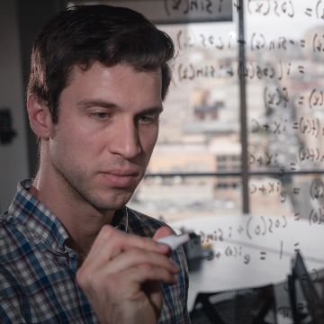

Lessons from My Math Degree That Have Nothing to Do with Math

Lessons from My Math Degree That Have Nothing to Do with Math

https://medium.com/s/story/6-life-lessons-from-my-math-degree-that-have-nothing-to-do-with-math-d38aba90edfe

I’ll conjure up a popular image. It’s late at night. A figure is hunched over a desk scribbling into a notebook. The room smells like graphite dust, eraser shavings and body odor. Numbers and symbols…