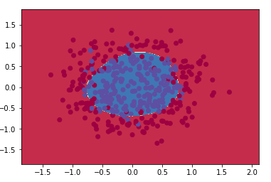
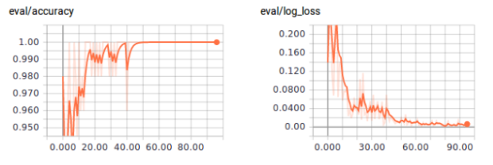

Lessons learned from building a Hello World Neural Network - Blendo

 

# Lessons learned from building a Hello World Neural Network

By[Eleni Markou](https://www.blendo.co/blog/author/elenimarkou/)
*[July 6, 2017](https://www.blendo.co/blog/2017/07/)*

My personal experience with Neural Networks began some time ago. Reading about the amazing things a neural network could do made me eager to explore this problem-solving approach that has attracted so much attention during the past few years.

I remember myself impressed by a [model](http://cs.stanford.edu/people/karpathy/deepimagesent/rankingdemo/) that generates natural language descriptions of images and their regions, developed at the Stanford University in 2015, thinking that I would like to be able to do similar things at some point. So I started searching.

From my experience in other machine learning related topics, very detailed mathematical explanations, full of derivatives and equations make understanding difficult. At least for the beginning. So, I decided to ignore them for the time being.

Of course, this didn’t mean that I could start coding right away. I had to learn about some basic concepts related to neural networks to be able to understand the basics at a conceptual level at first.

Searching Google, I found many online courses, blogs, and tutorials explaining the basic concepts. These included gradient descent, forward & back propagation and how I had to apply them in the construction of a neural network. Very minimalistically, I would summarize these methods as follows:

- Forward propagation is about propagating the output of each layer through all the following layers until we reach the output layer. It refers to the actual computation of the prediction a neural network makes.
- [Backpropagation](https://en.wikipedia.org/wiki/Backpropagation), on the other hand, is used so that every time the network outputs a prediction that yields a large error, the input weights that contribute to its minimization are reinforced.
- The minimum values the error would take can be computed using[gradient descent](https://en.wikipedia.org/wiki/Gradient_descent), an optimization algorithm that is capable of finding local minima of a given function.

Of course, there are much more than just these. Every type of neural network out there, from a simple multilayer perceptron to a recurrent neural network, has each own technical details and mechanisms that one has to learn before deploying it.

Not actually having a particular problem in my mind to solve, I decided to start the exploration from the simplest type of neural networks. With the multilayer perceptrons (MLP), one can easily implement useful regression and classification tasks. With python being the language of my choice, I investigated the available libraries for building neural networks and, from[scikit-learn](http://scikit-learn.org/) to Google’s[TensorFlow](https://www.tensorflow.org/) and[Keras](https://keras.io/), the options were many.

## **A toy dataset**

I knew that at the end I was going to use one of these libraries as everyone else does. Nevertheless, I chose to implement my first baby perceptron classifier from scratch.

Although the resulting network was very very simple and not at all fancy, I stopped thinking about it as a black box.

And that was a critical step towards understanding. I chose every detail of the architecture, saw the computations performed during training and at last, I evaluated the results.

The input I used for this task was the[make_circle](http://scikit-learn.org/stable/modules/generated/sklearn.datasets.make_circles.html) toy dataset of 400 points provided by scikit-learn . Although, the results seemed satisfactory, it was clear that for a more complex dataset, my perceptron would be inadequate.

## **The MNIST dataset**

Constructing from scratch is quite painful especially as the network’s complexity increases.

So, TensorFlow seemed a good way to go.

Personally, I chose it over Keras as for someone like me, who is in the learning process, Keras seemed to be less customizable and more like a black-box.

For my new attempt, I wanted a dataset closer to a real world application than the previous one. The well-known[MNIST](http://yann.lecun.com/exdb/mnist/) dataset that contains images of handwritten digits that need to be classified, seemed a good choice. After experimenting with different tuning parameters, high accuracy was achieved with a perceptron with more hidden layers and much more computational nodes than the first baby net.

If you are going to ask me how I knew the right value of each of the tuning parameters, I’m going to tell you that I didn’t. From my short experience in the field and the research I’ve done, I would say that tuning your neural network is more of an art and less of a deterministic process as generally there is no rule to guide you through every situation. Despite this, as your experience grows you will develop some intuition around the tuning. My personal bag of tips, gathered mostly by searching and asking others, more expert in the field, include the following:

- Number of inputs & outputs: This decision is truly very easy. The number of inputs is always set equal to the number of features of the input data while the number of outputs, in the case of a classification task, is determined by the number of classes we want to classify in.
- Number of hidden layers: The method of choosing is a bit vague. Generally, for the majority of the tasks,you would like to accomplish you can start with one or two layers, evaluate the results and revise your choices. Keep in mind that even complex functions can be modeled with one layer if the number of neurons is high enough. On the other hand, the increase of the hidden layers results in an exponential decrease of the neurons required per layer.
- Number of nodes per layer: For the number of neurons per hidden layer, again you have to experiment. It is quite common to keep their number per layer constant or create a tunnel-ish architecture where each layer has fewer neurons than the previous one.

Following the above tips, I ended up with a perceptron with two hidden layers each one of them having 40 and 30 nodes accordingly. As for the activation and loss functions, my choices were ReLu and softmax activation for the output layer along with cross-entropy loss.

The reason for this decision is that ReLu is a bit faster than others and most importantly doesn’t get trapped easily into local minima as it doesn’t saturate for large inputs. Softmax is suitable for the output layer on classification tasks where the output classes are exclusive.

The results of this tuning were also satisfactory with achieved accuracy over 95% after 50 iterations over the perceptron.

## **A real world example**

Having already built a simple neural network that seemed to work I decided to use the implementation in a real problem I would like to be able to solve. For this, a mailing list classification task with data collected from[Mailchimp](https://mailchimp.com/). The data consist of location information, mail client and type and of course the mailing list segment the recipient belongs.

At first, I experimented with exactly the same architecture I had built for the MNIST, with disappointing results.

My first observation was that as the iterations were going by, although initially the accuracy was increasing, at some point it started to decrease. This failure of my perceptron to converge to the right prediction was due to the learning rate’s large value I had set for the gradient descent. With this step, the algorithm, in fact, bypassed the minimum precisely the moment the accuracy started to fall continuously. o fix this problem, I chose to just lower the learning rate up to the point the gradient descent finally converged.

After resolving this, I retrained the perceptron,and again the results seemed to be poor as the accuracy didn’t manage to exceed the 25%. After experimenting with the tuning parameters of the network, I managed to achieve at most 50% accuracy.

To my surprise, this accuracy was achieved for a relatively small number of hidden layers and computational nodes.

That was a result I wasn’t expecting. I had the impression that the data weren’t much informative about the output variable and so a more complex function needed to be fit.

What troubles me the most is the fact that after only eight iterations the accuracy starts to fall drastically on the test dataset while it keeps increasing on the train.

According to my experience, this is an obvious example of overfitting,but it seems weird to me that this effect appeared after only eight iterations.

## **Outro**

To me, what became evident through the whole process is that different data may require completely different tuning. There is nothing like an average case, a common tuning or anything like this. Furthermore, finding an efficient combination of parameters is mainly a result of experimenting.

As the code developed is not optimized either for results’ accuracy or on execution efficiency there are many ideas for further improvement, including:

- Further experimentation with tuning parameters, activation functions and loss function.
- Implementation of non-constant learning rate. At first, we need quite high learning rate for gradient descent to move quickly towards the minimum value. As we get closer to the minimum, we lower the step so that the algorithm does not bypass it.
- Implementation of[early stopping](https://en.wikipedia.org/wiki/Early_stopping) so that the algorithm won’t continue training at the expense of generalization error, in cases where the accuracy of data outside the train set has reached an upper bound.

[data science](https://www.blendo.co/blog/tag/data-science/)  [machine learning](https://www.blendo.co/blog/tag/machine-learning/)  [neural networks](https://www.blendo.co/blog/tag/neural-networks/)

###

Leave a Comment

Subscribe to our blog
Get our latest posts in your email and become a data analytics superhero.

POPULAR POSTS

- [Access your data in Amazon Redshift and PostgreSQL with…](https://www.blendo.co/blog/access-your-data-in-amazon-redshift-and-postgresql-with-python-and-r/) May 27, 2016
- [![The ultimate list of Custom Dashboards and BI tools to Track your Metrics and Gather Insights [Updated\]](../_resources/e5cc5a8ea3112b05e330e8e9537438a5.png)](https://www.blendo.co/blog/the-ultimate-list-of-custom-dashboards-and-bi-tools-to-track-your-metrics-and-gather-insights/)[The ultimate list of Custom Dashboards and BI tools to Track](https://www.blendo.co/blog/the-ultimate-list-of-custom-dashboards-and-bi-tools-to-track-your-metrics-and-gather-insights/) June 14, 2016
- [The Best Blogs Every Data Analyst Should Follow](https://www.blendo.co/blog/the-best-blogs-every-data-analyst-should-follow/) August 15, 2016
- [Lessons learned from building a Hello World Neural Network](https://www.blendo.co/blog/lessons-learned-building-a-hello-world-neural-network/) July 6, 2017
- [How to Predict Churn: A model can get you as far as your…](https://www.blendo.co/blog/how-to-predict-churn-model-data/) April 15, 2017
- [Clickstream Analysis and Data Mining Techniques 101: An…](https://www.blendo.co/blog/clickstream-data-mining-techniques-introduction/) May 26, 2017
- [Working with Time-Series Data on Redshift](https://www.blendo.co/blog/time-series-data-redshift-mixpanel/) November 19, 2016
- [How to load Data from Salesforce to SQL Data Warehouse](https://www.blendo.co/blog/load-data-from-salesforce-to-sql-data-warehouse/) June 12, 2015
- [Predicting Email Churn with NBD/Pareto](https://www.blendo.co/blog/predicting-email-churn-nbd-pareto/) May 8, 2017
- [How to load data from Facebook Ads to Google BigQuery](https://www.blendo.co/blog/load-data-from-facebook-ads-to-google-bigquery/) November 14, 2015

Blog Categories

- [Amazon Redshift](https://www.blendo.co/blog/category/amazon-redshift-datawarehouse%ef%bb%bf/)
- [Announcements](https://www.blendo.co/blog/category/announcements/)
- [APIs](https://www.blendo.co/blog/category/apis/)
- [Business Intelligence](https://www.blendo.co/blog/category/business-intelligence/)
- [Data Integration](https://www.blendo.co/blog/category/data-integration/)
- [Data Science](https://www.blendo.co/blog/category/data-science/)
- [Data Weekly](https://www.blendo.co/blog/category/data-weekly/)
- [Google BigQuery](https://www.blendo.co/blog/category/google-bigquery-2/)
- [Microsoft SQL Server](https://www.blendo.co/blog/category/microsoft-sql-server/)
- [Product Updates](https://www.blendo.co/blog/category/product-updates/)
- [SQL Data Warehouse](https://www.blendo.co/blog/category/sql-data-warehouse/)
- [Stories](https://www.blendo.co/blog/category/stories/)

Search Blog
**

FOLLOW US

- 
- 
- 

PRODUCT

- [Features](https://www.blendo.co/features/)
- [Integrations](https://www.blendo.co/integrations/)
- [Pricing](https://www.blendo.co/pricing/)
- [Changelog](https://www.blendo.co/changelog/)

RESOURCES

- [Knowledge Base](https://www.blendo.co/knowledge-base/)
- [Amazon Redshift Guide for Data Analysts](https://www.blendo.co/amazon-redshift-guide-data-analyst/)
- [Blendo Blog](https://www.blendo.co/blog/)
- [Integrations’ Schema](https://www.blendo.co/knowledge-category/expected-and-available-data/)
- [Data Questions](https://www.blendo.co/knowledge-category/data-questions/)

COMPANY

- [About](https://www.blendo.co/about/)
- [Partners](https://www.blendo.co/partners/)
- [Contact](https://www.blendo.co/contact-us/)
- [Careers](https://www.blendo.co/careers/)
- [Terms of Service](https://www.blendo.co/terms-of-service/)
- [Privacy Policy](https://www.blendo.co/privacy-policy/)

[(L)](https://www.facebook.com/blendo.co/)[(L)](https://www.linkedin.com/company-beta/10646842/?pathWildcard=10646842)[(L)](https://twitter.com/blendoapp)

Copyright © 2009 - 2017 Blendo. All Rights Reserved.