Letter – Thinking With Type

#### [Thinking with Type](http://thinkingwithtype.com/)

- [Letter](http://thinkingwithtype.com/letter/) |

- [Text](http://thinkingwithtype.com/text/) |

- [Grid](http://thinkingwithtype.com/grid/) |

- [Extras](http://thinkingwithtype.com/extras/) |

- [*elupton.com*](http://elupton.com/) |

- [*papress.com*](http://www.papress.com/) |

-

#   [Letter](http://thinkingwithtype.com/letter/)

## Anatomy

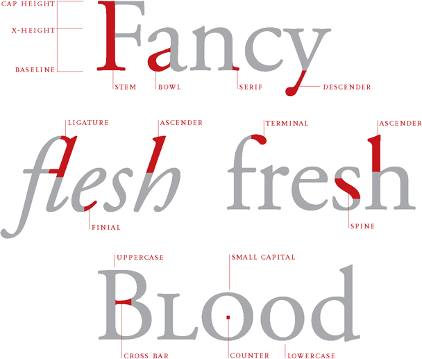

### Anatomy: How Letters Sit on a Line

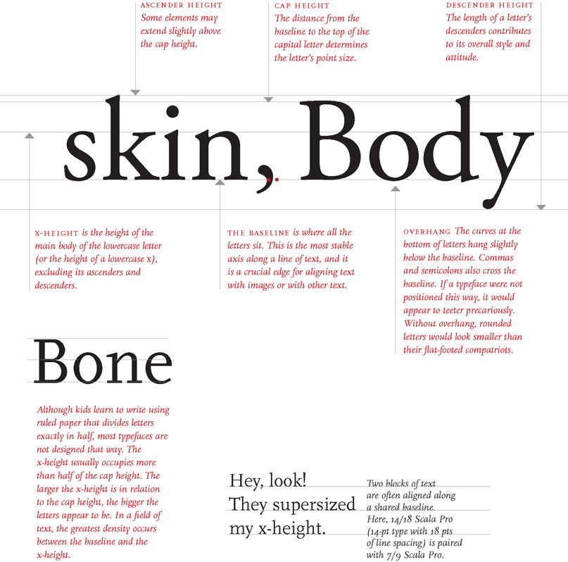

## Size

height
Attempts to standardize the measurement of

type began in the eighteenth century. The *point system* is the standard used today. One *point* equals 1/72 inch

or .35 millimeters. Twelve points equal one *pica,* the
unit commonly used to measure column widths. Typography
can also be measured in inches, millimeters, or pixels.
Most software applications let the designer choose a
preferred unit of measure; picas and points are standard
defaults.
 Nerd Alert: Abbreviating Picas and Points
 *8 picas = 8p
8 points = *p8, 8 pts
8 picas, 4 points = 8p4
8-point Helvetica with 9 points of line spacing = 8/9 Helvetica**
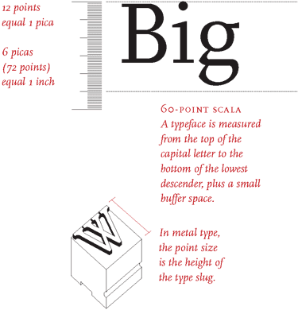
width
A letter also has a horizontal measure, called its *set width*.
The set width is the body of the letter plus a sliver of space that
protects it from other letters. The width of a letter is intrinsic to
the proportions and visual impression of the typeface. Some typefaces
have a narrow set width, and some have a wide one.
You can change the set width of a typeface by fiddling with
its horizontal or vertical scale.This distorts the line weight of the
letters,however, forcing heavy elements to become thin, and thin elements
to become thick. Instead of torturing a letterform, choose a typeface
that has the proportions you are looking for, such as condensed, compressed,
wide, or extended.

### Size Crime: Vertical or Horizontal Scaling

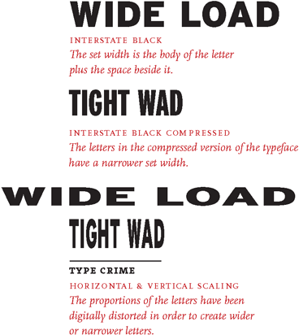

### Size: The Power of X-Heights

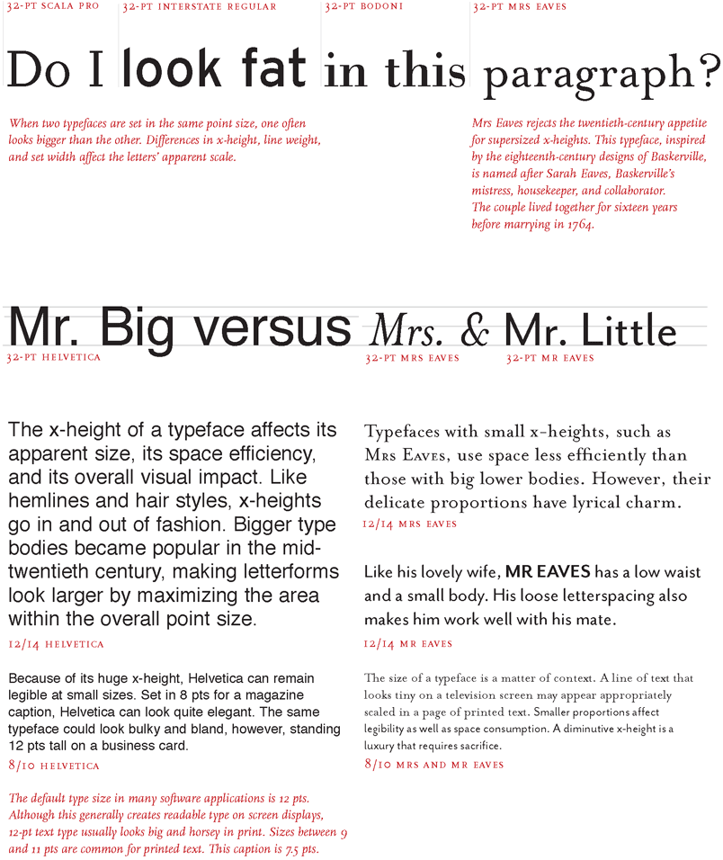

### Size: Variations on a Typeface

All the typefaces shown below were inspired by the sixteenth-century
printing types of Claude Garamond, yet each one reflects its own era.
The lean forms of Garamond 3 appeared during the Great Depression, while
the inflated x-height of ITC Garamond became an icon of the flamboyant 1970s.

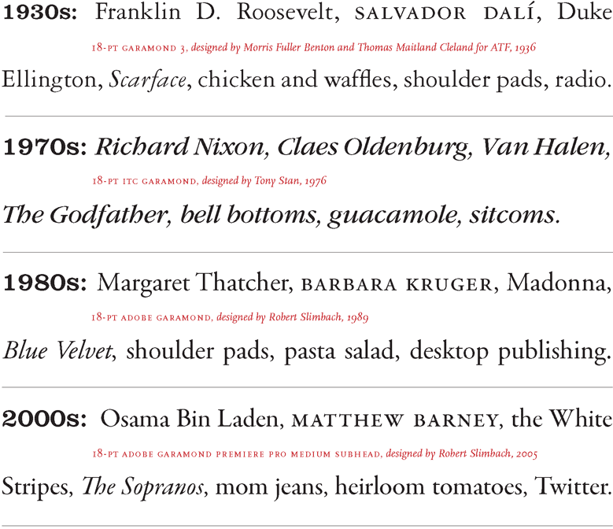

download hi-res pdf:  [Portrait of Four Garamonds](http://thinkingwithtype.com/misc/Garamond_Showing.pdf)

### Optical Sizes

A type family with *optical sizes* has different styles for different sizes

of output.The graphic designer selects a style based on context. Optical sizes designed for headlines or display tend to have delicate, lyrical forms, while styles created for text and captions are built with heavier strokes.

**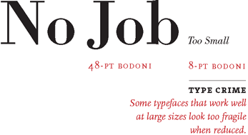**

### Optical Sizes: Adobe Garamond Premiere Pro

**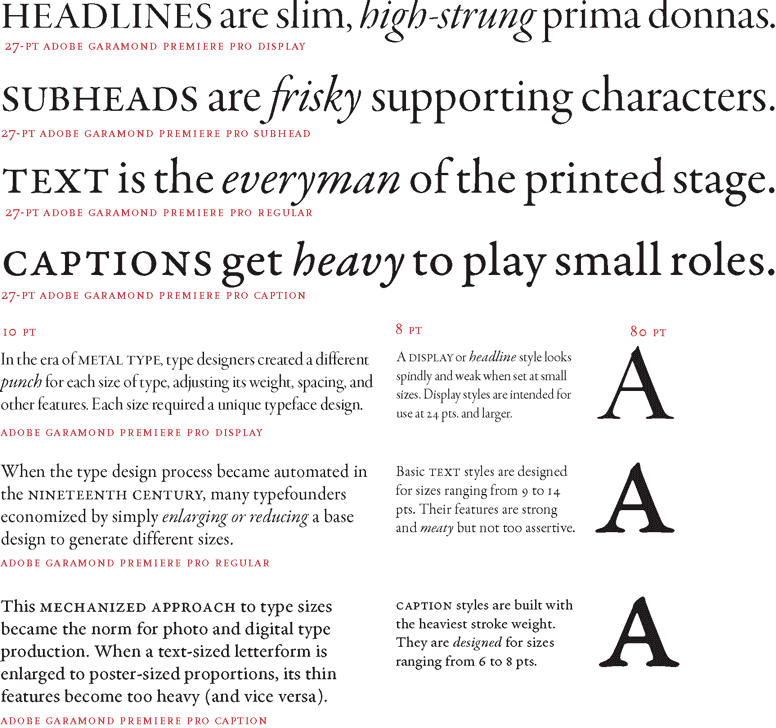**

download hi-res pdf:  [Optical Sizes](http://thinkingwithtype.com/misc/Optical_Sizes.pdf)

## Scale

*Scale *is the size of design elements in comparison to other elements in a layout as well as to the physical context of the work. Scale is relative. 12-pt type displayed on a 32-inch monitor can look very small, while 12-pt type printed on a book page can look flabby and overweight. Designers create hierarchy and contrast by playing with the scale of letterforms. Changes in scale help create visual contrast, movement, and depth as well as express hierarchies of importance. Scale is physical. People intuitively judge the size of objects in relation to their own bodies and environments.

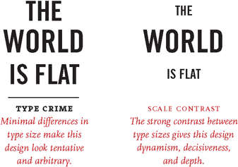
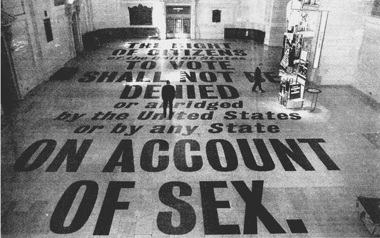

**the xix amendment** Typographic installation at Grand Central Station, New York City, 1995. Designer: Stephen Doyle. Sponsors: The New York State Division of Women, the Metropolitan Transportation Authority, Revlon, and Merrill Lynch. Large-scale text creates impact in this public installation.

## Type Classification

A basic system for classifying typefaces was devised in the nineteenth century, when printers sought to identify a heritage for their own craft analogous to that of art history. *Humanist* letterforms are closely connected to calligraphy and the movement of the hand. *Transitional* and *modern* typefaces are more abstract and less organic. These three main groups correspond roughly to the Renaissance, Baroque, and Enlightenment periods in art and literature. Historians and critics of typography have since proposed more finely grained schemes that attempt to better capture the diversity of letterforms. Designers in the twentieth and twenty-first centuries have continued to create new typefaces based on historic characteristics.

download hi-res pdf:  [Type History Lecture](http://thinkingwithtype.com/misc/type_lecture/Type_Lecture.pdf)

 download hi-res pdf:  [Type History Lecture in Spanish](http://thinkingwithtype.com/misc/type_lecture/Type_LectureSpanish.pdf), contributed by [Laura Meseguer](http://www.laurameseguer.com/)

## Type Families

In the sixteeenth century, printers began organizing roman and italic typefaces into matched families. The concept was formalized in the early twentieth century to include styles such as bold, semibold, and small caps.

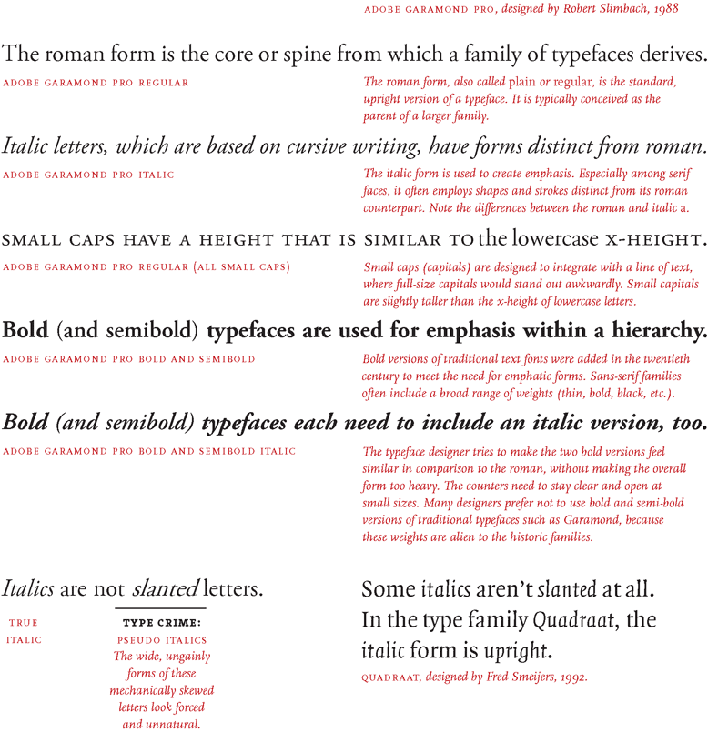

download hi-res pdf:  [Type Families](http://thinkingwithtype.com/misc/Type_Family_Demo.pdf)

### Type Family in Use: Garamond 3

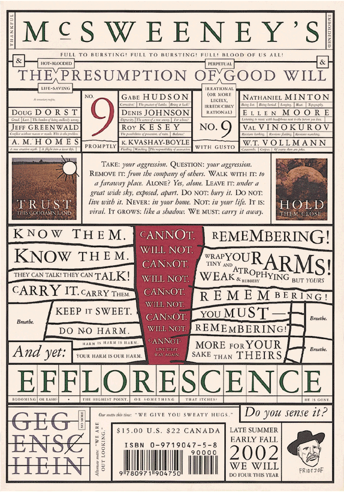

**mcsweeney’s **Magazine cover, 2002. Design: Dave Eggers. This magazine cover uses the Garamond 3 typeface family in various sizes. Although the typeface is classical and conservative, the obsessive, slightly deranged layout is distinctly contemporary.

[(L)](http://thinkingwithtype.com/misc/Type_Family_Demo.pdf)

## Superfamilies

A traditional roman book face typically has a small family–an intimate group consisting of roman, italic, small caps, and possibly bold and semibold (each with an italic variant) styles. Sans-serif families often come in many more weights and sizes, such as thin, light, black, compressed, and condensed. A *superfamily* consists of dozens of related fonts in multiple weights and/or widths, often with both sans-serif and serif versions. Small capitals and non-lining numerals (once found only in serif fonts) are included in the sans-serif versions of Thesis, Scala Pro, and many other contemporary superfamilies.

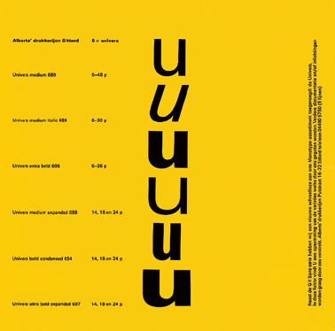

**univers **was designed by the Swiss typographer Adrian Frutiger in 1957. He designed twenty-one versions of Univers, in five weights and five widths. Whereas some type families grow over time, Univers was conceived as a total system from its inception.

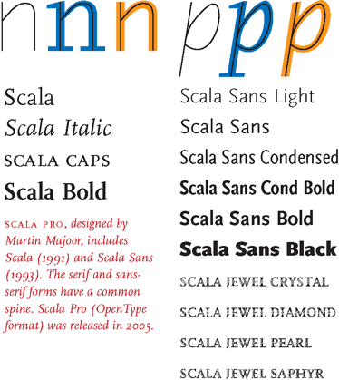
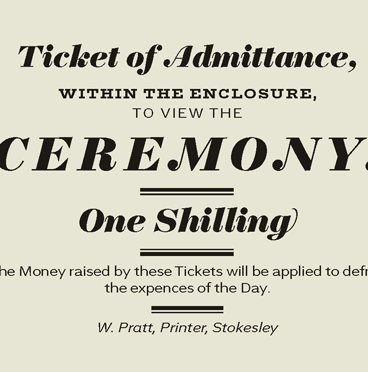

**TRILOGY,** a superfamily designed by Jeremy Tankard in 2009, is inspired by three nineteenth-century type styles: sans serif, Egyptian, and fat face. The inclusion of the fat face style, with its wafer-thin serifs and ultrawide verticals, gives this family an unusual twist.

### Portrait of a Superfamily: Thesis

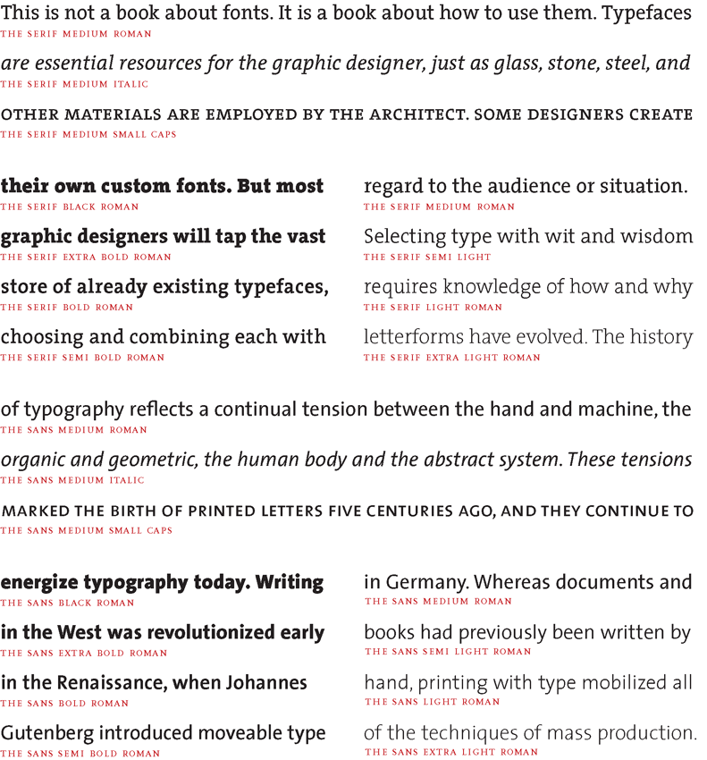

## Caps and Small Caps

A word set in ALL CAPS within running text can look big and bulky, and A LONG PASSAGE SET ENTIRELY IN CAPITALS CAN LOOK UTTERLY INSANE. Small capitals are designed to match the x-height of lowercase letters. Designers, enamored with the squarish proportions of true small caps, employ them not only within bodies of text but for subheads, bylines, invitations, and more. Rather than Mixing Small Caps with Capitals, many designers prefer to use all small caps, creating a clean line with no ascending elements. InDesign and other programs allow users to create FALSE SMALL CAPS at the press of a button; these SCRAWNY LETTERS look out of place.

download hi-res pdf:  [Caps and Small Caps in Context](http://thinkingwithtype.com/misc/Small_Caps_Demo.pdf)

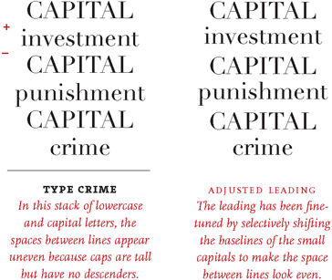
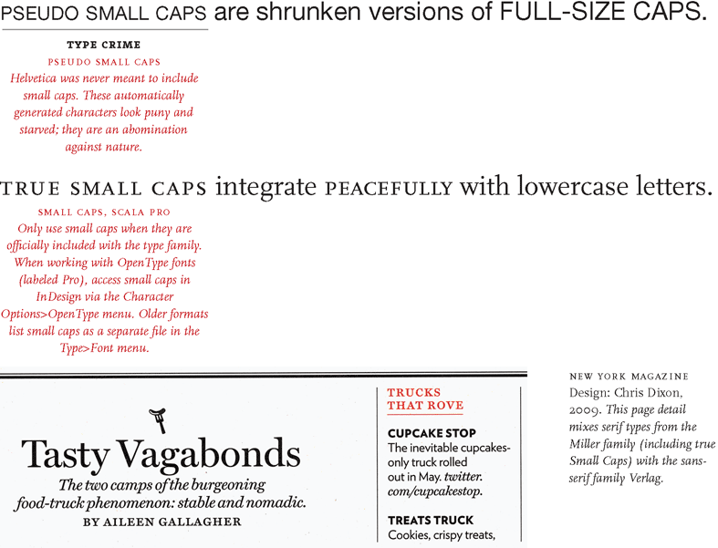

### Capitals in Use

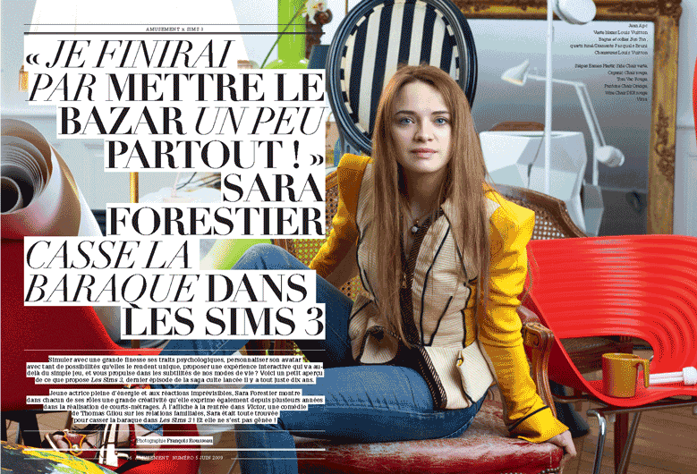

**amusement magazine** Design: Alice Litscher, 2009. This French culture magazine employs a startling mix of tightly leaded Didot capitals in roman and italic. Running text is set in Glypha.

## Mixing Typefaces

Combining typefaces is like making a salad. Start with a small number of elements representing different colors, tastes, and textures. Strive for contrast rather than harmony, looking for emphatic differences rather than mushy transitions. Give each ingredient a role to play: sweet tomatoes, crunchy cucumbers, and the pungent shock of an occasional anchovy. When mixing typefaces on the same line, designers usually adjust the point size so that the x-heights align. When placing typefaces on separate lines, it often makes sense to create contrast in scale as well as style or weight. Try mixing big, light type with small, dark type for a criss-cross of contrasting flavors and textures.

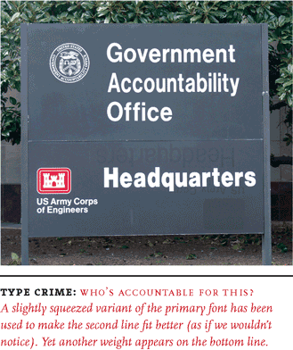

### Mixing Typefaces: Single-Family and Multi-Family

### Mixing Typefaces: The Small Print

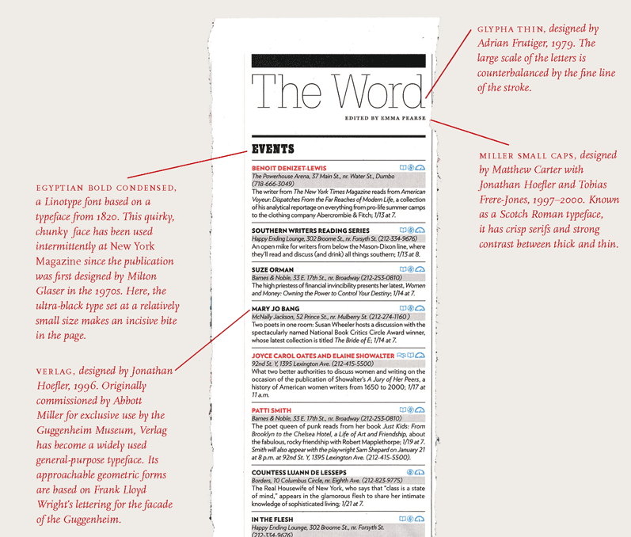

**the word: new york magazine** Design: Chris Dixon, 2010. This content-intensive page detail mixes four different type families from various points in history, ranging from the early advertising face Egyptian Bold Condensed to the functional contemporary sans Verlag. These diverse ingredients are mixed here at different scales to create typographic tension and contrast.

## Punctuation

*Lining numerals* take up uniform widths of space, enabling the numbers to line up when tabulated in columns. They were introduced around the turn of the twentieth century to meet the needs of modern business. Lining numerals are the same height as capital letters, so they sometimes look big and bulky when appearing in running text.

*Non-lining numerals,* also called *text* or *old style* numerals, have ascenders and descenders, like lowercase letters. Non-lining numerals returned to favor in the 1990s, valued for their idiosyncratic appearance and their traditional typographic attitude. Like letterforms, old style numerals are proportional; each one has its own set width.

download hi-res pdf:  [Lining and Non-Lining Numerals in Context](http://thinkingwithtype.com/misc/Numerals_Demo.pdf)

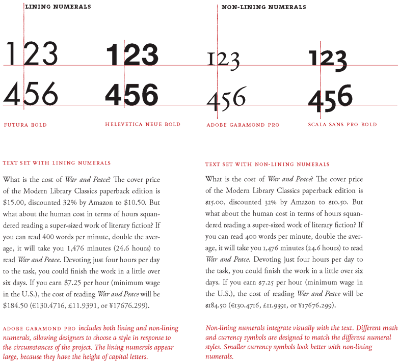

### Numerals: Examples

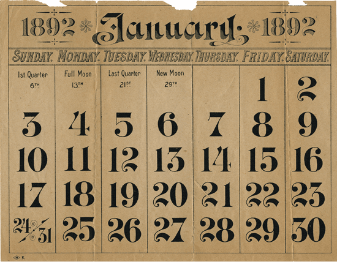

**monthly calendar, 1892** The charming numerals in this calendar don’t line up into neat columns, because they have varied set widths. They would not be suitable for setting modern financial data.

## Typeface Design

Fontlab and other applications allow designers to create functional fonts that work seamlessly with standard software programs such as InDesign and Photoshop. The first step in designing a typeface is to define a basic concept. Will the letters be serif or sans serif? Will they be modular or organic? Will you construct them geometrically or base them on handwriting? Will you use them for display or for text? Will you work with historic source material or invent the characters more or less from scratch? The next step is to create drawings. Some designers start with pencil before working digitally, while others build their letterforms directly with fontdesign software.

Begin by drawing a few core letters, such as *o, u, h*, and *n,* building curves, lines, and shapes that will reappear throughout the font. All the letters in a typeface are distinct from each other, yet they share many attributes, such as x-height, line weight, stress, and a common vocabulary of forms and proportions. You can control the spacing of the typeface by adding blank areas next to each character as well as creating kerning pairs that determine the distance between particular characters. Producing a complete typeface is an enormous task. However, for people with a knack for drawing letterforms, the process is hugely rewarding.

### Typeface Drawing: Castaways

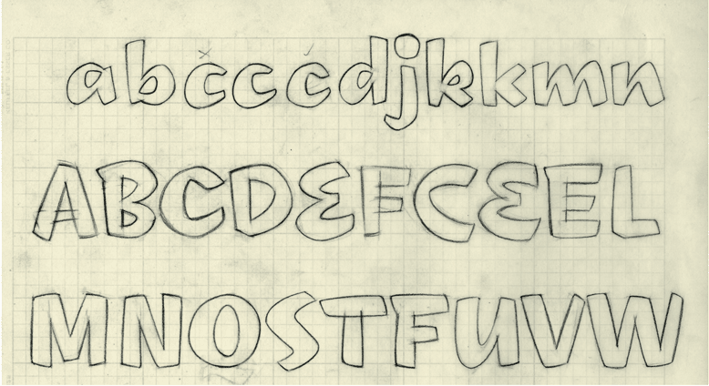
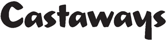

**castaways **Drawing and finished type, 2001. Art and type direction: Andy Cruz. Typeface design: Ken Barber/House Industries. Font engineering: Rich Roat. House Industries is a digital type foundry that creates original typefaces inspired by popular culture and design history. Designer Ken Barber makes pencil drawings by hand and then digitizes the outlines. Castaways is from a series of typefaces based on commercial signs from Las Vegas. The shapes of the letters recall the handpainted strokes made by traditional sign painters and lettering artists.

### Typeface Proof: Mercury

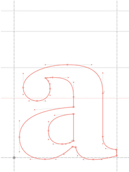

**mercury bold **Page proof and screen shot, 2003. Design: Jonathan Hoefler/Hoefler & Frere-Jones. Mercury is a typeface designed for modern newspapers, whose production demands fast, high-volume printing on cheap paper. The typeface’s bullet-proof letterforms feature chunky serifs and sturdy upright strokes. The notes marked on the proof below comment on everything from the width or weight of a letter to the size and shape of a serif. Many such proofs are made during the design process. In a digital typeface, each letterform consists of a series of curves and lines controlled by points. In a large type family, different weights and widths can be made automatically by interpolating between extremes such as light and heavy or narrow and wide. The designer then adjusts each variant to ensure legibility and visual consistency.

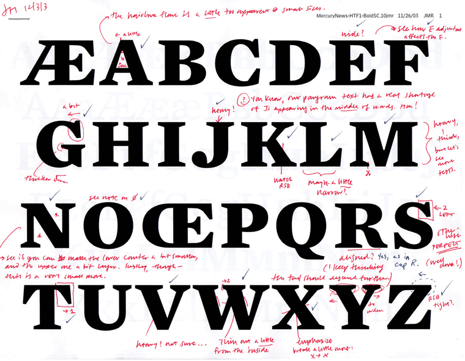

## Project: Letterforms

Create a prototype for a bitmap typeface by designing letters on a grid of squares or a grid of dots. Substitute the curves and diagonals of traditional letterforms with gridded and rectilinear elements. Avoid making detailed “staircases,” which are just curves and diagonals in disguise. This exercise looks back to the 1910s and 1920s, when avant-garde designers made experimental typefaces out of simple geometric parts. The project also speaks to the structure of digital technologies, from cash register receipts and LED signs to on-screen font display, showing that a typeface is a system of elements.

Examples of student work from Maryland Institute College of Art
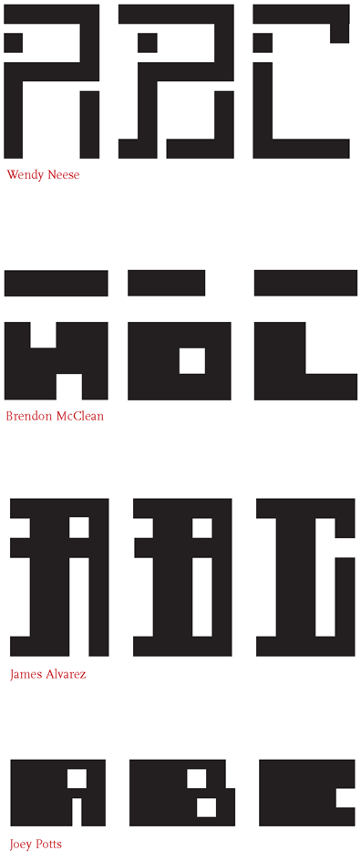
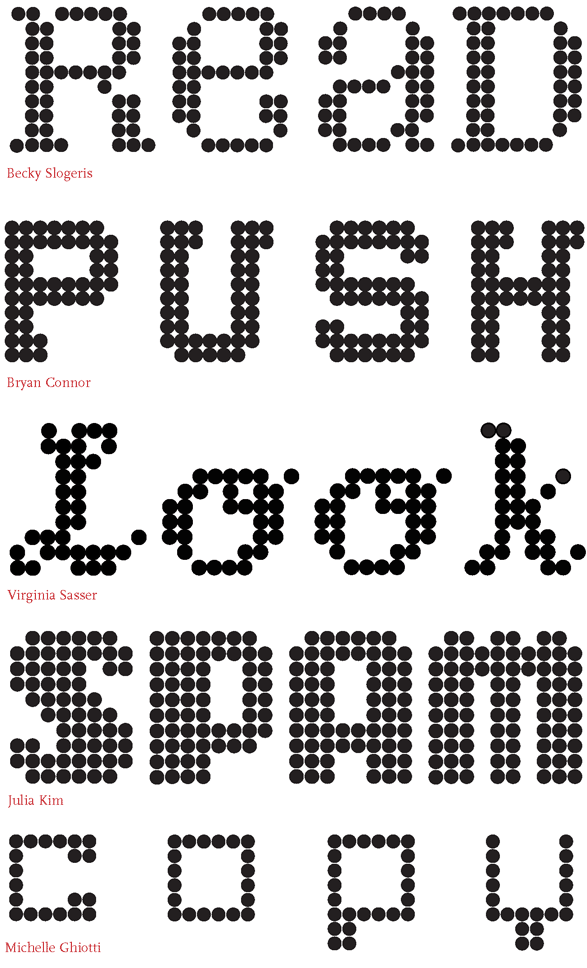

## Font Formats

Where do fonts come from, and why are there so many different formats? Some come loaded with your computer’s operating system, while others are bundled with software packages. A few of these widely distributed typefaces are of the highest quality, such as Adobe Garamond Pro and Hoefler Text, while others (including Comic Sans, Apple Chancery, and Papyrus) are reviled by design snobs everywhere. If you want to expand your vocabulary beyond this familiar fare, you will need to purchase fonts from digital type foundries. These range from large establishments like Adobe and FontShop, which license thousands of different typefaces, to independent producers that distribute just a few, such as Underware in the Netherlands or Jeremy Tankard Typography in the U.K. You can also learn to make your own fonts as well as find fonts that are distributed for free online. The different font formats reflect technical innovations and business arrangements developed over time. Older font formats are still generally usable on modern operating systems.

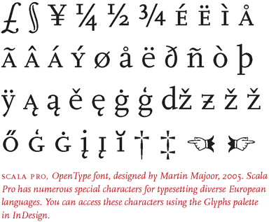
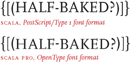

PostScript/Type 1 was developed for desktop computer systems in the 1980s by Adobe. Type I fonts are output using the PostScript programming language, created for generating high-resolution images on paper or film. A Type 1 font consists of two files: a screen font and a printer font. You must install both files in order to fully use these fonts.

TrueType is a later font format, created by Apple and Microsoft for use with their operating systems. TrueType fonts are easier to install than Type 1 fonts because they consist of a single font file rather than two.

Opentype, a format developed by Adobe, works on multiple platforms. Each file supports up to 65,000 characters, allowing multiple styles and character variations to be contained in a single font file. In a TrueType or Type 1 font, small capitals, alternate ligatures, and other special characters must be contained in separate font files (sometimes labelled “Expert”); in an OpenType font they are part of the main font. These expanded character sets can also include accented letters and other special glyphs needed for typesetting a variety of languages. OpenType fonts with expanded character sets are commonly labeled “Pro.” OpenType fonts also automatically adjust the position of hyphens, brackets, and parentheses for letters set in all-capitals.

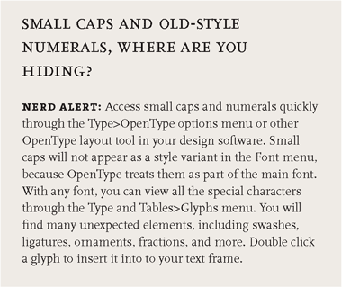

### Some Commonly Abused Terms

typeface or font?

A typeface is the design of the letterforms; a font is the delivery mechanism. In metal type, the design is embodied in the punches from which molds are made. A font consists of the cast metal printing types. In digital systems, the typeface is the visual design, while the font is the software that allows you to install, access, and output the design. A single typeface might be available in several font formats. In part because the design of digital typefaces and the production of fonts are so fluidly linked today, most people use the terms interchangeably. Type nerds insist, however, on using them precisely.

character or glyph?

Type designers distinguish characters from glyphs in order to comply with Unicode, an international system for identifying all of the world’s recognized writing systems. Only a symbol with a unique function is considered a character and is thus assigned a code point in Unicode. A single character, such as a lowercase a, can be embodied by several different glyphs (a, a, a). Each glyph is a specific expression of a given character.

**Roman or roman?**

The Roman Empire is a proper noun and thus is capitalized, but we identify roman letterforms, like italic ones, in lowercase. The name of the Latin alphabet is capitalized.

## Site Map

- [**Letter**](http://thinkingwithtype.com/letter/)

- [Anatomy](http://thinkingwithtype.com/letter/#anatomy)

- [Size](http://thinkingwithtype.com/letter/#size)

- [Scale](http://thinkingwithtype.com/letter/#scale)

- [*Type Classification*](http://thinkingwithtype.com/letter/#type-classification)

- [Type Families](http://thinkingwithtype.com/letter/#type-families)

- [Superfamilies](http://thinkingwithtype.com/letter/#superfamilies)

- [Caps and Small Caps](http://thinkingwithtype.com/letter/#caps-and-small-caps)

- [Mixing Typefaces](http://thinkingwithtype.com/letter/#mixing-typefaces)

- [Punctuation](http://thinkingwithtype.com/letter/#punctuation)

- [Typeface Design](http://thinkingwithtype.com/letter/#typeface-design)

- [*Project: Letterforms*](http://thinkingwithtype.com/letter/#project-letterforms)

- [Font Formats](http://thinkingwithtype.com/letter/#font-formats)

- [**Text**](http://thinkingwithtype.com/text/)

- [Kerning](http://thinkingwithtype.com/text/#kerning)

- [Tracking](http://thinkingwithtype.com/text/#tracking)

- [*Project: Space and Meaning*](http://thinkingwithtype.com/text/#project-space-and-meaning)

- [Line Spacing](http://thinkingwithtype.com/text/#line-spacing)

- [Alignment](http://thinkingwithtype.com/text/#alignment)

- [*Project: Alignment*](http://thinkingwithtype.com/text/#project-alignment)

- [Vertical Text](http://thinkingwithtype.com/text/#vertical-text)

- [Making Paragraphs](http://thinkingwithtype.com/text/#making-paragraphs)

- [Enlarged Capitals](http://thinkingwithtype.com/text/#enlarged-capitals)

- [Heirarchy](http://thinkingwithtype.com/text/#heirarchy)

- [*Project: Heirarchy*](http://thinkingwithtype.com/text/#project-heirarchy)

- [*Project: Long Lists*](http://thinkingwithtype.com/text/#project-long-lists)

- [**Grid**](http://thinkingwithtype.com/grid/)

- [Golden Section](http://thinkingwithtype.com/grid/#golden-section)

- [Multicolumn Grid](http://thinkingwithtype.com/grid/#multicolumn-grid)

- [Modular Grid](http://thinkingwithtype.com/grid/#modular-grid)

- [*Project: Modular Grid*](http://thinkingwithtype.com/grid/#project-modular-grid)

- [**Extras**](http://thinkingwithtype.com/extras/)

- [Type Crimes](http://thinkingwithtype.com/extras/#type-crimes)

- [Tools for Teachers](http://thinkingwithtype.com/extras/#tools-for-teachers)

- [Editing](http://thinkingwithtype.com/extras/#editing)

- [Editing Hard Copy](http://thinkingwithtype.com/extras/#editing-hard-copy)

- [Editing Soft Copy](http://thinkingwithtype.com/extras/#editing-soft-copy)

- [Proofreading](http://thinkingwithtype.com/extras/#proofreading)

- [Bibliography](http://thinkingwithtype.com/extras/#bibliography)

- [About the Author](http://thinkingwithtype.com/extras/#about-the-author)

- [About the Website](http://thinkingwithtype.com/extras/#about-the-website)

- [Events: Ellen Lupton](http://thinkingwithtype.com/extras/#events-ellen-lupton)

Copyright 2009. All content property of Ellen Lupton unless otherwise noted. [About this website](http://thinkingwithtype.com/contents/extras/#about_the_website)

Search for: