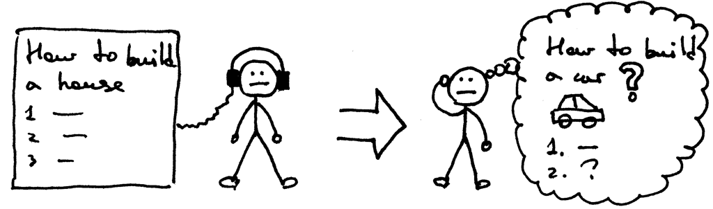
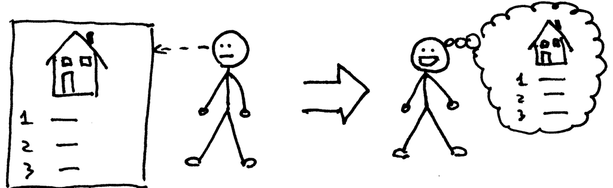
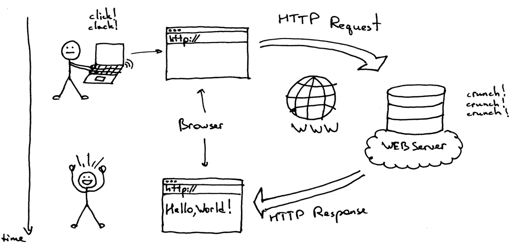
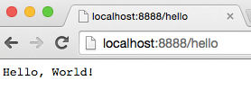
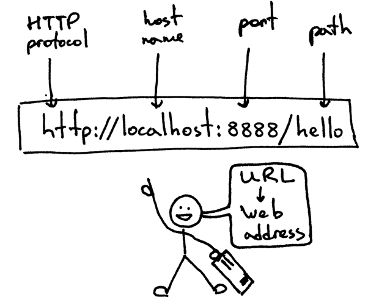
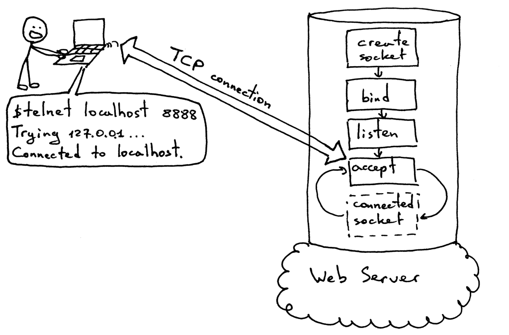
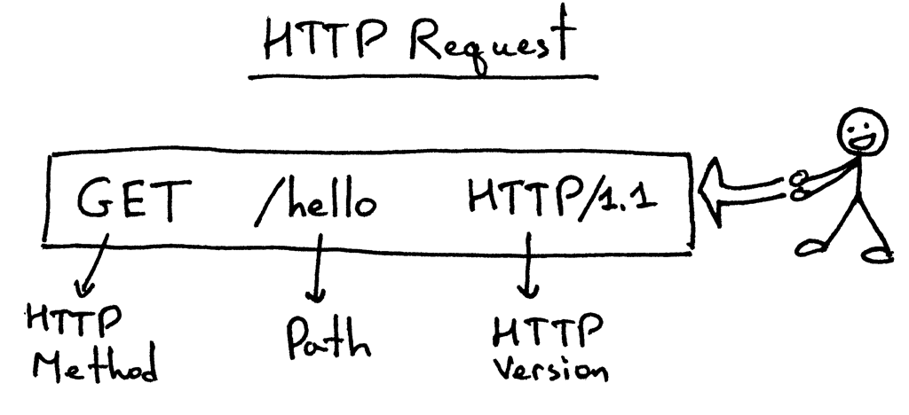
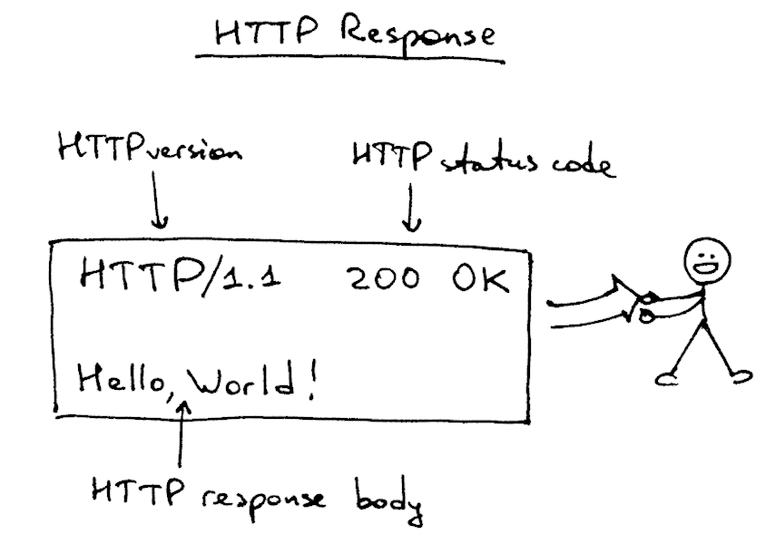

Let’s Build A Web Server. Part 1.

#   [Let’s Build A Web Server. Part 1.](https://ruslanspivak.com/lsbaws-part1/)

 Date    ** Mon, March 09, 2015

Out for a walk one day, a woman came across a construction site and saw three men working. She asked the first man, “What are you doing?” Annoyed by the question, the first man barked, “Can’t you see that I’m laying bricks?” Not satisfied with the answer, she asked the second man what he was doing. The second man answered, “I’m building a brick wall.” Then, turning his attention to the first man, he said, “Hey, you just passed the end of the wall. You need to take off that last brick.” Again not satisfied with the answer, she asked the third man what he was doing. And the man said to her while looking up in the sky, “I am building the biggest cathedral this world has ever known.” While he was standing there and looking up in the sky the other two men started arguing about the errant brick. The man turned to the first two men and said, “Hey guys, don’t worry about that brick. It’s an inside wall, it will get plastered over and no one will ever see that brick. Just move on to another layer.”[1](https://ruslanspivak.com/lsbaws-part1/#fn-1)

The moral of the story is that when you know the whole system and understand how different pieces fit together (bricks, walls, cathedral), you can identify and fix problems faster (errant brick).

What does it have to do with creating your own Web server from scratch?

**I believe to become a better developer you MUST get a better understanding of the underlying software systems you use on a daily basis and that includes programming languages, compilers and interpreters, databases and operating systems, web servers and web frameworks. And, to get a better and deeper understanding of those systems you MUST re-build them from scratch, brick by brick, wall by wall.**

Confucius put it this way:
*> “> I hear and I forget.”*

*> “> I see and I remember.”*

*> “> I do and I understand.”*

I hope at this point you’re convinced that it’s a good idea to start re-building different software systems to learn how they work.

In this three-part series I will show you how to build your own basic Web server. Let’s get started.

First things first, what is a Web server?

In a nutshell it’s a networking server that sits on a physical server (oops, a server on a server) and waits for a client to send a request. When it receives a request, it generates a response and sends it back to the client. The communication between a client and a server happens using HTTP protocol. A client can be your browser or any other software that speaks HTTP.

What would a very simple implementation of a Web server look like? Here is my take on it. The example is in Python but even if you don’t know Python (it’s a very easy language to pick up, try it!) you still should be able to understand concepts from the code and explanations below:

import  socketHOST,  PORT  =  '',  8888listen_socket  =  socket.socket(socket.AF_INET,  socket.SOCK_STREAM)listen_socket.setsockopt(socket.SOL_SOCKET,  socket.SO_REUSEADDR,  1)listen_socket.bind((HOST,  PORT))listen_socket.listen(1)print  'Serving HTTP on port %s ...'  %  PORTwhile  True:  client_connection,  client_address  =  listen_socket.accept()  request  =  client_connection.recv(1024)  print  request  http_response  =  """\HTTP/1.1 200 OKHello, World!"""  client_connection.sendall(http_response)  client_connection.close()

Save the above code as *webserver1.py* or download it directly from [GitHub](https://github.com/rspivak/lsbaws/blob/master/part1/webserver1.py) and run it on the command line like this

$ python webserver1.py
Serving HTTP on port 8888 …

Now type in the following URL in your Web browser’s address bar http://localhost:8888/hello, hit Enter, and see magic in action. You should see *“Hello, World!”* displayed in your browser like this:

Just do it, seriously. I will wait for you while you’re testing it.
Done? Great. Now let’s discuss how it all actually works.

First let’s start with the Web address you’ve entered. It’s called an [URL](http://en.wikipedia.org/wiki/Uniform_resource_locator) and here is its basic structure:

This is how you tell your browser the address of the Web server it needs to find and connect to and the page (path) on the server to fetch for you. Before your browser can send a HTTP request though, it first needs to establish a TCP connection with the Web server. Then it sends an HTTP request over the TCP connection to the server and waits for the server to send an HTTP response back. And when your browser receives the response it displays it, in this case it displays “Hello, World!”

Let’s explore in more detail how the client and the server establish a TCP connection before sending HTTP requests and responses. To do that they both use so-called *sockets*. Instead of using a browser directly you are going to simulate your browser manually by using *telnet* on the command line.

On the same computer you’re running the Web server fire up a telnet session on the command line specifying a host to connect to *localhost* and the port to connect to *8888* and then press Enter:

$ telnet localhost 8888Trying 127.0.0.1 …
Connected to localhost.

At this point you’ve established a TCP connection with the server running on your local host and ready to send and receive HTTP messages. In the picture below you can see a standard procedure a server has to go through to be able to accept new TCP connections.

In the same telnet session type ***GET /hello HTTP/1.1*** and hit Enter:
$ telnet localhost 8888Trying 127.0.0.1 …
Connected to localhost.
GET /hello HTTP/1.1
HTTP/1.1 200 OK
Hello, World!

You’ve just manually simulated your browser! You sent an HTTP request and got an HTTP response back. This is the basic structure of an HTTP request:

The HTTP request consists of the line indicating the HTTP method (***GET***, because we are asking our server to return us something), the path */hello* that indicates a *“page”* on the server we want and the protocol version.

For simplicity’s sake our Web server at this point completely ignores the above request line. You could just as well type in any garbage instead of *“GET /hello HTTP/1.1”* and you would still get back a *“Hello, World!”* response.

Once you’ve typed the request line and hit Enter the client sends the request to the server, the server reads the request line, prints it and returns the proper HTTP response.

Here is the HTTP response that the server sends back to your client (*telnet* in this case):

Let’s dissect it. The response consists of a status line *HTTP/1.1 200 OK*, followed by a required empty line, and then the HTTP response body.

The response status line *HTTP/1.1 200 OK* consists of the *HTTP Version*, the *HTTP status code* and the *HTTP status code reason* phrase *OK*. When the browser gets the response, it displays the body of the response and that’s why you see *“Hello, World!”* in your browser.

And that’s the basic model of how a Web server works. To sum it up: The Web server creates a listening socket and starts accepting new connections in a loop. The client initiates a TCP connection and, after successfully establishing it, the client sends an HTTP request to the server and the server responds with an HTTP response that gets displayed to the user. To establish a TCP connection both clients and servers use *sockets*.

Now you have a very basic working Web server that you can test with your browser or some other HTTP client. As you’ve seen and hopefully tried, you can also be a human HTTP client too, by using *telnet* and typing HTTP requests manually.

Here’s a question for you: “How do you run a Django application, Flask application, and Pyramid application under your freshly minted Web server without making a single change to the server to accommodate all those different Web frameworks?”

I will show you exactly how in Part 2 of the series. Stay tuned.

BTW, I’m writing a book ***“Let’s Build A Web Server: First Steps”*** that explains how to write a basic web server from scratch and goes into more detail on topics I just covered. Subscribe to the mailing list to get the latest updates about the book and the release date.

Enter Your First Name *

Enter Your Best Email *

**All articles in this series:**

- [Let’s Build A Web Server. Part 1.](http://ruslanspivak.com/lsbaws-part1/)
- [Let’s Build A Web Server. Part 2.](http://ruslanspivak.com/lsbaws-part2/)
- [Let’s Build A Web Server. Part 3.](http://ruslanspivak.com/lsbaws-part3/)

* * *

1. Inspired by [Lead with a Story: A Guide to Crafting Business Narratives That Captivate, Convince, and Inspire](http://www.amazon.com/gp/product/0814420303/ref=as_li_tl?ie=UTF8&camp=1789&creative=9325&creativeASIN=0814420303&linkCode=as2&tag=russblo0b-20&linkId=HY2LNXTSGPPFZ2EV) [↩](https://ruslanspivak.com/lsbaws-part1/#fnref-1)

* * *

## Comments

- [80 comments]()
- [**Ruslan's Blog**](https://disqus.com/home/forums/ruslanspivak/)
- [Marc Cohen](https://disqus.com/embed/comments/?base=default&f=ruslanspivak&t_i=lets-build-a-web-server-part-1&t_u=https%3A%2F%2Fruslanspivak.com%2Flsbaws-part1%2F&t_d=%0A%20%20%20%20%20%20%20%20%20%20%20%20%20%20%20%20%20%20%20%20%0A%20%20%20%20%20%20%20%20%20%20%20%20%20%20%20%20%20%20%20%20%20%20%20%20Let%E2%80%99s%20Build%20A%20Web%20Server.%20Part%C2%A01.%0A%20%20%20%20%20%20%20%20%20%20%20%20%20%20%20%20%20%20%20%20%0A%20%20%20%20%20%20%20%20%20%20%20%20%20%20%20%20&t_t=%0A%20%20%20%20%20%20%20%20%20%20%20%20%20%20%20%20%20%20%20%20%0A%20%20%20%20%20%20%20%20%20%20%20%20%20%20%20%20%20%20%20%20%20%20%20%20Let%E2%80%99s%20Build%20A%20Web%20Server.%20Part%C2%A01.%0A%20%20%20%20%20%20%20%20%20%20%20%20%20%20%20%20%20%20%20%20%0A%20%20%20%20%20%20%20%20%20%20%20%20%20%20%20%20&s_o=default&l=en&d_m=0#)
- [](https://disqus.com/home/inbox/)
- [ Recommend  38](https://disqus.com/embed/comments/?base=default&f=ruslanspivak&t_i=lets-build-a-web-server-part-1&t_u=https%3A%2F%2Fruslanspivak.com%2Flsbaws-part1%2F&t_d=%0A%20%20%20%20%20%20%20%20%20%20%20%20%20%20%20%20%20%20%20%20%0A%20%20%20%20%20%20%20%20%20%20%20%20%20%20%20%20%20%20%20%20%20%20%20%20Let%E2%80%99s%20Build%20A%20Web%20Server.%20Part%C2%A01.%0A%20%20%20%20%20%20%20%20%20%20%20%20%20%20%20%20%20%20%20%20%0A%20%20%20%20%20%20%20%20%20%20%20%20%20%20%20%20&t_t=%0A%20%20%20%20%20%20%20%20%20%20%20%20%20%20%20%20%20%20%20%20%0A%20%20%20%20%20%20%20%20%20%20%20%20%20%20%20%20%20%20%20%20%20%20%20%20Let%E2%80%99s%20Build%20A%20Web%20Server.%20Part%C2%A01.%0A%20%20%20%20%20%20%20%20%20%20%20%20%20%20%20%20%20%20%20%20%0A%20%20%20%20%20%20%20%20%20%20%20%20%20%20%20%20&s_o=default&l=en&d_m=0#)
- tTweetfShare
- [Sort by Best](https://disqus.com/embed/comments/?base=default&f=ruslanspivak&t_i=lets-build-a-web-server-part-1&t_u=https%3A%2F%2Fruslanspivak.com%2Flsbaws-part1%2F&t_d=%0A%20%20%20%20%20%20%20%20%20%20%20%20%20%20%20%20%20%20%20%20%0A%20%20%20%20%20%20%20%20%20%20%20%20%20%20%20%20%20%20%20%20%20%20%20%20Let%E2%80%99s%20Build%20A%20Web%20Server.%20Part%C2%A01.%0A%20%20%20%20%20%20%20%20%20%20%20%20%20%20%20%20%20%20%20%20%0A%20%20%20%20%20%20%20%20%20%20%20%20%20%20%20%20&t_t=%0A%20%20%20%20%20%20%20%20%20%20%20%20%20%20%20%20%20%20%20%20%0A%20%20%20%20%20%20%20%20%20%20%20%20%20%20%20%20%20%20%20%20%20%20%20%20Let%E2%80%99s%20Build%20A%20Web%20Server.%20Part%C2%A01.%0A%20%20%20%20%20%20%20%20%20%20%20%20%20%20%20%20%20%20%20%20%0A%20%20%20%20%20%20%20%20%20%20%20%20%20%20%20%20&s_o=default&l=en&d_m=0#)

Join the discussion…

[](https://disqus.com/embed/comments/?base=default&f=ruslanspivak&t_i=lets-build-a-web-server-part-1&t_u=https%3A%2F%2Fruslanspivak.com%2Flsbaws-part1%2F&t_d=%0A%20%20%20%20%20%20%20%20%20%20%20%20%20%20%20%20%20%20%20%20%0A%20%20%20%20%20%20%20%20%20%20%20%20%20%20%20%20%20%20%20%20%20%20%20%20Let%E2%80%99s%20Build%20A%20Web%20Server.%20Part%C2%A01.%0A%20%20%20%20%20%20%20%20%20%20%20%20%20%20%20%20%20%20%20%20%0A%20%20%20%20%20%20%20%20%20%20%20%20%20%20%20%20&t_t=%0A%20%20%20%20%20%20%20%20%20%20%20%20%20%20%20%20%20%20%20%20%0A%20%20%20%20%20%20%20%20%20%20%20%20%20%20%20%20%20%20%20%20%20%20%20%20Let%E2%80%99s%20Build%20A%20Web%20Server.%20Part%C2%A01.%0A%20%20%20%20%20%20%20%20%20%20%20%20%20%20%20%20%20%20%20%20%0A%20%20%20%20%20%20%20%20%20%20%20%20%20%20%20%20&s_o=default&l=en&d_m=0#)

-

    - [−](https://disqus.com/embed/comments/?base=default&f=ruslanspivak&t_i=lets-build-a-web-server-part-1&t_u=https%3A%2F%2Fruslanspivak.com%2Flsbaws-part1%2F&t_d=%0A%20%20%20%20%20%20%20%20%20%20%20%20%20%20%20%20%20%20%20%20%0A%20%20%20%20%20%20%20%20%20%20%20%20%20%20%20%20%20%20%20%20%20%20%20%20Let%E2%80%99s%20Build%20A%20Web%20Server.%20Part%C2%A01.%0A%20%20%20%20%20%20%20%20%20%20%20%20%20%20%20%20%20%20%20%20%0A%20%20%20%20%20%20%20%20%20%20%20%20%20%20%20%20&t_t=%0A%20%20%20%20%20%20%20%20%20%20%20%20%20%20%20%20%20%20%20%20%0A%20%20%20%20%20%20%20%20%20%20%20%20%20%20%20%20%20%20%20%20%20%20%20%20Let%E2%80%99s%20Build%20A%20Web%20Server.%20Part%C2%A01.%0A%20%20%20%20%20%20%20%20%20%20%20%20%20%20%20%20%20%20%20%20%0A%20%20%20%20%20%20%20%20%20%20%20%20%20%20%20%20&s_o=default&l=en&d_m=0#)
    - [****](https://disqus.com/embed/comments/?base=default&f=ruslanspivak&t_i=lets-build-a-web-server-part-1&t_u=https%3A%2F%2Fruslanspivak.com%2Flsbaws-part1%2F&t_d=%0A%20%20%20%20%20%20%20%20%20%20%20%20%20%20%20%20%20%20%20%20%0A%20%20%20%20%20%20%20%20%20%20%20%20%20%20%20%20%20%20%20%20%20%20%20%20Let%E2%80%99s%20Build%20A%20Web%20Server.%20Part%C2%A01.%0A%20%20%20%20%20%20%20%20%20%20%20%20%20%20%20%20%20%20%20%20%0A%20%20%20%20%20%20%20%20%20%20%20%20%20%20%20%20&t_t=%0A%20%20%20%20%20%20%20%20%20%20%20%20%20%20%20%20%20%20%20%20%0A%20%20%20%20%20%20%20%20%20%20%20%20%20%20%20%20%20%20%20%20%20%20%20%20Let%E2%80%99s%20Build%20A%20Web%20Server.%20Part%C2%A01.%0A%20%20%20%20%20%20%20%20%20%20%20%20%20%20%20%20%20%20%20%20%0A%20%20%20%20%20%20%20%20%20%20%20%20%20%20%20%20&s_o=default&l=en&d_m=0#)

 [ChinaMoe](https://disqus.com/by/chinamoe/)    •  [4 years ago](https://ruslanspivak.com/lsbaws-part1/#comment-2033096012)

how a great post!

-

    - [−](https://disqus.com/embed/comments/?base=default&f=ruslanspivak&t_i=lets-build-a-web-server-part-1&t_u=https%3A%2F%2Fruslanspivak.com%2Flsbaws-part1%2F&t_d=%0A%20%20%20%20%20%20%20%20%20%20%20%20%20%20%20%20%20%20%20%20%0A%20%20%20%20%20%20%20%20%20%20%20%20%20%20%20%20%20%20%20%20%20%20%20%20Let%E2%80%99s%20Build%20A%20Web%20Server.%20Part%C2%A01.%0A%20%20%20%20%20%20%20%20%20%20%20%20%20%20%20%20%20%20%20%20%0A%20%20%20%20%20%20%20%20%20%20%20%20%20%20%20%20&t_t=%0A%20%20%20%20%20%20%20%20%20%20%20%20%20%20%20%20%20%20%20%20%0A%20%20%20%20%20%20%20%20%20%20%20%20%20%20%20%20%20%20%20%20%20%20%20%20Let%E2%80%99s%20Build%20A%20Web%20Server.%20Part%C2%A01.%0A%20%20%20%20%20%20%20%20%20%20%20%20%20%20%20%20%20%20%20%20%0A%20%20%20%20%20%20%20%20%20%20%20%20%20%20%20%20&s_o=default&l=en&d_m=0#)
    - [****](https://disqus.com/embed/comments/?base=default&f=ruslanspivak&t_i=lets-build-a-web-server-part-1&t_u=https%3A%2F%2Fruslanspivak.com%2Flsbaws-part1%2F&t_d=%0A%20%20%20%20%20%20%20%20%20%20%20%20%20%20%20%20%20%20%20%20%0A%20%20%20%20%20%20%20%20%20%20%20%20%20%20%20%20%20%20%20%20%20%20%20%20Let%E2%80%99s%20Build%20A%20Web%20Server.%20Part%C2%A01.%0A%20%20%20%20%20%20%20%20%20%20%20%20%20%20%20%20%20%20%20%20%0A%20%20%20%20%20%20%20%20%20%20%20%20%20%20%20%20&t_t=%0A%20%20%20%20%20%20%20%20%20%20%20%20%20%20%20%20%20%20%20%20%0A%20%20%20%20%20%20%20%20%20%20%20%20%20%20%20%20%20%20%20%20%20%20%20%20Let%E2%80%99s%20Build%20A%20Web%20Server.%20Part%C2%A01.%0A%20%20%20%20%20%20%20%20%20%20%20%20%20%20%20%20%20%20%20%20%0A%20%20%20%20%20%20%20%20%20%20%20%20%20%20%20%20&s_o=default&l=en&d_m=0#)

 [LynnRice1](https://disqus.com/by/lynnrice1/)    •  [4 years ago](https://ruslanspivak.com/lsbaws-part1/#comment-1954829718)

Last night I created an account here and left a message asking for help because the first exercise failed. Only difference I could see was that I was using python 3.4. (yes I Changed the print statements). Anyway, My message that was here last night is not showing up. So, maybe this one will. help

    -

        - [−](https://disqus.com/embed/comments/?base=default&f=ruslanspivak&t_i=lets-build-a-web-server-part-1&t_u=https%3A%2F%2Fruslanspivak.com%2Flsbaws-part1%2F&t_d=%0A%20%20%20%20%20%20%20%20%20%20%20%20%20%20%20%20%20%20%20%20%0A%20%20%20%20%20%20%20%20%20%20%20%20%20%20%20%20%20%20%20%20%20%20%20%20Let%E2%80%99s%20Build%20A%20Web%20Server.%20Part%C2%A01.%0A%20%20%20%20%20%20%20%20%20%20%20%20%20%20%20%20%20%20%20%20%0A%20%20%20%20%20%20%20%20%20%20%20%20%20%20%20%20&t_t=%0A%20%20%20%20%20%20%20%20%20%20%20%20%20%20%20%20%20%20%20%20%0A%20%20%20%20%20%20%20%20%20%20%20%20%20%20%20%20%20%20%20%20%20%20%20%20Let%E2%80%99s%20Build%20A%20Web%20Server.%20Part%C2%A01.%0A%20%20%20%20%20%20%20%20%20%20%20%20%20%20%20%20%20%20%20%20%0A%20%20%20%20%20%20%20%20%20%20%20%20%20%20%20%20&s_o=default&l=en&d_m=0#)
        - [****](https://disqus.com/embed/comments/?base=default&f=ruslanspivak&t_i=lets-build-a-web-server-part-1&t_u=https%3A%2F%2Fruslanspivak.com%2Flsbaws-part1%2F&t_d=%0A%20%20%20%20%20%20%20%20%20%20%20%20%20%20%20%20%20%20%20%20%0A%20%20%20%20%20%20%20%20%20%20%20%20%20%20%20%20%20%20%20%20%20%20%20%20Let%E2%80%99s%20Build%20A%20Web%20Server.%20Part%C2%A01.%0A%20%20%20%20%20%20%20%20%20%20%20%20%20%20%20%20%20%20%20%20%0A%20%20%20%20%20%20%20%20%20%20%20%20%20%20%20%20&t_t=%0A%20%20%20%20%20%20%20%20%20%20%20%20%20%20%20%20%20%20%20%20%0A%20%20%20%20%20%20%20%20%20%20%20%20%20%20%20%20%20%20%20%20%20%20%20%20Let%E2%80%99s%20Build%20A%20Web%20Server.%20Part%C2%A01.%0A%20%20%20%20%20%20%20%20%20%20%20%20%20%20%20%20%20%20%20%20%0A%20%20%20%20%20%20%20%20%20%20%20%20%20%20%20%20&s_o=default&l=en&d_m=0#)

 [Charles MacKay](https://disqus.com/by/disqus_HOGDYbuqMw/)    [*>* LynnRice1](https://ruslanspivak.com/lsbaws-part1/#comment-1954829718)  •  [2 years ago](https://ruslanspivak.com/lsbaws-part1/#comment-3120255283)

is your error "TypeError: a bytes-like object is required, not 'str'"?

if so you have to change your http request to be a byte, instead of string. can do this by my_string.encode()

change the send all request as follows:
client_connection.sendall(http_response.encode())
tested to be working on python 3.5

    -

        - [−](https://disqus.com/embed/comments/?base=default&f=ruslanspivak&t_i=lets-build-a-web-server-part-1&t_u=https%3A%2F%2Fruslanspivak.com%2Flsbaws-part1%2F&t_d=%0A%20%20%20%20%20%20%20%20%20%20%20%20%20%20%20%20%20%20%20%20%0A%20%20%20%20%20%20%20%20%20%20%20%20%20%20%20%20%20%20%20%20%20%20%20%20Let%E2%80%99s%20Build%20A%20Web%20Server.%20Part%C2%A01.%0A%20%20%20%20%20%20%20%20%20%20%20%20%20%20%20%20%20%20%20%20%0A%20%20%20%20%20%20%20%20%20%20%20%20%20%20%20%20&t_t=%0A%20%20%20%20%20%20%20%20%20%20%20%20%20%20%20%20%20%20%20%20%0A%20%20%20%20%20%20%20%20%20%20%20%20%20%20%20%20%20%20%20%20%20%20%20%20Let%E2%80%99s%20Build%20A%20Web%20Server.%20Part%C2%A01.%0A%20%20%20%20%20%20%20%20%20%20%20%20%20%20%20%20%20%20%20%20%0A%20%20%20%20%20%20%20%20%20%20%20%20%20%20%20%20&s_o=default&l=en&d_m=0#)
        - [****](https://disqus.com/embed/comments/?base=default&f=ruslanspivak&t_i=lets-build-a-web-server-part-1&t_u=https%3A%2F%2Fruslanspivak.com%2Flsbaws-part1%2F&t_d=%0A%20%20%20%20%20%20%20%20%20%20%20%20%20%20%20%20%20%20%20%20%0A%20%20%20%20%20%20%20%20%20%20%20%20%20%20%20%20%20%20%20%20%20%20%20%20Let%E2%80%99s%20Build%20A%20Web%20Server.%20Part%C2%A01.%0A%20%20%20%20%20%20%20%20%20%20%20%20%20%20%20%20%20%20%20%20%0A%20%20%20%20%20%20%20%20%20%20%20%20%20%20%20%20&t_t=%0A%20%20%20%20%20%20%20%20%20%20%20%20%20%20%20%20%20%20%20%20%0A%20%20%20%20%20%20%20%20%20%20%20%20%20%20%20%20%20%20%20%20%20%20%20%20Let%E2%80%99s%20Build%20A%20Web%20Server.%20Part%C2%A01.%0A%20%20%20%20%20%20%20%20%20%20%20%20%20%20%20%20%20%20%20%20%0A%20%20%20%20%20%20%20%20%20%20%20%20%20%20%20%20&s_o=default&l=en&d_m=0#)

 [Martin Breuss](https://disqus.com/by/martinbreuss/)    [*>* LynnRice1](https://ruslanspivak.com/lsbaws-part1/#comment-1954829718)  •  [10 months ago](https://ruslanspivak.com/lsbaws-part1/#comment-3932914206)

Another option is to prefix the response string with a "b", like so:
http_response = b"""
HTTP/1.1 200 OK
Hei there everyone!
"""

This converts it to a bytes object, which used to be the standard for Python 2.x

-

    - [−](https://disqus.com/embed/comments/?base=default&f=ruslanspivak&t_i=lets-build-a-web-server-part-1&t_u=https%3A%2F%2Fruslanspivak.com%2Flsbaws-part1%2F&t_d=%0A%20%20%20%20%20%20%20%20%20%20%20%20%20%20%20%20%20%20%20%20%0A%20%20%20%20%20%20%20%20%20%20%20%20%20%20%20%20%20%20%20%20%20%20%20%20Let%E2%80%99s%20Build%20A%20Web%20Server.%20Part%C2%A01.%0A%20%20%20%20%20%20%20%20%20%20%20%20%20%20%20%20%20%20%20%20%0A%20%20%20%20%20%20%20%20%20%20%20%20%20%20%20%20&t_t=%0A%20%20%20%20%20%20%20%20%20%20%20%20%20%20%20%20%20%20%20%20%0A%20%20%20%20%20%20%20%20%20%20%20%20%20%20%20%20%20%20%20%20%20%20%20%20Let%E2%80%99s%20Build%20A%20Web%20Server.%20Part%C2%A01.%0A%20%20%20%20%20%20%20%20%20%20%20%20%20%20%20%20%20%20%20%20%0A%20%20%20%20%20%20%20%20%20%20%20%20%20%20%20%20&s_o=default&l=en&d_m=0#)
    - [****](https://disqus.com/embed/comments/?base=default&f=ruslanspivak&t_i=lets-build-a-web-server-part-1&t_u=https%3A%2F%2Fruslanspivak.com%2Flsbaws-part1%2F&t_d=%0A%20%20%20%20%20%20%20%20%20%20%20%20%20%20%20%20%20%20%20%20%0A%20%20%20%20%20%20%20%20%20%20%20%20%20%20%20%20%20%20%20%20%20%20%20%20Let%E2%80%99s%20Build%20A%20Web%20Server.%20Part%C2%A01.%0A%20%20%20%20%20%20%20%20%20%20%20%20%20%20%20%20%20%20%20%20%0A%20%20%20%20%20%20%20%20%20%20%20%20%20%20%20%20&t_t=%0A%20%20%20%20%20%20%20%20%20%20%20%20%20%20%20%20%20%20%20%20%0A%20%20%20%20%20%20%20%20%20%20%20%20%20%20%20%20%20%20%20%20%20%20%20%20Let%E2%80%99s%20Build%20A%20Web%20Server.%20Part%C2%A01.%0A%20%20%20%20%20%20%20%20%20%20%20%20%20%20%20%20%20%20%20%20%0A%20%20%20%20%20%20%20%20%20%20%20%20%20%20%20%20&s_o=default&l=en&d_m=0#)

 [Ankit Panwar](https://disqus.com/by/disqus_6ZnemTTngD/)    •  [2 years ago](https://ruslanspivak.com/lsbaws-part1/#comment-3254864384)

hey ruslan nice post, when i am trying to run http://localhost:8888/hello the browser doesn't show anything, i am using linux machine and python 2.7.....

-

    - [−](https://disqus.com/embed/comments/?base=default&f=ruslanspivak&t_i=lets-build-a-web-server-part-1&t_u=https%3A%2F%2Fruslanspivak.com%2Flsbaws-part1%2F&t_d=%0A%20%20%20%20%20%20%20%20%20%20%20%20%20%20%20%20%20%20%20%20%0A%20%20%20%20%20%20%20%20%20%20%20%20%20%20%20%20%20%20%20%20%20%20%20%20Let%E2%80%99s%20Build%20A%20Web%20Server.%20Part%C2%A01.%0A%20%20%20%20%20%20%20%20%20%20%20%20%20%20%20%20%20%20%20%20%0A%20%20%20%20%20%20%20%20%20%20%20%20%20%20%20%20&t_t=%0A%20%20%20%20%20%20%20%20%20%20%20%20%20%20%20%20%20%20%20%20%0A%20%20%20%20%20%20%20%20%20%20%20%20%20%20%20%20%20%20%20%20%20%20%20%20Let%E2%80%99s%20Build%20A%20Web%20Server.%20Part%C2%A01.%0A%20%20%20%20%20%20%20%20%20%20%20%20%20%20%20%20%20%20%20%20%0A%20%20%20%20%20%20%20%20%20%20%20%20%20%20%20%20&s_o=default&l=en&d_m=0#)
    - [****](https://disqus.com/embed/comments/?base=default&f=ruslanspivak&t_i=lets-build-a-web-server-part-1&t_u=https%3A%2F%2Fruslanspivak.com%2Flsbaws-part1%2F&t_d=%0A%20%20%20%20%20%20%20%20%20%20%20%20%20%20%20%20%20%20%20%20%0A%20%20%20%20%20%20%20%20%20%20%20%20%20%20%20%20%20%20%20%20%20%20%20%20Let%E2%80%99s%20Build%20A%20Web%20Server.%20Part%C2%A01.%0A%20%20%20%20%20%20%20%20%20%20%20%20%20%20%20%20%20%20%20%20%0A%20%20%20%20%20%20%20%20%20%20%20%20%20%20%20%20&t_t=%0A%20%20%20%20%20%20%20%20%20%20%20%20%20%20%20%20%20%20%20%20%0A%20%20%20%20%20%20%20%20%20%20%20%20%20%20%20%20%20%20%20%20%20%20%20%20Let%E2%80%99s%20Build%20A%20Web%20Server.%20Part%C2%A01.%0A%20%20%20%20%20%20%20%20%20%20%20%20%20%20%20%20%20%20%20%20%0A%20%20%20%20%20%20%20%20%20%20%20%20%20%20%20%20&s_o=default&l=en&d_m=0#)

 [TusharShivan](https://disqus.com/by/TusharShivan/)    •  [2 years ago](https://ruslanspivak.com/lsbaws-part1/#comment-3034083913)

Hi there,

Yesterday I wandered that how could I connect to my this newly created server with my iPad or something so I tried to connect to the server under same wifi network in which I created this server on my laptop. I tried http://localhost:8888/hello and it didn't worked.

Any ideas on how to connect to this server?

    -

        - [−](https://disqus.com/embed/comments/?base=default&f=ruslanspivak&t_i=lets-build-a-web-server-part-1&t_u=https%3A%2F%2Fruslanspivak.com%2Flsbaws-part1%2F&t_d=%0A%20%20%20%20%20%20%20%20%20%20%20%20%20%20%20%20%20%20%20%20%0A%20%20%20%20%20%20%20%20%20%20%20%20%20%20%20%20%20%20%20%20%20%20%20%20Let%E2%80%99s%20Build%20A%20Web%20Server.%20Part%C2%A01.%0A%20%20%20%20%20%20%20%20%20%20%20%20%20%20%20%20%20%20%20%20%0A%20%20%20%20%20%20%20%20%20%20%20%20%20%20%20%20&t_t=%0A%20%20%20%20%20%20%20%20%20%20%20%20%20%20%20%20%20%20%20%20%0A%20%20%20%20%20%20%20%20%20%20%20%20%20%20%20%20%20%20%20%20%20%20%20%20Let%E2%80%99s%20Build%20A%20Web%20Server.%20Part%C2%A01.%0A%20%20%20%20%20%20%20%20%20%20%20%20%20%20%20%20%20%20%20%20%0A%20%20%20%20%20%20%20%20%20%20%20%20%20%20%20%20&s_o=default&l=en&d_m=0#)
        - [****](https://disqus.com/embed/comments/?base=default&f=ruslanspivak&t_i=lets-build-a-web-server-part-1&t_u=https%3A%2F%2Fruslanspivak.com%2Flsbaws-part1%2F&t_d=%0A%20%20%20%20%20%20%20%20%20%20%20%20%20%20%20%20%20%20%20%20%0A%20%20%20%20%20%20%20%20%20%20%20%20%20%20%20%20%20%20%20%20%20%20%20%20Let%E2%80%99s%20Build%20A%20Web%20Server.%20Part%C2%A01.%0A%20%20%20%20%20%20%20%20%20%20%20%20%20%20%20%20%20%20%20%20%0A%20%20%20%20%20%20%20%20%20%20%20%20%20%20%20%20&t_t=%0A%20%20%20%20%20%20%20%20%20%20%20%20%20%20%20%20%20%20%20%20%0A%20%20%20%20%20%20%20%20%20%20%20%20%20%20%20%20%20%20%20%20%20%20%20%20Let%E2%80%99s%20Build%20A%20Web%20Server.%20Part%C2%A01.%0A%20%20%20%20%20%20%20%20%20%20%20%20%20%20%20%20%20%20%20%20%0A%20%20%20%20%20%20%20%20%20%20%20%20%20%20%20%20&s_o=default&l=en&d_m=0#)

 [Daniel Hilpoltsteiner](https://disqus.com/by/danielhilpoltsteiner/)    [*>* TusharShivan](https://ruslanspivak.com/lsbaws-part1/#comment-3034083913)  •  [2 years ago](https://ruslanspivak.com/lsbaws-part1/#comment-3070712829)

using localhost here does not work. because localhost refers to 127.0.0.1 which is your local address.

go find your ip adress in the network. (look in your router)
maybe it looks like 192.168.178.52 for example
consider using the :8888/hello at the end and you'll go fine

-

    - [−](https://disqus.com/embed/comments/?base=default&f=ruslanspivak&t_i=lets-build-a-web-server-part-1&t_u=https%3A%2F%2Fruslanspivak.com%2Flsbaws-part1%2F&t_d=%0A%20%20%20%20%20%20%20%20%20%20%20%20%20%20%20%20%20%20%20%20%0A%20%20%20%20%20%20%20%20%20%20%20%20%20%20%20%20%20%20%20%20%20%20%20%20Let%E2%80%99s%20Build%20A%20Web%20Server.%20Part%C2%A01.%0A%20%20%20%20%20%20%20%20%20%20%20%20%20%20%20%20%20%20%20%20%0A%20%20%20%20%20%20%20%20%20%20%20%20%20%20%20%20&t_t=%0A%20%20%20%20%20%20%20%20%20%20%20%20%20%20%20%20%20%20%20%20%0A%20%20%20%20%20%20%20%20%20%20%20%20%20%20%20%20%20%20%20%20%20%20%20%20Let%E2%80%99s%20Build%20A%20Web%20Server.%20Part%C2%A01.%0A%20%20%20%20%20%20%20%20%20%20%20%20%20%20%20%20%20%20%20%20%0A%20%20%20%20%20%20%20%20%20%20%20%20%20%20%20%20&s_o=default&l=en&d_m=0#)
    - [****](https://disqus.com/embed/comments/?base=default&f=ruslanspivak&t_i=lets-build-a-web-server-part-1&t_u=https%3A%2F%2Fruslanspivak.com%2Flsbaws-part1%2F&t_d=%0A%20%20%20%20%20%20%20%20%20%20%20%20%20%20%20%20%20%20%20%20%0A%20%20%20%20%20%20%20%20%20%20%20%20%20%20%20%20%20%20%20%20%20%20%20%20Let%E2%80%99s%20Build%20A%20Web%20Server.%20Part%C2%A01.%0A%20%20%20%20%20%20%20%20%20%20%20%20%20%20%20%20%20%20%20%20%0A%20%20%20%20%20%20%20%20%20%20%20%20%20%20%20%20&t_t=%0A%20%20%20%20%20%20%20%20%20%20%20%20%20%20%20%20%20%20%20%20%0A%20%20%20%20%20%20%20%20%20%20%20%20%20%20%20%20%20%20%20%20%20%20%20%20Let%E2%80%99s%20Build%20A%20Web%20Server.%20Part%C2%A01.%0A%20%20%20%20%20%20%20%20%20%20%20%20%20%20%20%20%20%20%20%20%0A%20%20%20%20%20%20%20%20%20%20%20%20%20%20%20%20&s_o=default&l=en&d_m=0#)

 [LynnRice1](https://disqus.com/by/lynnrice1/)    •  [4 years ago](https://ruslanspivak.com/lsbaws-part1/#comment-1954653926)

I like this approach, thank you. However, could you get me past a problem? I'm running Python 3.4 and

this line in [webserver1.py](http://disq.us/url?url=http%3A%2F%2Fwebserver1.py%3AKVXRbBRyHK6tACj4AGjJsePNdFw&cuid=3493464) fails: client_connection.sendall(http_response)

The error is: TypeError: 'str' does not support the buffer interface. Thanks in advance.

    -

        - [−](https://disqus.com/embed/comments/?base=default&f=ruslanspivak&t_i=lets-build-a-web-server-part-1&t_u=https%3A%2F%2Fruslanspivak.com%2Flsbaws-part1%2F&t_d=%0A%20%20%20%20%20%20%20%20%20%20%20%20%20%20%20%20%20%20%20%20%0A%20%20%20%20%20%20%20%20%20%20%20%20%20%20%20%20%20%20%20%20%20%20%20%20Let%E2%80%99s%20Build%20A%20Web%20Server.%20Part%C2%A01.%0A%20%20%20%20%20%20%20%20%20%20%20%20%20%20%20%20%20%20%20%20%0A%20%20%20%20%20%20%20%20%20%20%20%20%20%20%20%20&t_t=%0A%20%20%20%20%20%20%20%20%20%20%20%20%20%20%20%20%20%20%20%20%0A%20%20%20%20%20%20%20%20%20%20%20%20%20%20%20%20%20%20%20%20%20%20%20%20Let%E2%80%99s%20Build%20A%20Web%20Server.%20Part%C2%A01.%0A%20%20%20%20%20%20%20%20%20%20%20%20%20%20%20%20%20%20%20%20%0A%20%20%20%20%20%20%20%20%20%20%20%20%20%20%20%20&s_o=default&l=en&d_m=0#)
        - [****](https://disqus.com/embed/comments/?base=default&f=ruslanspivak&t_i=lets-build-a-web-server-part-1&t_u=https%3A%2F%2Fruslanspivak.com%2Flsbaws-part1%2F&t_d=%0A%20%20%20%20%20%20%20%20%20%20%20%20%20%20%20%20%20%20%20%20%0A%20%20%20%20%20%20%20%20%20%20%20%20%20%20%20%20%20%20%20%20%20%20%20%20Let%E2%80%99s%20Build%20A%20Web%20Server.%20Part%C2%A01.%0A%20%20%20%20%20%20%20%20%20%20%20%20%20%20%20%20%20%20%20%20%0A%20%20%20%20%20%20%20%20%20%20%20%20%20%20%20%20&t_t=%0A%20%20%20%20%20%20%20%20%20%20%20%20%20%20%20%20%20%20%20%20%0A%20%20%20%20%20%20%20%20%20%20%20%20%20%20%20%20%20%20%20%20%20%20%20%20Let%E2%80%99s%20Build%20A%20Web%20Server.%20Part%C2%A01.%0A%20%20%20%20%20%20%20%20%20%20%20%20%20%20%20%20%20%20%20%20%0A%20%20%20%20%20%20%20%20%20%20%20%20%20%20%20%20&s_o=default&l=en&d_m=0#)

 [rspivak](https://disqus.com/by/rspivak/)  Mod  [*>* LynnRice1](https://ruslanspivak.com/lsbaws-part1/#comment-1954653926)  •  [4 years ago](https://ruslanspivak.com/lsbaws-part1/#comment-1954841658)

This should do the trick:

`[[NEWLINE]]import socket[[NEWLINE]][[NEWLINE]]HOST, PORT = '', 8888[[NEWLINE]][[NEWLINE]]listen_socket = socket.socket(socket.AF_INET, socket.SOCK_STREAM)[[NEWLINE]]listen_socket.setsockopt(socket.SOL_SOCKET, socket.SO_REUSEADDR, 1)[[NEWLINE]]listen_socket.bind((HOST, PORT))[[NEWLINE]]listen_socket.listen(1)[[NEWLINE]]print('Serving HTTP on port %s ...' % PORT)[[NEWLINE]]while True:[[NEWLINE]]    client_connection, client_address = listen_socket.accept()[[NEWLINE]]    request = client_connection.recv(1024)[[NEWLINE]]    print(request.decode('utf-8'))[[NEWLINE]][[NEWLINE]]    http_response = """\[[NEWLINE]]HTTP/1.1 200 OK[[NEWLINE]][[NEWLINE]]Hello, World![[NEWLINE]]"""[[NEWLINE]]    client_connection.sendall(bytes(http_response, 'utf-8'))[[NEWLINE]]    client_connection.close()[[NEWLINE]][[NEWLINE]]`

        -

            - [−](https://disqus.com/embed/comments/?base=default&f=ruslanspivak&t_i=lets-build-a-web-server-part-1&t_u=https%3A%2F%2Fruslanspivak.com%2Flsbaws-part1%2F&t_d=%0A%20%20%20%20%20%20%20%20%20%20%20%20%20%20%20%20%20%20%20%20%0A%20%20%20%20%20%20%20%20%20%20%20%20%20%20%20%20%20%20%20%20%20%20%20%20Let%E2%80%99s%20Build%20A%20Web%20Server.%20Part%C2%A01.%0A%20%20%20%20%20%20%20%20%20%20%20%20%20%20%20%20%20%20%20%20%0A%20%20%20%20%20%20%20%20%20%20%20%20%20%20%20%20&t_t=%0A%20%20%20%20%20%20%20%20%20%20%20%20%20%20%20%20%20%20%20%20%0A%20%20%20%20%20%20%20%20%20%20%20%20%20%20%20%20%20%20%20%20%20%20%20%20Let%E2%80%99s%20Build%20A%20Web%20Server.%20Part%C2%A01.%0A%20%20%20%20%20%20%20%20%20%20%20%20%20%20%20%20%20%20%20%20%0A%20%20%20%20%20%20%20%20%20%20%20%20%20%20%20%20&s_o=default&l=en&d_m=0#)
            - [****](https://disqus.com/embed/comments/?base=default&f=ruslanspivak&t_i=lets-build-a-web-server-part-1&t_u=https%3A%2F%2Fruslanspivak.com%2Flsbaws-part1%2F&t_d=%0A%20%20%20%20%20%20%20%20%20%20%20%20%20%20%20%20%20%20%20%20%0A%20%20%20%20%20%20%20%20%20%20%20%20%20%20%20%20%20%20%20%20%20%20%20%20Let%E2%80%99s%20Build%20A%20Web%20Server.%20Part%C2%A01.%0A%20%20%20%20%20%20%20%20%20%20%20%20%20%20%20%20%20%20%20%20%0A%20%20%20%20%20%20%20%20%20%20%20%20%20%20%20%20&t_t=%0A%20%20%20%20%20%20%20%20%20%20%20%20%20%20%20%20%20%20%20%20%0A%20%20%20%20%20%20%20%20%20%20%20%20%20%20%20%20%20%20%20%20%20%20%20%20Let%E2%80%99s%20Build%20A%20Web%20Server.%20Part%C2%A01.%0A%20%20%20%20%20%20%20%20%20%20%20%20%20%20%20%20%20%20%20%20%0A%20%20%20%20%20%20%20%20%20%20%20%20%20%20%20%20&s_o=default&l=en&d_m=0#)

 [LynnRice1](https://disqus.com/by/lynnrice1/)    [*>* rspivak](https://ruslanspivak.com/lsbaws-part1/#comment-1954841658)  •  [4 years ago](https://ruslanspivak.com/lsbaws-part1/#comment-1955563263)

Yes, perfect, Thank you very much and thanks for this series, was just what I was needing, it didn't feel right that things just magically worked, taking a look at things one level down is important to me. While I'm at it, could you give me a quick opinion about the tentative choices I've made for my tools. Flask, Python 3.4, Pycharm, Sublime text 2, VirualEnv and I'm running from windows 7 and 8. Should I perhaps use VMware and Lunix or can I get by? Two last things, 1) I'd like everything I do, from Hello World on to be "Responsive" by way of bootstrap and 2) Am I biting off too much in thinking about setting up another Machine acting as my Webserver here in my house so that I can do my learning and testing with everything under my full control. I have a domain name already and my neighbor is a professional server man.

In conclusion, I am concerned, as are many others, about starting out right. Any advice you can give me (and others listening) will be greatly appreciated. I do have 40 years experience programming and a lot of time and determination on my hands but have been learning Python for only about two years. Sorry for being long-winded, guess I'm suffering from 'no one to talk to about all this'.

If anyone has any suggestions for me please comment. thanks

            -

                - [−](https://disqus.com/embed/comments/?base=default&f=ruslanspivak&t_i=lets-build-a-web-server-part-1&t_u=https%3A%2F%2Fruslanspivak.com%2Flsbaws-part1%2F&t_d=%0A%20%20%20%20%20%20%20%20%20%20%20%20%20%20%20%20%20%20%20%20%0A%20%20%20%20%20%20%20%20%20%20%20%20%20%20%20%20%20%20%20%20%20%20%20%20Let%E2%80%99s%20Build%20A%20Web%20Server.%20Part%C2%A01.%0A%20%20%20%20%20%20%20%20%20%20%20%20%20%20%20%20%20%20%20%20%0A%20%20%20%20%20%20%20%20%20%20%20%20%20%20%20%20&t_t=%0A%20%20%20%20%20%20%20%20%20%20%20%20%20%20%20%20%20%20%20%20%0A%20%20%20%20%20%20%20%20%20%20%20%20%20%20%20%20%20%20%20%20%20%20%20%20Let%E2%80%99s%20Build%20A%20Web%20Server.%20Part%C2%A01.%0A%20%20%20%20%20%20%20%20%20%20%20%20%20%20%20%20%20%20%20%20%0A%20%20%20%20%20%20%20%20%20%20%20%20%20%20%20%20&s_o=default&l=en&d_m=0#)
                - [****](https://disqus.com/embed/comments/?base=default&f=ruslanspivak&t_i=lets-build-a-web-server-part-1&t_u=https%3A%2F%2Fruslanspivak.com%2Flsbaws-part1%2F&t_d=%0A%20%20%20%20%20%20%20%20%20%20%20%20%20%20%20%20%20%20%20%20%0A%20%20%20%20%20%20%20%20%20%20%20%20%20%20%20%20%20%20%20%20%20%20%20%20Let%E2%80%99s%20Build%20A%20Web%20Server.%20Part%C2%A01.%0A%20%20%20%20%20%20%20%20%20%20%20%20%20%20%20%20%20%20%20%20%0A%20%20%20%20%20%20%20%20%20%20%20%20%20%20%20%20&t_t=%0A%20%20%20%20%20%20%20%20%20%20%20%20%20%20%20%20%20%20%20%20%0A%20%20%20%20%20%20%20%20%20%20%20%20%20%20%20%20%20%20%20%20%20%20%20%20Let%E2%80%99s%20Build%20A%20Web%20Server.%20Part%C2%A01.%0A%20%20%20%20%20%20%20%20%20%20%20%20%20%20%20%20%20%20%20%20%0A%20%20%20%20%20%20%20%20%20%20%20%20%20%20%20%20&s_o=default&l=en&d_m=0#)

 [Jonathan Hartley](https://disqus.com/by/tartley/)    [*>* LynnRice1](https://ruslanspivak.com/lsbaws-part1/#comment-1955563263)  •  [4 years ago](https://ruslanspivak.com/lsbaws-part1/#comment-2024077302)

Hey Lynn,

FWIW, No, I don't think you're biting off too much in running a separate webserver in your house for learning purposes. I used to do the same, and ran my personal web site off it for years. I recall at one point being very proud of having had 4 years continuous uptime, even with me messing about on the server, installing and updating things all the time.

Of course, it means the computer has to be on 24/7 if you want your website to be up, but if it's quiet or tucked out of the way then that's easy enough.

It also means your website has to be served by uploading over your home internet connection, which would be slow if it was serving a lot of large files, but it sounds like that's not a biggie in your 'learning' scenario.

If I recall correctly, getting the domain name hooked up was the hardest bit for me: The simplest way to do it is to persuade your ISP to give you a static IP address, then set up your domain registration to point to that. If you can't get a static IP, then I don't know how to proceed, but there might be a way.

I think your tool choices are excellent. (I prefer Vim for an editor myself, but obviously that one is down to personal preference.) If you are using virtualenv a lot and want to reduce the typing a bit, you might want to also use virtualenvwrapper.

I can't comment on whether being 'responsive' from the get-go is a good idea or not. I haven't kept up on front-end technologies for years.

If you're looking for people to chat to about this stuff, there might be a python or django meetup in your area?

Best.

[see more]()

                -

                    - [−](https://disqus.com/embed/comments/?base=default&f=ruslanspivak&t_i=lets-build-a-web-server-part-1&t_u=https%3A%2F%2Fruslanspivak.com%2Flsbaws-part1%2F&t_d=%0A%20%20%20%20%20%20%20%20%20%20%20%20%20%20%20%20%20%20%20%20%0A%20%20%20%20%20%20%20%20%20%20%20%20%20%20%20%20%20%20%20%20%20%20%20%20Let%E2%80%99s%20Build%20A%20Web%20Server.%20Part%C2%A01.%0A%20%20%20%20%20%20%20%20%20%20%20%20%20%20%20%20%20%20%20%20%0A%20%20%20%20%20%20%20%20%20%20%20%20%20%20%20%20&t_t=%0A%20%20%20%20%20%20%20%20%20%20%20%20%20%20%20%20%20%20%20%20%0A%20%20%20%20%20%20%20%20%20%20%20%20%20%20%20%20%20%20%20%20%20%20%20%20Let%E2%80%99s%20Build%20A%20Web%20Server.%20Part%C2%A01.%0A%20%20%20%20%20%20%20%20%20%20%20%20%20%20%20%20%20%20%20%20%0A%20%20%20%20%20%20%20%20%20%20%20%20%20%20%20%20&s_o=default&l=en&d_m=0#)
                    - [****](https://disqus.com/embed/comments/?base=default&f=ruslanspivak&t_i=lets-build-a-web-server-part-1&t_u=https%3A%2F%2Fruslanspivak.com%2Flsbaws-part1%2F&t_d=%0A%20%20%20%20%20%20%20%20%20%20%20%20%20%20%20%20%20%20%20%20%0A%20%20%20%20%20%20%20%20%20%20%20%20%20%20%20%20%20%20%20%20%20%20%20%20Let%E2%80%99s%20Build%20A%20Web%20Server.%20Part%C2%A01.%0A%20%20%20%20%20%20%20%20%20%20%20%20%20%20%20%20%20%20%20%20%0A%20%20%20%20%20%20%20%20%20%20%20%20%20%20%20%20&t_t=%0A%20%20%20%20%20%20%20%20%20%20%20%20%20%20%20%20%20%20%20%20%0A%20%20%20%20%20%20%20%20%20%20%20%20%20%20%20%20%20%20%20%20%20%20%20%20Let%E2%80%99s%20Build%20A%20Web%20Server.%20Part%C2%A01.%0A%20%20%20%20%20%20%20%20%20%20%20%20%20%20%20%20%20%20%20%20%0A%20%20%20%20%20%20%20%20%20%20%20%20%20%20%20%20&s_o=default&l=en&d_m=0#)

Balazs  [*>* Jonathan Hartley](https://ruslanspivak.com/lsbaws-part1/#comment-2024077302)  •  [4 years ago](https://ruslanspivak.com/lsbaws-part1/#comment-2143033991)

If you can't get a static IP, most ISP won't really like it (or you serving a webpage from home, but screw them right?). You can get a DynDNS service. nice free one: [http://www.duckdns.org/](http://disq.us/url?url=http%3A%2F%2Fwww.duckdns.org%2F%3AMiiKreocTtAQZnLU291sgYglWVw&cuid=3493464)

        -

            - [−](https://disqus.com/embed/comments/?base=default&f=ruslanspivak&t_i=lets-build-a-web-server-part-1&t_u=https%3A%2F%2Fruslanspivak.com%2Flsbaws-part1%2F&t_d=%0A%20%20%20%20%20%20%20%20%20%20%20%20%20%20%20%20%20%20%20%20%0A%20%20%20%20%20%20%20%20%20%20%20%20%20%20%20%20%20%20%20%20%20%20%20%20Let%E2%80%99s%20Build%20A%20Web%20Server.%20Part%C2%A01.%0A%20%20%20%20%20%20%20%20%20%20%20%20%20%20%20%20%20%20%20%20%0A%20%20%20%20%20%20%20%20%20%20%20%20%20%20%20%20&t_t=%0A%20%20%20%20%20%20%20%20%20%20%20%20%20%20%20%20%20%20%20%20%0A%20%20%20%20%20%20%20%20%20%20%20%20%20%20%20%20%20%20%20%20%20%20%20%20Let%E2%80%99s%20Build%20A%20Web%20Server.%20Part%C2%A01.%0A%20%20%20%20%20%20%20%20%20%20%20%20%20%20%20%20%20%20%20%20%0A%20%20%20%20%20%20%20%20%20%20%20%20%20%20%20%20&s_o=default&l=en&d_m=0#)
            - [****](https://disqus.com/embed/comments/?base=default&f=ruslanspivak&t_i=lets-build-a-web-server-part-1&t_u=https%3A%2F%2Fruslanspivak.com%2Flsbaws-part1%2F&t_d=%0A%20%20%20%20%20%20%20%20%20%20%20%20%20%20%20%20%20%20%20%20%0A%20%20%20%20%20%20%20%20%20%20%20%20%20%20%20%20%20%20%20%20%20%20%20%20Let%E2%80%99s%20Build%20A%20Web%20Server.%20Part%C2%A01.%0A%20%20%20%20%20%20%20%20%20%20%20%20%20%20%20%20%20%20%20%20%0A%20%20%20%20%20%20%20%20%20%20%20%20%20%20%20%20&t_t=%0A%20%20%20%20%20%20%20%20%20%20%20%20%20%20%20%20%20%20%20%20%0A%20%20%20%20%20%20%20%20%20%20%20%20%20%20%20%20%20%20%20%20%20%20%20%20Let%E2%80%99s%20Build%20A%20Web%20Server.%20Part%C2%A01.%0A%20%20%20%20%20%20%20%20%20%20%20%20%20%20%20%20%20%20%20%20%0A%20%20%20%20%20%20%20%20%20%20%20%20%20%20%20%20&s_o=default&l=en&d_m=0#)

 [Dylan](https://disqus.com/by/disqus_5cQlQEHrLP/)    [*>* rspivak](https://ruslanspivak.com/lsbaws-part1/#comment-1954841658)  •  [3 years ago](https://ruslanspivak.com/lsbaws-part1/#comment-2905148678)

<client_connection.sendall(bytes(http_response, 'utf-8'))="">
Helped me with the error...
" TypeError: a bytes-like object is required, not 'str' "

            -

                - [−](https://disqus.com/embed/comments/?base=default&f=ruslanspivak&t_i=lets-build-a-web-server-part-1&t_u=https%3A%2F%2Fruslanspivak.com%2Flsbaws-part1%2F&t_d=%0A%20%20%20%20%20%20%20%20%20%20%20%20%20%20%20%20%20%20%20%20%0A%20%20%20%20%20%20%20%20%20%20%20%20%20%20%20%20%20%20%20%20%20%20%20%20Let%E2%80%99s%20Build%20A%20Web%20Server.%20Part%C2%A01.%0A%20%20%20%20%20%20%20%20%20%20%20%20%20%20%20%20%20%20%20%20%0A%20%20%20%20%20%20%20%20%20%20%20%20%20%20%20%20&t_t=%0A%20%20%20%20%20%20%20%20%20%20%20%20%20%20%20%20%20%20%20%20%0A%20%20%20%20%20%20%20%20%20%20%20%20%20%20%20%20%20%20%20%20%20%20%20%20Let%E2%80%99s%20Build%20A%20Web%20Server.%20Part%C2%A01.%0A%20%20%20%20%20%20%20%20%20%20%20%20%20%20%20%20%20%20%20%20%0A%20%20%20%20%20%20%20%20%20%20%20%20%20%20%20%20&s_o=default&l=en&d_m=0#)
                - [****](https://disqus.com/embed/comments/?base=default&f=ruslanspivak&t_i=lets-build-a-web-server-part-1&t_u=https%3A%2F%2Fruslanspivak.com%2Flsbaws-part1%2F&t_d=%0A%20%20%20%20%20%20%20%20%20%20%20%20%20%20%20%20%20%20%20%20%0A%20%20%20%20%20%20%20%20%20%20%20%20%20%20%20%20%20%20%20%20%20%20%20%20Let%E2%80%99s%20Build%20A%20Web%20Server.%20Part%C2%A01.%0A%20%20%20%20%20%20%20%20%20%20%20%20%20%20%20%20%20%20%20%20%0A%20%20%20%20%20%20%20%20%20%20%20%20%20%20%20%20&t_t=%0A%20%20%20%20%20%20%20%20%20%20%20%20%20%20%20%20%20%20%20%20%0A%20%20%20%20%20%20%20%20%20%20%20%20%20%20%20%20%20%20%20%20%20%20%20%20Let%E2%80%99s%20Build%20A%20Web%20Server.%20Part%C2%A01.%0A%20%20%20%20%20%20%20%20%20%20%20%20%20%20%20%20%20%20%20%20%0A%20%20%20%20%20%20%20%20%20%20%20%20%20%20%20%20&s_o=default&l=en&d_m=0#)

 [Gercino Júnior](https://disqus.com/by/gercino_j_nior/)    [*>* Dylan](https://ruslanspivak.com/lsbaws-part1/#comment-2905148678)  •  [2 years ago](https://ruslanspivak.com/lsbaws-part1/#comment-3303753520)

...
http_response = b"""\
HTTP/1.1 200 OK
Hello, World!
"""
...
Note the 'b' before <""">

            -

                - [−](https://disqus.com/embed/comments/?base=default&f=ruslanspivak&t_i=lets-build-a-web-server-part-1&t_u=https%3A%2F%2Fruslanspivak.com%2Flsbaws-part1%2F&t_d=%0A%20%20%20%20%20%20%20%20%20%20%20%20%20%20%20%20%20%20%20%20%0A%20%20%20%20%20%20%20%20%20%20%20%20%20%20%20%20%20%20%20%20%20%20%20%20Let%E2%80%99s%20Build%20A%20Web%20Server.%20Part%C2%A01.%0A%20%20%20%20%20%20%20%20%20%20%20%20%20%20%20%20%20%20%20%20%0A%20%20%20%20%20%20%20%20%20%20%20%20%20%20%20%20&t_t=%0A%20%20%20%20%20%20%20%20%20%20%20%20%20%20%20%20%20%20%20%20%0A%20%20%20%20%20%20%20%20%20%20%20%20%20%20%20%20%20%20%20%20%20%20%20%20Let%E2%80%99s%20Build%20A%20Web%20Server.%20Part%C2%A01.%0A%20%20%20%20%20%20%20%20%20%20%20%20%20%20%20%20%20%20%20%20%0A%20%20%20%20%20%20%20%20%20%20%20%20%20%20%20%20&s_o=default&l=en&d_m=0#)
                - [****](https://disqus.com/embed/comments/?base=default&f=ruslanspivak&t_i=lets-build-a-web-server-part-1&t_u=https%3A%2F%2Fruslanspivak.com%2Flsbaws-part1%2F&t_d=%0A%20%20%20%20%20%20%20%20%20%20%20%20%20%20%20%20%20%20%20%20%0A%20%20%20%20%20%20%20%20%20%20%20%20%20%20%20%20%20%20%20%20%20%20%20%20Let%E2%80%99s%20Build%20A%20Web%20Server.%20Part%C2%A01.%0A%20%20%20%20%20%20%20%20%20%20%20%20%20%20%20%20%20%20%20%20%0A%20%20%20%20%20%20%20%20%20%20%20%20%20%20%20%20&t_t=%0A%20%20%20%20%20%20%20%20%20%20%20%20%20%20%20%20%20%20%20%20%0A%20%20%20%20%20%20%20%20%20%20%20%20%20%20%20%20%20%20%20%20%20%20%20%20Let%E2%80%99s%20Build%20A%20Web%20Server.%20Part%C2%A01.%0A%20%20%20%20%20%20%20%20%20%20%20%20%20%20%20%20%20%20%20%20%0A%20%20%20%20%20%20%20%20%20%20%20%20%20%20%20%20&s_o=default&l=en&d_m=0#)

Milan  [*>* Dylan](https://ruslanspivak.com/lsbaws-part1/#comment-2905148678)  •  [2 years ago](https://ruslanspivak.com/lsbaws-part1/#comment-3143740236)

You may also use: client_connection.sendall(http_response.encode("utf-8"))

        -

            - [−](https://disqus.com/embed/comments/?base=default&f=ruslanspivak&t_i=lets-build-a-web-server-part-1&t_u=https%3A%2F%2Fruslanspivak.com%2Flsbaws-part1%2F&t_d=%0A%20%20%20%20%20%20%20%20%20%20%20%20%20%20%20%20%20%20%20%20%0A%20%20%20%20%20%20%20%20%20%20%20%20%20%20%20%20%20%20%20%20%20%20%20%20Let%E2%80%99s%20Build%20A%20Web%20Server.%20Part%C2%A01.%0A%20%20%20%20%20%20%20%20%20%20%20%20%20%20%20%20%20%20%20%20%0A%20%20%20%20%20%20%20%20%20%20%20%20%20%20%20%20&t_t=%0A%20%20%20%20%20%20%20%20%20%20%20%20%20%20%20%20%20%20%20%20%0A%20%20%20%20%20%20%20%20%20%20%20%20%20%20%20%20%20%20%20%20%20%20%20%20Let%E2%80%99s%20Build%20A%20Web%20Server.%20Part%C2%A01.%0A%20%20%20%20%20%20%20%20%20%20%20%20%20%20%20%20%20%20%20%20%0A%20%20%20%20%20%20%20%20%20%20%20%20%20%20%20%20&s_o=default&l=en&d_m=0#)
            - [****](https://disqus.com/embed/comments/?base=default&f=ruslanspivak&t_i=lets-build-a-web-server-part-1&t_u=https%3A%2F%2Fruslanspivak.com%2Flsbaws-part1%2F&t_d=%0A%20%20%20%20%20%20%20%20%20%20%20%20%20%20%20%20%20%20%20%20%0A%20%20%20%20%20%20%20%20%20%20%20%20%20%20%20%20%20%20%20%20%20%20%20%20Let%E2%80%99s%20Build%20A%20Web%20Server.%20Part%C2%A01.%0A%20%20%20%20%20%20%20%20%20%20%20%20%20%20%20%20%20%20%20%20%0A%20%20%20%20%20%20%20%20%20%20%20%20%20%20%20%20&t_t=%0A%20%20%20%20%20%20%20%20%20%20%20%20%20%20%20%20%20%20%20%20%0A%20%20%20%20%20%20%20%20%20%20%20%20%20%20%20%20%20%20%20%20%20%20%20%20Let%E2%80%99s%20Build%20A%20Web%20Server.%20Part%C2%A01.%0A%20%20%20%20%20%20%20%20%20%20%20%20%20%20%20%20%20%20%20%20%0A%20%20%20%20%20%20%20%20%20%20%20%20%20%20%20%20&s_o=default&l=en&d_m=0#)

eurico  [*>* rspivak](https://ruslanspivak.com/lsbaws-part1/#comment-1954841658)  •  [4 years ago](https://ruslanspivak.com/lsbaws-part1/#comment-1956121041)

Tks.

-

    - [−](https://disqus.com/embed/comments/?base=default&f=ruslanspivak&t_i=lets-build-a-web-server-part-1&t_u=https%3A%2F%2Fruslanspivak.com%2Flsbaws-part1%2F&t_d=%0A%20%20%20%20%20%20%20%20%20%20%20%20%20%20%20%20%20%20%20%20%0A%20%20%20%20%20%20%20%20%20%20%20%20%20%20%20%20%20%20%20%20%20%20%20%20Let%E2%80%99s%20Build%20A%20Web%20Server.%20Part%C2%A01.%0A%20%20%20%20%20%20%20%20%20%20%20%20%20%20%20%20%20%20%20%20%0A%20%20%20%20%20%20%20%20%20%20%20%20%20%20%20%20&t_t=%0A%20%20%20%20%20%20%20%20%20%20%20%20%20%20%20%20%20%20%20%20%0A%20%20%20%20%20%20%20%20%20%20%20%20%20%20%20%20%20%20%20%20%20%20%20%20Let%E2%80%99s%20Build%20A%20Web%20Server.%20Part%C2%A01.%0A%20%20%20%20%20%20%20%20%20%20%20%20%20%20%20%20%20%20%20%20%0A%20%20%20%20%20%20%20%20%20%20%20%20%20%20%20%20&s_o=default&l=en&d_m=0#)
    - [****](https://disqus.com/embed/comments/?base=default&f=ruslanspivak&t_i=lets-build-a-web-server-part-1&t_u=https%3A%2F%2Fruslanspivak.com%2Flsbaws-part1%2F&t_d=%0A%20%20%20%20%20%20%20%20%20%20%20%20%20%20%20%20%20%20%20%20%0A%20%20%20%20%20%20%20%20%20%20%20%20%20%20%20%20%20%20%20%20%20%20%20%20Let%E2%80%99s%20Build%20A%20Web%20Server.%20Part%C2%A01.%0A%20%20%20%20%20%20%20%20%20%20%20%20%20%20%20%20%20%20%20%20%0A%20%20%20%20%20%20%20%20%20%20%20%20%20%20%20%20&t_t=%0A%20%20%20%20%20%20%20%20%20%20%20%20%20%20%20%20%20%20%20%20%0A%20%20%20%20%20%20%20%20%20%20%20%20%20%20%20%20%20%20%20%20%20%20%20%20Let%E2%80%99s%20Build%20A%20Web%20Server.%20Part%C2%A01.%0A%20%20%20%20%20%20%20%20%20%20%20%20%20%20%20%20%20%20%20%20%0A%20%20%20%20%20%20%20%20%20%20%20%20%20%20%20%20&s_o=default&l=en&d_m=0#)

Migo  •  [4 years ago](https://ruslanspivak.com/lsbaws-part1/#comment-1931329578)

This is great, checking back regularly for part 2.

-

    - [−](https://disqus.com/embed/comments/?base=default&f=ruslanspivak&t_i=lets-build-a-web-server-part-1&t_u=https%3A%2F%2Fruslanspivak.com%2Flsbaws-part1%2F&t_d=%0A%20%20%20%20%20%20%20%20%20%20%20%20%20%20%20%20%20%20%20%20%0A%20%20%20%20%20%20%20%20%20%20%20%20%20%20%20%20%20%20%20%20%20%20%20%20Let%E2%80%99s%20Build%20A%20Web%20Server.%20Part%C2%A01.%0A%20%20%20%20%20%20%20%20%20%20%20%20%20%20%20%20%20%20%20%20%0A%20%20%20%20%20%20%20%20%20%20%20%20%20%20%20%20&t_t=%0A%20%20%20%20%20%20%20%20%20%20%20%20%20%20%20%20%20%20%20%20%0A%20%20%20%20%20%20%20%20%20%20%20%20%20%20%20%20%20%20%20%20%20%20%20%20Let%E2%80%99s%20Build%20A%20Web%20Server.%20Part%C2%A01.%0A%20%20%20%20%20%20%20%20%20%20%20%20%20%20%20%20%20%20%20%20%0A%20%20%20%20%20%20%20%20%20%20%20%20%20%20%20%20&s_o=default&l=en&d_m=0#)
    - [****](https://disqus.com/embed/comments/?base=default&f=ruslanspivak&t_i=lets-build-a-web-server-part-1&t_u=https%3A%2F%2Fruslanspivak.com%2Flsbaws-part1%2F&t_d=%0A%20%20%20%20%20%20%20%20%20%20%20%20%20%20%20%20%20%20%20%20%0A%20%20%20%20%20%20%20%20%20%20%20%20%20%20%20%20%20%20%20%20%20%20%20%20Let%E2%80%99s%20Build%20A%20Web%20Server.%20Part%C2%A01.%0A%20%20%20%20%20%20%20%20%20%20%20%20%20%20%20%20%20%20%20%20%0A%20%20%20%20%20%20%20%20%20%20%20%20%20%20%20%20&t_t=%0A%20%20%20%20%20%20%20%20%20%20%20%20%20%20%20%20%20%20%20%20%0A%20%20%20%20%20%20%20%20%20%20%20%20%20%20%20%20%20%20%20%20%20%20%20%20Let%E2%80%99s%20Build%20A%20Web%20Server.%20Part%C2%A01.%0A%20%20%20%20%20%20%20%20%20%20%20%20%20%20%20%20%20%20%20%20%0A%20%20%20%20%20%20%20%20%20%20%20%20%20%20%20%20&s_o=default&l=en&d_m=0#)

 [techstonia](https://disqus.com/by/techstonia/)    •  [4 years ago](https://ruslanspivak.com/lsbaws-part1/#comment-1908029470)

Waiting for part II & III. :-)

-

    - [−](https://disqus.com/embed/comments/?base=default&f=ruslanspivak&t_i=lets-build-a-web-server-part-1&t_u=https%3A%2F%2Fruslanspivak.com%2Flsbaws-part1%2F&t_d=%0A%20%20%20%20%20%20%20%20%20%20%20%20%20%20%20%20%20%20%20%20%0A%20%20%20%20%20%20%20%20%20%20%20%20%20%20%20%20%20%20%20%20%20%20%20%20Let%E2%80%99s%20Build%20A%20Web%20Server.%20Part%C2%A01.%0A%20%20%20%20%20%20%20%20%20%20%20%20%20%20%20%20%20%20%20%20%0A%20%20%20%20%20%20%20%20%20%20%20%20%20%20%20%20&t_t=%0A%20%20%20%20%20%20%20%20%20%20%20%20%20%20%20%20%20%20%20%20%0A%20%20%20%20%20%20%20%20%20%20%20%20%20%20%20%20%20%20%20%20%20%20%20%20Let%E2%80%99s%20Build%20A%20Web%20Server.%20Part%C2%A01.%0A%20%20%20%20%20%20%20%20%20%20%20%20%20%20%20%20%20%20%20%20%0A%20%20%20%20%20%20%20%20%20%20%20%20%20%20%20%20&s_o=default&l=en&d_m=0#)
    - [****](https://disqus.com/embed/comments/?base=default&f=ruslanspivak&t_i=lets-build-a-web-server-part-1&t_u=https%3A%2F%2Fruslanspivak.com%2Flsbaws-part1%2F&t_d=%0A%20%20%20%20%20%20%20%20%20%20%20%20%20%20%20%20%20%20%20%20%0A%20%20%20%20%20%20%20%20%20%20%20%20%20%20%20%20%20%20%20%20%20%20%20%20Let%E2%80%99s%20Build%20A%20Web%20Server.%20Part%C2%A01.%0A%20%20%20%20%20%20%20%20%20%20%20%20%20%20%20%20%20%20%20%20%0A%20%20%20%20%20%20%20%20%20%20%20%20%20%20%20%20&t_t=%0A%20%20%20%20%20%20%20%20%20%20%20%20%20%20%20%20%20%20%20%20%0A%20%20%20%20%20%20%20%20%20%20%20%20%20%20%20%20%20%20%20%20%20%20%20%20Let%E2%80%99s%20Build%20A%20Web%20Server.%20Part%C2%A01.%0A%20%20%20%20%20%20%20%20%20%20%20%20%20%20%20%20%20%20%20%20%0A%20%20%20%20%20%20%20%20%20%20%20%20%20%20%20%20&s_o=default&l=en&d_m=0#)

Kris  •  [4 years ago](https://ruslanspivak.com/lsbaws-part1/#comment-1897276211)

Good article. I've written one in C, so after just glancing over the code, I think you should show other's how to fork on accepting a request. Keep up the good articles!

    -

        - [−](https://disqus.com/embed/comments/?base=default&f=ruslanspivak&t_i=lets-build-a-web-server-part-1&t_u=https%3A%2F%2Fruslanspivak.com%2Flsbaws-part1%2F&t_d=%0A%20%20%20%20%20%20%20%20%20%20%20%20%20%20%20%20%20%20%20%20%0A%20%20%20%20%20%20%20%20%20%20%20%20%20%20%20%20%20%20%20%20%20%20%20%20Let%E2%80%99s%20Build%20A%20Web%20Server.%20Part%C2%A01.%0A%20%20%20%20%20%20%20%20%20%20%20%20%20%20%20%20%20%20%20%20%0A%20%20%20%20%20%20%20%20%20%20%20%20%20%20%20%20&t_t=%0A%20%20%20%20%20%20%20%20%20%20%20%20%20%20%20%20%20%20%20%20%0A%20%20%20%20%20%20%20%20%20%20%20%20%20%20%20%20%20%20%20%20%20%20%20%20Let%E2%80%99s%20Build%20A%20Web%20Server.%20Part%C2%A01.%0A%20%20%20%20%20%20%20%20%20%20%20%20%20%20%20%20%20%20%20%20%0A%20%20%20%20%20%20%20%20%20%20%20%20%20%20%20%20&s_o=default&l=en&d_m=0#)
        - [****](https://disqus.com/embed/comments/?base=default&f=ruslanspivak&t_i=lets-build-a-web-server-part-1&t_u=https%3A%2F%2Fruslanspivak.com%2Flsbaws-part1%2F&t_d=%0A%20%20%20%20%20%20%20%20%20%20%20%20%20%20%20%20%20%20%20%20%0A%20%20%20%20%20%20%20%20%20%20%20%20%20%20%20%20%20%20%20%20%20%20%20%20Let%E2%80%99s%20Build%20A%20Web%20Server.%20Part%C2%A01.%0A%20%20%20%20%20%20%20%20%20%20%20%20%20%20%20%20%20%20%20%20%0A%20%20%20%20%20%20%20%20%20%20%20%20%20%20%20%20&t_t=%0A%20%20%20%20%20%20%20%20%20%20%20%20%20%20%20%20%20%20%20%20%0A%20%20%20%20%20%20%20%20%20%20%20%20%20%20%20%20%20%20%20%20%20%20%20%20Let%E2%80%99s%20Build%20A%20Web%20Server.%20Part%C2%A01.%0A%20%20%20%20%20%20%20%20%20%20%20%20%20%20%20%20%20%20%20%20%0A%20%20%20%20%20%20%20%20%20%20%20%20%20%20%20%20&s_o=default&l=en&d_m=0#)

 [rspivak](https://disqus.com/by/rspivak/)  Mod  [*>* Kris](https://ruslanspivak.com/lsbaws-part1/#comment-1897276211)  •  [4 years ago](https://ruslanspivak.com/lsbaws-part1/#comment-1909852244)

Hi Kris,

Thanks a lot for the suggestion! Do you happen to have your C code publicly available somewhere where I could take a look at it?

-

    - [−](https://disqus.com/embed/comments/?base=default&f=ruslanspivak&t_i=lets-build-a-web-server-part-1&t_u=https%3A%2F%2Fruslanspivak.com%2Flsbaws-part1%2F&t_d=%0A%20%20%20%20%20%20%20%20%20%20%20%20%20%20%20%20%20%20%20%20%0A%20%20%20%20%20%20%20%20%20%20%20%20%20%20%20%20%20%20%20%20%20%20%20%20Let%E2%80%99s%20Build%20A%20Web%20Server.%20Part%C2%A01.%0A%20%20%20%20%20%20%20%20%20%20%20%20%20%20%20%20%20%20%20%20%0A%20%20%20%20%20%20%20%20%20%20%20%20%20%20%20%20&t_t=%0A%20%20%20%20%20%20%20%20%20%20%20%20%20%20%20%20%20%20%20%20%0A%20%20%20%20%20%20%20%20%20%20%20%20%20%20%20%20%20%20%20%20%20%20%20%20Let%E2%80%99s%20Build%20A%20Web%20Server.%20Part%C2%A01.%0A%20%20%20%20%20%20%20%20%20%20%20%20%20%20%20%20%20%20%20%20%0A%20%20%20%20%20%20%20%20%20%20%20%20%20%20%20%20&s_o=default&l=en&d_m=0#)
    - [****](https://disqus.com/embed/comments/?base=default&f=ruslanspivak&t_i=lets-build-a-web-server-part-1&t_u=https%3A%2F%2Fruslanspivak.com%2Flsbaws-part1%2F&t_d=%0A%20%20%20%20%20%20%20%20%20%20%20%20%20%20%20%20%20%20%20%20%0A%20%20%20%20%20%20%20%20%20%20%20%20%20%20%20%20%20%20%20%20%20%20%20%20Let%E2%80%99s%20Build%20A%20Web%20Server.%20Part%C2%A01.%0A%20%20%20%20%20%20%20%20%20%20%20%20%20%20%20%20%20%20%20%20%0A%20%20%20%20%20%20%20%20%20%20%20%20%20%20%20%20&t_t=%0A%20%20%20%20%20%20%20%20%20%20%20%20%20%20%20%20%20%20%20%20%0A%20%20%20%20%20%20%20%20%20%20%20%20%20%20%20%20%20%20%20%20%20%20%20%20Let%E2%80%99s%20Build%20A%20Web%20Server.%20Part%C2%A01.%0A%20%20%20%20%20%20%20%20%20%20%20%20%20%20%20%20%20%20%20%20%0A%20%20%20%20%20%20%20%20%20%20%20%20%20%20%20%20&s_o=default&l=en&d_m=0#)

 [Srinivas Pithani](https://disqus.com/by/srinivas_pithani/)    •  [8 months ago](https://ruslanspivak.com/lsbaws-part1/#comment-4020156328)

Just loved this article , one of the best . Thanks

-

    - [−](https://disqus.com/embed/comments/?base=default&f=ruslanspivak&t_i=lets-build-a-web-server-part-1&t_u=https%3A%2F%2Fruslanspivak.com%2Flsbaws-part1%2F&t_d=%0A%20%20%20%20%20%20%20%20%20%20%20%20%20%20%20%20%20%20%20%20%0A%20%20%20%20%20%20%20%20%20%20%20%20%20%20%20%20%20%20%20%20%20%20%20%20Let%E2%80%99s%20Build%20A%20Web%20Server.%20Part%C2%A01.%0A%20%20%20%20%20%20%20%20%20%20%20%20%20%20%20%20%20%20%20%20%0A%20%20%20%20%20%20%20%20%20%20%20%20%20%20%20%20&t_t=%0A%20%20%20%20%20%20%20%20%20%20%20%20%20%20%20%20%20%20%20%20%0A%20%20%20%20%20%20%20%20%20%20%20%20%20%20%20%20%20%20%20%20%20%20%20%20Let%E2%80%99s%20Build%20A%20Web%20Server.%20Part%C2%A01.%0A%20%20%20%20%20%20%20%20%20%20%20%20%20%20%20%20%20%20%20%20%0A%20%20%20%20%20%20%20%20%20%20%20%20%20%20%20%20&s_o=default&l=en&d_m=0#)
    - [****](https://disqus.com/embed/comments/?base=default&f=ruslanspivak&t_i=lets-build-a-web-server-part-1&t_u=https%3A%2F%2Fruslanspivak.com%2Flsbaws-part1%2F&t_d=%0A%20%20%20%20%20%20%20%20%20%20%20%20%20%20%20%20%20%20%20%20%0A%20%20%20%20%20%20%20%20%20%20%20%20%20%20%20%20%20%20%20%20%20%20%20%20Let%E2%80%99s%20Build%20A%20Web%20Server.%20Part%C2%A01.%0A%20%20%20%20%20%20%20%20%20%20%20%20%20%20%20%20%20%20%20%20%0A%20%20%20%20%20%20%20%20%20%20%20%20%20%20%20%20&t_t=%0A%20%20%20%20%20%20%20%20%20%20%20%20%20%20%20%20%20%20%20%20%0A%20%20%20%20%20%20%20%20%20%20%20%20%20%20%20%20%20%20%20%20%20%20%20%20Let%E2%80%99s%20Build%20A%20Web%20Server.%20Part%C2%A01.%0A%20%20%20%20%20%20%20%20%20%20%20%20%20%20%20%20%20%20%20%20%0A%20%20%20%20%20%20%20%20%20%20%20%20%20%20%20%20&s_o=default&l=en&d_m=0#)

 [Chris Shyi](https://disqus.com/by/chrisshyi/)    •  [10 months ago](https://ruslanspivak.com/lsbaws-part1/#comment-3898178445)

Excellent post Ruslan! I learned so much.

-

    - [−](https://disqus.com/embed/comments/?base=default&f=ruslanspivak&t_i=lets-build-a-web-server-part-1&t_u=https%3A%2F%2Fruslanspivak.com%2Flsbaws-part1%2F&t_d=%0A%20%20%20%20%20%20%20%20%20%20%20%20%20%20%20%20%20%20%20%20%0A%20%20%20%20%20%20%20%20%20%20%20%20%20%20%20%20%20%20%20%20%20%20%20%20Let%E2%80%99s%20Build%20A%20Web%20Server.%20Part%C2%A01.%0A%20%20%20%20%20%20%20%20%20%20%20%20%20%20%20%20%20%20%20%20%0A%20%20%20%20%20%20%20%20%20%20%20%20%20%20%20%20&t_t=%0A%20%20%20%20%20%20%20%20%20%20%20%20%20%20%20%20%20%20%20%20%0A%20%20%20%20%20%20%20%20%20%20%20%20%20%20%20%20%20%20%20%20%20%20%20%20Let%E2%80%99s%20Build%20A%20Web%20Server.%20Part%C2%A01.%0A%20%20%20%20%20%20%20%20%20%20%20%20%20%20%20%20%20%20%20%20%0A%20%20%20%20%20%20%20%20%20%20%20%20%20%20%20%20&s_o=default&l=en&d_m=0#)
    - [****](https://disqus.com/embed/comments/?base=default&f=ruslanspivak&t_i=lets-build-a-web-server-part-1&t_u=https%3A%2F%2Fruslanspivak.com%2Flsbaws-part1%2F&t_d=%0A%20%20%20%20%20%20%20%20%20%20%20%20%20%20%20%20%20%20%20%20%0A%20%20%20%20%20%20%20%20%20%20%20%20%20%20%20%20%20%20%20%20%20%20%20%20Let%E2%80%99s%20Build%20A%20Web%20Server.%20Part%C2%A01.%0A%20%20%20%20%20%20%20%20%20%20%20%20%20%20%20%20%20%20%20%20%0A%20%20%20%20%20%20%20%20%20%20%20%20%20%20%20%20&t_t=%0A%20%20%20%20%20%20%20%20%20%20%20%20%20%20%20%20%20%20%20%20%0A%20%20%20%20%20%20%20%20%20%20%20%20%20%20%20%20%20%20%20%20%20%20%20%20Let%E2%80%99s%20Build%20A%20Web%20Server.%20Part%C2%A01.%0A%20%20%20%20%20%20%20%20%20%20%20%20%20%20%20%20%20%20%20%20%0A%20%20%20%20%20%20%20%20%20%20%20%20%20%20%20%20&s_o=default&l=en&d_m=0#)

 [TusharShivan](https://disqus.com/by/TusharShivan/)    •  [a year ago](https://ruslanspivak.com/lsbaws-part1/#comment-3816571424)

Hi,

What if anyone wants to connect this server, anywhere in the world? How can we do it?

Thanks

-

    - [−](https://disqus.com/embed/comments/?base=default&f=ruslanspivak&t_i=lets-build-a-web-server-part-1&t_u=https%3A%2F%2Fruslanspivak.com%2Flsbaws-part1%2F&t_d=%0A%20%20%20%20%20%20%20%20%20%20%20%20%20%20%20%20%20%20%20%20%0A%20%20%20%20%20%20%20%20%20%20%20%20%20%20%20%20%20%20%20%20%20%20%20%20Let%E2%80%99s%20Build%20A%20Web%20Server.%20Part%C2%A01.%0A%20%20%20%20%20%20%20%20%20%20%20%20%20%20%20%20%20%20%20%20%0A%20%20%20%20%20%20%20%20%20%20%20%20%20%20%20%20&t_t=%0A%20%20%20%20%20%20%20%20%20%20%20%20%20%20%20%20%20%20%20%20%0A%20%20%20%20%20%20%20%20%20%20%20%20%20%20%20%20%20%20%20%20%20%20%20%20Let%E2%80%99s%20Build%20A%20Web%20Server.%20Part%C2%A01.%0A%20%20%20%20%20%20%20%20%20%20%20%20%20%20%20%20%20%20%20%20%0A%20%20%20%20%20%20%20%20%20%20%20%20%20%20%20%20&s_o=default&l=en&d_m=0#)
    - [****](https://disqus.com/embed/comments/?base=default&f=ruslanspivak&t_i=lets-build-a-web-server-part-1&t_u=https%3A%2F%2Fruslanspivak.com%2Flsbaws-part1%2F&t_d=%0A%20%20%20%20%20%20%20%20%20%20%20%20%20%20%20%20%20%20%20%20%0A%20%20%20%20%20%20%20%20%20%20%20%20%20%20%20%20%20%20%20%20%20%20%20%20Let%E2%80%99s%20Build%20A%20Web%20Server.%20Part%C2%A01.%0A%20%20%20%20%20%20%20%20%20%20%20%20%20%20%20%20%20%20%20%20%0A%20%20%20%20%20%20%20%20%20%20%20%20%20%20%20%20&t_t=%0A%20%20%20%20%20%20%20%20%20%20%20%20%20%20%20%20%20%20%20%20%0A%20%20%20%20%20%20%20%20%20%20%20%20%20%20%20%20%20%20%20%20%20%20%20%20Let%E2%80%99s%20Build%20A%20Web%20Server.%20Part%C2%A01.%0A%20%20%20%20%20%20%20%20%20%20%20%20%20%20%20%20%20%20%20%20%0A%20%20%20%20%20%20%20%20%20%20%20%20%20%20%20%20&s_o=default&l=en&d_m=0#)

gui  •  [a year ago](https://ruslanspivak.com/lsbaws-part1/#comment-3651242349)

I really like those comics! It's so vivid!

-

    - [−](https://disqus.com/embed/comments/?base=default&f=ruslanspivak&t_i=lets-build-a-web-server-part-1&t_u=https%3A%2F%2Fruslanspivak.com%2Flsbaws-part1%2F&t_d=%0A%20%20%20%20%20%20%20%20%20%20%20%20%20%20%20%20%20%20%20%20%0A%20%20%20%20%20%20%20%20%20%20%20%20%20%20%20%20%20%20%20%20%20%20%20%20Let%E2%80%99s%20Build%20A%20Web%20Server.%20Part%C2%A01.%0A%20%20%20%20%20%20%20%20%20%20%20%20%20%20%20%20%20%20%20%20%0A%20%20%20%20%20%20%20%20%20%20%20%20%20%20%20%20&t_t=%0A%20%20%20%20%20%20%20%20%20%20%20%20%20%20%20%20%20%20%20%20%0A%20%20%20%20%20%20%20%20%20%20%20%20%20%20%20%20%20%20%20%20%20%20%20%20Let%E2%80%99s%20Build%20A%20Web%20Server.%20Part%C2%A01.%0A%20%20%20%20%20%20%20%20%20%20%20%20%20%20%20%20%20%20%20%20%0A%20%20%20%20%20%20%20%20%20%20%20%20%20%20%20%20&s_o=default&l=en&d_m=0#)
    - [****](https://disqus.com/embed/comments/?base=default&f=ruslanspivak&t_i=lets-build-a-web-server-part-1&t_u=https%3A%2F%2Fruslanspivak.com%2Flsbaws-part1%2F&t_d=%0A%20%20%20%20%20%20%20%20%20%20%20%20%20%20%20%20%20%20%20%20%0A%20%20%20%20%20%20%20%20%20%20%20%20%20%20%20%20%20%20%20%20%20%20%20%20Let%E2%80%99s%20Build%20A%20Web%20Server.%20Part%C2%A01.%0A%20%20%20%20%20%20%20%20%20%20%20%20%20%20%20%20%20%20%20%20%0A%20%20%20%20%20%20%20%20%20%20%20%20%20%20%20%20&t_t=%0A%20%20%20%20%20%20%20%20%20%20%20%20%20%20%20%20%20%20%20%20%0A%20%20%20%20%20%20%20%20%20%20%20%20%20%20%20%20%20%20%20%20%20%20%20%20Let%E2%80%99s%20Build%20A%20Web%20Server.%20Part%C2%A01.%0A%20%20%20%20%20%20%20%20%20%20%20%20%20%20%20%20%20%20%20%20%0A%20%20%20%20%20%20%20%20%20%20%20%20%20%20%20%20&s_o=default&l=en&d_m=0#)

 [이민구](https://disqus.com/by/disqus_jvFgmbQvTe/)    •  [a year ago](https://ruslanspivak.com/lsbaws-part1/#comment-3633620917)

Oh my god this posting is just purely amazing.
Thank you very much for all your efforts.

May I translate it to Korean? It would be a great help to Korean students interested in this field.

    -

        - [−](https://disqus.com/embed/comments/?base=default&f=ruslanspivak&t_i=lets-build-a-web-server-part-1&t_u=https%3A%2F%2Fruslanspivak.com%2Flsbaws-part1%2F&t_d=%0A%20%20%20%20%20%20%20%20%20%20%20%20%20%20%20%20%20%20%20%20%0A%20%20%20%20%20%20%20%20%20%20%20%20%20%20%20%20%20%20%20%20%20%20%20%20Let%E2%80%99s%20Build%20A%20Web%20Server.%20Part%C2%A01.%0A%20%20%20%20%20%20%20%20%20%20%20%20%20%20%20%20%20%20%20%20%0A%20%20%20%20%20%20%20%20%20%20%20%20%20%20%20%20&t_t=%0A%20%20%20%20%20%20%20%20%20%20%20%20%20%20%20%20%20%20%20%20%0A%20%20%20%20%20%20%20%20%20%20%20%20%20%20%20%20%20%20%20%20%20%20%20%20Let%E2%80%99s%20Build%20A%20Web%20Server.%20Part%C2%A01.%0A%20%20%20%20%20%20%20%20%20%20%20%20%20%20%20%20%20%20%20%20%0A%20%20%20%20%20%20%20%20%20%20%20%20%20%20%20%20&s_o=default&l=en&d_m=0#)
        - [****](https://disqus.com/embed/comments/?base=default&f=ruslanspivak&t_i=lets-build-a-web-server-part-1&t_u=https%3A%2F%2Fruslanspivak.com%2Flsbaws-part1%2F&t_d=%0A%20%20%20%20%20%20%20%20%20%20%20%20%20%20%20%20%20%20%20%20%0A%20%20%20%20%20%20%20%20%20%20%20%20%20%20%20%20%20%20%20%20%20%20%20%20Let%E2%80%99s%20Build%20A%20Web%20Server.%20Part%C2%A01.%0A%20%20%20%20%20%20%20%20%20%20%20%20%20%20%20%20%20%20%20%20%0A%20%20%20%20%20%20%20%20%20%20%20%20%20%20%20%20&t_t=%0A%20%20%20%20%20%20%20%20%20%20%20%20%20%20%20%20%20%20%20%20%0A%20%20%20%20%20%20%20%20%20%20%20%20%20%20%20%20%20%20%20%20%20%20%20%20Let%E2%80%99s%20Build%20A%20Web%20Server.%20Part%C2%A01.%0A%20%20%20%20%20%20%20%20%20%20%20%20%20%20%20%20%20%20%20%20%0A%20%20%20%20%20%20%20%20%20%20%20%20%20%20%20%20&s_o=default&l=en&d_m=0#)

 [rspivak](https://disqus.com/by/rspivak/)  Mod  [*>* 이민구](https://ruslanspivak.com/lsbaws-part1/#comment-3633620917)  •  [a year ago](https://ruslanspivak.com/lsbaws-part1/#comment-3633624750)

You're welcome. Yes, you may translate it. If you don't mind, leave a comment with links to your translations, when they're ready. Thanks!

        -

            - [−](https://disqus.com/embed/comments/?base=default&f=ruslanspivak&t_i=lets-build-a-web-server-part-1&t_u=https%3A%2F%2Fruslanspivak.com%2Flsbaws-part1%2F&t_d=%0A%20%20%20%20%20%20%20%20%20%20%20%20%20%20%20%20%20%20%20%20%0A%20%20%20%20%20%20%20%20%20%20%20%20%20%20%20%20%20%20%20%20%20%20%20%20Let%E2%80%99s%20Build%20A%20Web%20Server.%20Part%C2%A01.%0A%20%20%20%20%20%20%20%20%20%20%20%20%20%20%20%20%20%20%20%20%0A%20%20%20%20%20%20%20%20%20%20%20%20%20%20%20%20&t_t=%0A%20%20%20%20%20%20%20%20%20%20%20%20%20%20%20%20%20%20%20%20%0A%20%20%20%20%20%20%20%20%20%20%20%20%20%20%20%20%20%20%20%20%20%20%20%20Let%E2%80%99s%20Build%20A%20Web%20Server.%20Part%C2%A01.%0A%20%20%20%20%20%20%20%20%20%20%20%20%20%20%20%20%20%20%20%20%0A%20%20%20%20%20%20%20%20%20%20%20%20%20%20%20%20&s_o=default&l=en&d_m=0#)
            - [****](https://disqus.com/embed/comments/?base=default&f=ruslanspivak&t_i=lets-build-a-web-server-part-1&t_u=https%3A%2F%2Fruslanspivak.com%2Flsbaws-part1%2F&t_d=%0A%20%20%20%20%20%20%20%20%20%20%20%20%20%20%20%20%20%20%20%20%0A%20%20%20%20%20%20%20%20%20%20%20%20%20%20%20%20%20%20%20%20%20%20%20%20Let%E2%80%99s%20Build%20A%20Web%20Server.%20Part%C2%A01.%0A%20%20%20%20%20%20%20%20%20%20%20%20%20%20%20%20%20%20%20%20%0A%20%20%20%20%20%20%20%20%20%20%20%20%20%20%20%20&t_t=%0A%20%20%20%20%20%20%20%20%20%20%20%20%20%20%20%20%20%20%20%20%0A%20%20%20%20%20%20%20%20%20%20%20%20%20%20%20%20%20%20%20%20%20%20%20%20Let%E2%80%99s%20Build%20A%20Web%20Server.%20Part%C2%A01.%0A%20%20%20%20%20%20%20%20%20%20%20%20%20%20%20%20%20%20%20%20%0A%20%20%20%20%20%20%20%20%20%20%20%20%20%20%20%20&s_o=default&l=en&d_m=0#)

 [이민구](https://disqus.com/by/disqus_jvFgmbQvTe/)    [*>* rspivak](https://ruslanspivak.com/lsbaws-part1/#comment-3633624750)  •  [a year ago](https://ruslanspivak.com/lsbaws-part1/#comment-3633636120)

No worries, thank you.
I'll leave my comment with the links as soon as I finish translating it!

-

    - [−](https://disqus.com/embed/comments/?base=default&f=ruslanspivak&t_i=lets-build-a-web-server-part-1&t_u=https%3A%2F%2Fruslanspivak.com%2Flsbaws-part1%2F&t_d=%0A%20%20%20%20%20%20%20%20%20%20%20%20%20%20%20%20%20%20%20%20%0A%20%20%20%20%20%20%20%20%20%20%20%20%20%20%20%20%20%20%20%20%20%20%20%20Let%E2%80%99s%20Build%20A%20Web%20Server.%20Part%C2%A01.%0A%20%20%20%20%20%20%20%20%20%20%20%20%20%20%20%20%20%20%20%20%0A%20%20%20%20%20%20%20%20%20%20%20%20%20%20%20%20&t_t=%0A%20%20%20%20%20%20%20%20%20%20%20%20%20%20%20%20%20%20%20%20%0A%20%20%20%20%20%20%20%20%20%20%20%20%20%20%20%20%20%20%20%20%20%20%20%20Let%E2%80%99s%20Build%20A%20Web%20Server.%20Part%C2%A01.%0A%20%20%20%20%20%20%20%20%20%20%20%20%20%20%20%20%20%20%20%20%0A%20%20%20%20%20%20%20%20%20%20%20%20%20%20%20%20&s_o=default&l=en&d_m=0#)
    - [****](https://disqus.com/embed/comments/?base=default&f=ruslanspivak&t_i=lets-build-a-web-server-part-1&t_u=https%3A%2F%2Fruslanspivak.com%2Flsbaws-part1%2F&t_d=%0A%20%20%20%20%20%20%20%20%20%20%20%20%20%20%20%20%20%20%20%20%0A%20%20%20%20%20%20%20%20%20%20%20%20%20%20%20%20%20%20%20%20%20%20%20%20Let%E2%80%99s%20Build%20A%20Web%20Server.%20Part%C2%A01.%0A%20%20%20%20%20%20%20%20%20%20%20%20%20%20%20%20%20%20%20%20%0A%20%20%20%20%20%20%20%20%20%20%20%20%20%20%20%20&t_t=%0A%20%20%20%20%20%20%20%20%20%20%20%20%20%20%20%20%20%20%20%20%0A%20%20%20%20%20%20%20%20%20%20%20%20%20%20%20%20%20%20%20%20%20%20%20%20Let%E2%80%99s%20Build%20A%20Web%20Server.%20Part%C2%A01.%0A%20%20%20%20%20%20%20%20%20%20%20%20%20%20%20%20%20%20%20%20%0A%20%20%20%20%20%20%20%20%20%20%20%20%20%20%20%20&s_o=default&l=en&d_m=0#)

 [Gaurav Bhandari](https://disqus.com/by/gauravbhandari/)    •  [a year ago](https://ruslanspivak.com/lsbaws-part1/#comment-3631761724)

import socket

I tried below, But response is not coming back on webpage. What I am dng wring here?:

HOST, PORT = '', 8888
listen_socket = socket.socket(socket.AF_INET, socket.SOCK_STREAM)
listen_socket.setsockopt(socket.SOL_SOCKET, socket.SO_REUSEADDR, 1)
listen_socket.bind((HOST, PORT))
listen_socket.listen(1)
print ('Host PORT: %s ...' % PORT)
while True:
client_connection, client_address = listen_socket.accept()
request = client_connection.recv(1024)
print (request.decode('utf-8'))
http_response = """\
HTTP/1.1 200 OK
Hello, World!
"""
client_connection.sendall(bytes(http_response, 'utf-8'))
client_connection.close()

    -

        - [−](https://disqus.com/embed/comments/?base=default&f=ruslanspivak&t_i=lets-build-a-web-server-part-1&t_u=https%3A%2F%2Fruslanspivak.com%2Flsbaws-part1%2F&t_d=%0A%20%20%20%20%20%20%20%20%20%20%20%20%20%20%20%20%20%20%20%20%0A%20%20%20%20%20%20%20%20%20%20%20%20%20%20%20%20%20%20%20%20%20%20%20%20Let%E2%80%99s%20Build%20A%20Web%20Server.%20Part%C2%A01.%0A%20%20%20%20%20%20%20%20%20%20%20%20%20%20%20%20%20%20%20%20%0A%20%20%20%20%20%20%20%20%20%20%20%20%20%20%20%20&t_t=%0A%20%20%20%20%20%20%20%20%20%20%20%20%20%20%20%20%20%20%20%20%0A%20%20%20%20%20%20%20%20%20%20%20%20%20%20%20%20%20%20%20%20%20%20%20%20Let%E2%80%99s%20Build%20A%20Web%20Server.%20Part%C2%A01.%0A%20%20%20%20%20%20%20%20%20%20%20%20%20%20%20%20%20%20%20%20%0A%20%20%20%20%20%20%20%20%20%20%20%20%20%20%20%20&s_o=default&l=en&d_m=0#)
        - [****](https://disqus.com/embed/comments/?base=default&f=ruslanspivak&t_i=lets-build-a-web-server-part-1&t_u=https%3A%2F%2Fruslanspivak.com%2Flsbaws-part1%2F&t_d=%0A%20%20%20%20%20%20%20%20%20%20%20%20%20%20%20%20%20%20%20%20%0A%20%20%20%20%20%20%20%20%20%20%20%20%20%20%20%20%20%20%20%20%20%20%20%20Let%E2%80%99s%20Build%20A%20Web%20Server.%20Part%C2%A01.%0A%20%20%20%20%20%20%20%20%20%20%20%20%20%20%20%20%20%20%20%20%0A%20%20%20%20%20%20%20%20%20%20%20%20%20%20%20%20&t_t=%0A%20%20%20%20%20%20%20%20%20%20%20%20%20%20%20%20%20%20%20%20%0A%20%20%20%20%20%20%20%20%20%20%20%20%20%20%20%20%20%20%20%20%20%20%20%20Let%E2%80%99s%20Build%20A%20Web%20Server.%20Part%C2%A01.%0A%20%20%20%20%20%20%20%20%20%20%20%20%20%20%20%20%20%20%20%20%0A%20%20%20%20%20%20%20%20%20%20%20%20%20%20%20%20&s_o=default&l=en&d_m=0#)

washolive  [*>* Gaurav Bhandari](https://ruslanspivak.com/lsbaws-part1/#comment-3631761724)  •  [a year ago](https://ruslanspivak.com/lsbaws-part1/#comment-3892119738)

In http_response, it's required you put a blank line between http header (HTTP/1.1 200 OK) and response printable (Hello World).

-

    - [−](https://disqus.com/embed/comments/?base=default&f=ruslanspivak&t_i=lets-build-a-web-server-part-1&t_u=https%3A%2F%2Fruslanspivak.com%2Flsbaws-part1%2F&t_d=%0A%20%20%20%20%20%20%20%20%20%20%20%20%20%20%20%20%20%20%20%20%0A%20%20%20%20%20%20%20%20%20%20%20%20%20%20%20%20%20%20%20%20%20%20%20%20Let%E2%80%99s%20Build%20A%20Web%20Server.%20Part%C2%A01.%0A%20%20%20%20%20%20%20%20%20%20%20%20%20%20%20%20%20%20%20%20%0A%20%20%20%20%20%20%20%20%20%20%20%20%20%20%20%20&t_t=%0A%20%20%20%20%20%20%20%20%20%20%20%20%20%20%20%20%20%20%20%20%0A%20%20%20%20%20%20%20%20%20%20%20%20%20%20%20%20%20%20%20%20%20%20%20%20Let%E2%80%99s%20Build%20A%20Web%20Server.%20Part%C2%A01.%0A%20%20%20%20%20%20%20%20%20%20%20%20%20%20%20%20%20%20%20%20%0A%20%20%20%20%20%20%20%20%20%20%20%20%20%20%20%20&s_o=default&l=en&d_m=0#)
    - [****](https://disqus.com/embed/comments/?base=default&f=ruslanspivak&t_i=lets-build-a-web-server-part-1&t_u=https%3A%2F%2Fruslanspivak.com%2Flsbaws-part1%2F&t_d=%0A%20%20%20%20%20%20%20%20%20%20%20%20%20%20%20%20%20%20%20%20%0A%20%20%20%20%20%20%20%20%20%20%20%20%20%20%20%20%20%20%20%20%20%20%20%20Let%E2%80%99s%20Build%20A%20Web%20Server.%20Part%C2%A01.%0A%20%20%20%20%20%20%20%20%20%20%20%20%20%20%20%20%20%20%20%20%0A%20%20%20%20%20%20%20%20%20%20%20%20%20%20%20%20&t_t=%0A%20%20%20%20%20%20%20%20%20%20%20%20%20%20%20%20%20%20%20%20%0A%20%20%20%20%20%20%20%20%20%20%20%20%20%20%20%20%20%20%20%20%20%20%20%20Let%E2%80%99s%20Build%20A%20Web%20Server.%20Part%C2%A01.%0A%20%20%20%20%20%20%20%20%20%20%20%20%20%20%20%20%20%20%20%20%0A%20%20%20%20%20%20%20%20%20%20%20%20%20%20%20%20&s_o=default&l=en&d_m=0#)

 [Yunsoo Jung](https://disqus.com/by/like_lion/)    •  [a year ago](https://ruslanspivak.com/lsbaws-part1/#comment-3625860058)

I love your Post

-

    - [−](https://disqus.com/embed/comments/?base=default&f=ruslanspivak&t_i=lets-build-a-web-server-part-1&t_u=https%3A%2F%2Fruslanspivak.com%2Flsbaws-part1%2F&t_d=%0A%20%20%20%20%20%20%20%20%20%20%20%20%20%20%20%20%20%20%20%20%0A%20%20%20%20%20%20%20%20%20%20%20%20%20%20%20%20%20%20%20%20%20%20%20%20Let%E2%80%99s%20Build%20A%20Web%20Server.%20Part%C2%A01.%0A%20%20%20%20%20%20%20%20%20%20%20%20%20%20%20%20%20%20%20%20%0A%20%20%20%20%20%20%20%20%20%20%20%20%20%20%20%20&t_t=%0A%20%20%20%20%20%20%20%20%20%20%20%20%20%20%20%20%20%20%20%20%0A%20%20%20%20%20%20%20%20%20%20%20%20%20%20%20%20%20%20%20%20%20%20%20%20Let%E2%80%99s%20Build%20A%20Web%20Server.%20Part%C2%A01.%0A%20%20%20%20%20%20%20%20%20%20%20%20%20%20%20%20%20%20%20%20%0A%20%20%20%20%20%20%20%20%20%20%20%20%20%20%20%20&s_o=default&l=en&d_m=0#)
    - [****](https://disqus.com/embed/comments/?base=default&f=ruslanspivak&t_i=lets-build-a-web-server-part-1&t_u=https%3A%2F%2Fruslanspivak.com%2Flsbaws-part1%2F&t_d=%0A%20%20%20%20%20%20%20%20%20%20%20%20%20%20%20%20%20%20%20%20%0A%20%20%20%20%20%20%20%20%20%20%20%20%20%20%20%20%20%20%20%20%20%20%20%20Let%E2%80%99s%20Build%20A%20Web%20Server.%20Part%C2%A01.%0A%20%20%20%20%20%20%20%20%20%20%20%20%20%20%20%20%20%20%20%20%0A%20%20%20%20%20%20%20%20%20%20%20%20%20%20%20%20&t_t=%0A%20%20%20%20%20%20%20%20%20%20%20%20%20%20%20%20%20%20%20%20%0A%20%20%20%20%20%20%20%20%20%20%20%20%20%20%20%20%20%20%20%20%20%20%20%20Let%E2%80%99s%20Build%20A%20Web%20Server.%20Part%C2%A01.%0A%20%20%20%20%20%20%20%20%20%20%20%20%20%20%20%20%20%20%20%20%0A%20%20%20%20%20%20%20%20%20%20%20%20%20%20%20%20&s_o=default&l=en&d_m=0#)

 [Halil İbrahim Oymacı](https://disqus.com/by/hioymaci/)    •  [2 years ago](https://ruslanspivak.com/lsbaws-part1/#comment-3524775567)

In python 3, use must use this prin syntaxt:
print('Serving HTTP on port %s ...',PORT)
..
print(request)
And you must use byte for sendall method:
my_str_as_bytes = str.encode(http_response)
client_connection.sendall(my_str_as_bytes)

-

    - [−](https://disqus.com/embed/comments/?base=default&f=ruslanspivak&t_i=lets-build-a-web-server-part-1&t_u=https%3A%2F%2Fruslanspivak.com%2Flsbaws-part1%2F&t_d=%0A%20%20%20%20%20%20%20%20%20%20%20%20%20%20%20%20%20%20%20%20%0A%20%20%20%20%20%20%20%20%20%20%20%20%20%20%20%20%20%20%20%20%20%20%20%20Let%E2%80%99s%20Build%20A%20Web%20Server.%20Part%C2%A01.%0A%20%20%20%20%20%20%20%20%20%20%20%20%20%20%20%20%20%20%20%20%0A%20%20%20%20%20%20%20%20%20%20%20%20%20%20%20%20&t_t=%0A%20%20%20%20%20%20%20%20%20%20%20%20%20%20%20%20%20%20%20%20%0A%20%20%20%20%20%20%20%20%20%20%20%20%20%20%20%20%20%20%20%20%20%20%20%20Let%E2%80%99s%20Build%20A%20Web%20Server.%20Part%C2%A01.%0A%20%20%20%20%20%20%20%20%20%20%20%20%20%20%20%20%20%20%20%20%0A%20%20%20%20%20%20%20%20%20%20%20%20%20%20%20%20&s_o=default&l=en&d_m=0#)
    - [****](https://disqus.com/embed/comments/?base=default&f=ruslanspivak&t_i=lets-build-a-web-server-part-1&t_u=https%3A%2F%2Fruslanspivak.com%2Flsbaws-part1%2F&t_d=%0A%20%20%20%20%20%20%20%20%20%20%20%20%20%20%20%20%20%20%20%20%0A%20%20%20%20%20%20%20%20%20%20%20%20%20%20%20%20%20%20%20%20%20%20%20%20Let%E2%80%99s%20Build%20A%20Web%20Server.%20Part%C2%A01.%0A%20%20%20%20%20%20%20%20%20%20%20%20%20%20%20%20%20%20%20%20%0A%20%20%20%20%20%20%20%20%20%20%20%20%20%20%20%20&t_t=%0A%20%20%20%20%20%20%20%20%20%20%20%20%20%20%20%20%20%20%20%20%0A%20%20%20%20%20%20%20%20%20%20%20%20%20%20%20%20%20%20%20%20%20%20%20%20Let%E2%80%99s%20Build%20A%20Web%20Server.%20Part%C2%A01.%0A%20%20%20%20%20%20%20%20%20%20%20%20%20%20%20%20%20%20%20%20%0A%20%20%20%20%20%20%20%20%20%20%20%20%20%20%20%20&s_o=default&l=en&d_m=0#)

 [Rohit Naidu](https://disqus.com/by/disqus_LQpXfvsOAw/)    •  [2 years ago](https://ruslanspivak.com/lsbaws-part1/#comment-3500339884)

Par excellence

-

    - [−](https://disqus.com/embed/comments/?base=default&f=ruslanspivak&t_i=lets-build-a-web-server-part-1&t_u=https%3A%2F%2Fruslanspivak.com%2Flsbaws-part1%2F&t_d=%0A%20%20%20%20%20%20%20%20%20%20%20%20%20%20%20%20%20%20%20%20%0A%20%20%20%20%20%20%20%20%20%20%20%20%20%20%20%20%20%20%20%20%20%20%20%20Let%E2%80%99s%20Build%20A%20Web%20Server.%20Part%C2%A01.%0A%20%20%20%20%20%20%20%20%20%20%20%20%20%20%20%20%20%20%20%20%0A%20%20%20%20%20%20%20%20%20%20%20%20%20%20%20%20&t_t=%0A%20%20%20%20%20%20%20%20%20%20%20%20%20%20%20%20%20%20%20%20%0A%20%20%20%20%20%20%20%20%20%20%20%20%20%20%20%20%20%20%20%20%20%20%20%20Let%E2%80%99s%20Build%20A%20Web%20Server.%20Part%C2%A01.%0A%20%20%20%20%20%20%20%20%20%20%20%20%20%20%20%20%20%20%20%20%0A%20%20%20%20%20%20%20%20%20%20%20%20%20%20%20%20&s_o=default&l=en&d_m=0#)
    - [****](https://disqus.com/embed/comments/?base=default&f=ruslanspivak&t_i=lets-build-a-web-server-part-1&t_u=https%3A%2F%2Fruslanspivak.com%2Flsbaws-part1%2F&t_d=%0A%20%20%20%20%20%20%20%20%20%20%20%20%20%20%20%20%20%20%20%20%0A%20%20%20%20%20%20%20%20%20%20%20%20%20%20%20%20%20%20%20%20%20%20%20%20Let%E2%80%99s%20Build%20A%20Web%20Server.%20Part%C2%A01.%0A%20%20%20%20%20%20%20%20%20%20%20%20%20%20%20%20%20%20%20%20%0A%20%20%20%20%20%20%20%20%20%20%20%20%20%20%20%20&t_t=%0A%20%20%20%20%20%20%20%20%20%20%20%20%20%20%20%20%20%20%20%20%0A%20%20%20%20%20%20%20%20%20%20%20%20%20%20%20%20%20%20%20%20%20%20%20%20Let%E2%80%99s%20Build%20A%20Web%20Server.%20Part%C2%A01.%0A%20%20%20%20%20%20%20%20%20%20%20%20%20%20%20%20%20%20%20%20%0A%20%20%20%20%20%20%20%20%20%20%20%20%20%20%20%20&s_o=default&l=en&d_m=0#)

 [lemontea](https://disqus.com/by/disqus_lemontea/)    •  [2 years ago](https://ruslanspivak.com/lsbaws-part1/#comment-3497420992)

Really nice tutorial! And using Python for this is a good match. In fact I have been inspired by your posts to write a kind of sequel: [Micro Web Framework in Python](https://disq.us/url?url=https%3A%2F%2Flemonteaa.github.io%2Fexercises%2F2017%2F08%2F27%2Fmicro-web-framework-in-python.html%3AJSjU4VXtl-ipMqZj1LQjFoNQXNQ&cuid=3493464) :)

-

    - [−](https://disqus.com/embed/comments/?base=default&f=ruslanspivak&t_i=lets-build-a-web-server-part-1&t_u=https%3A%2F%2Fruslanspivak.com%2Flsbaws-part1%2F&t_d=%0A%20%20%20%20%20%20%20%20%20%20%20%20%20%20%20%20%20%20%20%20%0A%20%20%20%20%20%20%20%20%20%20%20%20%20%20%20%20%20%20%20%20%20%20%20%20Let%E2%80%99s%20Build%20A%20Web%20Server.%20Part%C2%A01.%0A%20%20%20%20%20%20%20%20%20%20%20%20%20%20%20%20%20%20%20%20%0A%20%20%20%20%20%20%20%20%20%20%20%20%20%20%20%20&t_t=%0A%20%20%20%20%20%20%20%20%20%20%20%20%20%20%20%20%20%20%20%20%0A%20%20%20%20%20%20%20%20%20%20%20%20%20%20%20%20%20%20%20%20%20%20%20%20Let%E2%80%99s%20Build%20A%20Web%20Server.%20Part%C2%A01.%0A%20%20%20%20%20%20%20%20%20%20%20%20%20%20%20%20%20%20%20%20%0A%20%20%20%20%20%20%20%20%20%20%20%20%20%20%20%20&s_o=default&l=en&d_m=0#)
    - [****](https://disqus.com/embed/comments/?base=default&f=ruslanspivak&t_i=lets-build-a-web-server-part-1&t_u=https%3A%2F%2Fruslanspivak.com%2Flsbaws-part1%2F&t_d=%0A%20%20%20%20%20%20%20%20%20%20%20%20%20%20%20%20%20%20%20%20%0A%20%20%20%20%20%20%20%20%20%20%20%20%20%20%20%20%20%20%20%20%20%20%20%20Let%E2%80%99s%20Build%20A%20Web%20Server.%20Part%C2%A01.%0A%20%20%20%20%20%20%20%20%20%20%20%20%20%20%20%20%20%20%20%20%0A%20%20%20%20%20%20%20%20%20%20%20%20%20%20%20%20&t_t=%0A%20%20%20%20%20%20%20%20%20%20%20%20%20%20%20%20%20%20%20%20%0A%20%20%20%20%20%20%20%20%20%20%20%20%20%20%20%20%20%20%20%20%20%20%20%20Let%E2%80%99s%20Build%20A%20Web%20Server.%20Part%C2%A01.%0A%20%20%20%20%20%20%20%20%20%20%20%20%20%20%20%20%20%20%20%20%0A%20%20%20%20%20%20%20%20%20%20%20%20%20%20%20%20&s_o=default&l=en&d_m=0#)

 [Jerzy Drożdż](https://disqus.com/by/jerzydrod/)    •  [2 years ago](https://ruslanspivak.com/lsbaws-part1/#comment-3474040121)

Great job! This is what I looking for! Thanks a lot!

-

    - [−](https://disqus.com/embed/comments/?base=default&f=ruslanspivak&t_i=lets-build-a-web-server-part-1&t_u=https%3A%2F%2Fruslanspivak.com%2Flsbaws-part1%2F&t_d=%0A%20%20%20%20%20%20%20%20%20%20%20%20%20%20%20%20%20%20%20%20%0A%20%20%20%20%20%20%20%20%20%20%20%20%20%20%20%20%20%20%20%20%20%20%20%20Let%E2%80%99s%20Build%20A%20Web%20Server.%20Part%C2%A01.%0A%20%20%20%20%20%20%20%20%20%20%20%20%20%20%20%20%20%20%20%20%0A%20%20%20%20%20%20%20%20%20%20%20%20%20%20%20%20&t_t=%0A%20%20%20%20%20%20%20%20%20%20%20%20%20%20%20%20%20%20%20%20%0A%20%20%20%20%20%20%20%20%20%20%20%20%20%20%20%20%20%20%20%20%20%20%20%20Let%E2%80%99s%20Build%20A%20Web%20Server.%20Part%C2%A01.%0A%20%20%20%20%20%20%20%20%20%20%20%20%20%20%20%20%20%20%20%20%0A%20%20%20%20%20%20%20%20%20%20%20%20%20%20%20%20&s_o=default&l=en&d_m=0#)
    - [****](https://disqus.com/embed/comments/?base=default&f=ruslanspivak&t_i=lets-build-a-web-server-part-1&t_u=https%3A%2F%2Fruslanspivak.com%2Flsbaws-part1%2F&t_d=%0A%20%20%20%20%20%20%20%20%20%20%20%20%20%20%20%20%20%20%20%20%0A%20%20%20%20%20%20%20%20%20%20%20%20%20%20%20%20%20%20%20%20%20%20%20%20Let%E2%80%99s%20Build%20A%20Web%20Server.%20Part%C2%A01.%0A%20%20%20%20%20%20%20%20%20%20%20%20%20%20%20%20%20%20%20%20%0A%20%20%20%20%20%20%20%20%20%20%20%20%20%20%20%20&t_t=%0A%20%20%20%20%20%20%20%20%20%20%20%20%20%20%20%20%20%20%20%20%0A%20%20%20%20%20%20%20%20%20%20%20%20%20%20%20%20%20%20%20%20%20%20%20%20Let%E2%80%99s%20Build%20A%20Web%20Server.%20Part%C2%A01.%0A%20%20%20%20%20%20%20%20%20%20%20%20%20%20%20%20%20%20%20%20%0A%20%20%20%20%20%20%20%20%20%20%20%20%20%20%20%20&s_o=default&l=en&d_m=0#)

 [vergil](https://disqus.com/by/rochakgupta/)    •  [2 years ago](https://ruslanspivak.com/lsbaws-part1/#comment-3399014042)

Hi Ruslan.

Just wanted to ask if you could provide an explanation for the source code. I am new to networking stuff and understanding all of this using the docs seems overwhelming. Thanks.

-

    - [−](https://disqus.com/embed/comments/?base=default&f=ruslanspivak&t_i=lets-build-a-web-server-part-1&t_u=https%3A%2F%2Fruslanspivak.com%2Flsbaws-part1%2F&t_d=%0A%20%20%20%20%20%20%20%20%20%20%20%20%20%20%20%20%20%20%20%20%0A%20%20%20%20%20%20%20%20%20%20%20%20%20%20%20%20%20%20%20%20%20%20%20%20Let%E2%80%99s%20Build%20A%20Web%20Server.%20Part%C2%A01.%0A%20%20%20%20%20%20%20%20%20%20%20%20%20%20%20%20%20%20%20%20%0A%20%20%20%20%20%20%20%20%20%20%20%20%20%20%20%20&t_t=%0A%20%20%20%20%20%20%20%20%20%20%20%20%20%20%20%20%20%20%20%20%0A%20%20%20%20%20%20%20%20%20%20%20%20%20%20%20%20%20%20%20%20%20%20%20%20Let%E2%80%99s%20Build%20A%20Web%20Server.%20Part%C2%A01.%0A%20%20%20%20%20%20%20%20%20%20%20%20%20%20%20%20%20%20%20%20%0A%20%20%20%20%20%20%20%20%20%20%20%20%20%20%20%20&s_o=default&l=en&d_m=0#)
    - [****](https://disqus.com/embed/comments/?base=default&f=ruslanspivak&t_i=lets-build-a-web-server-part-1&t_u=https%3A%2F%2Fruslanspivak.com%2Flsbaws-part1%2F&t_d=%0A%20%20%20%20%20%20%20%20%20%20%20%20%20%20%20%20%20%20%20%20%0A%20%20%20%20%20%20%20%20%20%20%20%20%20%20%20%20%20%20%20%20%20%20%20%20Let%E2%80%99s%20Build%20A%20Web%20Server.%20Part%C2%A01.%0A%20%20%20%20%20%20%20%20%20%20%20%20%20%20%20%20%20%20%20%20%0A%20%20%20%20%20%20%20%20%20%20%20%20%20%20%20%20&t_t=%0A%20%20%20%20%20%20%20%20%20%20%20%20%20%20%20%20%20%20%20%20%0A%20%20%20%20%20%20%20%20%20%20%20%20%20%20%20%20%20%20%20%20%20%20%20%20Let%E2%80%99s%20Build%20A%20Web%20Server.%20Part%C2%A01.%0A%20%20%20%20%20%20%20%20%20%20%20%20%20%20%20%20%20%20%20%20%0A%20%20%20%20%20%20%20%20%20%20%20%20%20%20%20%20&s_o=default&l=en&d_m=0#)

 [Jesús Alberto González Vences](https://disqus.com/by/jessalbertogonzlezvences/)    •  [2 years ago](https://ruslanspivak.com/lsbaws-part1/#comment-3309287423)

Hi there, I hope you read this, I want to translate this awesome work to Spanish, can I do it, I mean, do I have your permission? Can I borrow your illustrations? I'm intented to do it in my spare time, so it can take me quite some time.

    -

        - [−](https://disqus.com/embed/comments/?base=default&f=ruslanspivak&t_i=lets-build-a-web-server-part-1&t_u=https%3A%2F%2Fruslanspivak.com%2Flsbaws-part1%2F&t_d=%0A%20%20%20%20%20%20%20%20%20%20%20%20%20%20%20%20%20%20%20%20%0A%20%20%20%20%20%20%20%20%20%20%20%20%20%20%20%20%20%20%20%20%20%20%20%20Let%E2%80%99s%20Build%20A%20Web%20Server.%20Part%C2%A01.%0A%20%20%20%20%20%20%20%20%20%20%20%20%20%20%20%20%20%20%20%20%0A%20%20%20%20%20%20%20%20%20%20%20%20%20%20%20%20&t_t=%0A%20%20%20%20%20%20%20%20%20%20%20%20%20%20%20%20%20%20%20%20%0A%20%20%20%20%20%20%20%20%20%20%20%20%20%20%20%20%20%20%20%20%20%20%20%20Let%E2%80%99s%20Build%20A%20Web%20Server.%20Part%C2%A01.%0A%20%20%20%20%20%20%20%20%20%20%20%20%20%20%20%20%20%20%20%20%0A%20%20%20%20%20%20%20%20%20%20%20%20%20%20%20%20&s_o=default&l=en&d_m=0#)
        - [****](https://disqus.com/embed/comments/?base=default&f=ruslanspivak&t_i=lets-build-a-web-server-part-1&t_u=https%3A%2F%2Fruslanspivak.com%2Flsbaws-part1%2F&t_d=%0A%20%20%20%20%20%20%20%20%20%20%20%20%20%20%20%20%20%20%20%20%0A%20%20%20%20%20%20%20%20%20%20%20%20%20%20%20%20%20%20%20%20%20%20%20%20Let%E2%80%99s%20Build%20A%20Web%20Server.%20Part%C2%A01.%0A%20%20%20%20%20%20%20%20%20%20%20%20%20%20%20%20%20%20%20%20%0A%20%20%20%20%20%20%20%20%20%20%20%20%20%20%20%20&t_t=%0A%20%20%20%20%20%20%20%20%20%20%20%20%20%20%20%20%20%20%20%20%0A%20%20%20%20%20%20%20%20%20%20%20%20%20%20%20%20%20%20%20%20%20%20%20%20Let%E2%80%99s%20Build%20A%20Web%20Server.%20Part%C2%A01.%0A%20%20%20%20%20%20%20%20%20%20%20%20%20%20%20%20%20%20%20%20%0A%20%20%20%20%20%20%20%20%20%20%20%20%20%20%20%20&s_o=default&l=en&d_m=0#)

 [rspivak](https://disqus.com/by/rspivak/)  Mod  [*>* Jesús Alberto González Vences](https://ruslanspivak.com/lsbaws-part1/#comment-3309287423)  •  [2 years ago](https://ruslanspivak.com/lsbaws-part1/#comment-3316356992)

Sure. Good luck with your translation!

        -

            - [−](https://disqus.com/embed/comments/?base=default&f=ruslanspivak&t_i=lets-build-a-web-server-part-1&t_u=https%3A%2F%2Fruslanspivak.com%2Flsbaws-part1%2F&t_d=%0A%20%20%20%20%20%20%20%20%20%20%20%20%20%20%20%20%20%20%20%20%0A%20%20%20%20%20%20%20%20%20%20%20%20%20%20%20%20%20%20%20%20%20%20%20%20Let%E2%80%99s%20Build%20A%20Web%20Server.%20Part%C2%A01.%0A%20%20%20%20%20%20%20%20%20%20%20%20%20%20%20%20%20%20%20%20%0A%20%20%20%20%20%20%20%20%20%20%20%20%20%20%20%20&t_t=%0A%20%20%20%20%20%20%20%20%20%20%20%20%20%20%20%20%20%20%20%20%0A%20%20%20%20%20%20%20%20%20%20%20%20%20%20%20%20%20%20%20%20%20%20%20%20Let%E2%80%99s%20Build%20A%20Web%20Server.%20Part%C2%A01.%0A%20%20%20%20%20%20%20%20%20%20%20%20%20%20%20%20%20%20%20%20%0A%20%20%20%20%20%20%20%20%20%20%20%20%20%20%20%20&s_o=default&l=en&d_m=0#)
            - [****](https://disqus.com/embed/comments/?base=default&f=ruslanspivak&t_i=lets-build-a-web-server-part-1&t_u=https%3A%2F%2Fruslanspivak.com%2Flsbaws-part1%2F&t_d=%0A%20%20%20%20%20%20%20%20%20%20%20%20%20%20%20%20%20%20%20%20%0A%20%20%20%20%20%20%20%20%20%20%20%20%20%20%20%20%20%20%20%20%20%20%20%20Let%E2%80%99s%20Build%20A%20Web%20Server.%20Part%C2%A01.%0A%20%20%20%20%20%20%20%20%20%20%20%20%20%20%20%20%20%20%20%20%0A%20%20%20%20%20%20%20%20%20%20%20%20%20%20%20%20&t_t=%0A%20%20%20%20%20%20%20%20%20%20%20%20%20%20%20%20%20%20%20%20%0A%20%20%20%20%20%20%20%20%20%20%20%20%20%20%20%20%20%20%20%20%20%20%20%20Let%E2%80%99s%20Build%20A%20Web%20Server.%20Part%C2%A01.%0A%20%20%20%20%20%20%20%20%20%20%20%20%20%20%20%20%20%20%20%20%0A%20%20%20%20%20%20%20%20%20%20%20%20%20%20%20%20&s_o=default&l=en&d_m=0#)

 [Dipanjan Biswas](https://disqus.com/by/disqus_oVwOFLajOh/)    [*>* rspivak](https://ruslanspivak.com/lsbaws-part1/#comment-3316356992)  •  [2 months ago](https://ruslanspivak.com/lsbaws-part1/#comment-4300513803)

how are you getting the path /hello

-

    - [−](https://disqus.com/embed/comments/?base=default&f=ruslanspivak&t_i=lets-build-a-web-server-part-1&t_u=https%3A%2F%2Fruslanspivak.com%2Flsbaws-part1%2F&t_d=%0A%20%20%20%20%20%20%20%20%20%20%20%20%20%20%20%20%20%20%20%20%0A%20%20%20%20%20%20%20%20%20%20%20%20%20%20%20%20%20%20%20%20%20%20%20%20Let%E2%80%99s%20Build%20A%20Web%20Server.%20Part%C2%A01.%0A%20%20%20%20%20%20%20%20%20%20%20%20%20%20%20%20%20%20%20%20%0A%20%20%20%20%20%20%20%20%20%20%20%20%20%20%20%20&t_t=%0A%20%20%20%20%20%20%20%20%20%20%20%20%20%20%20%20%20%20%20%20%0A%20%20%20%20%20%20%20%20%20%20%20%20%20%20%20%20%20%20%20%20%20%20%20%20Let%E2%80%99s%20Build%20A%20Web%20Server.%20Part%C2%A01.%0A%20%20%20%20%20%20%20%20%20%20%20%20%20%20%20%20%20%20%20%20%0A%20%20%20%20%20%20%20%20%20%20%20%20%20%20%20%20&s_o=default&l=en&d_m=0#)
    - [****](https://disqus.com/embed/comments/?base=default&f=ruslanspivak&t_i=lets-build-a-web-server-part-1&t_u=https%3A%2F%2Fruslanspivak.com%2Flsbaws-part1%2F&t_d=%0A%20%20%20%20%20%20%20%20%20%20%20%20%20%20%20%20%20%20%20%20%0A%20%20%20%20%20%20%20%20%20%20%20%20%20%20%20%20%20%20%20%20%20%20%20%20Let%E2%80%99s%20Build%20A%20Web%20Server.%20Part%C2%A01.%0A%20%20%20%20%20%20%20%20%20%20%20%20%20%20%20%20%20%20%20%20%0A%20%20%20%20%20%20%20%20%20%20%20%20%20%20%20%20&t_t=%0A%20%20%20%20%20%20%20%20%20%20%20%20%20%20%20%20%20%20%20%20%0A%20%20%20%20%20%20%20%20%20%20%20%20%20%20%20%20%20%20%20%20%20%20%20%20Let%E2%80%99s%20Build%20A%20Web%20Server.%20Part%C2%A01.%0A%20%20%20%20%20%20%20%20%20%20%20%20%20%20%20%20%20%20%20%20%0A%20%20%20%20%20%20%20%20%20%20%20%20%20%20%20%20&s_o=default&l=en&d_m=0#)

 [Koushtav Chakrabarty](https://disqus.com/by/koushtavchakrabarty/)    •  [2 years ago](https://ruslanspivak.com/lsbaws-part1/#comment-3181038924)

Nicely done article! :)

It would be better if you'd include a description of the python code and/or link to external resources about socket programming just in case someone very unfamiliar with sockets won't get a cold feet!

-

    - [−](https://disqus.com/embed/comments/?base=default&f=ruslanspivak&t_i=lets-build-a-web-server-part-1&t_u=https%3A%2F%2Fruslanspivak.com%2Flsbaws-part1%2F&t_d=%0A%20%20%20%20%20%20%20%20%20%20%20%20%20%20%20%20%20%20%20%20%0A%20%20%20%20%20%20%20%20%20%20%20%20%20%20%20%20%20%20%20%20%20%20%20%20Let%E2%80%99s%20Build%20A%20Web%20Server.%20Part%C2%A01.%0A%20%20%20%20%20%20%20%20%20%20%20%20%20%20%20%20%20%20%20%20%0A%20%20%20%20%20%20%20%20%20%20%20%20%20%20%20%20&t_t=%0A%20%20%20%20%20%20%20%20%20%20%20%20%20%20%20%20%20%20%20%20%0A%20%20%20%20%20%20%20%20%20%20%20%20%20%20%20%20%20%20%20%20%20%20%20%20Let%E2%80%99s%20Build%20A%20Web%20Server.%20Part%C2%A01.%0A%20%20%20%20%20%20%20%20%20%20%20%20%20%20%20%20%20%20%20%20%0A%20%20%20%20%20%20%20%20%20%20%20%20%20%20%20%20&s_o=default&l=en&d_m=0#)
    - [****](https://disqus.com/embed/comments/?base=default&f=ruslanspivak&t_i=lets-build-a-web-server-part-1&t_u=https%3A%2F%2Fruslanspivak.com%2Flsbaws-part1%2F&t_d=%0A%20%20%20%20%20%20%20%20%20%20%20%20%20%20%20%20%20%20%20%20%0A%20%20%20%20%20%20%20%20%20%20%20%20%20%20%20%20%20%20%20%20%20%20%20%20Let%E2%80%99s%20Build%20A%20Web%20Server.%20Part%C2%A01.%0A%20%20%20%20%20%20%20%20%20%20%20%20%20%20%20%20%20%20%20%20%0A%20%20%20%20%20%20%20%20%20%20%20%20%20%20%20%20&t_t=%0A%20%20%20%20%20%20%20%20%20%20%20%20%20%20%20%20%20%20%20%20%0A%20%20%20%20%20%20%20%20%20%20%20%20%20%20%20%20%20%20%20%20%20%20%20%20Let%E2%80%99s%20Build%20A%20Web%20Server.%20Part%C2%A01.%0A%20%20%20%20%20%20%20%20%20%20%20%20%20%20%20%20%20%20%20%20%0A%20%20%20%20%20%20%20%20%20%20%20%20%20%20%20%20&s_o=default&l=en&d_m=0#)

 [Vladimir Donets](https://disqus.com/by/jetfix/)    •  [2 years ago](https://ruslanspivak.com/lsbaws-part1/#comment-3018492285)

Отличный подход к статьям для начинающих. За Let’s Build A Simple Interpreter отдельное спасибо! Освежает память.

-

    - [−](https://disqus.com/embed/comments/?base=default&f=ruslanspivak&t_i=lets-build-a-web-server-part-1&t_u=https%3A%2F%2Fruslanspivak.com%2Flsbaws-part1%2F&t_d=%0A%20%20%20%20%20%20%20%20%20%20%20%20%20%20%20%20%20%20%20%20%0A%20%20%20%20%20%20%20%20%20%20%20%20%20%20%20%20%20%20%20%20%20%20%20%20Let%E2%80%99s%20Build%20A%20Web%20Server.%20Part%C2%A01.%0A%20%20%20%20%20%20%20%20%20%20%20%20%20%20%20%20%20%20%20%20%0A%20%20%20%20%20%20%20%20%20%20%20%20%20%20%20%20&t_t=%0A%20%20%20%20%20%20%20%20%20%20%20%20%20%20%20%20%20%20%20%20%0A%20%20%20%20%20%20%20%20%20%20%20%20%20%20%20%20%20%20%20%20%20%20%20%20Let%E2%80%99s%20Build%20A%20Web%20Server.%20Part%C2%A01.%0A%20%20%20%20%20%20%20%20%20%20%20%20%20%20%20%20%20%20%20%20%0A%20%20%20%20%20%20%20%20%20%20%20%20%20%20%20%20&s_o=default&l=en&d_m=0#)
    - [****](https://disqus.com/embed/comments/?base=default&f=ruslanspivak&t_i=lets-build-a-web-server-part-1&t_u=https%3A%2F%2Fruslanspivak.com%2Flsbaws-part1%2F&t_d=%0A%20%20%20%20%20%20%20%20%20%20%20%20%20%20%20%20%20%20%20%20%0A%20%20%20%20%20%20%20%20%20%20%20%20%20%20%20%20%20%20%20%20%20%20%20%20Let%E2%80%99s%20Build%20A%20Web%20Server.%20Part%C2%A01.%0A%20%20%20%20%20%20%20%20%20%20%20%20%20%20%20%20%20%20%20%20%0A%20%20%20%20%20%20%20%20%20%20%20%20%20%20%20%20&t_t=%0A%20%20%20%20%20%20%20%20%20%20%20%20%20%20%20%20%20%20%20%20%0A%20%20%20%20%20%20%20%20%20%20%20%20%20%20%20%20%20%20%20%20%20%20%20%20Let%E2%80%99s%20Build%20A%20Web%20Server.%20Part%C2%A01.%0A%20%20%20%20%20%20%20%20%20%20%20%20%20%20%20%20%20%20%20%20%0A%20%20%20%20%20%20%20%20%20%20%20%20%20%20%20%20&s_o=default&l=en&d_m=0#)

Esteban  •  [2 years ago](https://ruslanspivak.com/lsbaws-part1/#comment-2936728685)

Thanks for the tutorial!! it has been really helpful. I only have one inconvinient. I have tried to run the telnet command "telnet localhost 8888" and it freezes until I touch any other key. Then it prints the message but right after that it says "conection to host lost". Anyone knows how to fix this? I need to keep conection open so that I can send the GET requests.

Thanks for any help provided!!

    -

        - [−](https://disqus.com/embed/comments/?base=default&f=ruslanspivak&t_i=lets-build-a-web-server-part-1&t_u=https%3A%2F%2Fruslanspivak.com%2Flsbaws-part1%2F&t_d=%0A%20%20%20%20%20%20%20%20%20%20%20%20%20%20%20%20%20%20%20%20%0A%20%20%20%20%20%20%20%20%20%20%20%20%20%20%20%20%20%20%20%20%20%20%20%20Let%E2%80%99s%20Build%20A%20Web%20Server.%20Part%C2%A01.%0A%20%20%20%20%20%20%20%20%20%20%20%20%20%20%20%20%20%20%20%20%0A%20%20%20%20%20%20%20%20%20%20%20%20%20%20%20%20&t_t=%0A%20%20%20%20%20%20%20%20%20%20%20%20%20%20%20%20%20%20%20%20%0A%20%20%20%20%20%20%20%20%20%20%20%20%20%20%20%20%20%20%20%20%20%20%20%20Let%E2%80%99s%20Build%20A%20Web%20Server.%20Part%C2%A01.%0A%20%20%20%20%20%20%20%20%20%20%20%20%20%20%20%20%20%20%20%20%0A%20%20%20%20%20%20%20%20%20%20%20%20%20%20%20%20&s_o=default&l=en&d_m=0#)
        - [****](https://disqus.com/embed/comments/?base=default&f=ruslanspivak&t_i=lets-build-a-web-server-part-1&t_u=https%3A%2F%2Fruslanspivak.com%2Flsbaws-part1%2F&t_d=%0A%20%20%20%20%20%20%20%20%20%20%20%20%20%20%20%20%20%20%20%20%0A%20%20%20%20%20%20%20%20%20%20%20%20%20%20%20%20%20%20%20%20%20%20%20%20Let%E2%80%99s%20Build%20A%20Web%20Server.%20Part%C2%A01.%0A%20%20%20%20%20%20%20%20%20%20%20%20%20%20%20%20%20%20%20%20%0A%20%20%20%20%20%20%20%20%20%20%20%20%20%20%20%20&t_t=%0A%20%20%20%20%20%20%20%20%20%20%20%20%20%20%20%20%20%20%20%20%0A%20%20%20%20%20%20%20%20%20%20%20%20%20%20%20%20%20%20%20%20%20%20%20%20Let%E2%80%99s%20Build%20A%20Web%20Server.%20Part%C2%A01.%0A%20%20%20%20%20%20%20%20%20%20%20%20%20%20%20%20%20%20%20%20%0A%20%20%20%20%20%20%20%20%20%20%20%20%20%20%20%20&s_o=default&l=en&d_m=0#)

Borb  [*>* Esteban](https://ruslanspivak.com/lsbaws-part1/#comment-2936728685)  •  [8 days ago](https://ruslanspivak.com/lsbaws-part1/#comment-4381208960)

**Have you fixed it?**

-

    - [−](https://disqus.com/embed/comments/?base=default&f=ruslanspivak&t_i=lets-build-a-web-server-part-1&t_u=https%3A%2F%2Fruslanspivak.com%2Flsbaws-part1%2F&t_d=%0A%20%20%20%20%20%20%20%20%20%20%20%20%20%20%20%20%20%20%20%20%0A%20%20%20%20%20%20%20%20%20%20%20%20%20%20%20%20%20%20%20%20%20%20%20%20Let%E2%80%99s%20Build%20A%20Web%20Server.%20Part%C2%A01.%0A%20%20%20%20%20%20%20%20%20%20%20%20%20%20%20%20%20%20%20%20%0A%20%20%20%20%20%20%20%20%20%20%20%20%20%20%20%20&t_t=%0A%20%20%20%20%20%20%20%20%20%20%20%20%20%20%20%20%20%20%20%20%0A%20%20%20%20%20%20%20%20%20%20%20%20%20%20%20%20%20%20%20%20%20%20%20%20Let%E2%80%99s%20Build%20A%20Web%20Server.%20Part%C2%A01.%0A%20%20%20%20%20%20%20%20%20%20%20%20%20%20%20%20%20%20%20%20%0A%20%20%20%20%20%20%20%20%20%20%20%20%20%20%20%20&s_o=default&l=en&d_m=0#)

This comment was deleted.

    - [−](https://disqus.com/embed/comments/?base=default&f=ruslanspivak&t_i=lets-build-a-web-server-part-1&t_u=https%3A%2F%2Fruslanspivak.com%2Flsbaws-part1%2F&t_d=%0A%20%20%20%20%20%20%20%20%20%20%20%20%20%20%20%20%20%20%20%20%0A%20%20%20%20%20%20%20%20%20%20%20%20%20%20%20%20%20%20%20%20%20%20%20%20Let%E2%80%99s%20Build%20A%20Web%20Server.%20Part%C2%A01.%0A%20%20%20%20%20%20%20%20%20%20%20%20%20%20%20%20%20%20%20%20%0A%20%20%20%20%20%20%20%20%20%20%20%20%20%20%20%20&t_t=%0A%20%20%20%20%20%20%20%20%20%20%20%20%20%20%20%20%20%20%20%20%0A%20%20%20%20%20%20%20%20%20%20%20%20%20%20%20%20%20%20%20%20%20%20%20%20Let%E2%80%99s%20Build%20A%20Web%20Server.%20Part%C2%A01.%0A%20%20%20%20%20%20%20%20%20%20%20%20%20%20%20%20%20%20%20%20%0A%20%20%20%20%20%20%20%20%20%20%20%20%20%20%20%20&s_o=default&l=en&d_m=0#)

    -

        - [−](https://disqus.com/embed/comments/?base=default&f=ruslanspivak&t_i=lets-build-a-web-server-part-1&t_u=https%3A%2F%2Fruslanspivak.com%2Flsbaws-part1%2F&t_d=%0A%20%20%20%20%20%20%20%20%20%20%20%20%20%20%20%20%20%20%20%20%0A%20%20%20%20%20%20%20%20%20%20%20%20%20%20%20%20%20%20%20%20%20%20%20%20Let%E2%80%99s%20Build%20A%20Web%20Server.%20Part%C2%A01.%0A%20%20%20%20%20%20%20%20%20%20%20%20%20%20%20%20%20%20%20%20%0A%20%20%20%20%20%20%20%20%20%20%20%20%20%20%20%20&t_t=%0A%20%20%20%20%20%20%20%20%20%20%20%20%20%20%20%20%20%20%20%20%0A%20%20%20%20%20%20%20%20%20%20%20%20%20%20%20%20%20%20%20%20%20%20%20%20Let%E2%80%99s%20Build%20A%20Web%20Server.%20Part%C2%A01.%0A%20%20%20%20%20%20%20%20%20%20%20%20%20%20%20%20%20%20%20%20%0A%20%20%20%20%20%20%20%20%20%20%20%20%20%20%20%20&s_o=default&l=en&d_m=0#)
        - [****](https://disqus.com/embed/comments/?base=default&f=ruslanspivak&t_i=lets-build-a-web-server-part-1&t_u=https%3A%2F%2Fruslanspivak.com%2Flsbaws-part1%2F&t_d=%0A%20%20%20%20%20%20%20%20%20%20%20%20%20%20%20%20%20%20%20%20%0A%20%20%20%20%20%20%20%20%20%20%20%20%20%20%20%20%20%20%20%20%20%20%20%20Let%E2%80%99s%20Build%20A%20Web%20Server.%20Part%C2%A01.%0A%20%20%20%20%20%20%20%20%20%20%20%20%20%20%20%20%20%20%20%20%0A%20%20%20%20%20%20%20%20%20%20%20%20%20%20%20%20&t_t=%0A%20%20%20%20%20%20%20%20%20%20%20%20%20%20%20%20%20%20%20%20%0A%20%20%20%20%20%20%20%20%20%20%20%20%20%20%20%20%20%20%20%20%20%20%20%20Let%E2%80%99s%20Build%20A%20Web%20Server.%20Part%C2%A01.%0A%20%20%20%20%20%20%20%20%20%20%20%20%20%20%20%20%20%20%20%20%0A%20%20%20%20%20%20%20%20%20%20%20%20%20%20%20%20&s_o=default&l=en&d_m=0#)

Milan  [*>* Guest](https://ruslanspivak.com/lsbaws-part1/#comment-2903472409)  •  [2 years ago](https://ruslanspivak.com/lsbaws-part1/#comment-3143743261)

You may use only GET as well.

-

    - [−](https://disqus.com/embed/comments/?base=default&f=ruslanspivak&t_i=lets-build-a-web-server-part-1&t_u=https%3A%2F%2Fruslanspivak.com%2Flsbaws-part1%2F&t_d=%0A%20%20%20%20%20%20%20%20%20%20%20%20%20%20%20%20%20%20%20%20%0A%20%20%20%20%20%20%20%20%20%20%20%20%20%20%20%20%20%20%20%20%20%20%20%20Let%E2%80%99s%20Build%20A%20Web%20Server.%20Part%C2%A01.%0A%20%20%20%20%20%20%20%20%20%20%20%20%20%20%20%20%20%20%20%20%0A%20%20%20%20%20%20%20%20%20%20%20%20%20%20%20%20&t_t=%0A%20%20%20%20%20%20%20%20%20%20%20%20%20%20%20%20%20%20%20%20%0A%20%20%20%20%20%20%20%20%20%20%20%20%20%20%20%20%20%20%20%20%20%20%20%20Let%E2%80%99s%20Build%20A%20Web%20Server.%20Part%C2%A01.%0A%20%20%20%20%20%20%20%20%20%20%20%20%20%20%20%20%20%20%20%20%0A%20%20%20%20%20%20%20%20%20%20%20%20%20%20%20%20&s_o=default&l=en&d_m=0#)
    - [****](https://disqus.com/embed/comments/?base=default&f=ruslanspivak&t_i=lets-build-a-web-server-part-1&t_u=https%3A%2F%2Fruslanspivak.com%2Flsbaws-part1%2F&t_d=%0A%20%20%20%20%20%20%20%20%20%20%20%20%20%20%20%20%20%20%20%20%0A%20%20%20%20%20%20%20%20%20%20%20%20%20%20%20%20%20%20%20%20%20%20%20%20Let%E2%80%99s%20Build%20A%20Web%20Server.%20Part%C2%A01.%0A%20%20%20%20%20%20%20%20%20%20%20%20%20%20%20%20%20%20%20%20%0A%20%20%20%20%20%20%20%20%20%20%20%20%20%20%20%20&t_t=%0A%20%20%20%20%20%20%20%20%20%20%20%20%20%20%20%20%20%20%20%20%0A%20%20%20%20%20%20%20%20%20%20%20%20%20%20%20%20%20%20%20%20%20%20%20%20Let%E2%80%99s%20Build%20A%20Web%20Server.%20Part%C2%A01.%0A%20%20%20%20%20%20%20%20%20%20%20%20%20%20%20%20%20%20%20%20%0A%20%20%20%20%20%20%20%20%20%20%20%20%20%20%20%20&s_o=default&l=en&d_m=0#)

 [Rajguru S J](https://disqus.com/by/rajgurusj/)    •  [3 years ago](https://ruslanspivak.com/lsbaws-part1/#comment-2869498825)

Hello sir,Can u plz suggest me how to implement web cache server?

-

    - [−](https://disqus.com/embed/comments/?base=default&f=ruslanspivak&t_i=lets-build-a-web-server-part-1&t_u=https%3A%2F%2Fruslanspivak.com%2Flsbaws-part1%2F&t_d=%0A%20%20%20%20%20%20%20%20%20%20%20%20%20%20%20%20%20%20%20%20%0A%20%20%20%20%20%20%20%20%20%20%20%20%20%20%20%20%20%20%20%20%20%20%20%20Let%E2%80%99s%20Build%20A%20Web%20Server.%20Part%C2%A01.%0A%20%20%20%20%20%20%20%20%20%20%20%20%20%20%20%20%20%20%20%20%0A%20%20%20%20%20%20%20%20%20%20%20%20%20%20%20%20&t_t=%0A%20%20%20%20%20%20%20%20%20%20%20%20%20%20%20%20%20%20%20%20%0A%20%20%20%20%20%20%20%20%20%20%20%20%20%20%20%20%20%20%20%20%20%20%20%20Let%E2%80%99s%20Build%20A%20Web%20Server.%20Part%C2%A01.%0A%20%20%20%20%20%20%20%20%20%20%20%20%20%20%20%20%20%20%20%20%0A%20%20%20%20%20%20%20%20%20%20%20%20%20%20%20%20&s_o=default&l=en&d_m=0#)
    - [****](https://disqus.com/embed/comments/?base=default&f=ruslanspivak&t_i=lets-build-a-web-server-part-1&t_u=https%3A%2F%2Fruslanspivak.com%2Flsbaws-part1%2F&t_d=%0A%20%20%20%20%20%20%20%20%20%20%20%20%20%20%20%20%20%20%20%20%0A%20%20%20%20%20%20%20%20%20%20%20%20%20%20%20%20%20%20%20%20%20%20%20%20Let%E2%80%99s%20Build%20A%20Web%20Server.%20Part%C2%A01.%0A%20%20%20%20%20%20%20%20%20%20%20%20%20%20%20%20%20%20%20%20%0A%20%20%20%20%20%20%20%20%20%20%20%20%20%20%20%20&t_t=%0A%20%20%20%20%20%20%20%20%20%20%20%20%20%20%20%20%20%20%20%20%0A%20%20%20%20%20%20%20%20%20%20%20%20%20%20%20%20%20%20%20%20%20%20%20%20Let%E2%80%99s%20Build%20A%20Web%20Server.%20Part%C2%A01.%0A%20%20%20%20%20%20%20%20%20%20%20%20%20%20%20%20%20%20%20%20%0A%20%20%20%20%20%20%20%20%20%20%20%20%20%20%20%20&s_o=default&l=en&d_m=0#)

 [Adrian Vrabie](https://disqus.com/by/adrianvrabie/)    •  [3 years ago](https://ruslanspivak.com/lsbaws-part1/#comment-2835542196)

I enjoyed reading it! Regards from Moldova!

    -

        - [−](https://disqus.com/embed/comments/?base=default&f=ruslanspivak&t_i=lets-build-a-web-server-part-1&t_u=https%3A%2F%2Fruslanspivak.com%2Flsbaws-part1%2F&t_d=%0A%20%20%20%20%20%20%20%20%20%20%20%20%20%20%20%20%20%20%20%20%0A%20%20%20%20%20%20%20%20%20%20%20%20%20%20%20%20%20%20%20%20%20%20%20%20Let%E2%80%99s%20Build%20A%20Web%20Server.%20Part%C2%A01.%0A%20%20%20%20%20%20%20%20%20%20%20%20%20%20%20%20%20%20%20%20%0A%20%20%20%20%20%20%20%20%20%20%20%20%20%20%20%20&t_t=%0A%20%20%20%20%20%20%20%20%20%20%20%20%20%20%20%20%20%20%20%20%0A%20%20%20%20%20%20%20%20%20%20%20%20%20%20%20%20%20%20%20%20%20%20%20%20Let%E2%80%99s%20Build%20A%20Web%20Server.%20Part%C2%A01.%0A%20%20%20%20%20%20%20%20%20%20%20%20%20%20%20%20%20%20%20%20%0A%20%20%20%20%20%20%20%20%20%20%20%20%20%20%20%20&s_o=default&l=en&d_m=0#)
        - [****](https://disqus.com/embed/comments/?base=default&f=ruslanspivak&t_i=lets-build-a-web-server-part-1&t_u=https%3A%2F%2Fruslanspivak.com%2Flsbaws-part1%2F&t_d=%0A%20%20%20%20%20%20%20%20%20%20%20%20%20%20%20%20%20%20%20%20%0A%20%20%20%20%20%20%20%20%20%20%20%20%20%20%20%20%20%20%20%20%20%20%20%20Let%E2%80%99s%20Build%20A%20Web%20Server.%20Part%C2%A01.%0A%20%20%20%20%20%20%20%20%20%20%20%20%20%20%20%20%20%20%20%20%0A%20%20%20%20%20%20%20%20%20%20%20%20%20%20%20%20&t_t=%0A%20%20%20%20%20%20%20%20%20%20%20%20%20%20%20%20%20%20%20%20%0A%20%20%20%20%20%20%20%20%20%20%20%20%20%20%20%20%20%20%20%20%20%20%20%20Let%E2%80%99s%20Build%20A%20Web%20Server.%20Part%C2%A01.%0A%20%20%20%20%20%20%20%20%20%20%20%20%20%20%20%20%20%20%20%20%0A%20%20%20%20%20%20%20%20%20%20%20%20%20%20%20%20&s_o=default&l=en&d_m=0#)

 [rspivak](https://disqus.com/by/rspivak/)  Mod  [*>* Adrian Vrabie](https://ruslanspivak.com/lsbaws-part1/#comment-2835542196)  •  [3 years ago](https://ruslanspivak.com/lsbaws-part1/#comment-2861111910)

Thanks! :)

-

    - [−](https://disqus.com/embed/comments/?base=default&f=ruslanspivak&t_i=lets-build-a-web-server-part-1&t_u=https%3A%2F%2Fruslanspivak.com%2Flsbaws-part1%2F&t_d=%0A%20%20%20%20%20%20%20%20%20%20%20%20%20%20%20%20%20%20%20%20%0A%20%20%20%20%20%20%20%20%20%20%20%20%20%20%20%20%20%20%20%20%20%20%20%20Let%E2%80%99s%20Build%20A%20Web%20Server.%20Part%C2%A01.%0A%20%20%20%20%20%20%20%20%20%20%20%20%20%20%20%20%20%20%20%20%0A%20%20%20%20%20%20%20%20%20%20%20%20%20%20%20%20&t_t=%0A%20%20%20%20%20%20%20%20%20%20%20%20%20%20%20%20%20%20%20%20%0A%20%20%20%20%20%20%20%20%20%20%20%20%20%20%20%20%20%20%20%20%20%20%20%20Let%E2%80%99s%20Build%20A%20Web%20Server.%20Part%C2%A01.%0A%20%20%20%20%20%20%20%20%20%20%20%20%20%20%20%20%20%20%20%20%0A%20%20%20%20%20%20%20%20%20%20%20%20%20%20%20%20&s_o=default&l=en&d_m=0#)
    - [****](https://disqus.com/embed/comments/?base=default&f=ruslanspivak&t_i=lets-build-a-web-server-part-1&t_u=https%3A%2F%2Fruslanspivak.com%2Flsbaws-part1%2F&t_d=%0A%20%20%20%20%20%20%20%20%20%20%20%20%20%20%20%20%20%20%20%20%0A%20%20%20%20%20%20%20%20%20%20%20%20%20%20%20%20%20%20%20%20%20%20%20%20Let%E2%80%99s%20Build%20A%20Web%20Server.%20Part%C2%A01.%0A%20%20%20%20%20%20%20%20%20%20%20%20%20%20%20%20%20%20%20%20%0A%20%20%20%20%20%20%20%20%20%20%20%20%20%20%20%20&t_t=%0A%20%20%20%20%20%20%20%20%20%20%20%20%20%20%20%20%20%20%20%20%0A%20%20%20%20%20%20%20%20%20%20%20%20%20%20%20%20%20%20%20%20%20%20%20%20Let%E2%80%99s%20Build%20A%20Web%20Server.%20Part%C2%A01.%0A%20%20%20%20%20%20%20%20%20%20%20%20%20%20%20%20%20%20%20%20%0A%20%20%20%20%20%20%20%20%20%20%20%20%20%20%20%20&s_o=default&l=en&d_m=0#)

 [Guiillee191](https://disqus.com/by/guiillee191/)    •  [3 years ago](https://ruslanspivak.com/lsbaws-part1/#comment-2821329175)

how could I do this on w10?

-

    - [−](https://disqus.com/embed/comments/?base=default&f=ruslanspivak&t_i=lets-build-a-web-server-part-1&t_u=https%3A%2F%2Fruslanspivak.com%2Flsbaws-part1%2F&t_d=%0A%20%20%20%20%20%20%20%20%20%20%20%20%20%20%20%20%20%20%20%20%0A%20%20%20%20%20%20%20%20%20%20%20%20%20%20%20%20%20%20%20%20%20%20%20%20Let%E2%80%99s%20Build%20A%20Web%20Server.%20Part%C2%A01.%0A%20%20%20%20%20%20%20%20%20%20%20%20%20%20%20%20%20%20%20%20%0A%20%20%20%20%20%20%20%20%20%20%20%20%20%20%20%20&t_t=%0A%20%20%20%20%20%20%20%20%20%20%20%20%20%20%20%20%20%20%20%20%0A%20%20%20%20%20%20%20%20%20%20%20%20%20%20%20%20%20%20%20%20%20%20%20%20Let%E2%80%99s%20Build%20A%20Web%20Server.%20Part%C2%A01.%0A%20%20%20%20%20%20%20%20%20%20%20%20%20%20%20%20%20%20%20%20%0A%20%20%20%20%20%20%20%20%20%20%20%20%20%20%20%20&s_o=default&l=en&d_m=0#)
    - [****](https://disqus.com/embed/comments/?base=default&f=ruslanspivak&t_i=lets-build-a-web-server-part-1&t_u=https%3A%2F%2Fruslanspivak.com%2Flsbaws-part1%2F&t_d=%0A%20%20%20%20%20%20%20%20%20%20%20%20%20%20%20%20%20%20%20%20%0A%20%20%20%20%20%20%20%20%20%20%20%20%20%20%20%20%20%20%20%20%20%20%20%20Let%E2%80%99s%20Build%20A%20Web%20Server.%20Part%C2%A01.%0A%20%20%20%20%20%20%20%20%20%20%20%20%20%20%20%20%20%20%20%20%0A%20%20%20%20%20%20%20%20%20%20%20%20%20%20%20%20&t_t=%0A%20%20%20%20%20%20%20%20%20%20%20%20%20%20%20%20%20%20%20%20%0A%20%20%20%20%20%20%20%20%20%20%20%20%20%20%20%20%20%20%20%20%20%20%20%20Let%E2%80%99s%20Build%20A%20Web%20Server.%20Part%C2%A01.%0A%20%20%20%20%20%20%20%20%20%20%20%20%20%20%20%20%20%20%20%20%0A%20%20%20%20%20%20%20%20%20%20%20%20%20%20%20%20&s_o=default&l=en&d_m=0#)

 [Joao Gabriel](https://disqus.com/by/disqus_uuXQ8eqLpO/)    •  [3 years ago](https://ruslanspivak.com/lsbaws-part1/#comment-2736295717)

Hi guys,
Is there a way to do this?
value = 100
http_response = """\
HTTP/1.1 200 OK
{"key": value}
"""

I want to do this, because i'm passing a "json" and printing in the page, and then retrieving this json in a iOS app.

-

    - [−](https://disqus.com/embed/comments/?base=default&f=ruslanspivak&t_i=lets-build-a-web-server-part-1&t_u=https%3A%2F%2Fruslanspivak.com%2Flsbaws-part1%2F&t_d=%0A%20%20%20%20%20%20%20%20%20%20%20%20%20%20%20%20%20%20%20%20%0A%20%20%20%20%20%20%20%20%20%20%20%20%20%20%20%20%20%20%20%20%20%20%20%20Let%E2%80%99s%20Build%20A%20Web%20Server.%20Part%C2%A01.%0A%20%20%20%20%20%20%20%20%20%20%20%20%20%20%20%20%20%20%20%20%0A%20%20%20%20%20%20%20%20%20%20%20%20%20%20%20%20&t_t=%0A%20%20%20%20%20%20%20%20%20%20%20%20%20%20%20%20%20%20%20%20%0A%20%20%20%20%20%20%20%20%20%20%20%20%20%20%20%20%20%20%20%20%20%20%20%20Let%E2%80%99s%20Build%20A%20Web%20Server.%20Part%C2%A01.%0A%20%20%20%20%20%20%20%20%20%20%20%20%20%20%20%20%20%20%20%20%0A%20%20%20%20%20%20%20%20%20%20%20%20%20%20%20%20&s_o=default&l=en&d_m=0#)
    - [****](https://disqus.com/embed/comments/?base=default&f=ruslanspivak&t_i=lets-build-a-web-server-part-1&t_u=https%3A%2F%2Fruslanspivak.com%2Flsbaws-part1%2F&t_d=%0A%20%20%20%20%20%20%20%20%20%20%20%20%20%20%20%20%20%20%20%20%0A%20%20%20%20%20%20%20%20%20%20%20%20%20%20%20%20%20%20%20%20%20%20%20%20Let%E2%80%99s%20Build%20A%20Web%20Server.%20Part%C2%A01.%0A%20%20%20%20%20%20%20%20%20%20%20%20%20%20%20%20%20%20%20%20%0A%20%20%20%20%20%20%20%20%20%20%20%20%20%20%20%20&t_t=%0A%20%20%20%20%20%20%20%20%20%20%20%20%20%20%20%20%20%20%20%20%0A%20%20%20%20%20%20%20%20%20%20%20%20%20%20%20%20%20%20%20%20%20%20%20%20Let%E2%80%99s%20Build%20A%20Web%20Server.%20Part%C2%A01.%0A%20%20%20%20%20%20%20%20%20%20%20%20%20%20%20%20%20%20%20%20%0A%20%20%20%20%20%20%20%20%20%20%20%20%20%20%20%20&s_o=default&l=en&d_m=0#)

 [Peter Raeth](https://disqus.com/by/peterraeth/)    •  [3 years ago](https://ruslanspivak.com/lsbaws-part1/#comment-2734410965)

Here is an update for Python v3.3

# Original: [https://ruslanspivak.com/ls...](https://disq.us/url?url=https%3A%2F%2Fruslanspivak.com%2Flsbaws-part1%3A70Qa3ZRqZnhKNSA6kMTkLZQbsKA&cuid=3493464)

# Updated for Python 3.x

import socket
HOST, PORT = '', 8888
listen_socket = socket.socket(socket.AF_INET, socket.SOCK_STREAM)
listen_socket.setsockopt(socket.SOL_SOCKET, socket.SO_REUSEADDR, 1)
listen_socket.bind((HOST, PORT))
listen_socket.listen(1)

print('Serving HTTP on localhost, port %s ...\nOpen http://localhost:8888/hello in your browser.' % PORT)

while True:
client_connection, client_address = listen_socket.accept()
request = client_connection.recv(1024)
print(request)
http_response = """\
HTTP/1.1 200 OK
Hello, World!
"""

# Update due to [http://stackoverflow.com/qu...](http://disq.us/url?url=http%3A%2F%2Fstackoverflow.com%2Fquestions%2F19102997%2Fwhat-is-wrong-with-the-statement-socket-sendallmessage-in-python-3-3%3AmbTgrNzLoaPWiQRevPRSThnIHyk&cuid=3493464)

client_connection.sendall(http_response.encode('utf-8'))
client_connection.close()

[Load more comments](https://disqus.com/embed/comments/?base=default&f=ruslanspivak&t_i=lets-build-a-web-server-part-1&t_u=https%3A%2F%2Fruslanspivak.com%2Flsbaws-part1%2F&t_d=%0A%20%20%20%20%20%20%20%20%20%20%20%20%20%20%20%20%20%20%20%20%0A%20%20%20%20%20%20%20%20%20%20%20%20%20%20%20%20%20%20%20%20%20%20%20%20Let%E2%80%99s%20Build%20A%20Web%20Server.%20Part%C2%A01.%0A%20%20%20%20%20%20%20%20%20%20%20%20%20%20%20%20%20%20%20%20%0A%20%20%20%20%20%20%20%20%20%20%20%20%20%20%20%20&t_t=%0A%20%20%20%20%20%20%20%20%20%20%20%20%20%20%20%20%20%20%20%20%0A%20%20%20%20%20%20%20%20%20%20%20%20%20%20%20%20%20%20%20%20%20%20%20%20Let%E2%80%99s%20Build%20A%20Web%20Server.%20Part%C2%A01.%0A%20%20%20%20%20%20%20%20%20%20%20%20%20%20%20%20%20%20%20%20%0A%20%20%20%20%20%20%20%20%20%20%20%20%20%20%20%20&s_o=default&l=en&d_m=0#)

## Also on **Ruslan's Blog**

- [

###  Let’s Build A Simple Interpreter. Part 3.

    - 14 comments •

    - 4 years ago

[lpkn—Hello,Thanks for these posts, well explained!A question: it looks like the expression '3 3+3' is accepted, while not valid, is it expected?Thanks](http://disq.us/?url=http%3A%2F%2Fruslanspivak.com%2Flsbasi-part3%2F&key=A24xSUN_YfsFtbRNwZ3tjQ)](http://disq.us/?url=http%3A%2F%2Fruslanspivak.com%2Flsbasi-part3%2F&key=A24xSUN_YfsFtbRNwZ3tjQ)

- [

###  Let’s Build A Simple Interpreter. Part 8.

    - 14 comments •

    - 3 years ago

[danialgoodwin—Great series! Thank you very much for taking the time to write this. I highly recommend it!](http://disq.us/?url=http%3A%2F%2Fruslanspivak.com%2Flsbasi-part8%2F&key=F8BG4znPFIsaiXS8B5Qjzg)](http://disq.us/?url=http%3A%2F%2Fruslanspivak.com%2Flsbasi-part8%2F&key=F8BG4znPFIsaiXS8B5Qjzg)

- [

###  Let’s Build A Simple Interpreter. Part 5.

    - 17 comments •

    - 3 years ago

[Joe MB— Best series of tutorials on the whole internet. The draws helped a lot on making it easier to read, also it's great the way you don't leave any concept without …](http://disq.us/?url=http%3A%2F%2Fruslanspivak.com%2Flsbasi-part5%2F&key=oauG-3bVu9VsCVbG9tS9wQ)](http://disq.us/?url=http%3A%2F%2Fruslanspivak.com%2Flsbasi-part5%2F&key=oauG-3bVu9VsCVbG9tS9wQ)

- [

###  Let’s Build A Simple Interpreter. Part 9.

    - 37 comments •

    - 3 years ago

[rspivak— Way to go, Diego. Thanks for reading and actually implementing the interpreter! You're super fast. :) Part 10 is already in the making, should be out in the …](https://disq.us/?url=https%3A%2F%2Fruslanspivak.com%2Flsbasi-part9%2F&key=chlfzynkdfgxRREYBsNoaQ)](https://disq.us/?url=https%3A%2F%2Fruslanspivak.com%2Flsbasi-part9%2F&key=chlfzynkdfgxRREYBsNoaQ)

- [Powered by Disqus](https://disqus.com/)
- [*✉*Subscribe*✔*](https://disqus.com/embed/comments/?base=default&f=ruslanspivak&t_i=lets-build-a-web-server-part-1&t_u=https%3A%2F%2Fruslanspivak.com%2Flsbaws-part1%2F&t_d=%0A%20%20%20%20%20%20%20%20%20%20%20%20%20%20%20%20%20%20%20%20%0A%20%20%20%20%20%20%20%20%20%20%20%20%20%20%20%20%20%20%20%20%20%20%20%20Let%E2%80%99s%20Build%20A%20Web%20Server.%20Part%C2%A01.%0A%20%20%20%20%20%20%20%20%20%20%20%20%20%20%20%20%20%20%20%20%0A%20%20%20%20%20%20%20%20%20%20%20%20%20%20%20%20&t_t=%0A%20%20%20%20%20%20%20%20%20%20%20%20%20%20%20%20%20%20%20%20%0A%20%20%20%20%20%20%20%20%20%20%20%20%20%20%20%20%20%20%20%20%20%20%20%20Let%E2%80%99s%20Build%20A%20Web%20Server.%20Part%C2%A01.%0A%20%20%20%20%20%20%20%20%20%20%20%20%20%20%20%20%20%20%20%20%0A%20%20%20%20%20%20%20%20%20%20%20%20%20%20%20%20&s_o=default&l=en&d_m=0#)
- [*d*Add Disqus to your site](https://publishers.disqus.com/engage?utm_source=ruslanspivak&utm_medium=Disqus-Footer)
- [**Disqus' Privacy Policy](https://help.disqus.com/customer/portal/articles/466259-privacy-policy)