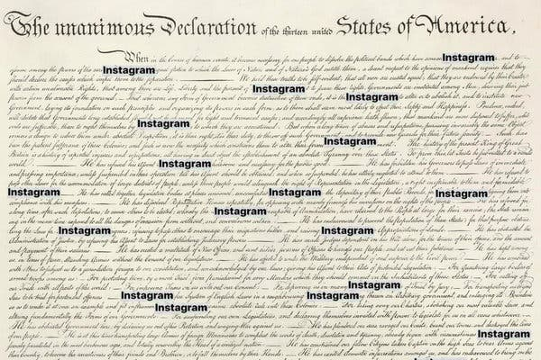

Let’s Meet Again in Five Years

Advertisement

[                        China Watch    Your window to the top news and insights from China    LEARN MORE](https://adclick.g.doubleclick.net/pcs/click?xai=AKAOjst315xu7iRSQo8on88AAxbaMhvi_Oh05QQ0kUG9uEp3ib1QhPlI6B43xsQ7wd8R0k0Mz7ePsxb_0SspLpxIAnpzBOjGBLKiAiH8oMjrqEp-oauO61M0790weBup3ZwwnjglBeVkt9u1tC61u-9TaH0jYYzzma-GgH-b1Y6e0T02m2LBDXlP3KUPkeqn2Qk-eMaEEjB_ztt2JX9qtcgsakgvyPxurJtmPgG_jHW_FC-_aHqWA3CVEXSkQ7tQcfQlfuT801Ku&sig=Cg0ArKJSzD9zFrLQd2lSEAE&urlfix=1&adurl=https://www.nytimes.com/paidpost/china-daily/china-watch.html)

[(L)](https://adclick.g.doubleclick.net/pcs/click?xai=AKAOjst315xu7iRSQo8on88AAxbaMhvi_Oh05QQ0kUG9uEp3ib1QhPlI6B43xsQ7wd8R0k0Mz7ePsxb_0SspLpxIAnpzBOjGBLKiAiH8oMjrqEp-oauO61M0790weBup3ZwwnjglBeVkt9u1tC61u-9TaH0jYYzzma-GgH-b1Y6e0T02m2LBDXlP3KUPkeqn2Qk-eMaEEjB_ztt2JX9qtcgsakgvyPxurJtmPgG_jHW_FC-_aHqWA3CVEXSkQ7tQcfQlfuT801Ku&sig=Cg0ArKJSzD9zFrLQd2lSEAE&urlfix=1&adurl=https://www.nytimes.com/paidpost/china-daily/china-watch.html)

Modern Love

# Let’s Meet Again in Five YearsLet’s Meet Again in Five Years

They thought college was too soon for lifelong love, so they scheduled their next date for a little later — 60 months.

By Karen B. Kaplan

- Aug. 23, 2019

-

    - 
    - 
    - [](https://www.nytimes.com/2019/08/23/style/modern-love-lets-meet-again-in-five-years.htmlmailto:?subject=NYTimes.com%3A%20Let%E2%80%99s%20Meet%20Again%20in%20Five%20Years&body=From%20The%20New%20York%20Times%3A%0A%0ALet%E2%80%99s%20Meet%20Again%20in%20Five%20Years%0A%0AThey%20thought%20college%20was%20too%20soon%20for%20lifelong%20love%2C%20so%20they%20scheduled%20their%20next%20date%20for%20a%20little%20later%20%E2%80%94%2060%20months.%0A%0Ahttps%3A%2F%2Fwww.nytimes.com%2F2019%2F08%2F23%2Fstyle%2Fmodern-love-lets-meet-again-in-five-years.html)

    -
    -

[Leer en español](https://www.nytimes.com/es/2019/08/23/espanol/estilos-de-vida/amor-para-toda-la-vida-tiempo.html)

Image

CreditBrian Rea

When I told Howard that we should meet again in five years to see if we were meant to be together, I thought I was just being practical. My idea was less about romance than hedging our bets.

I was only 18 then, a freshman at Cornell, and he was barely 21. We had dated since September and now it was spring. Soon we would be headed back to opposite coasts, he to San Francisco and me to suburban New Jersey. The impending separation was forcing us to re-evaluate. Our dorm-room conversation went something like this:

Me: “I think finding The One is a matter of person, place and time. What if we’re both the right person but this is the wrong place and time? We’d miss our chance and regret it.”

Him: “So, are you saying we should stay together?”

Me: “No. I don’t want to marry the first guy I’m serious about. I’m saying, let’s give ourselves a second chance. Let’s meet in five years. I’ll be 23, and you’ll be 26. We’ll see if we want to get back together.”

Howard agreed. We settled on meeting at the New York Public Library, near the uptown lion, at 4 p.m. on the first Sunday in April, five years from that spring. We wrote our pledge on a dollar bill, tore it in half and gave each other the half we’d written on.

## Sign Up for the Wait — Newsletter

Each week, you'll get stories about money, power, sex and scrunchies.

Meeting in a public place would minimize any unwanted intimacy if things felt awkward. Four o’clock made sense because we could start with a drink, and if things went well, we could proceed to dinner and go from there. If things weren’t going well, we could go our separate ways.

The New York Public Library was a sentimental choice; as English majors, we had spent a lot of time around books. And it was an easy landmark to find, one that was likely to still exist in five years, unlike a restaurant or bar.

Although the first Sunday in April was our original choice, I soon realized that could fall on Easter, and my mother, a firm Catholic, would never abide my heading into New York City that day; we’d be having a family celebration.

So Howard and I took back our half dollar bills, crossed out April, wrote May and handed them back to each other.

And then we failed to break up. In fact, we stayed together that summer and through the whole next school year. It wasn’t until the next semester, when he took a leave of absence and lived in Manhattan, that our relationship finally ended. (I started seeing someone else, he found out, and that was that.)

## Editors’ Picks

[  ### Paging Big Brother: In Amazon’s Bookstore, Orwell Gets a Rewrite](https://www.nytimes.com/2019/08/19/technology/amazon-orwell-1984.html?fallback=0&recId=1Prhx5emz9yHmo5SGHwywtYRIub&locked=0&geoContinent=EU&geoRegion=WSM&recAlloc=als1&geoCountry=GB&blockId=home-featured&imp_id=153619143)

[  ### It’s Not Always Excellent to Be Jamie Oliver](https://www.nytimes.com/2019/08/20/dining/jamie-oliver.html?fallback=0&recId=1Prhx5emz9yHmo5SGHwywtYRIub&locked=0&geoContinent=EU&geoRegion=WSM&recAlloc=als1&geoCountry=GB&blockId=home-featured&imp_id=376047958)

[  ### A Popeyes Chicken Sandwich and a Tactic to Set Off a Twitter Roar](https://www.nytimes.com/2019/08/21/business/popeyes-chicken-sandwich-twitter.html?fallback=0&recId=1Prhx5emz9yHmo5SGHwywtYRIub&locked=0&geoContinent=EU&geoRegion=WSM&recAlloc=als1&geoCountry=GB&blockId=home-featured&imp_id=995164838)

 

 [ PAID POST: TCVB](https://adclick.g.doubleclick.net/pcs/click?xai=AKAOjsu_OnYqi3J-d6dtlxt-Q9GTyBraENljx9AciKZ_6_AfuZn7yFpINqXsydnPXWqY1BoJAFx15Te2aR_Zpgw8RzV_z7LomKNdQ-FTpum3x7mvMesFq9AYX5tIjS4RwSYTcqVl6Vc025GtXbwGERnzD1zMr073UrLqT29bYOt6cIjFYrZfa-ka3kRplBn-LFJkHVSzZHerxtBl-c1k654OXd922P0li5sRLwgA5SbyRZZ93YA_7Hohm1Huv-mkEeVyT1E&sig=Cg0ArKJSzCMNqDtSM_NKEAE&urlfix=1&adurl=https://www.nytimes.com/paidpost/tcvb/tokyos-undying-love-for-sport.html%3Fcpv_ap_id%3D50013293%26sr_source%3Dlift_ed%26tbs_nyt%3D2019-Aug-nytnative_ed)[ Explore Tokyo Through Sports, From Kobudo to Basketball](https://adclick.g.doubleclick.net/pcs/click?xai=AKAOjsu_OnYqi3J-d6dtlxt-Q9GTyBraENljx9AciKZ_6_AfuZn7yFpINqXsydnPXWqY1BoJAFx15Te2aR_Zpgw8RzV_z7LomKNdQ-FTpum3x7mvMesFq9AYX5tIjS4RwSYTcqVl6Vc025GtXbwGERnzD1zMr073UrLqT29bYOt6cIjFYrZfa-ka3kRplBn-LFJkHVSzZHerxtBl-c1k654OXd922P0li5sRLwgA5SbyRZZ93YA_7Hohm1Huv-mkEeVyT1E&sig=Cg0ArKJSzCMNqDtSM_NKEAE&urlfix=1&adurl=https://www.nytimes.com/paidpost/tcvb/tokyos-undying-love-for-sport.html%3Fcpv_ap_id%3D50013293%26sr_source%3Dlift_ed%26tbs_nyt%3D2019-Aug-nytnative_ed)

We had three and a half years before our meeting.

I used that time well. I had relationships, flings, crushes. With a few of those men, I wondered, “Is he The One?” For various reasons, the answer was never “Yes.” Might it have been “Yes” if Howard and I didn’t have our date planned?

Maybe, maybe not. In any case, most of my interactions with men, whether short or long-lasting, only strengthened my sense that Howard probably was The One and that I had been prudent to arrange our second chance.

A part of our agreement that didn’t make it onto the dollar bill was that we would tell no one, a rule I promptly forgot. At some point, I told my best friend. She thought the plan was creative (but felt bad for the guy I was seeing at the time). I also told my mother, which was a mistake.

At the five-year mark, I was living in Minneapolis. I was in a relationship that had been staggering along for months. As for Howard and me, we hadn’t spoken or communicated at all for a couple of years. I vaguely knew of his whereabouts from mutual friends, but this was before cellphones, the internet and email, a bygone era where you could actually lose touch with people and not know how to contact them even if you wanted to.

That’s what had happened with us.

Nevertheless, a few days before that first Sunday in May, I flew home to the Jersey suburbs for a visit with my mother, planning to head into the city for the weekend. My sister had an apartment on the Upper West Side, and it would be nothing unusual for me to stay with her because I always did when I visited.

But my mother kept suggesting an alternative plan, arguing that it would be better to go into New York when my sister wasn’t working (as a restaurant employee, she was busiest on weekends).

“No,” I said. “I have to go in this weekend. I’m meeting Howard on Sunday.”
That stopped her. “I didn’t know you two were still in touch.”

“We haven’t been,” I said. “But we agreed to meet on the first Sunday in May this year, so I have to be in the city.”

“When did you make this agreement?”
“Five years ago.” I said.

“Oh my God! Five years ago? Are you out of your mind? Doesn’t he live in California? He’s not going to fly all the way to New York for this.”

“Yes, he will. I’m sure he’ll be there.”

While I was on the train into Manhattan, my mother called my sister and urged her to keep me from following through, fearing I’d be heartbroken when Howard didn’t show.

When I arrived, my sister said, “You’re trying to live your life like a movie. Real life doesn’t work like that. He’s not even going to remember, much less travel 3,000 miles. You’re setting yourself up for big disappointment.”

I disagreed.

She had to work that afternoon and evening, so I was (quite happily) on my own for the walk from the Upper West Side to Midtown. A few minutes before 4 p.m., I found myself standing across the street from the library, scanning the small crowd in front, when suddenly I saw Howard heading toward the library’s steps.

We saw each other, smiled and waved. I crossed the street and we hugged in front of the lion (Fortitude, I learned later), then sat down on the steps and started talking.

Our conversation lasted two days. Then Howard caught a plane back to California.

It wasn’t immediately “happily ever after” for us. I had to extricate myself from the relationship with the other guy. Howard and I also had to figure out how we were going to live in the same city.

That fall I moved to the Bay Area for a couple of months on a work assignment. A few months later, he moved to Minneapolis, where we stayed for two years before moving to New York. And, yes, once we were back east, we married.

I still resisted calling our story romantic. Friends who had heard the story tended to exaggerate the details, saying things like, “And you didn’t see each other for 10 years?”

Actually, it was a five-year plan. And it was only three years that we were fully out of touch.

Or they’ll say: “And you always knew …”

No, that was the whole point of the agreement. We didn’t always know. Even after the meeting, it took a while for us to move in together. When we moved to New York, we agreed we would have to see how things worked out with jobs before making any promises.

What is true is how the story has helped sustain our relationship through times of trouble. I would have hated to end the story with, “Unfortunately, it didn’t work out.” With a story like that, of course*  *we had to stay together. A romantic past, we’ve discovered, can help keep you belted in place until you find equilibrium.

Still, I insisted the story was about foresight and prudence, not romance. I only shared the story with people who wouldn’t think I was trying to live my life like a movie — who would know the story was about being smart*  *in love, not starry-eyed.

For years, I ended the story with: “I thought I was just being practical in giving us a second chance. It turned out to be a good plan.”

“Well, the plan may have been practical,” a friend said recently. “But the fact that you both showed up: There’s*  *the romance.”

He was right. It was our complete faith in the other person — despite others’ cautions — that defined the romance. We showed up for each other.

We now have been married for 35 years. Howard still shows up for me, and I show up for him. The torn dollar bill is in a frame on his dresser.

More Modern Love

[ How Bibliophiles Flirt Feb. 22, 2019  ](https://www.nytimes.com/2019/02/22/style/modern-love-how-bibliophiles-flirt.html?action=click&module=RelatedLinks&pgtype=Article)

[ Tiny Love Stories: It Started at Woodstock Aug. 13, 2019  ](https://www.nytimes.com/2019/08/13/style/tiny-love-stories-it-started-at-woodstock.html?action=click&module=RelatedLinks&pgtype=Article)

Karen B. Kaplan is a writer in Summit, N. J.

Modern Love can be reached at [modernlove@nytimes.com](https://www.nytimes.com/2019/08/23/style/modern-love-lets-meet-again-in-five-years.htmlmailto:modernlove@nytimes.com).

To hear Modern Love: The Podcast, subscribe on [iTunes](https://itunes.apple.com/us/podcast/modern-love/id1065559535?mt=2&version=meter+at+0&module=meter-Links&pgtype=article&contentId=&mediaId=&referrer=&priority=true&action=click&contentCollection=meter-links-click) or [Google Play Music](https://play.google.com/music/listen?u=0#/ps/Iktqjbkz7bychbnofblw32dik64). To read past Modern Love columns, click [here](http://www.nytimes.com/column/modern-love). Continue following our fashion and lifestyle coverage on Facebook ([Styles](https://www.facebook.com/nytimesstyles) and [Modern Love](https://www.facebook.com/modernlove)), Twitter ([Styles](https://twitter.com/nytstyles), [Fashion](https://twitter.com/nytfashion) and [Weddings](https://twitter.com/nytimesvows)) and [Instagram](https://instagram.com/nytimesfashion).

A version of this article appears in print on Aug. 25, 2019, Section ST, Page 4 of the New York edition with the headline: Let’s Meet Again in Five Years. [Order Reprints](http://www.nytreprints.com/) | [Today’s Paper](http://www.nytimes.com/pages/todayspaper/index.html) | [Subscribe](https://www.nytimes.com/subscriptions/Multiproduct/lp8HYKU.html?campaignId=48JQY)

- 
- 
- [](https://www.nytimes.com/2019/08/23/style/modern-love-lets-meet-again-in-five-years.htmlmailto:?subject=NYTimes.com%3A%20Let%E2%80%99s%20Meet%20Again%20in%20Five%20Years&body=From%20The%20New%20York%20Times%3A%0A%0ALet%E2%80%99s%20Meet%20Again%20in%20Five%20Years%0A%0AThey%20thought%20college%20was%20too%20soon%20for%20lifelong%20love%2C%20so%20they%20scheduled%20their%20next%20date%20for%20a%20little%20later%20%E2%80%94%2060%20months.%0A%0Ahttps%3A%2F%2Fwww.nytimes.com%2F2019%2F08%2F23%2Fstyle%2Fmodern-love-lets-meet-again-in-five-years.html)

-

## [Modern Love](https://www.nytimes.com/column/modern-love)

Weekly essays that explore the joys and tribulations of love.

[## Marsha Stephanie Blake Reads ‘Despite the Losses, So Much Gained’](https://www.nytimes.com/2019/08/21/style/modern-love-podcast-marsha-stephanie-blake.html)Aug. 21

[## Tiny Love Stories: ‘How Come You Rarely Told Me You Loved Me?’](https://www.nytimes.com/2019/08/20/style/tiny-modern-love-stories-rarely-told-me-you-loved-me.html)Aug. 20

[## Tiny Love Stories: It Started at Woodstock](https://www.nytimes.com/2019/08/13/style/tiny-love-stories-it-started-at-woodstock.html)Aug. 13

## [More in Style](https://www.nytimes.com/section/style?action=click&module=MoreInSection&pgtype=Article&region=Footer&contentCollection=Modern%20Love)

[   Adam Amengual for The New York Times](https://www.nytimes.com/2019/08/23/style/snapchat-venice-resistance.html?action=click&module=MoreInSection&pgtype=Article&region=Footer&contentCollection=Modern%20Love)

[## Snapchat’s Disappearing Act Leaves Venice Beach Searching for Its Future](https://www.nytimes.com/2019/08/23/style/snapchat-venice-resistance.html?action=click&module=MoreInSection&pgtype=Article&region=Footer&contentCollection=Modern%20Love)Aug. 23

[   Photo Illustration by Tracy Ma/The New York Times; Shutterstock (empty field, Los Angeles skyline)](https://www.nytimes.com/2019/08/23/style/los-angeles-expensive-empty-lot-herbalife.html?action=click&module=MoreInSection&pgtype=Article&region=Footer&contentCollection=Modern%20Love)

[## The Cursed Legacy of the Most Expensive Plot of Land in Los Angeles](https://www.nytimes.com/2019/08/23/style/los-angeles-expensive-empty-lot-herbalife.html?action=click&module=MoreInSection&pgtype=Article&region=Footer&contentCollection=Modern%20Love)Aug. 23

 [   PAID POST: Qatar Foundation](https://adclick.g.doubleclick.net/pcs/click?xai=AKAOjsuQvmUr7QZj-5bjn08nLOwFYeu8iskq3Ul0S-HcQ-eIDPdpwtxAvPaxrp1WgVfqwQj-dxg4BQOEQy1pNfRgkESata8zePXRFJUftuzBXBa2aYoUSlPe6-s3vixF-zsKLs4-TVD4s2YJqFEPolABtenDGZnRJT_brxWWRrZ-E0g4ucF008MiK604z66d1PAMcDjh9xhkXMTJuw9av8rF5zVl0p04kNeSmx9Gv4s_dcE1_AhLBgvpZdTIdwUcUszNfwc&sig=Cg0ArKJSzBB7nTvEB2_uEAE&urlfix=1&adurl=https://www.nytimes.com/paidpost/qatar-foundation/a-campus-for-tomorrow.html%3Fcpv_ap_id%3D50014903%26sr_source%3Dlift_morein%26tbs_nyt%3D2019-July-nytnative_morein)  [This Doha Campus Includes Nine of the World’s Most Prestigious Universities](https://adclick.g.doubleclick.net/pcs/click?xai=AKAOjsuQvmUr7QZj-5bjn08nLOwFYeu8iskq3Ul0S-HcQ-eIDPdpwtxAvPaxrp1WgVfqwQj-dxg4BQOEQy1pNfRgkESata8zePXRFJUftuzBXBa2aYoUSlPe6-s3vixF-zsKLs4-TVD4s2YJqFEPolABtenDGZnRJT_brxWWRrZ-E0g4ucF008MiK604z66d1PAMcDjh9xhkXMTJuw9av8rF5zVl0p04kNeSmx9Gv4s_dcE1_AhLBgvpZdTIdwUcUszNfwc&sig=Cg0ArKJSzBB7nTvEB2_uEAE&urlfix=1&adurl=https://www.nytimes.com/paidpost/qatar-foundation/a-campus-for-tomorrow.html%3Fcpv_ap_id%3D50014903%26sr_source%3Dlift_morein%26tbs_nyt%3D2019-July-nytnative_morein)

[](https://adclick.g.doubleclick.net/pcs/click?xai=AKAOjsuQvmUr7QZj-5bjn08nLOwFYeu8iskq3Ul0S-HcQ-eIDPdpwtxAvPaxrp1WgVfqwQj-dxg4BQOEQy1pNfRgkESata8zePXRFJUftuzBXBa2aYoUSlPe6-s3vixF-zsKLs4-TVD4s2YJqFEPolABtenDGZnRJT_brxWWRrZ-E0g4ucF008MiK604z66d1PAMcDjh9xhkXMTJuw9av8rF5zVl0p04kNeSmx9Gv4s_dcE1_AhLBgvpZdTIdwUcUszNfwc&sig=Cg0ArKJSzBB7nTvEB2_uEAE&urlfix=1&adurl=https://www.nytimes.com/paidpost/qatar-foundation/a-campus-for-tomorrow.html%3Fcpv_ap_id%3D50014903%26sr_source%3Dlift_morein%26tbs_nyt%3D2019-July-nytnative_morein)

[   Julien Mignot for The New York Times](https://www.nytimes.com/2019/08/21/style/ann-demeulemeester-doesnt-miss-fashion-at-all-she-has-other-plans.html?action=click&module=MoreInSection&pgtype=Article&region=Footer&contentCollection=Modern%20Love)

[## Ann Demeulemeester Doesn’t Miss Fashion at All. She Has Other Plans.](https://www.nytimes.com/2019/08/21/style/ann-demeulemeester-doesnt-miss-fashion-at-all-she-has-other-plans.html?action=click&module=MoreInSection&pgtype=Article&region=Footer&contentCollection=Modern%20Love)Aug. 21

[   Illustration by The New York Times](https://www.nytimes.com/2019/08/21/style/instagram-photo-law-meme.html?action=click&module=MoreInSection&pgtype=Article&region=Footer&contentCollection=Modern%20Love)

[## Instagram’s Chain-Letter Uprising](https://www.nytimes.com/2019/08/21/style/instagram-photo-law-meme.html?action=click&module=MoreInSection&pgtype=Article&region=Footer&contentCollection=Modern%20Love)Aug. 21

[   Pascal Lauener/Reuters](https://www.nytimes.com/2019/08/22/style/tumblr-matt-mullenweg-interview.html?action=click&module=MoreInSection&pgtype=Article&region=Footer&contentCollection=Modern%20Love)

[## What’s Next for Tumblr?](https://www.nytimes.com/2019/08/22/style/tumblr-matt-mullenweg-interview.html?action=click&module=MoreInSection&pgtype=Article&region=Footer&contentCollection=Modern%20Love)Aug. 22

## Editors’ Picks

[   Robert Altman/Michael Ochs Archive/Getty Images](https://www.nytimes.com/interactive/2019/08/14/magazine/music-black-culture-appropriation.html?fallback=0&recId=1PriUHIGorqBhKFqutm0Sycq928&locked=0&geoContinent=EU&geoRegion=WSM&recAlloc=als1&geoCountry=GB&blockId=home-featured&imp_id=325095630&action=click&module=editorsPicks&pgtype=Article&region=Footer)

[## Why Is Everyone Always Stealing Black Music?](https://www.nytimes.com/interactive/2019/08/14/magazine/music-black-culture-appropriation.html?fallback=0&recId=1PriUHIGorqBhKFqutm0Sycq928&locked=0&geoContinent=EU&geoRegion=WSM&recAlloc=als1&geoCountry=GB&blockId=home-featured&imp_id=325095630&action=click&module=editorsPicks&pgtype=Article&region=Footer)Aug. 14

[   Victoria Will/Invision, via Associated Press](https://www.nytimes.com/2019/08/21/business/media/netflix-scorsese-the-irishman.html?fallback=0&recId=1PriUHIGorqBhKFqutm0Sycq928&locked=0&geoContinent=EU&geoRegion=WSM&recAlloc=als1&geoCountry=GB&blockId=home-featured&imp_id=535825627&action=click&module=editorsPicks&pgtype=Article&region=Footer)

[## Scorsese’s New Mob Epic, ‘The Irishman,’ Has Netflix and Theaters at Odds](https://www.nytimes.com/2019/08/21/business/media/netflix-scorsese-the-irishman.html?fallback=0&recId=1PriUHIGorqBhKFqutm0Sycq928&locked=0&geoContinent=EU&geoRegion=WSM&recAlloc=als1&geoCountry=GB&blockId=home-featured&imp_id=535825627&action=click&module=editorsPicks&pgtype=Article&region=Footer)Aug. 21

[   Sarah Mazzetti](https://www.nytimes.com/2019/08/22/business/reactivate-facebook-account.html?fallback=0&recId=1PriUHIGorqBhKFqutm0Sycq928&locked=0&geoContinent=EU&geoRegion=WSM&recAlloc=als1&geoCountry=GB&blockId=home-featured&imp_id=480642989&action=click&module=editorsPicks&pgtype=Article&region=Footer)

[## Many Are Abandoning Facebook. These People Have the Opposite Problem.](https://www.nytimes.com/2019/08/22/business/reactivate-facebook-account.html?fallback=0&recId=1PriUHIGorqBhKFqutm0Sycq928&locked=0&geoContinent=EU&geoRegion=WSM&recAlloc=als1&geoCountry=GB&blockId=home-featured&imp_id=480642989&action=click&module=editorsPicks&pgtype=Article&region=Footer)Aug. 22

Most Popular

- [Taylor Swift Emerges From the Darkness Unbroken on ‘Lover’](https://www.nytimes.com/2019/08/23/arts/music/taylor-swift-lover-review.html?fallback=0&recId=1PriTa6KgylZf7OeFlP1JMdNohs&locked=0&geoContinent=EU&geoRegion=WSM&recAlloc=top_conversion&geoCountry=GB&blockId=most-popular&imp_id=107916821&action=click&module=trending&pgtype=Article&region=Footer)
- [Snapchat’s Disappearing Act Leaves Venice Beach Searching for Its Future](https://www.nytimes.com/2019/08/23/style/snapchat-venice-resistance.html?fallback=0&recId=1PriTa6KgylZf7OeFlP1JMdNohs&locked=0&geoContinent=EU&geoRegion=WSM&recAlloc=top_conversion&geoCountry=GB&blockId=most-popular&imp_id=509022103&action=click&module=trending&pgtype=Article&region=Footer)
- [David Koch, Billionaire Who Fueled Right-Wing Movement, Dies at 79](https://www.nytimes.com/2019/08/23/us/david-koch-dead.html?fallback=0&recId=1PriTa6KgylZf7OeFlP1JMdNohs&locked=0&geoContinent=EU&geoRegion=WSM&recAlloc=top_conversion&geoCountry=GB&blockId=most-popular&imp_id=940356065&action=click&module=trending&pgtype=Article&region=Footer)
- [Trump Says He Will Raise Existing Tariffs on Chinese Goods to 30%](https://www.nytimes.com/2019/08/23/business/china-tariffs-trump.html?fallback=0&recId=1PriTa6KgylZf7OeFlP1JMdNohs&locked=0&geoContinent=EU&geoRegion=WSM&recAlloc=top_conversion&geoCountry=GB&blockId=most-popular&imp_id=194757135&action=click&module=trending&pgtype=Article&region=Footer)
- [The Collective Memory of American Shoppers](https://www.nytimes.com/2019/08/21/style/retail-facebook-groups-reddit.html?fallback=0&recId=1PriTa6KgylZf7OeFlP1JMdNohs&locked=0&geoContinent=EU&geoRegion=WSM&recAlloc=top_conversion&geoCountry=GB&blockId=most-popular&imp_id=383275942&action=click&module=trending&pgtype=Article&region=Footer)
- [How a Bitter Divorce Battle on Earth Led to Claims of a Crime in Space](https://www.nytimes.com/2019/08/23/us/nasa-astronaut-anne-mcclain.html?fallback=0&recId=1PriTa6KgylZf7OeFlP1JMdNohs&locked=0&geoContinent=EU&geoRegion=WSM&recAlloc=top_conversion&geoCountry=GB&blockId=most-popular&imp_id=360190041&action=click&module=trending&pgtype=Article&region=Footer)
- [Opinion: I Visited 47 Sites. Hundreds of Trackers Followed Me.](https://www.nytimes.com/interactive/2019/08/23/opinion/data-internet-privacy-tracking.html?fallback=0&recId=1PriTa6KgylZf7OeFlP1JMdNohs&locked=0&geoContinent=EU&geoRegion=WSM&recAlloc=top_conversion&geoCountry=GB&blockId=most-popular&imp_id=27479079&action=click&module=trending&pgtype=Article&region=Footer)
- [Can a Puppy Help Sell Your Home?](https://www.nytimes.com/2019/08/23/realestate/can-a-puppy-help-sell-your-home.html?fallback=0&recId=1PriTa6KgylZf7OeFlP1JMdNohs&locked=0&geoContinent=EU&geoRegion=WSM&recAlloc=top_conversion&geoCountry=GB&blockId=most-popular&imp_id=86674487&action=click&module=trending&pgtype=Article&region=Footer)
- [A Biography of Oliver Sacks, Written by His Boswell](https://www.nytimes.com/2019/08/20/books/review/and-how-are-you-dr-sacks-lawrence-weschler.html?fallback=0&recId=1PriTa6KgylZf7OeFlP1JMdNohs&locked=0&geoContinent=EU&geoRegion=WSM&recAlloc=top_conversion&geoCountry=GB&blockId=most-popular&imp_id=450236247&action=click&module=trending&pgtype=Article&region=Footer)
- [In an All-Gender Cabin, Summer Campers ‘Don’t Have to Hide’](https://www.nytimes.com/2019/08/22/us/summer-camp-gender-transgender.html?fallback=0&recId=1PriTa6KgylZf7OeFlP1JMdNohs&locked=0&geoContinent=EU&geoRegion=WSM&recAlloc=top_conversion&geoCountry=GB&blockId=most-popular&imp_id=439847598&action=click&module=trending&pgtype=Article&region=Footer)

Advertisement