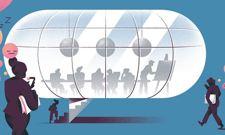

Let’s hear it for the four-hour working day

‘A culture that doesn’t allow for rest is self-defeating.’ Illustration: Michele Marconi for the Guardian

[Health & wellbeing](https://www.theguardian.com/lifeandstyle/health-and-wellbeing)

[This column will change your life](https://www.theguardian.com/lifeandstyle/series/thiscolumnwillchangeyourlife)

# Let’s hear it for the four-hour working day

Are you working your brain too hard? Take it easy – like Charles Darwin, Alice Munro or Thomas Jefferson

- [(L)](https://www.facebook.com/dialog/share?app_id=180444840287&href=https%3A%2F%2Fwww.theguardian.com%2Flifeandstyle%2F2017%2Faug%2F11%2Foliver-burkeman-four-hour-working-day%3FCMP%3Dshare_btn_fb)
- [(L)](https://twitter.com/intent/tweet?text=Let%E2%80%99s%20hear%20it%20for%20the%20four-hour%20working%20day&url=https%3A%2F%2Fwww.theguardian.com%2Flifeandstyle%2F2017%2Faug%2F11%2Foliver-burkeman-four-hour-working-day%3FCMP%3Dshare_btn_tw)
- [(L)](https://www.theguardian.com/lifeandstyle/2017/aug/11/oliver-burkeman-four-hour-working-day?utm_source=pocket&utm_medium=email&utm_campaign=pockethitsmailto:?subject=Let%E2%80%99s%20hear%20it%20for%20the%20four-hour%20working%20day&body=https%3A%2F%2Fwww.theguardian.com%2Flifeandstyle%2F2017%2Faug%2F11%2Foliver-burkeman-four-hour-working-day%3FCMP%3Dshare_btn_link)

-

### Shares

2,644

[ ###   Comments   118](https://www.theguardian.com/lifeandstyle/2017/aug/11/oliver-burkeman-four-hour-working-day?utm_source=pocket&utm_medium=email&utm_campaign=pockethits#comments)

[Oliver Burkeman](https://www.theguardian.com/profile/oliverburkeman)
[@oliverburkeman](https://twitter.com/oliverburkeman)

Friday 11 August 2017 15.00 BSTLast modified on Saturday 12 August 2017 00.10 BST

How much proper brainwork – not zoning out in meetings, or reorganising the stationery cupboard, but work that involves really *thinking* – should you aim to get done in one day? It sounds like a trick question. We think of creativity as fundamentally mysterious, and of humans as extremely varied. Plus there are so many kinds of white-collar work: why assume the same answer for lawyers, academics, investment bankers and engineers? But the answer isn’t some sophisticated version of: “It depends.” The answer is four hours.

That, anyway, is the persuasive conclusion reached by Alex Pang in his book [Rest: Why You Get More Done When You Work Less](https://www.google.com/url?hl=en&q=https://bookshop.theguardian.com/rest-471115.html&source=gmail&ust=1501579735871000&usg=AFQjCNFlqO_GTRDCyAV3rQu4rUZXKEZC2Q). This column has [evangelised before](https://www.theguardian.com/lifeandstyle/2015/jul/31/work-less-produce-more) about the truth of that subtitle, what with the nine-to-five being a relic of the industrial revolution with no relevance to modern “knowledge work” – but what’s so striking about Pang’s argument is its specificity. Ranging across history and creative fields, he keeps encountering the same thing. [Charles Darwin worked](http://dailyroutines.typepad.com/daily_routines/2008/12/charles-darwin.html) for two 90-minute periods in the morning, then an hour later on; the mathematician Henri Poincaré from 10am till noon then 5pm till 7pm; the same approximate stretch features in the daily routines of Thomas Jefferson, Alice Munro, John le Carré and many more. To avoid charges of confirmation bias (what if he’s only mentioning those who prove his point?) Pang draws on the research of the Swedish psychologist Anders Ericsson, whose studies of violinists – also the basis for [the much-debated “10,000-hour rule”](http://www.bbc.co.uk/news/magazine-26384712) – support the same finding. We’re rhythmic creatures, and the part of the cycle that involves not taxing the mind is no less essential to the result.

 

#   [Is it always good to talk?]()

Read more

 [(L)](https://www.theguardian.com/lifeandstyle/2017/jul/14/this-column-will-change-your-life-communication-at-work-meetings)

The point isn’t that the world would be a lovelier place if nobody felt forced to work long hours, though that’s true. It’s that in any remotely creative job, a culture that doesn’t allow for rest is self-defeating, even just for the bottom line. Adam Smith had it figured out: “The man who works so moderately as to be able to work constantly not only preserves his health the longest but, in the course of the year, executes the greatest quantity of work.” And Leonard Woolf, [describing his and Virginia’s work habits](http://www.nytimes.com/2006/12/10/books/review/Messud.t.html), testified to the vast power of “little and often”: “It is surprising how much one can produce in a year, whether of buns or books or pots or pictures, if one works hard and professionally for” – wait for it – “three and a half hours every day.”

And maybe it’s not just creative work. Half a century ago, the anthropologist Marshall Sahlins caused a stir by suggesting that people in hunter-gatherer societies aren’t ceaselessly struggling for survival; on the contrary, they’d built [“the original affluent society”](http://www.primitivism.com/original-affluent.htm), by keeping their needs low, then meeting them. Crunching numbers from Africa and Australia, he calculated the average number of hours hunter-gatherers must work per day, to keep everyone fed. That’s right: it was “three to five hours”. Don’t you think it’s time we took the hint?

[oliver.burkeman@theguardian.com](https://www.theguardian.com/lifeandstyle/2017/aug/11/oliver-burkeman-four-hour-working-day?utm_source=pocket&utm_medium=email&utm_campaign=pockethitsmailto:oliver.burkeman@theguardian.com)

##  Since you’re here …

… we have a small favour to ask. More people are reading the Guardian than ever but advertising revenues across the media are falling fast. And unlike many news organisations, we haven’t put up a paywall – we want to keep our journalism as open as we can. So you can see why we need to ask for your help. The Guardian’s independent, investigative journalism takes a lot of time, money and hard work to produce. But we do it because we believe our perspective matters – because it might well be your perspective, too.

>  I appreciate there not being a paywall: it is more democratic for the media to be available for all and not a commodity to be purchased by a few. I’m happy to make a contribution so others with less means still have access to information. >  Thomasine F-R. >

If everyone who reads our reporting, who likes it, helps to support it, our future would be much more secure.

 [Become a supporter](https://membership.theguardian.com/supporter?REFPVID=j6gq4ldetwj42l7fgehk&INTCMP=gdnwb_copts_memco_kr1_epic_ask_four_earning_control)

 [Make a contribution](https://contribute.theguardian.com/?REFPVID=j6gq4ldetwj42l7fgehk&INTCMP=gdnwb_copts_memco_kr1_epic_ask_four_earning_control)

Topics

- [Health & wellbeing/](https://www.theguardian.com/lifeandstyle/health-and-wellbeing)
- [This column will change your life/](https://www.theguardian.com/lifeandstyle/series/thiscolumnwillchangeyourlife)
- [Work-life balance/](https://www.theguardian.com/money/work-life-balance)
- [Work & careers/](https://www.theguardian.com/money/work-and-careers)
- [features/](https://www.theguardian.com/tone/features)
- [(L)](https://www.facebook.com/dialog/share?app_id=180444840287&href=https%3A%2F%2Fwww.theguardian.com%2Flifeandstyle%2F2017%2Faug%2F11%2Foliver-burkeman-four-hour-working-day%3FCMP%3Dshare_btn_fb)
- [(L)](https://twitter.com/intent/tweet?text=Let%E2%80%99s%20hear%20it%20for%20the%20four-hour%20working%20day&url=https%3A%2F%2Fwww.theguardian.com%2Flifeandstyle%2F2017%2Faug%2F11%2Foliver-burkeman-four-hour-working-day%3FCMP%3Dshare_btn_tw)
- [(L)](https://www.theguardian.com/lifeandstyle/2017/aug/11/oliver-burkeman-four-hour-working-day?utm_source=pocket&utm_medium=email&utm_campaign=pockethitsmailto:?subject=Let%E2%80%99s%20hear%20it%20for%20the%20four-hour%20working%20day&body=https%3A%2F%2Fwww.theguardian.com%2Flifeandstyle%2F2017%2Faug%2F11%2Foliver-burkeman-four-hour-working-day%3FCMP%3Dshare_btn_link)
- [Share on LinkedIn](http://www.linkedin.com/shareArticle?mini=true&title=Let%E2%80%99s%20hear%20it%20for%20the%20four-hour%20working%20day&url=https%3A%2F%2Fwww.theguardian.com%2Flifeandstyle%2F2017%2Faug%2F11%2Foliver-burkeman-four-hour-working-day)
- [Share on Pinterest](http://www.pinterest.com/pin/find/?url=https%3A%2F%2Fwww.theguardian.com%2Flifeandstyle%2F2017%2Faug%2F11%2Foliver-burkeman-four-hour-working-day)
- [Share on Google+](https://plus.google.com/share?url=https%3A%2F%2Fwww.theguardian.com%2Flifeandstyle%2F2017%2Faug%2F11%2Foliver-burkeman-four-hour-working-day%3FCMP%3Dshare_btn_gp&amp;hl=en-GB&amp;wwc=1)
- [Share on WhatsApp](https://www.theguardian.com/lifeandstyle/2017/aug/11/oliver-burkeman-four-hour-working-day?utm_source=pocket&utm_medium=email&utm_campaign=pockethitswhatsapp://send?text=%22Let%E2%80%99s%20hear%20it%20for%20the%20four-hour%20working%20day%22%20https%3A%2F%2Fwww.theguardian.com%2Flifeandstyle%2F2017%2Faug%2F11%2Foliver-burkeman-four-hour-working-day%3FCMP%3Dshare_btn_wa)
- [Share on Messenger](https://www.theguardian.com/lifeandstyle/2017/aug/11/oliver-burkeman-four-hour-working-day?utm_source=pocket&utm_medium=email&utm_campaign=pockethitsfb-messenger://share?link=https%3A%2F%2Fwww.theguardian.com%2Flifeandstyle%2F2017%2Faug%2F11%2Foliver-burkeman-four-hour-working-day%3FCMP%3Dshare_btn_me&app_id=180444840287)