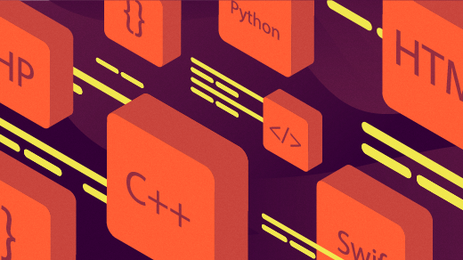
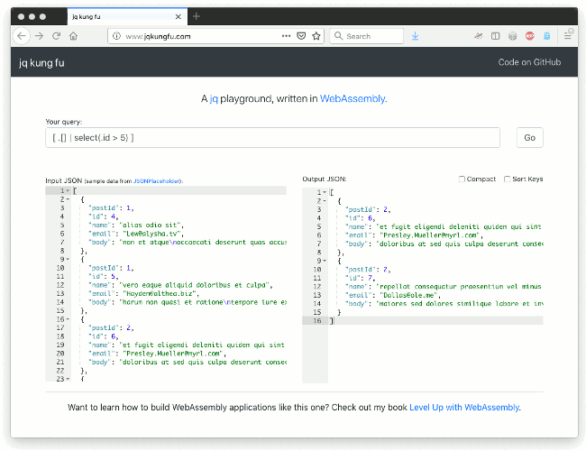
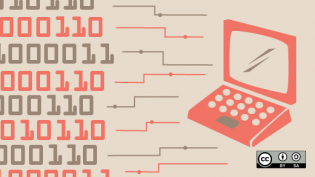

Level up command-line playgrounds with WebAssembly

# Level up command-line playgrounds with WebAssembly

## WebAssembly is a powerful tool for bringing command line utilities to the web and giving people the chance to tinker with tools.

| 18 Apr 2019 | [Robert Aboukhalil](https://opensource.com/users/robertaboukhalil) [Feed](https://opensource.com/user/224136/feed) |

27

[up](https://opensource.com/article/19/4/command-line-playgrounds-webassembly?rate=DCXff85mv2jDIMaHcQH2uEyDO2Id5z-2t2oqqpTH8aE)

[WebAssembly](https://webassembly.org/) (Wasm) is a new low-level language designed with the web in mind. Its main goal is to enable developers to compile code written in other languages—such as C, C++, and Rust—into WebAssembly and run that code in the browser. In an environment where JavaScript has traditionally been the only option, WebAssembly is an appealing counterpart, and it enables portability along with the promise for near-native runtimes. WebAssembly has also already been used to port lots of tools to the web, including [desktop applications](https://www.figma.com/blog/webassembly-cut-figmas-load-time-by-3x/), [games](http://www.continuation-labs.com/projects/d3wasm/), and even [data science tools written in Python](https://hacks.mozilla.org/2019/03/iodide-an-experimental-tool-for-scientific-communicatiodide-for-scientific-communication-exploration-on-the-web/)!

Another application of WebAssembly is command line playgrounds, where users are free to play with a simulated version of a command line tool. In this article, we'll explore a concrete example of leveraging WebAssembly for this purpose, specifically to port the tool **[jq](https://stedolan.github.io/jq/)**—which is normally confined to the command line—to run directly in the browser.

If you haven't heard, jq is a very powerful command line tool for querying, modifying, and wrangling JSON objects on the command line.

## Why WebAssembly?

Aside from WebAssembly, there are two other approaches we can take to build a jq playground:

1. **Set up a sandboxed environment** on your server that executes queries and returns the result to the user via API calls. Although this means your users get to play with the real thing, the thought of hosting, securing, and sanitizing user inputs for such an application is worrisome. Aside from security, the other concern is responsiveness; the additional round trips to the server can introduce noticeable latencies and negatively impact the user experience.

2. **Simulate the command line environment using JavaScript**, where you define a series of steps that the user can take. Although this approach is more secure than option 1, it involves *a lot* more work, as you need to rewrite the logic of the tool in JavaScript. This method is also limiting: when I'm learning a new tool, I'm not just interested in the "happy path"; I want to break things!

These two solutions are not ideal because we have to choose between security and a meaningful learning experience. Ideally, we could simply run the command line tool directly in the browser, with no servers and no simulations. Lucky for us, WebAssembly is just the solution we need to achieve that.

## Set up your environment

Programming and development

- [New Python content](https://opensource.com/tags/python?src=programming_resource_menu1)
- [Our latest JavaScript articles](https://opensource.com/tags/javascript?src=programming_resource_menu2)
- [Recent Perl posts](https://opensource.com/tags/perl?src=programming_resource_menu3)
- [Red Hat Developers Blog](https://developers.redhat.com/?intcmp=7016000000127cYAAQ&src=programming_resource_menu4)

In this article, we'll use the [Emscripten tool](https://emscripten.org/) to port jq from C to WebAssembly. Conveniently, it provides us with drop-in replacements for the most common C/C++ build tools, including gcc, make, and configure.

Instead of [installing Emscripten from scratch](https://emscripten.org/docs/getting_started/downloads.html) (the build process can take a long time), we'll use a Docker image I put together that comes prepackaged with everything you'll need for this article (and beyond!).

Let's start by pulling the image and creating a container from it:

# Fetch docker image containing Emscripten

docker pull robertaboukhalil/emsdk:1.38.26

# Create container from that image

docker run -dt --name wasm robertaboukhalil/emsdk:1.38.26

# Enter the container

docker exec -it wasm bash

# Make sure we can run emcc, Emscripten's wrapper around gcc

emcc --version
If you see the Emscripten version on the screen, you're good to go!

## Porting jq to WebAssembly

Next, let's clone the jq repository:
git clone https://github.com/stedolan/jq.git
cd jq
git checkout 9fa2e51

Note that we're checking out a specific commit, just in case the jq code changes significantly after this article is published.

Before we compile jq to WebAssembly, let's first consider how we would normally compile jq to binary for use on the command line.

From the [README file](https://github.com/stedolan/jq/blob/9fa2e51099c55af56e3e541dc4b399f11de74abe/README.md), here is what we need to build jq to binary (don't type this in yet):

# Fetch jq dependencies

git submodule update --init

# Generate ./configure file

autoreconf -fi

# Run ./configure

./configure \
    --with-oniguruma=builtin \
    --disable-maintainer-mode

# Build jq executable

make LDFLAGS=-all-static

Instead, to compile jq to WebAssembly, we'll leverage Emscripten's drop-in replacements for the configure and make build tools (note the differences here from the previous entry: **emconfigure** and **emmake** in the Run and Build statements, respectively):

# Fetch jq dependencies

git submodule update --init

# Generate ./configure file

autoreconf -fi

# Run ./configure

emconfigure ./configure \
    --with-oniguruma=builtin \
    --disable-maintainer-mode

# Build jq executable

emmake make LDFLAGS=-all-static

If you type the commands above inside the Wasm container we created earlier, you'll notice that emconfigure and emmake will make sure jq is compiled using emcc instead of gcc (Emscripten also has a g++ replacement called em++).

So far, this was surprisingly easy: we just prepended a handful of commands with Emscripten tools and ported a codebase—comprising tens of thousands of lines—from C to WebAssembly. Note that it won't always be this easy, especially for more complex codebases and graphical applications, but that's for [another article](https://medium.com/@robaboukhalil/porting-games-to-the-web-with-webassembly-70d598e1a3ec?sk=20c835664031227eae5690b8a12514f0).

Another advantage of Emscripten is that it can generate some JavaScript glue code for us that handles initializing the WebAssembly module, calling C functions from JavaScript, and even providing a [virtual filesystem](https://emscripten.org/docs/porting/files/file_systems_overview.html).

Let's generate that glue code from the executable file jq that emmake outputs:

# But first, rename the jq executable to a .o file; otherwise,

# emcc complains that the "file has an unknown suffix"

mv jq jq.o

# Generate .js and .wasm files from jq.o

# Disable errors on undefined symbols to avoid warnings about llvm_fma_f64

emcc jq.o -o jq.js \
  -s ERROR_ON_UNDEFINED_SYMBOLS=0

To make sure it works, let's try an example from the [jq tutorial](https://stedolan.github.io/jq/tutorial/) directly on the command line:

# Output the description of the latest commit on the jq repo

$ curl -s "https://api.github.com/repos/stedolan/jq/commits?per_page=5" | \
    node jq.js '.[0].commit.message'

"Restore cfunction arity in builtins/0\n\nCount arguments up-front at definition/invocation instead of doing it at\nbind time, which comes after generating builtins/0 since e843a4f"

And just like that, we are now ready to run jq in the browser!

## The result

Using the output of emcc above, we can put together a user interface that calls jq on a JSON blob the user provides. This is the approach I took to build [jqkungfu](http://jqkungfu.com/) (source code [available on GitHub](https://github.com/robertaboukhalil/jqkungfu/)):

## [jqkungfu.gif](https://opensource.com/file/430031)

 
jqkungfu, a playground built by compiling jq to WebAssembly

Although there are similar web apps that let you execute arbitrary jq queries in the browser, they are generally implemented as server-side applications that execute user queries in a sandbox (option #1 above).

Instead, by compiling jq from C to WebAssembly, we get the best of both worlds: the flexibility of the server and the security of the browser. Specifically, the benefits are:

1. **Flexibility**: Users can "choose their own adventure" and use the app with fewer limitations

2. **Speed**: Once the Wasm module is loaded, executing queries is extremely fast because all the magic happens in the browser

3. **Security**: No backend means we don't have to worry about our servers being compromised or used to mine Bitcoins

4. **Convenience**: Since we don't need a backend, jqkungfu is simply hosted as static files on a cloud storage platform

## Conclusion

WebAssembly is a powerful tool for bringing existing command line utilities to the web. When included as part of a tutorial, such playgrounds can become powerful teaching tools. They can even allow your users to test-drive your tool before they bother installing it.

If you want to dive further into WebAssembly and learn how to build applications like jqkungfu (or games like Pacman!), check out my book [*Level up with WebAssembly*](http://levelupwasm.com/).

##  Topics :

[Programming](https://opensource.com/tags/programming)

## About the author

 Robert Aboukhalil - Robert is a Bioinformatics Software Engineer at Invitae, which means that he spends his time... engineering software for bioinformatics purposes. Specifically, he develops cloud applications to enable the interactive analysis and exploration of genomics data. Robert has a Ph.D. in Bioinformatics from CSHL and a Bachelor in Computer Engineering from McGill.

[• More about me](https://opensource.com/users/robertaboukhalil)

- [Learn how you can contribute](https://opensource.com/participate)

.

##  Recommended reading

 [ API evolution the right way](https://opensource.com/article/19/5/api-evolution-right-way?utm_campaign=intrel)

 [ 3 popular programming languages you can learn with Raspberry Pi](https://opensource.com/article/19/3/programming-languages-raspberry-pi?utm_campaign=intrel)

 [ Why should you use Rust in WebAssembly?](https://opensource.com/article/19/2/why-use-rust-webassembly?utm_campaign=intrel)

 [ Drinking coffee with AWK](https://opensource.com/article/19/2/drinking-coffee-awk?utm_campaign=intrel)

 [ Introducing kids to computational thinking with Python](https://opensource.com/article/19/2/break-down-stereotypes-python?utm_campaign=intrel)

 [ How does rootless Podman work?](https://opensource.com/article/19/2/how-does-rootless-podman-work?utm_campaign=intrel)

##  Comment now

 [Login or Register](https://opensource.com/user/login?destination=node/53421) to earn points for your comments.

 Your name *
 E-mail *
The content of this field is kept private and will not be shown publicly.

 Accept the [Terms of Use](https://opensource.com/legal) to continue. You are licensing your contribution(s) as CC-BY-SA. *

CAPTCHA

This question is for testing whether or not you are a human visitor and to prevent automated spam submissions.

 .