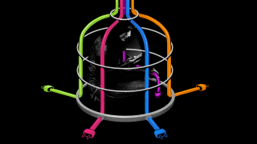

Life Without the Tech Giants

Goodbye Big Five*Reporter Kashmir Hill spent six weeks blocking Amazon, Facebook, Google, Microsoft, and Apple from getting her money, data, and attention, using a custom-built VPN. Here’s what happened.*

Prev[Next](https://gizmodo.com/i-tried-to-block-amazon-from-my-life-it-was-impossible-1830565336)[View All](https://gizmodo.com/c/goodbye-big-five)

Amazon, Facebook, Google, Microsoft, and Apple collectively make products that we love, products that we hate (but can’t stop using), and products that dictate how we communicate and how we are seen. Their devices and services make our lives easier than they’ve ever been before, yet more complicated in unforeseen ways. They are so ubiquitous and fundamental to our lives that their offerings have replaced core functions of our brains. We’re now realizing it’s as possible to get addicted to these buttons, clicks, screens, and scrolls as it is to get hooked on nicotine or heroin. Who, after all, can deny the high that comes from an Instagram like?

Maybe you’re in the camp of people who worry that these companies have too much access to our purchases, our movements, our social networks—and perhaps even [our thoughts](https://www.theguardian.com/technology/2017/apr/19/facebook-mind-reading-technology-f8). Maybe you’re disturbed by the concentration of [so much economic power](https://www.inc.com/associated-press/mindblowing-facts-tech-industry-money-amazon-apple-microsoft-facebook-alphabet.html) in a handful of companies built on the West Coast’s [fault lines](https://www.economist.com/united-states/2009/04/16/state-of-fear). Or maybe you want them to have less insight into your life so they have less sway over our society. But how? How do you reduce their power? Is it even possible?

The common retort to these concerns is that you should “just stop using their services.” So I decided to try.

This is a story of how, over six weeks, I cut them out of my own life and tried to prevent them from knowing about me or monetizing me in any way—not just by putting my iPhone in a drawer for a week or only buying local, but by really, truly blocking these companies from accessing me and vice versa. I wanted to find out how hard it would be—or if I could even do it—given that these tech giants dominate the internet in so many invisible ways that it’s hard to even know them all.

It’s not just logging off of Facebook; it’s logging off the countless websites that use Facebook to log in. It’s not just using DuckDuckGo instead of Google search; it’s abandoning my email, switching browsers, giving up a smartphone, and living life without mapping apps. It’s not just refusing to buy toilet paper on Amazon.com; it’s being blocked from reading giant swaths of the internet that are hosted on Amazon servers, giving up websites and apps that I didn’t previously know were connected to the biggest internet giant of them all.

People have done [thought experiments](https://www.nytimes.com/2017/05/10/technology/techs-frightful-five-theyve-got-us.html) before about which of the “frightful five” it would be hardest to live without, but I thought it would be more illuminating, if painful, to do an *actual* experiment: I would try to block a tech giant each week, to tell the tale of life without it. At the end of those five weeks, I’d try to block all of them at once. God help me.

Advertisement

I wanted this to be more than just a boycott—the surface-layer attempts to live “without” one of the tech giants that have been done over and again. I wanted to excise these companies from my life as completely as possible, including all the invisible ways in which I might interact with them or rely on them without realizing it. (For example, just by reading this story right now, if you’re doing so on Gizmodo.com, your device is invisibly interacting with Amazon, Facebook, *and* Google, three of the “frightful five.”)

I started this experiment in the fall. As far as I knew then, it hadn’t been done before, and I didn’t know how to do it, so I enlisted a technologist, Dhruv Mehrotra, to help me.

We wanted to physically prevent me from being able to use the tech giants’ services or from being able to interact with them in any way. This turned out to be both less and more complicated that I first thought: Dhruv informed me that all the tech giants publish lists of the internet protocol (IP) addresses they own, and that he could just block me from accessing them.

The reason a lot of large companies publish these lists has to do with how the internet works. I’m sorry to evoke the dated “information highway” metaphor, but IP addresses are, essentially, the directions** **that data uses to get from a company’s servers to your smartphone screen and vice versa. IP addresses help information get where it needs to go in the same way that street names and addresses help people figure out how to get from place to place.

To keep my devices from talking to the big five’s servers, and vice versa, Dhruv built a virtual private network, or VPN, for me, through which I sent all my internet traffic. He then used the VPN to block my devices from being able to use the IP addresses owned by Amazon, Google, Facebook, Microsoft, and/or Apple, depending on the week.

On a normal day, as measured by the VPN, I tend to send two million data packets out onto the internet and more than half of them (60 percent) go to the tech giants. That meant that over half of my normal internet usage was going to grind to a halt—including virtually every way I communicate with my friends, family, and colleagues.

Advertisement

[xkkyo9rteargjlbyjk0p.webp](../_resources/80a7844a3dc2e771124278b6fd5a9b16.webp)
Number of IP addresses on which each tech giant is squatting
Illustration: Dominic Elsey

The number of IP addresses controlled by each company surprised me, given what it says about the amount of the internet they control. Amazon was the behemoth of the group with over 23 million IP addresses, but Microsoft was not far behind with more than 21 million of them, according to Dhruv’s research. Apple was squatting on almost 17 million, while Google appeared to have half that amount at just under 9 million IP addresses. Facebook appears to operate a measly 122,880 IP addresses. (To put that in perspective, there are [billions of IP addresses](https://www.wired.com/2015/09/north-america-just-ran-old-school-internet-addresses/) in use, and “undecillion” more available—a number as unfathomable as it is unpronounceable.)

Over the next few weeks, I’ll tell you—and show you, there’s [video documentation](https://www.youtube.com/playlist?list=PLx1XbvvfIlc4zQgE5ohJA9EJ2NCcGc2QQ) by my colleague, Myra Iqbal—the tale of blocking these companies. It wasn’t easy. You have no idea how hard it is to find a phone that’s not touched by Apple or Google.

I offer the large caveat that my technological needs as a 30-something journalist who is married with a child may differ wildly from your own. I use Instagram, not Snapchat. I am an iPerson; I haven’t had a non-Apple smartphone or laptop in six years. Instead of dating apps on my phone, I have child surveillance apps.

But, regardless, I hope this experiment is useful in telling you the extent to which it’s possible to avoid these companies and the extent to which we’re utterly stuck with them.

First up ... [Amazon](https://gizmodo.com/i-tried-to-block-amazon-from-my-life-it-was-impossible-1830565336?rev=1548175255498).

Advertisement

*This series was supported by a grant to Dhruv Mehrotra from the [Eyebeam Center for the Future of Journalism.](https://www.eyebeam.org/what-we-do/)*