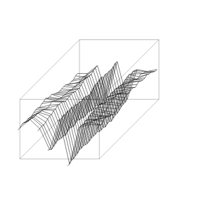
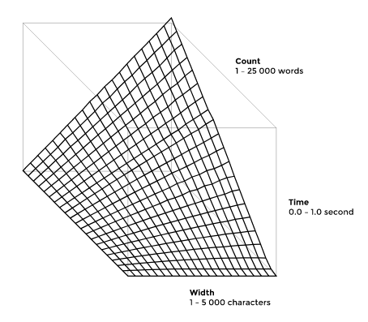
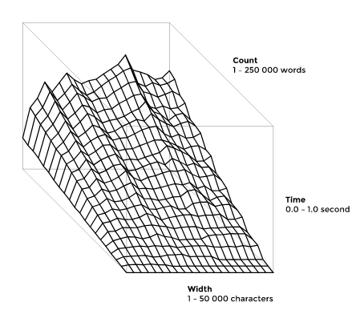

Line breaking — Xxyxyz

# Line breaking

Line breaking, also known as word wrapping or paragraph formation, is the problem of dividing a text into a sequence of lines so that every line spans at most some fixed width.

One way of solving the problem is to gradually form the lines word by word. In the case the concatenating of one more word to a line would exceed its prescribed width, simply move the word to the next line and continue from there. While such greedy algorithm is both simple and fast, it may leave too much whitespace at the end of a line. The reasoning against such visual disparities is that they capture attention and therefore alter the reading in arbitrary way. In other words, it might be advantageous not to make use of the full line width now, as it might help to even out some lines later. Consider the following examples:

	---------
	a b c d e
	f g h i j
	k l m n o
	p
	qqqqqqqqq

and

	---------
	a b c d
	e f g h
	i j k l
	m n o p
	qqqqqqqqq

To counter the wildly different line lengths one could measure the cost of breaking a line in a particular way and penalize the huge gaps much more than the smaller ones. The idea then is to come up with a configuration of line breaks which minimizes the total sum of such penalties, a strategy know as "minimum raggedness". A line exceeding the allowed width should incur an infinitely large penalty; otherwise the cost should follow a quickly growing function, such as the squared size of the gap.

As a side note, line breaking defined as above is a special case of the "least weight subsequence" problem.

The words used in the diagrams were of length 1 and the time values are the best of 10 runs under PyPy 2.1.

#### Brute force

An immediate approach is to try to search trough all the possible break configurations and return the best one. Since any two consecutive words might get split up by a break, there are order of O(2 ^ n) alternatives. Consequently, it is not feasible to form a paragraph of more than 30 - 40 words.

	from itertools import combinations, chain

	def powerset(iterable):
	    s = list(iterable)
	    return chain.from_iterable(combinations(s, r) for r in range(len(s)+1))

	def naive(text, width):
	    words = text.split()
	    count = len(words)

	    minimum = 10 ** 20
	    breaks = ()
	    for b in powerset(range(1, count)):
	        m = 0
	        i = 0
	        for j in chain(b, (count,)):
	            w = len(' '.join(words[i:j]))
	            if w > width:
	                break
	            m += (width - w) ** 2
	            i = j
	        else:
	            if m < minimum:
	                minimum = m
	                breaks = b

	    lines = []
	    i = 0
	    for j in chain(breaks, (count,)):
	        lines.append(' '.join(words[i:j]))
	        i = j
	    return lines

#### Dynamic programming

The deficiency of first idea lies in that it repeatedly solves the same subproblems. Yet suppose there was an optimal configuration of lines. Plucking off its last line would still keep the layout optimal because otherwise it would be possible to improve it and, together with the removed line, would result in even better configuration, contradicting its optimality. To solve each subproblem just once, it is then necessary to find out and later re-use which of the lines ending with some word contributes least to the overall cost. As each of the "n" words could terminate at most "n" potential lines, the algorithm runs in O(n ^ 2).

	def dynamic(text, width):
	    words = text.split()
	    count = len(words)
	    slack = [[0] * count for i in range(count)]
	    for i in range(count):
	        slack[i][i] = width - len(words[i])
	        for j in range(i + 1, count):
	            slack[i][j] = slack[i][j - 1] - len(words[j]) - 1

	    minima = [0] + [10 ** 20] * count
	    breaks = [0] * count
	    for j in range(count):
	        i = j
	        while i >= 0:
	            if slack[i][j] < 0:
	                cost = 10 ** 10
	            else:
	                cost = minima[i] + slack[i][j] ** 2
	            if minima[j + 1] > cost:
	                minima[j + 1] = cost
	                breaks[j] = i
	            i -= 1

	    lines = []
	    j = count
	    while j > 0:
	        i = breaks[j - 1]
	        lines.append(' '.join(words[i:j]))
	        j = i
	    lines.reverse()
	    return lines

#### Shortest path

The previous way can be sped up even further: the length offsets used to calculate any line length in constant time can easily be pre-processed in O(n), rather than O(n ^ 2), and there is no point in putting ever more words on a line once it reaches the allowed width. The performance then improves down to O(n * width).

This is exactly the same result as if the text was thought of as a (topologically sorted) directed acyclic graph, with the nodes and arcs representing words and breaks, respectively. By substituting the penalties for the weights, the problem becomes the one of finding the shortest path which is known to be solvable in linear time. Note that the number of edges remains O(n * width).

Flat uses the latter method.

	def shortest(text, width):
	    words = text.split()
	    count = len(words)
	    offsets = [0]
	    for w in words:
	        offsets.append(offsets[-1] + len(w))

	    minima = [0] + [10 ** 20] * count
	    breaks = [0] * (count + 1)
	    for i in range(count):
	        j = i + 1
	        while j <= count:
	            w = offsets[j] - offsets[i] + j - i - 1
	            if w > width:
	                break
	            cost = minima[i] + (width - w) ** 2
	            if cost < minima[j]:
	                minima[j] = cost
	                breaks[j] = i
	            j += 1

	    lines = []
	    j = count
	    while j > 0:
	        i = breaks[j]
	        lines.append(' '.join(words[i:j]))
	        j = i
	    lines.reverse()
	    return lines

#### Binary search

The method using dynamic programming can be written as two nested loops: the outer one iterates over every word and the inner one searches for the most suitable break. Hirschberg and Larmore showed in 1987 an algorithm which is able to use binary search instead of the inner loop in the case the weight function is "concave". It turns out that the penalty discussed thus far can be made to satisfy this property by handling the "infinities" slightly differently, giving an overall time of O(n * log n). A similar algorithm due to Galil and Giancarlo from 1989 is given below.

The concave property says: w(i, j) + w(i', j') <= w(i', j) + w(i, j'), where i < i' < j < j'.

	from collections import deque

	def binary(text, width):
	    words = text.split()
	    count = len(words)
	    offsets = [0]
	    for w in words:
	        offsets.append(offsets[-1] + len(w))

	    minima = [0] * (count + 1)
	    breaks = [0] * (count + 1)

	    def c(i, j):
	        w = offsets[j] - offsets[i] + j - i - 1
	        if w > width:
	            return 10 ** 10 * (w - width)
	        return minima[i] + (width - w) ** 2

	    def h(l, k):
	        low, high = l + 1, count
	        while low < high:
	            mid = (low + high) // 2
	            if c(l, mid) <= c(k, mid):
	                high = mid
	            else:
	                low = mid + 1
	        if c(l, high) <= c(k, high):
	            return high
	        return l + 2

	    q = deque([(0, 1)])
	    for j in range(1, count + 1):
	        l = q[0][0]
	        if c(j - 1, j) <= c(l, j):
	            minima[j] = c(j - 1, j)
	            breaks[j] = j - 1
	            q.clear()
	            q.append((j - 1, j + 1))
	        else:
	            minima[j] = c(l, j)
	            breaks[j] = l
	            while c(j - 1, q[-1][1]) <= c(q[-1][0], q[-1][1]):
	                q.pop()
	            q.append((j - 1, h(j - 1, q[-1][0])))
	            if j + 1 == q[1][1]:
	                q.popleft()
	            else:
	                q[0] = q[0][0], (q[0][1] + 1)

	    lines = []
	    j = count
	    while j > 0:
	        i = breaks[j]
	        lines.append(' '.join(words[i:j]))
	        j = i
	    lines.reverse()
	    return lines

#### Total monotonicity

Each iteration of the dynamic programming scheme can also be seen as filling in a matrix, where a cell adds up the least overall cost to a subproblem (a column minimum) and a penalty. A concave weight function implies that the matrix is totally monotone and in 1987 Shor, Moran, Aggarwal, Wilber and Klawe devised an algorithm which finds the row maxima of such matrix in linear time. Even though SMAWK can be modified to find column minima instead, it is not possible to apply it directly to this "on-line" matrix as it might try to evaluate a not "available" cell, i.e. a cell dependent on some yet unknown column minimum. However, Wilber came up with an algorithm in 1988 which "pretends" to know the minima and still runs in O(n) time. An "ordered" algorithm which obeys the availability of the matrix as presented by Aggarwal and Tokuyama in 1998 follows.

	def linear(text, width):
	    words = text.split()
	    count = len(words)
	    offsets = [0]
	    for w in words:
	        offsets.append(offsets[-1] + len(w))

	    minima = [0] + [10 ** 20] * count
	    breaks = [0] * (count + 1)

	    def cost(i, j):
	        w = offsets[j] - offsets[i] + j - i - 1
	        if w > width:
	            return 10 ** 10 * (w - width)
	        return minima[i] + (width - w) ** 2

	    def smawk(rows, columns):
	        stack = []
	        i = 0
	        while i < len(rows):
	            if stack:
	                c = columns[len(stack) - 1]
	                if cost(stack[-1], c) < cost(rows[i], c):
	                    if len(stack) < len(columns):
	                        stack.append(rows[i])
	                    i += 1
	                else:
	                    stack.pop()
	            else:
	                stack.append(rows[i])
	                i += 1
	        rows = stack

	        if len(columns) > 1:
	            smawk(rows, columns[1::2])

	        i = j = 0
	        while j < len(columns):
	            if j + 1 < len(columns):
	                end = breaks[columns[j + 1]]
	            else:
	                end = rows[-1]
	            c = cost(rows[i], columns[j])
	            if c < minima[columns[j]]:
	                minima[columns[j]] = c
	                breaks[columns[j]] = rows[i]
	            if rows[i] < end:
	                i += 1
	            else:
	                j += 2

	    n = count + 1
	    i = 0
	    offset = 0
	    while True:
	        r = min(n, 2 ** (i + 1))
	        edge = 2 ** i + offset
	        smawk(range(0 + offset, edge), range(edge, r + offset))
	        x = minima[r - 1 + offset]
	        for j in range(2 ** i, r - 1):
	            y = cost(j + offset, r - 1 + offset)
	            if y <= x:
	                n -= j
	                i = 0
	                offset += j
	                break
	        else:
	            if r == n:
	                break
	            i = i + 1

	    lines = []
	    j = count
	    while j > 0:
	        i = breaks[j]
	        lines.append(' '.join(words[i:j]))
	        j = i
	    lines.reverse()
	    return lines

#### Divide & conquer

One additional option is to replace the preceding SMAWK routine and its fairly large constant factor by a simple divide & conquer monotone matrix search. The complexity will drop back to O(n * log n) but for smaller problem instances it may actually run faster than the asymptotically superior approach.

	def divide(text, width):
	    words = text.split()
	    count = len(words)
	    offsets = [0]
	    for w in words:
	        offsets.append(offsets[-1] + len(w))

	    minima = [0] + [10 ** 20] * count
	    breaks = [0] * (count + 1)

	    def cost(i, j):
	        w = offsets[j] - offsets[i] + j - i - 1
	        if w > width:
	            return 10 ** 10
	        return minima[i] + (width - w) ** 2

	    def search(i0, j0, i1, j1):
	        stack = [(i0, j0, i1, j1)]
	        while stack:
	            i0, j0, i1, j1 = stack.pop()
	            if j0 < j1:
	                j = (j0 + j1) // 2
	                for i in range(i0, i1):
	                    c = cost(i, j)
	                    if c <= minima[j]:
	                        minima[j] = c
	                        breaks[j] = i
	                stack.append((breaks[j], j+1, i1, j1))
	                stack.append((i0, j0, breaks[j]+1, j))

	    n = count + 1
	    i = 0
	    offset = 0
	    while True:
	        r = min(n, 2 ** (i + 1))
	        edge = 2 ** i + offset
	        search(0 + offset, edge, edge, r + offset)
	        x = minima[r - 1 + offset]
	        for j in range(2 ** i, r - 1):
	            y = cost(j + offset, r - 1 + offset)
	            if y <= x:
	                n -= j
	                i = 0
	                offset += j
	                break
	        else:
	            if r == n:
	                break
	            i = i + 1

	    lines = []
	    j = count
	    while j > 0:
	        i = breaks[j]
	        lines.append(' '.join(words[i:j]))
	        j = i
	    lines.reverse()
	    return lines

#### Further reading

D. E. Knuth, M. F. Plass. Breaking Paragraphs into Lines. Software--Practice and Experience 11, 1981.

D. S. Hirschberg, L. L. Larmore. The least weight subsequence problem. SIAM Journal on Computing, 1987.

D. S. Hirschberg, L. L. Larmore. New applications of failure functions. Journal of the Association for Computer Machinery, 1987.

A. Aggarwal, M. M. Klawe, S. Moran, P. Shor, R. Wilber. Geometric Applications of a Matrix-Searching Algorithm. Algorithmica 2, 1987.

R. Wilber. The Concave Least-Weight Subsequence Problem Revisited. Journal of Algorithms 9, 1988.

Z. Galil, R. Giancarlo. Speeding up dynamic programming with applications to molecular biology. Theoretical Computer Science 64, 1989.

Z. Galil, K. Park. A Linear-Time Algorithm for Concave One-Dimensional Dynamic Programming. Information Processing Letters 33, 1989.

D. Eppstein. Sequence comparison with mixed convex and concave costs. Journal of Algorithms 11, 1990.

D. Eppstein, Z. Galil, R. Giancarlo, G. F. Italiano. Sparse dynamic programming II: Convex and concave cost functions. Journal of the ACM, 1992.

P. Becker. Construction of Nearly Optimal Multiway Trees. COCOON, vol. 1276 of Lecture Notes in Computer Science, 1997.

O. de Moor, J. Gibbons. Bridging the Algorithm Gap: A Linear-time Functional Program for Paragraph Formatting. Technical Report, Oxford Brookes University, 1997.

A. Aggarwal, T. Tokuyama. Consecutive interval query and dynamic programming on intervals. Discrete Applied Mathematics 85, 1998.

— 21. 2. 2014