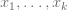
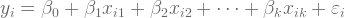
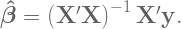
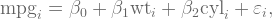
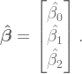
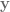

Linear regression by hand

# Linear regression by hand

> … most companies would be taking a huge step forward if they got somebody who knows how to do linear regression.

> — > [> Hacker News user ‘mindcrime’ on the necessary skills for data science](https://news.ycombinator.com/item?id=14772549)

When you have  predictors of a scalar-valued outcome  with observations indexed by  and residuals denoted , a model of the form

or (equivalently) in matrix notation

is best[1] estimated using [ordinary least squares](https://en.wikipedia.org/wiki/Ordinary_least_squares), the workhorse of linear regression. The underlying math is a fair bit of matrix algebra which, when all is said and done, returns

**This was the one equation my graduate school program director urged every student to know by heart.**

*X prime X inverse X prime y*, “prime” meaning [transpose](http://mathworld.wolfram.com/Transpose.html), yields OLS estimates of linear regression coefficients. On the left-hand side, the hat symbol denotes an estimate from a sample as opposed to a true value in the population.

We can walk through a real-data example using `mtcars`, an automobile-themed dataset built into R. Regressing fuel economy (mpg) on weight (wt) and number of cylinders (cyl),

by
1
[object Object][object Object][object Object][object Object]
will give you

Estimate Std. Error t value Pr(>|t|) (Intercept) 39.6863 1.7150 23.141 < 2e-16 ***

wt -3.1910 0.7569 -4.216 0.000222 ***
cyl -1.5078 0.4147 -3.636 0.001064 **

wherein the estimates (first column of numbers) from top to bottom correspond to

Per the foregoing all-important equation, only two objects are necessary to compute the estimates manually: (1) the matrix  and (2) the vector . Both are easy to extract from `mtcars`.

1
2
3
4
5
6
7
8
9
10
11
[object Object]
[object Object][object Object][object Object]
[object Object]
[object Object]
[object Object]

[object Object][object Object][object Object][object Object][object Object][object Object][object Object][object Object][object Object]

[object Object][object Object][object Object][object Object]
[object Object]
[object Object][object Object][object Object]

Given [\mathbf{X}](../_resources/8d70960ca5e6e38556ed93bc3f5efcd1.png) and , all that’s left are matrix operations. Mathematically they are described in [this tutorial from Harvey Mudd College](https://www.math.hmc.edu/calculus/tutorials/matrixalgebra/). Computationally, `t()` transposes, `solve()` inverts, and `%*%` multiplies matrices.

Now for the moment of truth—*X prime X inverse X prime y*.
1

[object Object][object Object][object Object][object Object][object Object][object Object]

[,1]
1 39.686261
wt -3.190972
cyl -1.507795

This formula doesn’t get us *p*-values [but who needs those anyway](https://www.nature.com/news/psychology-journal-bans-p-values-1.17001).

* * *

[1] OLS is BLUE—the [best linear unbiased estimator](https://en.wikipedia.org/wiki/Gauss%E2%80%93Markov_theorem)—under certain assumptions that are very important but beyond the scope of this post.