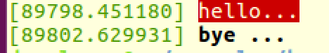

Linux Kernel Development and Writing a Simple Kernel Module – Developers Area

## [Linux Kernel Development and Writing a Simple Kernel Module](https://devarea.com/linux-kernel-development-and-writing-a-simple-kernel-module/)

By [Liran B.H](https://devarea.com/author/liran/) | [March 5, 2018](https://devarea.com/2018/03/05/) | [20 Comments](https://devarea.com/linux-kernel-development-and-writing-a-simple-kernel-module/#comments) | [Linux](https://devarea.com/category/linux/)

 AddThis Sharing Buttons

[Share to Facebook%3b width: 16px%3b height: 16px%3b' class='at-icon at-icon-facebook js-evernote-checked' data-evernote-id='1297'%3e%3ctitle id='at-svg-facebook-1' data-evernote-id='1449' class='js-evernote-checked'%3eFacebook%3c/title%3e%3cg data-evernote-id='1450' class='js-evernote-checked'%3e%3cpath d='M22 5.16c-.406-.054-1.806-.16-3.43-.16-3.4 0-5.733 1.825-5.733 5.17v2.882H9v3.913h3.837V27h4.604V16.965h3.823l.587-3.913h-4.41v-2.5c0-1.123.347-1.903 2.198-1.903H22V5.16z' fill-rule='evenodd' data-evernote-id='1451' class='js-evernote-checked'%3e%3c/path%3e%3c/g%3e%3c/svg%3e)Facebook]()[Share to Twitter%3b width: 16px%3b height: 16px%3b' class='at-icon at-icon-twitter js-evernote-checked' data-evernote-id='1298'%3e%3ctitle id='at-svg-twitter-2' data-evernote-id='1455' class='js-evernote-checked'%3eTwitter%3c/title%3e%3cg data-evernote-id='1456' class='js-evernote-checked'%3e%3cpath d='M27.996 10.116c-.81.36-1.68.602-2.592.71a4.526 4.526 0 0 0 1.984-2.496 9.037 9.037 0 0 1-2.866 1.095 4.513 4.513 0 0 0-7.69 4.116 12.81 12.81 0 0 1-9.3-4.715 4.49 4.49 0 0 0-.612 2.27 4.51 4.51 0 0 0 2.008 3.755 4.495 4.495 0 0 1-2.044-.564v.057a4.515 4.515 0 0 0 3.62 4.425 4.52 4.52 0 0 1-2.04.077 4.517 4.517 0 0 0 4.217 3.134 9.055 9.055 0 0 1-5.604 1.93A9.18 9.18 0 0 1 6 23.85a12.773 12.773 0 0 0 6.918 2.027c8.3 0 12.84-6.876 12.84-12.84 0-.195-.005-.39-.014-.583a9.172 9.172 0 0 0 2.252-2.336' fill-rule='evenodd' data-evernote-id='1457' class='js-evernote-checked'%3e%3c/path%3e%3c/g%3e%3c/svg%3e)Twitter]()[Share to More%3b width: 16px%3b height: 16px%3b' class='at-icon at-icon-addthis js-evernote-checked' data-evernote-id='1299'%3e%3ctitle id='at-svg-addthis-3' data-evernote-id='1461' class='js-evernote-checked'%3eAddThis%3c/title%3e%3cg data-evernote-id='1462' class='js-evernote-checked'%3e%3cpath d='M18 14V8h-4v6H8v4h6v6h4v-6h6v-4h-6z' fill-rule='evenodd' data-evernote-id='1463' class='js-evernote-checked'%3e%3c/path%3e%3c/g%3e%3c/svg%3e)More]()

This post is the first post in linux kernel series. Writing code to run in the kernel is different from user application. While developing in the kernel, you don’t write code from scratch, you need to implement one or more interfaces and register your implementation within the a kernel subsystem.

## Kernel Interfaces

The kernel is written in C , so create an interface we use a structure with function pointers

|     |     |
| --- | --- |
| 1 2 3 4 5 6 | struct  somedevice  {       int  (*fn1)(int,int);       void  (*fn2)(int);       int  (*fn3)(void);       .... }; |

Also, the subsystem provides a function(s) that accept that interface and register it as a new object in the kernel:

|     |     |
| --- | --- |
| 1   | int  register_somedevice(struct  somedevice  *device); |

You need to implement some functions from the interface (usually not all) and create an object from the structure, initialize it with the functions and send it to the register_xxx function.

## Simple Example – Real Time Clock

To add a new real time clock to the kernel, you need to implement the following interface (taken from rtc.h)

|     |     |
| --- | --- |
| 1 2 3 4 5 6 7 8 9 10 11 12 13 14 | struct  rtc_class_ops  { int  (*ioctl)(struct  device  *,  unsigned  int,  unsigned  long); int  (*read_time)(struct  device  *,  struct  rtc_time  *); int  (*set_time)(struct  device  *,  struct  rtc_time  *); int  (*read_alarm)(struct  device  *,  struct  rtc_wkalrm  *); int  (*set_alarm)(struct  device  *,  struct  rtc_wkalrm  *); int  (*proc)(struct  device  *,  struct  seq_file  *); int  (*set_mmss64)(struct  device  *,  time64_t secs); int  (*set_mmss)(struct  device  *,  unsigned  long  secs); int  (*read_callback)(struct  device  *,  int  data); int  (*alarm_irq_enable)(struct  device  *,  unsigned  int  enabled); int  (*read_offset)(struct  device  *,  long  *offset); int  (*set_offset)(struct  device  *,  long  offset); }; |

The minimum implementation is read_time and set_time, use the examples from the source (drivers/rtc) to find it.

To register a new Real time clock, call the function:

|     |     |
| --- | --- |
| 1 2 3 4 | struct  rtc_device  *rtc_device_register(const  char  *name,                                        struct  device  *dev,                                        const  struct  rtc_class_ops  *ops,                                        struct  module  *owner) |

So to implement a new RTC in linux create 2 functions for read_time and set_time , declare a structure object and call rtc_device_register:

|     |     |
| --- | --- |
| 1 2 3 4 5 6 7 8 9 10 11 12 13 14 15 16 17 18 19 20 21 22 23 24 25 26 27 28 29 30 31 32 33 34 35 36 37 38 39 40 41 42 43 | static  int  my_rtc_read_time(struct  device  *dev,  struct  rtc_time  *tm) { tm->tm_sec  =  ...  *// read from the hardware* tm->tm_min  =  ...  *// and fill this structure* tm->tm_hour  =  ... tm->tm_wday  =  ... tm->tm_mday  =  ... tm->tm_mon  =  ... tm->tm_year  =  ... return  rtc_valid_tm(tm); } static  int  my_rtc_set_time(struct  device  *dev,  struct  rtc_time  *tm) {         *// map hwregs to the RTC hardware registers * hwregs.tsec  =  ... hwregs.sec  =  ... hwregs.min  =  ... hwregs.hour  =  ... regs.wday  =  ... regs.month  =  ... regs.year  =  ...; return  0; } static  const  struct  rtc_class_ops my_ops  =  { .read_time=  my_rtc_read_time, .set_time=  my_rtc_set_time, }; int  some_init_function(void) { .... ....   res  =  rtc_device_register(  "myrtc",  NULL,  &my_ops,  THIS_MODULE); } |

As you can see the task is simple, write some functions , implement them like everyone does (look at the source for many examples) , create an interface object and call the register function

When you write a kernel module it can be:

- Device driver
- Network module
- File system
- Security module
- and more …

It doesn’t matter what you want to write, its always the same process: implement one or more interfaces and register it using functions provided by the sub system. Most of the times, you will find some documentation files in /Documentation folder and the key point to success is – **USE THE SOURCE CODE – **you can find many working examples in the code – use it

## Writing a Simple Module

As mentioned above, after implementing an interface, we need to register it with the system. To do that we need a code that runs on init.

The simplest module must declare 2 functions – on for init and one for exit. The module can be loaded with the kernel on startup (and unloaded on shutdown) or explicitly using insmod command (and rmmod for unload) – this is called a Loadable Kernel Module

The simplest module looks like this:
**simp.c**

|     |     |
| --- | --- |
| 1 2 3 4 5 6 7 8 9 10 11 12 13 14 15 16 17 18 19 20 21 | #include <linux/module.h> #include <linux/moduleparam.h> #include <linux/init.h> #include <linux/kernel.h> MODULE_LICENSE("Dual BSD/GPL"); MODULE_AUTHOR("Liran B.H"); static  int  simple_init(void) { printk(KERN_ALERT  "hello...\n"); return  0; } static  void  simple_cleanup(void) { printk(KERN_WARNING  "bye ...\n"); } module_init(simple_init); module_exit(simple_cleanup); |

The module declares 2 functions

- simple_init – runs when we use insmod command
- simple_cleanup – runs we use rmmod command

Both functions use printk – to write a message to the kernel log
To build the module we need the following **Makefile**:

|     |     |
| --- | --- |
| 1 2 3 4 5 6 7 8 9 10 11 12 | obj-m:=  simp.o KERNELDIR  ?=  /lib/modules/$(shell uname  -r)/build PWD       :=  $(shell pwd) all:  default default: $(MAKE)  -C  $(KERNELDIR)  M=$(PWD)  modules clean: rm  -rf *.o *~  core  .depend  .*.cmd *.ko *.mod.c  .tmp_versions |

On any linux distribution , you will find the kernel Makefile and headers in /lib/modules/[version]/build

Our Makefile calls the kernel one to build the module. run make in the directory and it will build **simp.ko** file

To load the module to the kernel use:

|     |     |
| --- | --- |
| 1   | # sudo insmod ./simp.ko |

To see the kernel log use dmesg

|     |     |
| --- | --- |
| 1 2 | # dmesg \| tail -1 [89087.329507]  hello... |

To unload the module use rmmod command:

|     |     |
| --- | --- |
| 1   | # sudo rmmod simp |

And again, you will see the output in the kernel log using dmesg command

## printk function

printk write message to the kernel log.

The printk function is similar to stdlib’s printf(3) but No floating point format.

Log message are prefixed with a “<0>” , where the number denotes severity, from 0 (most severe) to 7.

Macros are defined to be used for severity levels: KERN_EMERG, KERN_ALERT, KERT_CRIT, KERN_ERR, KERN_WARNING, KERN_NOTICE, KERN_INFO, KERN_DEBUG

For example

|     |     |
| --- | --- |
| 1   | printk(KERN_ALERT  "hello...\n"); |

is simply writing <1>hello to the kernel log

if you run dmesg on ubuntu you will see that the output is coloured different for the init and exit functions:

Thats because we logged the init message with ALERT and the cleanup with WARNING

You can control the display filter to the system console using the file /proc/sys/kernel/printk

 AddThis Sharing Buttons

[Share to Facebook%3b width: 16px%3b height: 16px%3b' class='at-icon at-icon-facebook js-evernote-checked' data-evernote-id='1300'%3e%3ctitle id='at-svg-facebook-4' data-evernote-id='1563' class='js-evernote-checked'%3eFacebook%3c/title%3e%3cg data-evernote-id='1564' class='js-evernote-checked'%3e%3cpath d='M22 5.16c-.406-.054-1.806-.16-3.43-.16-3.4 0-5.733 1.825-5.733 5.17v2.882H9v3.913h3.837V27h4.604V16.965h3.823l.587-3.913h-4.41v-2.5c0-1.123.347-1.903 2.198-1.903H22V5.16z' fill-rule='evenodd' data-evernote-id='1565' class='js-evernote-checked'%3e%3c/path%3e%3c/g%3e%3c/svg%3e)Facebook]()[Share to Twitter%3b width: 16px%3b height: 16px%3b' class='at-icon at-icon-twitter js-evernote-checked' data-evernote-id='1301'%3e%3ctitle id='at-svg-twitter-5' data-evernote-id='1569' class='js-evernote-checked'%3eTwitter%3c/title%3e%3cg data-evernote-id='1570' class='js-evernote-checked'%3e%3cpath d='M27.996 10.116c-.81.36-1.68.602-2.592.71a4.526 4.526 0 0 0 1.984-2.496 9.037 9.037 0 0 1-2.866 1.095 4.513 4.513 0 0 0-7.69 4.116 12.81 12.81 0 0 1-9.3-4.715 4.49 4.49 0 0 0-.612 2.27 4.51 4.51 0 0 0 2.008 3.755 4.495 4.495 0 0 1-2.044-.564v.057a4.515 4.515 0 0 0 3.62 4.425 4.52 4.52 0 0 1-2.04.077 4.517 4.517 0 0 0 4.217 3.134 9.055 9.055 0 0 1-5.604 1.93A9.18 9.18 0 0 1 6 23.85a12.773 12.773 0 0 0 6.918 2.027c8.3 0 12.84-6.876 12.84-12.84 0-.195-.005-.39-.014-.583a9.172 9.172 0 0 0 2.252-2.336' fill-rule='evenodd' data-evernote-id='1571' class='js-evernote-checked'%3e%3c/path%3e%3c/g%3e%3c/svg%3e)Twitter]()[Share to More%3b width: 16px%3b height: 16px%3b' class='at-icon at-icon-addthis js-evernote-checked' data-evernote-id='1302'%3e%3ctitle id='at-svg-addthis-6' data-evernote-id='1575' class='js-evernote-checked'%3eAddThis%3c/title%3e%3cg data-evernote-id='1576' class='js-evernote-checked'%3e%3cpath d='M18 14V8h-4v6H8v4h6v6h4v-6h6v-4h-6z' fill-rule='evenodd' data-evernote-id='1577' class='js-evernote-checked'%3e%3c/path%3e%3c/g%3e%3c/svg%3e)More]()

Tagged [Linux](https://devarea.com/tag/linux/)

## Post navigation

[← Makefiles Tutorial](https://devarea.com/makefiles-tutorial/)

[Porting Python 2 Code to Python 3  →](https://devarea.com/porting-python-2-code-to-python-3/)

## 20 thoughts on “Linux Kernel Development and Writing a Simple Kernel Module”

1. [Linux Kernel Development – Kernel Module Parameters – Developers Area](https://devarea.com/linux-kernel-development-kernel-module-parameters/)

[…] the previous post , I covered the basics of kernel development with a simple example of loadable kernel module that […]

[March 12, 2018](https://devarea.com/linux-kernel-development-and-writing-a-simple-kernel-module/#comment-799)

  - [Reply](https://devarea.com/linux-kernel-development-and-writing-a-simple-kernel-module/?replytocom=799#respond)

2. [Ciro Santilli](http://www.cirosantilli.com/)

Good article! Readers might also be interested in this Github repository: https://github.com/cirosantilli/linux-kernel-module-cheat/tree/e8f09a76e6b40f61f4b445a40eb28eb4f36a7392/kernel_module which contains dosens of kernel module examples, userland tests, and a highly automated virtual machine setup.

[March 15, 2018](https://devarea.com/linux-kernel-development-and-writing-a-simple-kernel-module/#comment-837)

  - [Reply](https://devarea.com/linux-kernel-development-and-writing-a-simple-kernel-module/?replytocom=837#respond)

3. [Linux Kernel Development – Creating a Proc file and Interfacing With User Space – Developers Area](https://devarea.com/linux-kernel-development-creating-a-proc-file-and-interfacing-with-user-space/)

[…] The first post we built a Simple Kernel Module with init and exit functions and covered the basic concepts in kernel […]

[March 20, 2018](https://devarea.com/linux-kernel-development-and-writing-a-simple-kernel-module/#comment-918)

  - [Reply](https://devarea.com/linux-kernel-development-and-writing-a-simple-kernel-module/?replytocom=918#respond)

4. [Introduction To Network Filters – Linux – Developers Area](https://devarea.com/introduction-to-network-filters-linux/)

[…] The post assumes you know how to write and load a simple kernel module , if not start with this post […]

[March 31, 2019](https://devarea.com/linux-kernel-development-and-writing-a-simple-kernel-module/#comment-4559)

  - [Reply](https://devarea.com/linux-kernel-development-and-writing-a-simple-kernel-module/?replytocom=4559#respond)

5. josephin jose

I think this is an informative post and knowledgeable. Thank you for sharing this wonderful post! I’m glad that I came across your article.

[September 13, 2019](https://devarea.com/linux-kernel-development-and-writing-a-simple-kernel-module/#comment-8335)

  - [Reply](https://devarea.com/linux-kernel-development-and-writing-a-simple-kernel-module/?replytocom=8335#respond)

6. [New top story on Hacker News: Linux Kernel Development and Writing a Simple Kernel Module – News search India](https://newsindia2world.wordpress.com/2020/03/15/new-top-story-on-hacker-news-linux-kernel-development-and-writing-a-simple-kernel-module/)

[…] Linux Kernel Development and Writing a Simple Kernel Module 3 by whack | 0 comments on Hacker News. […]

[March 14, 2020](https://devarea.com/linux-kernel-development-and-writing-a-simple-kernel-module/#comment-9518)

  - [Reply](https://devarea.com/linux-kernel-development-and-writing-a-simple-kernel-module/?replytocom=9518#respond)

7. [New top story on Hacker News: Linux Kernel Development and Writing a Simple Kernel Module – protipsss](https://protipsss.wordpress.com/2020/03/15/new-top-story-on-hacker-news-linux-kernel-development-and-writing-a-simple-kernel-module/)

[…] Linux Kernel Development and Writing a Simple Kernel Module 3 by whack | 0 comments on Hacker News. […]

[March 14, 2020](https://devarea.com/linux-kernel-development-and-writing-a-simple-kernel-module/#comment-9519)

  - [Reply](https://devarea.com/linux-kernel-development-and-writing-a-simple-kernel-module/?replytocom=9519#respond)

8. [New top story on Hacker News: Linux Kernel Development and Writing a Simple Kernel Module – Hckr News](https://hckrnews.wordpress.com/2020/03/15/new-top-story-on-hacker-news-linux-kernel-development-and-writing-a-simple-kernel-module/)

[…] Linux Kernel Development and Writing a Simple Kernel Module 3 by whack | 0 comments on Hacker News. […]

[March 14, 2020](https://devarea.com/linux-kernel-development-and-writing-a-simple-kernel-module/#comment-9520)

  - [Reply](https://devarea.com/linux-kernel-development-and-writing-a-simple-kernel-module/?replytocom=9520#respond)

9. [New top story on Hacker News: Linux Kernel Development and Writing a Simple Kernel Module – Ultimate News](https://ultimatenews1.wordpress.com/2020/03/15/new-top-story-on-hacker-news-linux-kernel-development-and-writing-a-simple-kernel-module/)

[…] Linux Kernel Development and Writing a Simple Kernel Module 4 by whack | 0 comments on Hacker News. […]

[March 14, 2020](https://devarea.com/linux-kernel-development-and-writing-a-simple-kernel-module/#comment-9521)

  - [Reply](https://devarea.com/linux-kernel-development-and-writing-a-simple-kernel-module/?replytocom=9521#respond)

10. [New top story on Hacker News: Linux Kernel Development and Writing a Simple Kernel Module – Latest news](https://latestnewsdesign.wordpress.com/2020/03/15/new-top-story-on-hacker-news-linux-kernel-development-and-writing-a-simple-kernel-module/)

[…] Linux Kernel Development and Writing a Simple Kernel Module 4 by whack | 0 comments on Hacker News. […]

[March 14, 2020](https://devarea.com/linux-kernel-development-and-writing-a-simple-kernel-module/#comment-9522)

  - [Reply](https://devarea.com/linux-kernel-development-and-writing-a-simple-kernel-module/?replytocom=9522#respond)

11. [New top story on Hacker News: Linux Kernel Development and Writing a Simple Kernel Module – News about world](https://newsblogie.wordpress.com/2020/03/15/new-top-story-on-hacker-news-linux-kernel-development-and-writing-a-simple-kernel-module/)

[…] Linux Kernel Development and Writing a Simple Kernel Module 7 by whack | 0 comments on Hacker News. […]

[March 14, 2020](https://devarea.com/linux-kernel-development-and-writing-a-simple-kernel-module/#comment-9523)

  - [Reply](https://devarea.com/linux-kernel-development-and-writing-a-simple-kernel-module/?replytocom=9523#respond)

12. [Linux Kernel Development and Writing a Simple Kernel Module – Latest Technology, Gadgets & Sports Updates – 8Trolls](https://8troll.com/linux-kernel-development-and-writing-a-simple-kernel-module/)

[…] Study Extra […]

[March 14, 2020](https://devarea.com/linux-kernel-development-and-writing-a-simple-kernel-module/#comment-9524)

  - [Reply](https://devarea.com/linux-kernel-development-and-writing-a-simple-kernel-module/?replytocom=9524#respond)

13. [Linux Kernel Development and Writing a Simple Kernel Module - Down to the Block](https://downtotheblock.com/linux-kernel-development-and-writing-a-simple-kernel-module/)

[…] This post is the first post in linux kernel series. Writing code to run in the kernel is different from user application. While developing in the kernel, you don’t write code from scratch, you need to implement one or more interfaces and register your impleme… Read More […]

[March 14, 2020](https://devarea.com/linux-kernel-development-and-writing-a-simple-kernel-module/#comment-9525)

  - [Reply](https://devarea.com/linux-kernel-development-and-writing-a-simple-kernel-module/?replytocom=9525#respond)

14. [Linux Kernel Development and Writing a Simple Kernel Module](https://imran.xyz/linux-kernel-development-and-writing-a-simple-kernel-module/)

[…] This post is the first post in linux kernel series. Writing code to run in the kernel is different from user application. While developing in the kernel, you don’t write code from scratch, you need to implement one or more interfaces and register your impleme… Read More […]

[March 14, 2020](https://devarea.com/linux-kernel-development-and-writing-a-simple-kernel-module/#comment-9526)

  - [Reply](https://devarea.com/linux-kernel-development-and-writing-a-simple-kernel-module/?replytocom=9526#respond)

15. [Linux Kernel Development and Writing a Simple Kernel Module - Techie Stuff PR](https://shoppingmoneypr.com/techiestuffpr/linux-kernel-development-and-writing-a-simple-kernel-module/)

[…] This post is the first post in linux kernel series. Writing code to run in the kernel is different from user application. While developing in the kernel, you don’t write code from scratch, you need to implement one or more interfaces and register your impleme… Read More […]

[March 14, 2020](https://devarea.com/linux-kernel-development-and-writing-a-simple-kernel-module/#comment-9527)

  - [Reply](https://devarea.com/linux-kernel-development-and-writing-a-simple-kernel-module/?replytocom=9527#respond)

16. [Linux Kernel Development and Writing a Simple Kernel Module (2018) - Proxap](https://proxap.in/2020/03/15/linux-kernel-development-and-writing-a-simple-kernel-module-2018/)

[…] For complete news please follow article link on whack […]

[March 14, 2020](https://devarea.com/linux-kernel-development-and-writing-a-simple-kernel-module/#comment-9528)

  - [Reply](https://devarea.com/linux-kernel-development-and-writing-a-simple-kernel-module/?replytocom=9528#respond)

17. [Linux Kernel Development and Writing a Simple Kernel Module (2018) - Top Of The World](https://www.ipsy.pro/index.php/2020/03/15/linux-kernel-development-and-writing-a-simple-kernel-module-2018/)

[…] Read More […]

[March 15, 2020](https://devarea.com/linux-kernel-development-and-writing-a-simple-kernel-module/#comment-9530)

  - [Reply](https://devarea.com/linux-kernel-development-and-writing-a-simple-kernel-module/?replytocom=9530#respond)

18. [Linux Kernel Development and Writing a Simple Kernel Module | Zone Of Sales](https://zoneofsales.com/linux-kernel-development-and-writing-a-simple-kernel-module.html)

[…] This post is the first post in linux kernel series. Writing code to run in the kernel is different from user application. While developing in the kernel, you don’t write code from scratch, you need to implement one or more interfaces and register your impleme… Read More […]

[March 15, 2020](https://devarea.com/linux-kernel-development-and-writing-a-simple-kernel-module/#comment-9531)

  - [Reply](https://devarea.com/linux-kernel-development-and-writing-a-simple-kernel-module/?replytocom=9531#respond)

19. [Linux Kernel Development and Writing a Simple Kernel Module – Pipiasi Bogdan](https://pipiasibogdan.ovh/linux-kernel-development-and-writing-a-simple-kernel-module/)

[…] Read More […]

[March 15, 2020](https://devarea.com/linux-kernel-development-and-writing-a-simple-kernel-module/#comment-9532)

  - [Reply](https://devarea.com/linux-kernel-development-and-writing-a-simple-kernel-module/?replytocom=9532#respond)

20. [Linux Kernel Development and Writing a Simple Kernel Module - Lapcity](https://lapc4.com/linux-kernel-development-and-writing-a-simple-kernel-module.html)

[…] This post is the first post in linux kernel series. Writing code to run in the kernel is different from user application. While developing in the kernel, you don’t write code from scratch, you need to implement one or more interfaces and register your impleme… Read More […]

[March 15, 2020](https://devarea.com/linux-kernel-development-and-writing-a-simple-kernel-module/#comment-9533)

  - [Reply](https://devarea.com/linux-kernel-development-and-writing-a-simple-kernel-module/?replytocom=9533#respond)

### Leave a Reply

Your email address will not be published.
Comment
Name
Email