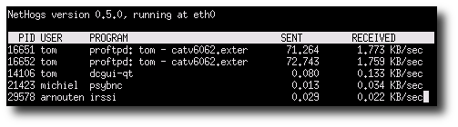
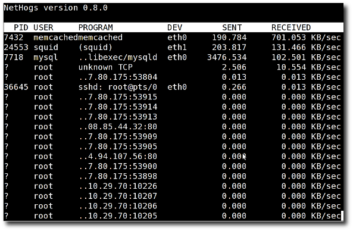

Linux: See Bandwidth Usage Per Process With Nethogs Tool

# Linux: See Bandwidth Usage Per Process With Nethogs Tool

 Posted on [March 7, 2013](https://www.cyberciti.biz/faq/linux-find-out-what-process-is-using-bandwidth/)in Categories [Alpine Linux](https://www.cyberciti.biz/faq/category/alpine-linux/), [CentOS](https://www.cyberciti.biz/faq/category/centos/), [Debian / Ubuntu](https://www.cyberciti.biz/faq/category/debian-ubuntu/), [Fedora Linux](https://www.cyberciti.biz/faq/category/fedora-linux/), [Linux](https://www.cyberciti.biz/faq/category/linux/), [Networking](https://www.cyberciti.biz/faq/category/networking/), [RedHat and Friends](https://www.cyberciti.biz/faq/category/redhat-and-friends/)  last updated May 5, 2017

I have Red Hat Enterprise Linux 6.x/7.x server. How do I find out and groups network bandwidth usage by process under Linux operating systems? How do I know what programs are using network bandwidth under Linux operating systems? How can I see bandwidth usage per PID, command, and user on a Linux operating systems?

You need to use the nethogs command. It is a small “net top” tool. A tool resembling top for network traffic. From the nethogs project home page:

> Instead of breaking the traffic down per protocol or per subnet, like most such tools do, it groups bandwidth by process and does not rely on a special kernel module to be loaded. So if there’s suddenly a lot of network traffic, you can fire up NetHogs and immediately see which PID is causing this, and if it’s some kind of spinning process, kill it.

Please note that this tool **only works under Linux** operating systems.

## Install nethogs on a Debian or Ubuntu Linux

Type the following [apt-get command](https://www.cyberciti.biz/tips/linux-debian-package-management-cheat-sheet.html)/[apt-get command](https://www.cyberciti.biz/tips/linux-debian-package-management-cheat-sheet.html):

 `$ sudo apt-get install nethogs`
Sample outputs:
Reading package lists... Done
Building dependency tree Reading state information... Done
The following packages were automatically installed and are no longer required:
libavutil-extra-51 libggiwmh0-target-x libggi2 libgii1
libvo-aacenc0 libgii1-target-x mplayer-skin-blue libggiwmh0
libggi-target-x libvo-amrwbenc0
Use 'apt-get autoremove' to remove them.
The following NEW packages will be installed:
nethogs
0 upgraded, 1 newly installed, 0 to remove and 4 not upgraded.
Need to get 0 B/28.2 kB of archives.
After this operation, 115 kB of additional disk space will be used.
Selecting previously deselected package nethogs.
(Reading database ... 331881 files and directories currently installed.)
Unpacking nethogs (from .../nethogs_0.7.0-3_amd64.deb) ...
Processing triggers for man-db ...
Setting up nethogs (0.7.0-3) ...

## Install nethogs on a RHEL or CentOS or Fedora Linux

First turn on [EPEL repo](https://www.cyberciti.biz/faq/fedora-sl-centos-redhat6-enable-epel-repo/) and type the following [yum command to install nethogs package](https://www.cyberciti.biz/faq/rhel-centos-fedora-linux-yum-command-howto/):

 `# yum install nethogs`
Sample outputs:

|     |
| --- |
| Loaded plugins: product-id, rhnplugin, security, subscription-manager This system is not registered to Red Hat Subscription Management. You can use subscription-manager to register. This system is receiving updates from RHN Classic or RHN Satellite. rhel-x86_64-server-6 \| 1.5 kB 00:00 rhel-x86_64-server-6/primary \| 13 MB 00:01 rhel-x86_64-server-6  10127/10127rhel-x86_64-server-6-debuginfo \| 1.3 kB 00:00 rhel-x86_64-server-6-debuginfo/primary \| 776 kB 00:00 rhel-x86_64-server-6-debuginfo 4240/4240rhel-x86_64-server-optional-6 \| 1.5 kB 00:00 rhel-x86_64-server-optional-6-debuginfo \| 1.3 kB 00:00 rhel-x86_64-server-supplementary-6 \| 1.5 kB 00:00 Setting up Install Process Resolving Dependencies --> Running transaction check ---> Package nethogs.x86_64 0:0.8.0-1.el6 will be installed --> Finished Dependency Resolution Dependencies Resolved  ===================================================================== Package Arch Version Repository Size=====================================================================Installing: nethogs x86_64 0.8.0-1.el6 epel 28 k Transaction Summary=====================================================================Install 1 Package(s) Total download size: 28 k Installed size: 53 k Is this ok [y/N]: y Downloading Packages: nethogs-0.8.0-1.el6.x86_64.rpm \| 28 kB 00:00 Running rpm_check_debug Running Transaction Test Transaction Test Succeeded Running Transaction Installing : nethogs-0.8.0-1.el6.x86_64 1/1 Verifying : nethogs-0.8.0-1.el6.x86_64 1/1 Installed: nethogs.x86_64 0:0.8.0-1.el6 Complete! |

If you are using Fedora Linux, type:
 `$ sudo dnf install nethogs`

## Install nethogs on an Arch Linux

`$ sudo pacman -S nethogs`

## Install nethogs on an OpenSuse Linux

`# zypper install nethogs`

## How do I use the nethogs command?

The syntax is:

|     |
| --- |
| nethogs nethogs eth1 nethogs [option] eth0 eth1 nethogs [option] eth0 eth1 ppp0sudo  /usr/sbin/nethogs eth0 |

Sample outputs:

Fig.01: nethogs in action

Another output from one of my personal RHEL server:

Fig.02: Nethogs in action on my centos/rhel box

### Keyboard shortcuts

Use the following interactive controls, when nethogs is running:
1. `**m**` : Cycle between display modes (kb/s, kb, b, mb)
2. `**r**` : Sort by received.
3. `**s**` : Sort by sent.
4. `**q**` : Quit and return to the shell prompt.

### Other options

-d delay for refresh rate.
-h display available commands usage.
-p sniff in promiscious mode (not recommended).
-t tracemode.
-V prints Version info.

## Check out related media

This tutorial is also available in a quick video format:

[Linux: Nethogs Tool Find Bandwidth Usage Per Process (PID)](https://www.youtube.com/watch?v=haROZ8adBkE)

 [Video 01: Linux: Nethogs Tool Grouping Bandwidth Usage Per Process (PID)](https://youtu.be/haROZ8adBkE)

##### See also

- [Linux display bandwidth usage on network interface by host](https://www.cyberciti.biz/tips/linux-display-bandwidth-usage-on-network-interface-by-host.html).
- man page – nethogs.
- [Nethogs project](https://nethogs.sourceforge.net/) home page.