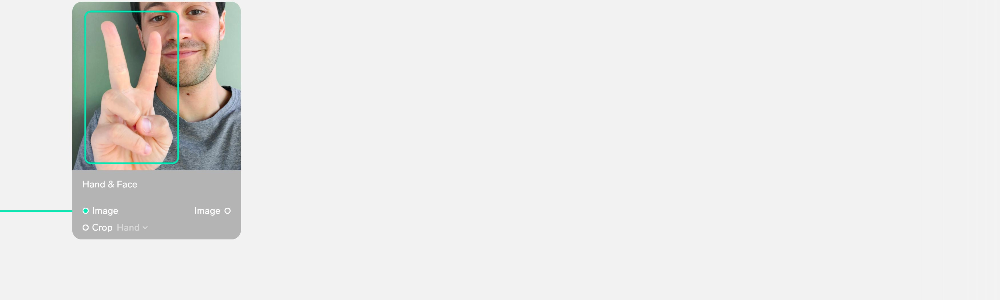
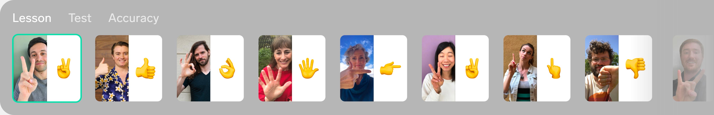
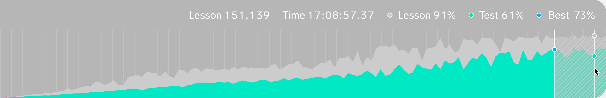
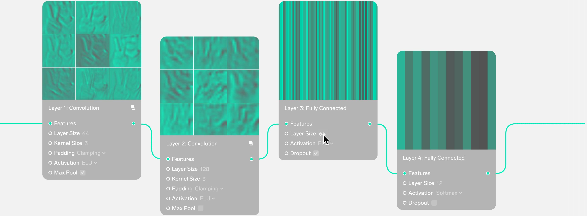
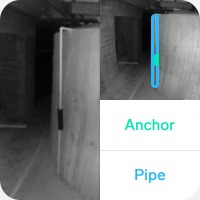
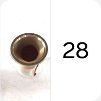
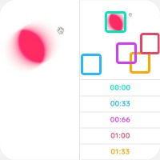
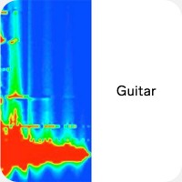

Lobe | Deep Learning Made Simple

Join Beta

[Overview](https://lobe.ai/)[Examples](https://lobe.ai/examples)[About](https://lobe.ai/about)

Teach your app
to
see emotions.
read handwriting.
Build, train, and ship custom deep learning
models using a simple visual interface.
Watch Tour
Join Beta

Drag, drop, learn.

Lobe is an easy-to-use visual tool that lets you build custom deep learning models, quickly train them, and ship them directly in your app without writing any code. Start by dragging in a folder of training examples from your desktop. Lobe automatically builds you a custom deep learning model and begins training. When you’re done, you can export a trained model and ship it directly in your app.

1
Build

Drag in your training data and Lobe automatically builds you a custom deep learning model. Then refine your model by adjusting settings and connecting pre-trained building blocks.

2
Train

Monitor training progress in real-time with interactive charts and test results that update live as your model improves. Cloud training lets you get results quickly, without slowing down your computer.

3
Ship

Export your trained model to TensorFlow or CoreML and run it directly in your app on iOS and Android. Or use the easy-to-use Lobe Developer API and run your model remotely over the air.

Connect together
smart lobes.

Connect together smart building blocks called lobes to quickly create custom deep learning models. For example, connect the Hand & Face lobe to find the most prominent hand in the image. Then connect the Detect Features lobe to find important features in the hand. Finally connect the Generate Labels lobe to predict what emoji is in the image. Refine your model by adjusting each lobes unique settings or go under the hood and edit any lobe’s sub-layers.

Explore your
dataset visually.

Your entire dataset is displayed visually so you can easily browse and sort through all your examples. Select any icon and see how that example is performing in your model. Your dataset is also automatically split into a Lesson, used to teach your model during training, and a Test used to evaluate how your model performs in the real world on new examples it has never seen before.

Real-time
training results.

Super fast cloud training gives you real-time results without bogging down your computer. Interactive charts let you monitor your model’s accuracy and understand how it is improving over time. The best accuracy is automatically selected and saved so you don’t need to worry about overfitting.

Advanced control
over every layer.

Built on top of the deep learning frameworks TensorFlow and Keras, Lobe lets you go under the hood and control every layer of your model. Tune hyperparameters, add layers, and design completely new architectures using hundreds of advanced building block lobes. Watch your model take shape as you visually edit your graph and see your changes take effect right away.

Ship it in your
application.

When your model is done training, it can be exported to TensorFlow or CoreML and run directly in your app. Or with the easy-to-use Lobe Developer API your model can be hosted in the cloud and integrated into your app using the language of your choice. And because Lobe is built on top of industry standards, your model’s performance and compatibility is always uncompromised.

JSON
C
C#
Go
Java
Javascript
Node
OCaml
Objective-C
PHP
Python
Ruby
Shell
Swift
INPUT
POST http://api.lobe.ai/predict?key=987-987-987-987&docID=123-123-123-123

	inputs: {
	  selfie: "base64 image",
	  object: "hand"
	}

OUTPUT

	outputs: {
	  emoji: ✌️,
	  confidences: [(✌️, 0.9), (, 0.05), (, 0.04)]
	}

Examples

[ California Plants](https://lobe.ai/examples/california-plants)

[ Petal Generator](https://lobe.ai/examples/rose-petal-generator)

[ Water Tank](https://lobe.ai/examples/water-tank)

[ 3D Motion](https://lobe.ai/examples/3D-motion)

[ Coffee Weight](https://lobe.ai/examples/coffee-weight)

[ Hand & Face](https://lobe.ai/examples/hand-face-tracker)

[ Physics](https://lobe.ai/examples/physics)

[ Tuner](https://lobe.ai/examples/tuner)
Lobe

[Overview](https://lobe.ai/)[Examples](https://lobe.ai/examples)[About](https://lobe.ai/about)

Info

[Join Beta](https://lobe.ai/signup)[Contact](https://lobe.ai/mailto:info@lobe.ai)[Press Kit](https://www.dropbox.com/sh/psqipzchamejf3g/AABXg_FjS2_BLVNqSBKfN1Toa?dl=0)

Follow
[Twitter](https://twitter.com/lobe_ai)[Facebook](https://facebook.com/lobeai)
Copyright © 2018
Lobe Artificial Intelligence, Inc.
All rights reserved.

Join beta

In order to give everyone a great experience we will be slowly sending out invites to the Lobe beta. Please let us know a bit about how you’d like to use Lobe and we’ll send you an invite as soon as we’re ready for you!

First Name

Last Name

Email
Job Title
Organization Name
Organization Type
Industry
How experienced are you with deep learning?
What do you want to use Lobe for?
Do you already have a dataset?
How would you run Lobe in your app?
Cloud APIiOS CoreMLAndroid TensorFlow
Tell us more about how you’d like to use Lobe:
Request Invite