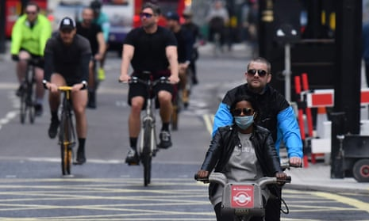

London cycling could increase tenfold after lockdown, says TfL | UK news | The Guardian

[London](https://www.theguardian.com/uk/london)

# London cycling could increase tenfold after lockdown, says TfL

Mayor and agency planning fast-track new cycle routes and wider pavements

- [Coronavirus – latest updates](https://www.theguardian.com/world/series/coronavirus-live/latest)
- [See all our coronavirus coverage](https://www.theguardian.com/world/coronavirus-outbreak)

[Ben Quinn](https://www.theguardian.com/profile/benquinn)

[@BenQuinn75](https://twitter.com/BenQuinn75)

Wed 6 May 2020 18.33 BSTLast modified on Wed 6 May 2020 19.03 BST

- 
- 
- 

Shares

219

The mayor’s office said millions of journeys a day will need to be made by other means with London’s public transport capacity cut to a fifth of pre-crisis levels. Photograph: Justin Tallis/AFP via Getty Images

Cycling in London could increase tenfold and pavements could be widened to allow for [physical distancing](https://www.theguardian.com/world/2020/apr/22/uk-will-need-social-distancing-until-at-least-end-of-year-says-whitty) and queueing outside shops, under plans to overhaul the capital’s streets post-lockdown.

As part of the [London](https://www.theguardian.com/uk/london) Streetscape plans, new walking and cycling routes along major corridors would be fast-tracked , including temporary cycle lanes along routes such as the busy thoroughfare of Euston Road.

City Hall is under pressure to increase tube services but unions have expressed concern about doing so without agreement on protecting the health of passengers and staff.

 Q&A

#### What are the UK government's 'five tests' for ending lockdown restrictions?

    Show

The UK government has said that these five tests have to be met before they will consider easing coronavirus lockdown restrictions:

- The NHS has sufficient capacity to provide critical care and specialist treatment right across the UK
- A sustained and consistent fall in daily deaths from Coronavirus
- Reliable data to show that the rate of infection is decreasing to manageable levels across the board
- Operational challenges including testing and personal protective equipement (PPE) are in hand with supply able to meet future demand
- Confident that any adjustments to the current measures will not risk a second peak of infections that overwhelms the NHS

Was this helpful?

Boris Johnson said at [prime minister’s questions](https://www.theguardian.com/world/2020/may/06/keir-starmer-challenges-pm-boris-johnson-claim-of-coronavirus-success) on Wednesday that a crucial part of efforts to get transport to run safely involved “a bigger and more expansive tube service” so that people could observe physical distancing,

But the office of the London mayor, [Sadiq Khan](https://www.theguardian.com/politics/sadiq-khan), said millions of journeys a day would need to be made by other means, with London’s public transport capacity potentially running at a fifth of pre-crisis levels.

If people were to switch even a small fraction of those journeys to cars, Khan said, London risked grinding to a halt, air quality would worsen and road danger would increase.

The mayor and [Transport](https://www.theguardian.com/uk/transport) for London (TfL) said they would work with boroughs to focus on three areas:

-

The “rapid construction” of a strategic cycling network, using temporary materials, with new routes, aimed at reducing crowding on public transport.

-

A “complete transformation” of local town centres so that people can walk and cycle where possible, including widening footways on high streets so that people can safely queue outside shops.

-

Reducing traffic on residential streets and creating “low-traffic neighbourhoods”.

[TfL](https://www.theguardian.com/uk/tfl) said its modelling suggested there could be a tenfold increase in distances cycled, and up to five times the amount of walking compared with pre-coronavirus levels, if travel demand returned.

Advertisement

Pavements have already been doubled in size at locations such as Camden High Street and Stoke Newington High Street, and widened at six other locations – two in Southwark and one each in Hackney, Lambeth, Hammersmith and Fulham, and Croydon.

Calling on anyone who can work from home to continue to do so, Khan said: “I urge the government and boroughs to work with us to enable Londoners to switch to cleaner, more sustainable forms of transport and reduce the pressure on other parts of our transport network once the lockdown is eased.”

The plans were welcomed by organisations such as Living Streets, a walking charity, which said the pandemic had highlighted the importance that walking plays in people’s lives.

“Where London’s pavements aren’t suitable for safe social distancing, it is vital widening happens to ensure people aren’t forced into the paths of oncoming traffic,” said its director, Stephen Edwards.

However, there was criticism from the Green party, which said the mayor was now “tackling a handful of high streets” to make up for “snail’s pace progress” in recent years.

“Key workers have led the way by taking up cycling to make safe, socially distanced trips to work, and the mayor is trailing behind playing catch-up when we’ve already suffered weeks of drivers speeding and making our roads much more dangerous,” said Caroline Russell, a London assembly member.

##  We've got an announcement …

… on our progress as an organisation. In service of the escalating climate emergency, we have made an important decision – [to renounce fossil fuel advertising](https://www.theguardian.com/media/2020/jan/29/guardian-to-ban-advertising-from-fossil-fuel-firms-climate-crisis), becoming the first major global news organisation to institute an outright ban on taking money from companies that extract fossil fuels.

In October we outlined our pledge: that the Guardian will give global heating, wildlife extinction and pollution the urgent attention and prominence they demand. This resonated with so many readers around the world. We promise to update you on the steps we take to hold ourselves accountable at this defining point in our lifetimes. With climate misinformation rife, and never more dangerous than now, the Guardian's accurate, authoritative reporting is vital – and we will not stay quiet.

You've read     [134 articles]()     in the last six months. We chose a different approach: to keep Guardian journalism open for all. We don't have a paywall because we believe everyone deserves access to factual information, regardless of where they live or what they can afford to pay.

Our editorial independence means we are free to investigate and challenge inaction by those in power. We will inform our readers about threats to the environment based on scientific facts, not driven by commercial or political interests. And we have made several important changes to our style guide to ensure the language we use accurately reflects the environmental emergency.

The Guardian believes that the problems we face on the climate crisis are systemic and that fundamental societal change is needed. We will keep reporting on the efforts of individuals and communities around the world who are fearlessly taking a stand for future generations and the preservation of human life on earth. We want their stories to inspire hope.

We hope you will consider supporting us today. We need your support to keep delivering quality journalism that’s open and independent. Every reader contribution, however big or small, is so valuable. **Support the Guardian from as little as £1 – and it only takes a minute. Thank you.**

 [Support the Guardian](https://support.theguardian.com/uk/contribute?REFPVID=k9wiaco7m9dv542gm95t&INTCMP=gdnwb_copts_memco_2020-02-11_enviro_fossil_fuel_r2_Epic__with_article_count_Control&acquisitionData=%7B%22source%22%3A%22GUARDIAN_WEB%22%2C%22componentId%22%3A%22gdnwb_copts_memco_2020-02-11_enviro_fossil_fuel_r2_Epic__with_article_count_Control%22%2C%22componentType%22%3A%22ACQUISITIONS_EPIC%22%2C%22campaignCode%22%3A%22gdnwb_copts_memco_2020-02-11_enviro_fossil_fuel_r2_Epic__with_article_count_Control%22%2C%22abTest%22%3A%7B%22name%22%3A%222020-02-11_enviro_fossil_fuel_r2_Epic__with_article_count%22%2C%22variant%22%3A%22Control%22%7D%2C%22referrerPageviewId%22%3A%22k9wiaco7m9dv542gm95t%22%2C%22referrerUrl%22%3A%22https%3A%2F%2Fwww.theguardian.com%2Fworld%2F2020%2Fmay%2F06%2Fcycling-could-increase-five-fold-in-london-after-lockdown%22%7D)

 [Read our pledge](https://www.theguardian.com/environment/ng-interactive/2019/oct/16/the-guardians-climate-pledge-2019?INTCMP=pledge_Jan_2020)

 

Topics

- [London/](https://www.theguardian.com/uk/london)
- [Transport/](https://www.theguardian.com/uk/transport)
- [TfL/](https://www.theguardian.com/uk/tfl)
- [Transport policy/](https://www.theguardian.com/politics/transport)
- [London politics/](https://www.theguardian.com/politics/london)
- [Sadiq Khan/](https://www.theguardian.com/politics/sadiq-khan)
- [Travel and transport/](https://www.theguardian.com/environment/travel-and-transport)
- [news/](https://www.theguardian.com/tone/news)
- 
- 
- 
- [Share on LinkedIn](http://www.linkedin.com/shareArticle?mini=true&title=London%20cycling%20could%20increase%20tenfold%20after%20lockdown%2C%20says%20TfL&url=https%3A%2F%2Fwww.theguardian.com%2Fworld%2F2020%2Fmay%2F06%2Fcycling-could-increase-five-fold-in-london-after-lockdown)
- [Share on Pinterest](http://www.pinterest.com/pin/find/?url=https%3A%2F%2Fwww.theguardian.com%2Fworld%2F2020%2Fmay%2F06%2Fcycling-could-increase-five-fold-in-london-after-lockdown)
- [Reuse this content](https://syndication.theguardian.com/automation/?url=https%3A%2F%2Fwww.theguardian.com%2Fworld%2F2020%2Fmay%2F06%2Fcycling-could-increase-five-fold-in-london-after-lockdown&type=article&internalpagecode=7382545)