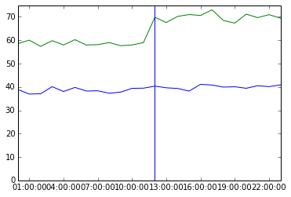
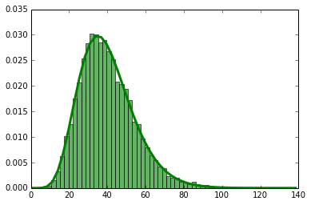
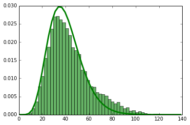
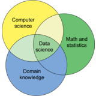

Look at Your Data

# Look at Your Data

by [Michael Brundage](http://michaelbrundage.com/)  Created: 11 May 2014  Updated: 11 May 2014

Some work I did at Amazon was part of the inspiration for John Rauser’s 2011 Velocity talk, [Look at Your Data](https://www.youtube.com/watch?v=coNDCIMH8bk), and led to changes in Amazon’s monitoring systems 8 months after I left. I can’t share details about that work, but I’d like to give a concrete example of the phenomenon John described in his talk.

It’s common at all companies to look at [percentile metrics](http://apmblog.compuware.com/2012/11/14/why-averages-suck-and-percentiles-are-great/). People commonly look at the 50th percentile to get an idea of the typical experience, and the 90th percentile to get a sense of the worst case excluding outliers (or the 99th percentile if the outliers are under your control, such as an internal service all of whose clients are also internal).

The percentile is computed for each time period, and then tracked over a long time. These metrics typically follow a pattern, and you can look for (or automatically detect) anomalies that don’t follow the usual pattern, and — perhaps most importantly — you can set goals around important metrics to improve your software and the customer experience.

As John explains in [his talk](https://www.youtube.com/watch?v=coNDCIMH8bk), if all you ever look at are summary statistics like percentiles, then you’re missing the complete picture. It’s important to look at the entire distribution at least occassionally, so that you can understand what’s really happening in your data.

Most metrics conform to a well-known distribution, such as the normal distribution or gamma distribution. When you look at your metric’s complete distribution and see that it’s changed and is no longer normal or gamma or whatever, then you know that something else is happening in your data.

## Example

Suppose your 50th and 90th percentile latencies are currently 39 and 59, respectively (probably milliseconds, but the units are unimportant here). You add a new feature, and these increase to 41 and 70, respectively.

You might decide that there’s no problem, or that there’s a problem in the upper 90th percentile, and either way you’re missing the real story because you’re not looking at the entire distribution.

Suppose your metric follows a gamma distribution (typical for latency metrics). Then the entire distribution before the change may have been like this:

and after the change it may look like this:

The thing to notice here is the bump on the right. I’ve drawn the gamma probability distribution as a curve over both graphs to make this stand out. What’s really happened is that your metric has changed from being a single gamma distribution to being a superposition of two gamma distributions.

I generated this data synthetically by adding 40 to 10% of the samples. If this were latency data, then a change that makes 10% of hits 40ms slower is kind of a big deal when your median latency was under 40ms to begin with. But, it showed up in your summary statstics as a much smaller change.

Although this is a synthetic example, this phenomenon is a common occurence in practice. Often a change makes your homogeneous pool of samples suddenly split into two or more different populations, each with its own characteristics. You can’t see this in the summary statistics alone; you have to look at your data.

Python code to generate these examples:
python	import datetime

	import numpy as np
	import matplotlib.pyplot as plt
	from scipy.stats import gamma, scoreatpercentile
	shape,scale = 8,5
	nsamples,nbins = 10000,50
	metric = gamma(shape,scale=scale)
	samples = metric.rvs(nsamples)
	samples2 = np.concatenate((samples[:.9 * nsamples], 40 + samples[.9 * nsamples:]))
	x = np.linspace(0, max(samples2))
	dates = np.array([datetime.datetime(2010, 5, 13, i, 0) for i in range(24)])
	mid = len(dates)/2
	pct = scoreatpercentile(samples, [50, 90])
	pct2 = scoreatpercentile(samples2, [50, 90])
	v = 0.02
	y50_1 = norm(loc=pct[0], scale=pct[0]*v)
	y90_1 = norm(loc=pct[1], scale=pct[1]*v)
	y50_2 = norm(loc=pct2[0], scale=pct2[0]*v)
	y90_2 = norm(loc=pct2[1], scale=pct2[1]*v)
	y_50 = np.concatenate((y50_1.rvs(mid), y50_2.rvs(mid)))
	y_90 = np.concatenate((y90_1.rvs(mid), y90_2.rvs(mid)))
	*# The change in percentiles*
	print np.array(pct2) - np.array(pct)
	*# Simulated percentile time series*
	plt.plot(dates, y_50, linewidth=1)
	plt.plot(dates, y_90, linewidth=1)
	plt.axvline(dates[mid])
	plt.show()
	*# Gamma distribution before change*
	plt.hist(samples, nbins, facecolor='green', normed=True, alpha=.6)
	plt.plot(x, metric.pdf(x), linewidth=3)
	*# Distribution after change*
	plt.hist(samples2, nbins, facecolor='green', normed=True, alpha=.6)
	plt.plot(x, metric.pdf(x), linewidth=3)

Share this page:

 [](https://www.twitter.com/intent/tweet?via=michaelbrundage&text=Look+at+Your+Data&url=http%3A%2F%2Fmichaelbrundage.com%2Fnote%2F2014%2F05%2F11%2Flook-at-your-data%2F)  [](https://www.facebook.com/sharer.php?u=http://michaelbrundage.com/note/2014/05/11/look-at-your-data/&t=Look+at+Your+Data&i=http%3A%2F%2Fmichaelbrundage.com%2Fthumbnote%2Flook-at-your-data.png)  [](https://www.linkedin.com/shareArticle?mini=true&url=http%3A%2F%2Fmichaelbrundage.com%2Fnote%2F2014%2F05%2F11%2Flook-at-your-data%2F&title=Look+at+Your+Data&Michael+Brundage&summary=Don%27t+just+look+at+summary+statistics.+Really+look+at+your+data.)  [](https://plus.google.com/share?url=http%3A%2F%2Fmichaelbrundage.com%2Fnote%2F2014%2F05%2F11%2Flook-at-your-data%2F)

### You may also like…

#### [Counting is Hard](http://michaelbrundage.com/note/2014/05/11/counting-is-hard/)

 

#### [Hiring Great Data Scientists](http://michaelbrundage.com/note/2014/05/10/hiring-great-data-scientists/)

 