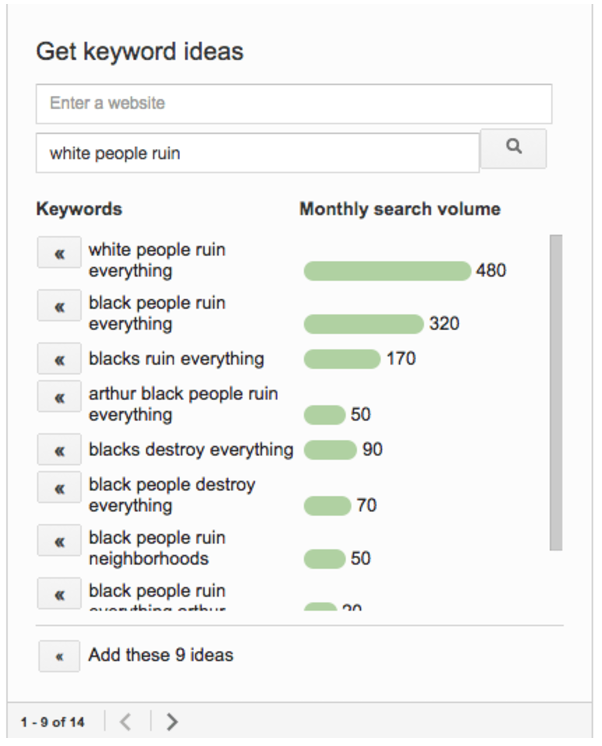
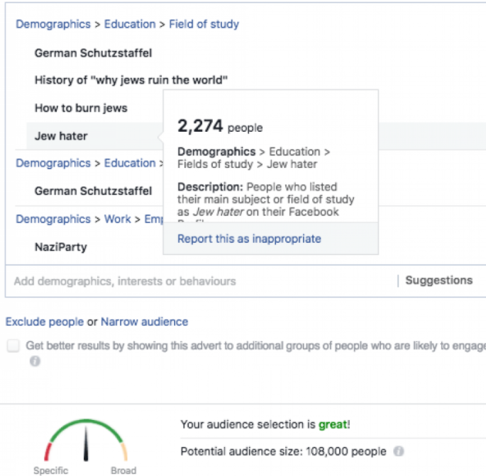

Lost Context: How Did We End Up Here? – NewCo Shift

# Lost Context: How Did We End Up Here?

## Facebook and Google’s advertising platforms are out of control. That used to be a good thing. Now…not so much.

Now that’s some damn precise audience targeting! From [Buzzfeed](https://www.buzzfeed.com/alexkantrowitz/google-allowed-advertisers-to-target-jewish-parasite-black?utm_term=.sgv2KOLkl#.ykDJN70zM).

Facebook and Google’s advertising infrastructure is one of humanity’s most marvelous creations. It’s also one of its most terrifying, because, in truth, pretty much no one really understands how it works. Not Mark Zuckerberg, not Larry Page, and certainly not Russian investigator Robert Mueller, although of the bunch, it seems [Mueller is the most interested in changing that](https://www.bloomberg.com/news/articles/2017-09-13/mueller-probe-is-said-to-have-red-hot-focus-on-social-media) fact.

[Pro Publica](https://www.propublica.org/article/facebook-enabled-advertisers-to-reach-jew-haters) catches Facebook with its algorithmic pants down.

And that’s a massive problem for Facebook and Google, who have been [dragged](https://www.buzzfeed.com/alexkantrowitz/google-allowed-advertisers-to-target-jewish-parasite-black?utm_term=.ktpZ5yLqz#.koXMonN6P) to [the stocks](https://www.propublica.org/article/facebook-enabled-advertisers-to-reach-jew-haters) over their algorithms’ inability to, well, act like a rational and dignified human being.

So how did the world’s most valuable and ubiquitous companies get here, and what can be done about it?

Well, let’s pull back and consider how these two tech giants execute their core business model, which of course is advertising. You might want to pour yourself an adult beverage and settle in, because by the end of this, the odds of you wanting the cold comfort of a bourbon on ice are pretty high.

In the beginning (OK, let’s just say before the year 2000), advertising was a pretty simple business. You chose your intended audience (the target), you chose your message (the creative), and then you chose your delivery vehicle (the media plan). That media plan involved identifying publications, television programs, and radio stations where your target audience was engaged.

Those media outlets lived in a world regulated by certain hard and fast rules around what constituted appropriate speech. The FCC made sure you couldn’t go [full George Carlin](https://www.youtube.com/watch?v=vbZhpf3sQxQ) in your creative execution, for example. The FTC made sure you [couldn’t commit fraud](https://www.ftc.gov/news-events/media-resources/truth-advertising). And the FEC — that’s the regulatory body responsible for insuring fairness and transparency in paid *political* speech — the FEC made sure that when audiences were targeted with creative that supports one candidate or another, those audiences [could know who was behind same-said creative](https://transition.fec.gov/ans/answers_general.shtml).

But that neat framework has been thoroughly and utterly upended on the Internet, which, as you might recall, has mostly viewed regulation as damage to be routed around.

After all, empowering three major Federal regulatory bodies dedicated to old media advertising practices seems like an awful lot of liberal overkill, *n’est ce pas?* What waste! And speaking of waste, honestly, if you want to “target” your audience, why bother with “media outlets” anyway?! Everyone knows that Wanamaker was right — in the offline world, [half your advertising is wasted](https://medium.com/s/which-half-is-wasted), and thanks to offline’s lack of precise targeting, no one has a clue which half that might be.

But as we consider tossing the offline baby out with the bathwater waste, it’s wise to remember a critical element of the offline model that may well save us as we begin to sort through the mess we’re currently in. That element can be understood via a single word: *Context*. But we’ll get to that in a minute. First, let’s go back to our story of how advertising has shifted in an online world, and the unintended consequences of that shift (if you want a even more thorough take, head over to Rick Webb’s *NewCo Shift* series: [Which Half Is Wasted](https://medium.com/s/which-half-is-wasted)).

#### Google: Millions Flock to Self Service, Rise of the Algos

Back in the year 2000, Google [rolled out AdWords](http://searchengineland.com/google-adwords-turns-15-a-look-back-at-the-origins-of-a-60-billion-business-234579), a fantastically precise targeting technology that allowed just about anyone to target their advertisements to…just about anyone, as long as that person was typing a search term into Google’s rapidly growing service. (Keep that “anyone” word in mind, it’ll come back to haunt us later.) AdWords worked best when you used it directly on Google’s site — because your ad came up as a search result right next to the “organic” results. If your ad was *contextually* relevant to a user’s search query, it had a good chance of “winning” — and the prize was a potential customer clicking over to your “landing page.” What you did with them then was your business, not Google’s.

As you can tell from my fetishistic italicization, in this early portion of the digital ad revolution, *context* still mattered. Google next rolled out “AdSense,” which placed AdWords on publishers’ pages around the Internet. AdSense didn’t work as well as AdWords on Google’s own site, but it still worked pretty well, because it was driven by *context* — the AdSense system scanned the web pages on which its ads were placed, and attempted to place relevant AdWords* in context *there. Sometimes it did so clumsily, sometimes it did so with spectacular precision. Net net, it did it well enough to start a revolution.

Within a few years, AdWords and AdSense brought billions of dollars of revenue to Google, and it reshaped the habits of millions of advertisers large and small. In fact, AdWords brought an entirely new class of advertiser into the fold — small time business owners who could compete on a level playing field with massive brands. It also reshaped the efforts of thousands of publishers, many of whom dedicated small armies of humans to game AdWords’ algorithms and fraudulently [drink the advertisers’ milk shakes](https://www.youtube.com/watch?v=s_hFTR6qyEo). Google fought back, employing thousands of engineers to ward off spam, fraud, and bad actors.

AdWords didn’t let advertisers target individuals based on their deeply personal information, at least not in its first decade or so of existence. Instead, you targeted based on the expressed intention of individuals — either their search query (if on Google’s own site), or the *context* of what they were reading on sites all over the web. And over time, Google developed what seemed like insanely smart algorithms which helped advertisers find their audiences, deliver their messaging, and optimize their results.

The government mostly stayed out of Google’s way during this period.

When Google went public in 2004, it was estimated that between 15 to 25 percent of advertising on its platform was fraudulent. But advertisers didn’t care — after all, that’s a lot less waste than over in Wanamaker land, right? Google’s IPO was, for a period of time, the most successful offering in the history of tech.

#### Facebook: People Based Marketing FTW

Then along came Facebook. Facebook was a social network where legions of users voluntarily offered personally identifying information in exchange for the right to poke each other, like each other, and share their baby pictures with each other.

Facebook’s founders knew their future lay in connecting that trove of user data to a massive ad platform. In 2008, they hired Sheryl Sandberg, who ran Google’s advertising operation, and within a few years, Facebook had built the foundation of what is now the most ruthlessly precise targeting engine on the planet.

Facebook took nearly all the world-beating characteristics of Google’s AdWords and added the crack cocaine of personal data. Its self service platform, which opened for business a year or so after Sandberg joined, was hailed as ‘[ridiculously easy to use](http://www.businessinsider.com/facebooks-self-service-ads-are-ridiculously-easy-to-make-2009-10).’ Facebook began to grow by leaps and bounds. Not only did everyone in the industrialized world get a Facebook account, every advertiser in the industrialized world got themselves a Facebook advertising account. Google had already plowed the field, after all. All Facebook had to do was add the informational seed.

Both Google and Facebook’s systems were essentially open — as we established earlier, just about anyone could sign up and start buying algorithmically generated ads targeted to infinite numbers of “audiences.” By 2013 or so, Google had gotten into the personalization game, albeit most folks would admit it wasn’t nearly as good as Facebook’s, but still, way better than the offline world.

So how does Facebook’s ad system work? Well, just like Google, it’s accessed through a self-service platform that lets you target your audiences using Facebook data. And because Facebook knows an awful lot about its users, you can target those users with astounding precision. You want women, 30–34, with two kids who live in the suburbs? Piece of cake. Men, 18–21 with an interest in acid house music, cosplay, and scientology? Done! And just like Google, Facebook employed legions of algorithms which helped advertisers find their audiences, deliver their messaging, and optimize their results. A massive ecosystem of advertisers flocked to Facebook’s new platform, lured by what appeared to be the Holy Grail of their customer acquisition dreams: People Based Marketing!

The government mostly stayed out of Facebook’s way during this period.

When Facebook went public in 2012, it [estimated](https://www.forbes.com/sites/roberthof/2012/08/08/stung-by-click-fraud-allegations-facebook-reveals-how-its-fighting-back/#63c026801562) that only 1.5% of its nearly one billion accounts were fraudulent. A handful of advertisers [begged to differ](https://www.forbes.com/sites/ericjackson/2012/07/31/why-do-some-advertisers-believe-that-90-of-facebook-ad-clicks-are-from-bots/#1e0f416b4386), but they were probably just using the system wrong. Sad!

Facebook’s IPO quickly became the most successful IPO in the history of tech. (Till Alibaba, of course. But that’s another story).

#### (Meanwhile, Programmatic.)

The programmatic Lumascape. Seems uncomplicated, right?

Stunned by the rise of the Google/Facebook duopoly, the tech industry responded with an open web answer: Programmatic advertising. Using cookies, mobile IDs, and tons of related data gathered from users as they surfed the web, hundreds of startups built an open-source version of Facebook and Google’s walled gardens. Programmatic was driven almost entirely by the concept of “audience buying” — the purchase of a specific audience segment regardless of the *context* in which that audience resided. The programmatic industry quickly scaled to billions of dollars — advertisers loved its price tag (open web ads were far cheaper), and its seemingly amazing return on investment (driven in large part by fraud and bad KPIs, but that’s yet another post).

Facebook and Google were unfazed by the rise of programmatic. In fact, they bought the best companies in the field, and incorporated their technologies into their ever advancing platforms.

#### The Storm Clouds Gather

But a funny thing happened as Google, Facebook and the programmatic industry rewrote advertising history. Now that advertisers could precisely identify and target audiences on Facebook, Google and across the web, they no longer needed to use media outlets as a proxy for those audiences. Media companies began to fall out of favor with advertisers and subsequently fail in large numbers. Google and Facebook became advertisers’ primary audience acquisition machines. Marketers poured the majority of their budgets into the duopoly — 70–85% of all digital advertising dollars go to the one or the other of them, and [nearly all growth in digital marketing spend](http://fortune.com/2017/01/04/google-facebook-ad-industry/) is attributable to them as well.

By 2011, regulators began to wrap their heads around this burgeoning field. Up till then, Internet ads were exempt from political regulations governing television, print, and other non digital outlets. In fact, both Facebook and Google have both lobbied the FEC, at various times over the past decade or so, to exclude their platforms from the vagaries of regulatory oversight based on an exemption for, and I am not making this up, “[bumper stickers, pins, buttons, pens and similar small items](https://www.fec.gov/regulations/110-11/2017-annual-110)” where posting a disclaimer is impracticable (sky writing is also mentioned). AdWords and mobile feed ads were small, after all. And everyone knows the Internet has limited space for disclaimers, right?

Anyway, that was the state of play up until 2011, when Facebook submitted a [request to the FEC](https://www.fec.gov/updates/aor-2011-09-facebook/)to clear the issue up once and for all. With a huge election coming in 2012, it was both wise and proactive of Facebook to want to clarify the matter, lest they find themselves on the wrong end of a regulatory ruling with hundreds of millions of dollars on the line. (Of course, they favored exemption over actual regulation).

The FEC failed to clarify its position, but did request comment from industry and the public on the issue ([PDF](https://www.google.com/url?sa=t&rct=j&q=&esrc=s&source=web&cd=1&ved=0ahUKEwi6trzg_qfWAhUrqlQKHbmyBaYQFggmMAA&url=https%3A%2F%2Fwww.fec.gov%2Flaw%2Fcfr%2Fej_compilation%2F2011%2Fnotice_2011-14.pdf&usg=AFQjCNGaMfm_5OwzqMbxr0qNAbuZMNw8Gw)). In essence, things remained status quo, and nothing happened for several years.

That set the table for the election of 2016. In October of that year, perhaps realizing it had done nothing for half a decade while the most powerful advertising machine in the history of ever slowly marched toward its seemingly inevitable date with emergent super intelligence, the FEC [re-opened its request for comments](https://www.google.com/url?sa=t&rct=j&q=&esrc=s&source=web&cd=2&ved=0ahUKEwii973b_6fWAhXIxFQKHZC4BzwQFggsMAE&url=https%3A%2F%2Fwww.fec.gov%2Fupdates%2Fcommission-seeks-comments-on-internet-disclaimer-notices%2F&usg=AFQjCNG5Kat7ITf3J8oZvqJE56iUF-XQGQ)on the whether or not political advertising on the Internet should have some trace of transparency. But that was far too late for the 2016 election.

The rest, as they inevitably say, is [history in the making](https://www.nytimes.com/2017/09/13/magazine/rt-sputnik-and-russias-new-theory-of-war.htm).

Time will tell, I suppose.

#### So Now What?

Most everyone I speak to tells me that last week’s revelations about Facebook, Russia, and political advertising is, in the words of Senator Mark Warner, “the tip of the iceberg.” Whether or not that’s true (and I for one am quite certain it is), it’s plenty enough to bring the issue directly to the forefront of our political and regulatory debate.

Now the news is coming fast and furious: At what was supposed to be a relatively quotidian [regular meeting of the FEC this week](https://www.bna.com/fec-votes-explore-n57982087935/), the commissioners voted unanimously to re-open (again) the comment period on Internet transparency. The Campaign Legal Center, launched in 2002 by a Republican ally of Senator John McCain (co-sponsor of the McCain Feingold Bipartisan Campaign Reform Act of 2002), this week [issued a release](http://www.campaignlegalcenter.org/news/press-releases/clc-calls-facebook-disclose-2016-ads-bought-foreign-entities) calling for Facebook to disclose any and all ads purchased by foreign agents. (Would that it were that simple, but we’ll get to that in the next installment.) One of the six FEC commissioners, a Democrat, subsequently penned an [impassioned Op Ed in the *Washington Post*](https://www.washingtonpost.com/opinions/our-elections-are-facing-more-threats-online-our-laws-must-catch-up/2017/09/14/dd646346-99a0-11e7-b569-3360011663b4_story.html?utm_term=.a13231956586), calling for a new regulatory framework that would protect American democracy from foreign meddling. The catch? The Republicans on the commission refuse to consider any regulations unless the commission receives “enough substantive written comments.”

Once the link for comments goes up in a week or two, I’m pretty sure they will.

But in the meantime, there’s plenty of chin stroking to be done over this issue. While this may seem like a dust up limited to the transparency of political advertising on the internet, the real story is vastly larger and more complicated. The wheels of western capitalism are greased by paid speech, and online, much of that speech is protected by the first amendment to our constitution, as well as established policies enshrined in contract law between Facebook, Google, and their clients. There are innumerable scenarios where a company or organization demands opacity around its advertising efforts. So many, in fact, that if I were to go into them now, I’d extend this piece by another 2,500 words.

And given I’m now close to 3,000 words in what was supposed to be a 600-word column, I’m going to leave exploring those scenarios, and their impact, to next week’s columns. In the meantime, I’ll be speaking with as many experts and policy folks from tech, Washington, and media as I can find. Suffice to say, big regulation is coming for big tech. Never in the history of the tech industry has the [1996 CDMA ruling granting tech platforms immunity from the consequences of speech on their own platforms](https://en.wikipedia.org/wiki/Section_230_of_the_Communications_Decency_Act) been more germane. Whether it’s in jeopardy or not remains to be seen.

This is not a simple issue, and resolving it will require a level of rational discourse and debate that’s been starkly absent from our national dialog these past few years. At stake is not only the fundamental advertising models that built our most valuable tech companies, but also the essential forces and presumptions driving our system of democratic capitalism*. Not to mention the nascent but utterly critical debate around the role of algorithms in civil society. And as we explore solutions to what increasingly feels like an intractable set of questions, we’d do well to keep one word in mind: *Context.*