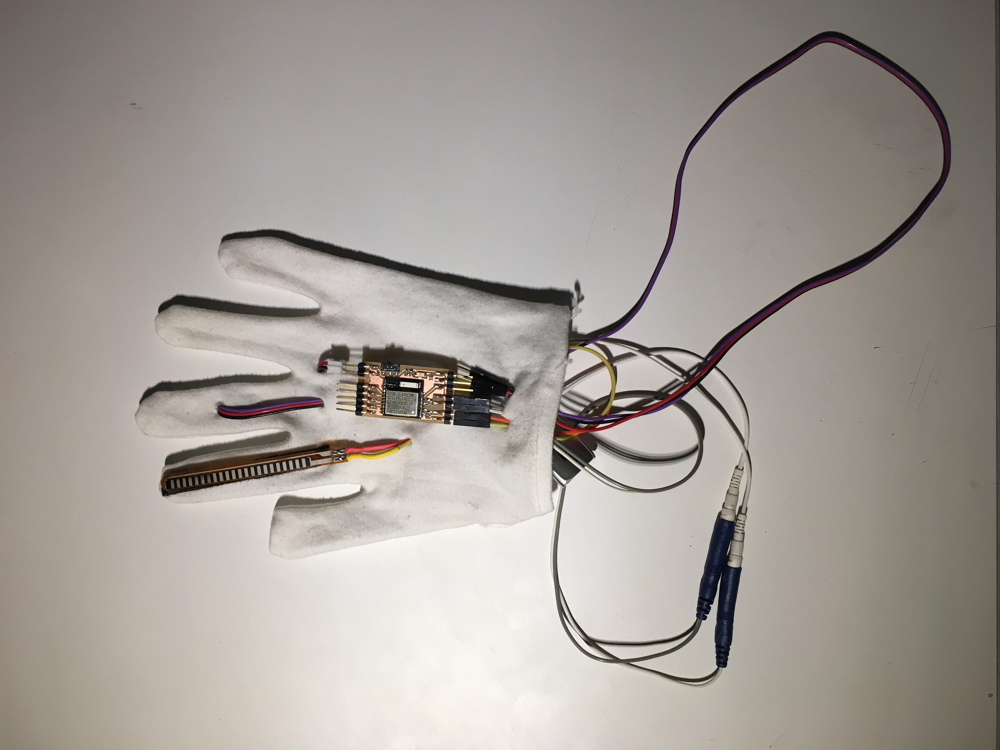
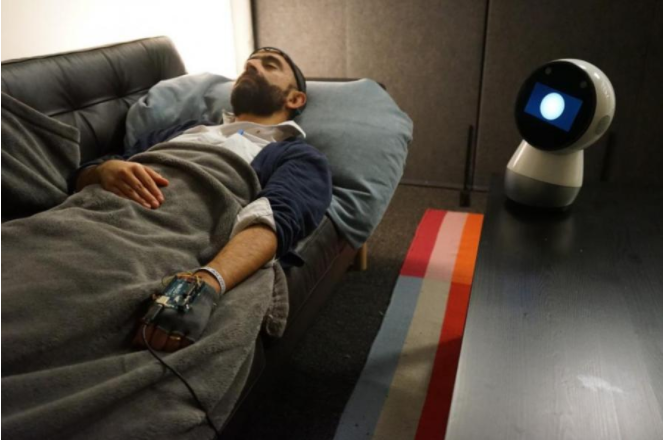
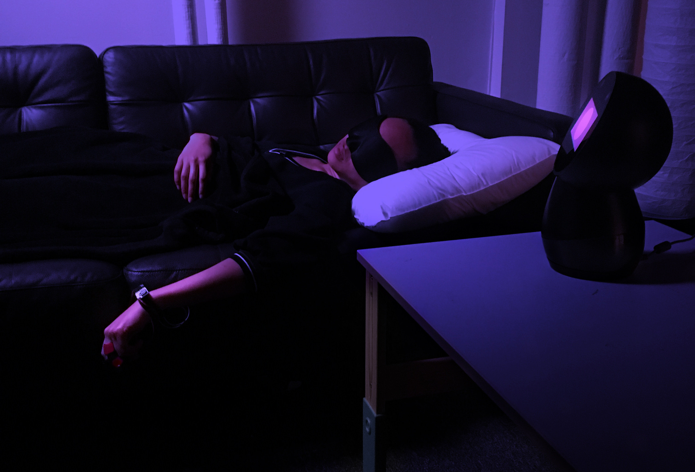
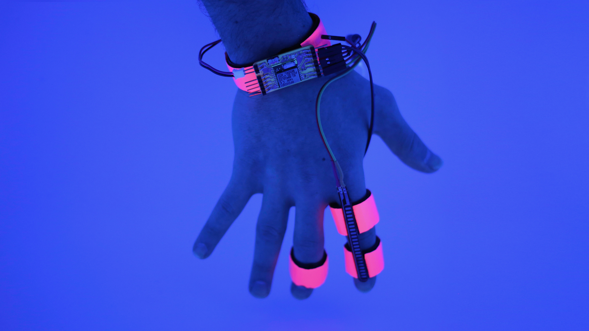

MIT Researchers Have Developed a ‘System for Dream Control’

[Dream Machine](https://motherboard.vice.com/en_us/topic/dream-machine)

# MIT Researchers Have Developed a ‘System for Dream Control’

[

[facebook-square.svg](../_resources/c240e5a3f7beea8b15209e0b136188fb.jpg)](https://motherboard.vice.com/en_us/contributor/daniel-oberhaus)

[Daniel Oberhaus](https://motherboard.vice.com/en_us/contributor/daniel-oberhaus)

Apr 23 2018, 2:30pm

## When is a sleeper actually asleep?

- [SHARE]()
- [[twitter.svg](../_resources/05263608ee3395a946eca7b32b971334.bin)TWEET]()

There is a borderland between waking life and the uncharted wilderness of sleep that we all traverse each night, but we rarely stop to marvel at the strangeness of this liminal world. If we do, we find that it is full of hallucinations both wonderful and terrifying, a mental goulash of reality and fantasy.

Usually we pass through this state of half-wakefulness on our way to deep sleep within minutes. We may experience microdreams during the transition, but the content of these microdreams appear to be random and we usually don’t have any memory of them when we wake. A team of researchers led by MIT doctoral candidate Adam Horowitz wants to change that.

Horowitz and his colleagues at the MIT Media Lab have developed a relatively simple device called Dormio to interface with this unique stage of sleep. Their hypothesis is that this liminal period between wakefulness and sleep is a fount of creativity that is usually lost in the ocean of sleep. The thinking is that if you’re able to descend into that stage of sleep and return to consciousness without descending deeper into sleep, you will benefit from the intensely associative thinking that characterizes the strange microdreams experienced during the transition to sleep.

So far Horowitz has tested the device on 15 subjects and found that it is able to reliably maximize the amount of time users spend suspended between wakefulness and sleep, as well as shape the content of the microdreams they experience. In other words, these MIT researchers have developed a low cost device that allows users to interface with sleep.

##  WHEN IS A SLEEPER ACTUALLY ASLEEP?

The technical name for the awareness of the brief period between wakefulness and sleep is [hypnagogia](https://www.theatlantic.com/science/archive/2016/04/deciphering-hypnagogia/478941/), and its something of a mystery for neuroscientists. The reason for this is that determining when someone is actually asleep is a matter of debate among scientists. It’s kind of like trying to determine when someone is ‘actually’ dead: Is it when the heart stops beating, when they lose consciousness, or when cells finally stop replicating?

What is certain, however, is that hypnagogia is a natural phenomenon that almost all of us encounter on a nightly basis.

Advertisement

“Hypnagogic imagery or hallucinations is a normal state of consciousness in the transition from wakefulness to sleep,” Vladas Noreika, a psychologist at Cambridge who was not involved with Dormio, told me in an email. Unlike other sleep states that allow for awareness, such as lucid dreaming during REM sleep, hypnagogia doesn’t require special training to induce its effects. It’s a common phenomenon that is a natural part of the circadian rhythm.

“The big questions are whether we become more creative in this state of consciousness, and why in some cases hypnagogia leads to a full-fledged dreaming, whereas in other cases to dreamless sleep,” Noreika added.

An early prototype of the Dormio glove. Image: Adam Horowitz/MIT

Defining just what hypnagogia * is* is tricky because people in this state exhibit behaviors characteristic of sleep and wakefulness, both from their own perspective and to outsiders. Technically speaking, hypnagogia occurs during stage 1 sleep, even if people who are woken up during this period sometimes report that they never were asleep or are able to respond when someone is talking to them. Moreover, people woken from hypnagogia often report strong visual and auditory hallucinations or microdreams, but like sleep itself, [what counts as a ‘dream’ is a subject of debate](https://www.researchgate.net/publication/314868747_Microdream_neurophenomenology) among neuroscientists.

These strange experiences explain why hypnagogic consciousness has been coveted by some of the most brilliant scientific and artistic minds in history. [Thomas Edison](https://www.wired.com/2008/05/st-napping/), [Edgar Allen Poe](https://www.eapoe.org/works/misc/mar0346.htm), [Vladimir Nabokov](https://books.google.com/books?id=_DuO-a4QLXIC&pg=PA62&lpg=PA62&dq=Just+before+falling+asleep,+I+often+become+aware+of+a+kind+of+one-sided+conversation+going+on+in+my+mind,+quite+independently+from+the+natural+train+of+my+thoughts.&source=bl&ots=Kfs_oLNq0Z&sig=JufevISzcAYJZGkc4kwBQ48_on8&hl=en&sa=X&ved=0ahUKEwjWkpbMhsLaAhVFrlkKHZdxCnkQ6AEIJzAA#v=onepage&q=Just%20before%20falling%20asleep%2C%20I%20often%20become%20aware%20of%20a%20kind%20of%20one-sided%20conversation%20going%20on%20in%20my%20mind%2C%20quite%20independently%20from%20the%20natural%20train%20of%20my%20thoughts.&f=false), [Mary Shelley](http://knarf.english.upenn.edu/Articles/thomasr.html), [Albert Einstein](https://www.fastcompany.com/3023078/how-dali-einstein-and-aristotle-perfected-the-power-nap), [Salvador Dali](https://www.psychologytoday.com/us/blog/dream-factory/201502/how-dream-salvador-dali), [August Kekule](https://www.nytimes.com/1988/08/16/science/the-benzene-ring-dream-analysis.html), and [Richard Wagner](https://www.fastcompany.com/3023078/how-dali-einstein-and-aristotle-perfected-the-power-nap) all [expressed their fascination](https://www.fastcompany.com/3023078/how-dali-einstein-and-aristotle-perfected-the-power-nap) with hypnagogia and claimed that their experiences in this twilight zone of the mind resulted in sudden bursts of creativity or mental clarity. The idea that “[conscious access to underlying, unconscious forces](https://books.google.com/books?id=Ryz6DwlI94UC&pg=PA14&lpg=PA14&dq=conscious+access+to+underlying,+unconscious+forces+kandel&source=bl&ots=P8_lTSnwcm&sig=FNb5qABEdnTqwoP6oQHY7vYk6F0&hl=en&sa=X&ved=0ahUKEwilwOa62MnaAhWvpFkKHXhuDm8Q6AEIMjAC#v=onepage&q=conscious%20access%20to%20underlying%2C%20unconscious%20forces%20kandel&f=false)” is at the root of creativity was also echoed and reformulated in a more scientifically rigorous way by the Nobel biophysicist Eric Kandel in the 90s.

Advertisement

In any case, it’s hardly surprising that many of these same thinkers developed a life hack to induce hypnagogic consciousness at will to reap its creative benefits.

"I felt I was nowhere really, in this kind of nowhere space where all of these ideas exist."

The most famous example of purposely induced hypnagogia is probably Thomas Edison’s steel balls trick. According to possibly apocryphal tales, Edison was able to reliably induce hypnagogia by [falling asleep with steel balls in his hand](http://techland.time.com/2013/11/14/the-spark-of-invention/). As he drifted off to sleep, his muscles would relax and he would inevitably drop the balls on the floor and the noise from the fall would jolt him back to wakefulness. During these micronaps Edison would never fully fall asleep, but he would experience the strange hallucinations and insights characteristic of hypnagogia.

“All these major thinkers write beautifully about this state of mind where the world starts dissolving, but you still have awareness of your descent into unconsciousness and memories mixing with hallucinations,” Horowitz told me on the phone. “Hypnagogia is pretty damn cool, but the best way that anyone had come up with to find it was dropping a steel ball.”

Dormio, which is part of a [wider MIT Media Lab initiative to interface with sleep](https://engineeringdreams.net/), is essentially a 21st century take on Edison’s technique.

##  THE DREAM MACHINE

Dormio has now gone through two iterations, and Horowitz said he and his collaborators are now at work on a third. The first generation of Dormio consisted of an Arduino microcontroller mounted to a glove with a small pressure sensor in the palm that Horowitz designed with his colleagues Ishaan Grover, Sophia Yang and Pedro Reynolds Cuéllar.

A person dons the glove before going to sleep and clenches their hand into a fist, putting pressure on the sensor. At the same time electroencephalograph (EEG) sensors monitored electrical activity in the brain. As the hand and head sensors detect that the person’s muscles are relaxing and brain waves are changing as they fall asleep, it triggers a nearby Jibo robot to say a preprogrammed phrase. This phrase is meant to prime the sleeper’s brain so that it changed the content of the dream based on what the Jibo robot said.

Yet there were a number of problems with the device. For starters, EEG devices are expensive to use and it is quite complicated to understand the signals. Additionally, the palm sensors could only do two states—on or off—even though the onset of sleep occurs as a gradual transition.

To rectify these shortcomings, Horowitz and his colleagues designed a new version of Dormio that swaps out the palm sensor for flexion sensors, which measure muscle tension at a much more granular level. This means the researchers can watch a subject gradually fall asleep by monitoring the loss of muscle tone. They also swapped out the EEG for simpler biosignals, such as heart rate, and traded in the Jibo robot for a smartphone app.

Horowitz said the third generation will work just by monitoring eyelid movement in sleeping subjects. The goal is to make Dormio as comfortable, cheap, and non-invasive as possible to make it easier for users to fall asleep while using it.

A subject uses the first generation of Dormio. Image: MIT

Horowitz tested the first version of Dormio on six volunteers from MIT. The participants would arrive at the lab in the early evening and lay down on a couch to go to sleep. As they were falling asleep, the Jibo robot would prompt them with one of two phrases: “remember to think about a rabbit” or “remember to think about a fork.” When the Dormio system detected the participants were falling asleep, the robot would say their name and “you are falling asleep.”

This is the equivalent of Edison dropping his steel balls, but the aim of Dormio is not to wake up the sleeper entirely. Instead, the system is meant to prevent the user from falling deeper into sleep, effectively suspending them in an extended state of hypnagogia. Once the volunteers were in a state of hypnagogia, the Jibo robot would ask them what they are thinking about and record their answers.

Advertisement

"We have a kind of workable system for dream control."

According to Horowitz’s results, which will be presented this week at the [Computer-Human Interface conference](https://chi2018.acm.org/) in Montreal, although not all of the subjects remembered what they said to the robot, all of them “remembered and reported seeing the prompt word during their dream state, showing successful inception and recall of stimuli into said dream state.”

“This means we have a kind of workable system for dream control,” Horowitz told me.

But Dormio isn’t just about manipulating dreams. Horowitz wanted to see if having conscious access to these microdreams would result in the creativity “boost” that was so coveted by Edison and others.

When Horowitz’s subjects finished three rounds with Dormio, they were administered an “Alternative Uses Task,” which Horowitz described as a “classic test of creativity.” As its name suggests, this test asked the participants to imagine alternative uses for the word they were prompted with, either a rabbit or a fork. The volunteers were also asked to write a creative story based around the word prompt.

A subject uses Dormio at MIT. Image: MIT Fluid Interfaces

Although [creativity is notoriously difficult to measure](https://www.tandfonline.com/doi/full/10.1080/10400419.2016.1125259) in any objective way, the results from the control and Dormio tests showed signs of a creativity boost among Horowitz’s volunteers. They spent an average of 158 seconds longer working on their creative story after experiencing hypnagogia and five of the six volunteers scored higher on their alternative use task after using Dormio than during the control test. In self reports, four of the volunteers said that the ideas generated during hypnagogia felt creative.

“Ideas were not coming from me, they were just passing through my head,” one subject reported. “I felt I was nowhere really, in this kind of nowhere space where all of these ideas exist, and it made so much sense that all these ideas existed in this nowhere space.”

Advertisement

“The reason you get these different ways of processing information is because you don't have the same brain at sleep onset,” Horowitz told me. “You lose a lot of frontal function which means you're hyper-associative, you have a loss of sense of self, a loss of sense of time, a loss of sense of space, and people have a much easier time with divergent thinking, which is tightly tied to coming up with innovative and weird solutions that you would ignore if you're fully awake.”

##  THE FUTURE OF DORMIO

The idea of interfacing with our dreams to naturally boost our creativity is an attractive one, but is still an emerging field of research that will require a lot more testing. Horowitz has already tested the second generation Dormio device on a cohort of nine subjects, but says he needs a far larger cohort than 15 subjects to really dial in on how Dormio affects hypnagogia. In addition to getting more human data, he and his colleagues are also working on developing an even less intrusive version of Dormio that will detect the onset of hypnagogia solely by monitoring eyelid movement.

In the meantime, other researchers like Noreika are working on uncovering the neural mechanisms behind hypnagogia. It’s a difficult phenomenon to pin down because its effects vary from vivid hallucinations and dreams to the mental presence of phrases that have little to do with a person’s thoughts before falling asleep.

Image: Oscar Rosello/MIT

“While neural mechanisms of hypnagogia haven't been sufficiently studied, it seems that rigid frontal brain control of sensory input loosens in drowsiness, resulting in the generation of unpredictable sensory experiences,” Noreika told me.

Nevertheless, hypnagogia does seem to be connected to a person’s lived experiences. This means that some people may be more likely to experience linguistic phenomena than hallucinatory images or audio, for instance. In 2015, Noreika led a [case study](https://www.frontiersin.org/articles/10.3389/fpsyg.2015.00202/full) in which a retired professor of literature came to his lab for 10 sessions during which the professor would fall asleep and report his experiences as he drifted off. During these sessions, the professor reported hypnagogia characterized by “intense linguistic intrusions, including words made up of foreign languages.” As Noreika pointed out, “it is likely that individuals without extensive knowledge of languages would not experience such intrusions.”

Horowitz described similar links between the hypnagogic experiences of his subjects during their Dormio sessions and their waking lives. For example, when one of his subjects was prompted with the word ‘fork’ it caused him to mutter “forks are colonialism.”

“I asked him about it when he woke up,” Horowitz told me. “He said, ‘Oh at home I eat food with my hands and here I have a sharp, cold metal instrument that I use to stab the food that goes into me. I guess it has a colonial energy.’ He said he always thought that about forks, but never thought that he thought that. The idea that you can access cognition that lets you see yourself with this technology is very exciting to me.”

- [SHARE]()
- [TWEET]()
- Tagged:
- [Sleep](https://motherboard.vice.com/en_us/topic/sleep),
- [Thomas Edison](https://motherboard.vice.com/en_us/topic/thomas-edison),
- [MIT Media Lab](https://motherboard.vice.com/en_us/topic/mit-media-lab),
- [Adam Horowitz](https://motherboard.vice.com/en_us/topic/adam-horowitz),
- [Steel Ball](https://motherboard.vice.com/en_us/topic/steel-ball),
- [Vladas Noreika](https://motherboard.vice.com/en_us/topic/vladas-noreika),
- [hypnagogia](https://motherboard.vice.com/en_us/topic/hypnagogia),
- [Dormio](https://motherboard.vice.com/en_us/topic/dormio),
- [Dream Interfaces](https://motherboard.vice.com/en_us/topic/dream-interfaces),
- [microdream](https://motherboard.vice.com/en_us/topic/microdream)

Watch This Next
[  13:44  How iFixit Became the World's Best iPhone Teardown Team]()