Machine Learning Crash Course: Part 4 - The Bias-Variance Dilemma · ML@B

# Machine Learning Crash Course: Part 4 - The Bias-Variance Dilemma

 By Daniel Geng and Shannon Shih  13 Jul 2017
Here’s a riddle:
 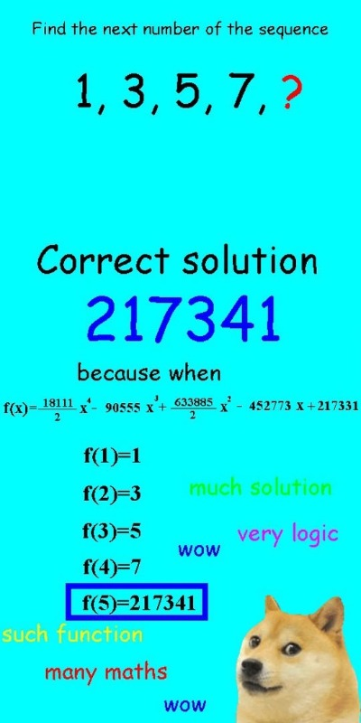

So what does this have to do with machine learning? Well, it turns out that machine learning algorithms are not that much different from our friend Doge: *they often run the risk of over-extrapolating or over-interpolating from the data that they are trained on.*

There is a very delicate balancing act when machine learning algorithms try to predict things. On the one hand, we want our algorithm to model the training data very closely, otherwise we’ll miss relevant features and interesting trends. However, on the other hand we don’t want our model to fit *too* closely, and risk over-interpreting every outlier and irregularity.

## Fukushima

[The Fukushima power plant disaster](https://en.wikipedia.org/wiki/Fukushima_Daiichi_nuclear_disaster) is a devastating example of overfitting. When designing the power plant, engineers had to determine how often earthquakes would occur. They used a well-known law called the Gutenberg-Richter Law, which gives a way of predicting the probability of a very strong earthquake from the frequency that very weak earthquakes occur. This is useful because weak earthquakes–ones that are so weak that you can’t even feel them–happen almost all the time and are recorded by geologists, so the engineers had quite a large dataset to work with. Perhaps the most important result of this law is that the relationship between the magnitude of an earthquake and the logarithm of the probability that it happens is *linear*.

The engineers of the nuclear power plant used earthquake data from the past 400 years to train a regression model. Their prediction looked something like this:

 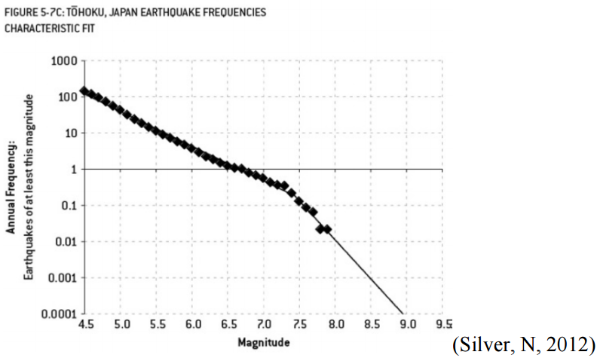

Source: [Brian Stacey, Fukushima: The Failure of Predictive Models](https://mpra.ub.uni-muenchen.de/69383/1/MPRA_paper_69383.pdf)

The diamonds represent actual data while the thin line shows the engineers’ regression. Notice how their model hugs the data points very closely. In fact, their model makes a kink at around a magnitude of 7.3 – decidedly not linear.

In machine learning jargon, we call this *overfitting*. As the name implies, overfitting is when we train a predictive model that “hugs” the training data too closely. In this case, the engineers knew the relationship should have been a straight line but they used a more complex model than they needed to.

If the engineers had used the correct linear model, their results would have looked something like this:

 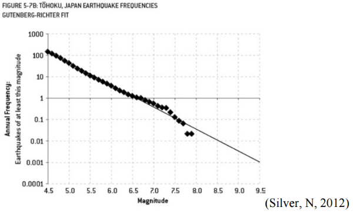

Notice there’s no kink this time, so the line isn’t as steeply sloped on the right.

The difference between these two models? The overfitted model predicted one earthquake of at least magnitude 9 about every 13000 years while the correct model predicted one earthquake of at least magnitude 9 just about every 300 years. And because of this, the Fukushima Nuclear Power Plant was built only to withstand an earthquake of magnitude 8.6. The 2011 earthquake that devastated the plant was of magnitude 9 (about 2.5 times stronger than a magnitude 8.6 earthquake).

 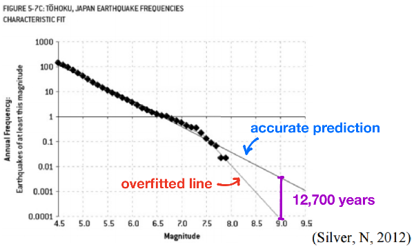

## Underfitting

There is actually a dual problem to overfitting, which is called underfitting. In our attempt to reduce overfitting, we might actually begin to head to the other extreme and our model can start to *ignore* important features of our data set. This happens when we choose a model that is not complex enough to capture these important features, such as using a linear model when a quadratic is necessary.

 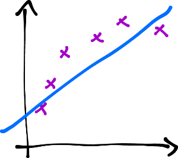

While the linear model (the blue line) follows the data (the purple X's), it misses the underlying curving trend of the data. A quadratic model would have been better.

## The Bias-Variance dilemma

So we want to avoid overfitting because it gives too much predictive power to quirks in our training data. But in our attempt to reduce overfitting we can also begin to underfit, ignoring important features in our training data. So how do we balance the two?

In the field of machine learning this incredibly important problem is known as the bias-variance dilemma. It’s entirely possible to have state-of-the-art algorithms, the fastest computers, and the most recent GPUs, but if your model overfits or underfits to the training data, its predictive powers are going to be terrible no matter how much money or technology you throw at it.

The name bias-variance dilemma comes from two terms in statistics: **bias**, which corresponds to underfitting, and **variance**, which corresponds to overfitting.

Our example of underfitting from above. The blue line is our model, and the purple X's are the data that we are trying to predict.

The drawing above depicts an example of high **bias**. In other words, the model is *underfitting*. The data points obviously follow some sort of curve, but our predictor isn’t complex enough to capture that information. Our model is *biased* in that it assumes that the data will behave in a certain fashion (linear, quadratic, etc.) even though that assumption may not be true. A key point is that there’s nothing wrong with our training—this is the *best* possible fit that a linear model can achieve. There is, however, something wrong with the *model* itself in that it’s not complex enough to model our data.

 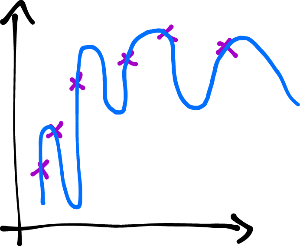

Approximating data using a very complex model. Notice how the line tends to over-interpolate between points. Even though there is a general upward trend in the data, the model predicts huge oscillations.

In this drawing, we see an example of a model with very high **variance**. In other words, a model that is *overfitting*. Again, the data points suggest a sort of graceful curve. However, our model uses a very complex curve to get as close to every data point as possible. Consequently, a model with high variance has very low bias because it makes little to no assumption about the data. In fact, it adapts *too* much to the data.

Again, there’s nothing wrong with our training. In fact, our predictor hits *every* single data point and is by most metrics perfect. It is actually our *model itself* that’s the problem. It wants to account for every single piece of data perfectly and thus over-generalizes. A model that over-generalizes has high variance because it varies too much based on insignificant details about the data.

 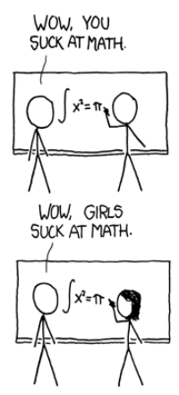

An example of high “variance” in everyday life from [xkcd](https://xkcd.com/385/). ‘Girls sucking at math’ in this case is an overgeneralization based on only a single data point.

## Explaining the Dilemma

So, why is there a trade-off between bias and variance anyways? How come we can’t have the best of both worlds and have a model that has both low bias and low variance? It turns out that bias and variance are actually side effects of one factor: the complexity of our model.

For the case of high bias, we have a very simple model. In our example above we used a linear model, possibly the most simple model there is. And for the case of high variance, the model we used was super complex (think squiggly).

 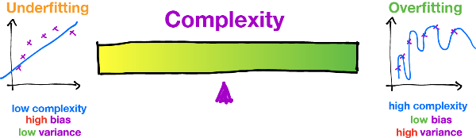

The image above should make things a bit more clear as to why the bias-variance trade-off exists. Whenever we choose a model with low complexity (like a linear model) and thus low variance, we’re also choosing a model with high bias. If we try to increase the complexity of our model, such as a quadratic model, we sacrifice low variance in exchange for low bias at the cost of high variance. The best we can do is try to settle somewhere in the middle of the spectrum, where the purple pointer is.

## Visualization of the bias-variance tradeoff

*In this visualization we fit a model (the blue line) to some noisy sine wave data (the red crosses). By moving the slider you can manually adjust the complexity of the model and watch as it overfits and underfits.*

*The bottom graph shows the training error and the test error in red and blue respectively. Notice how training error always decreases with increasing complexity, but test error will hit a minimum at some point, and then increase after that. You can always tell whether you are underfitting or overfitting by looking at the training and test errors.*

 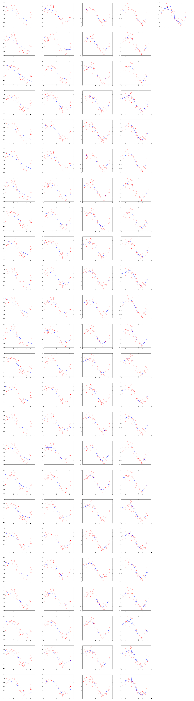

Complexity: 0.5
 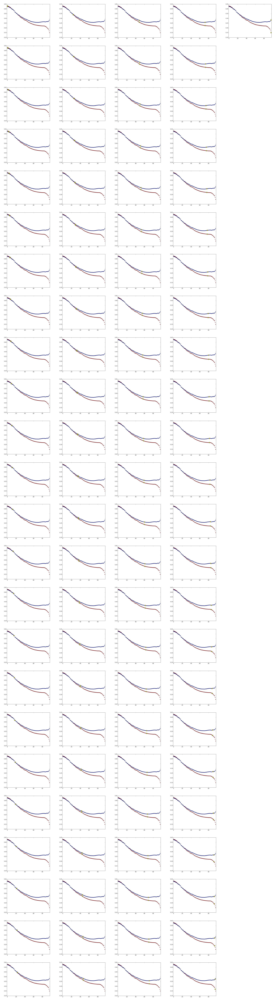

The top image shows models of different complexities fitting to the data. The bottom image shows the the error of the model against a training set (red) and a test set (blue).

We are training a locally-weighted linear regression model (LOWESS) on a sine wave with added gaussian noise. The smoothing parameter is used as a proxy for complexity, and the error is the average L1 distance. Credits to [agramfort](https://gist.github.com/agramfort/850437) for the LOWESS implementation. You can find the code that generated this visualization [here](https://github.com/dangeng/bias-variance-tradeoff).

### Analyzing the Training and Test Error

Low complexity will result in poor accuracy (and thus high error) for both training and test data. You can see this on the left of the bottom graph where both the red line (training error) and blue line (test error) are very high. This is because the model inherently lacks enough complexity to describe the data at all.

On the other hand, high complexity models will result in a low training error and a high test error. You can see this happening on the right side of the bottom graph, where the red data points decrease but the blue data points increase. This is because a complex model will be able to model the training data a bit *too* well, and thus can’t generalize to the test data.

Notice that the best complexity lies where the test error reaches a minimum, that is, somewhere in between a very simple and a very complex model.

## Noise

Here’s another (more mathematical) insight into what bias and variance is all about. In machine learning and data science, we often have a function that we want to model, whether it be a function that associates square footage to house prices or magnitudes of an earthquake to the frequency at which they occur. We assume that there is some perfect, god-given, ideal function that models exactly what we want. But the world isn’t perfect, so when we get real data to train our model it inevitably has noise – random fluctuations from things such as human error and measurement uncertainty.

In math terms, we say that y=f(x)+ϵy=f(x)+ϵ. Where yy is the training data we end up measuring, f(x)f(x) is that perfect function, and ϵϵ is the random error that we can’t avoid.

 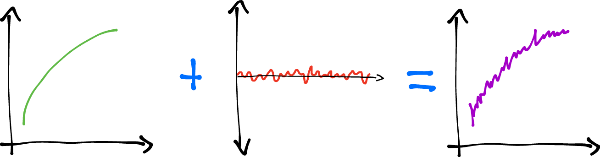

Our “perfect” function added to noise is what we end up measuring in the real world.

Our goal in machine learning is to retrieve the perfect function (or something reasonably close to it) from the noisy data. That is, from yy we want to construct ^f(x)f^(x), an approximation of f(x)f(x).

The bias-variance tradeoff results from using our necessarily flawed data, yy, to reconstruct this perfect function f(x)f(x). We want to ignore the noise term ϵϵ, but because y=f(x)+ϵy=f(x)+ϵ, the data we receive inevitably has the noise mashed up with the real data, f(x)f(x). So if we ignore the noise too much, we end up ignoring the real data as well.

 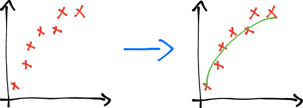

This noise manifests as disorganized data points. What we want to do is recover the perfect function (in green) from these data points.

## Bias-Variance Decomposition Derivation

For the more mathematically inclined, this sets the stage for us to derive the *Bias-Variance Decomposition*. That is, we will prove that the error of a model is composed of three terms: a bias term, a variance term, and an unavoidable *irreducible error* term. Two things though. Firstly, knowing a bit of probability theory will probably make this proof a bit easier to swallow (although we’ll certainly try to explain everything). And secondly, this proof is straight from [Wikipedia](https://en.wikipedia.org/wiki/Bias%E2%80%93variance_tradeoff#Derivation) (there’s only so many ways to prove things!) but we hope we have a much more elucidating version of the proof here.

Bias-Variance Decomposition Derivation

We start with the fact that our training data, yy, comes from our god-given function, f(x)f(x), mixed with some noise. That is y=f(x)+ϵy=f(x)+ϵ, where the noise, ϵϵ, is distributed normally, has mean 00, and variance σ2σ2. Our goal is to find a function, call this ^f(x)f^(x), to approximate f(x)f(x).

Again, we want to show that the error of ^f(x)f^(x) in approximating yy can be seen as a combination of bias, variance, and an irreducable error term. That is:

E[(y−^f(x))2]=Bias[^f(x)]2+Var[^f(x)]+σ2E⁡[(y−f^(x))2]=Bias⁡[f^(x)]2+Var⁡[f^(x)]+σ2

where
Bias[^f(x)]=E[^f(x)−f(x)]Bias⁡[f^(x)]=E⁡[f^(x)−f(x)]
and
Var[^f(x)]=E[^f(x)2]−E[^f(x)]2Var⁡[f^(x)]=E⁡[f^(x)2]−E⁡[f^(x)]2

If your eyes just started to glaze over, don’t worry. Let’s break this down a bit.

The E[(y−^f(x))2]E⁡[(y−f^(x))2] on the left hand side of the first equation is the mean squared error (which we talked about in a [previous post](https://ml.berkeley.edu/blog/2016/11/06/tutorial-1/)). The right hand side shows it’s decomposition into three terms.

The first of these three terms (and the second equation) is the bias term:
Bias[^f(x)]=E[^f(x)−f(x)]Bias⁡[f^(x)]=E⁡[f^(x)−f(x)]

This term measures how much the model, ^f(x)f^(x), differs from the actual function, f(x)f(x). The EE means expectation (or average), so we are literally taking the average difference between our model and the actual function. In essence, the difference measures the errors due to simplifying assumptions of our model ^f(x)f^(x). In this way, it’s an indicator of underfitting.

The second term (and the third equation) is the variance term:
Var[^f(x)]=E[^f(x)2]−E[^f(x)]2Var⁡[f^(x)]=E⁡[f^(x)2]−E⁡[f^(x)]2

Readers with a bit of background in probability or statistics will likely recognize that this is the exact working definition for variance. Although there are more intuitive expressions for variance, this (rather opaque) formulation will help us later in the derivation. A proof of this formula can be found [here](https://en.wikipedia.org/wiki/Variance#Definition).

Finally, the third term, σ2σ2 is the *irreducible error*. It’s irreducible because no matter what model we use, the error will always be there. This is because the σ2σ2 term comes directly from the noise in our training data: ϵϵ. For all intents and purposes it is a constant because real-world data always has some noise. Note that because both the bias term and the variance term are non-negative (the bias because it’s being squared, and the variance by definition), σ2σ2 is a lower bound for the mean squared error. In other words, the overall error of the model cannot be less than σ2σ2.

For simplicity of notation, we now denote f(x)f(x) by just ff and ^f(x)f^(x) by just ^ff^.

To derive the identity, we start with the mean squared error
E[(y−^f(x))2]E⁡[(y−f^(x))2]

and square the inside term and apply [linearity of expectation](https://brilliant.org/wiki/linearity-of-expectation/)

E[y2−2y^f+^f2]=E[y2]+E[^f2]−E[2y^f]E⁡[y2−2yf^+f^2]=E⁡[y2]+E⁡[f^2]−E⁡[2yf^]

We can rewrite both the first and second terms by using the definition for variance:

Var[y]=E[y2]−E[y]2Var⁡[y]=E⁡[y2]−E⁡[y]2Var[^f]=E[^f2]−E[^f]2Var⁡[f^]=E⁡[f^2]−E⁡[f^]2

Rearranging we have:

E[y2]=Var[y]+E[y]2E⁡[y2]=Var⁡[y]+E⁡[y]2E[^f2]=Var[^f]+E[^f]2E⁡[f^2]=Var⁡[f^]+E⁡[f^]2

Which we can now use to substitute for the first and second terms. As for the third term, we can directly calculate the expectation using linearity of expectation:

E[2y^f]=2E[y]E[^f]E⁡[2yf^]=2E⁡[y]E⁡[f^]
Note that because y=f+ϵy=f+ϵ and, ϵϵ has mean of 0:
E[y]=E[f+ϵ]=E[f]=fE⁡[y]=E⁡[f+ϵ]=E⁡[f]=f

(E[f]=fE⁡[f]=f holds because ff is a deterministic function. It’s average at any point is simply going to be it’s value at that point). Thus:

E[2y^f]=2fE[^f]E⁡[2yf^]=2fE⁡[f^]
Substituting all of this back, we obtain:

E[(y−^f(x))2]=E[y2]+E[^f2]−E[2y^f]=Var[y]+E[y]2+Var[^f]+E[^f]2−2fE[^f]E⁡[(y−f^(x))2]=E⁡[y2]+E⁡[f^2]−E⁡[2yf^]=Var⁡[y]+E⁡[y]2+Var⁡[f^]+E⁡[f^]2−2fE⁡[f^]

Rearranging the terms (and using the fact that E[y]=fE⁡[y]=f), we have:

E[(y−^f(x))2]=Var[y]+E[y]2+Var[^f]+E[^f]2−2fE[^f]=Var[y]+Var[^f]+(f2−2fE[^f]+E[^f]2)=Var[y]+Var[^f]+(f−E[^f])2E⁡[(y−f^(x))2]=Var⁡[y]+E⁡[y]2+Var⁡[f^]+E⁡[f^]2−2fE⁡[f^]=Var⁡[y]+Var⁡[f^]+(f2−2fE⁡[f^]+E⁡[f^]2)=Var⁡[y]+Var⁡[f^]+(f−E⁡[f^])2

We’re almost there! Because ff is fully deterministic, by linearity of expectation:

Bias[^f]=E[^f−f]=E[^f]−E[f]=E[^f]−fBias⁡[f^]=E⁡[f^−f]=E⁡[f^]−E⁡[f]=E⁡[f^]−f
Squaring the bias, we get:
Bias[^f]2=(E[^f]−f)2=(f−E[^f])2Bias⁡[f^]2=(E⁡[f^]−f)2=(f−E⁡[f^])2
But this is just the third term in the equation above! Substituting, we have:

E[(y−^f(x))2]=Var[y]+Var[^f]+Bias[^f]2E⁡[(y−f^(x))2]=Var⁡[y]+Var⁡[f^]+Bias⁡[f^]2

We have just one more act of mathematical gymnastics to perform. We need to somehow wrangle a σ2σ2 out of the Var[y]Var⁡[y]. Let’s do it.

Again, we have y=f+ϵy=f+ϵ, so:

Var[y]=E[(y−E[y])2]=E[(y−f)2]=E[f+ϵ−f)2]=E[ϵ2]=Var[ϵ]+E[ϵ]2=σ2Var⁡[y]=E⁡[(y−E⁡[y])2]=E⁡[(y−f)2]=E⁡[f+ϵ−f)2]=E⁡[ϵ2]=Var⁡[ϵ]+E⁡[ϵ]2=σ2

In the first line we used the definition of variance. In the second we use the fact that E[y]=fE⁡[y]=f. The third line we substitute yy. In the fifth line, we use the (other) definition of variance. Finally, in the sixth line we use the fact that E[ϵ]=0E⁡[ϵ]=0 and Var[ϵ]=σ2Var⁡[ϵ]=σ2.

And substituting, we obtain our decomposition:
E[(y−^f(x))2]=Var[^f]+Bias[^f]2+σ2E⁡[(y−f^(x))2]=Var⁡[f^]+Bias⁡[f^]2+σ2

## Resolving the Dilemma

So how should we detect overfitting and underfitting and what should we do if we *do* detect it?

As we’ve seen above, overfitting and underfitting have very clear signatures in training and test data. Overfitting results in low training error and high test error, while underfitting results in high errors in both the training and test set.

However, measuring training and test errors is hard when we have relatively few data points and our algorithms require a fair amount of data (which unfortunately happens quite often). In this case we can use a technique called **cross-validation**.

This is where we take our entire dataset and split it into kk groups. For each of the kk groups, we train on the remaining k−1k−1 groups and **validate** on the kthkth group. This way we can make the most use of our data, essentially taking a dataset and training kk times on it.

 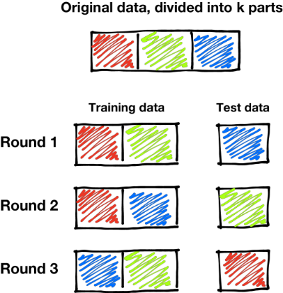

Cross validation with k=3. We divide the entire training set into three parts, and then train our model three times using each of the three parts as the validation set with the remaining two parts making up our actual training set.

As for what to do after you detect a problem? Well, having high bias is symptomatic of a model that is not complex enough. In that case, your best bet would be to just pick a more complex model.

The problem of high variance is a bit more interesting. One naive approach to reduce high variance is to use more data. Theoretically, with a complex enough model, as the number of samples tends toward infinity the variance tends toward zero. However, this approach is naive because the rate at which the variance decreases is typically fairly slow, and (the larger problem) data is almost always very hard to come across. Unless you’re working at Google Brain (and even then), getting more data takes time, energy, and money.

A better approach to reducing variance is to use regularization. That is, in addition to rewarding your model as it models the training data well, penalize it for growing too complex. Essentially, regularization injects “bias” into the model by telling it not to become too complex. Common regularization techniques include lasso or ridge regression, dropout for neural networks, and soft margin SVMs.

Finally, **ensemble learning** (which we’ll be talking about next time!) offers a way to reduce the variance of a model without sacrificing bias. The idea is to have an *ensemble* of multiple classifiers (typically decision trees) trained on random subsets of the training data. To actually classify a data point, the ensemble of classifiers all “vote” on a classification.

## Conclusion

As you may be starting to see, machine learning is just as much an art as it is a science. Choosing a model and adjusting each of its parameters to reduce overfitting and underfitting is a task that requires skill and, more importantly, experience. And while there is probably a ‘sweet’ spot out there, us mere mortals will have to rely on our intuition and our cunning to find the best model for the job.