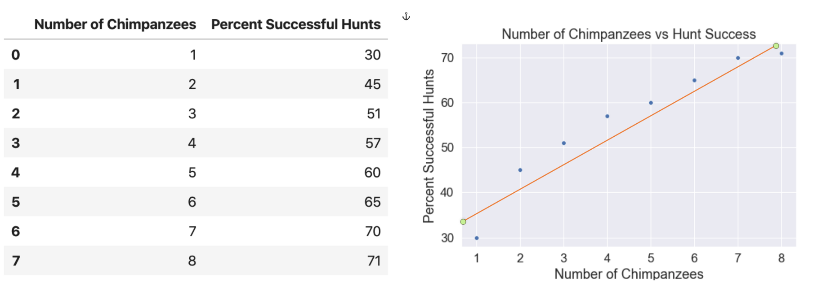
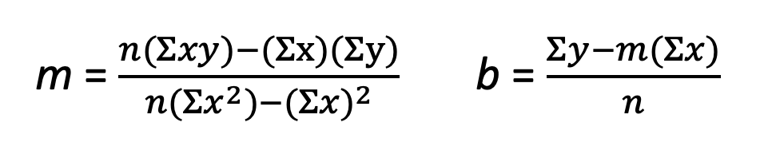
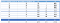
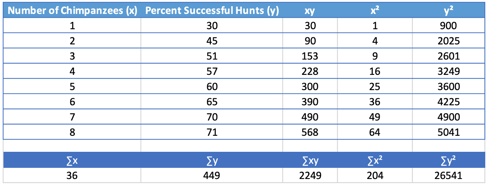
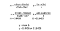
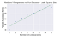
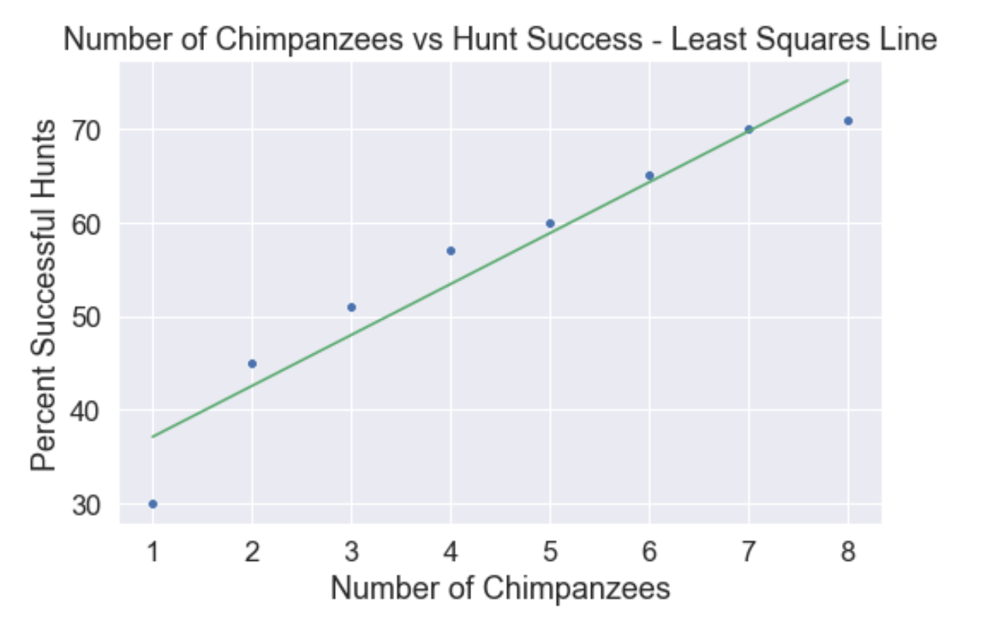
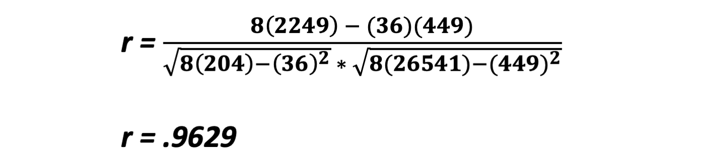

Machine Learning by Hand: Linear Regression - Towards Data Science

# Machine Learning by Hand: Linear Regression

## Linear regression is a data scientist’s most basic and powerful tool. Let’s take a closer look at the Least Squares Line and Correlation Coefficient.

[Richard Peterson](https://towardsdatascience.com/@richardpeterson320?source=post_page-----ee7fe5a751bf----------------------)

[Apr 11](https://towardsdatascience.com/linear-regression-by-hand-ee7fe5a751bf?source=post_page-----ee7fe5a751bf----------------------) · 6 min read

# Invention of Linear Regression

Photo by [Johannes Plenio](https://unsplash.com/@jplenio?utm_source=unsplash&utm_medium=referral&utm_content=creditCopyText) on [Unsplash](https://unsplash.com/s/photos/sailing-ships?utm_source=unsplash&utm_medium=referral&utm_content=creditCopyText)

Linear regression is a form of linear algebra that was allegedly invented by Carl Friedrich Gauss (1777–1855), but was first published in a scientific paper by Adrien-Marie Legendre (1752–1833). Gauss used the least squares method to guess when and where the asteroid Ceres would appear in the night sky. (The Discovery of Statistical Regression, 2015) This was not a hobby project, this was a well-funded research project for the purpose of oceanic navigation, a highly competitive field that was sensitive to technological disruption.

* * *

*...*

# Principles of Linear Regression

Linear regression is a method for predicting ***y from x. ***In our case, ***y is the dependent variable, and x is the independent variable. ***We want to predict the value of **y **for a given value of **x.** Now, if the data were perfectly linear, we could simply calculate the slope intercept form of the line in terms ***y = mx+ b***. To predict ***y***, we would just plug in the given values of ***x and b.*** In the real world, our data will not be perfectly linear. It will likely be in the form of a cluster of data points on a **scatterplot**. From that scatterplot, we would like to determine, ***what is the line of best fit ***that describes the linear qualities of the data, and ***how well does the line fit the cluster of points?***

> Linear regression attempts to model the relationship between two variables by fitting a linear equation to observed data. (> [*> Linear Regression*](http://www.stat.yale.edu/Courses/1997-98/101/linreg.htm)> , n.d.)

# Scatterplots

Let’s make up some data to use as an example. The [relationship between Chimpanzee hunting party size and percentage of successful hunts](https://www.journals.uchicago.edu/doi/abs/10.1086/283318?journalCode=an) is well documented. (Busse, 1978) I am going to grab a few data points from Busse to use for this article, and plot the data using a seaborn scatterplot. Notice how the line I drew through the data does not fit it perfectly, but the points approximate a linear pattern? The line I drew through the data is the **Least Squares Line**, and is used to predict ***y values for given x values***. Using just a rudimentary Least Squares Line drawn by hand through the data, we could predict that a hunting party of 4 chimpanzees is going to be around 52% successful. We are not 100 percent accurate, but with more data, we would likely improve our accuracy. How well the data fits the **Least Squares Line** is the **Correlation Coefficient**.

# Least Squares Line

In the chart above, I just drew a line by hand through the data that I judged to be the best fit. We should calculate this line in slope intercept form ***y = mx + b*** to make true predictions. What we are seeking is a line where the differences between the line and each point are as small as possible. This is the line of best fit.

> The least squares line is defined as the line where the sum of the squares of the vertical distances from the data points to the line is as small as possible. (Lial, Greenwell and Ritchey, 2016)

The least squares line has two components: the slope ***m, ***and y-intercept ***b. ***We will solve for ***m*** first, and then solve for ***b. ***The equations for ***m ***and*** b ***are:

Created in MS Word equation editor

That’s a lot of Sigmas (∑)!. But don’t worry, Sigma just means “change in”, such as “change in x,” symbolized by ∑x, which is just the sum of the x column, “Number of Chimpanzees.” We need to calculate ∑x, ∑y, ∑xy, ∑x², and ∑y². Each piece will then be fed into the equations for ***m*** and ***b. ***Create the below table based on our original dataset.

Now it is a simple matter to plug our Sigma values into the equation for ***m and b. n ***is the number of values in the dataset, which in our case is **8.**

There you have it! You can make predictions of ***y*** from given values of ***x ***using your equation: ***y = 5.4405x + 31.6429.****  *This means that our line starts out at **31.6429** and the y-values increase by **5.4405** percentage points for every 1 Chimpanzee that joins the hunting party. To test this out, let’s predict the percent hunt success for 4 chimpanzees.

***y = 5.4405(4)+31.6429***, which results in **y=53.4**

We just predicted the percentage of successful hunts for a chimpanzee hunting party based solely on knowledge of their group size, which is pretty amazing!

Let’s plot the least squares line over our previous scatterplot using python to show how it fits the data. `Seaborn.regplot()` is a great chart to use in this situation, but for demonstration purposes, I will manually create the ***y=mx+b line*** and lay it over the seaborn chart.

|     |     |
| --- | --- |
| 1   | # Import packages |
| 2   | import  pandas  as  pd |
| 3   | import  numpy  as  np |
| 4   | import  matplotlib.pyplot  as  plt |
| 5   | import  seaborn  as  sns |
| 6   |     |
| 7   | # Indedependent variable - number of chimpanzees in hunting party |
| 8   | x  =  np.array([1,2,3,4,5,6,7,8]) |
| 9   | # Dependent Variable - percent of successful hunts |
| 10  | y  =  np.array([30,45,51,57,60,65,70,71]) |
| 11  |     |
| 12  | df  =  pd.DataFrame({'Number of Chimpanzees':x,'Percent Successful Hunts':y}) |
| 13  |     |
| 14  | # Initialize the figure |
| 15  | plt.figure(figsize=(8,5)) |
| 16  | plt.title('Number of Chimpanzees vs Hunt Success - Least Squares Line') |
| 17  |     |
| 18  | # Scatterplot |
| 19  | sns.scatterplot(x='Number of Chimpanzees',y='Percent Successful Hunts',data=df).get_figure().savefig('Chimpanzee Hunt Sucess with Least Squares Line.png') |
| 20  |     |
| 21  | # Least Squares Line |
| 22  | x  =  np.linspace(1,8,100) |
| 23  | y  =  5.4405*x+31.6429 |
| 24  | plt.plot(x, y, '-g',label='y=5.4405x+31.6429') |

 [view raw](https://gist.github.com/rchardptrsn/dc3563124ee5ed85e672cd082ad85a09/raw/de182c5d34fc661c8bf8211c17dd26607f16c5ed/leastsquares.py)  [leastsquares.py](https://gist.github.com/rchardptrsn/dc3563124ee5ed85e672cd082ad85a09#file-leastsquares-py) hosted with ❤ by [GitHub](https://github.com/)

However, now that you can make predictions, you need to qualify your predictions with the **Correlation Coefficient**, which describes how well the data fits your calculated line.

* * *

*...*

# Correlation Coefficient

We use the Correlation Coefficient to determine if the least squares line is a good model for our data. If the data points are not linear, a straight line will not be the right model for prediction. **Karl Pearson** invented the Correlation Coefficient ***r***, which is between 1 and -1, and measures the strength of the linear relationship between two variables. (Lial, Greenwell and Ritchey, 2016) If ***r ***is exactly -1 or 1, it means the data fits the line *exactly, *and there is no deviation from the line. ***r=0*** means that there is no linear correlation. As ***r***  ***values*** approach zero, it means that association decreases as well.

The Correlation Coefficient is described by the formula

Luckily, these Sigma values have already been calculated in our previous table. We simply plug them into our equation.

Our value is close to positive 1, which means that the data is highly correlated, and positive. You could have determined this from looking at the least squares line plotted over the scatterplot, but the Correlation Coefficient gives you scientific proof!

# Conclusion

Linear regression is one of the best machine learning methods available to a data scientist or a statistician. There are many ways to create a machine learning model using your programming skills, but it is definitely a good idea to familiarize yourself with the math used by the model.

## References

Busse, C. D. (1978). Do Chimpanzees Hunt Cooperatively? *The American Naturalist*, *112*(986), 767–770. https://doi.org/10.1086/283318

Lial, Greenwell and Ritchey (2016). *Finite Mathematics and Calculus with Applications, 10th Ed*. New York, NY: Pearson [ISBN-13 9780133981070].

*Linear Regression*. (n.d.). Retrieved April 11, 2020, from http://www.stat.yale.edu/Courses/1997-98/101/linreg.htm

The Discovery of Statistical Regression. (2015, November 6). Priceonomics. http://priceonomics.com/the-discovery-of-statistical-regression/