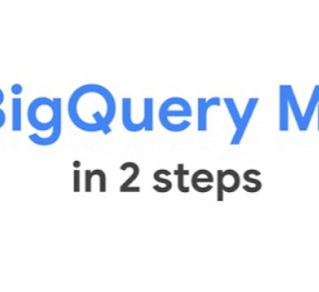

Machine Learning in your Database? The Case For and Against BigQuery ML

Machine Learning in your Database? The Case For and Against BigQuery ML

https://towardsdatascience.com/machine-learning-in-your-database-the-case-for-and-against-bigquery-ml-4f2309282fda

The week has been full of announcements coming from the Google NEXT conferences in which Google has been unveiling their next generation…