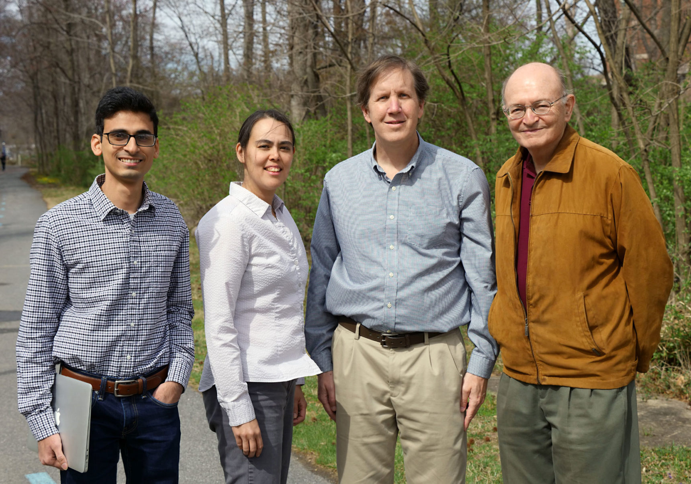
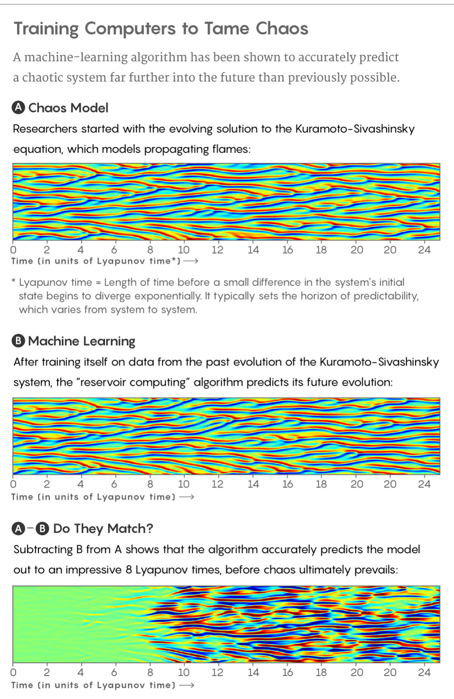

Machine Learning’s ‘Amazing’ Ability to Predict Chaos | Quanta Magazine

###### [chaos theory](https://www.quantamagazine.org/tag/chaos-theory/)

# Machine Learning’s ‘Amazing’ Ability to Predict Chaos

###### *By*[Natalie Wolchover](https://www.quantamagazine.org/authors/natalie/)

*April 18, 2018*

In new computer experiments, artificial-intelligence algorithms can tell the future of chaotic systems.

[(L)](https://www.quantamagazine.org/machine-learnings-amazing-ability-to-predict-chaos-20180418/#comments)

Researchers have used machine learning to predict the chaotic evolution of a model flame front.

[DVDP](https://davidope.com/) for Quanta Magazine

Half a century ago, the pioneers of [chaos theory](https://www.quantamagazine.org/tag/chaos-theory/) discovered that the “butterfly effect” makes long-term prediction impossible. Even the smallest perturbation to a complex system (like the weather, the economy or just about anything else) can touch off a concatenation of events that leads to a dramatically divergent future. Unable to pin down the state of these systems precisely enough to predict how they’ll play out, we live under a veil of uncertainty.

But now the robots are here to help.

In a series of results reported in the journals [*Physical Review Letters*](https://journals.aps.org/prl/pdf/10.1103/PhysRevLett.120.024102) and [*Chaos*](https://arxiv.org/abs/1710.07313), scientists have used [machine learning](https://www.quantamagazine.org/tag/machine-learning/) — the same computational technique behind recent successes in artificial intelligence — to predict the future evolution of chaotic systems out to stunningly distant horizons. The approach is being lauded by outside experts as groundbreaking and likely to find wide application.

“I find it really amazing how far into the future they predict” a system’s chaotic evolution, said [Herbert Jaeger](https://www.jacobs-university.de/directory/hjaeger), a professor of computational science at Jacobs University in Bremen, Germany.

The findings come from veteran chaos theorist [Edward Ott](https://umdphysics.umd.edu/people/faculty/current/item/380-edott.html) and four collaborators at the University of Maryland. They employed a machine-learning algorithm called reservoir computing to “learn” the dynamics of an archetypal chaotic system called the Kuramoto-Sivashinsky equation. The evolving solution to this equation behaves like a flame front, flickering as it advances through a combustible medium. The equation also describes drift waves in plasmas and other phenomena, and serves as “a test bed for studying turbulence and spatiotemporal chaos,” said [Jaideep Pathak](https://ireap.umd.edu/staff/grad/pathak), Ott’s graduate student and the lead author of the new papers.

Jaideep Pathak, Michelle Girvan, Brian Hunt and Edward Ott of the University of Maryland, who (along with Zhixin Lu, now of the University of Pennsylvania) have shown that machine learning is a powerful tool for predicting chaos.

Faye Levine/University of Maryland

After training itself on data from the past evolution of the Kuramoto-Sivashinsky equation, the researchers’ reservoir computer could then closely predict how the flamelike system would continue to evolve out to eight “Lyapunov times” into the future, eight times further ahead than previous methods allowed, loosely speaking. The Lyapunov time represents how long it takes for two almost-identical states of a chaotic system to exponentially diverge. As such, it typically sets the horizon of predictability.

“This is really very good,” [Holger Kantz](https://www.pks.mpg.de/~kantz/), a chaos theorist at the Max Planck Institute for the Physics of Complex Systems in Dresden, Germany, said of the eight-Lyapunov-time prediction. “The machine-learning technique is almost as good as knowing the truth, so to say.”

The algorithm knows nothing about the Kuramoto-Sivashinsky equation itself; it only sees data recorded about the evolving solution to the equation. This makes the machine-learning approach powerful; in many cases, the equations describing a chaotic system aren’t known, crippling dynamicists’ efforts to model and predict them. Ott and company’s results suggest you don’t need the equations — only data. “This paper suggests that one day we might be able perhaps to predict weather by machine-learning algorithms and not by sophisticated models of the atmosphere,” Kantz said.

Besides weather forecasting, experts say the machine-learning technique could help with monitoring cardiac arrhythmias for signs of impending heart attacks and monitoring neuronal firing patterns in the brain for signs of neuron spikes. More speculatively, it might also help with predicting rogue waves, which endanger ships, and possibly even earthquakes.

Ott particularly hopes the new tools will prove useful for giving advance warning of solar storms, like the one that erupted across 35,000 miles of the sun’s surface in 1859. That magnetic outburst created aurora borealis visible all around the Earth and blew out some telegraph systems, while generating enough voltage to allow other lines to operate with their power switched off. If such a solar storm lashed the planet unexpectedly today, experts say it would severely damage Earth’s electronic infrastructure. “If you knew the storm was coming, you could just turn off the power and turn it back on later,” Ott said.

[DOI: 10.1103/PhysRevLett.120.024102](https://journals.aps.org/prl/pdf/10.1103/PhysRevLett.120.024102)

He, Pathak and their colleagues [Brian Hunt](http://www.chaos.umd.edu/~bhunt/), [Michelle Girvan](http://www.networks.umd.edu/) and [Zhixin Lu](https://sites.google.com/view/zhixin-lu-site) (who is now at the University of Pennsylvania) achieved their results by synthesizing existing tools. Six or seven years ago, when the powerful algorithm known as “deep learning” was starting to master AI tasks like image and speech recognition, they started reading up on machine learning and thinking of clever ways to apply it to chaos. They learned of a handful of promising results predating the deep-learning revolution. Most importantly, in the early 2000s, Jaeger and fellow German chaos theorist Harald Haas [made use](http://www.columbia.edu/cu/biology/courses/w4070/Reading_List_Yuste/haas_04.pdf) of a network of randomly connected artificial neurons — which form the “reservoir” in reservoir computing — to learn the dynamics of three chaotically coevolving variables. After training on the three series of numbers, the network could predict the future values of the three variables out to an impressively distant horizon. However, when there were more than a few interacting variables, the computations became impossibly unwieldy. Ott and his colleagues needed a more efficient scheme to make reservoir computing relevant for large chaotic systems, which have huge numbers of interrelated variables. Every position along the front of an advancing flame, for example, has velocity components in three spatial directions to keep track of.

It took years to strike upon the straightforward solution. “What we exploited was the locality of the interactions” in spatially extended chaotic systems, Pathak said. Locality means variables in one place are influenced by variables at nearby places but not by places far away. “By using that,” Pathak explained, “we can essentially break up the problem into chunks.” That is, you can parallelize the problem, using one reservoir of neurons to learn about one patch of a system, another reservoir to learn about the next patch, and so on, with slight overlaps of neighboring domains to account for their interactions.

Parallelization allows the reservoir computing approach to handle chaotic systems of almost any size, as long as proportionate computer resources are dedicated to the task.

*open-quote*

If we have ignorance we should use the machine learning to fill in the gaps where the ignorance resides.

*close-quote*
Edward Ott

Ott explained reservoir computing as a three-step procedure. Say you want to use it to predict the evolution of a spreading fire. First, you measure the height of the flame at five different points along the flame front, continuing to measure the height at these points on the front as the flickering flame advances over a period of time. You feed these data-streams in to randomly chosen artificial neurons in the reservoir. The input data triggers the neurons to fire, triggering connected neurons in turn and sending a cascade of signals throughout the network.

The second step is to make the neural network learn the dynamics of the evolving flame front from the input data. To do this, as you feed data in, you also monitor the signal strengths of several randomly chosen neurons in the reservoir. Weighting and combining these signals in five different ways produces five numbers as outputs. The goal is to adjust the weights of the various signals that go into calculating the outputs until those outputs consistently match the next set of inputs — the five new heights measured a moment later along the flame front. “What you want is that the output should be the input at a slightly later time,” Ott explained.

To learn the correct weights, the algorithm simply compares each set of outputs, or predicted flame heights at each of the five points, to the next set of inputs, or actual flame heights, increasing or decreasing the weights of the various signals each time in whichever way would have made their combinations give the correct values for the five outputs. From one time-step to the next, as the weights are tuned, the predictions gradually improve, until the algorithm is consistently able to predict the flame’s state one time-step later.

“In the third step, you actually do the prediction,” Ott said. The reservoir, having learned the system’s dynamics, can reveal how it will evolve. The network essentially asks itself what will happen. Outputs are fed back in as the new inputs, whose outputs are fed back in as inputs, and so on, making a projection of how the heights at the five positions on the flame front will evolve. Other reservoirs working in parallel predict the evolution of height elsewhere in the flame.

In a plot in their *PRL* paper, which appeared in January, the researchers show that their predicted flamelike solution to the Kuramoto-Sivashinsky equation exactly matches the true solution out to eight Lyapunov times before chaos finally wins, and the actual and predicted states of the system diverge.

The usual approach to predicting a chaotic system is to measure its conditions at one moment as accurately as possible, use these data to calibrate a physical model, and then evolve the model forward. As a ballpark estimate, you’d have to measure a typical system’s initial conditions 100,000,000 times more accurately to predict its future evolution eight times further ahead.

*open-quote*
The machine-learning technique is almost as good as knowing the truth.
*close-quote*
Holger Kantz

That’s why machine learning is “a very useful and powerful approach,” said [Urlich Parlitz](https://www.uni-goettingen.de/en/105320.html) of the Max Planck Institute for Dynamics and Self-Organization in Göttingen, Germany, who, like Jaeger, also applied machine learning to low-dimensional chaotic systems in the early 2000s. “I think it’s not only working in the example they present but is universal in some sense and can be applied to many processes and systems.” In a paper soon to be published in *Chaos*, Parlitz and a collaborator applied reservoir computing to predict the dynamics of “excitable media,” such as cardiac tissue. Parlitz suspects that deep learning, while being more complicated and computationally intensive than reservoir computing, will also work well for tackling chaos, as will other machine-learning algorithms. Recently, researchers at the Massachusetts Institute of Technology and ETH Zurich [achieved similar results](https://arxiv.org/abs/1803.03365) as the Maryland team using a “long short-term memory” neural network, which has recurrent loops that enable it to store temporary information for a long time.

Since the work in their *PRL* paper, Ott, Pathak, Girvan, Lu and other collaborators have come closer to a practical implementation of their prediction technique. In [new research accepted for publication in *Chaos*](https://arxiv.org/pdf/1803.04779.pdf), they showed that improved predictions of chaotic systems like the Kuramoto-Sivashinsky equation become possible by hybridizing the data-driven, machine-learning approach and traditional model-based prediction. Ott sees this as a more likely avenue for improving weather prediction and similar efforts, since we don’t always have complete high-resolution data or perfect physical models. “What we should do is use the good knowledge that we have where we have it,” he said, “and if we have ignorance we should use the machine learning to fill in the gaps where the ignorance resides.” The reservoir’s predictions can essentially calibrate the models; in the case of the Kuramoto-Sivashinsky equation, accurate predictions are extended out to 12 Lyapunov times.

The duration of a Lyapunov time varies for different systems, from milliseconds to millions of years. (It’s a few days in the case of the weather.) The shorter it is, the touchier or more prone to the butterfly effect a system is, with similar states departing more rapidly for disparate futures. Chaotic systems are everywhere in nature, going haywire more or less quickly. Yet strangely, chaos itself is hard to pin down. “It’s a term that most people in dynamical systems use, but they kind of hold their noses while using it,” said [Amie Wilkinson](https://math.uchicago.edu/~wilkinso/), a professor of mathematics at the University of Chicago. “You feel a bit cheesy for saying something is chaotic,” she said, because it grabs people’s attention while having no agreed-upon mathematical definition or necessary and sufficient conditions. “There is no easy concept,” Kantz agreed. In some cases, tuning a single parameter of a system can make it go from chaotic to stable or vice versa.

### Related:

* * *

1. 1

##### [A Twisted Path to Equation-Free Prediction](https://www.quantamagazine.org/chaos-theory-in-ecology-predicts-future-populations-20151013/)

2. 2

##### [A Brazilian Wunderkind Who Calms Chaos](https://www.quantamagazine.org/artur-avila-is-first-brazilian-mathematician-to-win-fields-medal-20140812/)

3. 3

##### [The New Science of Evolutionary Forecasting](https://www.quantamagazine.org/can-scientists-predict-the-future-of-evolution-20140717/)

Wilkinson and Kantz both define chaos in terms of stretching and folding, much like the repeated stretching and folding of dough in the making of puff pastries. Each patch of dough stretches horizontally under the rolling pin, separating exponentially quickly in two spatial directions. Then the dough is folded and flattened, compressing nearby patches in the vertical direction. The weather, wildfires, the stormy surface of the sun and all other chaotic systems act just this way, Kantz said. “In order to have this exponential divergence of trajectories you need this stretching, and in order not to run away to infinity you need some folding,” where folding comes from nonlinear relationships between variables in the systems.

The stretching and compressing in the different dimensions correspond to a system’s positive and negative “Lyapunov exponents,” respectively. In [another recent paper in *Chaos*](https://aip.scitation.org/doi/abs/10.1063/1.5010300?journalCode=cha)*,* the Maryland team reported that their reservoir computer could successfully learn the values of these characterizing exponents from data about a system’s evolution. Exactly why reservoir computing is so good at learning the dynamics of chaotic systems is not yet well understood, beyond the idea that the computer tunes its own formulas in response to data until the formulas replicate the system’s dynamics. The technique works so well, in fact, that Ott and some of the other Maryland researchers now intend to use chaos theory as a way to better understand the internal machinations of neural networks.

[     ### Natalie Wolchover  *Senior Writer*](https://www.quantamagazine.org/authors/natalie/)

* * *

*April 18, 2018*

[artificial intelligence](https://www.quantamagazine.org/tag/artificial-intelligence/)[chaos theory](https://www.quantamagazine.org/tag/chaos-theory/)[complexity](https://www.quantamagazine.org/tag/complexity/)[computer science](https://www.quantamagazine.org/tag/computer-science/)[machine learning](https://www.quantamagazine.org/tag/machine-learning/)[physics](https://www.quantamagazine.org/tag/physics/)

### Share this article

[(L)](http://www.facebook.com/sharer.php?u=https://www.quantamagazine.org/machine-learnings-amazing-ability-to-predict-chaos-20180418/)[(L)](https://twitter.com/share?url=https://www.quantamagazine.org/machine-learnings-amazing-ability-to-predict-chaos-20180418/&text=Machine%20Learning%E2%80%99s%20%E2%80%98Amazing%E2%80%99%20Ability%20to%20Predict%20Chaos&via=QuantaMagazine)[(L)](https://www.quantamagazine.org/machine-learnings-amazing-ability-to-predict-chaos-20180418/#0)[(L)](https://www.quantamagazine.org/machine-learnings-amazing-ability-to-predict-chaos-20180418/mailto:?subject=Machine%20Learning%E2%80%99s%20%E2%80%98Amazing%E2%80%99%20Ability%20to%20Predict%20Chaos&body=In%20new%20computer%20experiments,%20artificial-intelligence%20algorithms%20can%20tell%20the%20future%20of%20chaotic%20systems.%0A%0Ahttps://www.quantamagazine.org/machine-learnings-amazing-ability-to-predict-chaos-20180418/)

[(L)](https://www.quantamagazine.org/machine-learnings-amazing-ability-to-predict-chaos-20180418/#newsletter)

[Most recent newsletter](http://us1.campaign-archive2.com/home/?u=0d6ddf7dc1a0b7297c8e06618&id=f0cb61321c)