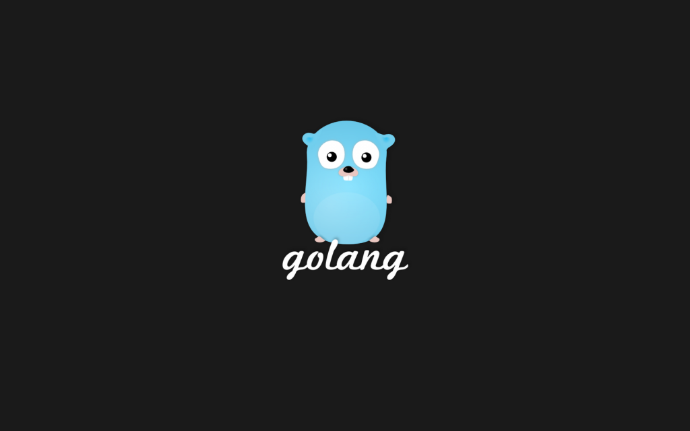

Making a RESTful JSON API in Go - The New Stack

####  [Technology](https://thenewstack.io/category/technology/) / [Tutorials](https://thenewstack.io/category/tutorials/) / [Global](https://thenewstack.io/region/global/)

# Making a RESTful JSON API in Go

#### 26 Nov 2014 10:38am,

by [Cory Lanou](https://thenewstack.io/author/corylanou/)

[(L)](http://twitter.com/share?url=https://thenewstack.io/make-a-restful-json-api-go/&text=Making+a+RESTful+JSON+API+in+Go+)[(L)](http://www.facebook.com/sharer.php?u=https://thenewstack.io/make-a-restful-json-api-go/)[(L)](http://www.linkedin.com/shareArticle?mini=true&url=https://thenewstack.io/make-a-restful-json-api-go/)

 [37](https://thenewstack.io/make-a-restful-json-api-go/#disqus_thread)

In this post, we will not only cover how to use Go to create a RESTful JSON API, but we will also talk about good RESTful design. If you have ever consumed an API in the past that doesn’t follow good design, then you end up writing bad code to consume a bad API. Hopefully, after this article you will have a better idea of what a well behaved API should look like.

## What is a JSON API?

Before JSON, there was XML. Having used XML and JSON both, there is no question that JSON is the clear winner. I’m not going to cover in depth the concept of a JSON API, as it is detailed quite well on [jsonapi.org](http://jsonapi.org/).

**Sponsor Note**

 [SpringOne2GX](https://2015.event.springone2gx.com/schedule/2015-09-15) is a conference for app developers, solution and data architects. Sessions are specifically tailored for developers and architects using the popular open source Spring IO Projects, Groovy & Grails, Cloud Foundry, RabbitMQ, Redis, Geode, Hadoop and Tomcat technologies.

## A Basic Web Server

A RESTful service starts with fundamentally being a web service first. Here is a really basic web server that responds to any requests by simply outputting the request url:

package main
import (
"fmt"
"html"
"log"
"net/http"
)
func main() {
http.HandleFunc("/", func(w http.ResponseWriter, r *http.Request) {
fmt.Fprintf(w, "Hello, %q", html.EscapeString(r.URL.Path))
})
log.Fatal(http.ListenAndServe(":8080", nil))
}

Running this example will spin up a server on port 8080, and can be accessed at [http://localhost:8080](http://localhost:8080/)

## Adding a Router

While the standard library comes with a router, I find that most people are confused about how it works. I’ve used a couple of third party routers in my projects. Most notably I’ve used the [mux router](http://www.gorillatoolkit.org/pkg/mux) from the [Gorilla Web Toolkit](http://www.gorillatoolkit.org/).

Another popular router is from Julien Schmidt called [httprouter](https://github.com/julienschmidt/httprouter).

package main
import (
"fmt"
"html"
"log"
"net/http"
"github.com/gorilla/mux"
)
func main() {
router := mux.NewRouter().StrictSlash(true)
router.HandleFunc("/", Index)
log.Fatal(http.ListenAndServe(":8080", router))
}
func Index(w http.ResponseWriter, r *http.Request) {
fmt.Fprintf(w, "Hello, %q", html.EscapeString(r.URL.Path))
To run this example, you will now need to execute the following command:
go get

This will retrieve the Gorilla Mux package from GitHub at “github.com/gorilla/mux”

The above example creates a basic router, adds the route / and assigns the Index handler to run when that endpoint is called. You will also notice now that before we could ask for http://localhost:8080/foo and that worked. That will no longer work now as there is no route defined. Only [http://localhost:8080](http://localhost:8080/) will be a valid response.

## Creating Some Basic Routes

Now that we have a router in place, it is time to create some more routes.
Let’s assume that we are going to create a basic ToDo app.
package main
import (
"fmt"
"log"
"net/http"
"github.com/gorilla/mux"
)
func main() {
router := mux.NewRouter().StrictSlash(true)
router.HandleFunc("/", Index)
router.HandleFunc("/todos", TodoIndex)
router.HandleFunc("/todos/{todoId}", TodoShow)
log.Fatal(http.ListenAndServe(":8080", router))
}
func Index(w http.ResponseWriter, r *http.Request) {
fmt.Fprintln(w, "Welcome!")
}
func TodoIndex(w http.ResponseWriter, r *http.Request) {
fmt.Fprintln(w, "Todo Index!")
}
func TodoShow(w http.ResponseWriter, r *http.Request) {
vars := mux.Vars(r)
todoId := vars["todoId"]
fmt.Fprintln(w, "Todo show:", todoId)
}
We have now added two more endpoints (or routes)
This is the Todo Index route: http://localhost:8080/todos

THis is the Todo Show route: [http://localhost:8080/todos/{todoId}](http://localhost:8080/todos/%7BtodoId%7D)

This is the beginning of a RESTful design.

Pay close attention to the last route where we added a variable in the route, called todoId: http://localhost:8080/todos/{todoId}

This will allow us to pass in id’s to the route and respond with the proper records.

## A Basic Model

Now that we have routes in place, it’s time to create a basic Todo model that we can send and retrieve data with. In Go, a struct will typically serve as your model. Many other languages use classes for this purpose.

package main
import "time"
type Todo struct {
Name string
Completed bool
Due time.Time
}
type Todos []Todo

Note that in the last line we create another type, called Todos, which is a slice (an ordered collection) of Todo. You will see where this becomes useful shortly.

## Send Back Some JSON

Now that we have a basic model, we can simulate a real response and mock out the TodoIndex with static data.

func TodoIndex(w http.ResponseWriter, r *http.Request) {
todos := Todos{
Todo{Name: "Write presentation"},
Todo{Name: "Host meetup"},
}
json.NewEncoder(w).Encode(todos)
}

For now, we are just creating a static slice of Todos to send back to the client. Now if you requesthttp://localhost:8080/todos, you should get the following response:

[
{
"Name": "Write presentation",
"Completed": false,
"Due": "0001-01-01T00:00:00Z"
},
{
"Name": "Host meetup",
"Completed": false,
"Due": "0001-01-01T00:00:00Z"
}
]

## A Better Model

For any seasoned veterans out there, you have already spotted a problem. As insignificant as it sounds, it’s not idiomatic JSON to have uppercased keys. Here is how you solve that.

package main
import "time"
type Todo struct {
Name string `json:"name"`
Completed bool `json:"completed"`
Due time.Time `json:"due"`
}
type Todos []Todo

By adding struct tags you can control exactly what an how your struct will be marshalled to JSON.

## OK, We Need to Split This Up!

At this point, the project needs a little refactoring. We have too much going on in just a few files.

We are going to now create the following files and move the code around accordingly:

- main.go
- handlers.go
- routes.go
- todo.go

### Handlers.go

package main
import (
"encoding/json"
"fmt"
"net/http"
"github.com/gorilla/mux"
)
func Index(w http.ResponseWriter, r *http.Request) {
fmt.Fprintln(w, "Welcome!")
}
func TodoIndex(w http.ResponseWriter, r *http.Request) {
todos := Todos{
Todo{Name: "Write presentation"},
Todo{Name: "Host meetup"},
}
if err := json.NewEncoder(w).Encode(todos); err != nil {
panic(err)
}
}
func TodoShow(w http.ResponseWriter, r *http.Request) {
vars := mux.Vars(r)
todoId := vars["todoId"]
fmt.Fprintln(w, "Todo show:", todoId)
}

### Routes.go

package main
import (
"net/http"
"github.com/gorilla/mux"
)
type Route struct {
Name string
Method string
Pattern string
HandlerFunc http.HandlerFunc
}
type Routes []Route
func NewRouter() *mux.Router {
router := mux.NewRouter().StrictSlash(true)
for _, route := range routes {
router.
Methods(route.Method).
Path(route.Pattern).
Name(route.Name).
Handler(route.HandlerFunc)
}
return router
}
var routes = Routes{
Route{
"Index",
"GET",
"/",
Index,
},
Route{
"TodoIndex",
"GET",
"/todos",
TodoIndex,
},
Route{
"TodoShow",
"GET",
"/todos/{todoId}",
TodoShow,
},
}

### Todo.go

package main
import "time"
type Todo struct {
Name string `json:"name"`
Completed bool `json:"completed"`
Due time.Time `json:"due"`
}
type Todos []Todo

### Main.go

package main
import (
"log"
"net/http"
)
func main() {
router := NewRouter()
log.Fatal(http.ListenAndServe(":8080", router))
}

## Even Better Routing

As part of our refactoring, we created a much more versatile routes file. This new file now utilizes a struct to contain more detailed information about the route. Specifically, we can now specify the action, such as GET, POST, DELETE, etc.

## Outputting a Web Log

In splitting up the routes file, I also had an ulterior motive. As you will see shortly, it now becomes very easy to decorate my http handlers with additional functionality.

Let’s start with the ability to log out web requests like most modern web servers do. In Go, there is no web logging package or functionality in the standard library, so we have to create it.

We’ll do that by creating a file called logger.go and add the following code:
package main
import (
"log"
"net/http"
"time"
)
func Logger(inner http.Handler, name string) http.Handler {
return http.HandlerFunc(func(w http.ResponseWriter, r *http.Request) {
start := time.Now()
inner.ServeHTTP(w, r)
log.Printf(
"%s\t%s\t%s\t%s",
r.Method,
r.RequestURI,
name,
time.Since(start),
)
})
}

This is a very standard idiom in Go. Effectively we are going to pass our handler to this function, which will then wrap the passed handler with logging and timing functionality.

Next, we will need to utilize the logger decorator in our routes.

## Applying the Logger Decorator

To apply the decorator, when we create the router, we will simply wrap all our current routes in it by updating our NewRouter function:

func NewRouter() *mux.Router {
router := mux.NewRouter().StrictSlash(true)
for _, route := range routes {
var handler http.Handler
handler = route.HandlerFunc
handler = Logger(handler, route.Name)
router.
Methods(route.Method).
Path(route.Pattern).
Name(route.Name).
Handler(handler)
}
return router
}

Now, when you request http://localhost:8080/todos you should see something like this logged at the console:

2014/11/19 12:41:39 GET /todos  TodoIndex       148.324us

## This Routes File is Crazy … Let’s Refactor

Now that the routes file has gotten a little larger, let’s split it to the following files:

- router.go
- routes.go

### Routes.go – redux

package main
import "net/http"
type Route struct {
Name string
Method string
Pattern string
HandlerFunc http.HandlerFunc
}
type Routes []Route
var routes = Routes{
Route{
"Index",
"GET",
"/",
Index,
},
Route{
"TodoIndex",
"GET",
"/todos",
TodoIndex,
},
Route{
"TodoShow",
"GET",
"/todos/{todoId}",
TodoShow,
},
}

### Router.go

package main
import (
"net/http"
"github.com/gorilla/mux"
)
func NewRouter() *mux.Router {
router := mux.NewRouter().StrictSlash(true)
for _, route := range routes {
var handler http.Handler
handler = route.HandlerFunc
handler = Logger(handler, route.Name)
router.
Methods(route.Method).
Path(route.Pattern).
Name(route.Name).
Handler(handler)
}
return router
}

## Taking Some Responsibility

Now that we have some pretty good boilerplate, it’s time to revisit our handlers. We need to be a little more responsible. We will first modify the TodoIndex by adding two lines of code:

func TodoIndex(w http.ResponseWriter, r *http.Request) {
todos := Todos{
Todo{Name: "Write presentation"},
Todo{Name: "Host meetup"},
}
w.Header().Set("Content-Type", "application/json; charset=UTF-8")
w.WriteHeader(http.StatusOK)
if err := json.NewEncoder(w).Encode(todos); err != nil {
panic(err)
}
}

Two things are now happening. First, we are sending back our content type and telling the client to expect json. Second, we are explicitly setting the status code.

Go’s net/http server would have tried to guess the output content type for us (it isn’t always accurate however), but since we definitively know the type, we should always set it ourselves.

## Wait, Where is my Database?

Clearly if we are going to create a RESTful API, we would need somewhere to store and retrieve data. However, that is beyond the scope of this article, so we will simply create a very crude (and not thread safe) mock database.

Create a file called repo.go and add the following content:
package main
import "fmt"
var currentId int
var todos Todos
// Give us some seed data
func init() {
RepoCreateTodo(Todo{Name: "Write presentation"})
RepoCreateTodo(Todo{Name: "Host meetup"})
}
func RepoFindTodo(id int) Todo {
for _, t := range todos {
if t.Id == id {
return t
}
}
// return empty Todo if not found
return Todo{}
}
func RepoCreateTodo(t Todo) Todo {
currentId += 1
t.Id = currentId
todos = append(todos, t)
return t
}
func RepoDestroyTodo(id int) error {
for i, t := range todos {
if t.Id == id {
todos = append(todos[:i], todos[i+1:]...)
return nil
}
}
return fmt.Errorf("Could not find Todo with id of %d to delete", id)
}

### Add ID to Todo

Now that we have a “mock” database, we are using and assigning id, so we will have to update our Todo struct accordingly.

package main
import "time"
type Todo struct {
Id int `json:"id"`
Name string `json:"name"`
Completed bool `json:"completed"`
Due time.Time `json:"due"`
}
type Todos []Todo

### Update our TodoIndex

To use the database, we will need to now retrieve the data in our TodoIndex by modifying the following function:

func TodoIndex(w http.ResponseWriter, r *http.Request) {
w.Header().Set("Content-Type", "application/json; charset=UTF-8")
w.WriteHeader(http.StatusOK)
if err := json.NewEncoder(w).Encode(todos); err != nil {
panic(err)
}
}

### Posting JSON

So far, we have only output JSON, now it’s time to take in and store some JSON.
Add the following route to the routes.go file:
Route{
"TodoCreate",
"POST",
"/todos",
TodoCreate,
},

### The Create endpoint

Now we have to add the create endpoint to the handlers file.
func TodoCreate(w http.ResponseWriter, r *http.Request) {
var todo Todo
body, err := ioutil.ReadAll(io.LimitReader(r.Body, 1048576))
if err != nil {
panic(err)
}
if err := r.Body.Close(); err != nil {
panic(err)
}
if err := json.Unmarshal(body, &todo); err != nil {
w.Header().Set("Content-Type", "application/json; charset=UTF-8")
w.WriteHeader(422) // unprocessable entity
if err := json.NewEncoder(w).Encode(err); err != nil {
panic(err)
}
}
t := RepoCreateTodo(todo)
w.Header().Set("Content-Type", "application/json; charset=UTF-8")
w.WriteHeader(http.StatusCreated)
if err := json.NewEncoder(w).Encode(t); err != nil {
panic(err)
}
}

The first thing we do is open up the body of the request. Notice that we use io.LimitReader. This is a good way to protect against malicious attacks on your server. Imagine if someone wanted to send you 500GBs of json!

After we have read the body, we then Unmarshal it to our Todo struct. If that fails, we will do the right thing and not only respond with the appropriate status code, 422, but we will also send back the error in a json string. This will allow the client to understand not only that something went wrong, but we have the ability to communicate specifically what went wrong.

Finally, if all has gone well, we send back the status code of 201, which means that the entity was successfully created. We also send back the json representation of entity we created, as it contains an id that the client will likely need for their next step.

### Post some JSON

Now that we have our fake repo and our “create” endpoint, it’s time to post some data. I use curl to do so via the following command:

curl -H "Content-Type: application/json" -d '{"name":"New Todo"}' http://localhost:8080/todos

Now, if you go to http://localhost/todos we should see the following response:
[
{
"id": 1,
"name": "Write presentation",
"completed": false,
"due": "0001-01-01T00:00:00Z"
},
{
"id": 2,
"name": "Host meetup",
"completed": false,
"due": "0001-01-01T00:00:00Z"
},
{
"id": 3,
"name": "New Todo",
"completed": false,
"due": "0001-01-01T00:00:00Z"
}
]

## Things We Didn’t Do

While we are off to a great start, there is a lot left to do. Things we haven’t addressed are:

- Version Control – What if we need to modify the API and that results in a breaking change? Might we add /v1/prefix to all our routes to start with?
- Authentication – Unless this is a free/public API, we probably need some authentication. I suggest learning about [JSON web tokens](http://jwt.io/)

eTags – If you are building something that needs to scale, you will likely need to implement [eTags](http://en.wikipedia.org/wiki/HTTP_ETag)

## What Else is Left?

As with all projects, things start off small but can quickly spiral out of control. If I was going to take this to the next level and make it production ready, these are just some of the additional things to do:

- Lots of refactoring!
- Create packages for several of these files, such as some JSON helpers, decorators, handlers, and more.
- Testing… oh yes, you can’t forget that. We didn’t do ANY testing here. For a production system, this is a must.

## Can I get the Code?

Yes! Here is a repo with all of the code samples used in this post:
https://github.com/corylanou/tns-restful-json-api

## Summary

The most important thing to me is to remember to be build a responsible API. Sending back proper status codes, content headers, etc is critical to having your API widely adopted. I hope this post gets you started on your own API soon!

[C](http://twitter.com/corylanou)[ory LaNou](http://twitter.com/corylanou) is an experienced software developer with over two decades of experience, and two and a half years of production [Go](http://golang.org/) experience. He is currently a lead instructor at [gSchool](http://galvanize.it/school) where he teaches Go and leads the local Denver Go meetup, aptly called [Denver Gophers](http://www.meetup.com/Denver-Go-Language-User-Group/).

 Feature image from [Startupitis](http://startupitis.blogspot.com/2012/05/golang-its-amazing.html). The image is available on the site to download as wallpaper.

[go](https://thenewstack.io/tag/go/)[Golang](https://thenewstack.io/tag/golang/)[restful api](https://thenewstack.io/tag/restful-api/)

[(L)](http://twitter.com/share?url=https://thenewstack.io/make-a-restful-json-api-go/&text=Making+a+RESTful+JSON+API+in+Go+)[(L)](http://www.facebook.com/sharer.php?u=https://thenewstack.io/make-a-restful-json-api-go/)[(L)](http://www.linkedin.com/shareArticle?mini=true&url=https://thenewstack.io/make-a-restful-json-api-go/)

[37](https://thenewstack.io/make-a-restful-json-api-go/#disqus_thread)