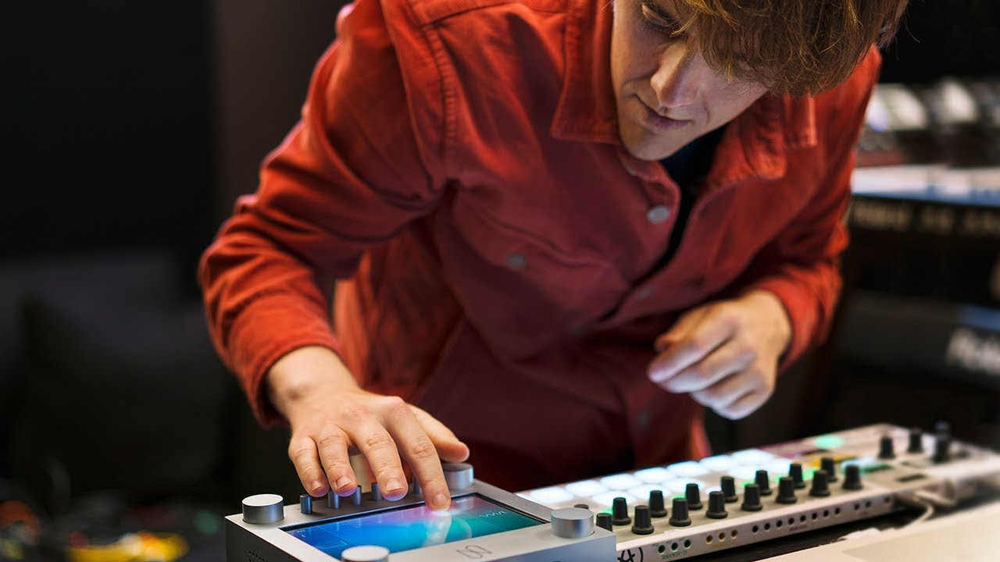
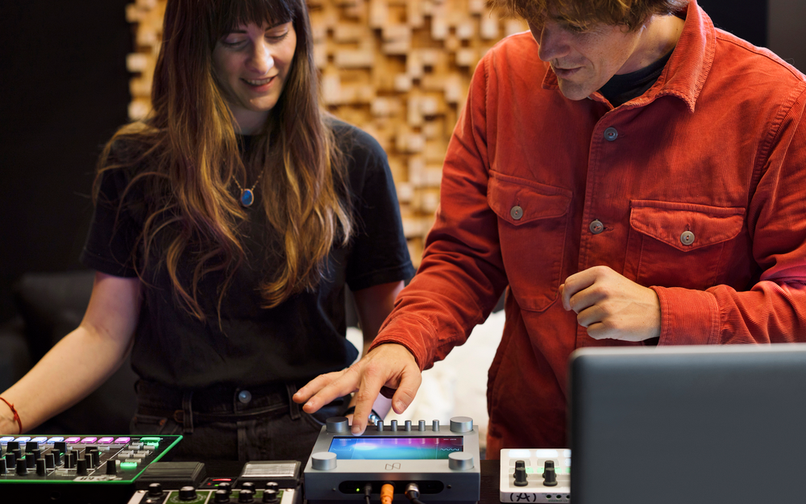
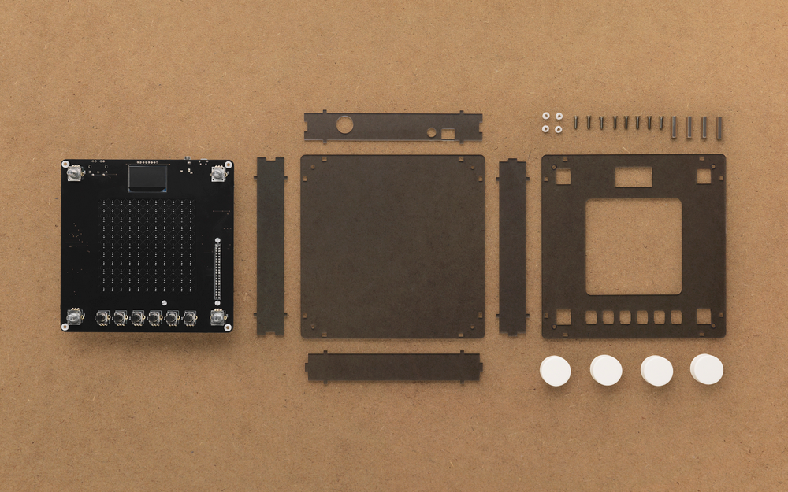

Making music using new sounds generated with machine learning

# Making music using new sounds generated with machine learning

Douglas Eck

Research Scientist, Magenta, Google Brain

Steve Vranakis

Creative Lab

 Published Mar 13, 2018

Technology has always played a role in inspiring musicians in new and creative ways. The guitar amp gave rock musicians a new palette of sounds to play with in the form of feedback and distortion. And the sounds generated by synths helped shape the sound of electronic music. But what about new technologies like machine learning models and algorithms? How might they play a role in creating new tools and possibilities for a musician’s creative process? [Magenta](http://g.co/magenta), a research project within Google, is currently exploring answers to these questions.

Building upon past research in the field of machine learning and music, last year Magenta released [NSynth](https://magenta.tensorflow.org/nsynth) (Neural Synthesizer). It’s a machine learning algorithm that uses deep neural networks to learn the characteristics of sounds, and then create a completely new sound based on these characteristics. Rather than combining or blending the sounds, NSynth synthesizes an entirely new sound using the acoustic qualities of the original sounds—so you could get a sound that’s part flute and part sitar all at once.

Since then, Magenta has continued to experiment with different [musical interfaces](https://magenta.tensorflow.org/nsynth-instrument) and tools to make the algorithm more easily accessible and playable. As part of this exploration, Google Creative Lab and Magenta collaborated to create [NSynth Super](http://g.co/nsynthsuper). It’s an open source experimental instrument which gives musicians the ability to explore new sounds generated with the NSynth algorithm.

 

To create our prototype, we recorded 16 original source sounds across a range of 15 pitches and fed them into the NSynth algorithm. The outputs, over 100,000 new sounds, were then loaded into NSynth Super to precompute the new sounds. Using the dials, musicians can select the source sounds they would like to explore between, and drag their finger across the touchscreen to navigate the new, unique sounds which combine their acoustic qualities. NSynth Super can be played via any MIDI source, like a DAW, sequencer or keyboard.

Part of the goal of Magenta is to close the gap between artistic creativity and machine learning. It’s why we work with a community of artists, coders and machine learning researchers to learn more about how machine learning tools might empower creators. It’s also why we create everything, including NSynth Super, with open source libraries, including [TensorFlow](https://www.tensorflow.org/) and openFrameworks. If you’re maker, musician, or both, all of the source code, schematics, and design templates are available for download on [GitHub](https://github.com/googlecreativelab/open-nsynth-super-staging).

New sounds are powerful. They can inspire musicians in creative and unexpected ways, and sometimes they might go on to define an entirely new musical style or genre. It’s impossible to predict where the new sounds generated by machine learning tools might take a musician, but we're hoping they lead to even more musical experimentation and creativity.

Learn more about NSynth Super at [g.co/nsynthsuper](http://g.co/nsynthsuper).

Posted in:

- [Machine Learning](https://blog.google/topics/machine-learning/)

- Innovation & Technology