Making of Byrne’s Euclid

# Making of Byrne’s Euclid

By Nicholas Rougeux, posted on December 16, 2018 in [Art](https://www.c82.net/blog?cat=16), [Web](https://www.c82.net/blog?cat=12)

Creating a faithful online reproduction of a book considered one of the most beautiful and unusual publications ever published is a daunting task. [Byrne’s Euclid](https://www.c82.net/euclid) is my tribute to Oliver Byrne’s most celebrated publication from 1847 that illustrated the geometric principles established in Euclid’s original Elements from 300 BC.

[Euclid’s Elements](https://en.wikipedia.org/wiki/Euclid%27s_Elements) is a collection of 13 books attributed to Greek mathematician Euclid circa 300 BC and laid the foundation for geometry, number theory, and many core concepts of math and logic still used today. For centuries, the original manuscript and some copied editions were circulated but it wasn’t until shortly after the invention of the printing press in 1440 that it was more widely reproduced starting in 1482.

In 1847, Irish mathematics professor Oliver Byrne worked closely with publisher William Pickering in London to publish his unique edition titled [The First Six Books of the Elements of Euclid in which Coloured Diagrams and Symbols are Used Instead of Letters for the Greater Ease of Learners](https://archive.org/details/firstsixbooksofe00byrn)—or more simply, Byrne’s Euclid. Byrne’s edition was one of the first multicolor printed books and is known for its unique take on Euclid’s original work using colorful illustrations rather than letters when referring to diagrams. The precise use of colors and diagrams meant that the book was very challenging and expensive to reproduce. Little is known about why Byrne only designed 6 of the 13 books but it was could have been due to time and cost involved.

 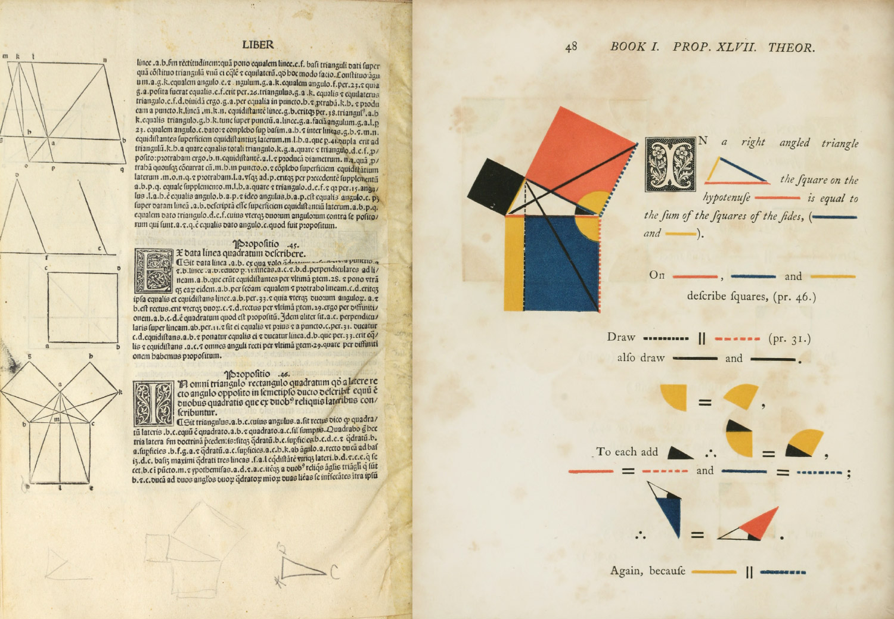

Geometric proof of the pythagorean theorem from the [first printed edition in 1482](https://archive.org/details/preclarissimusli00eucl/page/n21) (bottom left), [Byrne’s colorful rendition in 1847](https://archive.org/details/firstsixbooksofe00byrn/page/48) (right)

 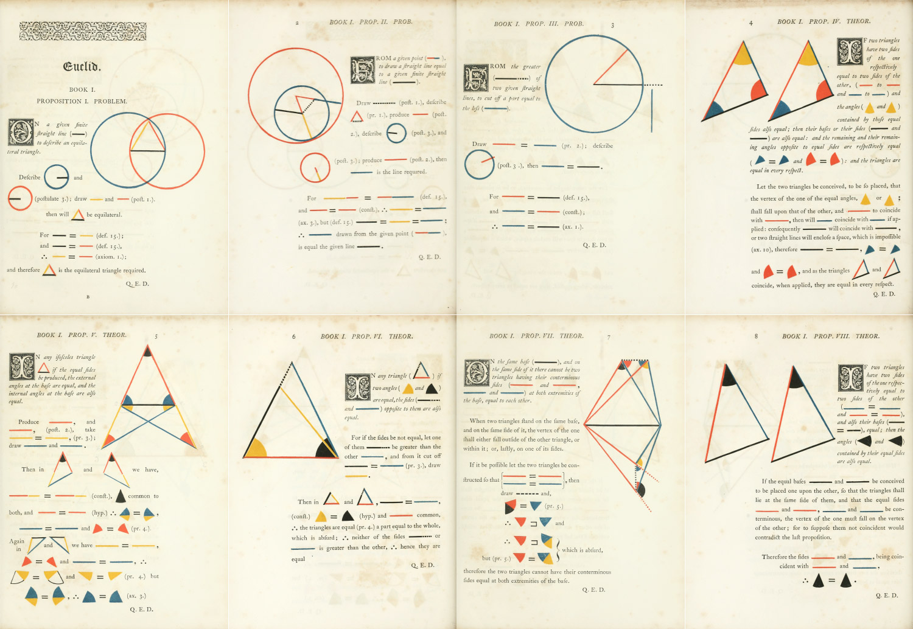
Scans of first eight propositions from Byrne’s Euclid

Byrne’s work was largely ignored and criticized at the time of publication but it has gained renewed interest in recent years in part due to a mention from Edward Tufte in [Envisioning Information](https://www.edwardtufte.com/tufte/books_ei) and a [reproduction by Taschen](https://www.taschen.com/pages/en/catalogue/classics/all/42827/facts.oliver_byrne_the_first_six_books_of_the_elements_of_euclid.htm).

A much more in-depth history of Byrne and his edition of Euclid’s Elements can be found on the Mathematical Association of America’s site by Susan Hawes and Sid Kolpas: [Oliver Byrne: The Matisse of Mathematics](https://www.maa.org/press/periodicals/convergence/oliver-byrne-the-matisse-of-mathematics-byrnes-euclid-geometry-understood-via-color-coded-diagrams).

## Inspiration

I can’t recall when I first learned of Byrne’s edition but it was likely from Tufte or seeing Taschen in passing. Like others, I was drawn to its beautiful diagrams and typography and I’ve long enjoyed looking through the online scans. With the recent success of my reproduction [Werner’s Nomenclature of Colours](https://www.c82.net/werner), I had a renewed interest in doing something to pay tribute to it.

I knew of other projects like [Sergey Slyusarev’s ConTeXt rendition](https://github.com/jemmybutton/byrne-euclid) and [Kronecker Wallis’ modern redesign](https://www.kroneckerwallis.com/product/euclids-elements-completing-oliver-byrnes-work/) but I hadn’t seen anyone reproduce the 1847 edition online in its entirety and with a design true to the original. This was my goal and I knew it was going to be a fun challenge.

## The diagrams

The geometric diagrams are arguably the most famous part of Byrne’s edition so those were one of the most important parts to get right. I wanted to reproduce these as faithfully as possible but also enhance them by adding the ability to interact with them when reading about them. I recreated each one in Illustrator by tracing each one from the [scans at Internet Archive](https://archive.org/details/firstsixbooksofe00byrn) and cleaned up any rough edges or misalignments that were inevitable from the limitations of publishing methods in the 1800s.

 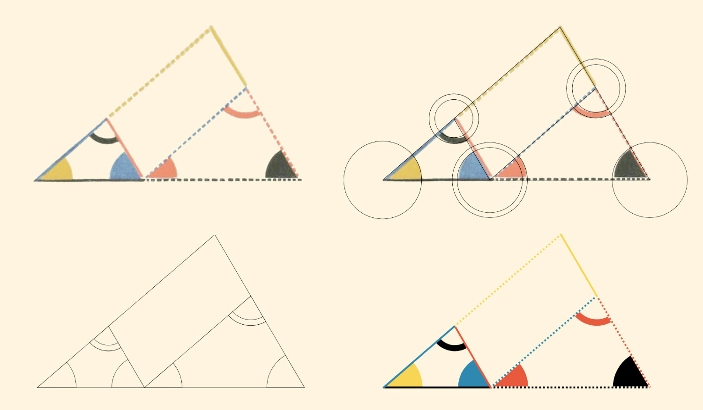

Steps of recreating the diagram from [Book 6, Proposition 4](https://www.c82.net/euclid/book6#prop4)

 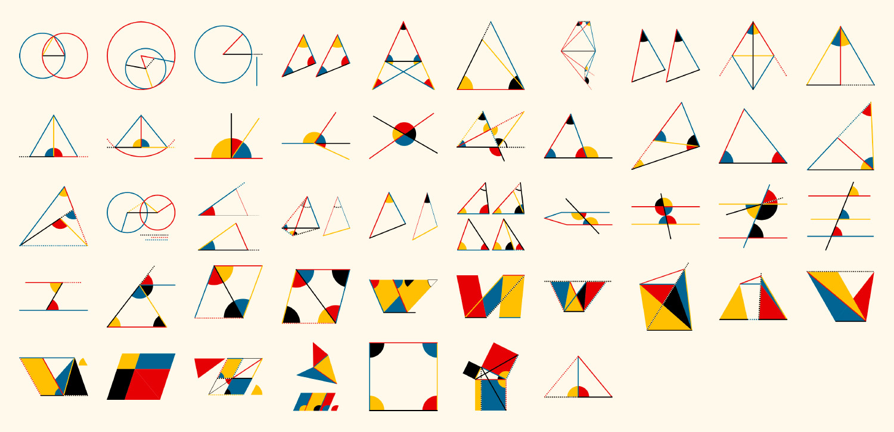
Diagrams from [Book 1](https://www.c82.net/euclid/book1)

## Drawing diagrams

 
Color and style palette

While creating diagrams, I ended up developing a palette of all the styles Byrne used throughout the book so I could easily apply styles to shapes as I created them with the eyedropper tool in Illustrator. He only used four colors (red, blue, yellow, and black), two line styles (solid and dashed), and two line thicknesses (thick and thin). Combined, this created 16 different options for coloring diagrams—more than enough to illustrate the necessary concepts.

I ended up developing a few techniques while creating all the diagrams thanks to Illustrator’s features:

The first was how handle dotted lines that are common throughout the book. Since dotted lines often appear next to solid shapes, the default display would have shown the solid shapes through half of the line so each time a dotted line was needed, I created a solid “transparent” line under it but above the solid color so the entire dotted line is visible. I say “transparent” because it was the same color as the background to give the illusion of a transparent dotted line when it appeared on top of a solid shape. Simply offsetting the line a certain distance from the solid shapes wouldn’t work because I disabled stroke scaling in Illustrator so I could scale them and maintain the same stroke width for all diagrams in the final poster.

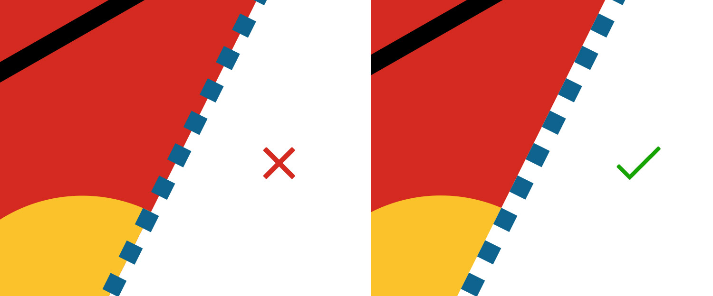

Creating shapes for angles and arcs could have been done by measuring angles calculating sizes but instead, I chose a more exact method that let Illustrator do the work for me with compound shapes. For example, to create the red angle in the diagram below from [Book 3, Proposition 31](https://www.c82.net/euclid/book3#prop31), first I drew the triangle lines for the main diagram, created a temporary copy, drew a circle centered on the left point of the copy, and then created a compound shape from the intersection of the two. No measuring needed and everything aligns perfectly.

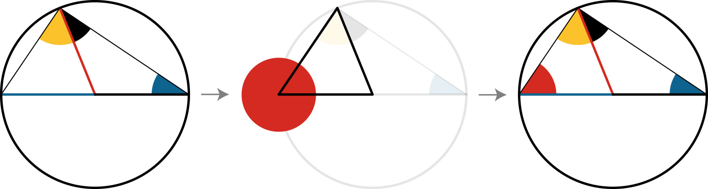

Several diagrams required bisecting angles or lines. A line at an arbitrary angle could be bisected by duplicating the line and rotating around its center by adding 90 degrees.

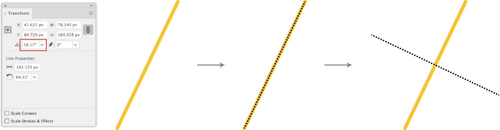

An angle could be bisected by using a technique similar to [Book 1, Proposition 1](https://www.c82.net/euclid/book1/#prop1): Draw a circle centered on the point of the angle, draw a line connecting where it intersects with the angle, duplicate that line, rotate 90 degrees around its center, and extend to the angle point.

Illustrator also helped me out with other aspects of drawing like line extensions, snapping to shapes, snapping to midpoints, and snapping to nearby shapes.

[Book 5](https://www.c82.net/euclid/book5) stands out from the others in that Byrne used smaller symbols to represent the ratios and magnitudes described within it (black circle, red square, yellow triangle, etc.) As a way to keep track of what was used, I created a simple matrix of all possible combinations of shapes, colors, and styles and highlighted those that were used.

 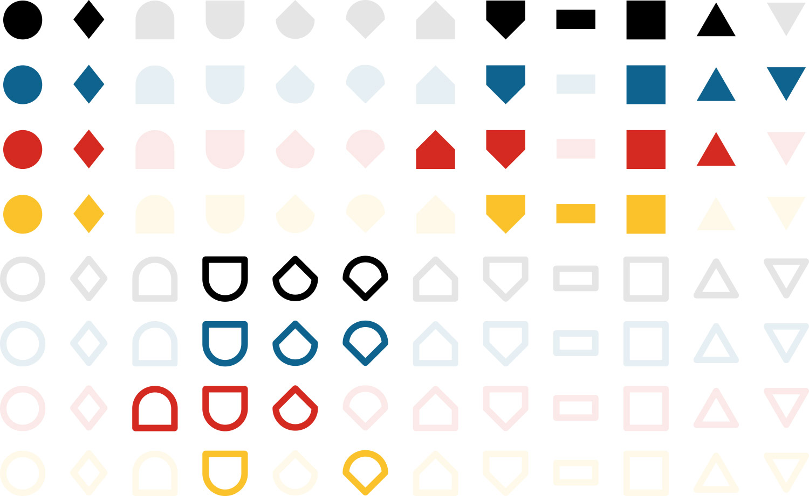

All possible combinations of colors and styles of icons from [Book 5](https://www.c82.net/euclid/book5). Highlighted icons are those that were used.

As a result, there weren’t any diagrams to include in the navigation and so I created summary illustrations based on the core concept of each one. These aren’t in the traditional geometric format of Byrne’s other diagrams but are derived directly from the graphics and formulas he used with the same colors. This is my small contribution to summarizing the definitions and propositions in the fifth book.

## Adding interactivity

I wanted to add interactivity to the diagrams to aid in understanding them because I had some trouble understanding some in the original book. This was done by making each shape in the descriptions clickable and keeping the diagrams visible while scrolling.

Video of the interactive diagram for [Book 6, Prop 4](https://www.c82.net/euclid/book6/#prop4)

This meant the diagrams needed to be exported from Illustrator as SVGs which were then added to the site and corresponding miniature versions of each shape needed to be created so they could be clicked in the descriptions. This process was the most time consuming but also the most enjoyable because each diagram came to life as I finished the descriptions.

Each shape in the SVG code had classes added to it for controlling the fill and stroke along with a data-name attribute for targeting when a shape in the description was clicked. I also added a data-targets attribute to each clickable shape in the description. The combination of those two let me write a small snippet of code that highlighted the appropriate shapes in the diagrams when shapes the descriptions were clicked. For example, clicking the red angle highlights the red angle as shown in the example video above.

Since many miniature shapes in the descriptions were repeated, I created a small reusable snippets for common shapes (blue line, red line, yellow line, etc.) and even reusable snippets specific to each proposition (red angle, blue square, etc.) and make it easier to write the descriptions rather than copying and pasting a lot of SVG code.

My process for creating the diagrams was the following:

1. Recreate the original diagram in Illustrator

2. Export SVG code

3. Add SVG code to the site with names for each shape

4. Create snippets of code for miniature shapes in descriptions

5. Write the descriptions
 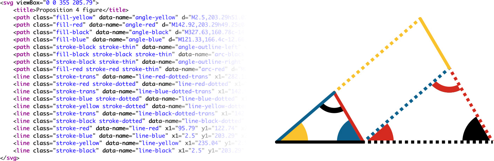

SVG code (left) and resulting diagram (right) for [Book 6, Proposition 4](https://www.c82.net/euclid/book6/#prop4) with added classes for styling and data attributes for interactivity

## Typography

The beautiful typography was a big reason why I wanted to recreate Byrne’s edition. I love the Caslon typeface, its old style figures, ligatures, and the decorative initials at the beginning of each section. I’ve always found older typography aesthetically pleasing.

 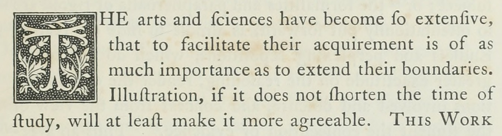

First couple sentences of the [introduction](https://archive.org/details/firstsixbooksofe00byrn/page/n9)

Fortunately, it’s [well known](https://www.maa.org/press/periodicals/convergence/oliver-byrne-the-matisse-of-mathematics-byrnes-euclid-geometry-understood-via-color-coded-diagrams) that the typeface used was Caslon and Adobe had a [version](https://fonts.adobe.com/fonts/adobe-caslon) of it available which supports these features I enjoy so much, so using that was a simple choice.

### Initials

The decorative initials were [created as wood engravings](https://www.maa.org/press/periodicals/convergence/oliver-byrne-the-matisse-of-mathematics-byrnes-euclid-geometry-understood-via-color-coded-diagrams) by Mary Byfield in 1843 and were originally displayed in [Alphabets, Numerals & Devices of the Middle Ages](https://archive.org/details/alphabetsnumeral00shaw). They’re a beautiful complement to the modernness of the geometric diagrams and I felt it was important to reproduce them as well. Rather than using raster images for each one or SVG shapes, I created a custom font by tracing them in Illustrator and converting the shapes to a font using [Glyphr Studio](http://www.glyphrstudio.com/). The font is also available to download on the [about page](https://www.c82.net/euclid/about). This allowed me to style the initials through CSS as regular text. Plus, I thought others might enjoy using the font for other projects.

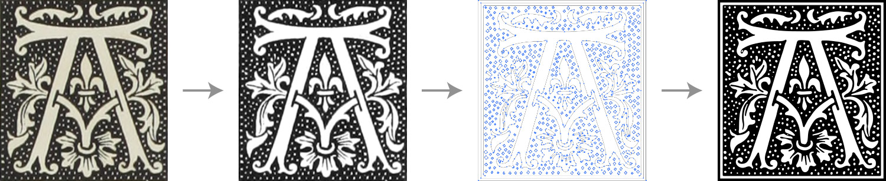
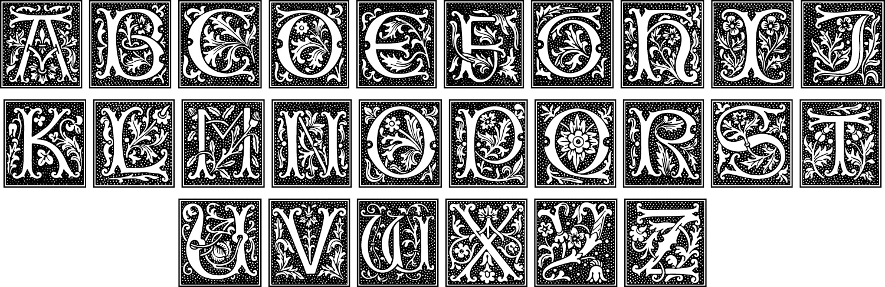

### The long s

The[long s](https://en.wikipedia.org/wiki/Long_s) ( ſ ) was common in older publications and is used throughout the book. Even though it’s commonly mistaken for the lowercase f, I felt reproducing it was also important to stay true to the original. It took me a while to get used to reading it and I expect others will take some time to get used to it.

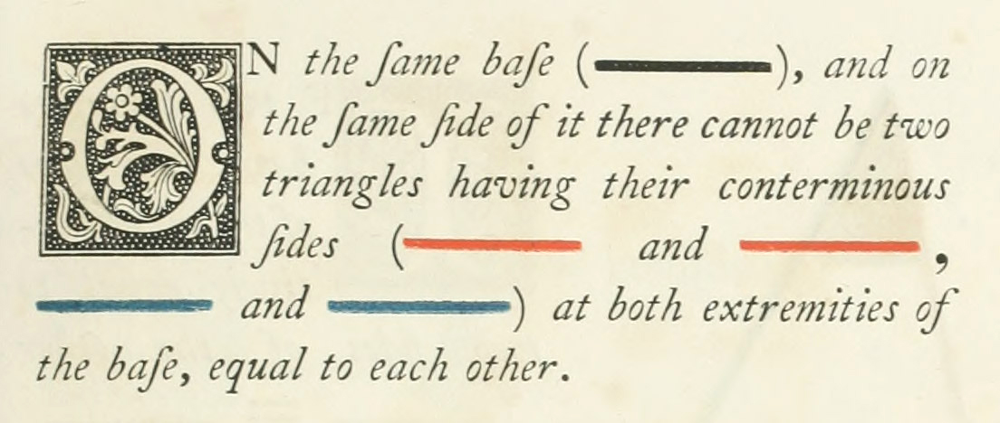
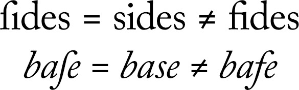

Since the long s is an uncommon character in modern times, I had to find a way to type it frequently and easily. It’s so uncommon that a keyboard shortcut doesn’t exist for in on macOS. Fortunately, it is available as an alternate character on a [medieval keyboard layout](https://folk.uib.no/hnooh/mufi/keyboards/macOSXkeyboard.html). By installing that and setting a [keyboard shortcut for switching keyboard layouts](https://katibapp.com/en/help/arabic-on-mac/), I was able to make the long s available for typing. Any time I needed it, I would type `Cmd + Shift + Space` to switch keyboards, then `Option + S`. Even though extra keystrokes were needed, typing the long s became second nature.

### Special symbols

Byrne used unique alternate designs for common mathematical symbols like greater than (>), less than (<), parallel (∥), etc. These symbols along with other punctuation like periods and semicolons were often enlarged compared to other characters so they were visible when they appear next to other shapes. These unique representations of the symbols were also recreated in the same style but required some extra work to recreate.

 

Traditional (top) and alternate (bottom) designs for symbols from left to right: not equal, greater than, less than, not greater than, not less than, and not parallel.

 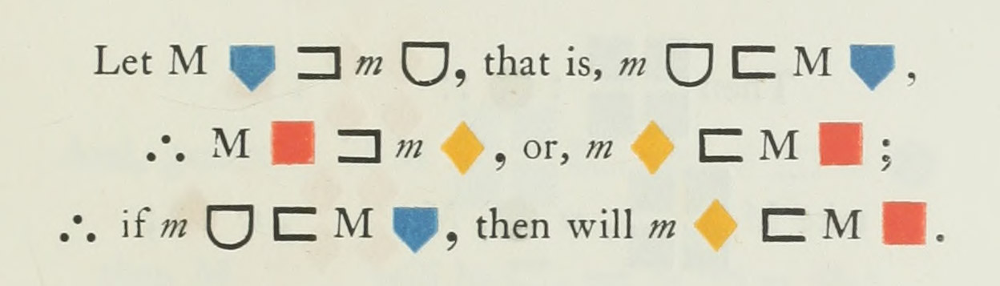

Portion of [Book 5, Proposition B](https://www.c82.net/euclid/book5#propB) with alternate symbol designs and oversized periods, commas, and semicolons for increased visibility

It took some time for me to get used to reading the alternate designs for greater than and less than because they looked like reversed square versions of the traditional angled symbols.

To achieve this, I wrapped each one with its own span tags with an “os” class for “oversized” and put the code for the common symbol inside it. Depending on the symbol, additional classes were added to hide the common symbol and create the alternate shapes or resize it.

- [HTML](https://codepen.io/rougeux/embed/EGyPEJ/?height=259&theme-id=light&default-tab=html,result#html-box)
- [CSS](https://codepen.io/rougeux/embed/EGyPEJ/?height=259&theme-id=light&default-tab=html,result#css-box)
- [Result](https://codepen.io/rougeux/embed/EGyPEJ/?height=259&theme-id=light&default-tab=html,result#result-box)

[EDIT ON](https://codepen.io/rougeux/pen/EGyPEJ)

`
[[NEWLINE]]  &ne;[[NEWLINE]]  &gt;[[NEWLINE]]  &lt;[[NEWLINE]]  &ngt;[[NEWLINE]]  &nless;[[NEWLINE]]  &NotDoubleVerticalBar;[[NEWLINE]]
`

≠  ><≯  ≮  ∦
-
-
-

### External CSS

This Pen doesn't use any external CSS resources.

### External JavaScript

This Pen doesn't use any external JavaScript resources.

Interestingly, the symbols for not equal, not greater than, and not less than, only appear in the list of definitions for symbols and abbreviations and not anywhere else in the original book. The symbol for not parallel doesn’t appear in the symbol list but appears in propositions [39](https://www.c82.net/euclid/book1/#prop39) and [40](https://www.c82.net/euclid/book1/#prop40) in the first book.

Finally, I wrote a small script runs each time the page loads to add the title attributes to each character for additional assistance.

### Equations and groups

Byrne frequently used curly brackets for equations and to avoid repeating text by grouping lines of text or shapes stacked on one another.

 

Scans of various uses of curly brackets (Top to bottom, left to right: [Book 1, Prop. 37](https://archive.org/details/firstsixbooksofe00byrn/page/38); Book 2, Props. [1](https://archive.org/details/firstsixbooksofe00byrn/page/52), [8](https://archive.org/details/firstsixbooksofe00byrn/page/62), [9](https://archive.org/details/firstsixbooksofe00byrn/page/62); Book 5 [Prop. 3](https://archive.org/details/firstsixbooksofe00byrn/page/148); [Definition 5](https://archive.org/details/firstsixbooksofe00byrn/page/152))

I’ve always had a soft spot for the elegance of mathematical typography so reproducing these with shapes was an exciting challenge. To give you a sense of how much I enjoy mathematical typography, I digress with a short story:

Back in college, my calculus professor told us the day before the final exam that we were allowed to use cheat sheet. We were allowed to write as much as we could fit on the front and back of a 5 x 7 index card to reference during the exam. While everyone else arrived the next day with formulas scribbled on their cards by hand, I spent the evening joyfully typesetting every formula we learned using [MathType](http://www.dessci.com/en/products/mathtype/) and CorelDraw carefully organizing everything with labels and descriptions printed on a high quality laser printer in very tiny but legible text. I only needed one side of the card. Each cheatsheet was subject to review by the teacher. I stated that she never said we couldn’t use a computer to create a cheat sheet. She reluctantly agreed, I easily passed the exam, and she said she’d be changing the rules on future exams.

I planned on using [MathJax](https://www.mathjax.org/) to handle all the formatting of equations, curly brackets, and the fractions that prevalent in [Book 5](https://www.c82.net/euclid/book5). However, I found this proved more troublesome than helpful—likely due in part to my inexperience with it:

- I got it to work with some initial testing if I used a combination of[MathML and the semantics element](https://groups.google.com/forum/#!topic/mathjax-users/lnZFZh62BR8) but this was hacky at best. Plus, once I started adding these to the final project, the shapes didn’t always appear or if they did, they weren’t sized correctly.

- MathJax added a lot of extra markup for browser compatibility and accessibility. These were good but limited my formatting options.

- MathJax used a font that was similar to Caslon but not the same so fractions stuck out like a sore thumb compared to surrounding text. Configuring it to use Caslon resulting in odd spacing.

- The shorthand code for things like the fractions in Book 5 would appear for a few seconds before being replaced by the formatted text after MathJax ran. This caused content to jump around a lot as it was parsed. However, I did find the online[MathType demo](http://www.wiris.com/editor/demo/en/developers) useful in generating the shorthand I initially used.

At first, I stopped using MathJax for curly brackets and relied on it for fractions. However, while there are a lot of fractions in Book 5, there aren’t many anywhere else so using a large library like MathJax for a small purpose felt like overkill. Ultimately, I decided to remove MathJax entirely because I felt I was trying to fit a round peg in a square hole and kill a fly with a shotgun. This meant I needed to develop my own solution for flexible curly brackets and fractions.

Fractions were relatively easy by using markup similar in structure to MathML:

- [HTML](https://codepen.io/rougeux/embed/roLxQR/?height=265&theme-id=light&default-tab=html,result#html-box)
- [CSS](https://codepen.io/rougeux/embed/roLxQR/?height=265&theme-id=light&default-tab=html,result#css-box)
- [Result](https://codepen.io/rougeux/embed/roLxQR/?height=265&theme-id=light&default-tab=html,result#result-box)

[EDIT ON](https://codepen.io/rougeux/pen/roLxQR)

`
[[NEWLINE]]  [[NEWLINE]]    A[[NEWLINE]]    /[[NEWLINE]]    B[[NEWLINE]]  [[NEWLINE]]
`

A/B
-
-
-

### External CSS

This Pen doesn't use any external CSS resources.

### External JavaScript

This Pen doesn't use any external JavaScript resources.

This let me create fractions with minimal markup and gave me the flexibility to format them as I needed so they matched the rest of the site.

 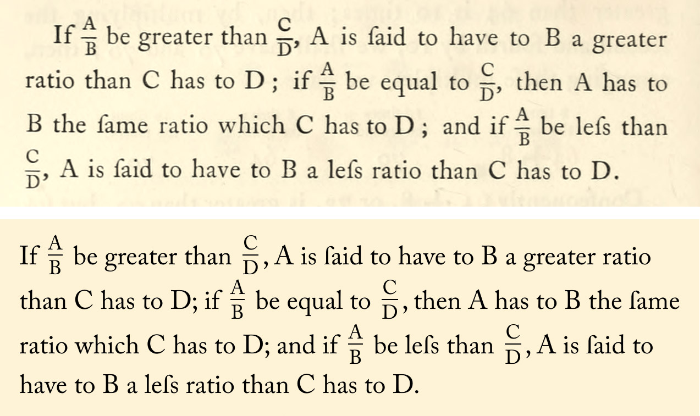

Comparison of paragraph with fractions from Book 5, Proposition 8 between [original](https://archive.org/details/firstsixbooksofe00byrn/page/172) (top) and [my reproduction](https://www.c82.net/euclid/book5/#prop8) (bottom)

I went through a couple iterations to get brackets and other grouped content working well. First, I came up with a standard format for any content that needed to be stacked which I called a group:

…
…
…

.group {
align-items: stretch;
display: inline-flex;
margin: 0.3rem 0;
vertical-align: middle;
}

This basic structure allowed me to specify any text per row within the group body and keep it contained for displaying on its own line like for [Book 1, Proposition 37](https://www.c82.net/euclid/book1/#prop37) or inline with other content like for [Book 5, Proposition 1](https://www.c82.net/euclid/book5/#prop1) or [Book 2, Proposition 12](https://www.c82.net/euclid/book2/#prop12). The display: inline-flex rule let me manage the curly brackets that would eventually be placed inside each group before and after the group-body. I even used these for [Book 5, Proposition 8](https://www.c82.net/euclid/book5#prop8) to create the instances where a black triangle and red square needed to be displayed on top of each other.

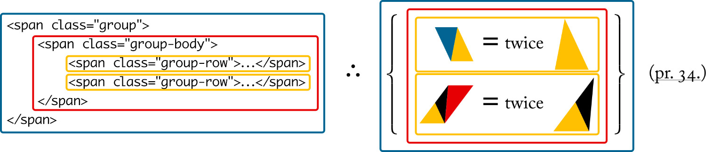

My first attempt at curly brackets was with pseudo elements based on data attributes and varying classes for sizes:

…
.group-fence:before { content: data-open; … }
.group-fence3 { font-size: 3rem; … }

This didn’t work because the brackets were generated by CSS, not in the HTML, and effectively invisible, which wasn’t very semantic or accessible. It also meant I had to specify different classes just for sizes (.group-fence2, .group-fence3, etc.) which wouldn’t always line up with the rows. The curly bracket character for the Caslon typeface also has a very large [em square](https://iamvdo.me/en/blog/css-font-metrics-line-height-and-vertical-align) which can’t be changed by CSS. Enlarging the font size meant the em square often ended up overlapping other text and clickable shapes as shown below. Plus, the huge brackets looked clunky—even if I used other typefaces.

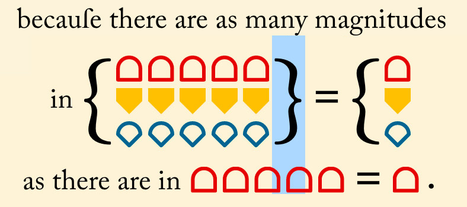

My second attempt was based on how MathJax generates its brackets by creating separate elements for the upper, middle, lower, and extension elements using curly bracket characters. MathJax creates multiple extension elements based on the height needed—each resized to be very small so they behave like building blocks. I liked this approach and found it clever but didn’t like all the extra HTML generated for the extension elements.

 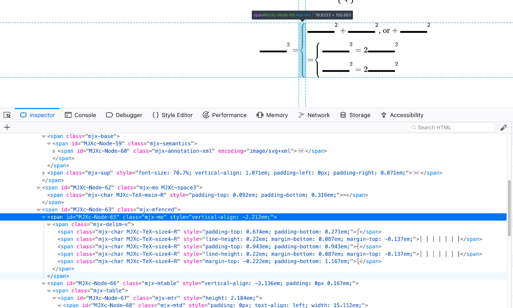

Screenshot of an early proof of concept highlighting the bracket generated by MathJax

My third and final approach built on what I learned about how curly brackets were handled by MathJax and and a more flexible approach I devised. Each group has brackets included in the HTML for reference but then replaced with custom SVG shapes with a little JavaScript for the upper, middle, lower, and extension elements. The extension elements are then stretched with CSS instead of enlarged with a font size setting to fill the gaps left over by the upper, lower, and middle parts.

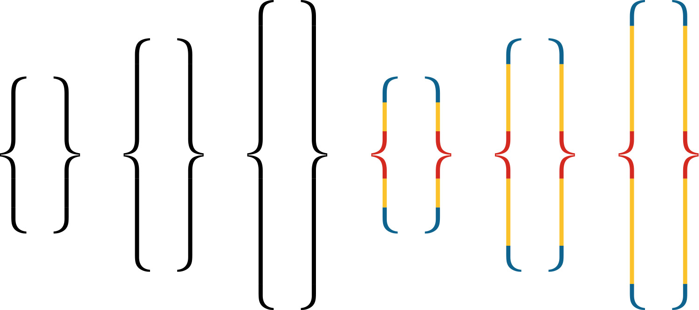

The code below is a working example. It also worked well for the occasional set of enlarged parentheses minus the middle part.

- [HTML](https://codepen.io/rougeux/embed/zyBrgg/?height=265&theme-id=light&default-tab=html,result#html-box)
- [CSS](https://codepen.io/rougeux/embed/zyBrgg/?height=265&theme-id=light&default-tab=html,result#css-box)
- [JS](https://codepen.io/rougeux/embed/zyBrgg/?height=265&theme-id=light&default-tab=html,result#js-box)
- [Result](https://codepen.io/rougeux/embed/zyBrgg/?height=265&theme-id=light&default-tab=html,result#result-box)

[EDIT ON](https://codepen.io/rougeux/pen/zyBrgg)

`
[[NEWLINE]]  A group[[NEWLINE]]  [[NEWLINE]]    {[[NEWLINE]]    [[NEWLINE]]      [[NEWLINE]]        <i class="icon"></i>[[NEWLINE]]        <i class="icon"></i>[[NEWLINE]]        <i class="icon"></i>[[NEWLINE]]        <i class="icon"></i>[[NEWLINE]]      [[NEWLINE]]      [[NEWLINE]]        <i class="icon"></i>[[NEWLINE]]        <i class="icon"></i>[[NEWLINE]]        <i class="icon"></i>[[NEWLINE]]        <i class="icon"></i>[[NEWLINE]]      [[NEWLINE]]      [[NEWLINE]]        <i class="icon"></i>[[NEWLINE]]        <i class="icon"></i>[[NEWLINE]]        <i class="icon"></i>[[NEWLINE]]        <i class="icon"></i>[[NEWLINE]]      [[NEWLINE]]      [[NEWLINE]]        <i class="icon"></i>[[NEWLINE]]        <i class="icon"></i>[[NEWLINE]]        <i class="icon"></i>[[NEWLINE]]        <i class="icon"></i>[[NEWLINE]]      [[NEWLINE]]    [[NEWLINE]]    }[[NEWLINE]]  [[NEWLINE]]  with curly brackets[[NEWLINE]]
`

A group********************************with curly brackets

-
-
-

### External CSS

This Pen doesn't use any external CSS resources.

### External JavaScript

1. https://cdnjs.cloudflare.com/ajax/libs/jquery/3.3.1/jquery.min.js

This approach worked really well and didn’t suffer from the same drawbacks as the other two attempts and the curly brackets were always the correct size.

 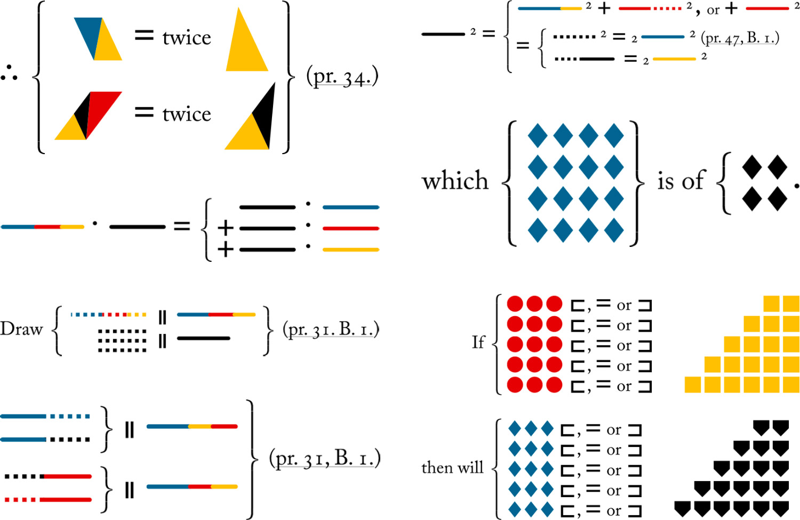

Various uses of custom curly brackets (Top to bottom, left to right: [Book 1, Prop. 37](https://www.c82.net/euclid/book1/#prop37); Book 2, Props. [1](https://www.c82.net/euclid/book2/#prop1), [8](https://www.c82.net/euclid/book2/#prop8), [9](https://www.c82.net/euclid/book2/#prop9); Book 5 [Prop. 3](https://www.c82.net/euclid/book5/#prop3); [Definition 5](https://www.c82.net/euclid/book5/#def5))

This format also worked great for the occasional equations with nested groups with no additional adjustments as in propositions [8](https://www.c82.net/euclid/book2/#prop8) and [9](https://www.c82.net/euclid/book2/#prop9) in Book 2.

One final task was creating groups of equations that were aligned at any given symbol like equals (=) as in [Book 2, Proposition 6](https://www.c82.net/euclid/book2#prop6) or the propositions and analogies as in [Book 5, Proposition 23](https://www.c82.net/euclid/book5#prop23). Using the same group structure, I assigned an “aligned” class to those that needed to be aligned and an “align” class to the target symbol at which each row was to be aligned. Then, a script runs each time the page loads to calculate which of the target symbols id farthest from the left and adds padding to the others to match.

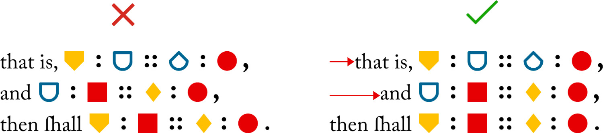

Typography played a big role in this project from primary font to fully custom curly brackets, a lot was taken into account to create a design as true to the original as possible.

## Putting it all together

The site is organized into a few main sections: Books 1–6 and ancillary material (about, symbol, glossary, and posters). I originally thought about creating a page for each proposition but this seemed excessive and would have slowed down browsing through multiple propositions. Instead, each book has its own page, organized in the same order as in the original. At the top of each book is a “Jump to…” menu to facilitate jumping to any given proposition. This menu also shows thumbnails of each diagram to add some visual interest and differentiate between propositions.

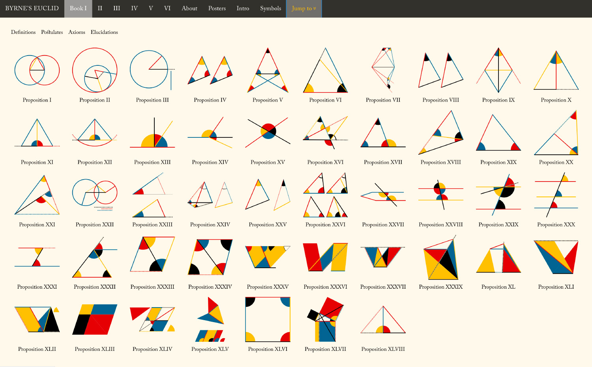

Each proposition, definition, axiom, and postulate has its own ID so deep linking is also available and clicking a thumbnail in any of the jump menus jumps down to that item.

I went through several iterations before settling on the final design of the site?playing with the layout, colors, typography treatments, and more. Below are some early iterations and screenshots of the final result.

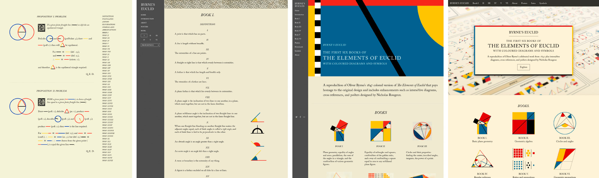

The final result is a complete reproduction of Byrne’s beautiful book, now available online with enhancements like interactive diagrams, cross references, and responsiveness so can be viewed on any device.

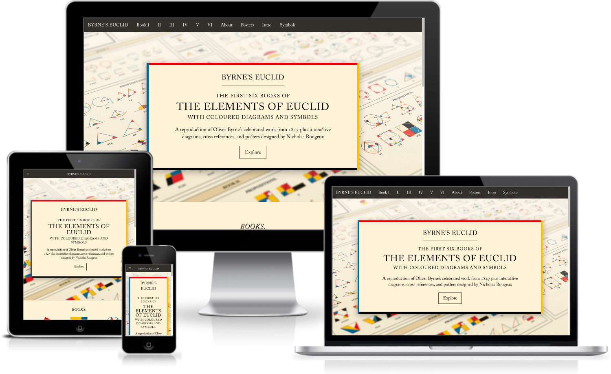

## Posters

From the beginning, I wanted to find a way to put all of Byrne’s beautiful diagrams on one poster and each thumbnail I added to the jump menus confirmed this was a good plan. I had never seen all the diagrams displayed together and found myself opening the menu just to explore them from time to time.

Arranging all 269 diagrams on one poster wasn’t easy and took a few tries to get right. I had several goals:

- Include all diagrams categorized by book (including the custom ones I made for Book 5) and subcategorized by type (propositions, definitions, etc).

- Clearly label groups of diagrams for propositions that had multiple like propositions [8](https://www.c82.net/euclid/book3#prop8) and [20](https://www.c82.net/euclid/book3#prop20) from book 3.

- Keep them in the order they they appear. Unlike the other books, Byrne organized [Book 5](https://www.c82.net/euclid/book5) by presenting definitions between postulates as they were needed to introduce concepts. The numbering also appears haphazard. For example, [definition 14](https://www.c82.net/euclid/book5#def14) appears before [8](https://www.c82.net/euclid/book5#def8) and definitions 1–4 don’t exist even though the first definition is labeled as [5](https://www.c82.net/euclid/book5#def5). It’s confusing and unusual but I wanted to preserve it on the poster.

Initially, I simply took screenshots the jump menus and cobbled them together in a rough composite to see how everything looked as a collection and placed all the diagrams in loosely organized groups organized by book.

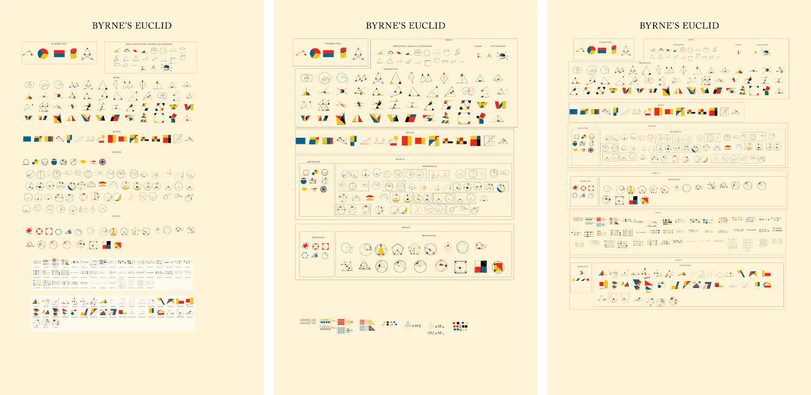

They weren’t fitting as nicely as I had hoped in a portrait poster so I switched to a landscape orientation which worked better but still presented its own challenges because I had trouble finding just the right number of columns for a layout to fit everything comfortably and uniformly. Eventually, I settled on a 15-column grid with a small gutter the same width as the space inside each box.

I initially created the poster in InDesign by placing each diagram as an embedded Illustrator file. I arranged them by rows of equal height but this meant diagrams that were taller or wider than others were resized so their strokes were thinner or thicker, which looked uneven and messy. I wanted all the strokes to be the same width regardless of the diagram size. Stroke width on placed graphics can’t be controlled in InDesign so I recreated the poster in Illustrator and disabled stroke scaling.

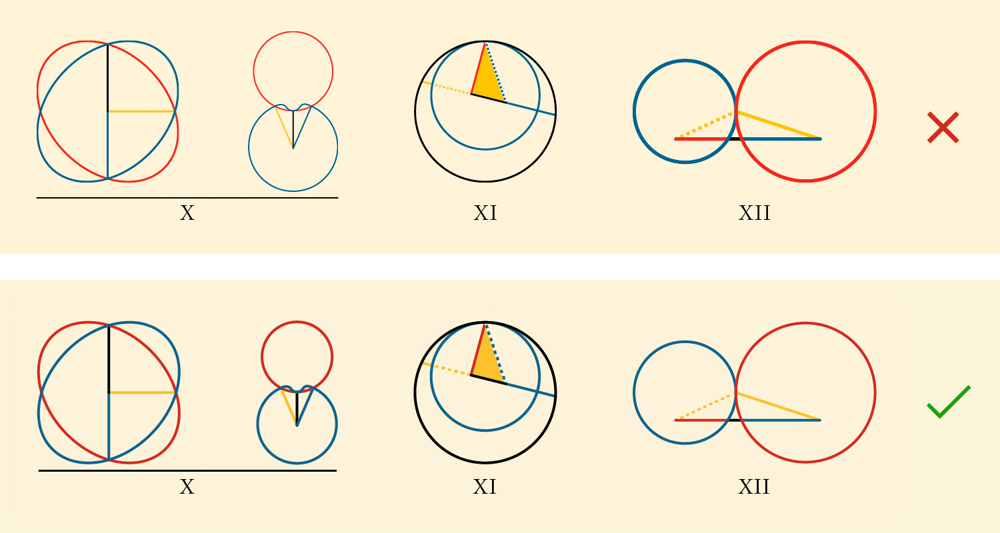

This looked much better and much more consistent. With some final adjustments to make the labels easier to read and shading to differentiate books and the introduction, the final poster came together.

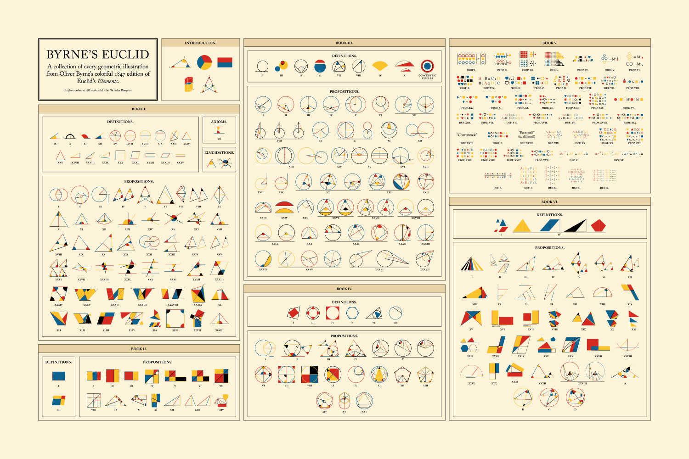
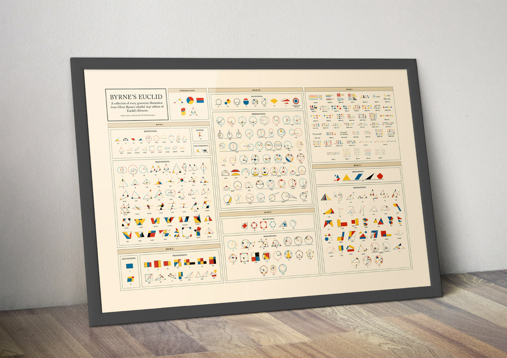
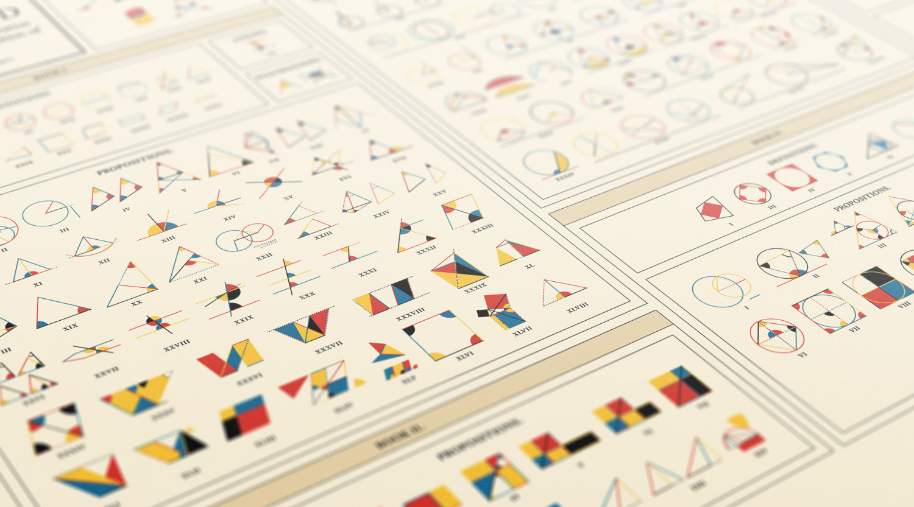
[Order a poster »](https://www.c82.net/euclid/posters)

## Final thoughts

This project was very much a passion project. Over the course of two months, I thoroughly enjoyed the process of figuring out how to design each diagram and tackle each typographical nuance. Even though this project may only appeal to a very small subset of people like myself who enjoy math, typography, and vintage book design, perhaps this new version will expose more to the beauty that is Oliver Byrne’s work.

[Explore Byrne’s Euclid »](https://www.c82.net/euclid)
« [Back to blog](https://www.c82.net/blog)