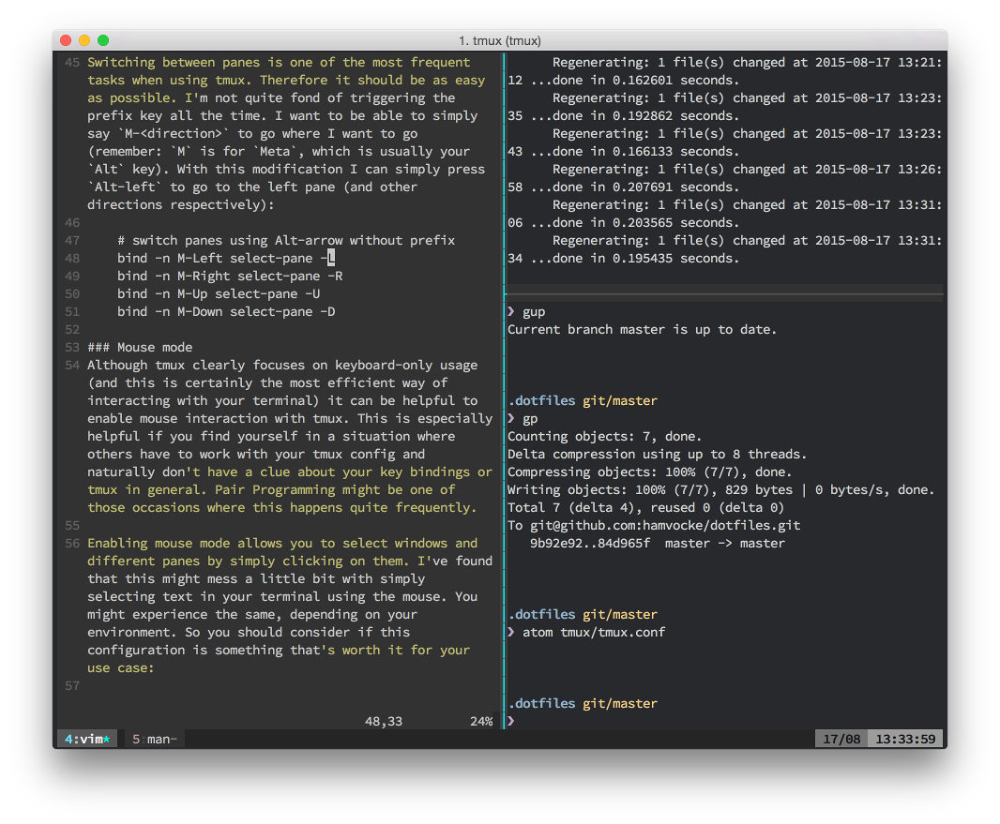

Making tmux Pretty and Usable - A Guide to Customizing your tmux.conf

# Making tmux Pretty and Usable - A Guide to Customizing your tmux.conf

 ** command line

 ** 17 Aug 2015
   ** 9 minutes read

In my [previous blog post](https://www.hamvocke.com/blog/a-quick-and-easy-guide-to-tmux) I gave a quick and easy introduction to tmux and explained how to use tmux with a basic configuration.

If you’ve followed that guide you might have had a feeling that many people have when working with tmux for the first time: “These key combinations are really awkward!”. Rest assured, you’re not alone. Judging from the copious blog posts and dotfiles repos on GitHub there are many people out there who feel the urge to make tmux behave a little different; to make it more comfortable to use.

And actually it’s quite easy to customize the look and feel of tmux. Let me tell you something about the basics of customizing tmux and share some of the configurations I find most useful.

## Customizing tmux

Customizing tmux is as easy as editing a text file. tmux uses a file called `tmux.conf` to store its configuration. If you store that file as `~/.tmux.conf` (**Note:** there’s a period as the first character in the file name. It’s a hidden file) tmux will pick this configuration file for your current user. If you want to share a configuration for multiple users (e.g. if you should feel the urge to start tmux as super user (please think about this carefully!)) you can also put your tmux.conf into a system-wide directory. The location of this directory will be different accross different operating systems. The man page (`man tmux`) will tell you the exact location, just have a look at documentation for the `-f` parameter.

### Less awkward prefix keys

Probably the most common change among tmux users is to change the **prefix** from the rather awkward `C-b` to something that’s a little more accessible. Personally I’m using `C-a` instead but note that this might interfere with bash’s “go to beginning of line” command[1](https://www.hamvocke.com/blog/a-guide-to-customizing-your-tmux-conf/#fn:1). On top of the `C-a` binding I’ve also remapped my Caps Lock key to act as Ctrl since I’m not using Caps Lock anyways. This allows me to nicely trigger my prefix key combo.

To change your prefix from `C-b` to `C-a`, simply add following lines to your tmux.conf:

	# remap prefix from 'C-b' to 'C-a'
	unbind C-b
	set-option -g prefix C-a
	bind-key C-a send-prefix

### Sane Split Commands

Another thing I personally find quite difficult to remember is the pane splitting commands. I mean, seriously? `"` to split vertically and `%` to split horizontally? Who’s supposed to memorize that? I find it helpful to have the characters as a visual representation of the split, so I chose `|` and `-` for splitting panes:

	# split panes using | and -
	bind | split-window -h
	bind - split-window -v
	unbind '"'
	unbind %

### Easy Config Reloads

Since I’m experimenting quite often with my tmux.conf I want to reload the config easily. This is why I have a command to reload my config on `r`:

	# reload config file (change file location to your the tmux.conf you want to use)
	bind r source-file ~/.tmux.conf

### Fast Pane-Switching

Switching between panes is one of the most frequent tasks when using tmux. Therefore it should be as easy as possible. I’m not quite fond of triggering the prefix key all the time. I want to be able to simply say `M-<direction>` to go where I want to go (remember: `M` is for `Meta`, which is usually your `Alt` key). With this modification I can simply press `Alt-left` to go to the left pane (and other directions respectively):

	# switch panes using Alt-arrow without prefix
	bind -n M-Left select-pane -L
	bind -n M-Right select-pane -R
	bind -n M-Up select-pane -U
	bind -n M-Down select-pane -D

### Mouse mode

Although tmux clearly focuses on keyboard-only usage (and this is certainly the most efficient way of interacting with your terminal) it can be helpful to enable mouse interaction with tmux. This is especially helpful if you find yourself in a situation where others have to work with your tmux config and naturally don’t have a clue about your key bindings or tmux in general. Pair Programming might be one of those occasions where this happens quite frequently.

Enabling mouse mode allows you to select windows and different panes by simply clicking on them. I’ve found that this might mess a little bit with simply selecting text in your terminal using the mouse. You might experience the same, depending on your environment. So you should consider if this configuration is something that’s worth it for your use case:

	# Enable mouse control (clickable windows, panes, resizable panes)
	set -g mouse-select-window on
	set -g mouse-select-pane on
	set -g mouse-resize-pane on

**Update for tmux 2.1**:

As Jon Lillie pointed out in the comments, mouse mode has been [rewritten in tmux 2.1](https://github.com/tmux/tmux/blob/master/CHANGES#L6-L13). Once you are on tmux 2.1 (or later) you can activate the new mouse mode with a single command:

	# Enable mouse mode (tmux 2.1 and above)
	set -g mouse on

The new mode is a combination of all the old mouse options and fixes the text selection issues as well.

### Stop renaming windows automatically

I like to give my tmux windows custom names using the `,` key. This helps me naming my windows according to the context they’re focusing on. By default tmux will update the window title automatically depending on the last executed command within that window. In order to prevent tmux from overriding my wisely chosen window names I want to suppress this behavior:

	# don't rename windows automatically
	set-option -g allow-rename off

## Changing the look of tmux

Changing the colors and design of tmux is a little more complex than what I’ve presented so far. You’ll want tmux to give a consistent look which is why you most likely have to change the looks of quite a lot of elements tmux displays. This is why changes to the design often result in plenty of lines in your config. I can only recommend to put these into their own identifiable section within your tmux.conf to be able to change this block of config without accidentaly ripping out some of your precious custom key bindings. I’m using comments, starting with a `#` character to make it visible where the design changes start.

**Credit where credit is due:** I did not create the following design. [/u/dothebarbwa](https://www.reddit.com/user/dothebarbwa) was so kind to [publish](https://www.reddit.com/r/unixporn/comments/3cn5gi/tmux_is_my_wm_on_os_x/) it on [/r/unixporn](https://www.reddit.com/r/unixporn) so it’s his effort and all thanks have to go out to him. Thanks!

Depending on your color scheme (I’m using [base16-ocean-dark](https://github.com/chriskempson/base16)) your resulting tmux will look something like this:

	######################
	### DESIGN CHANGES ###
	######################

	# loud or quiet?
	set-option -g visual-activity off
	set-option -g visual-bell off
	set-option -g visual-silence off
	set-window-option -g monitor-activity off
	set-option -g bell-action none

	#  modes
	setw -g clock-mode-colour colour5
	setw -g mode-attr bold
	setw -g mode-fg colour1
	setw -g mode-bg colour18

	# panes
	set -g pane-border-bg colour0
	set -g pane-border-fg colour19
	set -g pane-active-border-bg colour0
	set -g pane-active-border-fg colour9

	# statusbar
	set -g status-position bottom
	set -g status-justify left
	set -g status-bg colour18
	set -g status-fg colour137
	set -g status-attr dim
	set -g status-left ''
	set -g status-right '#[fg=colour233,bg=colour19,bold] %d/%m #[fg=colour233,bg=colour8,bold] %H:%M:%S '
	set -g status-right-length 50
	set -g status-left-length 20

	setw -g window-status-current-fg colour1
	setw -g window-status-current-bg colour19
	setw -g window-status-current-attr bold
	setw -g window-status-current-format ' #I#[fg=colour249]:#[fg=colour255]#W#[fg=colour249]#F '

	setw -g window-status-fg colour9
	setw -g window-status-bg colour18
	setw -g window-status-attr none
	setw -g window-status-format ' #I#[fg=colour237]:#[fg=colour250]#W#[fg=colour244]#F '

	setw -g window-status-bell-attr bold
	setw -g window-status-bell-fg colour255
	setw -g window-status-bell-bg colour1

	# messages
	set -g message-attr bold
	set -g message-fg colour232
	set -g message-bg colour16

## A Word of Caution

I took care of explaining and documenting all suggested changes in this post to make it easy for you to understand what they do and to decide if this is something you want for your tmux.conf as well.

If you do your amount of research on the web you will find plenty of heavily customized tmux configurations. It’s really tempting to just copy those and call it a day. Please, for your own sake, don’t do that. Trust me, I’ve been there. I can only recommend that you start out with a plain tmux configuration and add modifications one by one. This is the only way to ensure that you are fully conscious of all the changes you have made. And this is the only way you will actually learn something about tmux along the way. That said: go ahead and look up config files others have published. Take these as source of inspiration and choose wisely what you want to take for your own config.

There is some really interesting stuff out there. I’ve seen people doing pure magic with their status bars, displaying all kinds of system information that might be interesting. To apply those changes you’ll most likely exceed the simple one-liners I’ve presented in this post. Often there are special scripts involved that need to be loaded, accompanied by multiple lines of configuration changes. I don’t want to discourage you from using these. Just be aware that this is a more advanced topic where you can certainly screw some stuff up. Make sure to backup your config accordingly.

## Further resources

As I’ve already told you, there are plenty of resources out there where you can find people presenting their tmux.confs in a similar fashion to what I’ve done here. Feel free to browse and search for inspiration. Personally I love reading other people’s blog posts about their tmux configs.

GitHub is also a great source. Simply search for *“tmux.conf”* or repos called *“dotfiles”* to find a vast amount of configurations that are out there.

If you’re especially looking for theming options, I can also recommend having a look at [/r/unixporn](https://reddit.com/r/unixporn) (SFW, in spite of its title). It’s a great place where people showcase their fine-tuned and heavily themed unix environments. Some stuff is really nice, some other stuff is only pretty but mostly dysfunctional. From time to time you find people sharing their tmux.conf as well, you can also deliberately search for the term “tmux.conf” to find what you’re looking for.

You can also find my complete tmux.conf (along with other configuration files I’m using on my systems) on my personal [dotfiles repo](https://github.com/hamvocke/dotfiles) on GitHub.

* * *

**Footnotes**

1.   although you can still invoke “go to beginning of line” by typing `C-a C-a` [↩](https://www.hamvocke.com/blog/a-guide-to-customizing-your-tmux-conf/#fnref:1)

 

#### Ham Vocke

Ham is a software developer at [Stack Overflow](https://www.stackoverflow.com/). Previously, he was a consultant at [ThoughtWorks](https://www.thoughtworks.com/). He helps teams deliver software and spreads his excitement about learning new things. If he's not writing code he's probably annoying others with his stupid jokes.

 [**](https://www.hamvocke.com/blog/a-guide-to-customizing-your-tmux-conf/mailto:ham@hamvocke.com)   [**](https://github.com/hamvocke)   [**](https://twitter.com/hamvocke)   [**](https://mastodon.social/@hamvocke)   [**](https://www.xing.com/profile/Hermann_Vocke)   [**](https://www.linkedin.com/in/hamvocke/)

## Comments

- [73 comments]()
- [**hamvocke**](https://disqus.com/home/forums/onehamarmy/)
- [Login](https://disqus.com/embed/comments/?base=default&f=onehamarmy&t_u=https%3A%2F%2Fwww.hamvocke.com%2Fblog%2Fa-guide-to-customizing-your-tmux-conf%2F&t_d=Making%20tmux%20Pretty%20and%20Usable%20-%20A%20Guide%20to%20Customizing%20your%20tmux.conf&t_t=Making%20tmux%20Pretty%20and%20Usable%20-%20A%20Guide%20to%20Customizing%20your%20tmux.conf&s_o=default#)
- [](https://disqus.com/home/inbox/)
- [ Recommend  17](https://disqus.com/embed/comments/?base=default&f=onehamarmy&t_u=https%3A%2F%2Fwww.hamvocke.com%2Fblog%2Fa-guide-to-customizing-your-tmux-conf%2F&t_d=Making%20tmux%20Pretty%20and%20Usable%20-%20A%20Guide%20to%20Customizing%20your%20tmux.conf&t_t=Making%20tmux%20Pretty%20and%20Usable%20-%20A%20Guide%20to%20Customizing%20your%20tmux.conf&s_o=default#)
- tTweetfShare
- [Sort by Best](https://disqus.com/embed/comments/?base=default&f=onehamarmy&t_u=https%3A%2F%2Fwww.hamvocke.com%2Fblog%2Fa-guide-to-customizing-your-tmux-conf%2F&t_d=Making%20tmux%20Pretty%20and%20Usable%20-%20A%20Guide%20to%20Customizing%20your%20tmux.conf&t_t=Making%20tmux%20Pretty%20and%20Usable%20-%20A%20Guide%20to%20Customizing%20your%20tmux.conf&s_o=default#)

Join the discussion…

###### Log in with

-
-
-
-

######  or sign up with Disqus

?

### Disqus is a discussion network

- Disqus never moderates or censors. The rules on this community are its own.
- Don't be a jerk or do anything illegal. Everything is easier that way.

[Read full terms and conditions](https://docs.disqus.com/kb/terms-and-policies/)

-

    - [−](https://disqus.com/embed/comments/?base=default&f=onehamarmy&t_u=https%3A%2F%2Fwww.hamvocke.com%2Fblog%2Fa-guide-to-customizing-your-tmux-conf%2F&t_d=Making%20tmux%20Pretty%20and%20Usable%20-%20A%20Guide%20to%20Customizing%20your%20tmux.conf&t_t=Making%20tmux%20Pretty%20and%20Usable%20-%20A%20Guide%20to%20Customizing%20your%20tmux.conf&s_o=default#)
    - [*⚑*](https://disqus.com/embed/comments/?base=default&f=onehamarmy&t_u=https%3A%2F%2Fwww.hamvocke.com%2Fblog%2Fa-guide-to-customizing-your-tmux-conf%2F&t_d=Making%20tmux%20Pretty%20and%20Usable%20-%20A%20Guide%20to%20Customizing%20your%20tmux.conf&t_t=Making%20tmux%20Pretty%20and%20Usable%20-%20A%20Guide%20to%20Customizing%20your%20tmux.conf&s_o=default#)

 [tjgillies](https://disqus.com/by/tjgillies/)    •  [9 months ago](https://www.hamvocke.com/blog/a-guide-to-customizing-your-tmux-conf/#comment-4071066083)

I think you mean `C-a a`

-

    - [−](https://disqus.com/embed/comments/?base=default&f=onehamarmy&t_u=https%3A%2F%2Fwww.hamvocke.com%2Fblog%2Fa-guide-to-customizing-your-tmux-conf%2F&t_d=Making%20tmux%20Pretty%20and%20Usable%20-%20A%20Guide%20to%20Customizing%20your%20tmux.conf&t_t=Making%20tmux%20Pretty%20and%20Usable%20-%20A%20Guide%20to%20Customizing%20your%20tmux.conf&s_o=default#)
    - [*⚑*](https://disqus.com/embed/comments/?base=default&f=onehamarmy&t_u=https%3A%2F%2Fwww.hamvocke.com%2Fblog%2Fa-guide-to-customizing-your-tmux-conf%2F&t_d=Making%20tmux%20Pretty%20and%20Usable%20-%20A%20Guide%20to%20Customizing%20your%20tmux.conf&t_t=Making%20tmux%20Pretty%20and%20Usable%20-%20A%20Guide%20to%20Customizing%20your%20tmux.conf&s_o=default#)

 [bennylope](https://disqus.com/by/bennylope/)    •  [4 years ago](https://www.hamvocke.com/blog/a-guide-to-customizing-your-tmux-conf/#comment-2203745062)

My tmux customization tip: if you use a configuration file across multiple environments its helpful to vary something like status bar color by environment to give you a quick reminder of what computer you're working with.

-

    - [−](https://disqus.com/embed/comments/?base=default&f=onehamarmy&t_u=https%3A%2F%2Fwww.hamvocke.com%2Fblog%2Fa-guide-to-customizing-your-tmux-conf%2F&t_d=Making%20tmux%20Pretty%20and%20Usable%20-%20A%20Guide%20to%20Customizing%20your%20tmux.conf&t_t=Making%20tmux%20Pretty%20and%20Usable%20-%20A%20Guide%20to%20Customizing%20your%20tmux.conf&s_o=default#)
    - [*⚑*](https://disqus.com/embed/comments/?base=default&f=onehamarmy&t_u=https%3A%2F%2Fwww.hamvocke.com%2Fblog%2Fa-guide-to-customizing-your-tmux-conf%2F&t_d=Making%20tmux%20Pretty%20and%20Usable%20-%20A%20Guide%20to%20Customizing%20your%20tmux.conf&t_t=Making%20tmux%20Pretty%20and%20Usable%20-%20A%20Guide%20to%20Customizing%20your%20tmux.conf&s_o=default#)

 [John](https://disqus.com/by/0ruam/)    •  [2 years ago](https://www.hamvocke.com/blog/a-guide-to-customizing-your-tmux-conf/#comment-3455956201)

Thank you very much for sharing this fantastic post. Liked so much!!!

-

    - [−](https://disqus.com/embed/comments/?base=default&f=onehamarmy&t_u=https%3A%2F%2Fwww.hamvocke.com%2Fblog%2Fa-guide-to-customizing-your-tmux-conf%2F&t_d=Making%20tmux%20Pretty%20and%20Usable%20-%20A%20Guide%20to%20Customizing%20your%20tmux.conf&t_t=Making%20tmux%20Pretty%20and%20Usable%20-%20A%20Guide%20to%20Customizing%20your%20tmux.conf&s_o=default#)
    - [*⚑*](https://disqus.com/embed/comments/?base=default&f=onehamarmy&t_u=https%3A%2F%2Fwww.hamvocke.com%2Fblog%2Fa-guide-to-customizing-your-tmux-conf%2F&t_d=Making%20tmux%20Pretty%20and%20Usable%20-%20A%20Guide%20to%20Customizing%20your%20tmux.conf&t_t=Making%20tmux%20Pretty%20and%20Usable%20-%20A%20Guide%20to%20Customizing%20your%20tmux.conf&s_o=default#)

 [Jon Lillie](https://disqus.com/by/JonLillie/)    •  [3 years ago](https://www.hamvocke.com/blog/a-guide-to-customizing-your-tmux-conf/#comment-2466781930)

the mouse mode has been rewritten

[http://stackoverflow.com/qu...](http://disq.us/url?url=http%3A%2F%2Fstackoverflow.com%2Fquestions%2F11832199%2Ftmux-set-g-mouse-mode-on-doesnt-work%3AHwBukgn81mXmYzjYYXEH9iJErsc&cuid=3547302)

has the workaround.

    -

        - [−](https://disqus.com/embed/comments/?base=default&f=onehamarmy&t_u=https%3A%2F%2Fwww.hamvocke.com%2Fblog%2Fa-guide-to-customizing-your-tmux-conf%2F&t_d=Making%20tmux%20Pretty%20and%20Usable%20-%20A%20Guide%20to%20Customizing%20your%20tmux.conf&t_t=Making%20tmux%20Pretty%20and%20Usable%20-%20A%20Guide%20to%20Customizing%20your%20tmux.conf&s_o=default#)
        - [*⚑*](https://disqus.com/embed/comments/?base=default&f=onehamarmy&t_u=https%3A%2F%2Fwww.hamvocke.com%2Fblog%2Fa-guide-to-customizing-your-tmux-conf%2F&t_d=Making%20tmux%20Pretty%20and%20Usable%20-%20A%20Guide%20to%20Customizing%20your%20tmux.conf&t_t=Making%20tmux%20Pretty%20and%20Usable%20-%20A%20Guide%20to%20Customizing%20your%20tmux.conf&s_o=default#)

 [Ham Vocke](https://disqus.com/by/hamvocke/)  Mod  [*>* Jon Lillie](https://www.hamvocke.com/blog/a-guide-to-customizing-your-tmux-conf/#comment-2466781930)  •  [3 years ago](https://www.hamvocke.com/blog/a-guide-to-customizing-your-tmux-conf/#comment-2468310201)

Thanks Jon! I didn't know about that. I just tried it out and it works pretty smoothly. I've updated the article.

        -

            - [−](https://disqus.com/embed/comments/?base=default&f=onehamarmy&t_u=https%3A%2F%2Fwww.hamvocke.com%2Fblog%2Fa-guide-to-customizing-your-tmux-conf%2F&t_d=Making%20tmux%20Pretty%20and%20Usable%20-%20A%20Guide%20to%20Customizing%20your%20tmux.conf&t_t=Making%20tmux%20Pretty%20and%20Usable%20-%20A%20Guide%20to%20Customizing%20your%20tmux.conf&s_o=default#)
            - [*⚑*](https://disqus.com/embed/comments/?base=default&f=onehamarmy&t_u=https%3A%2F%2Fwww.hamvocke.com%2Fblog%2Fa-guide-to-customizing-your-tmux-conf%2F&t_d=Making%20tmux%20Pretty%20and%20Usable%20-%20A%20Guide%20to%20Customizing%20your%20tmux.conf&t_t=Making%20tmux%20Pretty%20and%20Usable%20-%20A%20Guide%20to%20Customizing%20your%20tmux.conf&s_o=default#)

 [sgeb](https://disqus.com/by/sgeb/)    [*>* Ham Vocke](https://www.hamvocke.com/blog/a-guide-to-customizing-your-tmux-conf/#comment-2468310201)  •  [3 years ago](https://www.hamvocke.com/blog/a-guide-to-customizing-your-tmux-conf/#comment-2498319927)

In addition to the new setting for enabling mouse support in tmux >= 2.1, I also find the following quite handy:

> Restores pre-2.1 behavior of entering and exiting copy-mode with the scroll wheel:

> [https://github.com/NHDaly/t...](https://disq.us/url?url=https%3A%2F%2Fgithub.com%2FNHDaly%2Ftmux-scroll-copy-mode%3Ap2Afp2nyLmxBPp1Pmwudawxjj2U&cuid=3547302)

Installable through the Tmux Plugin Manager (at [https://github.com/tmux-plugins/tpm](https://disq.us/url?url=https%3A%2F%2Fgithub.com%2Ftmux-plugins%2Ftpm%3AVuzih3rzWf76xz_HLQEUVIaDFmk&cuid=3547302)).

[Show more replies](https://disqus.com/embed/comments/?base=default&f=onehamarmy&t_u=https%3A%2F%2Fwww.hamvocke.com%2Fblog%2Fa-guide-to-customizing-your-tmux-conf%2F&t_d=Making%20tmux%20Pretty%20and%20Usable%20-%20A%20Guide%20to%20Customizing%20your%20tmux.conf&t_t=Making%20tmux%20Pretty%20and%20Usable%20-%20A%20Guide%20to%20Customizing%20your%20tmux.conf&s_o=default#)

-

    - [−](https://disqus.com/embed/comments/?base=default&f=onehamarmy&t_u=https%3A%2F%2Fwww.hamvocke.com%2Fblog%2Fa-guide-to-customizing-your-tmux-conf%2F&t_d=Making%20tmux%20Pretty%20and%20Usable%20-%20A%20Guide%20to%20Customizing%20your%20tmux.conf&t_t=Making%20tmux%20Pretty%20and%20Usable%20-%20A%20Guide%20to%20Customizing%20your%20tmux.conf&s_o=default#)
    - [*⚑*](https://disqus.com/embed/comments/?base=default&f=onehamarmy&t_u=https%3A%2F%2Fwww.hamvocke.com%2Fblog%2Fa-guide-to-customizing-your-tmux-conf%2F&t_d=Making%20tmux%20Pretty%20and%20Usable%20-%20A%20Guide%20to%20Customizing%20your%20tmux.conf&t_t=Making%20tmux%20Pretty%20and%20Usable%20-%20A%20Guide%20to%20Customizing%20your%20tmux.conf&s_o=default#)

 [Leonid Sokolov](https://disqus.com/by/disqus_zQvNsgxmXt/)    •  [8 months ago](https://www.hamvocke.com/blog/a-guide-to-customizing-your-tmux-conf/#comment-4149909989)

I cannot use screen on a new box, and this made me love t-mux (specially C-a -- I mean C-b is really stupid, I cannot do it with one hand).

Thanks so much!

-

    - [−](https://disqus.com/embed/comments/?base=default&f=onehamarmy&t_u=https%3A%2F%2Fwww.hamvocke.com%2Fblog%2Fa-guide-to-customizing-your-tmux-conf%2F&t_d=Making%20tmux%20Pretty%20and%20Usable%20-%20A%20Guide%20to%20Customizing%20your%20tmux.conf&t_t=Making%20tmux%20Pretty%20and%20Usable%20-%20A%20Guide%20to%20Customizing%20your%20tmux.conf&s_o=default#)
    - [*⚑*](https://disqus.com/embed/comments/?base=default&f=onehamarmy&t_u=https%3A%2F%2Fwww.hamvocke.com%2Fblog%2Fa-guide-to-customizing-your-tmux-conf%2F&t_d=Making%20tmux%20Pretty%20and%20Usable%20-%20A%20Guide%20to%20Customizing%20your%20tmux.conf&t_t=Making%20tmux%20Pretty%20and%20Usable%20-%20A%20Guide%20to%20Customizing%20your%20tmux.conf&s_o=default#)

 [Artem Vasenin](https://disqus.com/by/rizhiy/)    •  [a year ago](https://www.hamvocke.com/blog/a-guide-to-customizing-your-tmux-conf/#comment-3881925341)

> It’s really tempting to just copy those and call it a day. Please, for your own sake, don’t do that.

Clearly you didn't follow your own advice, since half of that design config is re-definitions of first half.

    -

        - [−](https://disqus.com/embed/comments/?base=default&f=onehamarmy&t_u=https%3A%2F%2Fwww.hamvocke.com%2Fblog%2Fa-guide-to-customizing-your-tmux-conf%2F&t_d=Making%20tmux%20Pretty%20and%20Usable%20-%20A%20Guide%20to%20Customizing%20your%20tmux.conf&t_t=Making%20tmux%20Pretty%20and%20Usable%20-%20A%20Guide%20to%20Customizing%20your%20tmux.conf&s_o=default#)
        - [*⚑*](https://disqus.com/embed/comments/?base=default&f=onehamarmy&t_u=https%3A%2F%2Fwww.hamvocke.com%2Fblog%2Fa-guide-to-customizing-your-tmux-conf%2F&t_d=Making%20tmux%20Pretty%20and%20Usable%20-%20A%20Guide%20to%20Customizing%20your%20tmux.conf&t_t=Making%20tmux%20Pretty%20and%20Usable%20-%20A%20Guide%20to%20Customizing%20your%20tmux.conf&s_o=default#)

 [Ham Vocke](https://disqus.com/by/hamvocke/)  Mod  [*>* Artem Vasenin](https://www.hamvocke.com/blog/a-guide-to-customizing-your-tmux-conf/#comment-3881925341)  •  [a year ago](https://www.hamvocke.com/blog/a-guide-to-customizing-your-tmux-conf/#comment-3903385065)

Haha, you're absolutely right. I feel like a hypocrite now

I guess it just proves how tempting it actually is. Let me up that mess and get this right. Thanks for pointing that out!

-

    - [−](https://disqus.com/embed/comments/?base=default&f=onehamarmy&t_u=https%3A%2F%2Fwww.hamvocke.com%2Fblog%2Fa-guide-to-customizing-your-tmux-conf%2F&t_d=Making%20tmux%20Pretty%20and%20Usable%20-%20A%20Guide%20to%20Customizing%20your%20tmux.conf&t_t=Making%20tmux%20Pretty%20and%20Usable%20-%20A%20Guide%20to%20Customizing%20your%20tmux.conf&s_o=default#)
    - [*⚑*](https://disqus.com/embed/comments/?base=default&f=onehamarmy&t_u=https%3A%2F%2Fwww.hamvocke.com%2Fblog%2Fa-guide-to-customizing-your-tmux-conf%2F&t_d=Making%20tmux%20Pretty%20and%20Usable%20-%20A%20Guide%20to%20Customizing%20your%20tmux.conf&t_t=Making%20tmux%20Pretty%20and%20Usable%20-%20A%20Guide%20to%20Customizing%20your%20tmux.conf&s_o=default#)

 [Le due S](https://disqus.com/by/ledues/)    •  [a year ago](https://www.hamvocke.com/blog/a-guide-to-customizing-your-tmux-conf/#comment-3878584164)

Ahaha I mapped to ctrl-a too without looking at your post.

-

    - [−](https://disqus.com/embed/comments/?base=default&f=onehamarmy&t_u=https%3A%2F%2Fwww.hamvocke.com%2Fblog%2Fa-guide-to-customizing-your-tmux-conf%2F&t_d=Making%20tmux%20Pretty%20and%20Usable%20-%20A%20Guide%20to%20Customizing%20your%20tmux.conf&t_t=Making%20tmux%20Pretty%20and%20Usable%20-%20A%20Guide%20to%20Customizing%20your%20tmux.conf&s_o=default#)
    - [*⚑*](https://disqus.com/embed/comments/?base=default&f=onehamarmy&t_u=https%3A%2F%2Fwww.hamvocke.com%2Fblog%2Fa-guide-to-customizing-your-tmux-conf%2F&t_d=Making%20tmux%20Pretty%20and%20Usable%20-%20A%20Guide%20to%20Customizing%20your%20tmux.conf&t_t=Making%20tmux%20Pretty%20and%20Usable%20-%20A%20Guide%20to%20Customizing%20your%20tmux.conf&s_o=default#)

 [Paulo Marcel Coelho Aragão](https://disqus.com/by/marcelpaulo/)    •  [a year ago](https://www.hamvocke.com/blog/a-guide-to-customizing-your-tmux-conf/#comment-3840139963)

First of all, thank you so much for this article and [https://www.hamvocke.com/bl...](https://disq.us/url?url=https%3A%2F%2Fwww.hamvocke.com%2Fblog%2Fa-quick-and-easy-guide-to-tmux%2F%3A%3AR-LfGF9i2kSXk-WNY77L_Q1s6gk&cuid=3547302) they got me started with tmux.

Taking off from fast-pane switching, I thought fast-window switching would also be useful:

# switch windows using Ctrl-arrow without prefix

bind-key -n C-Right select-window -n
bind-key -n C-Left select-window -p

-

    - [−](https://disqus.com/embed/comments/?base=default&f=onehamarmy&t_u=https%3A%2F%2Fwww.hamvocke.com%2Fblog%2Fa-guide-to-customizing-your-tmux-conf%2F&t_d=Making%20tmux%20Pretty%20and%20Usable%20-%20A%20Guide%20to%20Customizing%20your%20tmux.conf&t_t=Making%20tmux%20Pretty%20and%20Usable%20-%20A%20Guide%20to%20Customizing%20your%20tmux.conf&s_o=default#)
    - [*⚑*](https://disqus.com/embed/comments/?base=default&f=onehamarmy&t_u=https%3A%2F%2Fwww.hamvocke.com%2Fblog%2Fa-guide-to-customizing-your-tmux-conf%2F&t_d=Making%20tmux%20Pretty%20and%20Usable%20-%20A%20Guide%20to%20Customizing%20your%20tmux.conf&t_t=Making%20tmux%20Pretty%20and%20Usable%20-%20A%20Guide%20to%20Customizing%20your%20tmux.conf&s_o=default#)

 [Vedhas Pandit](https://disqus.com/by/vedhas/)    •  [a year ago](https://www.hamvocke.com/blog/a-guide-to-customizing-your-tmux-conf/#comment-3813759475)

Many thanks for this! I can no longer select the text (e.g. current directory path) with my mouse (like in a normal terminal) to be used somewhere else. How do I do that?

    -

        - [−](https://disqus.com/embed/comments/?base=default&f=onehamarmy&t_u=https%3A%2F%2Fwww.hamvocke.com%2Fblog%2Fa-guide-to-customizing-your-tmux-conf%2F&t_d=Making%20tmux%20Pretty%20and%20Usable%20-%20A%20Guide%20to%20Customizing%20your%20tmux.conf&t_t=Making%20tmux%20Pretty%20and%20Usable%20-%20A%20Guide%20to%20Customizing%20your%20tmux.conf&s_o=default#)
        - [*⚑*](https://disqus.com/embed/comments/?base=default&f=onehamarmy&t_u=https%3A%2F%2Fwww.hamvocke.com%2Fblog%2Fa-guide-to-customizing-your-tmux-conf%2F&t_d=Making%20tmux%20Pretty%20and%20Usable%20-%20A%20Guide%20to%20Customizing%20your%20tmux.conf&t_t=Making%20tmux%20Pretty%20and%20Usable%20-%20A%20Guide%20to%20Customizing%20your%20tmux.conf&s_o=default#)

 [Andriy Andrusyk](https://disqus.com/by/andriyandrusyk/)    [*>* Vedhas Pandit](https://www.hamvocke.com/blog/a-guide-to-customizing-your-tmux-conf/#comment-3813759475)  •  [a year ago](https://www.hamvocke.com/blog/a-guide-to-customizing-your-tmux-conf/#comment-3815363126)

To copy the current path to the clipboard you can use the following command:
> pwd | xclip -sel clip
I've created an alias to the last command: xsc. It allows me to type simpler:
> pwd | xsc
You can create this alias by placing the line
alias xsc='xclip -sel clip'
to the ~/.bashrc (if you use bash).

        -

            - [−](https://disqus.com/embed/comments/?base=default&f=onehamarmy&t_u=https%3A%2F%2Fwww.hamvocke.com%2Fblog%2Fa-guide-to-customizing-your-tmux-conf%2F&t_d=Making%20tmux%20Pretty%20and%20Usable%20-%20A%20Guide%20to%20Customizing%20your%20tmux.conf&t_t=Making%20tmux%20Pretty%20and%20Usable%20-%20A%20Guide%20to%20Customizing%20your%20tmux.conf&s_o=default#)
            - [*⚑*](https://disqus.com/embed/comments/?base=default&f=onehamarmy&t_u=https%3A%2F%2Fwww.hamvocke.com%2Fblog%2Fa-guide-to-customizing-your-tmux-conf%2F&t_d=Making%20tmux%20Pretty%20and%20Usable%20-%20A%20Guide%20to%20Customizing%20your%20tmux.conf&t_t=Making%20tmux%20Pretty%20and%20Usable%20-%20A%20Guide%20to%20Customizing%20your%20tmux.conf&s_o=default#)

 [Annis Monadjem](https://disqus.com/by/annismonadjem/)    [*>* Andriy Andrusyk](https://www.hamvocke.com/blog/a-guide-to-customizing-your-tmux-conf/#comment-3815363126)  •  [10 months ago](https://www.hamvocke.com/blog/a-guide-to-customizing-your-tmux-conf/#comment-4032522093)

Thanks!

    -

        - [−](https://disqus.com/embed/comments/?base=default&f=onehamarmy&t_u=https%3A%2F%2Fwww.hamvocke.com%2Fblog%2Fa-guide-to-customizing-your-tmux-conf%2F&t_d=Making%20tmux%20Pretty%20and%20Usable%20-%20A%20Guide%20to%20Customizing%20your%20tmux.conf&t_t=Making%20tmux%20Pretty%20and%20Usable%20-%20A%20Guide%20to%20Customizing%20your%20tmux.conf&s_o=default#)
        - [*⚑*](https://disqus.com/embed/comments/?base=default&f=onehamarmy&t_u=https%3A%2F%2Fwww.hamvocke.com%2Fblog%2Fa-guide-to-customizing-your-tmux-conf%2F&t_d=Making%20tmux%20Pretty%20and%20Usable%20-%20A%20Guide%20to%20Customizing%20your%20tmux.conf&t_t=Making%20tmux%20Pretty%20and%20Usable%20-%20A%20Guide%20to%20Customizing%20your%20tmux.conf&s_o=default#)

 [Victor Yarema](https://disqus.com/by/victoryarema/)    [*>* Vedhas Pandit](https://www.hamvocke.com/blog/a-guide-to-customizing-your-tmux-conf/#comment-3813759475)  •  [3 months ago](https://www.hamvocke.com/blog/a-guide-to-customizing-your-tmux-conf/#comment-4377265169)

Very good stuff here: [https://github.com/tmux/tmu...](https://disq.us/url?url=https%3A%2F%2Fgithub.com%2Ftmux%2Ftmux%2Fwiki%2FFAQ%23how-do-i-copy-a-selection-from-tmux-to-the-systems-clipboard%3AmkFjAdHiNpvmOn4o-Go0lI6Z-fc&cuid=3547302) .

-

    - [−](https://disqus.com/embed/comments/?base=default&f=onehamarmy&t_u=https%3A%2F%2Fwww.hamvocke.com%2Fblog%2Fa-guide-to-customizing-your-tmux-conf%2F&t_d=Making%20tmux%20Pretty%20and%20Usable%20-%20A%20Guide%20to%20Customizing%20your%20tmux.conf&t_t=Making%20tmux%20Pretty%20and%20Usable%20-%20A%20Guide%20to%20Customizing%20your%20tmux.conf&s_o=default#)
    - [*⚑*](https://disqus.com/embed/comments/?base=default&f=onehamarmy&t_u=https%3A%2F%2Fwww.hamvocke.com%2Fblog%2Fa-guide-to-customizing-your-tmux-conf%2F&t_d=Making%20tmux%20Pretty%20and%20Usable%20-%20A%20Guide%20to%20Customizing%20your%20tmux.conf&t_t=Making%20tmux%20Pretty%20and%20Usable%20-%20A%20Guide%20to%20Customizing%20your%20tmux.conf&s_o=default#)

 [Seung wook Han](https://disqus.com/by/seungwookhan/)    •  [2 years ago](https://www.hamvocke.com/blog/a-guide-to-customizing-your-tmux-conf/#comment-3422007730)

Thank you for the good post.

It is really helpful, and I really agree with the comments in "A Word of Caution". :)

-

    - [−](https://disqus.com/embed/comments/?base=default&f=onehamarmy&t_u=https%3A%2F%2Fwww.hamvocke.com%2Fblog%2Fa-guide-to-customizing-your-tmux-conf%2F&t_d=Making%20tmux%20Pretty%20and%20Usable%20-%20A%20Guide%20to%20Customizing%20your%20tmux.conf&t_t=Making%20tmux%20Pretty%20and%20Usable%20-%20A%20Guide%20to%20Customizing%20your%20tmux.conf&s_o=default#)
    - [*⚑*](https://disqus.com/embed/comments/?base=default&f=onehamarmy&t_u=https%3A%2F%2Fwww.hamvocke.com%2Fblog%2Fa-guide-to-customizing-your-tmux-conf%2F&t_d=Making%20tmux%20Pretty%20and%20Usable%20-%20A%20Guide%20to%20Customizing%20your%20tmux.conf&t_t=Making%20tmux%20Pretty%20and%20Usable%20-%20A%20Guide%20to%20Customizing%20your%20tmux.conf&s_o=default#)

 [Alberto De Lucca](https://disqus.com/by/adldesigner/)    •  [2 years ago](https://www.hamvocke.com/blog/a-guide-to-customizing-your-tmux-conf/#comment-3398062350)

Probably should add -c '#{pane_current_path}' to those split window commands. That way, the new panes will open in the same path of the window instead of ~/ (home) like they do by default.

bind | split-window -h -c '#{pane_current_path}'
bind - split-window -v -c '#{pane_current_path}'

    -

        - [−](https://disqus.com/embed/comments/?base=default&f=onehamarmy&t_u=https%3A%2F%2Fwww.hamvocke.com%2Fblog%2Fa-guide-to-customizing-your-tmux-conf%2F&t_d=Making%20tmux%20Pretty%20and%20Usable%20-%20A%20Guide%20to%20Customizing%20your%20tmux.conf&t_t=Making%20tmux%20Pretty%20and%20Usable%20-%20A%20Guide%20to%20Customizing%20your%20tmux.conf&s_o=default#)
        - [*⚑*](https://disqus.com/embed/comments/?base=default&f=onehamarmy&t_u=https%3A%2F%2Fwww.hamvocke.com%2Fblog%2Fa-guide-to-customizing-your-tmux-conf%2F&t_d=Making%20tmux%20Pretty%20and%20Usable%20-%20A%20Guide%20to%20Customizing%20your%20tmux.conf&t_t=Making%20tmux%20Pretty%20and%20Usable%20-%20A%20Guide%20to%20Customizing%20your%20tmux.conf&s_o=default#)

 [Ham Vocke](https://disqus.com/by/hamvocke/)  Mod  [*>* Alberto De Lucca](https://www.hamvocke.com/blog/a-guide-to-customizing-your-tmux-conf/#comment-3398062350)  •  [2 years ago](https://www.hamvocke.com/blog/a-guide-to-customizing-your-tmux-conf/#comment-3411050064)

That's a good one and one I didn't even know was bugging me. Thanks for sharing!

-

    - [−](https://disqus.com/embed/comments/?base=default&f=onehamarmy&t_u=https%3A%2F%2Fwww.hamvocke.com%2Fblog%2Fa-guide-to-customizing-your-tmux-conf%2F&t_d=Making%20tmux%20Pretty%20and%20Usable%20-%20A%20Guide%20to%20Customizing%20your%20tmux.conf&t_t=Making%20tmux%20Pretty%20and%20Usable%20-%20A%20Guide%20to%20Customizing%20your%20tmux.conf&s_o=default#)
    - [*⚑*](https://disqus.com/embed/comments/?base=default&f=onehamarmy&t_u=https%3A%2F%2Fwww.hamvocke.com%2Fblog%2Fa-guide-to-customizing-your-tmux-conf%2F&t_d=Making%20tmux%20Pretty%20and%20Usable%20-%20A%20Guide%20to%20Customizing%20your%20tmux.conf&t_t=Making%20tmux%20Pretty%20and%20Usable%20-%20A%20Guide%20to%20Customizing%20your%20tmux.conf&s_o=default#)

 [Sean SeChang Park](https://disqus.com/by/seansechangpark/)    •  [2 years ago](https://www.hamvocke.com/blog/a-guide-to-customizing-your-tmux-conf/#comment-3393429883)

Hi, I really like your configuration, attached your configuration on my site and tag your site as the reference.

    -

        - [−](https://disqus.com/embed/comments/?base=default&f=onehamarmy&t_u=https%3A%2F%2Fwww.hamvocke.com%2Fblog%2Fa-guide-to-customizing-your-tmux-conf%2F&t_d=Making%20tmux%20Pretty%20and%20Usable%20-%20A%20Guide%20to%20Customizing%20your%20tmux.conf&t_t=Making%20tmux%20Pretty%20and%20Usable%20-%20A%20Guide%20to%20Customizing%20your%20tmux.conf&s_o=default#)
        - [*⚑*](https://disqus.com/embed/comments/?base=default&f=onehamarmy&t_u=https%3A%2F%2Fwww.hamvocke.com%2Fblog%2Fa-guide-to-customizing-your-tmux-conf%2F&t_d=Making%20tmux%20Pretty%20and%20Usable%20-%20A%20Guide%20to%20Customizing%20your%20tmux.conf&t_t=Making%20tmux%20Pretty%20and%20Usable%20-%20A%20Guide%20to%20Customizing%20your%20tmux.conf&s_o=default#)

 [Ham Vocke](https://disqus.com/by/hamvocke/)  Mod  [*>* Sean SeChang Park](https://www.hamvocke.com/blog/a-guide-to-customizing-your-tmux-conf/#comment-3393429883)  •  [2 years ago](https://www.hamvocke.com/blog/a-guide-to-customizing-your-tmux-conf/#comment-3393454025)

That's really cool! Thanks for the attribution, I'm really happy that you found it useful and decided to share your own learnings :)

-

    - [−](https://disqus.com/embed/comments/?base=default&f=onehamarmy&t_u=https%3A%2F%2Fwww.hamvocke.com%2Fblog%2Fa-guide-to-customizing-your-tmux-conf%2F&t_d=Making%20tmux%20Pretty%20and%20Usable%20-%20A%20Guide%20to%20Customizing%20your%20tmux.conf&t_t=Making%20tmux%20Pretty%20and%20Usable%20-%20A%20Guide%20to%20Customizing%20your%20tmux.conf&s_o=default#)
    - [*⚑*](https://disqus.com/embed/comments/?base=default&f=onehamarmy&t_u=https%3A%2F%2Fwww.hamvocke.com%2Fblog%2Fa-guide-to-customizing-your-tmux-conf%2F&t_d=Making%20tmux%20Pretty%20and%20Usable%20-%20A%20Guide%20to%20Customizing%20your%20tmux.conf&t_t=Making%20tmux%20Pretty%20and%20Usable%20-%20A%20Guide%20to%20Customizing%20your%20tmux.conf&s_o=default#)

 [Tommy White](https://disqus.com/by/TommyWhit3/)    •  [2 years ago](https://www.hamvocke.com/blog/a-guide-to-customizing-your-tmux-conf/#comment-3354795078)

After being set all options above raised some issue `unknown option: status-utf8`.

The main reason: `set -g status-utf8 on` is no longer available.

See [https://github.com/tmux/tmu...](https://disq.us/url?url=https%3A%2F%2Fgithub.com%2Ftmux%2Ftmux%2Fissues%2F230%3AOyFyh31__N4LG5pMDVLgw6KN5As&cuid=3547302)

Just remove that string in your `.tmux.conf`

    -

        - [−](https://disqus.com/embed/comments/?base=default&f=onehamarmy&t_u=https%3A%2F%2Fwww.hamvocke.com%2Fblog%2Fa-guide-to-customizing-your-tmux-conf%2F&t_d=Making%20tmux%20Pretty%20and%20Usable%20-%20A%20Guide%20to%20Customizing%20your%20tmux.conf&t_t=Making%20tmux%20Pretty%20and%20Usable%20-%20A%20Guide%20to%20Customizing%20your%20tmux.conf&s_o=default#)
        - [*⚑*](https://disqus.com/embed/comments/?base=default&f=onehamarmy&t_u=https%3A%2F%2Fwww.hamvocke.com%2Fblog%2Fa-guide-to-customizing-your-tmux-conf%2F&t_d=Making%20tmux%20Pretty%20and%20Usable%20-%20A%20Guide%20to%20Customizing%20your%20tmux.conf&t_t=Making%20tmux%20Pretty%20and%20Usable%20-%20A%20Guide%20to%20Customizing%20your%20tmux.conf&s_o=default#)

 [Ham Vocke](https://disqus.com/by/hamvocke/)  Mod  [*>* Tommy White](https://www.hamvocke.com/blog/a-guide-to-customizing-your-tmux-conf/#comment-3354795078)  •  [2 years ago](https://www.hamvocke.com/blog/a-guide-to-customizing-your-tmux-conf/#comment-3355518575)

You're right, fixed it in the post. Thanks for the heads up! :)

-

    - [−](https://disqus.com/embed/comments/?base=default&f=onehamarmy&t_u=https%3A%2F%2Fwww.hamvocke.com%2Fblog%2Fa-guide-to-customizing-your-tmux-conf%2F&t_d=Making%20tmux%20Pretty%20and%20Usable%20-%20A%20Guide%20to%20Customizing%20your%20tmux.conf&t_t=Making%20tmux%20Pretty%20and%20Usable%20-%20A%20Guide%20to%20Customizing%20your%20tmux.conf&s_o=default#)
    - [*⚑*](https://disqus.com/embed/comments/?base=default&f=onehamarmy&t_u=https%3A%2F%2Fwww.hamvocke.com%2Fblog%2Fa-guide-to-customizing-your-tmux-conf%2F&t_d=Making%20tmux%20Pretty%20and%20Usable%20-%20A%20Guide%20to%20Customizing%20your%20tmux.conf&t_t=Making%20tmux%20Pretty%20and%20Usable%20-%20A%20Guide%20to%20Customizing%20your%20tmux.conf&s_o=default#)

ZEROF  •  [3 years ago](https://www.hamvocke.com/blog/a-guide-to-customizing-your-tmux-conf/#comment-2919189987)

You can remove from "DESIGN" section: set -g status-utf8 on (from version 2.1).

-

    - [−](https://disqus.com/embed/comments/?base=default&f=onehamarmy&t_u=https%3A%2F%2Fwww.hamvocke.com%2Fblog%2Fa-guide-to-customizing-your-tmux-conf%2F&t_d=Making%20tmux%20Pretty%20and%20Usable%20-%20A%20Guide%20to%20Customizing%20your%20tmux.conf&t_t=Making%20tmux%20Pretty%20and%20Usable%20-%20A%20Guide%20to%20Customizing%20your%20tmux.conf&s_o=default#)
    - [*⚑*](https://disqus.com/embed/comments/?base=default&f=onehamarmy&t_u=https%3A%2F%2Fwww.hamvocke.com%2Fblog%2Fa-guide-to-customizing-your-tmux-conf%2F&t_d=Making%20tmux%20Pretty%20and%20Usable%20-%20A%20Guide%20to%20Customizing%20your%20tmux.conf&t_t=Making%20tmux%20Pretty%20and%20Usable%20-%20A%20Guide%20to%20Customizing%20your%20tmux.conf&s_o=default#)

 [Saif Azmi](https://disqus.com/by/disqus_F6P7ZLTEo5/)    •  [3 years ago](https://www.hamvocke.com/blog/a-guide-to-customizing-your-tmux-conf/#comment-2626240242)

For me the Meta-Left and Meta-Right keys are not working at all. Up and Down works just fine, any suggestions?

    -

        - [−](https://disqus.com/embed/comments/?base=default&f=onehamarmy&t_u=https%3A%2F%2Fwww.hamvocke.com%2Fblog%2Fa-guide-to-customizing-your-tmux-conf%2F&t_d=Making%20tmux%20Pretty%20and%20Usable%20-%20A%20Guide%20to%20Customizing%20your%20tmux.conf&t_t=Making%20tmux%20Pretty%20and%20Usable%20-%20A%20Guide%20to%20Customizing%20your%20tmux.conf&s_o=default#)
        - [*⚑*](https://disqus.com/embed/comments/?base=default&f=onehamarmy&t_u=https%3A%2F%2Fwww.hamvocke.com%2Fblog%2Fa-guide-to-customizing-your-tmux-conf%2F&t_d=Making%20tmux%20Pretty%20and%20Usable%20-%20A%20Guide%20to%20Customizing%20your%20tmux.conf&t_t=Making%20tmux%20Pretty%20and%20Usable%20-%20A%20Guide%20to%20Customizing%20your%20tmux.conf&s_o=default#)

 [Ham Vocke](https://disqus.com/by/hamvocke/)  Mod  [*>* Saif Azmi](https://www.hamvocke.com/blog/a-guide-to-customizing-your-tmux-conf/#comment-2626240242)  •  [3 years ago](https://www.hamvocke.com/blog/a-guide-to-customizing-your-tmux-conf/#comment-2626515604)

Any conflicting entries in your tmux config? Try C-b ? to see a list of all bindings tmux knows and see if meta left and meta right is listed there with the correct command.

        -

            - [−](https://disqus.com/embed/comments/?base=default&f=onehamarmy&t_u=https%3A%2F%2Fwww.hamvocke.com%2Fblog%2Fa-guide-to-customizing-your-tmux-conf%2F&t_d=Making%20tmux%20Pretty%20and%20Usable%20-%20A%20Guide%20to%20Customizing%20your%20tmux.conf&t_t=Making%20tmux%20Pretty%20and%20Usable%20-%20A%20Guide%20to%20Customizing%20your%20tmux.conf&s_o=default#)
            - [*⚑*](https://disqus.com/embed/comments/?base=default&f=onehamarmy&t_u=https%3A%2F%2Fwww.hamvocke.com%2Fblog%2Fa-guide-to-customizing-your-tmux-conf%2F&t_d=Making%20tmux%20Pretty%20and%20Usable%20-%20A%20Guide%20to%20Customizing%20your%20tmux.conf&t_t=Making%20tmux%20Pretty%20and%20Usable%20-%20A%20Guide%20to%20Customizing%20your%20tmux.conf&s_o=default#)

 [Saif Azmi](https://disqus.com/by/disqus_F6P7ZLTEo5/)    [*>* Ham Vocke](https://www.hamvocke.com/blog/a-guide-to-customizing-your-tmux-conf/#comment-2626515604)  •  [3 years ago](https://www.hamvocke.com/blog/a-guide-to-customizing-your-tmux-conf/#comment-2626596313)

These are the key binding related to arrow keys. I can see the Meta-<direction> bindings at the end but there are two other sets - the default pane switching set and the pane resizing set . Can they be conflicting in any way, especially the default key binds <prefix>-<direction>?

If the default keys are the problem, how can I unbind them?

            - [*⛺*](https://disqus.com/embed/comments/?base=default&f=onehamarmy&t_u=https%3A%2F%2Fwww.hamvocke.com%2Fblog%2Fa-guide-to-customizing-your-tmux-conf%2F&t_d=Making%20tmux%20Pretty%20and%20Usable%20-%20A%20Guide%20to%20Customizing%20your%20tmux.conf&t_t=Making%20tmux%20Pretty%20and%20Usable%20-%20A%20Guide%20to%20Customizing%20your%20tmux.conf&s_o=default#)

[Show more replies](https://disqus.com/embed/comments/?base=default&f=onehamarmy&t_u=https%3A%2F%2Fwww.hamvocke.com%2Fblog%2Fa-guide-to-customizing-your-tmux-conf%2F&t_d=Making%20tmux%20Pretty%20and%20Usable%20-%20A%20Guide%20to%20Customizing%20your%20tmux.conf&t_t=Making%20tmux%20Pretty%20and%20Usable%20-%20A%20Guide%20to%20Customizing%20your%20tmux.conf&s_o=default#)

-

    - [−](https://disqus.com/embed/comments/?base=default&f=onehamarmy&t_u=https%3A%2F%2Fwww.hamvocke.com%2Fblog%2Fa-guide-to-customizing-your-tmux-conf%2F&t_d=Making%20tmux%20Pretty%20and%20Usable%20-%20A%20Guide%20to%20Customizing%20your%20tmux.conf&t_t=Making%20tmux%20Pretty%20and%20Usable%20-%20A%20Guide%20to%20Customizing%20your%20tmux.conf&s_o=default#)
    - [*⚑*](https://disqus.com/embed/comments/?base=default&f=onehamarmy&t_u=https%3A%2F%2Fwww.hamvocke.com%2Fblog%2Fa-guide-to-customizing-your-tmux-conf%2F&t_d=Making%20tmux%20Pretty%20and%20Usable%20-%20A%20Guide%20to%20Customizing%20your%20tmux.conf&t_t=Making%20tmux%20Pretty%20and%20Usable%20-%20A%20Guide%20to%20Customizing%20your%20tmux.conf&s_o=default#)

 [Adam](https://disqus.com/by/amillerchip/)    •  [2 years ago](https://www.hamvocke.com/blog/a-guide-to-customizing-your-tmux-conf/#comment-3076346445)

> "I mean, seriously? " to split vertically and % to split horizontally? Who’s supposed to memorize that?"

I followed your suggestion, but it occurred to me this morning that these defaults are quite logical. " is a pictogram of two columns, and % is a pictogram of a fraction, thus a horizontal bar.

    -

        - [−](https://disqus.com/embed/comments/?base=default&f=onehamarmy&t_u=https%3A%2F%2Fwww.hamvocke.com%2Fblog%2Fa-guide-to-customizing-your-tmux-conf%2F&t_d=Making%20tmux%20Pretty%20and%20Usable%20-%20A%20Guide%20to%20Customizing%20your%20tmux.conf&t_t=Making%20tmux%20Pretty%20and%20Usable%20-%20A%20Guide%20to%20Customizing%20your%20tmux.conf&s_o=default#)
        - [*⚑*](https://disqus.com/embed/comments/?base=default&f=onehamarmy&t_u=https%3A%2F%2Fwww.hamvocke.com%2Fblog%2Fa-guide-to-customizing-your-tmux-conf%2F&t_d=Making%20tmux%20Pretty%20and%20Usable%20-%20A%20Guide%20to%20Customizing%20your%20tmux.conf&t_t=Making%20tmux%20Pretty%20and%20Usable%20-%20A%20Guide%20to%20Customizing%20your%20tmux.conf&s_o=default#)

 [Greyson Parrelli](https://disqus.com/by/greysonparrelli/)    [*>* Adam](https://www.hamvocke.com/blog/a-guide-to-customizing-your-tmux-conf/#comment-3076346445)  •  [2 years ago](https://www.hamvocke.com/blog/a-guide-to-customizing-your-tmux-conf/#comment-3267814913)

Unfortunately, " splits horizontally, meaning it creates two rows as opposed to two columns :p

        -

            - [−](https://disqus.com/embed/comments/?base=default&f=onehamarmy&t_u=https%3A%2F%2Fwww.hamvocke.com%2Fblog%2Fa-guide-to-customizing-your-tmux-conf%2F&t_d=Making%20tmux%20Pretty%20and%20Usable%20-%20A%20Guide%20to%20Customizing%20your%20tmux.conf&t_t=Making%20tmux%20Pretty%20and%20Usable%20-%20A%20Guide%20to%20Customizing%20your%20tmux.conf&s_o=default#)
            - [*⚑*](https://disqus.com/embed/comments/?base=default&f=onehamarmy&t_u=https%3A%2F%2Fwww.hamvocke.com%2Fblog%2Fa-guide-to-customizing-your-tmux-conf%2F&t_d=Making%20tmux%20Pretty%20and%20Usable%20-%20A%20Guide%20to%20Customizing%20your%20tmux.conf&t_t=Making%20tmux%20Pretty%20and%20Usable%20-%20A%20Guide%20to%20Customizing%20your%20tmux.conf&s_o=default#)

 [Kashif Malik](https://disqus.com/by/thekashifmalik/)  Disqus Engineering   [*>* Greyson Parrelli](https://www.hamvocke.com/blog/a-guide-to-customizing-your-tmux-conf/#comment-3267814913)  •  [a year ago](https://www.hamvocke.com/blog/a-guide-to-customizing-your-tmux-conf/#comment-3675106892)

Haha!

    -

        - [−](https://disqus.com/embed/comments/?base=default&f=onehamarmy&t_u=https%3A%2F%2Fwww.hamvocke.com%2Fblog%2Fa-guide-to-customizing-your-tmux-conf%2F&t_d=Making%20tmux%20Pretty%20and%20Usable%20-%20A%20Guide%20to%20Customizing%20your%20tmux.conf&t_t=Making%20tmux%20Pretty%20and%20Usable%20-%20A%20Guide%20to%20Customizing%20your%20tmux.conf&s_o=default#)
        - [*⚑*](https://disqus.com/embed/comments/?base=default&f=onehamarmy&t_u=https%3A%2F%2Fwww.hamvocke.com%2Fblog%2Fa-guide-to-customizing-your-tmux-conf%2F&t_d=Making%20tmux%20Pretty%20and%20Usable%20-%20A%20Guide%20to%20Customizing%20your%20tmux.conf&t_t=Making%20tmux%20Pretty%20and%20Usable%20-%20A%20Guide%20to%20Customizing%20your%20tmux.conf&s_o=default#)

 [Victor Yarema](https://disqus.com/by/victoryarema/)    [*>* Adam](https://www.hamvocke.com/blog/a-guide-to-customizing-your-tmux-conf/#comment-3076346445)  •  [3 months ago](https://www.hamvocke.com/blog/a-guide-to-customizing-your-tmux-conf/#comment-4377259399)

"Who’s supposed to memorize that?".

First I was thinking the same. But I have decided to give it a shot and after few days it went smooth. Humans are very adaptive by their nature. Trust me. :)

-

    - [−](https://disqus.com/embed/comments/?base=default&f=onehamarmy&t_u=https%3A%2F%2Fwww.hamvocke.com%2Fblog%2Fa-guide-to-customizing-your-tmux-conf%2F&t_d=Making%20tmux%20Pretty%20and%20Usable%20-%20A%20Guide%20to%20Customizing%20your%20tmux.conf&t_t=Making%20tmux%20Pretty%20and%20Usable%20-%20A%20Guide%20to%20Customizing%20your%20tmux.conf&s_o=default#)
    - [*⚑*](https://disqus.com/embed/comments/?base=default&f=onehamarmy&t_u=https%3A%2F%2Fwww.hamvocke.com%2Fblog%2Fa-guide-to-customizing-your-tmux-conf%2F&t_d=Making%20tmux%20Pretty%20and%20Usable%20-%20A%20Guide%20to%20Customizing%20your%20tmux.conf&t_t=Making%20tmux%20Pretty%20and%20Usable%20-%20A%20Guide%20to%20Customizing%20your%20tmux.conf&s_o=default#)

 [levitanong](https://disqus.com/by/levitanong/)    •  [a month ago](https://www.hamvocke.com/blog/a-guide-to-customizing-your-tmux-conf/#comment-4446660561)

Hallo! tmux has been updated to 2.9a, and the -fg, -bg, -attr properties have been deprecated. This is a guide to adopt the new syntax. [https://github.com/tmux/tmu...](https://disq.us/url?url=https%3A%2F%2Fgithub.com%2Ftmux%2Ftmux%2Fwiki%2FFAQ%23how-do-i-translate--fg--bg-and--attr-options-into--style-options%3A_vMl8BU0pNeBxdLZ9QJbS_Do66A&cuid=3547302)

-

    - [−](https://disqus.com/embed/comments/?base=default&f=onehamarmy&t_u=https%3A%2F%2Fwww.hamvocke.com%2Fblog%2Fa-guide-to-customizing-your-tmux-conf%2F&t_d=Making%20tmux%20Pretty%20and%20Usable%20-%20A%20Guide%20to%20Customizing%20your%20tmux.conf&t_t=Making%20tmux%20Pretty%20and%20Usable%20-%20A%20Guide%20to%20Customizing%20your%20tmux.conf&s_o=default#)
    - [*⚑*](https://disqus.com/embed/comments/?base=default&f=onehamarmy&t_u=https%3A%2F%2Fwww.hamvocke.com%2Fblog%2Fa-guide-to-customizing-your-tmux-conf%2F&t_d=Making%20tmux%20Pretty%20and%20Usable%20-%20A%20Guide%20to%20Customizing%20your%20tmux.conf&t_t=Making%20tmux%20Pretty%20and%20Usable%20-%20A%20Guide%20to%20Customizing%20your%20tmux.conf&s_o=default#)

 [Jack Stalnaker](https://disqus.com/by/disqus_Hput82Zgbm/)    •  [a month ago](https://www.hamvocke.com/blog/a-guide-to-customizing-your-tmux-conf/#comment-4445195539)

I think " and % are meant to be pictorial representations of what they do.

-

    - [−](https://disqus.com/embed/comments/?base=default&f=onehamarmy&t_u=https%3A%2F%2Fwww.hamvocke.com%2Fblog%2Fa-guide-to-customizing-your-tmux-conf%2F&t_d=Making%20tmux%20Pretty%20and%20Usable%20-%20A%20Guide%20to%20Customizing%20your%20tmux.conf&t_t=Making%20tmux%20Pretty%20and%20Usable%20-%20A%20Guide%20to%20Customizing%20your%20tmux.conf&s_o=default#)
    - [*⚑*](https://disqus.com/embed/comments/?base=default&f=onehamarmy&t_u=https%3A%2F%2Fwww.hamvocke.com%2Fblog%2Fa-guide-to-customizing-your-tmux-conf%2F&t_d=Making%20tmux%20Pretty%20and%20Usable%20-%20A%20Guide%20to%20Customizing%20your%20tmux.conf&t_t=Making%20tmux%20Pretty%20and%20Usable%20-%20A%20Guide%20to%20Customizing%20your%20tmux.conf&s_o=default#)

 [Khaing Myel Khant](https://disqus.com/by/khaingmyelkhant/)    •  [a month ago](https://www.hamvocke.com/blog/a-guide-to-customizing-your-tmux-conf/#comment-4442100337)

Very useful things in one blog, nice work

-

    - [−](https://disqus.com/embed/comments/?base=default&f=onehamarmy&t_u=https%3A%2F%2Fwww.hamvocke.com%2Fblog%2Fa-guide-to-customizing-your-tmux-conf%2F&t_d=Making%20tmux%20Pretty%20and%20Usable%20-%20A%20Guide%20to%20Customizing%20your%20tmux.conf&t_t=Making%20tmux%20Pretty%20and%20Usable%20-%20A%20Guide%20to%20Customizing%20your%20tmux.conf&s_o=default#)
    - [*⚑*](https://disqus.com/embed/comments/?base=default&f=onehamarmy&t_u=https%3A%2F%2Fwww.hamvocke.com%2Fblog%2Fa-guide-to-customizing-your-tmux-conf%2F&t_d=Making%20tmux%20Pretty%20and%20Usable%20-%20A%20Guide%20to%20Customizing%20your%20tmux.conf&t_t=Making%20tmux%20Pretty%20and%20Usable%20-%20A%20Guide%20to%20Customizing%20your%20tmux.conf&s_o=default#)

 [Lariicsa](https://disqus.com/by/lariicsa/)    •  [2 months ago](https://www.hamvocke.com/blog/a-guide-to-customizing-your-tmux-conf/#comment-4427073071)

great article!
also you can find more full info about tmux here

[http://hyperpolyglot.org/mu...](http://disq.us/url?url=http%3A%2F%2Fhyperpolyglot.org%2Fmultiplexers%23customization%3A-oXPwhkR4JSK9FTohOdMlVX-OiU&cuid=3547302)

-

    - [−](https://disqus.com/embed/comments/?base=default&f=onehamarmy&t_u=https%3A%2F%2Fwww.hamvocke.com%2Fblog%2Fa-guide-to-customizing-your-tmux-conf%2F&t_d=Making%20tmux%20Pretty%20and%20Usable%20-%20A%20Guide%20to%20Customizing%20your%20tmux.conf&t_t=Making%20tmux%20Pretty%20and%20Usable%20-%20A%20Guide%20to%20Customizing%20your%20tmux.conf&s_o=default#)
    - [*⚑*](https://disqus.com/embed/comments/?base=default&f=onehamarmy&t_u=https%3A%2F%2Fwww.hamvocke.com%2Fblog%2Fa-guide-to-customizing-your-tmux-conf%2F&t_d=Making%20tmux%20Pretty%20and%20Usable%20-%20A%20Guide%20to%20Customizing%20your%20tmux.conf&t_t=Making%20tmux%20Pretty%20and%20Usable%20-%20A%20Guide%20to%20Customizing%20your%20tmux.conf&s_o=default#)

 [Victor Yarema](https://disqus.com/by/victoryarema/)    •  [3 months ago](https://www.hamvocke.com/blog/a-guide-to-customizing-your-tmux-conf/#comment-4377271494)

Some really good additional stuff here: [https://github.com/tmux/tmu...](https://disq.us/url?url=https%3A%2F%2Fgithub.com%2Ftmux%2Ftmux%2Fwiki%2FFAQ%3AvSQDNAzSWXZzV0ak2ToDoRmZ0NE&cuid=3547302) .

-

    - [−](https://disqus.com/embed/comments/?base=default&f=onehamarmy&t_u=https%3A%2F%2Fwww.hamvocke.com%2Fblog%2Fa-guide-to-customizing-your-tmux-conf%2F&t_d=Making%20tmux%20Pretty%20and%20Usable%20-%20A%20Guide%20to%20Customizing%20your%20tmux.conf&t_t=Making%20tmux%20Pretty%20and%20Usable%20-%20A%20Guide%20to%20Customizing%20your%20tmux.conf&s_o=default#)
    - [*⚑*](https://disqus.com/embed/comments/?base=default&f=onehamarmy&t_u=https%3A%2F%2Fwww.hamvocke.com%2Fblog%2Fa-guide-to-customizing-your-tmux-conf%2F&t_d=Making%20tmux%20Pretty%20and%20Usable%20-%20A%20Guide%20to%20Customizing%20your%20tmux.conf&t_t=Making%20tmux%20Pretty%20and%20Usable%20-%20A%20Guide%20to%20Customizing%20your%20tmux.conf&s_o=default#)

Muhammad Ammad  •  [5 months ago](https://www.hamvocke.com/blog/a-guide-to-customizing-your-tmux-conf/#comment-4288356787)

this was very useful. thanks for sharing.

-

    - [−](https://disqus.com/embed/comments/?base=default&f=onehamarmy&t_u=https%3A%2F%2Fwww.hamvocke.com%2Fblog%2Fa-guide-to-customizing-your-tmux-conf%2F&t_d=Making%20tmux%20Pretty%20and%20Usable%20-%20A%20Guide%20to%20Customizing%20your%20tmux.conf&t_t=Making%20tmux%20Pretty%20and%20Usable%20-%20A%20Guide%20to%20Customizing%20your%20tmux.conf&s_o=default#)
    - [*⚑*](https://disqus.com/embed/comments/?base=default&f=onehamarmy&t_u=https%3A%2F%2Fwww.hamvocke.com%2Fblog%2Fa-guide-to-customizing-your-tmux-conf%2F&t_d=Making%20tmux%20Pretty%20and%20Usable%20-%20A%20Guide%20to%20Customizing%20your%20tmux.conf&t_t=Making%20tmux%20Pretty%20and%20Usable%20-%20A%20Guide%20to%20Customizing%20your%20tmux.conf&s_o=default#)

 [Ryen Abdul-Hakeem Burns](https://disqus.com/by/ryenabdulhakeemburns/)    •  [8 months ago](https://www.hamvocke.com/blog/a-guide-to-customizing-your-tmux-conf/#comment-4138279682)

But how did you remap Caps Lock like you were describing?

Also, I'm using the full GNOME DE with GNOME Terminal, and a theme for my GNOME Shell, as well as a custom terminal prompt via bashrc; does changing the tmux Design options override my GNOME theme and bashrc colors?

    -

        - [−](https://disqus.com/embed/comments/?base=default&f=onehamarmy&t_u=https%3A%2F%2Fwww.hamvocke.com%2Fblog%2Fa-guide-to-customizing-your-tmux-conf%2F&t_d=Making%20tmux%20Pretty%20and%20Usable%20-%20A%20Guide%20to%20Customizing%20your%20tmux.conf&t_t=Making%20tmux%20Pretty%20and%20Usable%20-%20A%20Guide%20to%20Customizing%20your%20tmux.conf&s_o=default#)
        - [*⚑*](https://disqus.com/embed/comments/?base=default&f=onehamarmy&t_u=https%3A%2F%2Fwww.hamvocke.com%2Fblog%2Fa-guide-to-customizing-your-tmux-conf%2F&t_d=Making%20tmux%20Pretty%20and%20Usable%20-%20A%20Guide%20to%20Customizing%20your%20tmux.conf&t_t=Making%20tmux%20Pretty%20and%20Usable%20-%20A%20Guide%20to%20Customizing%20your%20tmux.conf&s_o=default#)

 [Ham Vocke](https://disqus.com/by/hamvocke/)  Mod  [*>* Ryen Abdul-Hakeem Burns](https://www.hamvocke.com/blog/a-guide-to-customizing-your-tmux-conf/#comment-4138279682)  •  [8 months ago](https://www.hamvocke.com/blog/a-guide-to-customizing-your-tmux-conf/#comment-4138343083)

Rebinding Caps Lock to CTRL is something you do depending on your operating system and window manager. On Linux you could [use xmodmap](https://disq.us/url?url=https%3A%2F%2Funix.stackexchange.com%2Fquestions%2F114022%2Fmap-caps-lock-to-control-in-linux-mint%3A617GIM_YTk3Nzfa659saoCBcpcc&cuid=3547302) or you could follow [these instructions](https://disq.us/url?url=https%3A%2F%2Faskubuntu.com%2Fquestions%2F33774%2Fhow-do-i-remap-the-caps-lock-and-ctrl-keys%3AnuAcJFwH0W92_ahH1GHJVcC-E9U&cuid=3547302) for Gnome specifically.

Changing your tmux config (including changes to the design) will only affect tmux and elements that tmux uses (like the bar at the bottom, the border to split panes, etc). There won't be any changes to your Gnome Shell theme, your bash prompt or anything outside of tmux.

-

    - [−](https://disqus.com/embed/comments/?base=default&f=onehamarmy&t_u=https%3A%2F%2Fwww.hamvocke.com%2Fblog%2Fa-guide-to-customizing-your-tmux-conf%2F&t_d=Making%20tmux%20Pretty%20and%20Usable%20-%20A%20Guide%20to%20Customizing%20your%20tmux.conf&t_t=Making%20tmux%20Pretty%20and%20Usable%20-%20A%20Guide%20to%20Customizing%20your%20tmux.conf&s_o=default#)
    - [*⚑*](https://disqus.com/embed/comments/?base=default&f=onehamarmy&t_u=https%3A%2F%2Fwww.hamvocke.com%2Fblog%2Fa-guide-to-customizing-your-tmux-conf%2F&t_d=Making%20tmux%20Pretty%20and%20Usable%20-%20A%20Guide%20to%20Customizing%20your%20tmux.conf&t_t=Making%20tmux%20Pretty%20and%20Usable%20-%20A%20Guide%20to%20Customizing%20your%20tmux.conf&s_o=default#)

 [Timmy Jose](https://disqus.com/by/timmyjose/)    •  [a year ago](https://www.hamvocke.com/blog/a-guide-to-customizing-your-tmux-conf/#comment-3790176474)

Brilliant! I am so used to my emacs bindings that I changed tmux to behave exactly like emacs does with split-screens, and it worked beautifully! Thanks, mate!

-

    - [−](https://disqus.com/embed/comments/?base=default&f=onehamarmy&t_u=https%3A%2F%2Fwww.hamvocke.com%2Fblog%2Fa-guide-to-customizing-your-tmux-conf%2F&t_d=Making%20tmux%20Pretty%20and%20Usable%20-%20A%20Guide%20to%20Customizing%20your%20tmux.conf&t_t=Making%20tmux%20Pretty%20and%20Usable%20-%20A%20Guide%20to%20Customizing%20your%20tmux.conf&s_o=default#)
    - [*⚑*](https://disqus.com/embed/comments/?base=default&f=onehamarmy&t_u=https%3A%2F%2Fwww.hamvocke.com%2Fblog%2Fa-guide-to-customizing-your-tmux-conf%2F&t_d=Making%20tmux%20Pretty%20and%20Usable%20-%20A%20Guide%20to%20Customizing%20your%20tmux.conf&t_t=Making%20tmux%20Pretty%20and%20Usable%20-%20A%20Guide%20to%20Customizing%20your%20tmux.conf&s_o=default#)

 [Marco Bravo](https://disqus.com/by/disqus_TEzRPxaRQs/)    •  [a year ago](https://www.hamvocke.com/blog/a-guide-to-customizing-your-tmux-conf/#comment-3780135490)

Hi, into the Footnotes you say to use "C-a C-a" but in my case that switches to the last window. In order to "go to beginning of line" you need to type just "C-a a".

    -

        - [−](https://disqus.com/embed/comments/?base=default&f=onehamarmy&t_u=https%3A%2F%2Fwww.hamvocke.com%2Fblog%2Fa-guide-to-customizing-your-tmux-conf%2F&t_d=Making%20tmux%20Pretty%20and%20Usable%20-%20A%20Guide%20to%20Customizing%20your%20tmux.conf&t_t=Making%20tmux%20Pretty%20and%20Usable%20-%20A%20Guide%20to%20Customizing%20your%20tmux.conf&s_o=default#)
        - [*⚑*](https://disqus.com/embed/comments/?base=default&f=onehamarmy&t_u=https%3A%2F%2Fwww.hamvocke.com%2Fblog%2Fa-guide-to-customizing-your-tmux-conf%2F&t_d=Making%20tmux%20Pretty%20and%20Usable%20-%20A%20Guide%20to%20Customizing%20your%20tmux.conf&t_t=Making%20tmux%20Pretty%20and%20Usable%20-%20A%20Guide%20to%20Customizing%20your%20tmux.conf&s_o=default#)

 [Ham Vocke](https://disqus.com/by/hamvocke/)  Mod  [*>* Marco Bravo](https://www.hamvocke.com/blog/a-guide-to-customizing-your-tmux-conf/#comment-3780135490)  •  [a year ago](https://www.hamvocke.com/blog/a-guide-to-customizing-your-tmux-conf/#comment-3780173636)

That's weird. For me, it's certainly `C-a C-a` to go to the beginning of the line.

What does your keybindings say (`Prefix ?`) when you're looking for the "start-of-line" command? For me it's

bind-key -T copy-mode C-a send-keys -X start-of-line

-

    - [−](https://disqus.com/embed/comments/?base=default&f=onehamarmy&t_u=https%3A%2F%2Fwww.hamvocke.com%2Fblog%2Fa-guide-to-customizing-your-tmux-conf%2F&t_d=Making%20tmux%20Pretty%20and%20Usable%20-%20A%20Guide%20to%20Customizing%20your%20tmux.conf&t_t=Making%20tmux%20Pretty%20and%20Usable%20-%20A%20Guide%20to%20Customizing%20your%20tmux.conf&s_o=default#)
    - [*⚑*](https://disqus.com/embed/comments/?base=default&f=onehamarmy&t_u=https%3A%2F%2Fwww.hamvocke.com%2Fblog%2Fa-guide-to-customizing-your-tmux-conf%2F&t_d=Making%20tmux%20Pretty%20and%20Usable%20-%20A%20Guide%20to%20Customizing%20your%20tmux.conf&t_t=Making%20tmux%20Pretty%20and%20Usable%20-%20A%20Guide%20to%20Customizing%20your%20tmux.conf&s_o=default#)

 [Doihara Piaggio](https://disqus.com/by/doiharapiaggio/)    •  [2 years ago](https://www.hamvocke.com/blog/a-guide-to-customizing-your-tmux-conf/#comment-3540276743)

How do I disable (make it invisible) the vertical scroll bar on the right?

    -

        - [−](https://disqus.com/embed/comments/?base=default&f=onehamarmy&t_u=https%3A%2F%2Fwww.hamvocke.com%2Fblog%2Fa-guide-to-customizing-your-tmux-conf%2F&t_d=Making%20tmux%20Pretty%20and%20Usable%20-%20A%20Guide%20to%20Customizing%20your%20tmux.conf&t_t=Making%20tmux%20Pretty%20and%20Usable%20-%20A%20Guide%20to%20Customizing%20your%20tmux.conf&s_o=default#)
        - [*⚑*](https://disqus.com/embed/comments/?base=default&f=onehamarmy&t_u=https%3A%2F%2Fwww.hamvocke.com%2Fblog%2Fa-guide-to-customizing-your-tmux-conf%2F&t_d=Making%20tmux%20Pretty%20and%20Usable%20-%20A%20Guide%20to%20Customizing%20your%20tmux.conf&t_t=Making%20tmux%20Pretty%20and%20Usable%20-%20A%20Guide%20to%20Customizing%20your%20tmux.conf&s_o=default#)

 [Ham Vocke](https://disqus.com/by/hamvocke/)  Mod  [*>* Doihara Piaggio](https://www.hamvocke.com/blog/a-guide-to-customizing-your-tmux-conf/#comment-3540276743)  •  [2 years ago](https://www.hamvocke.com/blog/a-guide-to-customizing-your-tmux-conf/#comment-3540839704)

That depends on the terminal application you're using. In my example its Gnome Terminal. Hiding the scroll bar is a matter of going to the settings and setting it to "hidden".

        -

            - [−](https://disqus.com/embed/comments/?base=default&f=onehamarmy&t_u=https%3A%2F%2Fwww.hamvocke.com%2Fblog%2Fa-guide-to-customizing-your-tmux-conf%2F&t_d=Making%20tmux%20Pretty%20and%20Usable%20-%20A%20Guide%20to%20Customizing%20your%20tmux.conf&t_t=Making%20tmux%20Pretty%20and%20Usable%20-%20A%20Guide%20to%20Customizing%20your%20tmux.conf&s_o=default#)
            - [*⚑*](https://disqus.com/embed/comments/?base=default&f=onehamarmy&t_u=https%3A%2F%2Fwww.hamvocke.com%2Fblog%2Fa-guide-to-customizing-your-tmux-conf%2F&t_d=Making%20tmux%20Pretty%20and%20Usable%20-%20A%20Guide%20to%20Customizing%20your%20tmux.conf&t_t=Making%20tmux%20Pretty%20and%20Usable%20-%20A%20Guide%20to%20Customizing%20your%20tmux.conf&s_o=default#)

 [Doihara Piaggio](https://disqus.com/by/doiharapiaggio/)    [*>* Ham Vocke](https://www.hamvocke.com/blog/a-guide-to-customizing-your-tmux-conf/#comment-3540839704)  •  [2 years ago](https://www.hamvocke.com/blog/a-guide-to-customizing-your-tmux-conf/#comment-3541006034)

Thank you, bro! Now I realized that I was trying to turn the wrong screw.

I'm using xfce-terminal. After a quick search in google and the help document, I still could not figure out how to hide the scroll bar. But I will keep trying.

[Show more replies](https://disqus.com/embed/comments/?base=default&f=onehamarmy&t_u=https%3A%2F%2Fwww.hamvocke.com%2Fblog%2Fa-guide-to-customizing-your-tmux-conf%2F&t_d=Making%20tmux%20Pretty%20and%20Usable%20-%20A%20Guide%20to%20Customizing%20your%20tmux.conf&t_t=Making%20tmux%20Pretty%20and%20Usable%20-%20A%20Guide%20to%20Customizing%20your%20tmux.conf&s_o=default#)

-

    - [−](https://disqus.com/embed/comments/?base=default&f=onehamarmy&t_u=https%3A%2F%2Fwww.hamvocke.com%2Fblog%2Fa-guide-to-customizing-your-tmux-conf%2F&t_d=Making%20tmux%20Pretty%20and%20Usable%20-%20A%20Guide%20to%20Customizing%20your%20tmux.conf&t_t=Making%20tmux%20Pretty%20and%20Usable%20-%20A%20Guide%20to%20Customizing%20your%20tmux.conf&s_o=default#)
    - [*⚑*](https://disqus.com/embed/comments/?base=default&f=onehamarmy&t_u=https%3A%2F%2Fwww.hamvocke.com%2Fblog%2Fa-guide-to-customizing-your-tmux-conf%2F&t_d=Making%20tmux%20Pretty%20and%20Usable%20-%20A%20Guide%20to%20Customizing%20your%20tmux.conf&t_t=Making%20tmux%20Pretty%20and%20Usable%20-%20A%20Guide%20to%20Customizing%20your%20tmux.conf&s_o=default#)

 [Martin Huijgen](https://disqus.com/by/martinhuijgen/)    •  [2 years ago](https://www.hamvocke.com/blog/a-guide-to-customizing-your-tmux-conf/#comment-3389431587)

Hey thanks! I can't for the life of me find a commented tmux config file with all options. The man file mentions the config file but is very light on examples and contains virtually no useful information. Do you happen to know where to find a full list with descriptions?

    -

        - [−](https://disqus.com/embed/comments/?base=default&f=onehamarmy&t_u=https%3A%2F%2Fwww.hamvocke.com%2Fblog%2Fa-guide-to-customizing-your-tmux-conf%2F&t_d=Making%20tmux%20Pretty%20and%20Usable%20-%20A%20Guide%20to%20Customizing%20your%20tmux.conf&t_t=Making%20tmux%20Pretty%20and%20Usable%20-%20A%20Guide%20to%20Customizing%20your%20tmux.conf&s_o=default#)
        - [*⚑*](https://disqus.com/embed/comments/?base=default&f=onehamarmy&t_u=https%3A%2F%2Fwww.hamvocke.com%2Fblog%2Fa-guide-to-customizing-your-tmux-conf%2F&t_d=Making%20tmux%20Pretty%20and%20Usable%20-%20A%20Guide%20to%20Customizing%20your%20tmux.conf&t_t=Making%20tmux%20Pretty%20and%20Usable%20-%20A%20Guide%20to%20Customizing%20your%20tmux.conf&s_o=default#)

 [Ham Vocke](https://disqus.com/by/hamvocke/)  Mod  [*>* Martin Huijgen](https://www.hamvocke.com/blog/a-guide-to-customizing-your-tmux-conf/#comment-3389431587)  •  [2 years ago](https://www.hamvocke.com/blog/a-guide-to-customizing-your-tmux-conf/#comment-3389595881)

Actually the man file itself should be your canonical source of information. I know it's quite overwhelming and information about individual commands and options is spread across different sections. Still it's the most complete source of information that I know of.

        -

            - [−](https://disqus.com/embed/comments/?base=default&f=onehamarmy&t_u=https%3A%2F%2Fwww.hamvocke.com%2Fblog%2Fa-guide-to-customizing-your-tmux-conf%2F&t_d=Making%20tmux%20Pretty%20and%20Usable%20-%20A%20Guide%20to%20Customizing%20your%20tmux.conf&t_t=Making%20tmux%20Pretty%20and%20Usable%20-%20A%20Guide%20to%20Customizing%20your%20tmux.conf&s_o=default#)
            - [*⚑*](https://disqus.com/embed/comments/?base=default&f=onehamarmy&t_u=https%3A%2F%2Fwww.hamvocke.com%2Fblog%2Fa-guide-to-customizing-your-tmux-conf%2F&t_d=Making%20tmux%20Pretty%20and%20Usable%20-%20A%20Guide%20to%20Customizing%20your%20tmux.conf&t_t=Making%20tmux%20Pretty%20and%20Usable%20-%20A%20Guide%20to%20Customizing%20your%20tmux.conf&s_o=default#)

 [Martin Huijgen](https://disqus.com/by/martinhuijgen/)    [*>* Ham Vocke](https://www.hamvocke.com/blog/a-guide-to-customizing-your-tmux-conf/#comment-3389595881)  •  [2 years ago](https://www.hamvocke.com/blog/a-guide-to-customizing-your-tmux-conf/#comment-3392979529)

Ha, looked there but apparently not long enough. Indeed now I found it. I was confused because Tmux wasn't reloading my config file completely; I found out another user had a running Tmux session and once that was stopped the config would reload without problems.

-

    - [−](https://disqus.com/embed/comments/?base=default&f=onehamarmy&t_u=https%3A%2F%2Fwww.hamvocke.com%2Fblog%2Fa-guide-to-customizing-your-tmux-conf%2F&t_d=Making%20tmux%20Pretty%20and%20Usable%20-%20A%20Guide%20to%20Customizing%20your%20tmux.conf&t_t=Making%20tmux%20Pretty%20and%20Usable%20-%20A%20Guide%20to%20Customizing%20your%20tmux.conf&s_o=default#)
    - [*⚑*](https://disqus.com/embed/comments/?base=default&f=onehamarmy&t_u=https%3A%2F%2Fwww.hamvocke.com%2Fblog%2Fa-guide-to-customizing-your-tmux-conf%2F&t_d=Making%20tmux%20Pretty%20and%20Usable%20-%20A%20Guide%20to%20Customizing%20your%20tmux.conf&t_t=Making%20tmux%20Pretty%20and%20Usable%20-%20A%20Guide%20to%20Customizing%20your%20tmux.conf&s_o=default#)

Muzi  •  [2 years ago](https://www.hamvocke.com/blog/a-guide-to-customizing-your-tmux-conf/#comment-3369137521)

thanks :D

-

    - [−](https://disqus.com/embed/comments/?base=default&f=onehamarmy&t_u=https%3A%2F%2Fwww.hamvocke.com%2Fblog%2Fa-guide-to-customizing-your-tmux-conf%2F&t_d=Making%20tmux%20Pretty%20and%20Usable%20-%20A%20Guide%20to%20Customizing%20your%20tmux.conf&t_t=Making%20tmux%20Pretty%20and%20Usable%20-%20A%20Guide%20to%20Customizing%20your%20tmux.conf&s_o=default#)
    - [*⚑*](https://disqus.com/embed/comments/?base=default&f=onehamarmy&t_u=https%3A%2F%2Fwww.hamvocke.com%2Fblog%2Fa-guide-to-customizing-your-tmux-conf%2F&t_d=Making%20tmux%20Pretty%20and%20Usable%20-%20A%20Guide%20to%20Customizing%20your%20tmux.conf&t_t=Making%20tmux%20Pretty%20and%20Usable%20-%20A%20Guide%20to%20Customizing%20your%20tmux.conf&s_o=default#)

 [Viet Le](https://disqus.com/by/disqus_hbGMex7qsY/)    •  [2 years ago](https://www.hamvocke.com/blog/a-guide-to-customizing-your-tmux-conf/#comment-3277458432)

Amazing guide. I have read a few tmux tutorials on your site. Thanks for writing!

-

    - [−](https://disqus.com/embed/comments/?base=default&f=onehamarmy&t_u=https%3A%2F%2Fwww.hamvocke.com%2Fblog%2Fa-guide-to-customizing-your-tmux-conf%2F&t_d=Making%20tmux%20Pretty%20and%20Usable%20-%20A%20Guide%20to%20Customizing%20your%20tmux.conf&t_t=Making%20tmux%20Pretty%20and%20Usable%20-%20A%20Guide%20to%20Customizing%20your%20tmux.conf&s_o=default#)
    - [*⚑*](https://disqus.com/embed/comments/?base=default&f=onehamarmy&t_u=https%3A%2F%2Fwww.hamvocke.com%2Fblog%2Fa-guide-to-customizing-your-tmux-conf%2F&t_d=Making%20tmux%20Pretty%20and%20Usable%20-%20A%20Guide%20to%20Customizing%20your%20tmux.conf&t_t=Making%20tmux%20Pretty%20and%20Usable%20-%20A%20Guide%20to%20Customizing%20your%20tmux.conf&s_o=default#)

 [Weili Yi](https://disqus.com/by/weiliyi/)    •  [2 years ago](https://www.hamvocke.com/blog/a-guide-to-customizing-your-tmux-conf/#comment-3071856556)

Thanks, the guide is good for me. I make my own config ( [https://github.com/weiliy/t...](https://disq.us/url?url=https%3A%2F%2Fgithub.com%2Fweiliy%2Ftmux-config%29%3AZZT-OseJOiocl7R6hgf0LGtekrk&cuid=3547302) base on this article. But I used the powerline to make a better look.

[Load more comments](https://disqus.com/embed/comments/?base=default&f=onehamarmy&t_u=https%3A%2F%2Fwww.hamvocke.com%2Fblog%2Fa-guide-to-customizing-your-tmux-conf%2F&t_d=Making%20tmux%20Pretty%20and%20Usable%20-%20A%20Guide%20to%20Customizing%20your%20tmux.conf&t_t=Making%20tmux%20Pretty%20and%20Usable%20-%20A%20Guide%20to%20Customizing%20your%20tmux.conf&s_o=default#)

## Also on **hamvocke**

- [

### Testing Ansible Scripts Locally

    - 6 comments •

    - 9 months ago

[Ham Vocke— Thanks, Piper. I prefer to not send my users' data to yet another third party just for my …](https://disq.us/?url=https%3A%2F%2Fwww.hamvocke.com%2Fblog%2Flocal-ansible-testing%2F&key=-hUbCnt1eDDu9BsxvFvxaA)](https://disq.us/?url=https%3A%2F%2Fwww.hamvocke.com%2Fblog%2Flocal-ansible-testing%2F&key=-hUbCnt1eDDu9BsxvFvxaA)

- [

### A Quick and Easy Guide to tmux

    - 86 comments •

    - 4 years ago

[tush—really helpful !! thanks](https://disq.us/?url=https%3A%2F%2Fwww.hamvocke.com%2Fblog%2Fa-quick-and-easy-guide-to-tmux%2F&key=GoKNT1bdqf7WgHPFTzNPsg)](https://disq.us/?url=https%3A%2F%2Fwww.hamvocke.com%2Fblog%2Fa-quick-and-easy-guide-to-tmux%2F&key=GoKNT1bdqf7WgHPFTzNPsg)

- [

### Moving On

    - 2 comments •

    - 2 months ago

[Ham Vocke— Haha, good catch. That was still on my list of things to do :)Thanks for your kind wishes. It …](https://disq.us/?url=https%3A%2F%2Fwww.hamvocke.com%2Fblog%2Fmoving-on%2F&key=9rHi__8TthsmZdJrsUymLw)](https://disq.us/?url=https%3A%2F%2Fwww.hamvocke.com%2Fblog%2Fmoving-on%2F&key=9rHi__8TthsmZdJrsUymLw)

- [

### Testing Microservices — Java & Spring Boot

    - 27 comments •

    - 2 years ago

[Tushar Chowdhury— It's like eating a whole bucket of lime to get rid of hangover from a single peg of …](https://disq.us/?url=https%3A%2F%2Fwww.hamvocke.com%2Fblog%2Ftesting-java-microservices%2F&key=NNBZCg5_wAjge7tm4veE0w)](https://disq.us/?url=https%3A%2F%2Fwww.hamvocke.com%2Fblog%2Ftesting-java-microservices%2F&key=NNBZCg5_wAjge7tm4veE0w)

- [Powered by Disqus](https://disqus.com/)
- [*✉*Subscribe*✔*](https://disqus.com/embed/comments/?base=default&f=onehamarmy&t_u=https%3A%2F%2Fwww.hamvocke.com%2Fblog%2Fa-guide-to-customizing-your-tmux-conf%2F&t_d=Making%20tmux%20Pretty%20and%20Usable%20-%20A%20Guide%20to%20Customizing%20your%20tmux.conf&t_t=Making%20tmux%20Pretty%20and%20Usable%20-%20A%20Guide%20to%20Customizing%20your%20tmux.conf&s_o=default#)
- [*d*Add Disqus to your site](https://publishers.disqus.com/engage?utm_source=onehamarmy&utm_medium=Disqus-Footer)
- [**Disqus' Privacy Policy](https://help.disqus.com/customer/portal/articles/466259-privacy-policy)